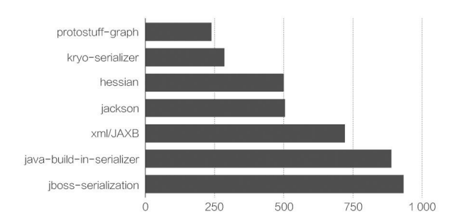
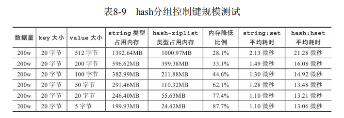
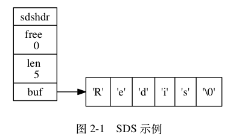
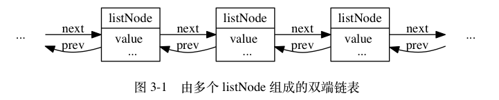
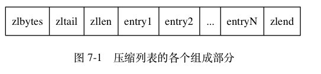
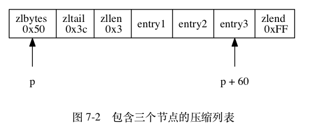
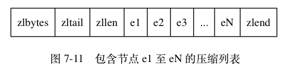

# 运维

## 内存

可通过执行info memory 命令获取内存相关指标

| 指标                    | 含义                                                         |
| :---------------------- | :----------------------------------------------------------- |
| used_memory             | 是从Redis的角度得到的量，他表示的是Redis分配器分配的内存总量。 |
| used_memory_rss         | 表示Redis进程占据操作系统的内存，与top及ps命令看到的值是一致的。这个值除了包含分配器分配的内存之外，还包括了因为内存碎片、内存对齐引入的开销 |
| used_memory_peak        | redis的内存消耗峰值(以字节为单位)，即历史使用记录中redis使用内存峰值。 |
| used_memory_peak_perc   | 使用内存达到峰值内存的百分比，used_memory/ used_memory_peak) *100%，即当前redis使用内存/历史使用记录中redis使用内存峰值*100% |
| used_memory_overhead    | Redis为了维护数据集的内部机制所需的内存开销，包括所有客户端输出缓冲区、查询缓冲区、AOF重写缓冲区和主从复制的backlog。 |
| used_memory_startup     | Redis服务器启动时消耗的内存                                  |
| used_memory_dataset     | 数据实际占用的内存大小，即used_memory-used_memory_overhead   |
| total_system_memory     | 整个系统内存                                                 |
| used_memory_lua         | Lua脚本存储占用的内存                                        |
| maxmemory               | Redis实例的最大内存配置                                      |
| maxmemory_policy        | 当达到maxmemory时的淘汰策略                                  |
| mem_fragmentation_ratio | 碎片率，used_memory_rss/ used_memory。                       |
| mem_allocator           | 内存分配器                                                   |

需要重点关注的指标有`mem_fragmentation_ratio`

- 当`mem_fragmentation_ratio>1`时，说明有内存碎片
- 当`mem_fragmentation_ratio<1`时，说明正在使用虚拟内存

Redis进程内消耗主要包括：自身内存、对象内存、缓冲内存、内存碎片

- 自身内存可以忽略不计
- 对象内存是Redis内存占用最大的一块，存储着用户所有的数据
- 缓冲内存主要包括：客户端缓冲、复制积压缓冲区、AOF缓冲区
- Redis默认的内存分配器采用jemalloc，可选的分配器还有：glibc、 tcmalloc。jemalloc采用分层固定块的策略。比如当保存5KB对象时，jemalloc可能会采用8KB的块存储，而剩下的3KB 空间变为了内存碎片不能再分配给其他对象存储。

Redis使用`maxmemory`参数限制最大可用的对象内存（默认是尽可能地使用所有可用内存）。值得注意的是，maxmemory限制的是Redis实际使用的内存量，也就是 used_memory统计项对应的内存。这也就是说，输出缓冲区/Lua缓存等等不受maxmemory限制，但却考虑在maxmemory内。此外，还可以通过`config set maxmemory`进行动态修改。

 

Redis的内存回收机制主要体现在以下两个方面：

- 删除到达过期时间的键对象
- 内存使用达到maxmemory上限

对于第一个方面，Redis采用「惰性删除」和「定时任务删除」机制，来实现过期键的内存回收。

- 惰性删除：惰性删除用于当客户端读取带有超时属性的键时，如果已 经超过键设置的过期时间，会执行删除操作并返回空值。但是这有内存泄露的问题，即过期键一直不会被访问到
- Redis内部维护一个定时任务，默认每秒运行10次（通过配置`hz`设置）。在定时任务中，执行删除键的操作**redis.c/activeExpireCycle**
  1. 循环遍历全部redisDb，随机抽取20个键值，如果发现过期就直接删除。
  2. 判断20个键值中的25%(也就是5个)是否过期。如果小于等于25%，则退出当前redisDb的循环，继续下一个redisDb
  3. 如果大于25%，继续抽取20个键值进行循环，每次判断总的执行时间是否超过25毫秒
     - 超过25毫秒，过期进入快模式(超时时间会变短，1ms)
     - 没超过25毫秒，则退出当前redisDb的循环，继续下一个redisDb

当Redis所用内存达到`maxmemory`上限时，就会触发相应的溢出控制策略：

- `noeviction`：默认策略，不会删除任何数据，拒绝所有写入操作并返回客户端错误信息，此时Redis只响应读操作。
- `volatile-lru`：根据LRU算法删除设置了expire属性的键（无论它是否过期），直到腾出足够空间为止。如果没有可删除的键对象，回退到`noeviction`策略。
- `allkeys-lru`：根据LRU算法删除键，无论数据是否设置了expire属性， 直到腾出足够空间为止。
- `allkeys-random`：随机删除所有键
- `volatile-random`：随机删除设置了expire属性的键
- `volatile-ttl`：根据键值对象的`ttl`属性，删除最近将要过期数据。如果没有，回退到`noeviction`策略。

 具体策略受`maxmemory-policy`参数控制，内存溢出控制策略可以采用`config set maxmemory -policy {policy}`来动态配置。

每次Redis执行命令时都会检查是否满足maxmeory参数的约束。

降低Redis内存使用最直接的方式就是分别缩减键（key）和值（value）的长度：

- 尽量使用短名称来命名键

- 可以通过把业务对象序列化成二进制数组并放入Redis中，来减少值的长度。此外，应该选择更高效的序列化工具来尽可能地压缩长度

  

  

  除了存储二进制数据之外，还可以存储json、xml格式的文本数据。这种方式优点是方便调试和跨语言，但是对于内存的要求更高，可以考虑使用一些压缩算法。

我们也可以减少键的数量，例如，把大量键分组映射到多个hash结构中降低键的数量

- hash的field可用于记录原始key字符串
- hash的value保存原始值对象

通过这个测试数据，可以说明ziplist编码的hash类型：

- 更节约内存。
- 写入更耗时

这样做的坏处是hash重构后所有的键，无法再使用超时（expire）和LRU淘汰机制自动删除。但开发人员可以存储每个对象写入的时间，再通过定时任务使用hscan命令扫描数据，找出hash内超时的数据项删除即可。

## 字符串

Redis 没有直接使用 C 语言传统的字符串表示（以空字符结尾的字符数组，以下简称 C 字符串）， 而是自己构建了一种名为简单动态字符串（simple dynamic string，SDS）的抽象类型， 并将 SDS 用作 Redis 的默认字符串表示。

~~~c
struct sdshdr {
    // 记录 buf 数组中已使用字节的数量
    // 等于 SDS 所保存字符串的长度
    int len;

    // 记录 buf 数组中未使用字节的数量
    int free;

    // 字节数组，用于保存字符串
    char buf[];

};
~~~

这样做的好处有：

- **以O(1)复杂度获取字符串的长度**

- **杜绝缓冲区溢出**。当 SDS API 需要对 SDS 进行修改时， API 会先检查 SDS 的空间是否满足修改所需的要求。若不满足， API 会自动将 SDS 的空间扩展至执行修改所需的大小。

- 减少修改字符串所带来的内存分配次数。

  - 如果程序执行的是增长字符串的操作， 比如拼接操作（append），那么必须重分配内存，扩展所需的空间，以避免缓冲区溢出。
  - 如果程序执行的是缩短字符串的操作， 比如截断操作（trim），那么必须重分配内存，抛除掉不需要的空间，以避免内存泄露

  而SDS采用了空间预分配机制，用于优化SDS字符串增长操作。即当 SDS  API需要扩展一个 SDS 空间时，会额外分配一些空间，具体策略如下：

  - 如果对 SDS 进行修改后， SDS 的长度（也即是 `len` 属性的值）小于 `1 MB`，那么等额分配一个空间。举个例子， 如果进行修改之后， SDS 的 `len` 将变成 `13` 字节， 那么程序也会分配 `13` 字节的未使用空间， SDS 的 `buf` 数组的实际长度将变成 `13 + 13 + 1 = 27` 字节
  - 如果对 SDS 进行修改之后， SDS 的长度将大于等于 `1 MB` ， 那么会分配一个1MB大小的空间。举个例子， 如果进行修改之后， SDS 的 `len` 将变成 `30 MB` ， 那么程序会分配 `1 MB` 的未使用空间， SDS 的 `buf` 数组的实际长度将为 `30 MB + 1 MB + 1 byte` 。

  惰性空间释放用于优化 SDS 的字符串缩短操作：当 SDS 的 API 需要缩短 SDS 保存的字符串时， 程序并不立即使用内存重分配来回收缩短后多出来的字节， 而是使用 `free` 属性将这些字节的数量记录起来， 并等待将来使用。与此同时， SDS 也提供了相应的 API ， 让我们可以在有需要时， 真正地释放 SDS 里面的未使用空间， 所以不用担心惰性空间释放策略会造成内存浪费。

- 二进制安全，SDS API会以二进制来解释字符串，这样Redis 不仅可以保存文本数据， 还可以保存任意格式的二进制数据。

- 兼容C字符串函数

Redis 会在初始化服务器时， 创建一万个**字符串对象**， 这些对象包含了从 `0` 到 `9999` 的所有整数值， 当服务器需要用到值为 `0` 到 `9999` 的字符串对象时， 服务器就会使用这些共享对象， 而不是新创建对象。

> 创建共享字符串对象的数量可以通过修改 `redis.h/REDIS_SHARED_INTEGERS` 常量来修改。

另外， 这些共享对象不单单只有字符串键可以使用， 那些在数据结构中嵌套了字符串对象的对象（`linkedlist` 编码的列表对象、 `hashtable` 编码的哈希对象、 `hashtable` 编码的集合对象、以及 `zset` 编码的有序集合对象）都可以使用这些共享对象。但是由于压缩列表（ziplist）的实现，它并不共享对象。而且还要注意这种共享对于maxmemory + lru淘汰策略的影响

像json这样的数据可以使用hash结构，而不是作为一个字符串整体来存储。

## 链表的实现

每个链表节点使用一个 `adlist.h/listNode` 结构来表示：

~~~c
typedef struct listNode {

    // 前置节点
    struct listNode *prev;

    // 后置节点
    struct listNode *next;

    // 节点的值
    void *value;

} listNode;
~~~

~~~c
typedef struct list {

    // 表头节点
    listNode *head;

    // 表尾节点
    listNode *tail;

    // 链表所包含的节点数量
    unsigned long len;

    // 节点值复制函数
    void *(*dup)(void *ptr);

    // 节点值释放函数
    void (*free)(void *ptr);

    // 节点值对比函数
    int (*match)(void *ptr, void *key);

} list;
~~~

## 压缩列表

压缩列表是 Redis 为了节约内存而开发的， 由一系列特殊编码的连续内存块组成的顺序型（sequential）数据结构。

一个压缩列表的各个组成部分

| 属性      | 类型       | 长度     | 用途                                                         |
| :-------- | :--------- | :------- | :----------------------------------------------------------- |
| `zlbytes` | `uint32_t` | `4` 字节 | 记录整个压缩列表占用的内存字节数：在对压缩列表进行内存重分配， 或者计算 `zlend` 的位置时使用。 |
| `zltail`  | `uint32_t` | `4` 字节 | 记录压缩列表表尾节点距离压缩列表的起始地址有多少字节： 通过这个偏移量，程序无须遍历整个压缩列表就可以确定表尾节点的地址。 |
| `zllen`   | `uint16_t` | `2` 字节 | 记录了压缩列表包含的节点数量： 当这个属性的值小于 `UINT16_MAX` （`65535`）时， 这个属性的值就是压缩列表包含节点的数量； 当这个值等于 `UINT16_MAX` 时， 节点的真实数量需要遍历整个压缩列表才能计算得出。 |
| `entryX`  | 列表节点   | 不定     | 压缩列表包含的各个节点，节点的长度由节点保存的内容决定。     |
| `zlend`   | `uint8_t`  | `1` 字节 | 特殊值 `0xFF` （十进制 `255` ），用于标记压缩列表的末端。    |

每个压缩列表节点可以保存一个字节数组或者一个整数值， 其中， 字节数组可以是以下三种长度的其中一种：

1. 长度小于等于 `63` （2^{6}-1）字节的字节数组；
2. 长度小于等于 `16383` （2^{14}-1） 字节的字节数组；
3. 长度小于等于 `4294967295` （2^{32}-1）字节的字节数组；

而整数值则可以是以下六种长度的其中一种：

1. `4` 位长，介于 `0` 至 `12` 之间的无符号整数；
2. `1` 字节长的有符号整数；
3. `3` 字节长的有符号整数；
4. `int16_t` 类型整数；
5. `int32_t` 类型整数；
6. `int64_t` 类型整数。

每个压缩列表节点都由 `previous_entry_length` 、 `encoding` 、 `content` 三个部分组成， 如图 7-4 所示。

![digraph {      label = "\n 图 7-4    压缩列表节点的各个组成部分";      node [shape = record];      n [label = " previous_entry_length | encoding | content "];  }](assets/graphviz-cc6b40e182bfc142c12ac0518819a2d949eafa4a.png)

- 节点的 `previous_entry_length` 属性以字节为单位， 记录了压缩列表中前一个节点的长度。

  - 如果前一节点的长度小于 `254` 字节， 那么 `previous_entry_length` 属性的长度为 `1` 字节： 前一节点的长度就保存在这一个字节里面。
  - 如果前一节点的长度大于等于 `254` 字节， 那么 `previous_entry_length` 属性的长度为 `5` 字节： 其中属性的第一字节会被设置为 `0xFE` （十进制值 `254`）， 而之后的四个字节则用于保存前一节点的长度。

  这样就可以方便地计算出前一个节点的起始地址

- 节点的 `encoding` 属性记录了节点的 `content` 属性所保存数据的类型以及长度：

  表 7-2 字节数组编码

  | 编码                                           | 编码长度 | `content` 属性保存的值                 |
  | :--------------------------------------------- | :------- | :------------------------------------- |
  | `00bbbbbb`                                     | `1` 字节 | 长度小于等于 `63` 字节的字节数组。     |
  | `01bbbbbb xxxxxxxx`                            | `2` 字节 | 长度小于等于 `16383` 字节的字节数组。  |
  | `10______ aaaaaaaa bbbbbbbb cccccccc dddddddd` | `5` 字节 | 长度小于等于 `4294967295` 的字节数组。 |

  表 7-3 整数编码

  | 编码       | 编码长度 | `content` 属性保存的值                                       |
  | :--------- | :------- | :----------------------------------------------------------- |
  | `11000000` | `1` 字节 | `int16_t` 类型的整数。                                       |
  | `11010000` | `1` 字节 | `int32_t` 类型的整数。                                       |
  | `11100000` | `1` 字节 | `int64_t` 类型的整数。                                       |
  | `11110000` | `1` 字节 | `24` 位有符号整数。                                          |
  | `11111110` | `1` 字节 | `8` 位有符号整数。                                           |
  | `1111xxxx` | `1` 字节 | 使用这一编码的节点没有相应的 `content` 属性， 因为编码本身的 `xxxx` 四个位已经保存了一个介于 `0` 和 `12` 之间的值， 所以它无须 `content` 属性。 |

Redis 将在特殊情况下产生的连续多次空间扩展操作称之为**“连锁更新”（cascade update）**。

现在， 考虑这样一种情况： 在一个压缩列表中， 有多个连续的、长度介于 `250` 字节到 `253` 字节之间的节点 `e1` 至 `eN` 

这时， 如果我们将一个长度大于等于 `254` 字节的新节点 `new` 设置为压缩列表的表头节点。因为 `e1` 的 `previous_entry_length` 属性仅长 `1` 字节， 它没办法保存新节点 `new` 的长度， 所以程序将对压缩列表执行空间重分配操作， 并将 `e1` 节点的 `previous_entry_length` 属性从原来的 `1` 字节长扩展为 `5` 字节长。此时这对于e2、e3 ... eN来说都成立，那么恐怖的连锁更新就发生了。

因为连锁更新在最坏情况下需要对压缩列表执行 `N` 次空间重分配操作， 而每次空间重分配的最坏复杂度为 O(N) ， 所以连锁更新的最坏复杂度为 O(N^2) 。

## 字典

## 对象

Redis通过redisObject结构体来定义值对象

~~~c
typedef struct redisObject {
    unsigned type:4;       // RedisObject的类型
    unsigned encoding:4;   // 同一种类型的RedisObject数据有不同的编码形式
    unsigned lru:LRU_BITS; // 记录对象最后一次被访问的时间，用于LRU算法中
    int refcount;          // 引用计数，在Redis中同一个RedisObject可能被多个地方共用
    void *ptr;             // 指向底层实现数据结构的指针
} robj;
~~~

使用`object idletime {key}`命令，可以在不更新lru字段情况下，查看当前键的过期时间。

- 对象的 `type` 属性记录了对象的类型

  | 类型常量       | 对象的名称   |
  | :------------- | :----------- |
  | `REDIS_STRING` | 字符串对象   |
  | `REDIS_LIST`   | 列表对象     |
  | `REDIS_HASH`   | 哈希对象     |
  | `REDIS_SET`    | 集合对象     |
  | `REDIS_ZSET`   | 有序集合对象 |

- `encoding` 属性记录了对象所使用的编码

  | 编码常量                    | 编码所对应的底层数据结构      |
  | :-------------------------- | :---------------------------- |
  | `REDIS_ENCODING_INT`        | `long` 类型的整数             |
  | `REDIS_ENCODING_EMBSTR`     | `embstr` 编码的简单动态字符串 |
  | `REDIS_ENCODING_RAW`        | 简单动态字符串                |
  | `REDIS_ENCODING_HT`         | 字典                          |
  | `REDIS_ENCODING_LINKEDLIST` | 双端链表                      |
  | `REDIS_ENCODING_ZIPLIST`    | 压缩列表                      |
  | `REDIS_ENCODING_INTSET`     | 整数集合                      |
  | `REDIS_ENCODING_SKIPLIST`   | 跳跃表和字典                  |

  每种类型的对象都至少使用了两种不同的编码

  | `REDIS_STRING` | `REDIS_ENCODING_INT`        | 使用整数值实现的字符串对象。                         |
  | -------------- | --------------------------- | ---------------------------------------------------- |
  | `REDIS_STRING` | `REDIS_ENCODING_EMBSTR`     | 使用 `embstr` 编码的简单动态字符串实现的字符串对象。 |
  | `REDIS_STRING` | `REDIS_ENCODING_RAW`        | 使用简单动态字符串实现的字符串对象。                 |
  | `REDIS_LIST`   | `REDIS_ENCODING_ZIPLIST`    | 使用压缩列表实现的列表对象。                         |
  | `REDIS_LIST`   | `REDIS_ENCODING_LINKEDLIST` | 使用双端链表实现的列表对象。                         |
  | `REDIS_HASH`   | `REDIS_ENCODING_ZIPLIST`    | 使用压缩列表实现的哈希对象。                         |
  | `REDIS_HASH`   | `REDIS_ENCODING_HT`         | 使用字典实现的哈希对象。                             |
  | `REDIS_SET`    | `REDIS_ENCODING_INTSET`     | 使用整数集合实现的集合对象。                         |
  | `REDIS_SET`    | `REDIS_ENCODING_HT`         | 使用字典实现的集合对象。                             |
  | `REDIS_ZSET`   | `REDIS_ENCODING_ZIPLIST`    | 使用压缩列表实现的有序集合对象。                     |
  | `REDIS_ZSET`   | `REDIS_ENCODING_SKIPLIST`   | 使用跳跃表和字典实现的有序集合对象。                 |

  因为 Redis 可以根据不同的使用场景来为一个对象设置不同的编码， 从而优化对象在某一场景下的效率。

