## Info

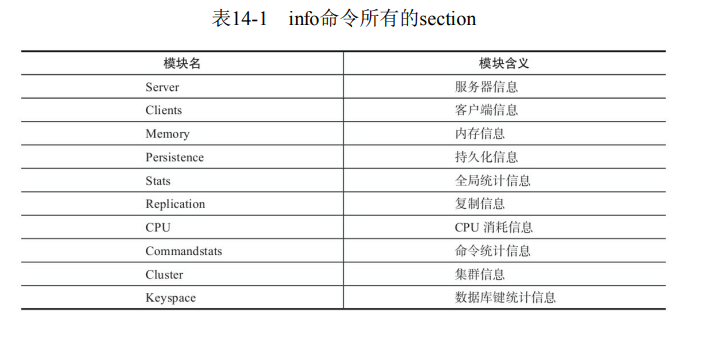

### Server

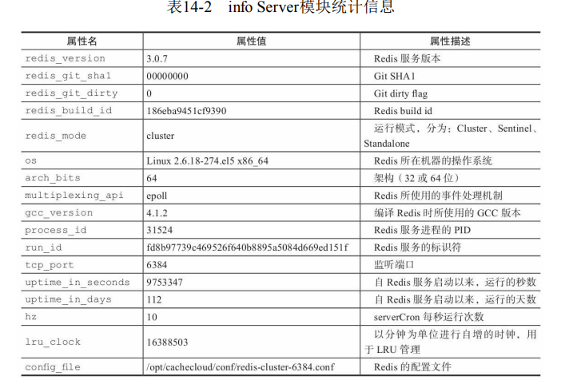

### Clients

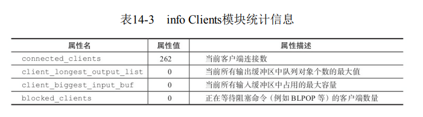

### Memory

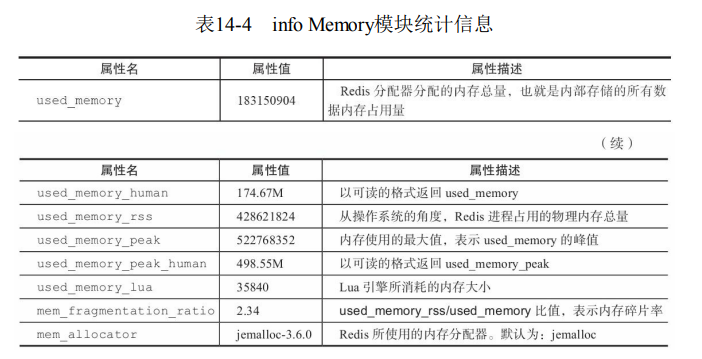

### Persistence

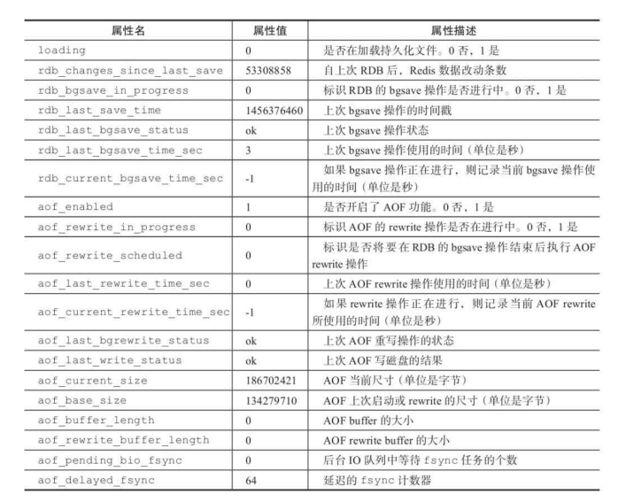

### Stats

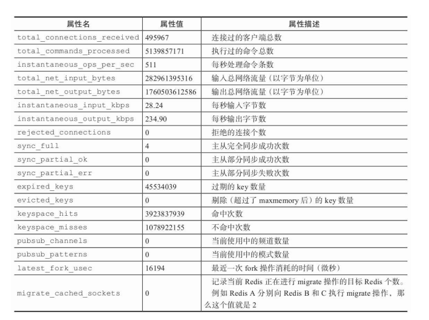

### Replication

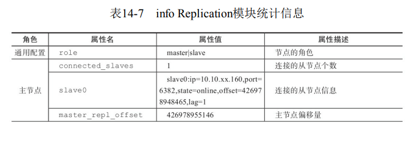

### CPU

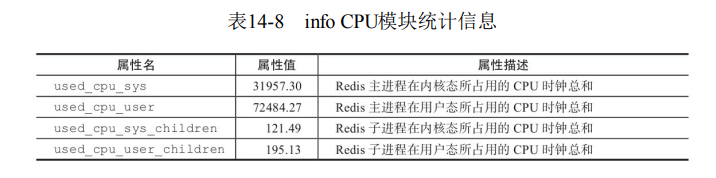

### Commandstats

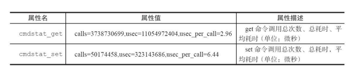

### Cluster

## 配置

### 总体

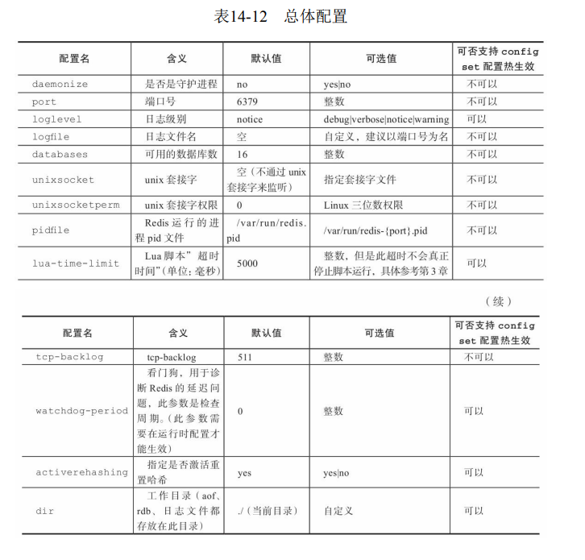

### 最大内存

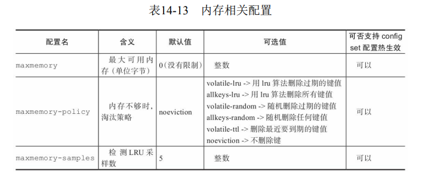

### AOF

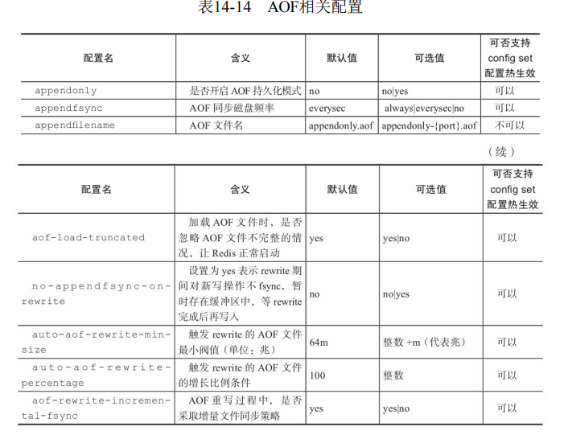

### RDB

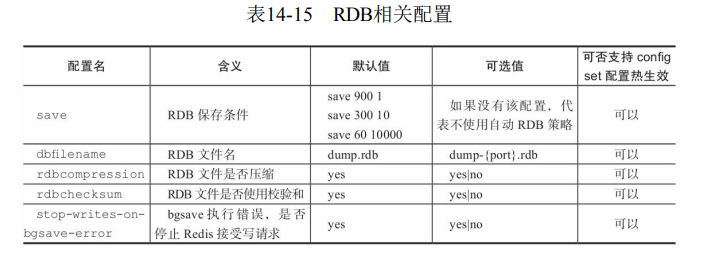

### 慢查询

### 数据结构优化

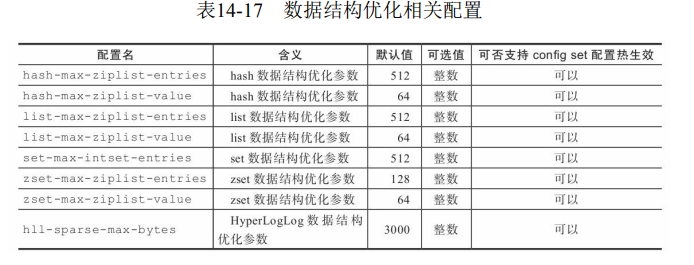

### 复制

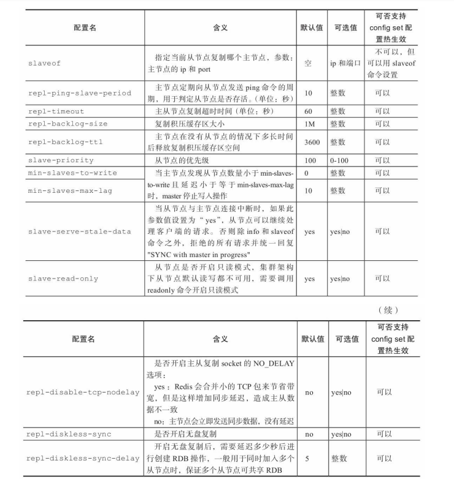

### 客户端

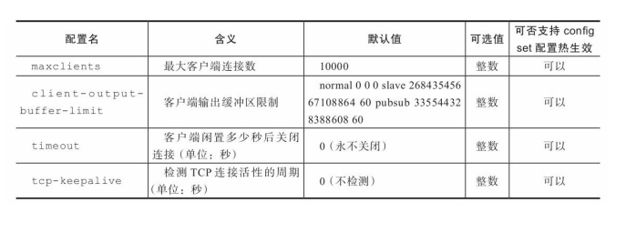

### 安全

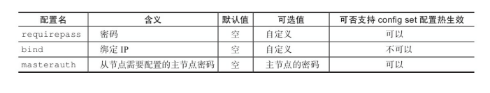