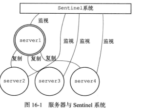
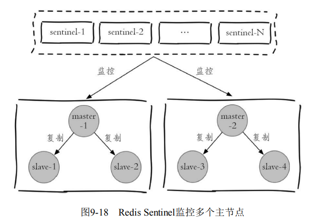
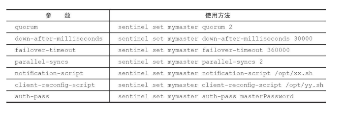

# 集群 & 分布式

[TOC]

## Sentinel 概述

Redis的主从复制模式下，一旦主节点由于故障不能提供服务，需要人工介入做以下两件事情

- 某个从节点晋升为主节点`slaveof no one`
- 通知从节点更新主节点地址
- 如果旧的主节点恢复上线，那么旧的主节点降级为从节点

在很多场景下，这种故障处理的方式是无法接受的：

- 应用方无法及时感知到主节点的变化，必然会造成一定的写数据丢失和读数据错误
- 整个故障转移的过程是需要人工来介入的，在故障转移实时性和准确性上，都无法得到保障

Redis从2.8开始正式提供了Redis Sentinel（哨兵）架构来解决这个问题。Redis Sentinel是一个分布式架构，其中包含若干个Sentinel节点和Redis 数据节点，每个Sentinel节点会对数据节点和其余Sentinel节点进行监控。如果发现主节点不可达时，那么会选举出一个新的主节点，这整个故障转移过程是全自动的。

> - Redis数据节点：主节点和从节点
> - Sentinel节点：监控Redis数据节点
> - Redis Sentinel：Sentinel节点和数据节点
> - 应用方：泛指一个或多个客户端

## 部署Sentinel

首先编写配置文件：

~~~
port 26379
daemonize yes
logfile "26379.log"
sentinel monitor mymaster 127.0.0.1 6379 2
sentinel down-after-milliseconds mymaster 30000
sentinel parallel-syncs mymaster 1
sentinel failover-timeout mymaster 180000
#sentinel auth-pass <master-name> <password>
#sentinel notification-script <master-name> <script-path>
#sentinel client-reconfig-script <master-name> <script-path>
~~~

然后开启

~~~shell
$ redis-sentinel redis-sentinel-26379.conf
~~~

或者

~~~shell
$ redis-server redis-sentinel-26379.conf --sentinel
~~~

通过info sentinel命令查看sentinel节点的信息

~~~shell
$ redis-cli -h 127.0.0.1 -p 26379 info Sentinel
# Sentinel
sentinel_masters:1
sentinel_tilt:0
sentinel_running_scripts:0
sentinel_scripts_queue_length:0
master0:name=mymaster,status=ok,address=127.0.0.1:6379,slaves=2,sentinels=3
~~~

**sentinel节点会自动关联主节点上的其他sentinel节点。**

Redis Sentinel可以同时监控多个主节点，只需指定多个masterName来区分不同的主节点 即可

~~~shell
sentinel monitor master-business-1 10.10.xx.1 6379 2
sentinel down-after-milliseconds master-business-1 60000
sentinel monitor master-business-2 10.16.xx.2 6380 2
sentinel down-after-milliseconds master-business-2 10000
~~~

Sentinel节点也支持动态地设置参数

~~~shell
sentinel set <param> <value>
~~~

- sentinel set命令只对当前Sentinel节点有效。一定要保证多个Sentinel之间的配置一样。
- sentinel set命令如果执行成功会立即刷新配置文件，这点和Redis普 通数据节点设置配置需要执行config rewrite刷新到配置文件不同。

下面讲解一下它的配置项

~~~
sentinel monitor <master-name> <ip> <port> <quorum>
~~~

- `quorum`，代表要判定主节点最终不可达所需要的票数。建议设置为 $\frac{sentinel节点}{2} + 1$

~~~
sentinel down-after-milliseconds <master-name> <times>
~~~

每个Sentinel节点都要通过定期发送ping命令来判断Redis数据节点和其余Sentinel节点是否可达，如果超过了down-after-milliseconds配置的时间且没有有效的回复，则判定节点不可达

~~~c
sentinel parallel-syncs <master-name> <nums>
~~~

parallel-syncs就是用来限制在一次故障转移之后，每次向新的主节 点发起复制操作的从节点个数。例如，parallelsyncs=3表示每次会有三个从节点并行发起复制；parallel-syncs=1表示从节点会轮询发起复制。

~~~
sentinel failover-timeout <master-name> <times>
~~~

failover-timeout表示超时时间，分别作用于故障转移的各个阶段：

1. 选出合适从节点。

2. 晋升选出的从节点为主节点。

   如果sentinel节点向（1）阶段选出来的从节点执行`slaveof no one`超过failover-timeout，那么故障转移失败。

   在（2）阶段如果执行成功，sentinel还会继续执行info命令来确认（1）阶段选出来的节点确实晋升为主节点，如果此过程执行时间超过failover-timeout时，则故障转移失败.

3. 其余从节点复制新的主节点。

   如果（3）节点执行时间超过了failover-timeout（不包含复制时间），则故障转移失败

4. 旧的主节点恢复后，复制新的主节点。

如果故障转移失败，那么等待$2 * timeout$后再次进行故障转移操作

~~~
sentinel auth-pass <master-name> <password>
~~~

当Master设置了密码时，Sentinel连接Master时需要通过设置参数`auth-pass`，来提供相应的密码。

~~~shell
sentinel notification-script
~~~

在故障转移期间，当一些警告级别的 Sentinel事件发生（例如，-sdown：客观下线、-odown：主观下 线）时，会执行指定路径的脚本，并向脚本发送相应的事件参数。

~~~shell
#!/bin/sh
#获取所有参数
msg=$*
#报警脚本或者接口，将msg作为参数
exit 0
~~~

~~~
sentinel client-reconfig-script
~~~

在故障转移结束后，会执行指定路径的脚本，并向脚本发送与故障转移结果相关的参数。

## Sentinel API

Sentinel不能使用数据节点的命令，例如set、get。它有自己的一套命令

~~~shell
sentinel master<master name>
~~~

输出指定被监控的主节点的状态

~~~shell

~~~

