## 集群

[TOC]

## 概述

分布式数据库首先要解决的是，把整个数据集按照分区规则映射到多个节点的问题，即把数据集划分到多个节点上，每个节点负责整体数据的一个子集。

常见的分区规则有：

- **哈希分区**：对Key使用Hash，适用于无法预估数据分布，或者对负载均衡有要求的情况
- **顺序分区**：将Key的值域进行固定划分，适用于查询优化的情况

哈希设计有以下三种策略

- `hash(key) % N`，其中`N`为节点的数量。这种策略简单，但是当扩容（收缩）节点时，需要重新计算所有键的hash值，这会导致数据的迁移。
- **一致性哈希分区（Distributed Hash Table）**，为每个节点分配一个`token`。先根据Key计算出Hash值，然后顺时针找到第一个大于等于该Hash值得token节点。 这样当节点变更时，只会影响环中的相邻节点。
- 虚拟槽分区（Redis集群采用的方案）。通过一个哈希函数把所有数据映射到一个固定范围的整数集合中，集合中的每个整数称为槽（slot），每个节点负责一定数量的槽。

Redis集群的局限性

- 对key的批量操作支持有限。例如，对于mset、mget命令，目前只支持对具有相同slot值的 key执行批量操作
- 对key的事务操作支持有限。只支持多key在同一节点上的事务操作
- 不支持多数据库空间。集群模式下只能使用一个数据库空间，即db0。
- 复制结构只支持一层，从节点只能复制主节点，不支持嵌套树状复制结构。

## 节点

连接各个**集群节点**的工作，可以使用`CLUSTER MEET`命令来完成。

~~~shell
$ CLUSTER MEET <ip> <port> 
~~~

通过`CLUSTER NODE`可以查看集群的状态。

Redis服务器在启动时会根据`cluster-enabled`配置选项，来决定是否开启服务器的集群模式。

~~~shell
#节点端口
port 6379
# 开启集群模式
cluster-enabled yes
# 节点超时时间，单位毫秒
cluster-node-timeout 15000
# 集群内部配置文件
cluster-config-file "nodes-6379.conf"
~~~

如果集群配置文件没有的话，就在`${REDIS_HOME}`中创建一个，文件名由`cluster-config-file`指定。

每个节点都会使用一个`clusterNode`结构，来记录自己和集群中其他所有节点的状态

~~~c
struct clusterNode {

  // 创建节点的时间
  mstime_t ctime;

  // 节点的名字，由40个十六进制字符组成
  // 例如68eef66df23420a5862208ef5b1a7005b806f2ff
  char name[REDIS_CLUSTER_NAMELEN];

  // 节点标识
  // 使用各种不同的标识值记录节点的角色（比如主节点或者从节点），
  // 以及节点目前所处的状态（比如在线或者下线）。
  int flags;

  // 节点当前的配置纪元，用于实现故障转移
  uint64_t configEpoch;

  // 节点的IP地址
  char ip[REDIS_IP_STR_LEN];

  // 节点的端口号
  int port;

  // 保存连接节点所需的有关信息
  clusterLink *link;

  // ...
};

typedef struct clusterLink {

  // 连接的创建时间
  mstime_t ctime;

  // TCP 套接字描述符
  int fd;

  // 输出缓冲区，保存着等待发送给其他节点的消息（message）。
  sds sndbuf;

  // 输入缓冲区，保存着从其他节点接收到的消息。
  sds rcvbuf;

  // 与这个连接相关联的节点，如果没有的话就为NULL 
  struct clusterNode *node;

} clusterLink;
~~~

> redisClient结构和clusterLink结构都有自己的套接字描述符和输入、输出缓冲区，这两个结构的区别在于，
>
> - redisClient结构中的资源用于连接客户端的
> - clusterLink结构中的资源用于连接节点的

最后，每个节点都保存着一个clusterState结构，这个结构记录了在当前节点的视角下，集群目前所处的状态：

~~~c
typedef struct clusterState {

  // 指向当前节点的指针
  clusterNode *myself;

  // 集群当前的配置纪元，用于实现故障转移
  uint64_t currentEpoch;

  // 集群当前的状态：是在线还是下线
  int state;

  // 集群中至少处理着一个槽的节点的数量
  int size;

  // 集群节点名单（包括myself节点）
  // 字典的键为节点的名字，字典的值为节点对应的clusterNode结构
  dict *nodes;
  
  // ...

} clusterState;
~~~

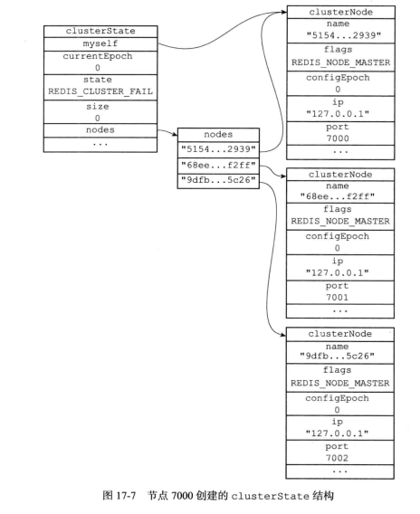

CLUSTER MEET命令的握手过程

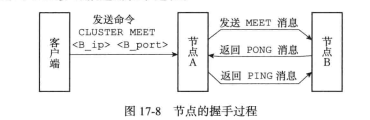

在成功执行`CLUSTER MEET`命令之后，节点A会将节点B的信息通过Gossip协议传播给集群中的其他节点，让其他节点也与节点B进行握手，最终，经过一段时间之后，节点B会被集群中的所有节点认识。

## 槽分配

集群的整个数据库被分为16384个槽（slot），数据库中的每个键都属于这16384个槽的其中一个。当数据库中的16384个槽都有节点在处理时，集群处于**上线状态（ok）**，否则处于**下线状态（fail）**。

通过向节点发送CLUSTER ADDSLOTS命令，我们可以将槽分配到指定节点中：

~~~shell
$ CLUSTER ADDSLOTS <slot> [slot ...]

# 例子，将槽0至槽5000指派给节点负责
$ CLUSTER ADDSLOTS 0 1 2 3 4 ... 5000
~~~

clusterNode结构的slots属性和numslot属性记录了节点负责处理哪些槽：

~~~c
struct clusterNode {
  // ...
  unsigned char slots[16384/8];
  int numslots;
  // ...
};
~~~

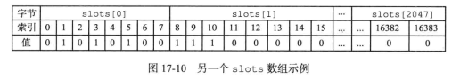

一个节点还会将自己的slots数组通过消息发送给集群中的其他节点，以此来告知其他节点自己目前负责处理哪些槽。

当其他节点通过消息接收到slots数组时，该节点会在自己的clusterState.nodes字典中查找节点B对应的clusterNode结构，并对结构中的slots数组进行保存或者更新。

clusterState结构中的slots数组记录了集群中所有16384个槽的指派信息：

~~~c
typedef struct clusterState {
  // ...
  clusterNode *slots[16384];
  // ...
} clusterState;
~~~

- 如果slots[i]指针指向NULL，那么表示槽i尚未指派给任何节点。
-  如果slots[x] 指针指向一个clusterNode 结构，那么表示槽x已经指派给了clusterNode 结构所对应的节点。

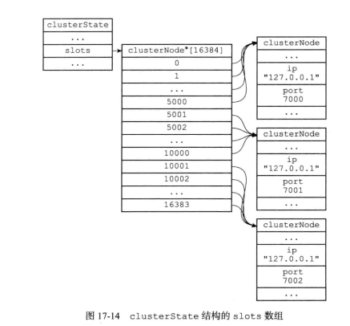

那么为了知道槽x是否已经被指派，或者槽x被指派给了哪个节点，程序需要遍历slots数组，复杂度为$\Omicron(n)$。但是判断节点是否持有槽x的时间复杂度为$\Omicron(1)$

CLUSTER ADDSLOTS 命令的实现可以用以下伪代码来表示：

~~~python
def CLUSTER_ADDSLOTS(*all_input_slots):
    # 遍历所有输入槽，检查它们是否都是未指派槽
    for i in all_input_slots:
        # 如果有哪怕一个槽已经被指派给了某个节点
        # 那么向客户端返回错误，并终止命令执行
        if clusterState.slots[i] != NULL:
            reply_error()
            return
    # 如果所有输入槽都是未指派槽
    # 那么再次遍历所有输入槽，将这些槽指派给当前节点
    for i in all_input_slots:
        # 设置clusterState结构的slots数组
        # 将slots[i]的指针指向代表当前节点的clusterNode结构
        clusterState.slots[i] = clusterState.myself
        # 访问代表当前节点的clusterNode结构的slots数组
        # 将数组在索引i上的二进制位设置为1
        setSlotBit(clusterState.myself.slots, i)
~~~

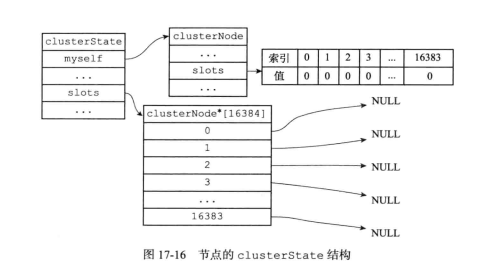

## 在集群中执行命令

当客户端向节点发送与键有关的命令时，

1. 接收命令的节点会计算出命令要处理的键属于哪个槽
2. 检查这个槽是否指派给了自己（`clusterState.slots[i]`是否等于`clusterState.myself`）。
3. 如果键所在的槽正好就指派给了当前节点，那么节点直接执行这个命令，否则会向客户端返回一个MOVED 错误，指引客户端转向（redirect）至正确的节点（路由重定位）

MOVED错误的格式为：

~~~shell
$ MOVED <slot> <ip>:<port>
~~~

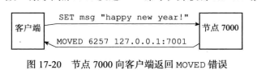

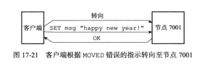

节点使用以下算法来计算给定键key属于哪个槽：

~~~python
def slot_number(key):
    return CRC16(key) & 16383
~~~

使用`CLUSTER KEYSLOT <key>`命令可以查看一个给定键属于哪个槽：

~~~shell
127.0.0.1:7000> CLUSTER KEYSLOT "date"
(integer) 2022

127.0.0.1:7000> CLUSTER KEYSLOT "msg"
(integer) 6257

127.0.0.1:7000> CLUSTER KEYSLOT "name"
(integer) 5798

127.0.0.1:7000> CLUSTER KEYSLOT "fruits"
(integer) 14943
~~~

以下是该命令的伪代码实现：

~~~python
def CLUSTER_KEYSLOT(key):
    # 计算槽号
    slot = slot_number(key)
    # 将槽号返回给客户端
    reply_client(slot)
~~~

> 被隐藏的MOVED错误
>
> 客户端启动时，携带`-c`选项，就可以进入集群模式
>
> ~~~shell
> $ redis-cli -c -p 7000 # 集群模式
> ~~~
>
> ~~~shell
> $ redis-cli -p 7000 # 单机模式
> ~~~
>
> 对于集群模式，它会根据MOVED错误自动进行节点转向。单击模式不理解MOVED错误，会在客户端中直接打印错误
>
> ~~~shell
> $ redis-cli -c -p 7000 # 集群模式
> 
> 127.0.0.1:7000> SET msg "happy new year!"
> -> Redirected to slot [6257] located at 
> 
> 
> $ redis-cli -p 7000 # 单机模式
> 
> 127.0.0.1:7000> SET msg "happy new year!"
> (error) MOVED 6257 127.0.0.1:7001
> ~~~

节点和单机服务器在数据库方面的一个区别是，节点只能使用0号数据库，而单机Redis服务器则没有这一限制。

另外，除了将键值对保存在数据库里面之外，节点还会用clusterState结构中的slots_to_keys跳跃表来保存槽和键之间的关系：

~~~c
typedef struct clusterState {
  // ...
  zskiplist *slots_to_keys;
  // ...
} clusterState;
~~~

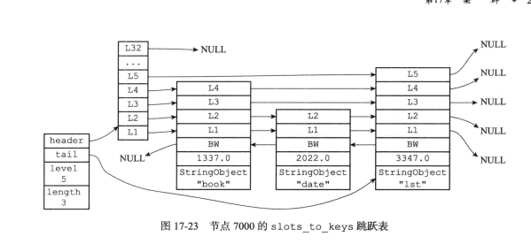

通过在`slots_to_keys`跳跃表中记录各个数据库键所属的槽，节点可以很方便地对属于某个或某些槽的所有键进行批量操作。例如，命令`CLUSTER GETKEYSINSLOT <slot> <count>`可以返回最多count个属于槽slot的键，而这个命令就是通过遍历slots_to_keys跳跃表来实现的。

## 重新分片

Redis集群的重新分片操作，可以将任意数量的已经指派给某个节点（源节点）的槽重新分配给另一个节点（目标节点）。并且与槽关联的键值对，也会从源节点被移动到目标节点。

该操作是由Redis的集群管理软件redis-trib负责的。

重分配

~~~shell
$ redis-trib.rb reshard host:port --from <arg> --to <arg> --slots <arg> --yes --timeout
<arg> --pipeline <arg>
~~~

节点下线

~~~shell
$ redistrib.rb del-node {host：port} {downNodeId}
~~~

重分配的步骤如下：

- redis-trib对目标节点发送`CLUSTER SETSLOT <slot> IMPORTING <source_id>` 命令，让目标节点准备好从源节点导入（import）属于槽slot的键值对。
- redis-trib对源节点发送`CLUSTER SETSLOT <slot> MIGRATING <target_id>`命令，让源节点准备好将属于槽slot的键值对迁移（migrate）至目标节点。
- redis-trib向源节点发送`CLUSTER GETKEYSINSLOT <slot> <count>`命令，获得最多count个属于槽slot的键值对的键名（key name）
- 对于步骤3获得的每个键名，redis-trib都向源节点发送一个`MIGRATE <target_ip> <target_port> <key_name> 0 <timeout>`命令，将被选中的键，原子地从源节点迁移至目标节点。
- 重复执行步骤3和步骤4，直到源节点保存的所有属于槽slot的键值对都被迁移至目标节点为止
- redis-trib向集群中的任意一个节点发送`CLUSTER SETSLOT <slot> NODE <target_id>`命令，这信息会通过消息发送至整个集群，最终集群中的所有节点都会知道槽slot已经指派给了目标节点。

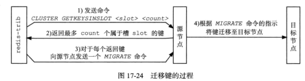

## ASK错误

在进行重新分配槽的期间，源节点的数据库保存一部分与槽关联的键值对，目标节点的保存另一部分。

clusterState结构体中的`importing_slots_from`数组记录了当前节点正在从其他节点导入的槽；而`migrating_slots_to`数组记录了当前节点正在迁移至其他节点的槽：

~~~c
typedef struct clusterState {
  // ...
  clusterNode *importing_slots_from[16384];
  clusterNode *migrating_slots_to[16384];
  // ...
} clusterState;
~~~

此时，当客户端向源节点发送一个与键有关的命令时

1. 源节点会先在自己的数据库里面查找指定的键，如果查找成功，那么直接执行客户端发送的命令，

2. 否则，节点会检查自己的`clusterState.migrating_slots_to[x]`，看键key所属的槽x是否正在进行迁移

3. 如果槽x的确在进行迁移的话，那么节点会向客户端发送一个ASK错误，引导客户端到目标节点去查找键key。

   ~~~shell
   ASK 16198 127.0.0.1:7003
   ~~~

4. 然后客户端向目标节点发送一个`ASKING`命令，之后再重新发送原本想要执行的命令。该命令唯一要做的就是，启用发送该命令的客户端的`REDIS_ASKING`标识。

   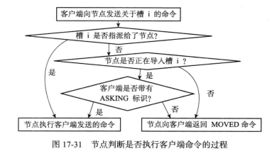

   **注意，在槽迁移过程中，并没有更新指派信息**

   如果客户端不发送`ASKING`命令，而直接发送想要执行的命令的话，那么客户端发送的命令将被节点拒绝执行，并返回`MOVED`错误。

   而且当节点执行了一个带有`REDIS_ASKING`标识的客户端命令之后，客户端的`REDIS_ASKING`标识就会被移除。

   

和隐藏的MOVED错误情况类似，集群模式的redis-cli在接到ASK错误时也不会打印错误。

## 复制与故障转移

Redis集群中的节点分为**主节点（master）**和**从节点（slave）**，其中主节点用于处理槽，而从节点则用于复制某个主节点，并在被复制的主节点下线时，代替下线主节点继续处理命令请求。

~~~shell
$ CLUSTER REPLICATE <node_id>
~~~

可以让接收命令的节点成为node_id所指定节点的从节点，并开始对主节点进行复制：

1. 接收到该命令的节点首先会在自己的clusterState.nodes字典中找到node_id所对应节点的clusterNode结构，并将自己的clusterState.myself.slaveof指针指向这个结构，以此来记录这个节点正在复制的主节点：

   ~~~c
   struct clusterNode {
       // 如果这是一个从节点，那么指向主节点
       struct clusterNode *slaveof;
   };
   ~~~

2. 然后节点会修改自己在`clusterState.myself.flags` 中的属性，关闭原本的`REDIS_NODE_MASTER`标识，打开`REDIS_NODE_SLAVE`标识

3. 最后，节点会调用复制代码，并根据`clusterState.myself.slaveof`所指向的`clusterNode`结构中的IP 地址和端口号，对主节点进行复制。

   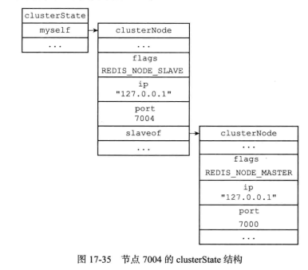

一个节点成为从节点这个信息，会通过消息发送给集群中的其他节点。

集群中的所有节点都会在主节点所对应的clusterNode结构中的slaves属性和numslaves属性，记录从节点的相关信息

~~~c
struct clusterNode {
    // 正在复制这个主节点的从节点数量
    int numslaves;

    // 一个数组
    // 每个数组项指向一个正在复制这个主节点的从节点的clusterNode结构
    struct clusterNode **slaves;

};
~~~

集群中的每个节点都会定期地向集群中的其他节点发送PING消息，以此来检测对方是否在线，如果接收PING消息的节点（目的节点）没有在规定的时间内，向源节点返回PONG消息，那么源节点就会将目的节点标记为**疑似下线（probable fail，PFAIL）**，即在`clusterState.nodes`字典中找到目标节点所对应的`clusterNode`结构体，然后在`flags`属性中打开`REDIS_NODE_PFAIL`标识。

集群中的各个节点会通过互相发送消息的方式来交换集群中各个节点的状态信息，例如某个节点是处于在线状态、疑似下线状态（PFAIL），还是已下线状态（FAIL）。

当一个主节点A通过消息得知，主节点B认为主节点C进入了疑似下线状态时，主节点A会在自己的`clusterState.nodes`字典中找到主节点C所对应的`clusterNode`结构体，并将主节点B的下线报告（failure report）添加到`clusterNode`结构的`fail_reports`链表里面：

~~~c
struct clusterNode {
  // 一个链表，记录了所有其他节点对该节点的下线报告
  list *fail_reports;
};
~~~

每个下线报告由`clusterNodeFailReport`结构体表示：
~~~c
struct clusterNodeFailReport {
  // 报告目标节点已经下线的节点
  struct clusterNode *node;

  // 最后一次从node节点收到下线报告的时间
  // 程序使用这个时间戳来检查下线报告是否过期
  // （与当前时间相差太久的下线报告会被删除）
  mstime_t time;
} typedef clusterNodeFailReport;
~~~

主节点7001，接收到主节点7002和主节点7003都认为主节点7000进入了疑似下线状态

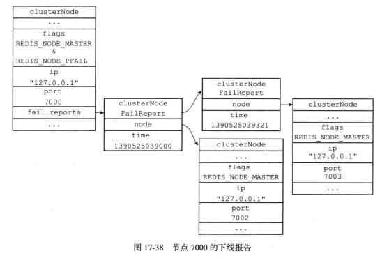

如果在一个集群里面，半数以上主节点都将某个主节点`x`报告为疑似下线，那么这个主节点`x`将被标记为已下线（FAIL）。将主节点`x`标记为已下线的节点，会向集群广播一条关于主节点x的FAIL消息，所有收到这条FAIL消息的节点都会立即将主节点x标记为已下线。

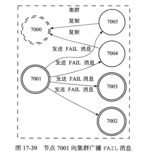

当一个从节点发现自己正在复制的主节点进入了已下线状态时，从节点将开始对下线主节点进行故障转移，以下是故障转移的执行步骤：

1. 选举出一个新的主节点
2. 被选中的从节点会执行SLAVEOF no one命令
3. 新的主节点会撤销所有对已下线主节点的槽，并将这些槽全部指派给自己。
4. 新的主节点向集群广播一条PONG消息，这条PONG消息可以让集群中的其他节点立即知道这个从节点变成了主节点。

以下是集群选举新的主节点的方法（Raft算法）：

- 集群的配置纪元是一个自增计数器，它的初始值为0。
- 当集群里的某个节点开始一次故障转移操作时，集群配置纪元的值会被增一。
- 当从节点发现自己的主节点进入下线状态时，从节点会往集群中广播一条`CLUSTERMSG_TYPE_FAILOVER_AUTH_REQUEST`消息，要求具有投票权的主节点向这个从节点投票。
- 在每个配置纪元中，集群里每个主节点都有一次投票的机会，而且只会投给一个请求票的从节点。主节点将向要求投票的从节点返回一条`CLUSTERMSG_TYPE_FAILOVER_AUTH_ACK`消息，表示这个主节点支持从节点成为新的主节点。
- 如果集群里有`N`个具有投票权的主节点，那么当一个从节点收集到大于等于`N/2+1`张支持票时，这个从节点就会当选为新的主节点。因为投票机制确保了新的主节点只会有一个
- 如果在一个配置纪元里面没有从节点能收集到足够多的支持票，那么集群进入一个新的配置纪元，并再次进行选举，直到选出新的主节点为止。

## 消息

集群中的各个节点通过发送和接收消息（message）来进行通信。

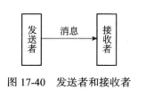

节点发送的消息主要有以下五种：

- MEET消息：当发送者接到客户端发送的CLUSTER MEET命令时，发送者会向接收者发送MEET消息，请求接收者加入到发送者当前所处的集群里面。
- PING 消息：集群里的每个节点默认每隔一秒钟就会从已知节点列表中随机选出五个节点，然后对这五个节点中最长时间没有发送过PING 消息的节点发送PING消息，以此来检测被选中的节点是否在线。除此之外，如果节点A 最后一次收到节点B发送的PONG消息的时间，距离当前时间已经超过了节点A的cluster-node-timeout选项设置时长的一半，那么节点A也会向节点B发送PING消息，这可以防止节点A因为长时间没有随机选中节点B作为PING 消息的发送对象而导致对节点B的信息更新滞后。
- PONG消息：当接收者收到发送者发来的MEET消息或者PING消息时，为了向发送者确认这条MEET 消息或者PING消息已到达，接收者会向发送者返回一条PONG 消息。另外，一个节点也可以通过向集群广播自己的PONG消息来让集群中的其他节点立即刷新关于这个节点的认识
- FAIL消息：当一个主节点A判断另一个主节点B已经进入FAIL状态时，节点A 会向集群广播一条关于节点B的FAIL消息，所有收到这条消息的节点都会立即将节点B标记为已下线。
- PUBLISH消息：当节点接收到一个PUBLISH命令时，节点会执行这个命令，并向集群广播一条PUBLISH消息，所有接收到这条PUBLISH消息的节点都会执行相同的PUBLISH命令。

一条消息由消息头（header）和消息正文（data）组成

每个消息头都由一个cluster.h/clusterMsg结构表示：

~~~c
typedef struct {
  // 消息的长度（包括这个消息头的长度和消息正文的）
  uint32_t totlen;

  // 消息的类型
  uint16_t type;

  // 只在发送MEET、PING、PONG这三种Gossip协议消息时使用
  uint16_t count;

  // 发送者所处的配置纪元
  uint64_t currentEpoch;

  // 如果发送者是一个主节点，那么这里记录的是发送者的配置纪元
  // 如果发送者是一个从节点，那么这里记录的是发送者正在复制的主节点的配置纪元
  uint64_t configEpoch;

  // 发送者的名字（ID） 
  char sender[REDIS_CLUSTER_NAMELEN];

  // 发送者目前的槽分配信息
  unsigned char myslots[REDIS_CLUSTER_SLOTS/8];

  // 如果发送者是一个从节点，那么这里记录的是发送者正在复制的主节点的名字
  // 如果发送者是一个主节点，那么这里记录的是REDIS_NODE_NULL_NAME
  // （一个40字节长，值全为0的字节数组）
  char slaveof[REDIS_CLUSTER_NAMELEN];

  // 发送者的端口号
  uint16_t port;

  // 发送者的标识值
  uint16_t flags;

  // 发送者所处集群的状态
  unsigned char state;

  // 消息的正文（或者说，内容）
  union clusterMsgData data;

} clusterMsg;
~~~

clusterMsg结构的currentEpoch、sender、myslots等属性记录了发送者自身的节点信息。接收者会根据这些信息，在自己的clusterState.nodes字典里找到发送者对应的clusterNode结构体，并对其进行更新。

消息正文由`cluster. h/clusterMsgData`表示

~~~c
union clusterMsgData {
  // MEET、PING、PONG消息的正文
  struct {
    // 每条MEET、PING、PONG消息都包含两个
    // clusterMsgDataGossip结构
    clusterMsgDataGossip gossip[1];
  } ping;

  // FAIL消息的正文
  struct {
    clusterMsgDataFail about;
  } fail;

  // PUBLISH消息的正文
  struct {
    clusterMsgDataPublish msg;
  } publish;

  // 其他消息的正文... 

};
~~~

Redis集群中的各个节点通过Gossip协议来交换各自关于不同节点的状态信息，其中Gossip协议由MEET、PING、PONG三种消息实现，这三种消息的正文都由两个`cluster.h/clusterMsgDataGossip`结构体组成：

~~~c
typedef struct {
  // 节点的名字
  char nodename[REDIS_CLUSTER_NAMELEN];

  // 最后一次向该节点发送PING消息的时间戳
  uint32_t ping_sent;

  // 最后一次从该节点接收到PONG消息的时间戳
  uint32_t pong_received;

  // 节点的IP地址
  char ip[16];

  // 节点的端口号
  uint16_t port;

  // 节点的标识值
  uint16_t flags;
} clusterMsgDataGossip;
~~~

## 运维问题

在故障转移的整个阶段，整个集群是不可用状态。可以将参数`cluster-require-full-coverage`配置为`no`，这样只有故障节点所负责的键是不可用的。

此外，还要考虑集群内部Gossip协议所带来的通信消耗，建议

- 集群节点分布在不同机器上
- 一个集群内的节点要尽可能少（控制在100以内）

还有，集群内的`Publish`命令会向所有节点进行广播，加重网络负担。

集群倾斜就是各个节点之间的负载不均衡，原因可能如下：

- 槽分配不均

- 请求不均衡，尤其在热点数据集中分布时

- 不同槽内键的数量差异过大，尤其是在大量使用`hash_tag`时

  Hash Tag是用于hash的部分字符串的开始和结束的标记，例如”{}”、”$$”等。通过`hash_tag`配置启用：

  ~~~
  hash_tag : "{}"
  ~~~

在集群模式下，从节点不接受任何读写请求，发送过来的键命令会重定向到相应的主节点上。

客户端可以通过`readonly`命令，使从节点处理键所对应的槽属于自己正在复制的主节点的请求。

