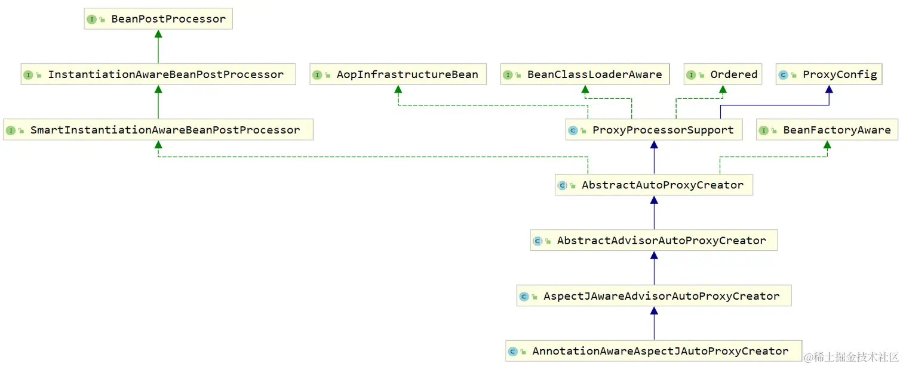
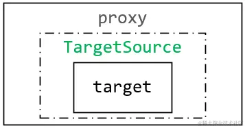

# AOP进阶

[TOC]

## 扩展知识

AOP联盟制定的通知类型：

- **前置通知**
- **返回通知**
- **异常通知**
- **环绕通知**
- **引介通知**

这 5 种通知类型在 SpringFramework 中都有对应的接口定义：

- 前置通知：`org.springframework.aop.MethodBeforeAdvice`
- 返回通知：`org.springframework.aop.AfterReturningAdvice`
- 异常通知：`org.springframework.aop.ThrowsAdvice`
- 环绕通知：`org.aopalliance.intercept.MethodInterceptor`
- 引介通知：`org.springframework.aop.IntroductionAdvisor`

在切面类的通知方法上，增加`JoinPoint`类型参数，就可以获取被增强对象了：

~~~java
@Before("execution(public * com..FinanceService.*(..))")
public void beforePrint(JoinPoint joinPoint) {
    
}
~~~

`JoinPoint`的一些方法：

- `getTarget`：返回被代理对象（原始对象）
- `getThis`：返回代理对象，注意代理对象并没有增强toString方法。
- `getArgs`：获取到被拦截的方法的参数列表
- `getSignature`：返回`MethodSignature`对象
  - `toString()`：被拦截对象的全限定名
  - `getReturnType()`：
  - `getMethod()`：

在环绕通知中，可以增加`ProceedingJoinPoint`参数，它是`JoinPoint` 的扩展，可以调用它的`proceed()`扩展方法，来替换掉原始目标方法执行时所传入的参数列表。

同样，返回通知和异常通知都有特殊参数：

~~~java
// 注意还要在注解中指定这个特殊参数
@AfterReturning(value = "execution(* com..FinanceService.subtractMoney(double))", returning = "retval")
public void afterReturningPrint(Object retval) {
    System.out.println("Logger afterReturningPrint run ......");
    System.out.println("返回的数据：" + retval);
}

@AfterThrowing(value = "defaultPointcut()", throwing = "e")
@AfterThrowing("defaultPointcut()")
public void afterThrowingPrint(Exception e) {
    System.out.println("Logger afterThrowingPrint run ......");
}
~~~

默认的切面类执行顺序，是按照字母表的顺序来的。可以通过实现`Ordered`接口，或者标注`@Order`来显式指定执行顺序：而切面类中的通知方法，也是默认按照字母表的顺序来的，**不可以**通过`@Order`来显式指定执行顺序。

我们看看如何在原始对象中调用代理对象中的方法：

~~~java
@Service
public class UserService {
    public void update(String id, String name) {
        this.get(id);		// 此时调用的是原始对象的get方法，不是代理对象的get方法
        System.out.println("修改指定id的name。。。");
    }
    
    public void get(String id) {
        System.out.println("获取指定id的user。。。");
    }
}

@Component
@Aspect
public class LogAspect {
    
    @Before("execution(* com.linkedbear.spring.aop.e_aopcontext.service.UserService.*(..))")
    public void beforePrint() {
        System.out.println("LogAspect 前置通知 ......");
    }
}

public class AopContextApplication {
    
    public static void main(String[] args) throws Exception {
        AnnotationConfigApplicationContext ctx = new AnnotationConfigApplicationContext(AopContextConfiguration.class);
        UserService userService = ctx.getBean(UserService.class);
        userService.update("abc", "def");
    }
}

/**
LogAspect 前置通知 ......
获取指定id的user。。。
修改指定id的name。。。
*/
~~~

不优雅的解决方案：

~~~java
@Service
public class UserService {
    
    @Autowired
    UserService userService;
    
    public void update(String id, String name) {
        // this.get(id);
        userService.get(id);
        System.out.println("修改指定id的name。。。");
    }
    // ...
}
~~~

正确的解决方案：

~~~java
public void update(String id, String name) {
    ((UserService) AopContext.currentProxy()).get(id);
    System.out.println("修改指定id的name。。。");
}
~~~

注意，要在配置类上标注`@EnableAspectJAutoProxy(exposeProxy = true)`，即暴露代理对象。

`<context:load-time-weaver/>`标签可以设置AOP增强的时机，与之相匹配的注解是 `@EnableLoadTimeWeaving` 。

1. **字节码编译织入**：在 javac 的动作中，使用特殊的编译器，将通知直接织入到 Java 类的字节码文件中
2. **类加载时期织入**：在类加载时期，使用特殊的类加载器，在目标类的字节码加载到 JVM 的时机中，将通知织入进去；`AspectJ`的`LoadTimeWeaving`实现了类加载时期的织入
3. **运行时创建对象织入**：在目标对象的创建时机，使用动态代理技术将通知织入到目标对象中，形成代理对象。

## 底层核心后置处理器

AOP 的核心后置处理器是 `AnnotationAwareAspectJAutoProxyCreator`，它处理基于 `@AspectJ` 注解的切面，以及 Spring 原生的 `Advisor` 。

- `AopInfrastructureBean` ：实现了该接口的 Bean 永远不会被代理

### 初始化时机

它在`AspectJAutoProxyRegistrar`中注册，在`@EnableAspectJAutoProxy`中可以发现这个类

~~~java
@Import(AspectJAutoProxyRegistrar.class)
public @interface EnableAspectJAutoProxy {
    boolean proxyTargetClass() default false;
    boolean exposeProxy() default false;
}
~~~

而`AspectJAutoProxyRegistrar`实现了`ImportBeanDefinitionRegistrar` 接口，它的`registerBeanDefinitions` 方法如下：

~~~java
public void registerBeanDefinitions(AnnotationMetadata importingClassMetadata, BeanDefinitionRegistry registry) {
    // 注册后置处理器
    // 具体做法为把 AnnotationAwareAspectJAutoProxyCreator 的 BeanDefinition 注册到 BeanDefinitionRegistry 中
    AopConfigUtils.registerAspectJAnnotationAutoProxyCreatorIfNecessary(registry);
    
    // ...
}
~~~

接着在`AbstractApplicationContext#refresh`中调用`registerBeanPostProcessors`来实例化`AnnotationAwareAspectJAutoProxyCreator`

~~~java
public void refresh() throws BeansException, IllegalStateException {
    synchronized (this.startupShutdownMonitor) {
        // ......
        try {
            postProcessBeanFactory(beanFactory);
            invokeBeanFactoryPostProcessors(beanFactory);
            // 6. 注册、初始化BeanPostProcessor
            registerBeanPostProcessors(beanFactory);
            initMessageSource();
            initApplicationEventMulticaster();
            // ......
    }
}
~~~

### 作用时机

注意，从`createBean` 到 `doCreateBean` 这个动作中还有一个 `InstantiationAwareBeanPostProcessor` 的拦截初始化动作。正好`AnnotationAwareAspectJAutoProxyCreator`实现了该接口。我们来看一下 `AnnotationAwareAspectJAutoProxyCreator#postProcessBeforeInstantiation`

~~~java
public Object postProcessBeforeInstantiation(
    Class<?> beanClass, 
    String beanName) {
    
    Object cacheKey = getCacheKey(beanClass, beanName);
    // 决定是否要提前增强当前bean
    if (!StringUtils.hasLength(beanName) || !this.targetSourcedBeans.contains(beanName)) {
        // 被增强过的bean不会再次被增强
        if (this.advisedBeans.containsKey(cacheKey)) {
            return null;
        }
        // 基础类型的bean不会被提前增强、被跳过的bean不会被提前增强
        if (isInfrastructureClass(beanClass) 
            || shouldSkip(beanClass, beanName)) {
            this.advisedBeans.put(cacheKey, Boolean.FALSE);
            return null;
        }
    }

    // 原型bean的额外处理：TargetSource
    // 此处的设计与自定义TargetSource相关，单实例bean必定返回null
    TargetSource targetSource = getCustomTargetSource(beanClass, beanName);
    if (targetSource != null) {
        if (StringUtils.hasLength(beanName)) {
            this.targetSourcedBeans.add(beanName);
        }
        Object[] specificInterceptors = getAdvicesAndAdvisorsForBean(beanClass, beanName, targetSource);
        Object proxy = createProxy(beanClass, beanName, specificInterceptors, targetSource);
        this.proxyTypes.put(cacheKey, proxy.getClass());
        // 返回一个proxy对象
        return proxy;
    }

    return null;
}
~~~

上段代码的小细节

- 由`isInfrastructureClass()`来决定一个类型是否为基础类型。切面、切入点、增强器等等都是基础类型。它们理应当不被增强。

- 被跳过的bean的名字是与增强器的名称相同，或者以.ORIGINAL结尾。

  ~~~java
  // AspectJAwareAdvisorAutoProxyCreator
  protected boolean shouldSkip(Class<?> beanClass, String beanName) {
      // 加载增强器
      List<Advisor> candidateAdvisors = findCandidateAdvisors();
      for (Advisor advisor : candidateAdvisors) {
          // 逐个匹配，如果发现当前bean的名称与增强器的名称一致，则认为
          if (advisor instanceof AspectJPointcutAdvisor &&
                  ((AspectJPointcutAdvisor) advisor).getAspectName().equals(beanName)) {
              return true;
          }
      }
      return super.shouldSkip(beanClass, beanName);
  }
  
  // AbstractAutoProxyCreator
  protected boolean shouldSkip(Class<?> beanClass, String beanName) {
      // 检查beanName代表的是不是原始对象(以.ORIGINAL结尾)
      return AutoProxyUtils.isOriginalInstance(beanName, beanClass);
  }
  ~~~

- AOP 的代理其实不是代理的目标对象本身，而是目标对象包装后的 `TargetSource` 对象

在初始化方法回调后， `AnnotationAwareAspectJAutoProxyCreator#postProcessAfterInitialization`被调用，开始生成真正的代理对象。

~~~java
public Object postProcessAfterInitialization(@Nullable Object bean, String beanName) {
    if (bean != null) {
        Object cacheKey = getCacheKey(bean.getClass(), beanName);
        if (this.earlyProxyReferences.remove(cacheKey) != bean) {
            // 核心：构造代理
            return wrapIfNecessary(bean, beanName, cacheKey);
        }
    }
    return bean;
}

protected Object wrapIfNecessary(Object bean, String beanName, Object cacheKey) {
    // 判断是否要增强
    // ...
    // Create proxy if we have advice.
    Object[] specificInterceptors = getAdvicesAndAdvisorsForBean(bean.getClass(), beanName, null);
    if (specificInterceptors != DO_NOT_PROXY) {
        this.advisedBeans.put(cacheKey, Boolean.TRUE);
        // 创建代理对象的动作
        Object proxy = createProxy(
                bean.getClass(), beanName, specificInterceptors, new SingletonTargetSource(bean));
        this.proxyTypes.put(cacheKey, proxy.getClass());
        return proxy;
    }

    this.advisedBeans.put(cacheKey, Boolean.FALSE);
    return bean;
}
~~~

## 收集切面类并封装

### Advisor

增强器的结构就是**一个切入点表达式 + 一个通知方法**。

`shouldSkip` 的跳过动作有一个`findCandidateAdvisors`方法，它收集并返回所有的增强器。注意`findCandidateAdvisors`在增强Bean时也会用到。

~~~java
protected List<Advisor> findCandidateAdvisors() {
    // 根据父类的规则添加所有找到的Spring原生的增强器
    List<Advisor> advisors = super.findCandidateAdvisors();

    // 解析BeanFactory中所有的AspectJ切面，并构造增强器
    if (this.aspectJAdvisorsBuilder != null) {
        advisors.addAll(this.aspectJAdvisorsBuilder.buildAspectJAdvisors());
    }
    return advisors;
}

// 父类 AbstractAdvisorAutoProxyCreator
private BeanFactoryAdvisorRetrievalHelper advisorRetrievalHelper;

protected List<Advisor> findCandidateAdvisors() {
   	// ...
    return this.advisorRetrievalHelper.findAdvisorBeans();
}
~~~

#### Spring原生的增强器

`AbstractAdvisorAutoProxyCreator`委托了一个 `advisorRetrievalHelper` 来处理 SpringFramework 原生的 AOP 增强器。我们来看一下`advisorRetrievalHelper#findAdvisorBeans`：

~~~java
// BeanFactoryAdvisorRetrievalHelper
public List<Advisor> findAdvisorBeans() {
    // 确定增强器bean名称的列表（如果尚未缓存）
    String[] advisorNames = this.cachedAdvisorBeanNames;
    if (advisorNames == null) {
        // BeanFactoryUtils 的 beanNamesForTypeIncludingAncestors 方法，底层是用的 getBeanNamesForType 方法去找 bean 的名称，并不会创建Bean对象
        advisorNames = BeanFactoryUtils
            .beanNamesForTypeIncludingAncestors(
                this.beanFactory, 
            	Advisor.class, 
            	true, false);
        this.cachedAdvisorBeanNames = advisorNames;
    }
    
    // 如果当前IOC容器中没有任何增强器类型的bean，直接返回
    if (advisorNames.length == 0) {
        return new ArrayList<>();
    } else {
        List<Advisor> advisors = new ArrayList<>();
        for (String name : advisorNames) {
            if (isEligibleBean(name)) {
                if (this.beanFactory.isCurrentlyInCreation(name)) {
                    // logger ......
                } else {
                    try {
                        advisors.add(this.beanFactory.getBean(name, Advisor.class));
                    } 
                }
            }
        }
        return advisors;
    }
}
~~~

#### AspectJ切面

`BeanFactoryAspectJAdvisorsBuilder#buildAspectJAdvisors`将Aspect 切面类，转换为一个一个的增强器，核心步骤入如下：

1. 首先，它将 IOC 容器，以及它的父 IOC 容器中，所有的 bean 的名称全部取出。然后逐个解析这些Bean对应的Class。

2. 提取出aspect切面类。判断是否为@Aspect的代码：

   ~~~java
   public boolean isAspect(Class<?> clazz) {
       // @Aspect注解并且不是被ajc编译器编译的
       return (hasAspectAnnotation(clazz) && !compiledByAjc(clazz));
   }
   ~~~

    原生的 AspectJ 也可以编写 Aspect 切面，而这种切面在特殊的编译条件下，生成的字节码中类上也会标注 @Aspect 注解，但是 SpringFramework 并不能利用它，所以这里它做了一个额外的判断处理，避免了这种 Class 被误加载。

3. 构造增强器，调用`ReflectiveAspectJAdvisorFactory#getAdvisors`。解析 Aspect 切面类中的通知方法以及切入点表达式，并将其封装成增强器。注意，对于原型切面 bean 的解析，它的核心解析动作依然是 `advisorFactory.getAdvisors` 方法，只是这里面不会再用到 `advisorsCache` 这个缓存区了，这也说明原型切面 bean 的解析是每次都执行的。

缓存设计：

~~~java
List<String> aspectNames = this.aspectBeanNames;
if (aspectNames == null) {
    // 更新aspectBeanNames
    // 构造增强器
}

if (aspectNames.isEmpty()) {
    return Collections.emptyList();
} else {
    List<Advisor> advisors = new ArrayList();
    // 构造增强器
}
~~~

### TargetSource

原本代理对象要执行 `method.invoke(target, args)` 这样的逻辑时，本来要拿到的是目标对象，但被 `TargetSource` 包装之后，就只能调用 `method.invoke(targetSource.getTarget(), args)` 这样的形式了。此时，可以让每次 `getTarget`所返回的值不一样，这有点对象池的味道。 粽总之，通过`TargetSource`，可以控制每次方法调用时具体对象实例，从而让方法的调用更加灵活。

~~~~java
public interface TargetSource extends TargetClassAware {
	Class<?> getTargetClass();
	boolean isStatic();
	Object getTarget() throws Exception;
	void releaseTarget(Object target) throws Exception;
}
~~~~

这里的静态实际上是指单例Bean。TargetSource的实现类有：

- `SingletonTargetSource` ：每次 `getTarget` 都返回同一个目标对象 bean （与直接代理 target 无任何区别）
- `PrototypeTargetSource` ：每次 `getTarget` 都会从 `BeanFactory` 中创建一个全新的 bean （被它包装的 bean 必须为原型 bean ）
- `CommonsPool2TargetSource` ：内部维护了一个对象池，每次 `getTarget` 时从对象池中取（底层使用 apache 的 `ObjectPool` ）
- `ThreadLocalTargetSource` ：每次 `getTarget` 都会从它所处的线程中取目标对象（由于每个线程都有一个 `TargetSource` ，所以被它包装的 bean 也必须是原型 bean ）
- `HotSwappableTargetSource` ：内部维护了一个可以热替换的目标对象引用，每次 `getTarget` 的时候都返回它（它提供了一个线程安全的 `swap` 方法，以热替换 `TargetSource` 中被代理的目标对象）

## Bean是如何被AOP代理的

之前我们提到过：`AnnotationAwareAspectJAutoProxyCreator` 的 `AbstractAutoProxyCreator#postProcessAfterInitialization` 方法中，调用 `wrapIfNecessary` 方法来尝试创建代理

~~~java
// AbstractAutoProxyCreator
protected Object wrapIfNecessary(Object bean, String beanName, Object cacheKey) {
    // ...

    // 返回匹配的增强器
    Object[] specificInterceptors = getAdvicesAndAdvisorsForBean(
        bean.getClass(), 
        beanName, 
        null);
    
    if (specificInterceptors != DO_NOT_PROXY) {
        this.advisedBeans.put(cacheKey, Boolean.TRUE);
        // 开始创建代理对象
        Object proxy = createProxy(
                bean.getClass(), beanName, specificInterceptors, new SingletonTargetSource(bean));
        this.proxyTypes.put(cacheKey, proxy.getClass());
        return proxy;
    }

    this.advisedBeans.put(cacheKey, Boolean.FALSE);
    return bean;
}

~~~

`AbstractAdvisorAutoProxyCreator#getAdvicesAndAdvisorsForBean`根据当前正在初始化的Bean，获取能匹配到的增强器。 

~~~java
// AbstractAdvisorAutoProxyCreator
protected Object[] getAdvicesAndAdvisorsForBean(
        Class<?> beanClass, String beanName, @Nullable TargetSource targetSource) {
	// 一个简单的封装逻辑，真正获取匹配的在findEligibleAdvisors方法中
    List<Advisor> advisors = findEligibleAdvisors(beanClass, beanName);
    if (advisors.isEmpty()) {
        return DO_NOT_PROXY;
    }
    return advisors.toArray();
}

protected List<Advisor> findEligibleAdvisors(Class<?> beanClass, String beanName) {
    // 获取所有增强器
    List<Advisor> candidateAdvisors = findCandidateAdvisors();
    
    // 筛选出可以切入当前bean的增强器，这里先匹配引介增强器，再匹配普通方法增强器
    List<Advisor> eligibleAdvisors = findAdvisorsThatCanApply(candidateAdvisors, beanClass, beanName);
    
    // 添加额外的增强器
    extendAdvisors(eligibleAdvisors);
    if (!eligibleAdvisors.isEmpty()) {
        // 增强器排序
        eligibleAdvisors = sortAdvisors(eligibleAdvisors);
    }
    
    return eligibleAdvisors;
}

// AnnotationAwareAspectJAutoProxyCreator覆写了AbstractAdvisorAutoProxyCreator中的该方法
// 获取所有增强器
protected List<Advisor> findCandidateAdvisors() {
    // 调用AbstractAdvisorAutoProxyCreator的findCandidateAdvisors()
    // 把 SpringFramework 原生的 AOP 增强器，以及 AspectJ 形式封装的增强器都拿出来。
    List<Advisor> advisors = super.findCandidateAdvisors();
    if (this.aspectJAdvisorsBuilder != null) {
        advisors.addAll(this.aspectJAdvisorsBuilder.buildAspectJAdvisors());
    }

    return advisors;
}
~~~

## 代理对象的底层执行逻辑

我们来看一下 jdk 动态代理的执行。当调用代理方法时，会进入`JdkDynamicAopProxy#invoke()`中：

~~~java
public Object invoke(Object proxy, Method method, Object[] args) throws Throwable {
    // ...
    // equals方法不代理
    // hashCode方法不代理
    // 方法来自于DecoratingProxy接口的，也不代理
    // 目标对象本身就是实现了Advised接口，也不代理
    // ...

 
    // 根据当前执行的方法，获取要执行的增强器
    // 然后将 AspectJ 类型的增强器，转换为 MethodInterceptor，并返回
    List<Object> chain = this.advised
        .getInterceptorsAndDynamicInterceptionAdvice(method, targetClass);

    if (chain.isEmpty()) {
        // 如果拦截器链为空，则执行目标方法
        Object[] argsToUse = AopProxyUtils.adaptArgumentsIfNecessary(method, args);
        retVal = AopUtils.invokeJoinpointUsingReflection(target, method, argsToUse);
    }
    else {
        MethodInvocation invocation = new ReflectiveMethodInvocation(
            proxy, target, 
            method, args, 
            targetClass, chain);

        // 构造增强器链，执行增强器的逻辑
        retVal = invocation.proceed();
    }
    // 返回值的处理 ......
    return retVal;
    
}
~~~

我们来看一下`MethodInterceptor`链中的执行：

~~~java
@Override//拦截器执行入口
public Object proceed() throws Throwable {
    // 如果自增系数和拦截器链中拦截器数量相同（则代表，拦截器依次执行完毕）
    if (this.currentInterceptorIndex == this.interceptorsAndDynamicMethodMatchers.size() - 1) {
        //拦截器执行完毕，执行目标方法;
        return invokeJoinpoint();
    }

    //根据起始基数，依次获对应的拦截器。（每次获取拦截器，起始基数都自增一次）
    Object interceptorOrInterceptionAdvice = this.interceptorsAndDynamicMethodMatchers.get(++this.currentInterceptorIndex);
    
    //这里获取的具体拦截器只会是两种类型（InterceptorAndDynamicMethodMathcher或者MethodInterceptor）
    if (interceptorOrInterceptionAdvice instanceof InterceptorAndDynamicMethodMatcher) {
        //...
    }
    else {
        // 具体的拦截器执行执行自己的invoke方法，将拦截器链传到里面去了。类似一个链，做递归调用，最有一个拦截器执行完毕（自增系数会和拦截器数量相同，执行目标方法），最后每一个拦截器依次返回，拦截器链执行完毕
        return ((MethodInterceptor)interceptorOrInterceptionAdvice).invoke(this);
    }
}
~~~

我们来看一个 MethodInterceptor 的具体实现 ： TransactionInterceptor（事务通知）

~~~java
public class TransactionInterceptor extends TransactionAspectSupport implements MethodInterceptor, Serializable {

    @Override
    public Object invoke(final MethodInvocation invocation) throws Throwable {
        Class<?> targetClass = (invocation.getThis() != null ? AopUtils.getTargetClass(invocation.getThis()) : null);
        return invokeWithinTransaction(invocation.getMethod(), targetClass, new InvocationCallback() {
            @Override
            public Object proceedWithInvocation() throws Throwable {
                return invocation.proceed();
            }
        });
    }
}
~~~

@Before的实现：

~~~java
public class MethodBeforeAdviceInterceptor implements MethodInterceptor, Serializable {
	private MethodBeforeAdvice advice;

	@Override
	public Object invoke(MethodInvocation mi) throws Throwable {
		this.advice.before(mi.getMethod(), mi.getArguments(), mi.getThis() );
        // 调用下一个Interceptor
		return mi.proceed();
	}
}
~~~

@After的实现：

~~~java
public class AspectJAfterAdvice extends AbstractAspectJAdvice
		implements MethodInterceptor, AfterAdvice, Serializable {

	@Override
	public Object invoke(MethodInvocation mi) throws Throwable {
		try {
			return mi.proceed();
		}
		finally {
            // 如果抛出异常，那么调用链终止
			invokeAdviceMethod(getJoinPointMatch(), null, null);
		}
	}
}
~~~

