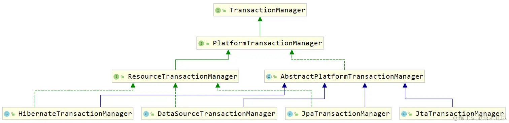
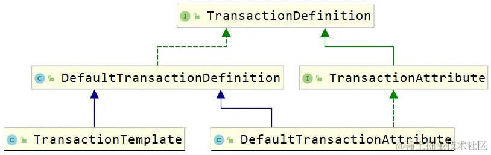
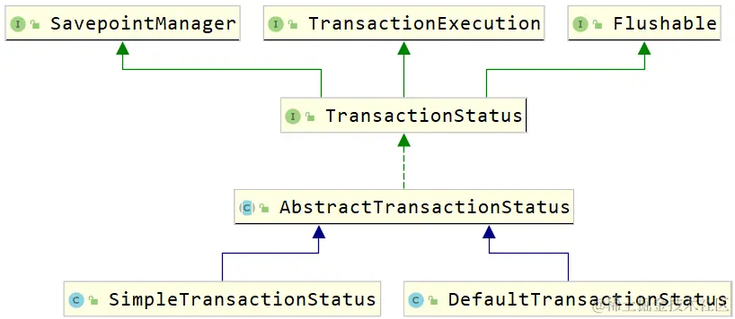
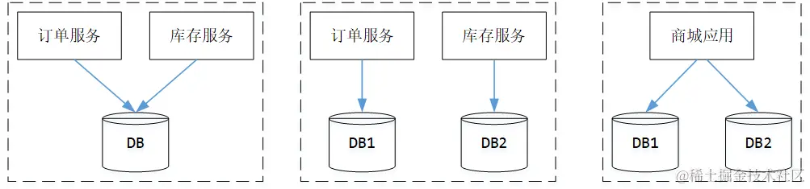
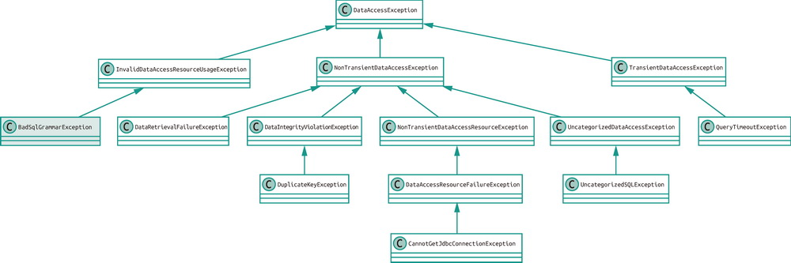
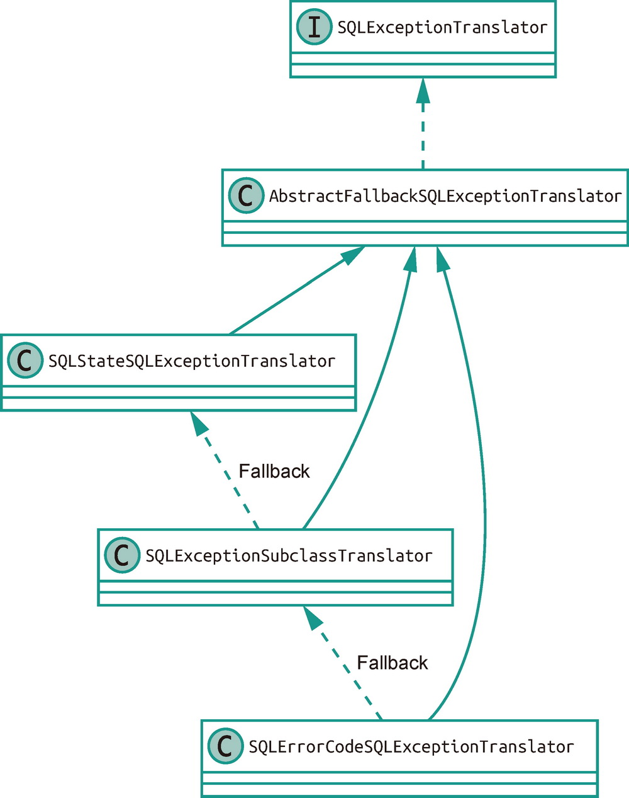

# DAO

[TOC]


## JDBC

JDBC 的全称是 `Java Database Connectivity`，是一套面向关系型数据库的规范。每个数据库生厂商都提供了基于 JDBC 规范实现的 JDBC 驱动。开发者只需要面向 JDBC 接口编程，就能在很大程度上规避掉由数据库实现的差异所带来的问题。


在建立了数据源之后，我们可以通过JDBC接口来操纵数据。JDBC操作的具体流程如下：

1. 获取 `Connection` 连接
2. 通过 `Connection` 创建 `Statement` 或者 `PreparedStatement`
3. 执行具体的 SQL 操作
4. 关闭 `Statement` 或者 `PreparedStatement`
5. 关闭 `Connection`

实际上，只有第三步是和我们业务逻辑相关的。SpringFramework为我们提供了`JdbcTemplate` 和 `NamedParameterJdbcTemplate` 两个模板类，简化了上述操作，使得我们只需关心第三步的实现。


代码配置JdbcTemplate对象：

~~~java
DriverManagerDataSource dataSource = new DriverManagerDataSource();
dataSource.setDriverClassName("com.mysql.jdbc.Driver");
dataSource.setUrl("jdbc:mysql://localhost:3306/spring-dao?characterEncoding=utf8");
dataSource.setUsername("root");
dataSource.setPassword("123456");

JdbcTemplate jdbcTemplate = new JdbcTemplate();
jdbcTemplate.setDataSource(dataSource);
~~~

`DriverManagerDataSource`是Spring自带的数据源插件，没有连接池的概念。 即每次都会创建新的数据库连接。


`JdbcTemplate` 的 `update()` 方法可以用来执行 `INSERT`、`UPDATE` 和 `DELETE` 语句。其中，SQL 语句后的参数顺序对应了 SQL 中 `?` 占位符的顺序。

~~~java
int row = jdbcTemplate.update("insert into tbl_user (name, tel) values (?, ?)", "heihei", "200");

int row = jdbcTemplate.update("update tbl_user set tel = ? where name = ?", "54321", "heihei");

int row = jdbcTemplate.update("delete from tbl_user where name = ?", "heihei");
~~~


`query()`方法可以查询数据：

~~~java
List<User> userList = jdbcTemplate.query(
    "select * from tbl_user", 
    new BeanPropertyRowMapper<>(User.class));

// 如果没有结果集，那么就返回一个空的List
User user = userList.size() > 0 ? userList.get(0) : null;
~~~

我们看一些`query()`方法的定义：

~~~java
query(String sql, RowMapper<T> rowMapper, Object... args) 。
~~~

其中，`RowMapper`对象用于将 `ResultSet` 的一行数据封装为一个指定的类型，即将字段映射到某个对象上，它的定义如下：

~~~java
@FunctionalInterface
public interface RowMapper<T> {
	T mapRow(ResultSet rs, int rowNum) throws SQLException;
}
~~~


使用 `KeyHolder` 类来持有自增长的主键：

~~~java
KeyHolder keyHolder = new GeneratedKeyHolder();
int affected = jdbcTemplate.update(con -> {
    PreparedStatement preparedStatement = con.prepareStatement(
        INSERT_SQL, 
        PreparedStatement.RETURN_GENERATED_KEYS);
    
    return preparedStatement;
}, keyHolder);

if (affected == 1) {
    keyHolder.getKey().longValue();
}
~~~


如果SQL 中用到了 `?`的数量一多，就容易在传参时搞错位置。Spring Framework 为我们提供了一个 `NamedParameterJdbcTemplate` 类来避免这个问题。通过它，我们可以为 SQL 中的参数设定名称，然后根据名称进行赋值：

~~~java
String sql = " ... ";
MapSqlParameterSource sqlParameterSource = new MapSqlParameterSource();

sqlParameterSource.addValue("name", item.getName());
sqlParameterSource.addValue("size", item.getSize());
sqlParameterSource.addValue("price", 100)
return namedParameterJdbcTemplate.update(sql, sqlParameterSource);
~~~


在数据处理时，我们经常会遇到需要插入或更新一大批数据的情况（批操作）。大多数 JDBC 驱动针对批量调用相同 `PreparedStatement` 的情况都做了特殊优化，同时 Spring Framework 中也提供了 `batchUpdate()` 方法来支持为批处理操作

~~~java
jdbcTemplate.batchUpdate(
    INSERT_SQL, 		
    new BatchPreparedStatementSetter() {
        // 为每条语句的占位符指定参数
        @Override
        public void setValues(PreparedStatement ps, int i) throws SQLException {
            MenuItem item = items.get(i);
            ps.setString(1, item.getName());
            ps.setString(2, item.getSize());
            ps.setLong(3, 100);
        }

        // 有几条语句
        @Override
        public int getBatchSize() {
            return items.size();
        }
    }
);
~~~

此外，还有 `batchUpdate(String sql, List<Object[]> batchArgs)`：

~~~java
List<Object[]> batchArgs = items
    .stream()
    .map(item -> new Object[] {
        item.getName(),
        item.getSize(),
 		100
    }).collect(Collectors.toList());

int[] count = jdbcTemplate.batchUpdate(INSERT_SQL, batchArgs);
~~~


## 数据源

常用的数据库连接池都实现了 `DataSource` 接口，通过其中的 `getConnection()` 方法即可获得数据库的一个连接。常见的连接池有：HikariCP 、 Druid、 DBCP2 和 C3P0。

部分常用的 `spring.datasource` 配置项：

| 配置项                                   | 默认值                      | 说明                    |
| :--------------------------------------- | :-------------------------- | :---------------------- |
| `spring.datasource.url`                  |                             | 数据库的 JDBC URL       |
| `spring.datasource.username`             |                             | 连接数据库的用户名      |
| `spring.datasource.password`             |                             | 连接数据库的密码        |
| `spring.datasource.name`                 | 使用内嵌数据库时为 `testdb` | 数据源的名称            |
| `spring.datasource.jndi-name`            |                             | 获取数据源的 JNDI 名称  |
| `spring.datasource.type`                 | 根据 CLASSPATH 自动探测     | 连接池实现的全限定类名  |
| `spring.datasource.driver-class-name`    | 根据 URL 自动探测           | JDBC 驱动类的全限定类名 |
| `spring.datasource.generate-unique-name` | `true`                      | 是否随机生成数据源名称  |

## 缓存


当然，这里还要考虑缓存内容过期、超过缓存上限时内容淘汰、数据写入缓存时是否加锁等问题。

Spring Framework将上述流程做了一层抽象，它通过注解或者 XML 的方式配置到方法上，每次执行方法就会在缓存里做一次检查，看看是否已经用当前参数调用过这个方法了，如果调用过并且有结果在缓存里了，就不再执行实际的方法调用，而是直接返回缓存值；

这里有两点需要着重说明一下：

- 这套缓存抽象背后是通过 AOP 来实现的，所以如果执行缓存操作，那么必须访问代理后的对象（依赖注入帮我们处理好了）
- 只有那些**可幂等操作**的方法才适用于这套抽象，因为必须要保证相同的参数拥有一样的返回值。

| Spring 注解    | JSR-107 对应注解                   | 说明                                                         |
| :------------- | :--------------------------------- | :----------------------------------------------------------- |
| `@Cacheable`   | `@CacheResult`                     | 从缓存中获取对应的缓存值，没有的话就执行方法并缓存，然后返回。其中 `sync` 如果为 `true`，在调用方法时会锁住缓存，相同的参数只有一个线程会计算，其他线程等待结果 |
| `@CachePut`    | `@CachePut`                        | 直接更新缓存                                                 |
| `@CacheEvict`  | `@CacheRemove` / `@CacheRemoveAll` | 清除缓存，其中的 `allEntries` 如果设置为 `true`，则清除指定缓存 |
| `@Caching`     | 无                                 | 可以用来组合多个缓存抽象的注解，比如两个 `@CacheEvict`       |
| `@CacheConfig` | `@CacheDefaults`                   | 添加在类上，为这个类里的缓存抽象注解提供公共配置，例如统一的 `cacheNames` 和 `cacheManager` |

这些注解中有很多一样的属性（除了 `@Caching`），具体如下

- `cacheNames`，标识一个缓存
- `key`，计算缓存Key名的 SpEL 表达式
- `keyGenerator`，自定义的 `KeyGenerator` Bean 名称，用来生成缓存键名，与 `key` 属性互斥。
- `cacheManager`，缓存管理器的 Bean 名称，负责管理实际的缓存
- `cacheResolver`，缓存解析器的 Bean 名称，与 `cacheManager` 属性互斥
- `condition`，操作缓存的条件，也是用 SpEL 表达式来计算的

~~~java
@Cacheable(cacheNames="menu", condition="#name.length() < 16")
public MenuItem findByName(String name) {...}
~~~


添加依赖：

~~~xml
<dependency>
    <groupId>org.springframework.boot</groupId>
    <artifactId>spring-boot-starter-cache</artifactId>
</dependency>
~~~

在配置类加上`@EnableCaching`注解即可开启使用缓存：

~~~java
@Configuration
@EnableCaching
public class Config {}
~~~

也可以在 XML 配置文件中使用 `<cache:annotation-driven/>` 标签，例如：

~~~xml
<beans xmlns="http://www.springframework.org/schema/beans"
        xmlns:xsi="http://www.w3.org/2001/XMLSchema-instance"
        xmlns:cache="http://www.springframework.org/schema/cache"
        xsi:schemaLocation="
        http://www.springframework.org/schema/beans
        https://www.springframework.org/schema/beans/spring-beans.xsd
        http://www.springframework.org/schema/cache
        https://www.springframework.org/schema/cache/spring-cache.xsd">

    <cache:annotation-driven/>
</beans>
~~~

使用示例：

~~~java
@Service
@CacheConfig(cacheNames = "menu")
// 类上添加的 @CacheConfig 注解配置了公共的 cacheNames
public class MenuService {
    @Autowired
    private MenuRepository menuRepository;

    @Cacheable
    public List<MenuItem> getAllMenu() {
        return menuRepository.findAll();
    }

    // 此处将方法名、name 参数与 size 参数用“-”拼接在一起作为缓存的键名。
    @Cacheable(key = "#root.methodName + '-' + #name + '-' + #size")
    public Optional<MenuItem> getByNameAndSize(String name, Size size) {
        return menuRepository.findByNameAndSize(name, size);
    }
}

~~~


删除缓存：

~~~java
@CacheEvict(cacheNames = "hello", key = "#id") 
public String delete(String id) {
    // 删除key为id的缓存
    return "删除成功";
}
~~~

修改缓存：

~~~java
@CachePut(cacheNames = "hello", key = "#id") 
public String update(String id) {
    return "修改后的缓存数据";
}
~~~

`condition`是在调用方法之前判断条件，决定是否准备缓存。`unless`是在调用方法之后判断条件，决定是否不缓存。

~~~java
@Cacheable(cacheNames = "hello",unless="#result.id.contains('1')" )
// 如果SpEL条件成立，则不缓存
public User find(String id) {
    User user = new User();
    user.setId(id);
    return user;
}
~~~


 Spring 缓存抽象的默认实现为`ConcurrentHashMap`，其实 Spring 的缓存抽象能够支持多种不同的后端缓存实现，通过ChacheMananger来指定：

| 实现类                      | 底层实现            | 说明                                                      |
| :-------------------------- | :------------------ | :-------------------------------------------------------- |
| `ConcurrentMapCacheManager` | `ConcurrentHashMap` | 建议仅用于测试目的                                        |
| `NoOpCacheManager`          | 无                  | 不做任何缓存操作，可以视为关闭缓存                        |
| `CompositeCacheManager`     | 无                  | 用于组合多个不同的 `CacheManager`，会在其中遍历要找的缓存 |
| `EhCacheCacheManager`       | EhCache             | 适用于 EhCache                                            |
| `CaffeineCacheManager`      | Caffeine            | 适用于 Caffeine                                           |
| `JCacheCacheManager`        | JCache              | 适用于遵循 JSR-107 规范的缓存                             |

此外还有Redis、Hazelcast、Infinispan


SpEL基本表达式：

- 算术运算符：加（+）、减（-）、乘（*）、除（/）、求余 （%）、幂（^）、求余（MOD）和除（DIV）等算术运算符
- 关系运算符：等于（==）、不等于（!=）、大于（>）、大 于等于（>=）、小于（<）、小于等于（<=）、区间（between）运算等
- 逻辑运算符：与（and）、或（or）、非（!或NOT）
- 字符串运算符：连接（+）和截取（[ ]）
- 三目运算符
- 正则表达式匹配符matcher。例如` #{'123' matches '\\d{3}' }` 返回true。
- 变量引用符：SpEL提供了一个上下文变量的引用符“#”， 可在表达式中使用“#variableName”引用上下文变量。
- 类型访问运算符：SpEL提供了一个类型访问运算符 T(Type)。其中，“Type”表示某个Java类型，实际上对应于Java类的 java.lang.Class实例。Type必须是类的全限定名（包括包名），但是 核心包“java.lang”中的类除外。例如：\#{T(String).valueOf(1)}表示将整数1转换成 字符串。


## 事务

### 概念

事务就是一组逻辑操作的组合，它被赋予四个特性：

- **原子性**：一个事务就是一个不可再分解的单位，事务中的操作要么全部做，要么全部不做。
- **一致性**：事务执行后，所有的数据都应该保持一致状态。
- **隔离性**：多个数据库操作并发执行时，一个请求的事务操作不能被其它操作干扰，多个并发事务执行之间要相互隔离。
- **持久性**：事务执行完成后，它对数据的影响是永久性的。

其中，原子性、隔离性、持久性是手段，而一致性是目的

事务并发操作中会出现三种问题：

- 脏读：一个事务读到了另一个事务没有提交的数据
- 不可重复读
- 幻读

针对上述三个问题，由此引出了事务的隔离级别：

- **read uncommitted** 读未提交 —— 不解决任何问题
- **read committed** 读已提交 —— 解决脏读
- **repeatable read** 可重复读 —— 解决脏读、不可重复读
- **serializable** 可串行化 —— 解决脏读、不可重复读、幻读


### JDBC中的事务

~~~java
public class JdbcTransactionApplication {
    
    public static void main(String[] args) throws SQLException {
        Connection connection = null;
        try {
            connection = dataSource.getConnection();
            // 开启事务，关闭自动提交
            connection.setAutoCommit(false);
            PreparedStatement statement = connection.prepareStatement(...);
            statement.executeUpdate();
            
            int i = 1 / 0;
            // 提交事务
            connection.commit();
        } catch (Exception e) {
            // 回滚事务
            connection.rollback();
        } finally {
            // 关闭连接
            if (connection != null) {
                connection.close();
            }
        }
    }
}
~~~

当程序运行出现异常时，可以让事务只回滚到某个保存点上

~~~java
try {
    PreparedStatement statement = connection.prepareStatement(...);
    statement.executeUpdate();

    // 事务保存点
    savepoint = connection.setSavepoint();

    statement = connection.prepareStatement("insert into tbl_account (user_id, money) values (2, 123)");
    statement.executeUpdate();

    int i = 1 / 0;
} catch (Exception e) {
    if (savepoint != null) {
        connection.rollback(savepoint);
        connection.commit();
    } else {
        connection.rollback();
    }
}
~~~


### Spring的事务控制模型

SpringFramework 的事务控制模型就是

- `PlatformTransactionManager` ：平台事务管理器
- `TransactionDefinition` ：事务定义
- `TransactionStatus` ：事务状态


当事务创建时，就会被绑定到一个线程上。该线程会伴随着事务整个生命周期，直到事务提交、回滚或挂起（临时解绑）。而且`TransactionSynchronizationManager`的使用是基于`ThreadLocal`的。

#### 平台事务管理器

**事务（Transaction）**在不同的语境下有着不同的含义

- 在数据库中，事务就是其原子性（Atomic）——操作要么全都执行，要么都不执行。
- 在 Java EE 环境中，事务可以是使用 JTA（Java Transaction API）这样的全局事务，也可以是基于 JDBC 连接的本地事务。
- 分布式事务

为了消除代码对不同事务对的依赖，Spring Framework 对事务管理做了一层抽象。这个抽象的核心是事务管理器，即 `TransactionManager`，它是一个标记接口。而`PlatformTransactionManager`接口继承了 `TransactionManager`接口，定义了获取事务、提交事务和回滚事务的方法：

```java
public interface PlatformTransactionManager extends TransactionManager {
    //获得事务
    TransactionStatus getTransaction(@Nullable TransactionDefinition var1) throws TransactionException;
    //提交事务
    void commit(TransactionStatus var1) throws TransactionException;
    //回滚事务
    void rollback(TransactionStatus var1) throws TransactionException;
}
```

`DataSourceTransactionManager`、`JtaTransactionManager` 和 `HibernateTransactionManager` 这些底层事务管理器都实现了上述接口。

PlatformTransactionManager的继承体系：



#### TransactionDefinition

**TransactionDefinition**：事务的属性

~~~java
public interface TransactionDefinition {
   // ...
    // 返回事务的传播行为，默认值为 REQUIRED。
    int getPropagationBehavior();
    //返回事务的隔离级别，默认值是 DEFAULT
    int getIsolationLevel();
    // 返回事务的超时时间，默认值为-1。如果超过该时间限制但事务还没有完成，则自动回滚事务。
    int getTimeout();
    // 返回是否为只读事务，默认值为 false
    boolean isReadOnly();

    @Nullable
    String getName();
}
~~~

- 传播性：事务传播性分为 7 个级别.

- 隔离级别：数据库的事务有 4 种隔离级别

  | 隔离性                       | 脏读 | 不可重复读 | 幻读 |
  | ---------------------------- | :--: | :--------: | :--: |
  | `ISOLATION_READ_UNCOMMITTED` |  ❌   |     ❌      |  ❌   |
  | `ISOLATION_READ_COMMITTED`   |  ✔️   |     ❌      |  ❌   |
  | `ISOLATION_REPEATABLE_READ`  |  ✔️   |     ✔️      |  ❌   |
  | `ISOLATION_SERIALIZABLE`     |  ✔️   |     ✔️      |  ✔️   |

  `TransactionDefinition` 中的默认隔离级别设置为 `-1`，使用底层数据源的配置，比如，MySQL 默认的隔离级别是 `REPEATABLE_READ`，Oracle 默认的隔离级别则是 `READ_COMMITTED`。

- 超时时间：所谓事务超时，就是指一个事务所允许执行的最长时间，如果超过该时间限制但事务还没有完成，则自动回滚事务。在 `TransactionDefinition` 中以 int 的值来表示超时时间，其单位是秒，默认值为-1

- 是否只读

TransactionDefinition的继承体系：




我们在此看一下`TransactionAttribute`接口：

~~~java
public interface TransactionAttribute extends TransactionDefinition {
    String getQualifier();
    boolean rollbackOn(Throwable ex);
}
~~~

这里的`rollbackOn` 方法，正是`@Transactional` 注解中 `rollbackFor` 属性的底层支撑


#### TransactionStatus

**TransactionStatus**：事务运行状态。

~~~java
public interface TransactionStatus{
    boolean isNewTransaction(); // 是否是新的事务
    boolean hasSavepoint(); 	// 是否有恢复点
    void setRollbackOnly();  	// 设置为只回滚
    boolean isRollbackOnly(); 	// 是否为只回滚
    boolean isCompleted; 		// 是否已完成
}
~~~


事务状态的继承体系：




### 事务管理

在Spring中，事务有两种实现方式：

- **编程式事务管理**：编程式事务管理使用`TransactionTemplate`，或者直接使用底层的`PlatformTransactionManager`。
- **声明式事务管理**： 建立在AOP之上的。其本质是对方法前后进行拦截，然后在目标方法开始之前创建或者加入一个事务，在执行完目标方法之后根据执行情况提交或者回滚事务。 通过`@Transactional`就可以进行事务操作。默认情况下，声明式事务在遇到 `RuntimeException` 和 `Error` 时才会回滚，对于`checked exception`并不会执行回滚操作。


如果一个类或者一个类中的 public 方法上被标注`@Transactional` 注解的话，Spring 容器就会在启动的时候为其创建一个代理类，在调用被`@Transactional` 注解的 public 方法的时候，实际调用的是，`TransactionInterceptor` 类中的 `invoke()`方法。这个方法的作用就是在目标方法之前开启事务，方法执行过程中如果遇到异常的时候回滚事务，方法调用完成之后提交事务。


### 编程式事务管理

首先注册这两个Bean

~~~java
<bean id="transactionManager" class="org.springframework.jdbc.datasource.DataSourceTransactionManager">
    <property name="dataSource" ref="dataSource"/>
</bean>

<bean id="transactionTemplate" class="org.springframework.transaction.support.TransactionTemplate">
    <property name="transactionManager" ref="transactionManager"/>
</bean>
~~~

- `DataSourceTransactionManager` ：事务管理器，它负责控制事务
- `TransactionTemplate` ：事务模板，使用它可以完成编程式事务


使用事务模板：

~~~java
@Service
public class UserService {   
    @Autowired
    TransactionTemplate transactionTemplate;
    // ...
    
    public void saveAndQuery() {
        transactionTemplate.execute((TransactionStatus)status -> {
            try {
                // 业务代码
            } catch (Exception e){
                // 回滚
                transactionStatus.setRollbackOnly();
            }
        });
    }
}
~~~

这个 `execute` 方法中需要传入一个 `TransactionCallback` 类型的对象：

~~~java
@FunctionalInterface
public interface TransactionCallback<T> {
	T doInTransaction(TransactionStatus status);
}
~~~

`TransactionCallBack`回调函数要求我们返回一个对象，作为`execute()`的返回值。如果不想处理返回值，可以使用`TransactionCallbackWithoutResult#doInTransactionWithoutResult` 

~~~java
public abstract class TransactionCallbackWithoutResult implements TransactionCallback<Object> {

	@Override
	public final Object doInTransaction(TransactionStatus status) {
		doInTransactionWithoutResult(status);
		return null;
	}

	protected abstract void doInTransactionWithoutResult(TransactionStatus status);
}
~~~

`execute`的源码：

~~~java
@Override
@Nullable
public <T> T execute(TransactionCallback<T> action) throws TransactionException {
    
    if (this.transactionManager instanceof CallbackPreferringPlatformTransactionManager) {
        return ((CallbackPreferringPlatformTransactionManager) this.transactionManager).execute(this, action);
    }
    else {
        // 获取事务
        TransactionStatus status = this.transactionManager.getTransaction(this);
        T result;
        try {
            // 执行我们传入的回调函数
            result = action.doInTransaction(status);
        }
        catch (RuntimeException | Error ex) {
            // 业务代码出现异常，回滚事务
            rollbackOnException(status, ex);
            throw ex;
        }
        catch (Throwable ex) {
            // 业务代码出现异常，回滚事务
            rollbackOnException(status, ex);
            throw new UndeclaredThrowableException(ex, "TransactionCallback threw undeclared checked exception");
        }
        
        // try块没有出现异常，业务代码执行成功，提交事务
        this.transactionManager.commit(status);
        return result;
    }
}
~~~


还可以使用`PlatformTransactionManager`接口，注意，各种事务管理器，例如`DataSourceTransactionManager`，都实现了该接口。

~~~java
@Autowired
private PlatformTransactionManager transactionManager;

public void testTransaction() {
  TransactionStatus status = transactionManager.getTransaction(new DefaultTransactionDefinition());
    
  try {
       // ....  业务代码
      transactionManager.commit(status);
  } catch (Exception e) {
      transactionManager.rollback(status);
  }
}
~~~

### 声明式事务管理

#### 基于xml配置文件

~~~xml
<!--这里transactionManager是以及配置好的PlatformTransactionManager-->
<tx:advice id="transactionAdvice" transaction-manager="transactionManager">
    <tx:attributes>
        <!-- 所有save开头的方法全部开启事务控制 -->
        <tx:method name="save*"/>
        <tx:method name="addMoney"/>
        <tx:method name="subtractMoney"/>
    </tx:attributes>
</tx:advice>


<aop:config>
    <!--让 c_declarativexml.service 包下面的所有类的所有方法，都织入一个事务通知，注意还要在tx:method中开启这些事务，以及配置这些事务的相关属性-->
    <aop:advisor advice-ref="transactionAdvice"
                 pointcut="execution(* com.linkedbear.spring.transaction.c_declarativexml.service.*.*(..))"/>
</aop:config>
~~~

`<tx:method>` 标签中的属性：

- `isolation` ：事务隔离级别。默认是 DEFAULT ，即依据数据库默认的事务隔离级别来定
- `timeout` ：事务超时时间，当事务执行超过指定时间后，事务会自动中止并回滚，单位 **秒** 。默认值 **-1** ，代表永不超时
- `read-only`：设置是否为只读事务。
  - 默认值false，代表读写型事务。
  - 当设置为 true 时，当前事务为只读事务，通常用于查询操作（此时不会有 `setAutoCommit(false)` 等操作，可以加快查询速度）
- `rollback-for`：当方法触发指定异常时，事务回滚，需要传入异常类的全限定名。默认值为空，代表捕捉所有 `RuntimeException` 和 `Error` 的子类
- `no-rollback-for` ：当方法触发指定异常时，事务不回滚，需要传入异常类的全限定名。默认值为空，代表不忽略异常
- `propagation` ：事务传播行为


#### 基于注解

~~~java
@Transactional
public void saveAndQuery() {
	//...
}
~~~

 `@Transactional` 的作用范围

1. 方法：推荐将注解使用于方法上，不过需要注意的是：**该注解只能应用到 public 方法上，否则不生效。**
2. 类：如果这个注解使用在类上的话，表明该注解对该类中所有的 public 方法都生效。
3. 接口：不推荐在接口上使用。

`@Transactional` 的常用配置参数总结：

| 属性名      | 说明                                                         |
| :---------- | :----------------------------------------------------------- |
| propagation | 事务的传播行为，默认值为 REQUIRED，可选的值在上面介绍过      |
| isolation   | 事务的隔离级别，默认值采用 DEFAULT，可选的值在上面介绍过     |
| timeout     | 事务的超时时间，默认值为-1（不会超时）。如果超过该时间限制但事务还没有完成，则自动回滚事务。 |
| readOnly    | 指定事务是否为只读事务，默认值为 false。                     |
| rollbackFor | 用于指定能够触发事务回滚的异常类型，并且可以指定多个异常类型。默认是 `RuntimeException` 和 `Error` 的子类 |


当一个方法被标记了`@Transactional` 注解的时候，Spring 事务管理器只会在被其他类方法调用的时候生效，而不会在一个类中方法调用生效。这是因为 Spring AOP 工作原理决定的。我们代理对象就无法拦截到这个内部调用，因此事务也就失效了。

~~~java
@Service
public class MyService {
    private void method1() {
        // 先获取该类的代理对象，然后通过代理对象调用method2。
        ((MyService)AopContext.currentProxy()).method2();
    }
    @Transactional
    public void method2() {
     	//......
    }
}
~~~


### 事务传播


示例代码：

~~~java
//将传入参数a存入ATable
pubilc void A(a){
    insertIntoATable(a);    
}
//将传入参数b存入BTable
public void B(b){
    insertIntoBTable(b);
}

public void testMain(){
    A(a1);  //调用A入参a1
    testB();    //调用testB
}

public void testB(){
    B(b1);  //调用B入参b1
    throw Exception;     //发生异常抛出
    B(b2);  //调用B入参b2
}
// 注：事务由于通过AOP实现的，这种直接调用是起不到事务的作用。这里为了演示，在写法上做了妥协
~~~

- **REQUIRED：必需的【默认值】**

  - ❌：新建一个事务

    ~~~java
    public void testMain(){
        A(a1);  //调用A入参a1
        testB();    //调用testB
    }
    
    @Transactional(propagation = Propagation.REQUIRED)
    public void testB(){
        B(b1);  //调用B入参b1
        throw Exception;     //发生异常抛出
        B(b2);  //调用B入参b2
    }
    ~~~

    执行testB时会自己新建一个事务，testB抛出异常则只有testB中的操作发生了回滚，也就是b1的存储会发生回滚，但a1数据不会回滚，所以最终a1数据存储成功，b1和b2数据没有存储

  - ✔️：加入这个事务

    ```java
    @Transactional(propagation = Propagation.REQUIRED)
    public void testMain(){
        A(a1);  	//调用A入参a1
        testB();    //调用testB
        System.out.println("123");
    }
    
    @Transactional(propagation = Propagation.REQUIRED)
    public void testB() {
        B(b1);  //调用B入参b1
        throw Exception;     //发生异常抛出
        B(b2);  //调用B入参b2
    }
    ```

    在执行testB方法时就加入了testMain的事务，在执行testB方法抛出异常后，事务会发生回滚。又testMain和testB使用的同一个事务，所以事务回滚后testMain和testB中的操作都会回滚，也就使得数据库仍然保持初始状态。

    注意这里，当`testB()`中抛出异常的时候，`testMain()`方法的事务也会因此被标记为回滚。Spring 会捕捉到这个异常，然后决定回滚当前的事务，并且终止后续的操作。

- **REQUIRES_NEW ：新事务**

  - ❌：新建一个事务
  - ✔️：新建一个事务，但会挂起当前事务

- **NESTED ：嵌套**

  - ❌：新建一个事务

  - ✔️：在嵌套事务中执行

    - 在REQUIRES_NEW情况下，原有事务回滚，不会影响新开启的事务。
    - 在NESTED情况下父事务回滚时，子事务也会回滚

    

    - REQUIRED情况下，被调用方出现异常时，由于共用一个事务，所以无论调用方是否catch其异常，事务都会回滚
    - 在NESTED情况下，被调用方发生异常时，调用方可以catch其异常，这样只有子事务回滚，父事务不受影响

- **SUPPORTS ：支持**

  - ❌：以非事务方法执行
  - ✔️：加入当前事务

- **NOT_SUPPORTED ：不支持**

  - ❌：以非事务方式执行
  - ✔️：以非事务方式执行，但会挂起当前事务。

- **MANDATORY ：强制**

  - ❌：抛出异常
  - ✔️：加入当前事务

- **NEVER ：不允许**

  - ❌：以非事务方法执行
  - ✔️：抛出异常


### 事务监听器

~~~java
@EventListener
public @interface TransactionalEventListener {
    TransactionPhase phase() default TransactionPhase.AFTER_COMMIT;

    boolean fallbackExecution() default false;
    
    @AliasFor(annotation = EventListener.class, attribute = "classes")
    Class<?>[] value() default {};

    @AliasFor(annotation = EventListener.class, attribute = "classes")
    Class<?>[] classes() default {};

    String condition() default "";
}
~~~

- `phase` ，它代表的是在事务的哪个阶段触发监听
  - `BEFORE_COMMIT` ：事务提交之前触发监听
  - `AFTER_COMMIT` （默认值）：事务提交之后触发监听
  - `AFTER_ROLLBACK` ：事务回滚之后触发监听
  - `AFTER_COMPLETION` ：事务完成之后触发监听（无论提交或回滚均触发）


使用示例：

~~~java
@Component
public class UserTransactionListener {
    
    @TransactionalEventListener
    public void onSaveUser(PayloadApplicationEvent<User> event) {
        System.out.println("监听到保存用户事务提交 ......");
    }
    
    @Transactional
    public void saveUser() {
        userDao.save(user);
        // 用户还得手动发布事件，但这些事件会临时存储起来，在事务提交/回滚时再执行这些事件
        eventPublisher.publishEvent(user);
    }
}
~~~


根据`@TransactionalEventListener`生成的监听器的源码：

~~~java
@Override
public void onApplicationEvent(ApplicationEvent event) {
    // 如果当前处于激活的事务当中，那么会创建一个TransactionSynchronization，并把它放到一个集合当中。
    // 意思就是先不执行，只是临时存了起来。在事务提交/回滚时再执行这些事件
    if (TransactionSynchronizationManager.isSynchronizationActive() &&
            TransactionSynchronizationManager.isActualTransactionActive()) {
        TransactionSynchronization transactionSynchronization = createTransactionSynchronization(event);
        TransactionSynchronizationManager.registerSynchronization(transactionSynchronization);
    }
    else if (this.annotation.fallbackExecution()) {
        // 如果没有事务，并且明确设置了fallbackExecution为true，那么直接执行，该效果和EventListener一样。
        if (this.annotation.phase() == TransactionPhase.AFTER_ROLLBACK && logger.isWarnEnabled()) {
            logger.warn("Processing " + event + " as a fallback execution on AFTER_ROLLBACK phase");
        }
        processEvent(event);
    }
    else {
        // 如果没有事务，并且fallbackExecution 为false，那么直接丢弃该Event不做任何处理。
        if (logger.isDebugEnabled()) {
            logger.debug("No transaction is active - skipping " + event);
        }
    }
}
~~~

这里有一个小坑，就是AFTER_COMPLETION 、AFTER_COMMIT监听器执行顺序得不到保证，这是因为JVM 的标准反射不保证方法列表返回的顺序一致。我们可以通过`@Order`来解决这个问题。

### 分布式事务

以下三种架构都属于分布式事务的范畴：

- 多个应用同时访问一个数据库，应用间共同完成一个事务
- 多个应用访问不同的数据库，应用间共同完成一个事务
- 一个应用同时访问多个数据库，由应用完成一个事务



而Spring中的分布式事务，只能处理第三种情况，即 Spring 提供了 JTA 全局事务，来同时控制多个数据源的事务。

## 异常处理

不同数据库的 JDBC 驱动中会定义一些自己的 `SQLException` 子类，而且不同数据库对于同一种错误可能返回不同的错误码。为了避免业务层代码和持久层代码的耦合，Spring Framework 为我们提供了统一的数据库异常类`DataAccessException`。它支持绝大多数常用数据库，将不同数据库的返回码翻译成特定的异常类型。例如，违反了唯一性约束就会抛出的 `DataIntegrityViolationException`；针对主键冲突的异常，还有一个 `DuplicateKeyException` 子类




这背后的核心接口就是 `SQLExceptionTranslator`，它负责将驱动所抛出的 `SQLException` 转换为 `DataAccessException`。`SQLExceptionTranslator` 及其重要实现类的关系如下图所示



其中，`SQLExceptionSubclassTranslator`和`SQLErrorCodeSQLExceptionTranslator`作为备用转换器，当`SQLErrorCodeSQLExceptionTranslator`无法转换时，将降级处理


`SQLErrorCodeSQLExceptionTranslator`的转换逻辑在`doTranslate`中，具体流程如下：

- 尝试调用`customTranslate`方法（留给用户覆写的），若成功则直接放回

- 获取`SQLErrorCodes`对象

- 尝试调用 `SQLErrorCodes` 中的 `customSqlExceptionTranslator` 方式来转换

- 再尝试调用 `SQLErrorCodes` 中的 `customTranslations`方式来转换

- 最后再根据配置的错误码来判断。`SQLErrorCodeSQLExceptionTranslator` 会通过 `SQLErrorCodesFactory` 加载特定数据库的错误码信息。`SQLErrorCodesFactory` 默认从 CLASSPATH 的 `org/springframework/jdbc/support/sql-error-codes.xml` 文件中加载错误码配置，这是一个 Bean 的配置文件，其中都是 `SQLErrorCodes` 类型的 Bean。这个文件中包含了 MySQL、Oracle、PostgreSQL、MS-SQL 等 10 余种常见数据库的错误码信息。

  ~~~xml
  <bean id="MySQL" class="org.springframework.jdbc.support.SQLErrorCodes">
      <property name="databaseProductNames">
          <list>
              <value>MySQL</value>
              <value>MariaDB</value>
          </list>
      </property>
      <property name="badSqlGrammarCodes">
          <value>1054,1064,1146</value>
      </property>
      <property name="duplicateKeyCodes">
          <value>1062</value>
      </property>
      <property name="dataIntegrityViolationCodes">
          <value>630,839,840,893,1169,1215,1216,1217,1364,1451,1452,1557</value>
      </property>
      <property name="dataAccessResourceFailureCodes">
          <value>1</value>
      </property>
      <property name="cannotAcquireLockCodes">
          <value>1205,3572</value>
      </property>
      <property name="deadlockLoserCodes">
          <value>1213</value>
      </property>
  </bean>
  ~~~

- 如果最后还是匹配不上，就降级到其他 `SQLExceptionTranslator` 上。
