[TOC]


## BeanFactory的继承体系

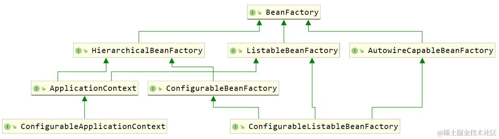

- `BeanFacory` 

  - 根容器
  - 定义了作用域概念
  - 支持多种类型的配置源
  - 集成了环境配置
  - 设有完整的生命周期控制机制
  - 推荐使用依赖注入DI（推），而不是使用借助 `BeanFactory` 进行依赖查找 DL（拉）。

- `HierarchicalBeanFactory` 

  - 支持父子结构

    ~~~java
    public interface HierarchicalBeanFactory extends BeanFactory {
        @Nullable
        BeanFactory getParentBeanFactory();
    
        boolean containsLocalBean(String var1);
    }
    ~~~

    `getBean`方法会从当前 `BeanFactory` 开始查找是否存在指定的 Bean ，如果当前找不到就依次向上找父 `BeanFactory` ，直到找到为止返回，或者都找不到最终抛出 `NoSuchBeanDefinitionException`

    `containsLocalBean(String name)` ，它是检查当前容器中是否有指定名称的 Bean ，并不会考察父容器 。

- `ListableBeanFactory`：

  - 枚举出当前容器（不包括父容器）中的所有Bean

    可以借助 `BeanFactoryUtils` 工具类来获取所有 Bean（工具类中有不少以 `"IncludingAncestors"` 结尾的方法，代表可以一起取父容器）。

    `ListableBeanFactory`会忽略通过其他方式（例如 `ConfigurableBeanFactory` 的 `registerSingleton` 方法）注册的任何单实例 bean

    ~~~java
    // 手动注册一个单实例Bean
    beanFactory.registerSingleton("doggg", new Dog());
    getBeanDefinitionNames()  // 该方法不会包括手动注册的Bean
    ~~~

    `getBean`、`getBeanNamesOfType` 和 `getBeansOfType`  它们可以取到手动注册的 Bean 。

- `AutowireCapableBeanFactory`

  - 依赖注入

    一般与其他框架进行集成时才使用，当其它框架的一些 Bean 实例不受 SpringFramework 容器的控制，但又需要向其注入一些由 SpringFramework 容器管理的对象，那就可以用它了。

    此外，其他框架还可以依赖查询IOC容器【推】，从IOC 容器中获取到对应的Bean对象（不推荐）。

- `ConfigurableBeanFactory`

  - 具有 set 相关的操作，而其他的 `BeanFactory` 只有 get 相关的操作。

  ```java
  void setBeanClassLoader(@Nullable ClassLoader beanClassLoader);
  void setTypeConverter(TypeConverter typeConverter);
  void addBeanPostProcessor(BeanPostProcessor beanPostProcessor);
  void setParentBeanFactory(BeanFactory var1) throws IllegalStateException; //设置父容器
  //...
  ```

  


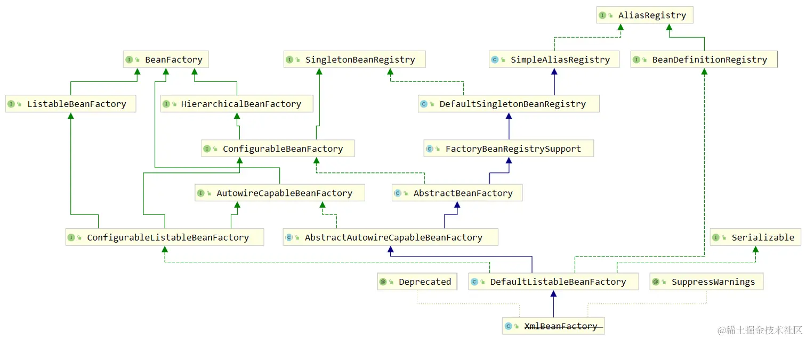

- `AbstractBeanFactory`

  - 是`BeanFactory` 接口最基础的抽象实现类
  - `AbstractBeanFactory`子类要实现的主要模板方法是 `getBeanDefinition` 和 `createBean`

-  `AbstractAutowireCapableBeanFactory`

   - `AbstractAutowireCapableBeanFactory` 实现了对 Bean 的创建、赋值、依赖注入、初始化的逻辑
   - `AbstractAutowireCapableBeanFactory`子类要实现的主要模板方法是 `resolveDependency(DependencyDescriptor, String, Set, TypeConverter)`，它用于解析依赖关系。

- `DefaultListableBeanFactory`

  - 负责Bean的注册，但并不负责解析Bean定义文件

- `XmlBeanFactory` 正式被标注为**过时**，代替的方案是使用 `DefaultListableBeanFactory + XmlBeanDefinitionReader` ，这种设计更**符合组件的单一职责原则**。**配置源分离**

  ~~~java
  DefaultListableBeanFactory beanFactory = new DefaultListableBeanFactory();
  XmlBeanDefinitionReader reader = new XmlBeanDefinitionReader(beanFactory);
  reader.loadBeanDefinitions("applicationContext.xml");
  ~~~

  

  

  

### ApplicationContext

| Feature                     | `BeanFactory` | `ApplicationContext` |
| --------------------------- | ------------- | -------------------- |
| Bean的实例化和属性注入      | Yes           | Yes                  |
| 生命周期管理                | No            | Yes                  |
| Bean后置处理器的支持        | No            | Yes                  |
| BeanFactory后置处理器的支持 | No            | Yes                  |
| 消息转换服务（国际化）      | No            | Yes                  |
| 事件发布机制（事件驱动）    | No            | Yes                  |

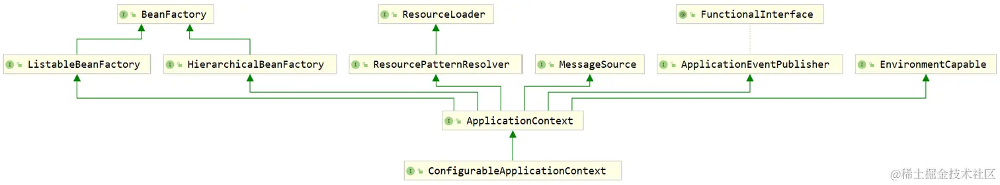

- `ApplicationContext` 

  - 以通用方式加载文件资源的能力。继承自 `ResourceLoader` 接口。

  - 能够将事件发布给注册的监听器。继承自 `ApplicationEventPublisher` 接口。

  - 解析消息的能力，支持国际化。继承自 `MessageSource` 接口。

  - 从父上下文继承。上下文中包含容器、动态增强、资源加载、事件监听机制等多方面扩展功能。在子容器中的定义将始终优先。
  - ApplicationContext负责部分回调注入，例如ResourceLoaderAware、ApplicationEventPublisherAware、ApplicationContextAware。
  - 注意，它并没有直接继承`AbstractBeanFactory`，但它的实现子类通过组合的方式，在内部包含一个 `BeanFactory`，来解析Bean。

- `EnvironmentCapable`的定义如下：

  - 获取Environment

    ~~~java
    public interface EnvironmentCapable {
    	Environment getEnvironment();
    }
    ~~~

    在 SpringFramework 中，以 Capable 结尾的接口，通常意味着可以通过这个接口的某个方法（通常是 `getXXX()` ）拿到特定的组件。

- `ConfigurableApplicationContext`

  - 扩展了 `setParent` 、`setEnvironment` 、`addBeanFactoryPostProcessor` 、`addApplicationListener` 等方法

  - 还扩展了一些方法，刷新（refresh）和关闭（close）方法。

- `MessageSource`

  - 支持国际化

    `ResourcePatternResolver`是 `ResourceLoader` 的扩展，`ResourceLoader` 实现最基本的解析，`ResourcePatternResolver` 可以支持 **Ant** 形式的带星号 ( * ) 的路径解析

    - `/WEB-INF/*.xml` ：匹配 `/WEB-INF` 目录下的任意 xml 文件
    - `/WEB-INF/**/beans-*.xml` ：匹配 `/WEB-INF` 下面任意层级目录的 `beans-` 开头的 xml 文件
    - `/**/*.xml` ：匹配任意 xml 文件

    `ResourcePatternResolver` 还可以匹配类路径下的资源文件，即在资源路径中加一个 `classpath*:` 的前缀

    


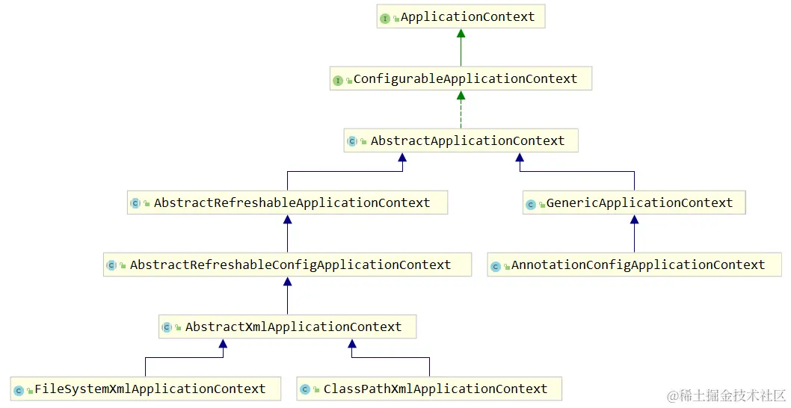

- `ApplicationContext`：`ApplicationContext` 比 `BeanFactory` 强大的地方是支持更多的机制，这里面就包括了**后置处理器、监听器**、MessageSource等，而这些都是一个一个的 Bean ，`BeanFactory` 不会把它们区别对待，但是 `ApplicationContext` 就可以区分出来，并且赋予他们发挥特殊能力的机会。

- `AbstractApplicationContext` 继承了 `DefaultResourceLoader`，具有加载各种资源的能力。此外，它的`getEnvironment()` 方法返回的是`ConfigurableEnvironment`。

- `GenericApplicationContext`

  - 它组合了一个 `DefaultListableBeanFactory`

    ~~~java
    public GenericApplicationContext() {
        // 内置的beanFactory在GenericApplicationContext创建时就已经初始化好了
        this.beanFactory = new DefaultListableBeanFactory();
    }
    ~~~

  - 它还实现了 `BeanDefinitionRegistry` 接口。然而在 `GenericApplicationContext` 中，它实现的定义注册方法 `registerBeanDefinition` 中，在底层还是调用的 `DefaultListableBeanFactory` 执行 `registerBeanDefinition` 方法，说明它也没有对此做什么扩展。

  - 只能刷新一次

    ~~~java
    public AnnotationConfigApplicationContext() {
        this.reader = new AnnotatedBeanDefinitionReader(this);
        this.scanner = new ClassPathBeanDefinitionScanner(this);
    }
    
    public AnnotationConfigApplicationContext(Class<?>... componentClasses) {
        this();
        register(componentClasses);
        refresh();
    }
    ~~~

    ~~~java
    protected final void refreshBeanFactory() throws IllegalStateException {
        if (!this.refreshed.compareAndSet(false, true)) {
            // 利用CAS，保证只能设置一次true，如果出现第二次，就抛出重复刷新异常
            throw new IllegalStateException(
                    "GenericApplicationContext does not support multiple refresh attempts: just call 'refresh' once");
        }
        this.beanFactory.setSerializationId(getId());
    }
    ~~~

- `AbstractRefreshableApplicationContex`

  - 支持多次刷新，每次刷新都创建一个新的内部 `BeanFactory` 实例
  - 子类唯一需要实现的方法是 `loadBeanDefinitions` ，它在每次刷新时都会被调用。一个具体的实现应当根据loadBeanDeinitions的参数，配合 Reader 将 bean 的定义信息加载到给定的 `DefaultListableBeanFactory` 中

- `AbstractRefreshableConfigApplicationContext`

  - 扩展与配置相关的特性，它定义了`getConfigLocations` 方法，意为获取配置源路径

- `AbstractXmlApplicationContext`

  - 子类只需要实现 `getConfigLocations` 这样的方法就好

  - 组合了一个 `XmlBeanDefinitionReader` 组件来解析 xml 配置文件

  - `AbstractXmlApplicationContext`中`loadBeanDefinitions`的实现

    ~~~java
    @Override
    protected void loadBeanDefinitions(DefaultListableBeanFactory beanFactory) throws BeansException, IOException {
        // Create a new XmlBeanDefinitionReader for the given BeanFactory.
        // 借助XmlBeanDefinitionReader解析xml配置文件
        XmlBeanDefinitionReader beanDefinitionReader = new XmlBeanDefinitionReader(beanFactory);
    
        // Configure the bean definition reader with this context's
        // resource loading environment.
        beanDefinitionReader.setEnvironment(this.getEnvironment());
        beanDefinitionReader.setResourceLoader(this);
        beanDefinitionReader.setEntityResolver(new ResourceEntityResolver(this));
    
        // Allow a subclass to provide custom initialization of the reader,
        // then proceed with actually loading the bean definitions.
        // 初始化BeanDefinitionReader，后加载BeanDefinition
        initBeanDefinitionReader(beanDefinitionReader);
        loadBeanDefinitions(beanDefinitionReader);
    }
    
    protected void loadBeanDefinitions(XmlBeanDefinitionReader reader) throws BeansException, IOException {
        Resource[] configResources = getConfigResources();
        if (configResources != null) {
            reader.loadBeanDefinitions(configResources);
        }
        String[] configLocations = getConfigLocations();
        if (configLocations != null) {
            reader.loadBeanDefinitions(configLocations);
        }
    }
    ~~~

- `ClassPathXmlApplicationContext`

  - 如果有多个配置位置，则较新的 `BeanDefinition` 会覆盖较早加载的文件中的 `BeanDefinition`


## @componentScan

~~~java
@Repeatable(ComponentScans.class)
public @interface ComponentScan {
	Class<?>[] basePackageClasses() default {};
    // ...
}
~~~

`basePackageClasses`元素值会以指定类所在的包进行扫描

~~~java
@Configuration
@ComponentScan(basePackageClasses = {DemoService.class, DemoComponent.class})
public class BasePackageClassConfiguration {
    
}
~~~

上面这个示例会把DemoService、DemoComponent所在的包扫描进去。


`@componentScan`还可以支持包扫描的过滤

~~~java
@Configuration
@ComponentScan(basePackages = "com.linkedbear.spring.annotation.f_typefilter",
               includeFilters = @ComponentScan.Filter(type = FilterType.ANNOTATION, value = Animal.class))
public class TypeFilterConfiguration {
    // 扫描含有 @Animal 注解的类
}

~~~

注意，多个`includeFilters`之间互不干扰，相当于取它们的并集。`@ComponentScan` 注解中还有一个属性：`useDefaultFilters` ，它代表的是“是否启用默认的过滤规则”，即扫描@Component` 、`@Repository` 、`@Service 或 @Controller

~~~java
// 排除含有 @Animal 注解的类
@ComponentScan(excludeFilters = @ComponentScan.Filter(type = FilterType.ANNOTATION, value = Animal.class))

// 将Color类型包含进来
@ComponentScan.Filter(type = FilterType.ASSIGNABLE_TYPE, value = Color.class)

// 正则表达式
@ComponentScan.Filter(type = FilterType.REGEX, pattern = "com.linkedbear.spring.annotation.f_typefilter.+Demo.+")
~~~


自定义过滤策略，要实现`TypeFilter`接口

~~~java
@FunctionalInterface
public interface TypeFilter {
	boolean match(MetadataReader metadataReader, MetadataReaderFactory metadataReaderFactory) throws IOException;
}
~~~

- **metadataReader** :the metadata reader for the target class
- **metadataReaderFactory** ：a factory for obtaining metadata readers for other classes (such as superclasses and interfaces)

使用示例：

~~~java
public boolean match(MetadataReader metadataReader, MetadataReaderFactory metadataReaderFactory)
         throws IOException {
    ClassMetadata classMetadata = metadataReader.getClassMetadata();
    // 返回 true ，则说明已经匹配上了。
    return classMetadata.getClassName().equals(Green.class.getName());
}
~~~

注册该过滤器：

~~~java
@ComponentScan.Filter(type = FilterType.CUSTOM, value = GreenTypeFilter.class)
~~~


如果在使用`@Component`时，不指定Bean名称，那么默认使用首字母小写的类名。这是由@ComponentScan中的属性nameGenerator来决定的，它的默认值是`BeanNameGenerator`接口，它的实现类是`AnnotationBeanNameGenerator`

## 资源管理

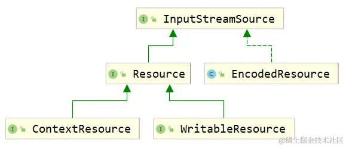

- `InputStreamSource`：获取资源的输入流

  ~~~java
  public interface InputStreamSource {
  	InputStream getInputStream() throws IOException;
  }
  ~~~

- Resource抽象了资源的类型

- EncodedResource表示编码后的资源，它在内部组合了一个Resource

- WritableResource表示可写的资源

- ContextResource表示从一个封闭的 “上下文” 中加载的资源，例如来自 `javax.servlet.ServletContext`

Java 原生能加载的资源：

- ClassLoader 加载类路径下的资源
- File 加载文件系统中的资源
- URL 和不同的协议加载网络上的资源

SpringFramework 提供了对应的实现：

- ClassLoader → `ClassPathResource` [ classpath:/ ]
- File → `FileSystemResource` [ file:/ ]
- URL → `UrlResource` [ xxx:/ ]


我们知道，`AbstractApplicationContext` 继承了 `DefaultResourceLoader`，具有加载各种资源的能力。而`DefaultResourceLoader`组合了一堆`ProtocolResolver`。

~~~java
private final Set<ProtocolResolver> protocolResolvers = new LinkedHashSet<>(4);

public Resource getResource(String location) {
    Assert.notNull(location, "Location must not be null");

    for (ProtocolResolver protocolResolver : getProtocolResolvers()) {
        Resource resource = protocolResolver.resolve(location, this);
        if (resource != null) {
            return resource;
        }
    }
    // ......
}
~~~

`ResourceLoader`在加载资源时，会调用`ProtocolResolver`来解析资源地址

~~~java
@FunctionalInterface
public interface ProtocolResolver {
	Resource resolve(String location, ResourceLoader resourceLoader);
}
~~~

示例：

~~~java
public class DogProtocolResolver implements ProtocolResolver {

    public static final String DOG_PATH_PREFIX = "dog:";

    @Override
    public Resource resolve(String location, ResourceLoader resourceLoader) {
        if (!location.startsWith(DOG_PATH_PREFIX)) {
            return null;
        }
        // 把自定义前缀去掉
        String realpath = location.substring(DOG_PATH_PREFIX.length());
        String classpathLocation = "classpath:resource/" + realpath;
        return resourceLoader.getResource(classpathLocation);
    }
}

public class ProtocolResolverApplication {

    public static void main(String[] args) throws Exception {
        DefaultResourceLoader resourceLoader = new DefaultResourceLoader();
        DogProtocolResolver dogProtocolResolver = new DogProtocolResolver();
        resourceLoader.addProtocolResolver(dogProtocolResolver);
        
        Resource resource = resourceLoader.getResource("dog:Dog.txt");
    }
}

~~~

如果资源路径没有明确的前缀，`DefaultResourceLoader`默认会认为这是一个类路径资源，尝试使用`ClassPathResource`来加载。

~~~java
public Resource getResource(String location) {
    // ......
    if (location.startsWith("/")) {
        return getResourceByPath(location);
    } else if (location.startsWith(CLASSPATH_URL_PREFIX)) {
        return new ClassPathResource(location.substring(CLASSPATH_URL_PREFIX.length()), getClassLoader());
    }
    // ......
}

protected Resource getResourceByPath(String path) {
    return new ClassPathContextResource(path, getClassLoader());
}
~~~

子类覆写`getResourceByPath`方法，可以改变默认的加载器（类加载器）。例如`GenericWebApplicationContext`从`ServletContext` 中加载。

## PropertySource

@PropertySource还可以解析xml文件：

~~~java
<?xml version="1.0" encoding="UTF-8"?>
<!DOCTYPE properties SYSTEM "http://java.sun.com/dtd/properties.dtd">
<properties>
    <entry key="xml.jdbc.url">jdbc:mysql://localhost:3306/test</entry>
    <entry key="xml.jdbc.driver-class-name">com.mysql.jdbc.Driver</entry>
    <entry key="xml.jdbc.username">root</entry>
    <entry key="xml.jdbc.password">123456</entry>
</properties>
~~~

我们来看一下@PropertySource的实现：

~~~java
public @interface PropertySource {
    // ......
	Class<? extends PropertySourceFactory> factory() default PropertySourceFactory.class;
}
~~~

可见，它通过`PropertySourceFactory`工厂类来解析文件，我们可以自定义`PropertySourceFactory`，来解析任何格式的文件。这里我们来解析yaml文件：

~~~java
public class YmlPropertySourceFactory implements PropertySourceFactory {
    
    @Override
    public PropertySource<?> createPropertySource(String name, EncodedResource resource) throws IOException {
        // name参数是PropertySource的名称，方便在之后的getProperty()或者containsProperty()方法引用这个PropertySource
        
        // 在 snake-yaml （需要Maven引入）中有一个能快速解析 yml 文件的类，叫 YamlPropertiesFactoryBean
        YamlPropertiesFactoryBean yamlPropertiesFactoryBean = new YamlPropertiesFactoryBean();
        
        yamlPropertiesFactoryBean.setResources(resource.getResource());
        
        Properties properties = yamlPropertiesFactoryBean.getObject();
        
        return new PropertiesPropertySource((name != null ? name : resource.getResource().getFilename()), properties);
    }
}

~~~

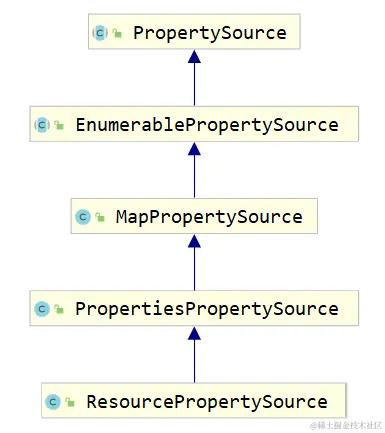

## 配置源 & 配置元信息

Bean的元信息为`BeanDefinition`，包括：

- Bean 的全限定名 className
- Bean 的作用域 scope
- Bean 是否延迟加载 lazy
- Bean 的工厂 Bean 名称 factoryBean
- Bean 的构造方法参数列表 constructorArgumentValues
- Bean 的属性值 propertyValues


容器的元信息分为 beans 和 context 两部分

beans的配置元信息：

| 配置元信息                  | 含义 / 作用                                                  | 默认值           |
| --------------------------- | ------------------------------------------------------------ | ---------------- |
| profile                     | 基于环境的配置                                               | ""               |
| default-autowire            | 默认的自动注入模式（不需要声明 `@Autowired` 等注解即可注入组件） | default（no）    |
| default-autowire-candidates | 满足指定属性名规则的属性才会被自动注入                       | ""               |
| default-init-method         | 全局 bean 的初始化方法                                       | ""               |
| default-destroy-method      | 全局 bean 的销毁方法                                         | ""               |
| default-lazy-init           | 全局 bean 是否延迟加载                                       | default（false） |
| default-merge               | 继承父 bean 时直接合并父 bean 的属性值                       | default（false） |

 context 的元信息：

| 配置元信息                        | 含义 / 作用                                               |
| --------------------------------- | --------------------------------------------------------- |
| `<context:annotation-config/>`    | 开启注解驱动                                              |
| `<context:component-scan/>`       | 开启组件扫描                                              |
| `<context:property-placeholder/>` | 引入外部的资源文件（ properties xml yml 等）              |
| `<context:property-override/>`    | 指定配置源会覆盖全局配置（可用于配置覆盖）                |
| `<context:spring-configured/>`    | 可以对没有注册到 IOC 容器的 bean 实现依赖注入             |
| `<context:load-time-weaver/>`     | 与 AOP 相关（放到 AOP 章节介绍）                          |
| `<context:mbean-server/>`         | 暴露应用运行状态监控（与 JMX 管理监控有关）               |
| `<context:mbean-export/>`         | 注册 MBean 到 JMX 实现运行状态监控（与 JMX 管理监控有关） |

## Environment

The `Environment` interface is an abstraction integrated in the container that models two key aspects of the application environment: profiles and properties.

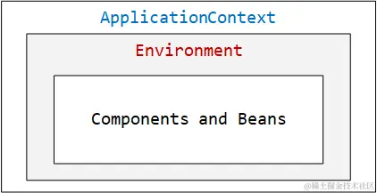

默认的profiles是 `default` 

`Environment` 的设计本身就应该是一个不被应用程序接触到的 “环境” ，我们只能从环境中获取一些它已经有的信息，但不应该获取它本身。

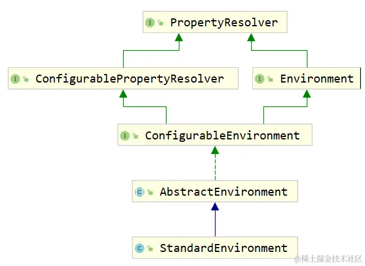

PropertyResolver用于处理占位符 **${}**，即处理属性值的获取和解析。在`AbstractEnvironment#getProperty()`中，真正做解析工作的是`ConfigurablePropertyResolver`对象。

~~~java
private final ConfigurablePropertyResolver propertyResolver =
        new PropertySourcesPropertyResolver(this.propertySources);

@Override
@Nullable
public String getProperty(String key) {
    return this.propertyResolver.getProperty(key);
}

~~~

在 SpringFramework 的框架编码中，不带 do 开头的方法一般负责前置校验处理、返回结果封装，带 do 开头的方法是真正执行逻辑的方法（如 `getBean` 方法的底层会调用 `doGetBean` 来真正的寻找 IOC 容器的 bean ，`createBean` 会调用 `doCreateBean` 来真正的创建一个 bean ）。

## Bean与BeanDefinition

`BeanDefinition` 是一种**配置元信息**，它描述了 **Bean 的定义信息**

- Bean 的类信息 - 全限定类名 ( beanClassName )
- Bean 的属性 - 作用域 ( scope ) 、是否默认 Bean ( primary ) 、描述信息 ( description ) 等
- Bean 的行为特征 - 是否延迟加载 ( lazy ) 、是否自动注入 ( autowireCandidate ) 、初始化 / 销毁方法 ( initMethod / destroyMethod ) 等
- Bean 与其他 Bean 的关系 - 父 Bean 名 ( parentName ) 、依赖的 Bean ( dependsOn ) 等
- Bean 的配置属性 - 构造器参数 ( constructorArgumentValues ) 、属性变量值 ( propertyValues ) 等

`BeanDefinition` 具有层次性，并且可以在 IOC 容器初始化阶段被 `BeanDefinitionRegistryPostProcessor` 构造和注册，被 `BeanFactoryPostProcessor` 拦截修改等。

BeanDefinition的结构：

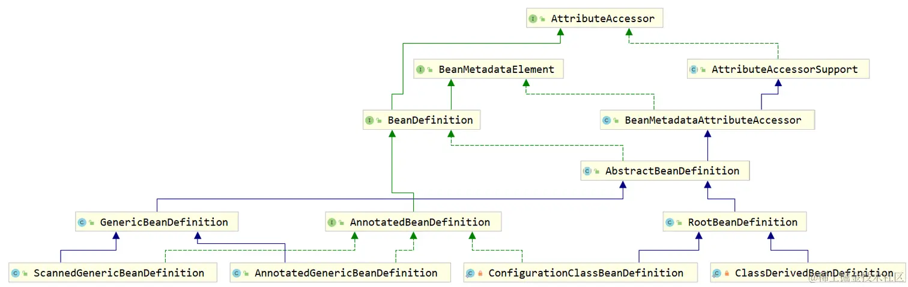


- `AttributeAccessor`：属性访问器。定义用于将元数据附加到任意对象，或从任意对象访问元数据的通用协定的接口。它使得BeanDefinition有配置Bean的功能（访问、修改、移除Bean的属性）

  ~~~java
  public interface AttributeAccessor {
      // 设置bean中属性的值
      void setAttribute(String name, @Nullable Object value);
  
      // 获取bean中指定属性的值
      Object getAttribute(String name);
  
      // 移除bean中的属性
      Object removeAttribute(String name);
  
      // 判断bean中是否存在指定的属性
      boolean hasAttribute(String name);
  
      // 获取bean的所有属性
      String[] attributeNames();
  }
  ~~~

- `BeanMetadataElement`：获取 bean 的资源来源

  ~~~java
  public interface BeanMetadataElement {
      default Object getSource() {
          return null;
      }
  }
  ~~~

- `AbstractBeanDefinition`，它是抽取了`GenericBeanDefinition` ，`RootBeanDefinition` 和 `ChildBeanDefinition` 的常用属性

  ~~~java
      // bean的全限定类名
      private volatile Object beanClass;
  
      // 默认的作用域为单实例
      private String scope = SCOPE_DEFAULT;
  
      // 默认bean都不是抽象的
      private boolean abstractFlag = false;
  
      // 是否延迟初始化
      private Boolean lazyInit;
      
      // 自动注入模式(默认不自动注入)
      private int autowireMode = AUTOWIRE_NO;
  
      // 是否参与IOC容器的自动注入(设置为false则它不会注入到其他bean，但其他bean可以注入到它本身)
      // 可以这样理解：设置为false后，你们不要来找我，但我可以去找你们
      private boolean autowireCandidate = true;
  
      // 同类型的首选bean
      private boolean primary = false;
  
      // bean的构造器参数和参数值列表
      private ConstructorArgumentValues constructorArgumentValues;
  
      // bean的属性集合
      private MutablePropertyValues propertyValues;
  
      // bean的初始化方法
      private String initMethodName;
  
      // bean的销毁方法
      private String destroyMethodName;
  
      // bean的资源来源
      private Resource resource;
  ~~~

- `GenericBeanDefinition`，它仅仅比 `AbstractBeanDefinition` 多了一个 `parentName` 属性而已。

- `RootBeanDefinition` & `ChildBeanDefinition`：

  `RootBeanDefinition` 在 `AbstractBeanDefinition` 的基础上，又扩展了这么些 Bean 的信息：

  - Bean 的 id 和别名
  - Bean 的注解信息
  - Bean 的工厂相关信息

- `AnnotatedBeanDefinition`

  ~~~java
  public interface AnnotatedBeanDefinition extends BeanDefinition {
  	AnnotationMetadata getMetadata();
      
  	MethodMetadata getFactoryMethodMetadata();
  }
  ~~~

  

使用 xml 配置文件的方式，每定义一个 `<bean>` 标签，就相当于构建了一个 BeanDefinition。测试代码如下：

  ~~~java
ClassPathXmlApplicationContext ctx = new ClassPathXmlApplicationContext("definition/definition-beans.xml");
        BeanDefinition personBeanDefinition = ctx.getBeanFactory().getBeanDefinition("person");
        System.out.println(personBeanDefinition);
  ~~~

 

~~~java
AnnotationConfigApplicationContext ctx = new AnnotationConfigApplicationContext(
                "com.linkedbear.spring.definition.a_quickstart.bean");
        BeanDefinition personBeanDefinition = ctx.getBeanDefinition("person");
~~~


  Spring 通过不同的方式创建 `BeanDefinition`，并最终将其注册到 `BeanFactory` 中：

1. 通过 xml 加载的 `BeanDefinition` ，它的读取工具是 `XmlBeanDefinitionReader` ，
2. 通过模式注解 + 组件扫描的方式构造的 `BeanDefinition` ，它的扫描工具是 `ClassPathBeanDefinitionScanner` 
3. 通过配置类 + `@Bean` 注解的方式构造的 `BeanDefinition` 最复杂，它涉及到配置类的解析。

  这些创建的BeanDefinition的类型都有所不同。

  

  ## BeanDefinitionRegistry

`BeanDefinitionRegistry`的设计目的就是保存所有的`BeanDefinition`。Spring框架将注册表抽象成一个接口——`BeanDefinitionRegistry`，它有三个关键方法：

~~~java
void registerBeanDefinition(String beanName, BeanDefinition beanDefinition)
            throws BeanDefinitionStoreException;

void removeBeanDefinition(String beanName) throws NoSuchBeanDefinitionException;

BeanDefinition getBeanDefinition(String beanName) throws NoSuchBeanDefinitionException;
~~~


其实在 SpringFramework 中的底层，对于 `BeanDefinition` 的注册表的设计，就是一个 `Map` ：

~~~java
// 源自DefaultListableBeanFactory，它也实现了BeanDefinitionRegistry接口，也是主要的实现类
private final Map<String, BeanDefinition> beanDefinitionMap = new ConcurrentHashMap<>(256);
~~~


要剔除 `BeanDefinition` ，需要实现 `BeanFactoryPostProcessor` 接口，并重写 `postProcessBeanFactory` 方法

~~~java
@Component
public class RemoveBeanDefinitionPostProcessor implements BeanFactoryPostProcessor {
    @Override
    public void postProcessBeanFactory(ConfigurableListableBeanFactory beanFactory) throws BeansException {
    // 移除 IOC 容器中所有性别为 male 的 Person 。
    // 获取IOC容器中的所有BeanDefinition
    for (String beanDefinitionName : beanFactory.getBeanDefinitionNames()) {
        // 判断BeanDefinition对应的Bean是否为Person类型
        BeanDefinition beanDefinition = beanFactory.getBeanDefinition(beanDefinitionName);
        if (Person.class.getName().equals(beanDefinition.getBeanClassName())) {
            // 判断Person的性别是否为male
            // 使用xml配置文件对bean进行属性注入，最终取到的类型为TypedStringValue
            TypedStringValue sex = (TypedStringValue) beanDefinition.getPropertyValues().get("sex");
            if ("male".equals(sex.getValue())) {
                // 移除BeanDefinition
                registry.removeBeanDefinition(beanDefinitionName);
            }
        }
    }
    }
}
~~~


Bean的合并。下面通过一个例子来讲解：

~~~java
public class Person { }

public abstract class Animal {
    private Person person;
}

public class Cat extends Animal {
    private String name;
}
~~~

~~~xml
<bean class="com.linkedbear.spring.definition.d_merge.bean.Cat" parent="abstract-animal">
    <property name="person" ref="person"/>
    <property name="name" value="咪咪"/>
</bean>
~~~

此时，我们想要继承Animal Bean的依赖注入，可以这样写：

~~~xml
<!--在 Spring 配置文件中将 bean 标记为抽象，那么这个 bean 不能被实例化。-->
<bean id="abstract-animal" class="com.linkedbear.spring.definition.d_merge.bean.Animal" abstract="true">
    <property name="person" ref="person"/>
</bean>

<bean id="cat" class="com.linkedbear.spring.definition.d_merge.bean.Cat" parent="abstract-animal">
    <property name="name" value="咪咪"/>
</bean>
~~~

测试代码：

~~~java
BeanDefinition catDefinition = ctx.getBeanFactory().getBeanDefinition("cat");
~~~

这样获取的Cat BeanDefinition是没有和Animal BeanDefinition合并在一起的，我们可以通过`getMergedBeanDefinition()`方法来解决这个问题：

~~~java
BeanDefinition catDefinition = ctx.getBeanFactory().getMergedBeanDefinition("cat");
~~~


这里顺便讲解一下@Component 抽象类。接口和抽象类都是可以加`@Component`注解的，但是必须其中至少还有一个方法带有`@Lookup`注解。

`@Lookup`注解是一个在单例`bean`中使用一个多例`bean`的解决方案。考虑下面这个场景：

~~~java
@Component
public class A {
    @Autowired
    B b;
    
    public void print() {
        System.out.println(b);
    }
}

@Component
@Scope(ConfigurableBeanFactory.SCOPE_PROTOTYPE)
public class B {
    
}
~~~

如果想要在每次调用print时，打印一个新的b对象，那么可以考虑实现`ApplicationContextAware`接口来解决这个问题，但这样代码过于笨重。此时我们就可以引入@Lookup来优雅地解决这个问题：

~~~java
@Component
public class A {
    public void print() {
        System.out.println(this.getB());
    }
    
    @Lookup
    public B getB () {
        // 容器会自动帮你覆盖实现，改为调用BeanFactory的getBean方法
        return null;
    }
}
~~~

但这有点侵入代码的味道，我们可以这样写：

~~~java
@Component
public interface BCreator {
    @Lookup
    B getB();
}

@Component
public class A {
    @Autowired
    BCreator bCreator;
    
    public void print() {
        System.out.println(bCreator.getB());
    }
}
~~~

这也是为什么一开始要要求@Component抽象类必须有一个@Loopup注解的方法。

## 后置处理器

`BeanPostProcessor` 接口定义了回调方法，可以实现这些回调方法以提供自己的（或覆盖容器默认的）实例化逻辑、依赖处理 / 解析逻辑等。`BeanPostProcessor` 作用于 **bean 对象的创建（实例化）之后**。具体来说，是Bean初始化前后。不同 IOC 容器中的 `BeanPostProcessor` 不会互相起作用。


`BeanPostProcessor` 提供了两个回调时机：「**bean 的初始化之前**」和「 **bean 的初始化之后**」，它们分别适合做**填充**和**代理**的工作。

~~~java
public interface BeanPostProcessor {
    
    default Object postProcessBeforeInitialization(Object bean, String beanName) throws BeansException {
        return bean;
    }

    default Object postProcessAfterInitialization(Object bean, String beanName) throws BeansException {
        return bean;
    }
}
~~~

- `postProcessBeforeInitialization` 方法会在任何 bean 的初始化回调（例如 `InitializingBean` 的 `afterPropertiesSet` 或自定义 `init-method` ）之前执行，

- `postProcessAfterInitialization` 方法会在任何 bean 的初始化回调之后。

- 不论是基于构造方法的依赖注入，还是基于Setter方法的依赖注入，都是在 `postProcessBeforeInitialization` 方法之前进行的

可以配置多个 `BeanPostProcessor` 实例，并且可以通过设置 `order` 属性来控制这些 `BeanPostProcessor` 实例的运行顺序。


自定义一个后置处理器，并使用包扫描机制来注册：

~~~java
public class BeanPostProcessorQuickstartApplication {
    public static void main(String[] args) throws Exception {
        AnnotationConfigApplicationContext ctx = new AnnotationConfigApplicationContext(
                "com.linkedbear.spring.postprocessor.a_quickstart");
        ctx.close();
    }
}
~~~

注意，`postProcessBeforeInitialization`方法有一个兜底保护：

~~~java
@Override
public Object applyBeanPostProcessorsBeforeInitialization(Object existingBean, String beanName) throws BeansException {

    Object result = existingBean;
    for (BeanPostProcessor processor : getBeanPostProcessors()) {
        Object current = processor.postProcessBeforeInitialization(result, beanName);
        // 兜底保护
        if (current == null) {
            return result;
        }
        result = current;
    }
    return result;
}
~~~


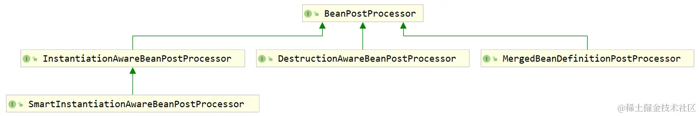

`BeanPostProcessor` 的子接口，它添加了实例化之前的回调，以及在实例化之后但在设置显式属性或自动装配发生之前的回调，**主要供框架内部使用**。


`InstantiationAwareBeanPostProcessor` 中定义了 4 个方法：

~~~java
public interface InstantiationAwareBeanPostProcessor extends BeanPostProcessor {
    // 注意，不是postProcessBeforeInitialization
    @Nullable
    default Object postProcessBeforeInstantiation(Class<?> beanClass, String beanName) throws BeansException {
        return null;
    }
	
    // 注意，不是postProcessAfterInitialization
    default boolean postProcessAfterInstantiation(Object bean, String beanName) throws BeansException {
        return true;
    }

    @Nullable
    default PropertyValues postProcessProperties(PropertyValues pvs, Object bean, String beanName) throws BeansException {
        return null;
    }

    /** @deprecated  被上面两个方法代替 */
    @Deprecated
    @Nullable
    default PropertyValues postProcessPropertyValues(PropertyValues pvs, PropertyDescriptor[] pds, Object bean, String beanName) throws BeansException {
        return pvs;
    }
}
~~~

- `postProcessBeforeInstantiation` ：在 bean 的实例化之前调用。如果返回一个非空对象，那么后续的所有Bean实例化与初始化的动作将不再进行（包括依赖注入）。只会调用后续的`BeanPostProcessor@postProcessAfterInitialization()`。
- `postProcessAfterInstantiation` ：在 bean 的实例化之后，在依赖注入之前调用。如果返回 false ，则，将会跳过Bean的剩余属性填充步骤（包括`postProcessProperties`）
- `postProcessProperties` ：在装配属性之前执行


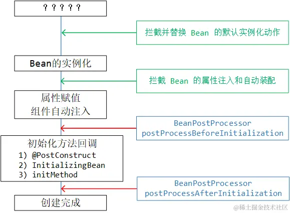

使用示例

~~~java
@Component
class CustomBeanPostProcessor implements InstantiationAwareBeanPostProcessor {    
	@Override
    public PropertyValues postProcessProperties(PropertyValues pvs, Object bean, String beanName)
            throws BeansException {
        if ("ball2".equals(beanName)) {
            MutablePropertyValues values = new MutablePropertyValues(pvs);
            values.addPropertyValue("id", "拦截球~");
            return values;
        }
        return null;
    }
}
~~~


`DestructionAwareBeanPostProcessor`可以在 bean 销毁前进行拦截处理。

~~~java
public interface DestructionAwareBeanPostProcessor extends BeanPostProcessor {
    void postProcessBeforeDestruction(Object var1, String var2) throws BeansException;

    default boolean requiresDestruction(Object bean) {
        return true;
    }
}
~~~


之前我们介绍过基于XML的bean合并，现我们来看基于注解的Bean合并。

```java
public abstract class Animal {
    @Autowired
    private Person person;
}

public class Cat extends Animal {
    private String name;
}
```


`MergeDefinitionPostProcessor`正是在Bean合并之后拦截，它发生在bean 的实例化之后，自动注入之前。

~~~java
public interface MergedBeanDefinitionPostProcessor extends BeanPostProcessor {
	void postProcessMergedBeanDefinition(RootBeanDefinition beanDefinition, Class<?> beanType, String beanName);

	default void resetBeanDefinition(String beanName) {}
}
~~~


## BeanFactoryPostProcessor

`BeanFactoryPostProcessor`是 `BeanDefinition`的后置处理器，它可以在 Bean 实例化之前（包括`InstantiationAwareBeanPostProcessor#postProcessBeforeInstantiation`），修改定义信息。它的定义如下：

~~~java
@FunctionalInterface
public interface BeanFactoryPostProcessor {
    void postProcessBeanFactory(ConfigurableListableBeanFactory var1) throws BeansException;
}
~~~

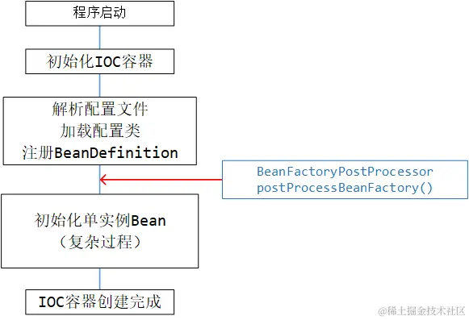


使用示例：

~~~java
@Component
public class ColorNameSetterFactoryPostProcessor implements BeanFactoryPostProcessor {
    
    @Override
    public void postProcessBeanFactory(ConfigurableListableBeanFactory beanFactory) throws BeansException {
        Stream.of(beanFactory.getBeanDefinitionNames()).forEach(beanName -> {
            BeanDefinition beanDefinition = beanFactory.getBeanDefinition(beanName);
            if (StringUtils.hasText(beanDefinition.getBeanClassName())) {
                if (ClassUtils.resolveClassName(
                    		beanDefinition.getBeanClassName(), 
                    		this.getClass().getClassLoader())
                    	.getSuperclass()
                    	.equals(Color.class)) {
                    // 如果一个对象的父类为Color，那么给该对象的name属性赋值
                    beanDefinition.getPropertyValues().add("name", beanName);
                }
            }
        });
    }
}
~~~


`BeanDefinitionRegistryPostProcessor`可以在 `BeanFactoryPostProcessor` 之前，注册其他的 `BeanDefinition`。而且`BeanFactoryPostProcessor#postProcessBeanFactory()`优先处理通过它注册的`BeanDefiniton`


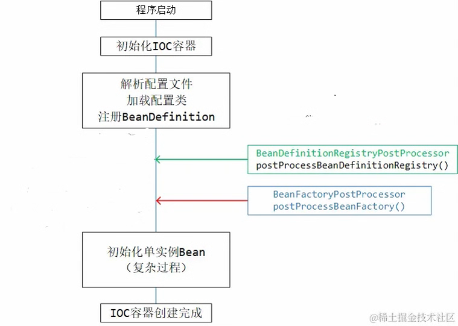

使用示例：

~~~java
@Component
public class DogRegisterPostProcessor implements BeanDefinitionRegistryPostProcessor {
    
    @Override
    public void postProcessBeanDefinitionRegistry(BeanDefinitionRegistry registry) throws BeansException {
        if (!registry.containsBeanDefinition("dog")) {
            // 构造BeanDefinition，并注册进BeanFactory
            BeanDefinition dogDefinition = BeanDefinitionBuilder.genericBeanDefinition(Dog.class).getBeanDefinition();
            registry.registerBeanDefinition("dog", dogDefinition);
        }
    }
    
    @Override
    public void postProcessBeanFactory(ConfigurableListableBeanFactory beanFactory) throws BeansException {
    }
}
~~~


此外，`BeanDefinitionRegistryPostProcessor`还可以通过构造`BeanDefiniton`来动态注册`BeanFactoryPostProcessor`

~~~java
@Component
public class AnimalProcessorRegisterPostProcessor implements BeanDefinitionRegistryPostProcessor {
    
    @Override
    public void postProcessBeanDefinitionRegistry(BeanDefinitionRegistry registry) throws BeansException {
        // 这里的AnimalNameSetterPostProcessor类已经实现了BeanFactoryPostProcessor接口
        registry.registerBeanDefinition("animalNameSetterPostProcessor", 
                new RootBeanDefinition(AnimalNameSetterPostProcessor.class));
    }
    
    @Override
    public void postProcessBeanFactory(ConfigurableListableBeanFactory beanFactory) throws BeansException {
    
    }
}

public class AnimalNameSetterPostProcessor implements BeanFactoryPostProcessor { }
~~~


## 编程式驱动的 IOC


借助BeanDefinition来注册Bean

~~~java
public static void main(String[] args) throws Exception {
    AnnotationConfigApplicationContext ctx = new AnnotationConfigApplicationContext();
    BeanDefinition personDefinition = BeanDefinitionBuilder
        .rootBeanDefinition(Person.class)
        // 设置name属性
        .addPropertyValue("name", "zhangsan")
        .getBeanDefinition();
    
    BeanDefinition catDefinition = BeanDefinitionBuilder.rootBeanDefinition(Cat.class)
        // 依赖注入的对象引用，在 xml 配置文件中用 ref 属性，此处也是用对应的 property reference 来设置
        .addPropertyValue("name", "咪咪").addPropertyReference("person", "laowang")
        .getBeanDefinition();
    
    ctx.registerBeanDefinition("person", personDefinition)
    ctx.registerBeanDefinition("car", personDefinition)    
    ctx.refresh();
    // refresh 方法的执行，会触发非延迟加载的单实例 bean 的实例化和初始化
    
    Person person = ctx.getBean(Person.class);
    System.out.println(person);
}
// registerBeanDefinition 方法来自于 BeanDefinitionRegistry接口，所以用 ApplicationContext 或者 ConfigurableApplicationContext 接口是拿不到该方法的
~~~


借助包扫描来注册Bean

~~~java
AnnotationConfigApplicationContext ctx = new AnnotationConfigApplicationContext();
ClassPathBeanDefinitionScanner scanner = new ClassPathBeanDefinitionScanner(ctx);

scanner.addIncludeFilter((metadataReader, metadataReaderFactory) -> {
    // getClassMetadata可以获取到扫描类的相关元信息，此处把Animal的子类都拿出来
    return metadataReader
        .getClassMetadata()
        .getSuperClassName()
        .equals(Animal.class.getName());
});

// 返回值是注册进 IOC 容器的 bean 的数量
int count = scanner.scan("com.linkedbear.spring.programmatic.b_di.bean");
~~~

ClassPathBeanDefinitionScanner还有一个方法

~~~java
public Set<BeanDefinition> findCandidateComponents(String basePackage);
~~~

该方法会获取包扫描之后 `BeanDefinition`，但不会注册进IOC容器中，这给了我们很大的操作空间。

~~~java
Set<BeanDefinition> animalDefinitions = scanner
    .findCandidateComponents("com.linkedbear.spring.programmatic.b_di.bean");

animalDefinitions.forEach(definition -> {
    MutablePropertyValues propertyValues = definition.getPropertyValues();
    String beanClassName = definition.getBeanClassName();
    propertyValues.addPropertyValue("name", beanClassName);
    // 设置依赖注入的引用，需要借助RuntimeBeanReference实现
    // 设置person属性
    propertyValues.addPropertyValue("person", new RuntimeBeanReference("laowang"));
    // 手动注册
    ctx.registerBeanDefinition(
        Introspector.decapitalize(
            beanClassName.substring(
                beanClassName.lastIndexOf("."))), 
        definition);
    
});

ctx.refresh();	// 手动刷新。
~~~


## 条件装配

需求：通过标注一个 `@EnableJdbc` 的注解，能够根据当前工程中所导入的数据库连接驱动，注册对应的数据源到 IOC 容器中去。


> 
>
> 在 Java 中，如果一个注解被 `@Target(ElementType.TYPE)` 或 `@Target(ElementType.ANNOTATION_TYPE)` 标注，那么，该注解可以标注其它注解。被标注的注解称为**复合注解（Composed Annotation）**。这类似于继承的关系，但是派生注解不仅**不继承**元素，还要必须设置没有默认值的元素。
>
> ~~~java
> @Target(ElementType.TYPE)
> @Retention(RetentionPolicy.RUNTIME)
> public @interface Zero {
>  String value() default "";
> }
> 
> 
> @Target(ElementType.TYPE)
> @Retention(RetentionPolicy.RUNTIME)
> @Zero("114514")
> public @interface One {
>  String value() default "";
> }
> 
> @One
> class App { }
> ~~~
>
> 获取注解的注解
>
> ~~~java
> One annotationOne = App.class.getAnnotation(One.class);  
> Class<? extends Annotation> classOne = annotationOne.annotationType(); 
> Zero annotationZero = classOne.getAnnotation(Zero.class);
> ~~~


首先介绍一下**SPI（Service Provider Interface 服务提供接口）**，它通过「**服务寻找**」的机制，动态加载接口 / 抽象类对应的具体实现类。

我们先来看JDK的SPI。所有定义的 SPI 文件都必须放在工程的 `META-INF/services` 目录下，且文件名必须命名为接口 / 抽象类的全限定名，文件内容为接口 / 抽象类的具体实现类的全限定名。SPI文件的示例：

~~~java
com.linkedbear.spring.configuration.z_spi.bean.DemoMySQLDaoImpl
com.linkedbear.spring.configuration.z_spi.bean.DemoOracleDaoImpl
~~~

测试代码：

~~~java
public static void main(String[] args) throws Exception {
    ServiceLoader<DemoDao> serviceLoader = ServiceLoader.load(DemoDao.class);
    serviceLoader.iterator().forEachRemaining(dao -> {
        // 这里的dao对象的类型就是DemoDao接口/抽象类的实现类
        System.out.println(dao);
    });
}
~~~

然后我们再来看SpringFramework 的SPI，它可不像JDK SPI那样，局限于接口 / 抽象类，而是可以服务发现任何一个类、接口、注解。所有定义的 SPI 文件都必须放在工程的`META-INF` 下，且文件名必须为 `spring.factories`，key是要服务发现的对象，而value是实现它的类，如果有多个类，那么用逗号分割。SPI文件的示例：

~~~properties
com.linkedbear.spring.configuration.z_spi.bean.DemoDao=\
  com.linkedbear.spring.configuration.z_spi.bean.DemoMySQLDaoImpl,\
  com.linkedbear.spring.configuration.z_spi.bean.DemoOracleDaoImpl
~~~

测试代码：

~~~java
 // 加载并实例化
List<DemoDao> demoDaos = SpringFactoriesLoader
	.loadFactories(
    	DemoDao.class, 
    	SpringSpiApplication.class.getClassLoader());

demoDaos.forEach(dao -> {
    System.out.println(dao);
});
/**
com.linkedbear.spring.configuration.z_spi.bean.DemoMySQLDaoImpl@7506e922
com.linkedbear.spring.configuration.z_spi.bean.DemoOracleDaoImpl@4ee285c6
*/

// 只加载全限定类名
List<String> daoClassNames = SpringFactoriesLoader
	.loadFactoryNames(
    	DemoDao.class, 
    	SpringSpiApplication.class.getClassLoader());

daoClassNames.forEach(className -> {
    System.out.println(className);
});
/**
com.linkedbear.spring.configuration.z_spi.bean.DemoMySQLDaoImpl
com.linkedbear.spring.configuration.z_spi.bean.DemoOracleDaoImpl
*/
~~~


## Bean的工厂创建

### FactoryBean

FactoryBean将复杂的Bean创建逻辑抽离出来了

~~~java
public interface FactoryBean<T> {
    // 返回创建的对象
    @Nullable
    T getObject() throws Exception;

    // 返回创建的对象的类型（即泛型类型）
    @Nullable
    Class<?> getObjectType();

    // 创建的对象是单实例Bean还是原型Bean，默认单实例
    default boolean isSingleton() {
        return true;
    }
}

~~~

下面给出一个例子：

~~~java
class Child {
    // 小孩子想玩的球
    private String wantToy = "ball";
    
    public String getWantToy() {
        return wantToy;
    }
}
abstract class Toy {
    private String name;
    
    public Toy(String name) {
        this.name = name;
    }
}
class Ball extends Toy { 
    public Ball(String name) {
        super(name);
    }
}
class Car extends Toy { 
    public Car(String name) {
        super(name);
    }
}
~~~

~~~java
public class ToyFactoryBean implements FactoryBean<Toy> {
    private Child child;
    
    @Override
    public Toy getObject() throws Exception {
        switch (child.getWantToy()) {
            case "ball":
                return new Ball("ball");
            case "car":
                return new Car("car");
            default:
                return null;
        }
    }
    
    @Override
    public Class<Toy> getObjectType() {
        return Toy.class;
    }
    
    public void setChild(Child child) {
        this.child = child;
    }
}
~~~

通过xml注册FactoryBean

~~~xml
<bean id="child" class="com.linkedbear.spring.bean.a_type.bean.Child"/>

<bean id="toyFactory" class="com.linkedbear.spring.bean.a_type.bean.ToyFactoryBean">
    <property name="child" ref="child"/>
</bean>
~~~

或者，通过配置类注册

~~~java
@Bean
public Child child() {
    return new Child();
}

@Bean
public ToyFactoryBean toyFactory() {
    ToyFactoryBean toyFactory = new ToyFactoryBean();
    toyFactory.setChild(child());
    return toyFactory;
}
~~~

FactoryBean会向容器中注册两个Bean，一个是它本身，一个是getObject()返回的对象。

### 静态工厂

静态工厂创建Bean

~~~java
public class CarStaticFactory {
    public static Car getCar() {
        return new Car();
    }
}
~~~

配置xml

~~~xml
<bean id="car2" class="com.linkedbear.spring.bean.c_instantiate.bean.CarStaticFactory" factory-method="getCar"/>
~~~

或者，配置类

~~~java
@Bean
public Car car2() {
    // 逻辑很简单
    return CarStaticFactory.getCar();
}
~~~

注意：静态工厂本身未注册到容器中

### 实例工厂

实例工厂创建Bean

~~~java
public class CarInstanceFactory {
    public Car getCar() {
        return new Car();
    }
}
~~~

配置xml

~~~xml
<bean id="carInstanceFactory" class="com.linkedbear.spring.bean.c_instantiate.bean.CarInstanceFactory"/>
<bean id="car3" factory-bean="carInstanceFactory" factory-method="getCar"/>
~~~

显然，实例工厂注册到了容器中

## 事件 & 监听器 高级

子容器的事件会向上传播到父容器，父容器的事件不会向下传播。相关测试代码如下：

~~~java
public static void main(String[] args) throws Exception {
    AnnotationConfigApplicationContext parentCtx = new AnnotationConfigApplicationContext();
    parentCtx.addApplicationListener(new HierarchicalEventListener());

    AnnotationConfigApplicationContext childCtx = new AnnotationConfigApplicationContext();
    childCtx.setParent(parentCtx);
    childCtx.addApplicationListener(new HierarchicalEventListener());

    // 先刷新父容器，再刷新子容器，否则会抛出 ApplicationEventMulticaster 没有初始化的异常
    parentCtx.refresh();
    childCtx.refresh();

    // 直接通过容器来发送消息
    parentCtx.publishEvent(new HierarchicalEvent("父容器发布的HierarchicalEvent"));
    childCtx.publishEvent(new HierarchicalEvent("子容器发布的HierarchicalEvent"));
}
~~~


`PayloadApplicationEvent`是`ApplicationEvent`的扩展，它能承载任何类型的数据：

~~~java
public class PayloadApplicationEvent<T> extends ApplicationEvent implements ResolvableTypeProvider {
	private final T payload;

	public PayloadApplicationEvent(Object source, T payload) {
		super(source);
		this.payload = payload;
	}
}
~~~

使用示例：

~~~java
public class PayloadObjectApplicationListener implements ApplicationListener<PayloadApplicationEvent> {
    
    @Override
    public void onApplicationEvent(PayloadApplicationEvent event) {
        System.out.println("监听到PayloadApplicationEvent ------> " + event.getPayload());
    }
}
~~~

如果指定了`PayloadApplicationEvent`的泛型为 `Integer` ，那就只会监听 `Integer` 类型的 payload 事件了

~~~java
public class PayloadIntegerApplicationListener implements ApplicationListener<PayloadApplicationEvent<Integer>> {
    
    @Override
    public void onApplicationEvent(PayloadApplicationEvent event) {
        System.out.println("监听到PayloadApplicationEvent[Integer] ------> " + event.getPayload());
    }
}
~~~

测试代码：

~~~java
public static void main(String[] args) throws Exception {
    AnnotationConfigApplicationContext ctx = new AnnotationConfigApplicationContext();
    // 注册监听器
    ctx.addApplicationListener(new PayloadObjectApplicationListener());
    ctx.addApplicationListener(new PayloadIntegerApplicationListener());
    ctx.refresh();

    // 广播事件
    ctx.publishEvent("hahaha");
    ctx.publishEvent(123456789);
    ctx.publishEvent(new Person());
}
~~~

如果不指定具体的泛型，则会监听所有的 `PayloadApplicationEvent` 事件；在 `PayloadApplicationEvent` 的事件上指定具体的泛型类型，则只会监听该泛型类型的 `PayloadApplicationEvent` 事件。


SpringFramework 中的两个核心组件：

- `ApplicationEventPublisher` ：事件发布器，用来接受事件，并交给事件广播器处理
-  `ApplicationEventMulticaster`：事件广播器，拿到事件，并广播给监听器

观察者就是这两者的合体，只不过在 SpringFramework 中把职责拆分开了而已。

`ApplicationContext` 接口继承了 `ApplicationEventPublisher` ，拥有事件发布的功能；`ApplicationContext` 的第一个抽象实现类 `AbstractApplicationContext` 组合了一个 `ApplicationEventMulticaster` 

publishEvent源码的实现：

~~~java
// 从ApplicationEventPublisher发布事件
public void publishEvent(ApplicationEvent event) {
    this.publishEvent(event, (ResolvableType)null);
}

// 直接从容器发布事件
public void publishEvent(Object event) {
    this.publishEvent(event, (ResolvableType)null);
}

protected void publishEvent(Object event, @Nullable ResolvableType eventType) {
    Assert.notNull(event, "Event must not be null");

    // Decorate event as an ApplicationEvent if necessary
    ApplicationEvent applicationEvent;
    if (event instanceof ApplicationEvent) {
        applicationEvent = (ApplicationEvent) event;
    }
    else {
        // 这里要给普通的对象封装为PayloadApplicationEvent
        applicationEvent = new PayloadApplicationEvent<>(this, event);
        if (eventType == null) {
            eventType = ((PayloadApplicationEvent<?>) applicationEvent).getResolvableType();
        }
    }

    // Multicast right now if possible - or lazily once the multicaster is initialized
    // 添加事件广播
    if (this.earlyApplicationEvents != null) {
        this.earlyApplicationEvents.add(applicationEvent);
    } else {
        getApplicationEventMulticaster().multicastEvent(applicationEvent, eventType);
    }

    // Publish event via parent context as well...
    // 通知父容器发布事件
    if (this.parent != null) {
        //...
    }
}
~~~

我们再来看`ApplicationEventMulticaster`如何通知监听器。`ApplicationEventMulticaster`的唯一实现类是`SimpleApplicationEventMulticaster`：

~~~java
public void multicastEvent(final ApplicationEvent event, @Nullable ResolvableType eventType) {
    // 将AllicationEvent对象封装成ResolvableType，它提供了在运行时获取泛型信息的能力，这是通过反射API做到的。
    ResolvableType type = (eventType != null ? eventType : resolveDefaultEventType(event));
    Executor executor = getTaskExecutor();
    for (ApplicationListener<?> listener : getApplicationListeners(event, type)) {
        // 获取到监听器
        if (executor != null) {
            // 向监听器发送事件
            executor.execute(() -> invokeListener(listener, event));
        }
        else {
            invokeListener(listener, event);
        }
    }
}

protected void invokeListener(ApplicationListener<?> listener, ApplicationEvent event) {
    ErrorHandler errorHandler = getErrorHandler();
    if (errorHandler != null) {
        try {
            // 向监听器发送事件
            doInvokeListener(listener, event);
        }
        catch (Throwable err) {
            errorHandler.handleError(err);
        }
    } else {
        doInvokeListener(listener, event);
    }
}

private void doInvokeListener(ApplicationListener listener, ApplicationEvent event) {
    try {
        // 调用监听器的onApplication方法，相当于向监听器发送事件了
        listener.onApplicationEvent(event);
    } catch (ClassCastException var6) {
        
    }
}
~~~


我们再来看看`SimpleApplicationEventMulticaster#multicastEvent()`中获取监听器的逻辑

~~~java
// retrieverCache 中保存了指定事件对应的监听器
final Map<ListenerCacheKey, ListenerRetriever> retrieverCache = new ConcurrentHashMap<>(64);

protected Collection<ApplicationListener<?>> getApplicationListeners(
        ApplicationEvent event, ResolvableType eventType) {

    Object source = event.getSource();
    Class<?> sourceType = (source != null ? source.getClass() : null);
    ListenerCacheKey cacheKey = new ListenerCacheKey(eventType, sourceType);

    // 先查询缓存
    ListenerRetriever retriever = this.retrieverCache.get(cacheKey);
    if (retriever != null) {
        return retriever.getApplicationListeners();
    }

    // 缓存中没有
    if (this.beanClassLoader == null ||
            (ClassUtils.isCacheSafe(event.getClass(), this.beanClassLoader) &&
                    (sourceType == null || ClassUtils.isCacheSafe(sourceType, this.beanClassLoader)))) {
        // Fully synchronized building and caching of a ListenerRetriever
        synchronized (this.retrievalMutex) {
            // 双检锁
            retriever = this.retrieverCache.get(cacheKey);
            if (retriever != null) {
                return retriever.getApplicationListeners();
            }
            // 双检锁通过，确认没有缓存，则真正执行获取监听器的逻辑
            retriever = new ListenerRetriever(true);
            Collection<ApplicationListener<?>> listeners =
                    retrieveApplicationListeners(eventType, sourceType, retriever);
            this.retrieverCache.put(cacheKey, retriever);
            return listeners;
        }
    } else {
        // No ListenerRetriever caching -> no synchronization necessary
        return retrieveApplicationListeners(eventType, sourceType, null);
    }
}
~~~

~~~java
private Collection<ApplicationListener<?>> retrieveApplicationListeners(
        ResolvableType eventType, @Nullable Class<?> sourceType, @Nullable ListenerRetriever retriever) {

    List<ApplicationListener<?>> allListeners = new ArrayList<>();
    Set<ApplicationListener<?>> listeners;
    Set<String> listenerBeans;
    
    synchronized (this.retrievalMutex) {
        // ApplicationEventMulticaster实现类的defaultRetriever中存放了所有的监听器
        listeners = new LinkedHashSet<>(this.defaultRetriever.applicationListeners);
        listenerBeans = new LinkedHashSet<>(this.defaultRetriever.applicationListenerBeans);
    }

    // 逐个检查监听器是否支持当前事件，此处的监听器来源是编程式添加
    for (ApplicationListener<?> listener : listeners) {
        if (supportsEvent(listener, eventType, sourceType)) {
            if (retriever != null) {
                retriever.applicationListeners.add(listener);
            }
            allListeners.add(listener);
        }
    }

    // 同样是检查监听器是否支持当前事件，不过此处的监听器来源是声明式/配置式( @Component、<bean>等 )
    if (!listenerBeans.isEmpty()) {
        // ...
    }

    // ...
    return allListeners;
}
~~~

