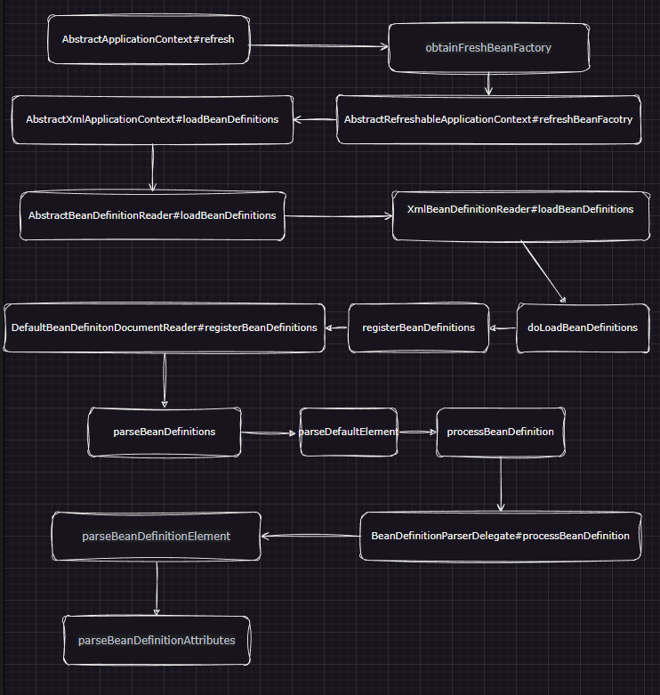
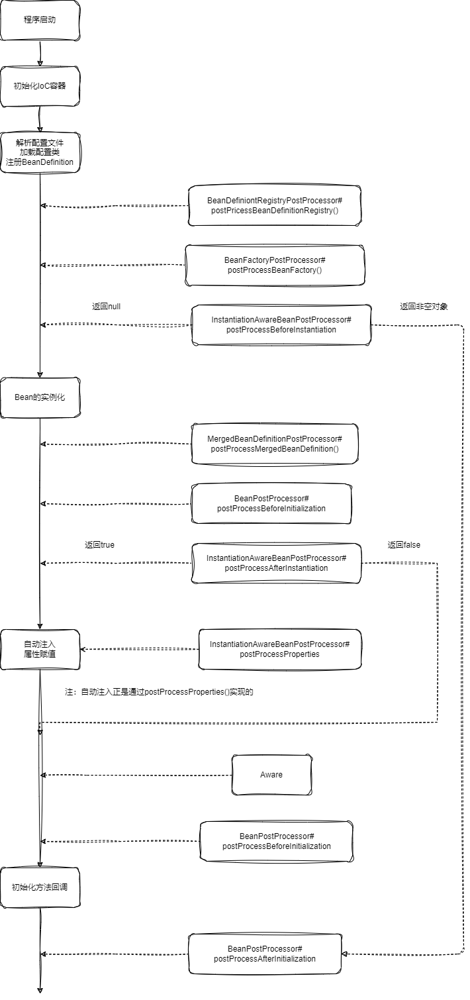

# IoC进阶二

[TOC]

## Bean完整的生命周期 概述

- BeanDefinition
  - `BeanDefinition` 的解析
  - `BeanDefinition` 的注册
- Bean 实例
  - 实例化
  - 属性赋值 + 依赖注入
  - 初始化流程
  - 启动与停止
  - 销毁
  
  

~~~java
public void refresh() throws BeansException, IllegalStateException {
    synchronized (this.startupShutdownMonitor) {
        // 1. 初始化前的预处理
        prepareRefresh();

        // 2. 获取BeanFactory，加载所有bean的定义信息（未实例化）
        ConfigurableListableBeanFactory beanFactory = obtainFreshBeanFactory();

        // 3. BeanFactory的预处理配置
        prepareBeanFactory(beanFactory);

        try {
            // 4. 准备BeanFactor
            postProcessBeanFactory(beanFactory);

            // 5. 执行BeanFactory创建后的后置处理器
            invokeBeanFactoryPostProcessors(beanFactory);

            // 6. 注册Bean的后置处理器
            registerBeanPostProcessors(beanFactory);

            // 7. 初始化MessageSource
            initMessageSource();

            // 8. 初始化事件派发器
            initApplicationEventMulticaster();

            // 9. 子类的多态onRefresh
            onRefresh();

            // 10. 注册监听器
            registerListeners();
          
            //到此为止，BeanFactory已创建完成

            // 11. 初始化所有剩下的单例Bean
            finishBeanFactoryInitialization(beanFactory);

            // 12. 完成容器的创建工作
            finishRefresh();
        } 

        finally {
            // 13. 清除缓存
            resetCommonCaches();
        }
    }
}
~~~

## BeanDefiniton阶段

`BeanDefinition`来源：

- 声明式

  - `@Configuration + @Bean`
  - `@Component + @ComponentScan`
  - `@Import`

- 配置式

  - `<Bean>`标签

- 编程式

  - 手动构造 `BeanDefinition`

    ~~~java
    AnnotationConfigApplicationContext ctx = new AnnotationConfigApplicationContext();
    
    BeanDefinition personDefinition = BeanDefinitionBuilder
        .rootBeanDefinition(Person.class)
        .addPropertyValue("name", "zhangsan")
        .getBeanDefinition();
    
    ctx.registerBeanDefinition("person", personDefinition);
    ctx.refresh();
    ~~~

  -  `BeanDefinitionRegistryPostProcessor` 注入

  - `ImportBeanDefinitionRegistrar`

这一阶段主要发生了以下几件事情：

- 加载配置文件、配置类
- 解析配置文件、配置类并封装为 `BeanDefinition`
- 编程式注入额外的 `BeanDefinition`
- `BeanDefinition` 的后置处理

1. **加载 xml 配置文件** 在基于 xml 配置文件的 `ApplicationContext` 中 `refresh` 方法的 **`BeanFactory` 初始化阶段**，此时 `BeanFactory` 刚刚构建完成，它会借助 `XmlBeanDefinitionReader` 来加载 xml 配置文件，并使用 `DefaultBeanDefinitionDocumentReader` 解析 xml 配置文件，将 `<bean>` 标签内容转换为 `BeanDefinition` 。
2. **解析注解配置类** 发生在 `ApplicationContext` 中 `refresh` 方法的 `BeanDefinitionRegistryPostProcessor` 执行阶段，该阶段首先会执行 `ConfigurationClassPostProcessor` 的 `postProcessBeanDefinitionRegistry` 方法。`ConfigurationClassPostProcessor` 中会找出所有的配置类，排序后依次解析，并借助 `ClassPathBeanDefinitionScanner` 实现包扫描的 `BeanDefinition` 封装，借助 `ConfigurationClassBeanDefinitionReader` 实现 `@Bean` 注解方法的 `BeanDefinition` 解析和封装。
3. **编程式构造 `BeanDefinition`** 也是发生在 `ApplicationContext` 中 `refresh` 方法的 `BeanDefinitionRegistryPostProcessor` 执行阶段，由于 `BeanDefinitionRegistryPostProcessor` 中包含 `ConfigurationClassPostProcessor` ，而 `ConfigurationClassPostProcessor` 会执行 `ImportBeanDefinitionRegistrar` 的逻辑，从而达到编程式构造 `BeanDefinition` 并注入到 `BeanDefinitionRegistry` 的目的。

### 加载xml配置文件

首先要保存配置文件的路径

~~~java
ClassPathXmlApplicationContext ctx = new ClassPathXmlApplicationContext();
ctx.setConfigLocation("lifecycle/bean-source.xml");
~~~

~~~java
public void setConfigLocation(String location) {
    this.setConfigLocations(StringUtils.tokenizeToStringArray(location, ",; \t\n"));
}

public void setConfigLocations(@Nullable String... locations) {
    if (locations != null) {
        Assert.noNullElements(locations, "Config locations must not be null");
        this.configLocations = new String[locations.length];
        for(int i = 0; i < locations.length; ++i) {
            this.configLocations[i] = this.resolvePath(locations[i]).trim();
        }
    } else {
        this.configLocations = null;
    }

}
~~~

然后当执行 `ApplicationContext`的`AbstractApplicationContext#refresh` 方法后，会开始刷新（初始化）IOC 容器，此时会加载配置文件并解析。

~~~java
public void refresh() throws BeansException, IllegalStateException {
    // ...
    // 2. 初始化BeanFactory
    ConfigurableListableBeanFactory beanFactory = obtainFreshBeanFactory();
    // ...
}
~~~

调用图总览：

- refreshBeanFactory

  ~~~java
  protected final void refreshBeanFactory() throws BeansException {
      // 存在BeanFactory则先销毁
      if (hasBeanFactory()) {
          destroyBeans();
          closeBeanFactory();
      }
      
      try {
          // 创建BeanFactory
          DefaultListableBeanFactory beanFactory = createBeanFactory();
          beanFactory.setSerializationId(getId());
          customizeBeanFactory(beanFactory);
          // 【*】加载配置文件
          loadBeanDefinitions(beanFactory);
          this.beanFactory = beanFactory;
      } 
  }
  ~~~

- `AbstractXmlApplicationContext#loadBeanDefinitions`：

  ~~~java
  // AbstractXmlApplicationContext
  protected void loadBeanDefinitions(DefaultListableBeanFactory beanFactory) throws BeansException, IOException {
      // 创建XmlBeanDefinitionReader解析器
      XmlBeanDefinitionReader beanDefinitionReader = new XmlBeanDefinitionReader(beanFactory);
  
      // 配置上下文环境、资源加载器等
      beanDefinitionReader.setEnvironment(this.getEnvironment());
      beanDefinitionReader.setResourceLoader(this);
      beanDefinitionReader.setEntityResolver(new ResourceEntityResolver(this));
      
      initBeanDefinitionReader(beanDefinitionReader);
      // 使用xml解析器 解析xml配置文件
      loadBeanDefinitions(beanDefinitionReader);
  }
  
  protected void loadBeanDefinitions(XmlBeanDefinitionReader reader) throws BeansException, IOException {
  	// ...
      // 【*】加载配置文件资源路径的xml配置文件
      reader.loadBeanDefinitions(configLocations);
  }
  ~~~

- `DefaultBeanDefinitonDocumentReader#doRegisterBeanDefinitions`，会将 xml 配置文件中声明的 profile 取出来，并根据 Environment 中配置好的 profile 决定是否继续解析

- `parseBeanDefinitions`：用于解析`<beans>`中的元素。每次循环出来的 Node 都会尝试着转成 `Element` 去解析，而解析的动作主要是 `parseDefaultElement` 

- `parseDefaultElement`：会解析 `<import>` 标签、`<alias>` 标签、`<bean>` 标签，以及递归解析嵌套的 `<beans>` 标签！

- `processBeanDefinition`：解析xml元素为`BeanDefinition`，并将`BeanDefinition`封装`BeanDefinitionHolder` ，并将其注册到`BeanDefinitionRegistry`。`BeanDefinitionHolder`包含了重要信息：**bean 的名称**。而在BeanDefinition中没有Bean的名称

  ~~~java
  public class BeanDefinitionHolder implements BeanMetadataElement {
  
  	private final BeanDefinition beanDefinition;
  
  	private final String beanName;
  
  	@Nullable
  	private final String[] aliases;
  }
  ~~~

- `parseBeanDefinitionElement`：检查name、alisa是否有重复，以及生成默认的name。返回新构造的`BeanDefinition`

- ` parseBeanDefinitionAttributes`：解析Bean的其他属性

### 加载注解配置类

~~~java
public void refresh() throws BeansException, IllegalStateException {
    synchronized (this.startupShutdownMonitor) {
        // ......
        try {
            postProcessBeanFactory(beanFactory);
            // 5. 执行BeanFactoryPostProcessor
            invokeBeanFactoryPostProcessors(beanFactory);
            registerBeanPostProcessors(beanFactory);
            // ......
        }
        // catch finally .....
    }
}

protected void invokeBeanFactoryPostProcessors(ConfigurableListableBeanFactory beanFactory) {
    // 交给代理执行
    PostProcessorRegistrationDelegate.invokeBeanFactoryPostProcessors(beanFactory, getBeanFactoryPostProcessors());

    // 下面是支持AOP的部分（暂时不读）
}
~~~

~~~java
//PostProcessorRegistrationDelegate
public static void invokeBeanFactoryPostProcessors(ConfigurableListableBeanFactory beanFactory, List<BeanFactoryPostProcessor> beanFactoryPostProcessors) {
    // 略
}
~~~

用简单的语言概括，这个方法的执行机制如下：

1. 执行 `BeanDefinitionRegistryPostProcessor` 的 `postProcessBeanDefinitionRegistry` 方法

   1. 执行实现了 `PriorityOrdered` 接口的 `BeanDefinitionRegistryPostProcessor`
   2. 执行实现了 `Ordered` 接口的 `BeanDefinitionRegistryPostProcessor`
   3. 执行普通的 `BeanDefinitionRegistryPostProcessor`

2. 执行 `BeanDefinitionRegistryPostProcessor` 的 `postProcessBeanFactory` 方法（注意，`BeanDefinitionRegistryPostProcessor`实际上继承了`BeanFactoryPostProcessor`，所以它也有`postProcessBeanFactory()`方法）

   1.  同上

3. 执行`BeanFactoryPostProcessor` 的 `postProcessBeanFactory` 方法

   1. 同上

   

其中，会先最先执行由Spring提前注册好的`ConfigurationClassPostProcessor`的`postProcessBeanDefinitionRegistry`方法。负责处理带有`@Configuration`，`@Component`，`@ComponentScan`，`@Import`，`@ImportResource`等注解的类。

~~~java
public class ConfigurationClassPostProcessor implements BeanDefinitionRegistryPostProcessor, PriorityOrdered, ResourceLoaderAware, ApplicationStartupAware, BeanClassLoaderAware, EnvironmentAware {
    
    public void postProcessBeanDefinitionRegistry(BeanDefinitionRegistry registry) {
        //...
        // 【解析配置类】
    	processConfigBeanDefinitions(registry);
    }
}
~~~

~~~java
// ConfigurationClassPostProcessor
public void processConfigBeanDefinitions(BeanDefinitionRegistry registry) {
    List<BeanDefinitionHolder> configCandidates = new ArrayList<>();
    String[] candidateNames = registry.getBeanDefinitionNames();
    // 从beanFactory中已经有的bean的定义中，寻找有Configuration注解的配置类。
    for (String beanName : candidateNames) {
        BeanDefinition beanDef = registry.getBeanDefinition(beanName);
        if (ConfigurationClassUtils.isFullConfigurationClass(beanDef) ||
                ConfigurationClassUtils.isLiteConfigurationClass(beanDef)) {
            
        } else if (ConfigurationClassUtils.checkConfigurationClassCandidate(beanDef, this.metadataReaderFactory)) {
            configCandidates.add(new BeanDefinitionHolder(beanDef, beanName));
        }
    }
    
	// ...
    // 配置类排序
    configCandidates.sort((bd1, bd2) -> {
        int i1 = ConfigurationClassUtils.getOrder(bd1.getBeanDefinition());
        int i2 = ConfigurationClassUtils.getOrder(bd2.getBeanDefinition());
        return Integer.compare(i1, i2);
    });

    // 构造默认的BeanNameGenerator bean的名称生成器
    // ...

    if (this.environment == null) {
        this.environment = new StandardEnvironment();
    }

    // 真正解析配置类的组件：ConfigurationClassParser
    ConfigurationClassParser parser = new ConfigurationClassParser(...);

    // 这里设置两个集合是处理每一轮新增的配置类
    Set<BeanDefinitionHolder> candidates = new LinkedHashSet<>(configCandidates);
    Set<ConfigurationClass> alreadyParsed = new HashSet<>(configCandidates.size());
    do {
        // 【解析配置类】
        parser.parse(candidates);
        parser.validate();

        Set<ConfigurationClass> configClasses = new LinkedHashSet<>(parser.getConfigurationClasses());
        configClasses.removeAll(alreadyParsed);

        if (this.reader == null) {
            this.reader = new ConfigurationClassBeanDefinitionReader(...);
        }
        
        // 【加载配置类的内容】
        this.reader.loadBeanDefinitions(configClasses);
        alreadyParsed.addAll(configClasses);
        // ...
        // 如果没有新增的配置类，那么就退出循环
    } while (!candidates.isEmpty());
    // ...
}
~~~

- parse方法解析`@Configuration`配置类

  

  `doProcessConfigurationClass`的任务——解析配置类

  - 处理@Component注解。调用`processMemberClasses`，获取配置类中的所有内部类，循环解析内部类，如果内部类也是配置类，则`candidates.add(memberClass)`，即在下一轮开始解析。

  - 处理 `@PropertySource` 注解

  - 处理`@ComponentScan`注解，委托 `ComponentScanAnnotationParser` 来处理包扫描的工作

    - 构造 `ClassPathBeanDefinitionScanner` ，并封装 `@ComponentScan` 注解中的属性
    - 整理要进行包扫描的 `basePackages` ，以及 include 和 exclude 的过滤器
    - 执行包扫描的动作`doScan()`，只要扫描到了符合的类（默认被 `@Component` 注解标注的类），就会包装为 `BeanDefinition`

  - 处理`@Import`注解。它分别对 `ImportSelector` 、`ImportBeanDefinitionRegistrar` 、普通类 / 配置类都做了处理，并递归解析其中存在的配置类。如果循环@Import导入，直接报错

  - 处理`@ImportResource`注解，先预处理，在loadBeanDefinitions()方法中真正去处理

  - 处理`@Bean`注解：会获取Bean Class中所有带有@Bean注解的Method，调用`ConfigurationClass#addBeanMethod(BeanMethod method)`保存到成员变量`ConfigurationClass#beanMethods`集合中(`Set<BeanMethod> beanMethods = new LinkedHashSet<>()`)。回来对这个Bean方法做字节码增强，而不是现在封装为`BeanDefinition`

    当使用Java中的反射API（例如`Class.getDeclaredMethods()`或者`Class.getMethods()`等方法）获取一个类的方法列表时，JVM并不保证每次返回的方法列表的顺序是一样的。为此， Spring使用 ASM 读取字节码，保证加载配置类中 `@Bean` 方法的顺序与源文件从上到下的顺序是一致的。

  - 处理父接口，并且遍历所有标注了 `@Bean` 的方法

  - 处理父类。最后会判断configClass是否有父类，如果有，会将父类class封装成SourceClass返回，`processConfigurationClass()`中判断`doProcessConfigurationClass()`方法的返回值不为空，则会继续解析父类，父类中的@Bean方法同样被保存在configClass#beanMethods集合中。

- 接下来，通过`loadBeanDefinitions()`

  ~~~java
  public void loadBeanDefinitions(Set<ConfigurationClass> configurationModel) {
      TrackedConditionEvaluator trackedConditionEvaluator = new TrackedConditionEvaluator();
      for (ConfigurationClass configClass : configurationModel) {
          loadBeanDefinitionsForConfigurationClass(configClass, trackedConditionEvaluator);
      }
  }
  
  private void loadBeanDefinitionsForConfigurationClass(
      ConfigurationClass configClass, 
      TrackedConditionEvaluator trackedConditionEvaluator) {
      
      // 与条件装配有关
      if (trackedConditionEvaluator.shouldSkip(configClass)) {
          
      }
  
      // 如果当前配置类是被@Import的，要把自己注册进BeanFactory
      if (configClass.isImported()) {
          registerBeanDefinitionForImportedConfigurationClass(configClass);
      }
      
      // 注册@Bean注解方法
      for (BeanMethod beanMethod : configClass.getBeanMethods()) {
          loadBeanDefinitionsForBeanMethod(beanMethod);
      }
  
      // 注册来自xml配置文件的bean
      loadBeanDefinitionsFromImportedResources(configClass.getImportedResources());
      
      // 注册来自ImportBeanDefinitionRegistrar的bean
      loadBeanDefinitionsFromRegistrars(configClass.getImportBeanDefinitionRegistrars());
  }
  ~~~

  - `registerBeanDefinitionForImportedConfigurationClass`，简单的`BeanDefinition` 的注册
  - `loadBeanDefinitionsForBeanMethod`，检查 → 构造 `BeanDefinition` → 封装信息 → 注册进 `BeanDefinitionRegistry`。它会给 `BeanDefinition` 封装两个属性：`setBeanClassName` / `setFactoryBeanName` 、`setUniqueFactoryMethodName` ，它们俩分别指定了当前 `@Bean` 方法所在的配置类，以及方法名。这是因为@Component以及XML生成的Bean，它们都指定了 bean 的全限定名、属性注入等。而通过`@Bean` 方法生成的，属于编程式创建，无法使用（也不适合用）反射创建 bean 对象，所以为了在后面能正常创建出 bean 对象，此处就需要记录该 bean 的定义源（包含注解配置类和方法名），以保证在创建 bean 对象时，能够使用反射调用该注解配置类的方法，生成 bean 对象并返回。
  - `loadBeanDefinitionsFromImportedResources`
  - `loadBeanDefinitionsFromRegistrars`

## 实例化

~~~java
public void refresh() throws BeansException, IllegalStateException {
    // ...
    registerBeanPostProcessors(beanFactory);
    // ...
    this.finishBeanFactoryInitialization(beanFactory);
}
~~~

- `registerBeanPostProcessors`：注册`BeanPostProcessor`后置处理器
- `finishBeanFactoryInitialization`：实例化Bean对象

### RegisterBeanPostProcessors

~~~java
//AbstractApplicationContext
public void refresh() throws BeansException, IllegalStateException {
    // ...
    registerBeanPostProcessors(beanFactory);
    // ...
}

// AbstractApplicationContext
protected void registerBeanPostProcessors(ConfigurableListableBeanFactory beanFactory) {
    PostProcessorRegistrationDelegate.registerBeanPostProcessors(beanFactory, this);
}

// PostProcessorRegistrationDelegate
public static void registerBeanPostProcessors(
    ConfigurableListableBeanFactory beanFactory, 
    AbstractApplicationContext applicationContext) {
    
}
~~~

`PostProcessorRegistrationDelegate#registerBeanPostProcessors`主要完成以下几件事：

1. 会先注册一个`BeanPostProcessorChecker`
2. 根据排序规则，给所有的后置处理器分类
   1. 首先，注册所有实现了`PriorityOrdered`接口的后置处理器
   2. 其次，注册所有实现了`Ordered`接口的后置处理器
   3. 最后，注册所有普通的后置处理器
3. 所有`MergedBeanDefinitionPostProcessor`又被注册了一次，这是为了将`MergedBeanDefinitionPostProcessor`放在整个后置处理器列表的最后（重复的被删除）。
4. 最后又注册了一个`ApplicationListenerDetector`

`BeanPostProcessorChecker`是一个 `BeanPostProcessor` ，当在 `BeanPostProcessor` 实例化期间创建 Bean 时，它会记录一条信息。

~~~java
// PostProcessorRegistrationDelegate#registerBeanPostProcessors
public static void registerBeanPostProcessors(ConfigurableListableBeanFactory beanFactory, AbstractApplicationContext applicationContext) {
    
    int beanProcessorTargetCount = beanFactory.getBeanPostProcessorCount() + 1 + postProcessorNames.length;
    
	beanFactory.addBeanPostProcessor(new BeanPostProcessorChecker(beanFactory, beanProcessorTargetCount));
    // ...
}
~~~

~~~java
// BeanPostProcessorChecker
public Object postProcessAfterInitialization(Object bean, String beanName) {
    // 此处判断是否有普通bean被提前创建
    // isInfrastructureBean，这个方法主要检查当前处理的bean是否是一个Spring自身创建的bean，而不是程序员所创建的bean(通过@Component,@Configuration等注解或者XML配置等)。
    if (!(bean instanceof BeanPostProcessor) 
        && !isInfrastructureBean(beanName) 
        && this.beanFactory.getBeanPostProcessorCount() < this.beanPostProcessorTargetCount) {
        if (logger.isInfoEnabled()) {
            // ...
        }
    }
    return bean;
}
~~~

### finishBeanFactoryInitialization

我们再来看`refresh()`中的`finishBeanFactoryInitialization()`，它用来**初始化非延迟加载的单例对象**

~~~java
// AbstractApplicationContext
protected void finishBeanFactoryInitialization(ConfigurableListableBeanFactory beanFactory) {
    // ...
    beanFactory.preInstantiateSingletons();
}
~~~

~~~java
// 它是ConfigurableListableBeanFactory的抽象方法，DefaultListableBeanFactory实现了该方法。
public void preInstantiateSingletons() throws BeansException {
    List<String> beanNames = new ArrayList<>(this.beanDefinitionNames);
    // 此处循环初始化剩余的非延迟加载的单实例bean
    for (String beanName : beanNames) {
        // 先合并BeanDefinition
        RootBeanDefinition bd = getMergedLocalBeanDefinition(beanName);
        // 不是抽象的、不是延迟加载的单实例bean要初始化
        if (...) {
            if (isFactoryBean(beanName)) {
                // 可以发现FactoryBean的名字都是有一个前缀的
                Object bean = getBean(FACTORY_BEAN_PREFIX + beanName);
                // ...
            } else {
                // 普通的初始化，就是getBean方法
                getBean(beanName);
            }
        }
    }
    // 初始化的最后阶段 ......
}
~~~

~~~java
// AbstractBeanFactory
// getBean获取Bean，如果没有则创建Bean（单例 or 原型）
// 从getBean开始，无论是原型还是单例，都要开始经过完整的生命周期了
@Override
public Object getBean(String name) throws BeansException {
    return doGetBean(name, null, null, false);
}

protected <T> T doGetBean(String name, @Nullable Class<T> requiredType, @Nullable Object[] args, boolean typeCheckOnly)
        throws BeansException {
    // 处理bean的alias
    String beanName = transformedBeanName(name);
    Object bean;

    // 单例Bean之前已经创建过了，实现单例的语义
    Object sharedInstance = getSingleton(beanName);
    if (sharedInstance != null && args == null) {
        // logger ......
        bean = getObjectForBeanInstance(sharedInstance, name, beanName, null);
    } else {
        // 创建单例Bean以及原型Bean
        // 如果原型bean之间互相依赖，则一定会引发无限循环，此处会抛出循环依赖的异常
        if (isPrototypeCurrentlyInCreation(beanName)) {
            throw new BeanCurrentlyInCreationException(beanName);
        }

        // 如果本地不存在当前bean的定义信息，则尝试让父容器实例化bean
        BeanFactory parentBeanFactory = getParentBeanFactory();
        if (parentBeanFactory != null && !containsBeanDefinition(beanName)) {
            // ...
        }

        // 标记当前bean已经开始被创建了
        if (!typeCheckOnly) {
            markBeanAsCreated(beanName);
        }

        try {
            // 此处会合并BeanDefinition，并检查是否为抽象类(abstract则会抛出无法实例化的异常)
            RootBeanDefinition mbd = getMergedLocalBeanDefinition(beanName);
            checkMergedBeanDefinition(mbd, beanName, args);

            //...

            // Create bean instance.
            // 单实例bean的初始化，间接调用createBean
            if (mbd.isSingleton()) {
                sharedInstance = getSingleton(beanName, () -> {
                    try {
                        return createBean(beanName, mbd, args);
                    } // catch ......
                });
                bean = getObjectForBeanInstance(sharedInstance, name, beanName, mbd);
            }
            
            
            // 原型bean的初始化，直接调用createBean（finishBeanFactoryInitialization方法不会执行到这一步，其他方法可能会执行这一步）
            else if (mbd.isPrototype()) {
                // It's a prototype -> create a new instance.
                Object prototypeInstance = null;
                try {
                    beforePrototypeCreation(beanName);
                    prototypeInstance = createBean(beanName, mbd, args);
                }
                finally {
                    afterPrototypeCreation(beanName);
                }
                bean = getObjectForBeanInstance(prototypeInstance, name, beanName, mbd);
            }
            // 处理自定义的scope ......
        }
        // catch ......
    }

    // 类型强转前的检查 ......
    return (T) bean;
}
~~~

~~~java
// AbstractBeanFactory
public Object getSingleton(String beanName, ObjectFactory<?> singletonFactory) {
    Assert.notNull(beanName, "Bean name must not be null");
    synchronized (this.singletonObjects) {
        // 加锁后再查一次单实例bean的缓存
        Object singletonObject = this.singletonObjects.get(beanName);
        if (singletonObject == null) {
            if (this.singletonsCurrentlyInDestruction) {
                // throw ex ......
            }
            // ......
            try {
                // 如果单实例bean的缓存中真的没有，那就创建对象，singletonFactory是一个回调函数。内部会调用createBean
                singletonObject = singletonFactory.getObject();
                newSingleton = true;
            } // catch finally ......
            
            // 新创建的单实例bean要存入单实例bean的缓存中
            if (newSingleton) {
                addSingleton(beanName, singletonObject);
            }
        }
        return singletonObject;
    }
}
~~~

~~~java
// AbstractBeanFactory中createBean是一个抽象方法
// AbstractAutowireCapableBeanFactory#createBean

// 该方法中会先执行所有 `InstantiationAwareBeanPostProcessor` 的 `postProcessBeforeInstantiation` 方法尝试创建 bean 实例
// 尝试失败就会调用`doCreateBean` 方法创建 bean 实例
protected Object createBean(String beanName, RootBeanDefinition mbd, @Nullable Object[] args) throws BeanCreationException {
    //...

    try {
        // 【后置处理器InstantiationAwareBeanPostProcessor拦截创建bean】
        // 执行依次每一个InstantiationAwareBeanPostProcessor的postProcessBeforeInstantiation，直到有一个返回非空对象。此时会同时执行所有BeanPostProcessor的postProcessAfterInitialization()`。然后对象就创建完成了，并不会执行自动注入、初始化方法回调、Aware等等
        Object bean = resolveBeforeInstantiation(beanName, mbdToUse);
        if (bean != null) {
            return bean;
        }
    } 

    try {
        // 【真正的创建bean】
        Object beanInstance = doCreateBean(beanName, mbdToUse, args);
        //  .....
        return beanInstance;
    } 
}
// 

protected Object doCreateBean(String beanName, RootBeanDefinition mbd, @Nullable Object[] args)
        throws BeanCreationException {
    // ...
    // 处理FactoryBean的小细节问题
    if (mbd.isSingleton()) {
        // 如果提前调用了 getTypeForFactoryBean 确认 FactoryBean 中生成的 bean 的类型，则它会把这个 FactoryBean 本身先存在一个 factoryBeanInstanceCache 中（注意此时的 FactoryBean 只会利用 getObjectType 方法，不会调用 getObject 创建 bean ）；等后续真的需要由 FactoryBean 生成 bean 的时候，它会直接从 factoryBeanInstanceCache 中取出刚才已经实例化的 FactoryBean ，继续执行 bean 的初始化动作（属性赋值、依赖注入等）。
        instanceWrapper = this.factoryBeanInstanceCache.remove(beanName);
    }
    
    if (instanceWrapper == null) {
        // 【真正的bean对象创建】
        instanceWrapper = createBeanInstance(beanName, mbd, args);
    }

    // ...
}

protected BeanWrapper createBeanInstance(String beanName, RootBeanDefinition mbd, @Nullable Object[] args) {
    // 解析出bean的类型
    Class<?> beanClass = resolveBeanClass(mbd, beanName);

    // bean无法被访问，则抛出异常
    if (...) {
        // ...
    }
    
    // 如果在 BeanDefinition 中指定了工厂类型的创建逻辑，则直接走工厂创建
    Supplier<?> instanceSupplier = mbd.getInstanceSupplier();
    if (instanceSupplier != null) {
        return obtainFromSupplier(instanceSupplier, beanName);
    }

    // 【工厂方法创建】
    if (mbd.getFactoryMethodName() != null) {
        return instantiateUsingFactoryMethod(beanName, mbd, args);
    }
    
    //...
    
    // Candidate constructors for autowiring?
    // 当满足任一条件，就会执行基于构造器的实例化
    // 1. 通过SmartInstantiationAwareBeanPostProcessor找到了构造器
    // 2. 配置了注入方式是AUTOWIRE_CONSTRUCTOR
    // 3. 定义bean的时候指定了constructor-arg
    // 4. 构造bean时传入了args参数
    Constructor<?>[] ctors = determineConstructorsFromBeanPostProcessors(beanClass, beanName);
    if (ctors != null 
        || mbd.getResolvedAutowireMode() == AUTOWIRE_CONSTRUCTOR 
        || mbd.hasConstructorArgumentValues() 
        || !ObjectUtils.isEmpty(args)) {
        return autowireConstructor(beanName, mbd, ctors, args);
    }

    // Preferred constructors for default construction?
    ctors = mbd.getPreferredConstructors();
    if (ctors != null) {
        return autowireConstructor(beanName, mbd, ctors, null);
    }

    // No special handling: simply use no-arg constructor.
    return instantiateBean(beanName, mbd);
}
~~~

## 初始化

### doCreateBean

`AbstractAutowireCapableBeanFactory#doCreateBean`的逻辑：

1. 首先就是创建Bean（前面介绍过）

2. 然后它回调所有的`MergedBeanDefinitionPostProcessor#postProcessMergedBeanDefinition`。

   `MergeDefinitionPostProcessor`接口的实现类有下：

   - `InitDestroyAnnotationBeanPostProcessor`收集了收集标注了 `@PostConstruct` 和 `@PreDestroy` 注解的后置处理器。
   - `CommonAnnotationBeanPostProcessor`在`InitDestroyAnnotationBeanPostProcessor`的基础上， 收集了`@WebServiceRef` 、`@EJB` 、`@Resource` 注解
   - `AutowiredAnnotationBeanPostProcessor`收集`@Autowired` 、`@Value` 、`@Inject`注解。留着之后注入时使用。

3. 早期bean对象引用的获取与缓存，为了解决 bean 之间的循环依赖问题

   ~~~java
   // `mbd.isSingleton()`判断该Bean是不是单例的，循环依赖主要问题出现在单例Bean的创建上，因为对于原型Bean，每次获取都会新建一个，因此不存在循环依赖的问题。
   boolean earlySingletonExposure = (mbd.isSingleton()
   	&& this.allowCircularReferences 
   	&& isSingletonCurrentlyInCreation(beanName));
   
   if (earlySingletonExposure) {
       // 处理循环依赖的问题
       addSingletonFactory(beanName, 
                           () -> getEarlyBeanReference(beanName, mbd, bean));
   }
   ~~~

4. 回调`InstantiationAwareBeanPostProcessor`的`postProcessAfterInstantiation`方法，当 `postProcessAfterInstantiation` 返回 false 时，会直接 return 出去，不再执行下面的属性赋值 + 组件依赖注入的逻辑！

5. 属性赋值和依赖注入：在`doCreateBean()`中，调用`populateBean()`来处理属性赋值和依赖注入

   1. ~~~java
      protected void populateBean(String beanName, RootBeanDefinition mbd, @Nullable BeanWrapper bw) {
          // ...
          if (!mbd.isSynthetic() && hasInstantiationAwareBeanPostProcessors()) {
              for (BeanPostProcessor bp : getBeanPostProcessors()) {
                  if (bp instanceof InstantiationAwareBeanPostProcessor) {
                      InstantiationAwareBeanPostProcessor ibp = (InstantiationAwareBeanPostProcessor) bp;
                      if (!ibp.postProcessAfterInstantiation(bw.getWrappedInstance(), beanName)) {
                          // 当 postProcessAfterInstantiation 返回 false 时，会直接 return 出去，不再执行下面的属性赋值 + 组件依赖注入的逻辑！
                          return;
                      }
      
                  }
              }
          }
          PropertyValues pvs = (mbd.hasPropertyValues() ? mbd.getPropertyValues() : null);
      
          // 解析出当前bean支持的自动注入模式
          int resolvedAutowireMode = mbd.getResolvedAutowireMode();
          if (resolvedAutowireMode == AUTOWIRE_BY_NAME || resolvedAutowireMode == AUTOWIRE_BY_TYPE) {
              MutablePropertyValues newPvs = new MutablePropertyValues(pvs);
              // Add property values based on autowire by name if applicable.
              if (resolvedAutowireMode == AUTOWIRE_BY_NAME) {
                  autowireByName(beanName, mbd, bw, newPvs);
              }
              // Add property values based on autowire by type if applicable.
              if (resolvedAutowireMode == AUTOWIRE_BY_TYPE) {
                  autowireByType(beanName, mbd, bw, newPvs);
              }
              pvs = newPvs;
          }
          
          //...
      }
      
      protected void autowireByName(
              String beanName, AbstractBeanDefinition mbd, BeanWrapper bw, MutablePropertyValues pvs) {
          String[] propertyNames = unsatisfiedNonSimpleProperties(mbd, bw);
          for (String propertyName : propertyNames) {
              // 存在bean，就获取出来，添加依赖关系
              if (containsBean(propertyName)) {
                  Object bean = getBean(propertyName);
                  // 覆写之前的旧值
                  pvs.add(propertyName, bean);
                  registerDependentBean(propertyName, beanName);
              }
          }
      }
      ~~~

   2. ~~~java
      //populateBean
      if (hasInstAwareBpps) {
          if (pvs == null) {
              pvs = mbd.getPropertyValues();
          }
          for (BeanPostProcessor bp : getBeanPostProcessors()) {
              if (bp instanceof InstantiationAwareBeanPostProcessor) {
                  InstantiationAwareBeanPostProcessor ibp = (InstantiationAwareBeanPostProcessor) bp;
                  // 【核心】回调postProcessProperties
                  PropertyValues pvsToUse = ibp.postProcessProperties(pvs, bw.getWrappedInstance(), beanName);
                  // ...
                  pvs = pvsToUse;
              }
          }
      }
      ~~~

      `InstantiationAwareBeanPostProcessor`的`postProcessProperties`方法，它接收`PropertyValues`同时也返回`PropertyValues`

      注意`AutowiredAnnotationBeanPostProcessor`不仅实现了`MergeDefinitionPostProcessor`接口，而且也实现了`SmartInstantiationAwareBeanPostProcessor`接口。`SmartInstantiationAwareBeanPostProcessor`是`InstantiationAwareBeanPostProcessor`子接口。

      `AutowiredAnnotationBeanPostProcessor` 的 `postProcessProperties` 方法的实现：

      ~~~java
      // AutowiredAnnotationBeanPostProcessor
      public PropertyValues postProcessProperties(PropertyValues pvs, Object bean, String beanName) {
          InjectionMetadata metadata = findAutowiringMetadata(beanName, bean.getClass(), pvs);
          try {
              metadata.inject(bean, beanName, pvs);
          } // catch ......
          return pvs;
      }
      ~~~

      注入逻辑为

      ~~~java
      // InjectionMetadata
      public void inject(Object target, @Nullable String beanName, @Nullable PropertyValues pvs) throws Throwable {
          Collection<InjectedElement> checkedElements = this.checkedElements;
          // 之前收集的注入的信息
          Collection<InjectedElement> elementsToIterate = (checkedElements != null ? checkedElements : this.injectedElements);
          if (!elementsToIterate.isEmpty()) {
              // 迭代，依次注入
              for (InjectedElement element : elementsToIterate) {
                  // logger ......
                  element.inject(target, beanName, pvs);
              }
          }
      }
      // InjectedElement
      protected void inject(Object target, @Nullable String requestingBeanName, @Nullable PropertyValues pvs)
              throws Throwable {
          if (this.isField) {
              // 反射注入字段
              Field field = (Field) this.member;
              ReflectionUtils.makeAccessible(field);
              field.set(target, getResourceToInject(target, requestingBeanName));
          } else {
              if (checkPropertySkipping(pvs)) {
                  return;
              }
              try {
                  // 反射调用setter方法
                  Method method = (Method) this.member;
                  ReflectionUtils.makeAccessible(method);
                  method.invoke(
                      target, 
                      getResourceToInject(target, requestingBeanName));
              } // catch ......
          }
      }
      ~~~

   3. 属性赋值（@value注解，以及`<property>`标签）

      ~~~java
      // populateBean
      if (pvs != null) {
          applyPropertyValues(beanName, mbd, bw, pvs);
      }
      ~~~

6. 执行`initializaBean`

   ~~~java
   protected Object initializeBean(String beanName, Object bean, @Nullable RootBeanDefinition mbd) {
       if (System.getSecurityManager() != null) {
           // ......
       } else {
           // 1.4.1 执行Aware回调
           invokeAwareMethods(beanName, bean);
       }
   
       Object wrappedBean = bean;
       // 1.4.2 执行BeanPostProcessor的前置回调
       if (mbd == null || !mbd.isSynthetic()) {
           // 如果BeanPostProcessor返回 null ，则不再执行后面剩余的 BeanPostProcessor ，直接返回上一个 BeanPostProcessor 处理的 bean 对象。由此我们可以在此处针对自己项目中某些特定的 bean 搞一些特殊的拦截的处理。
           // 这里有一个InitDestroyAnnotationBeanPostProcessor，它处理@PostConstruct 标注的方法
           wrappedBean = applyBeanPostProcessorsBeforeInitialization(wrappedBean, beanName);
       }
   
       try {
           // 1.4.3 执行生命周期回调
           // 回调InitializingBean的afterPropertiesSet方法
           // 回调init-method方法（同样是反射调用）
           invokeInitMethods(beanName, wrappedBean, mbd);
       } //...
   
       // 1.4.4 执行BeanPostProcessor的后置回调
       if (mbd == null || !mbd.isSynthetic()) {
           // 涉及到 AOP 创建代理对象的核心实现
           wrappedBean = applyBeanPostProcessorsAfterInitialization(wrappedBean, beanName);
       }
   
       return wrappedBean;
   }
   
   private void invokeAwareMethods(String beanName, Object bean) {
       if (bean instanceof Aware) {
           if (bean instanceof BeanNameAware) {
                // 如果bean实现了BeanNameAware，则强转后调用setBeanName方法注入bean的名称
           }
           if (bean instanceof BeanClassLoaderAware) {
                // 如果bean实现了BeanClassLoaderAware，则强转后调用setBeanClassLoader方法注入当前的ClassLoader
           }
           if (bean instanceof BeanFactoryAware) {
               // 如果bean实现了BeanFactoryAware，则强转后调用setBeanFactory方法注入BeanFactory
           }
       }
   }
   
   ~~~

7. 注册销毁时的回调

   ~~~java
   // doCreateBean
   try {
       // 只能注册单实例 bean
       registerDisposableBeanIfNecessary(beanName, bean, mbd);
   }
   ~~~

   

### Lifecycle的回调

在 `ApplicationContext` 的 `refresh` 方法最后，会执行`finishRefresh` 方法：

~~~java
protected void finishRefresh() {
    // Clear context-level resource caches (such as ASM metadata from scanning).
    clearResourceCaches();

    // Initialize lifecycle processor for this context.
    initLifecycleProcessor();

    // Propagate refresh to lifecycle processor first.
    getLifecycleProcessor().onRefresh();

    // Publish the final event.
    publishEvent(new ContextRefreshedEvent(this));

    // Participate in LiveBeansView MBean, if active.
    LiveBeansView.registerApplicationContext(this);
}
~~~

全部的 bean 初始化结束后，`ApplicationContext` 的 `start` 方法触发时，会触发实现了 `Lifecycle` 接口的 bean 的 `start` 方法。

## 销毁

关闭 `ApplicationContext` 会顺序执行以下几步：

1. 广播容器关闭事件`ContextClosedEvent`

2. 通知所有实现了 `Lifecycle` 的 bean 回调 `close` 方法

3. 销毁所有 bean。由 `BeanFactory` 取出所有单实例 bean ，并逐个销毁。销毁动作会

   1. 先将当前 bean 依赖的所有 bean 都销毁。

   2. 随后回调自定义的 bean 的销毁方法。

   3. 之后如果 bean 中有定义内部 bean 则会一并销毁。这里内部的Bean是指：

      ~~~xml
      <bean id="cat" class="com.linkedbear.spring.lifecycle.e_source.bean.Cat">
          <property name="name" value="mimi"/>
          <property name="master">
              <bean class="com.linkedbear.spring.lifecycle.e_source.bean.Person"/>
          </property>
      </bean>
      ~~~

      这种嵌套 bean ，就会记录在 `DefaultSingletonBeanRegistry` 的 `containedBeanMap` 中

4. 关闭 BeanFactory

5. 标记本身为不可用

注意，程序员要自己管理原型bean的生命周期。Spring框架已经帮我们管理了单例Bean的生命周期。

## 切入点

## 循环依赖

## 容器刷新

## 缓存

## @Bean的实现

