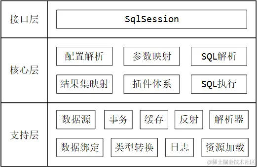
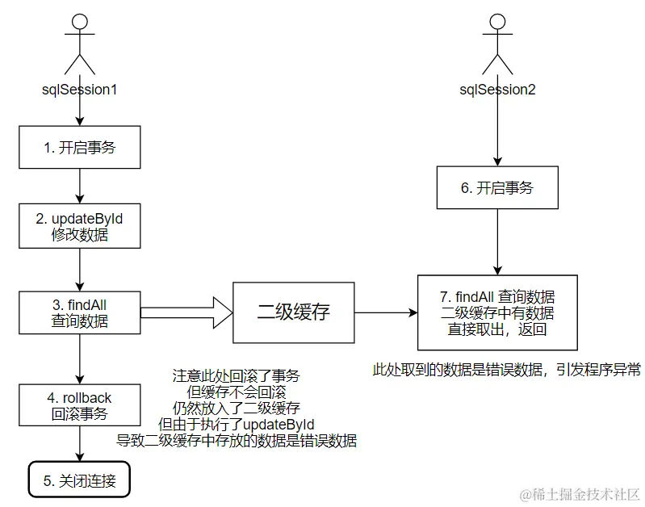

# ORM

[TOC]

在关系数据库中，数据类型是Table，这与面向对象编程语言中的类类型存在天然结构上的差异。因此我们必须在它们两种类型之间做转换，好在**对象关系映射（Object-Relational Mapping，ORM）**框架能够自动帮我们完成这项转换工作。


MyBatis的整体架构如下：




## Mapper

Maven依赖：

~~~xml
<dependency>
    <groupId>org.mybatis</groupId>
    <artifactId>mybatis</artifactId>
    <version>3.5.5</version>
</dependency>
<dependency>
    <groupId>mysql</groupId>
    <artifactId>mysql-connector-java</artifactId>
    <version>5.1.47</version>
</dependency>
~~~

编写 MyBatis 的全局配置文件

~~~xml
<?xml version="1.0" encoding="UTF-8" ?>
<!DOCTYPE configuration
        PUBLIC "-//mybatis.org//DTD Config 3.0//EN"
        "http://mybatis.org/dtd/mybatis-3-config.dtd">
<configuration>
    <settings>
        <setting name="logImpl" value="LOG4J"/>
    </settings>
    <environments default="development">
        <environment id="development">
            <transactionManager type="JDBC"/>
            <!--配置数据源-->
            <dataSource type="POOLED">
                <property name="driver" value="com.mysql.jdbc.Driver"/>
                <property name="url" value="jdbc:mysql://localhost:3306/mybatis?characterEncoding=utf-8"/>
                <property name="username" value="root"/>
                <property name="password" value="123456"/>
            </dataSource>
        </environment>
    </environments>
    <mappers>
        <!--从这里注册Mapper-->
        <mapper resource="mapper/department.xml"/>
    </mappers>
</configuration>
~~~

编写`mapper.xml`

~~~xml
<?xml version="1.0" encoding="UTF-8" ?>
<!DOCTYPE mapper
        PUBLIC "-//mybatis.org//DTD Mapper 3.0//EN"
        "http://mybatis.org/dtd/mybatis-3-mapper.dtd">
<mapper namespace="departmentMapper">
    <select id="findAll" resultType="com.linkedbear.mybatis.entity.Department">
        select * from tbl_department
    </select>
</mapper>
~~~

实体类的创建：

~~~java
public class Department {
    private String id;
    private String name;
    private String tel;
    // getter setter toString equals hashcode
}

~~~

Mapper的使用

- 基于SqlSession

  ~~~java
  InputStream xml = Resources.getResourceAsStream("mybatis-config.xml");
  SqlSessionFactory sqlSessionFactory = new SqlSessionFactoryBuilder().build(xml);
  SqlSession sqlSession = sqlSessionFactory.openSession();
  List<Department> departmentList = sqlSession.selectList("departmentMapper.findAll");
  ~~~

- 基于Dao

  ~~~java
  public interface DepartmentDao {
      List<Department> findAll();
      Department findById(String id);
  }
  
  
  public class DepartmentDaoImpl implements DepartmentDao {
      
      private SqlSessionFactory sqlSessionFactory;
      
      public DepartmentDaoImpl(SqlSessionFactory sqlSessionFactory) {
          this.sqlSessionFactory = sqlSessionFactory;
      }
      
      @Override
      public List<Department> findAll() {
          try (SqlSession sqlSession = sqlSessionFactory.openSession()) {
              return sqlSession.selectList("departmentMapper.findAll");
          }
      }
      
      @Override
      public Department findById(String id) {
          try (SqlSession sqlSession = sqlSessionFactory.openSession()) {
              return sqlSession.selectOne("departmentMapper.findById", id);
          }
      }
  }
  ~~~

  组装：

  ~~~java
   InputStream xml = Resources.getResourceAsStream("mybatis-config.xml");
  SqlSessionFactory sqlSessionFactory = new SqlSessionFactoryBuilder().build(xml);
  
  DepartmentDao departmentDao = new DepartmentDaoImpl(sqlSessionFactory);
  List<Department> departmentList = departmentDao.findAll();
  ~~~

- 基于 Mapper 动态代理

  使用基于 Mapper 动态代理的方式开发，需要满足以下几个规范：

  1. mapper的 namespace属性 与 Mapper 接口的全限定名完全相同
  2. mapper 中定义的 statement 的 id属性 与 Mapper 接口的方法名一致
  3. Mapper 接口方法的方法参数类型，与 mapper 中定义的 statement 的 parameterType 类型一致
  4. Mapper 接口方法的返回值类型，与 mapper 中定义的 statement 的 resultType 类型相同

  ~~~java
  public interface DepartmentMapper {
      List<Department> findAll();
      int insert(Department department);
  }
  ~~~

  ~~~xml
  <mapper namespace="com.linkedbear.mybatis.mapper.DepartmentMapper">
      <!-- 上面的namespace改掉 -->
  
      <insert id="insert" parameterType="com.linkedbear.mybatis.entity.Department">
          insert into tbl_department (id, name, tel) values (#{id}, #{name}, #{tel})
      </insert>
  
      <select id="findAll" resultType="com.linkedbear.mybatis.entity.Department">
          select * from tbl_department
      </select>
  </mapper>
  ~~~

  

  ~~~java
  InputStream xml = Resources.getResourceAsStream("mybatis-config.xml");
  SqlSessionFactory sqlSessionFactory = new SqlSessionFactoryBuilder().build(xml);
  SqlSession sqlSession = sqlSessionFactory.openSession();
  
  // Mybatis自动帮我们创建DepartmentMapper实现类
  DepartmentMapper departmentMapper = sqlSession.getMapper(DepartmentMapper.class);
  Department department = departmentMapper.findById("18ec781fbefd727923b0d35740b177ab");
  ~~~


使用 `#{}` 的方式，可以有效避免 SQL 注入的问题

~~~xml
<!--从这里注册Mapper-->
<mapper resource="mapper/department.xml"/>

 <!-- class 级别的指定 -->  
<mapper class="com.bestcxx.stu.springmvc.mapper.UserModelMapper"/>

<!-- 包扫描 -->
<package name="com.bestcxx.stu.springmvc.mapper"/>  
~~~

如果使用包扫描的方式，扫描 Mapper 接口时，需要 Mapper 接口与对应的 mapper.xml 放在同一个目录下，且 Mapper 接口的名称要与 mapper.xml 的名称一致。如果如果我们既配置了 mapper.xml 的资源路径，又配置了 Mapper 接口包扫描，那么每当解析到一个存在的 Mapper 接口时，会标记这个接口对应的 mapper.xml 文件已加载，这样即便又进行包扫描时读到了这个 Mapper 接口，当它要去加载 mapper.xml 时检查到已经加载过了，就不会再重复加载了。


注意，Mybatis按默认规则来处理好Table数据到对象的映射

~~~xml
<select id="findAll" resultType="com.linkedbear.mybatis.entity.Department">
    select * from tbl_department
</select>
~~~

此时，字段名按照驼峰规则自动匹配对象中对应的属性名，然后填入。对于多余的字段名，Mybatis会忽略掉，对于多余的属性，Mybatis会填入默认值。如果想要设置复杂的映射规则，推荐使用`<resultMap>`标签，不过它一般用于处理对象属性的填入。

此外，Mybatis还支持向SQL传入参数：

- 如果参数只有一个对象，可以直接通过属性名来访问对象的属性。
- 如果参数有两个对象，那么必须先指定对象名，然后再指定属性名来访对象的属性。
- 还可以通过`@Param`注解，对属性名做一步转换。


### resultMap

`resultMap`标签一般用于关联表的查询。

~~~xml
<resultMap id="唯一标识" type="entity对象的全限定名">
    <id column="表主键字段名" jdbcType="字段类型" property="entity对象的主键属性名" />
 
    <result column="表某个字段名" jdbcType="字段类型" property="entity对象的某个属性名"/>
 
    <!-- entity对象中的对象属性 -->
    <association property="entity中某个对象属性名" javaType="这个对象的全限定名">
        <id column="这个对象对应的表的主键字段名" jdbcType="字段类型" property="这个对象内的主键属性名"/>
        <result column="这个对象对应的表的某个字段名" jdbcType="字段类型" property="这个对象内的某个属性名"/>
    </association>
 
    <!-- entity对象中的集合属性 -->
    <collection property="entity中的某个集合属性" ofType="这个集合的泛型参数的全限定名">
        <id column="" jdbcType="" property=""/>
        <result column="" jdbcType="" property="" />  
    </collection>
    
</resultMap>

<select id="" resultType="resultMap的ID">
~~~

`<association>`进一步将查询出来的字段映射到对象属性的属性上。


Mybatis支持嵌套查询（select）。需要注意

- 在执行时，会发送多条SQL语句
- 支持懒加载
- select 属性只能调用无参或者只有一个参数的方法

~~~xml
<association property="user" javaType="user" column="oid" 		select="cn.guardwhy.dao.UserMapper.findById"/>
~~~


支持引用其他resultMap

~~~xml
<resultMap id="userWithPrefix" type="com.linkedbear.mybatis.entity.User">
    <!--resultMap属性要填写Namespace + resultMap的ID-->
    <association property="department" 
                 javaType="com.linkedbear.mybatis.entity.Department"
                 resultMap="com.linkedbear.mybatis.mapper.DepartmentMapper.departmentWithPrefix"/>
</resultMap>

<resultMap id="departmentWithPrefix" type="com.linkedbear.mybatis.entity.Department">
    <id property="id" column="department_id"/>
    <result property="name" column="department_name"/>
    <result property="tel" column="tel"/>
</resultMap>
~~~


支持继承：

~~~xml
<resultMap id="department" type="com.linkedbear.mybatis.entity.Department">
    <id property="id" column="id"/>
    <result property="name" column="name"/>
    <result property="tel" column="tel"/>
</resultMap>

<resultMap id="departmentWithUsers" type="Department" extends="department">
    <collection property="users" ofType="com.linkedbear.mybatis.entity.User"
                select="com.linkedbear.mybatis.mapper.UserMapper.findAllByDepartmentId" column="id"/>
</resultMap>
~~~


`<resultMap>`可以通过`<constructor>`子标签指定调用哪个POJO对象的构造函数

~~~java
public class Department implements Serializable {
    private String id;
    private String name;
    private String tel;
    
    public Department() {}
    
    public Department(String id) {
        this.id = id;
    }
}
~~~

~~~xml
<resultMap id="departmentWithConstructor" type="Department">
    <constructor>
        <idArg column="id" javaType="String"/>
    </constructor>
    <result property="name" column="name"/>
    <result property="tel" column="tel"/>
</resultMap>
~~~

`<constructor>`标签有name属性，要配合`@Param`一起使用。

~~~java
public Department(@Param("idd") String id) {
    this.id = id;
}
~~~

~~~xml
<constructor>
    <!-- 注意name要与上面的@Param注解的value一致 -->
    <idArg column="id" javaType="String" name="idd"/>
</constructor>
~~~


**discriminator** 鉴别器映射的使用示例：

~~~xml
<resultMap id="userWithDiscriminator" type="com.linkedbear.mybatis.entity.User">
    <discriminator column="deleted" javaType="boolean">
        <case value="false" resultMap="userlazy"/>
        <case value="true" resultType="com.linkedbear.mybatis.entity.User"/>
    </discriminator>
</resultMap>
~~~

结果示例：

~~~java
User{id='09ec5fcea620c168936deee53a9cdcfb', name='阿熊', department=Department{id='18ec781fbefd727923b0d35740b177ab', name='开发部', tel='123'}} //它的deleted属性是0
User{id='0e7e237ccac84518914244d1ad47e756', name='hahahaha', department=null}	//它的deleted属性是1
~~~


### Select

| 属性          | 描述                                                | 备注                                                         |
| ------------- | --------------------------------------------------- | ------------------------------------------------------------ |
| id            | 一个 namespace 下的 statement 的唯一标识            | 不同的 namespace 下可以定义相同的 id                         |
| parameterType | 执行 statement 传入的参数的类型                     | 该属性可以不填，MyBatis 会根据 TypeHandler 自动推断传入的参数类型 |
| resultType    | 从执行的 SQL 查询结果集的封装实体类型全限定名或别名 | 如果返回的是集合，那应该设置为集合包含的类型，而不是集合本身的类型；resultType 和 resultMap 之间只能同时使用一个 |
| resultMap     | mapper.xml 中定义的任意 resultMap 的 id 引用        | 如果引用的 resultMap 是在其他 mapper.xml 中，则引用的 id 为 [命名空间 + '.' + id] ；resultType 和 resultMap 之间只能同时使用一个 |
| useCache      | 查询结果是否保存至二级缓存                          | 默认 true                                                    |
| flushCache    | 执行 SQL 后会清空缓存                               | 默认 false ；所有 namespace 的一级缓存 和 当前 namespace 的二级缓存均会清除 |
| timeout       | SQL 请求的最大等待时间（单位: 秒）                  | 默认无限制，推荐定义全局最大等待时间（ settings → defaultStatementTimeout ） |
| fetchSize     | 底层数据库驱动一次查询返回的结果行数                | 无默认值（依赖不同的数据库驱动），该配置与 MyBatis 无关，仅与底层数据库驱动有关 |
| statementType | 底层使用的 Statement 的类型                         | 可选值：STATEMENT , PREPARED , CALLABLE ，默认 PREPARED ，底层使用 PreparedStatement |
| resultSetType | 控制 jdbc 中 ResultSet 对象的行为                   | 可选值：FORWARD_ONLY , SCROLL_SENSITIVE , SCROLL_INSENSITIVE , DEFAULT |
| databaseId    | 数据库厂商标识                                      | 启动正在激活的databaseId 对应的 statement                    |


数据库驱动查询到数据后，每次只从数据库拉取 `fetchSize` 指定量的数据，当这批数据都 next 完成后，再继续拉取下一批数据，以此来避免 OOM 现象的发生。使用fetchSize有一些前提：

1. 数据库环境支持（ Oracle 可以，高版本的 PostgreSQL (7.4+) 也可以，但 MySQL 不行）
2. 执行 DQL 时，`Connection` 的 `autoCommit` 必须为 false 
3. 查询结果的 `ResultSet` ，类型必须为 `TYPE_FORWARD_ONLY` （无法向相反的迭代方向滚动）
4. fetchSize只作用于一条DQL。注意，可以用分号隔开多条 DQL，一次性发送这些DQL。


`Connection` 对象在创建 `Statement` 时，可以传入`resultSetType`参数，来控制查询动作执行的返回 `ResultSet` 类型。可传入的值，在 `ResultSet` 接口中有定义：

```java
// 一般默认的类型，仅支持结果集向下迭代
int TYPE_FORWARD_ONLY = 1003;

// 可支持任何方向的滚动取得记录，对其他连接的修改不敏感
int TYPE_SCROLL_INSENSITIVE = 1004;

// 可支持任何方向的滚动取得记录，对其他连接的修改敏感
int TYPE_SCROLL_SENSITIVE = 1005;
```

- 滚动方向是指游标的移动：

  ~~~java
  // 遍历游标向下迭代
  while (resultSet.next()) {
      System.out.println(resultSet.getString("name"));
  }
  
  // 遍历游标向上迭代
  while (resultSet.previous()) {
      System.out.println("倒序 --- " + resultSet.getString("name"));
  }
  ~~~

- 敏感是指数据库内的数据发生了改变，`ResultSet` 内的数据是否也跟着变。

在 MyBatis 中，默认情况下是不会主动设置 `resultSetType` 的，完全由数据库驱动决定；当然也可以指定，它指定的值有 3 种，分别与 jdbc 中的一一对应：

- `FORWARD_ONLY` → `TYPE_FORWARD_ONLY`
- `SCROLL_INSENSITIVE` → `TYPE_SCROLL_INSENSITIVE`
- `SCROLL_SENSITIVE` → `TYPE_SCROLL_SENSITIVE`


### DML

| 属性             | 描述                                                         | 备注                                                         |
| ---------------- | ------------------------------------------------------------ | ------------------------------------------------------------ |
| flushCache       | 执行 SQL 后会清空缓存                                        | 默认值 true                                                  |
| useGeneratedKeys | 开启使用，则 MyBatis 会使用 jdbc 底层的 getGeneratedKeys 方法，取出自增主键的值 | 仅适用于 insert 和 update ，默认值 false                     |
| keyProperty      | 配合 useGeneratedKeys 使用，将自增值填充至指定属性中         | 仅适用于 insert 和 update ，无默认值                         |
| keyColumn        | 设置 useGeneratedKeys 生效的值对应到数据库表中的列名。       | 仅适用于 insert 和 update ，如果主键列不止一个，可以用逗号分隔多个属性名 |

使用示例：

~~~java
<insert id="save" useGeneratedKeys="true" keyProperty="id">
    insert into tbl_dept2 (name, tel) VALUES (#{name}, #{tel})
</insert>
~~~


修改自增初始值与自增量的命令（仅对下一个自增列有效）：

~~~sql
SET @@AUTO_INCREMENT_INCREMENT=新初始值;
SET @@AUTO_INCREMENT_OFFSET=新步长;
~~~

如果为自增列设置了一个值，那么会出现这样三种情况：

- 情况一，插入的值与已有的编号重复，则会出现报错
- 情况二，插入的值大于列的自增值，成功插入这条记录，并且会更新自增值为新值
- 情况三，插入的值小于列的自增值且与已有的编号不重复，则成功插入这条记录，但自增值不会更新


### 动态Mapper

~~~xml
<select id="findAllDepartment" parameterType="Department" resultType="Department">
    select * from tbl_department 
    where 1 = 1 
    <!--这里的id是Department对象的id，而不是表中的id字段-->
    <if test="id != null">
        and id = #{id}
    </if>
    <if test="name != null">
        and name like concat('%', #{name}, '%')
    </if>
</select>
~~~

`<where>`标签可以简化上面的书写，`<where>`标签只会在至少有一个子元素的条件返回 SQL 子句的情况下，才去插入“WHERE”子句。而且，若语句的开头为“AND”或“OR”，`<where>`标签也会将它们去除。

~~~xml
<select id="findAll" parameterType="Department" resultType="Department">
    select * from tbl_department
    <where>
        <if test="id != null">
            and id = #{id}
        </if>
        <if test="name != null">
            and name like concat('%', #{name}, '%')
        </if>
    </where>
</select>
~~~


`<if>`标签的示例：

~~~xml
<select id="findAllUser" parameterType="User" resultMap="userMap">
    select * from tbl_user
    <where>
        <if test="id != null">
            and id = #{id}
        </if>
        <!-- 借助OGNL直接获取department对象的id属性 -->
        <if test="department.id != null">
            and department_id = #{department.id}
        </if>
        <!-- 借助OGNL直接调用字符串的trim()方法 -->
        <if test="name != null and name.trim() != ''">
            and name like concat('%', #{name}, '%')
        </if>
        <!-- 包括可以直接调用静态常量、方法，使用运算符等 -->
    </where>
</select>
~~~


`<trim>` 标签，译为“修剪”，它可以修剪标签体中多余的内容，或者添加额外的内容。它有四个属性：

- prefix ：在整个标签前面附加指定内容
- prefixOverrides ：去掉标签体内第一个指定的关键字
- suffix ：在整个标签最后追加指定内容
- suffixOverrides ：去掉标签体内最后一个指定的关键字

~~~xml
<!-- 使用trim代替where -->
<!--这里的where是sql语句，而不是where标签-->
<trim prefix="where" prefixOverrides="and" suffix="" suffixOverrides="">
    <if test="id != null">
        and id = #{id}
    </if>
    <if test="name != null">
        and name like concat('%', #{name}, '%')
    </if>
</trim>

<trim prefix="where" prefixOverrides="" suffix="" suffixOverrides="and">
    <if test="id != null">
        id = #{id} and
    </if>
    <if test="name != null">
        name like concat('%', #{name}, '%') and
    </if>
</trim>
~~~


`<when>`标签示例：

~~~xml
<choose>
    <when test="id != null and id != ''">
        where id = #{id}
    </when>
    <when test="name != null and name != ''">
        where name like concat('%', #{name}, '%')
    </when>
    <otherwise>
        where tel = #{tel}
    </otherwise>
</choose>
~~~


`<foreach>`

~~~xml
<select id="findAllDepartmentUseForeach" parameterType="list" resultType="Department">
    select * from tbl_department
    where id in
    <foreach collection="ids" item="id" open="(" close=")" separator=",">
        #{id}
    </foreach>
</select>

~~~

- collection：要迭代的集合对象
- index：索引的别名，对于数组对象来说，索引就是下标，对于Map对象来说，索引就是Key
- item：集合元素的别名
- open
- separator
- close


我们先来看两个sql语句

~~~
where name like concat('%', #{name}, '%')		// 这样写太麻烦了
where name like '%${name}%'					  // 这样写有sql注入的风险
~~~

为此，`<bind>` 标签用于定义一个新变量，用来解决上述问题

~~~xml
<bind name="namelike" value="'%' + _parameter.getName() + '%'"/>
select * from tbl_department
where name like #{namelike}
~~~


`<set>`标签帮我们去除最后一个逗号，它等价于：

~~~xml
<trim prefix="SET" suffixOverrides=",">

</trim>
~~~

~~~xml
update tbl_department
<set>
    <if test="name != null and name != ''">
        name = #{name},
    </if>
    <if test="tel != null and tel != ''">
        tel = #{tel},
    </if>
</set>
where id = #{id}
~~~


`<sql>`表示可以在xml文件中可以复用的SQL语句

~~~xml
<sql id="columns">
    id, name, tel
</sql>

<select id="findAllUseSql" resultType="map">
    select <include refid="columns"/> from tbl_department
</select>
~~~

`<include>`还可以设置属性，`<sql>`可以获取这些属性：

~~~xml
<select id="findAllUseSql" resultType="map">
    select
    <include refid="columns">
        <property name="includeId" value="true"/>
    </include>
    from tbl_department
</select>

<sql id="columns">
    name, tel
    <if test="${includeId} != null and ${includeId} == true">
        , id
    </if>
</sql>
~~~


### 延迟查询

懒加载是一种可以延迟数据加载的策略。当获取一个对象时，仅仅加载它的基本属性，而不加载其关联属性，等到实际使用关联属性时才加载。 例子：

~~~java
public interface PostMapper {
    @Select("SELECT * FROM post WHERE id = #{id}")
    @Results({
        @Result(id = true, column = "id", property = "id"),
        @Result(column = "title", property = "title"),
        @Result(property = "comments", javaType = List.class, column = "id", 
            many = @Many(select = "org.mybatis.spring.sample.mapper.CommentMapper.selectByPostId"))
    })
    Post selectById(Long id);
}
~~~

当你调用`selectById(id)`方法的时候，MyBatis会加载Post的基本属性（id和title），但不会立即加载它的关联属性comments。只有在你真正访问post.getComments()时，MyBatis才会执行关联查询去加载这个评论列表


## 配置

配置一览：

- properties（属性）
- settings（设置）
- typeAliases（类型别名）
- typeHandlers（类型处理器）
- objectFactory（对象工厂）
- plugins（插件）
- environments（环境配置）
  - environment（环境变量）
    - transactionManager（事务管理器）
    - dataSource（数据源）
- databaseIdProvider（数据库厂商标识）
- mappers（映射器）


properties 属性可以定义全局配置变量，并且它可以加载外部化的 properties 配置文件

~~~xml
<properties>
    <property name="jdbc.driverClassName" value="com.mysql.jdbc.Driver"/>
    <property name="jdbc.url" value="jdbc:mysql://localhost:3306/mybatis?characterEncoding=utf-8"/>
    <property name="jdbc.username" value="root"/>
    <property name="jdbc.password" value="123456"/>
</properties>

<environments default="development">
    <environment id="development">
        <transactionManager type="JDBC"/>
        <dataSource type="POOLED">
            <!--只需要使用 ${} 的表达式引用属性即可-->
            <property name="driver" value="${jdbc.driverClassName}"/>
            <property name="url" value="${jdbc.url}"/>
            <property name="username" value="${jdbc.username}"/>
            <property name="password" value="${jdbc.password}"/>
        </dataSource>
    </environment>
</environments>
~~~

下面介绍加载外部化的 properties 配置文件

1. 先编写 properties 配置文件

   ~~~properties
   jdbc.driverClassName=com.mysql.jdbc.Driver
   jdbc.url=jdbc:mysql://localhost:3306/mybatis?characterEncoding=utf-8
   jdbc.username=root
   jdbc.password=123456
   ~~~

2. ~~~xml
   <properties resource="jdbc.properties" />
   ~~~

同时加载多个配置文件：

~~~java
Properties properties = new Properties();
properties.load(Resources.getResourceAsStream("jdbc1.properties"));
properties.load(Resources.getResourceAsStream("jdbc2.properties"));

SqlSessionFactory sqlSessionFactory = new SqlSessionFactoryBuilder().build(xml, properties);
~~~

这些优先级的顺序为：

1. 编程式加载的外部化配置文件
2. 借助 `<properties>` 的 resource / url 属性加载的外部化配置文件
3. 在 `<properties>` 中定义的配置属性


setting 配置

| 配置项                   | 描述                 | 可选值                                        | 默认值 |
| ------------------------ | -------------------- | --------------------------------------------- | ------ |
| cacheEnabled             | 全局开启二级缓存     | true / false                                  | true   |
| lazyLoadingEnabled       | 全局开启延迟加载     | true / false                                  | false  |
| mapUnderscoreToCamelCase | 驼峰命名转下划线命名 | true / false                                  | false  |
| logImpl                  | 日志提供商           | SLF4J / LOG4J / LOG4J2 /COMMONS_LOGGING / ... | (空)   |

~~~xml
<setting name="cacheEnabled" value="true"/>
~~~


typeAliases 类型别名的设置

~~~xml
<typeAliases>
    <!-- 逐个声明 -->
    <typeAlias alias="Department" type="com.linkedbear.mybatis.entity.Department"/>

    <!-- 包扫描，别名为类名的首字母小写形式(类似于Bean -> bean)-->
    <package name="com.linkedbear.mybatis.entity"/>
</typeAliases>
~~~

MyBatis 的别名是不区分大小写的。


typeHandlers 类型处理器，Mybatis内置的如下：

| 类型处理器         | javaType        | jdbcType          |
| ------------------ | --------------- | ----------------- |
| IntegerTypeHandler | Integer 、int   | int / numeric     |
| DoubleTypeHandler  | Double 、double | double / numberic |
| StringTypeHandler  | String          | varchar / char    |
| DateTypeHandler    | Date            | timestamp         |
| EnumTypeHandler    | Enum            | varchar / char    |

自定义类型处理器：

~~~java
public class DepartmentTypeHandler implements TypeHandler<Department> {
    
    @Override
    public void setParameter(PreparedStatement ps, int i, Department department, JdbcType jdbcType) throws SQLException {
        ps.setString(i, department.getId());
    }
    
    @Override
    public Department getResult(ResultSet rs, String columnName) throws SQLException {
        // 这里我们只处理了department对象的id属性，其他属性被我们有意忽略了
        Department department = new Department();
        department.setId(rs.getString(columnName));
        return department;
    }
    
    @Override
    public Department getResult(ResultSet rs, int columnIndex) throws SQLException {
        Department department = new Department();
        department.setId(rs.getString(columnIndex));
        return department;
    }
    
    @Override
    public Department getResult(CallableStatement cs, int columnIndex) throws SQLException {
        Department department = new Department();
        department.setId(cs.getString(columnIndex));
        return department;
    }
}
~~~

注册自定义的类型处理器：

~~~xml
<typeHandlers>
    <typeHandler handler="com.linkedbear.mybatis.handler.DepartmentTypeHandler"
                 javaType="com.linkedbear.mybatis.entity.Department" jdbcType="VARCHAR"/>
</typeHandlers>
~~~

只注册好还不够，如果此时直接在 mapper.xml 中声明 statement ，`department` 属性只会为 null。

```xml
<select id="findAllUseTypeHandler" resultType="com.linkedbear.mybatis.entity.User">
    select * from tbl_user
 </select>
```

 我们必须通过`<association>`来告诉mybatis，department字段对应的对象类型是Department。

~~~xml
<resultMap id="userHandlerMap" type="com.linkedbear.mybatis.entity.User">
    <id property="id" column="id"/>
    <result property="name" column="name"/>
    <result property="age" column="age"/>
    <result property="birthday" column="birthday"/>
    <association property="department" javaType="com.linkedbear.mybatis.entity.Department"/>
</resultMap>

<select id="findAllUseTypeHandler" resultMap="userHandlerMap">
    select * from tbl_user
</select>
~~~

此外，有了 `TypeHandler` 之后，我们可以直接将对象放进`#{}`中：

~~~xml
<insert id="saveUser" parameterType="com.linkedbear.mybatis.entity.User">
    <!--这里department是一个User的对象属性-->
    insert into tbl_user (id, name, department_id) VALUES (#{id}, #{name}, #{department})
</insert>
~~~


**objectFactory-对象工厂**将JDBC查询出来的`ResultSet`封装成实体类对象，下面我们自定义一个objectFactory

~~~java
public class ExtendsObjectFactory extends DefaultObjectFactory {
    
    @Override
    public <T> T create(Class<T> type) {
        T t = super.create(type);
        
        // 每次创建的 User 对象，如果数据库中的 age 属性为空，则初始化值为 0 ，而不是默认的null
        if (User.class.equals(type)) {
            User user = (User) t;
            user.setAge(0);
        }
        return t;
    }
}

~~~

注册该自定义的objectFactory

~~~xml
<objectFactory type="com.linkedbear.mybatis.factory.ExtendsObjectFactory"/>
~~~


MyBatis 的插件实际上就是**拦截器**，它可以拦截 MyBatis 的执行流程，并在特定的位置上提供扩展。可供扩展的位置有 4 个：

- Executor (update, query, flushStatements, commit, rollback, getTransaction, close, isClosed)
- ParameterHandler (getParameterObject, setParameters)
- ResultSetHandler (handleResultSets, handleOutputParameters)
- StatementHandler (prepare, parameterize, batch, update, query)


environments 环境，类似于 SpringFramework 中的 profiles 的概念，允许我们定义多个环境

~~~xml
<environments default="development">
    <environment id="development"></environment>
    <environment id="production"></environment>
</environments>
~~~


DatabaseIdProvider 数据库厂商标识，为移植数据库提供了支持。

~~~xml
<databaseIdProvider type="DB_VENDOR"> <!-- DB_VENDOR是固定的 -->
    <property name="MySQL" value="mysql"/>
    <property name="Oracle" value="oracle"/>
    <property name="PostgreSQL" value="postgresql"/>
</databaseIdProvider>
~~~

~~~xml
<select id="findAllByDepartmentId" parameterType="string" 
        resultType="com.linkedbear.mybatis.entity.User" databaseId="mysql">
    select * from tbl_user where department_id = #{departmentId}
</select>

<select id="findAllByDepartmentId" parameterType="string" 
        resultType="com.linkedbear.mybatis.entity.User" databaseId="postgresql">
    <!-- 注意这里查的表不一样 -->
    select * from users where department_id = #{departmentId}
</select>
~~~

注意以下几点：

1. 如果没有设置databaseIdProvider，但sql设置了databaseId，那么就直接忽视
2. 存在同id的情况下，有databaseId的优先级比没有的高

## 缓存


下面给出一个一级缓存的示例：

~~~java
DepartmentMapper departmentMapper = sqlSession.getMapper(DepartmentMapper.class);
departmentMapper.findAll();
departmentMapper.findAll();
departmentMapper.cleanCache();			// 只会清除一级缓存
departmentMapper.findAll();
~~~

第一次执行 `findAll` 方法时，它会开启一个 jdbc 的连接，并且发送 SQL 语句到数据库。但第二次再调用时，它没有再次发送 SQL。清空缓存后的第三次调用，会发送SQL。

一级缓存基于 `SqlSession`，不同的 `SqlSession` 一级缓存不共享。

~~~java
SqlSession sqlSession = sqlSessionFactory.openSession();
SqlSession sqlSession2 = sqlSessionFactory.openSession();

// 跨SqlSession的一级缓存不共享
DepartmentMapper departmentMapper = sqlSession.getMapper(DepartmentMapper.class);
DepartmentMapper departmentMapper2 = sqlSession2.getMapper(DepartmentMapper.class);

departmentMapper.findAll();
departmentMapper2.findAll();
~~~

insert 、update 、delete 标签的 `flushCache` 默认为 true ，执行它们时，必然会导致一级缓存的清空。

SpringFramework / SpringBoot 整合 MyBatis 后，如果在Service 方法中没有开启事务，每次调用 Mapper 查询数据时，底层都会创建一个全新的 `SqlSession` 去查数据库。

一级缓存有个致命的缺陷，即Mybatis是直接返回对象的引用。考虑这样一个场景：如果第一次查出数据后，直接修改该数据，之后第二次查询时，从一级缓存中查出来的数据是被在本地修改过的，并非数据库的真实数据。


1. 配置文件式开启二级缓存：

   ~~~xml
   <mapper namespace="com.linkedbear.mybatis.mapper.DepartmentMapper">
       <cache />
       <!-- ...... -->
   </mapper
   ~~~

2. 注解式开启二级缓存：

   1. ~~~java
      @CacheNamespace
      public interface DepartmentMapper {
          // ......
      }
      ~~~

   2. 实体类实现 `Serializable` 接口


- `SqlSession` 关闭时，一级缓存的数据进入二级缓存
- 二级缓存是跨SqlSession的，而且与SqlSession的生命周期无关
- 二级缓存中有数据时，直接取出，不会预先开启 `Connection` （**按需加载**的思想）


二级缓存的配置如下：

| 属性          | 描述                             | 备注                                                         |
| ------------- | -------------------------------- | ------------------------------------------------------------ |
| eviction      | 缓存的回收策略                   | 默认 LRU                                                     |
| type          | 二级缓存的实现                   | 默认 `org.apache.ibatis.cache.impl.PerpetualCache` ，即本地内存的二级缓存 |
| size          | 缓存引用数量                     | 默认值 1024                                                  |
| flushInterval | 缓存刷新间隔（定时清除时间间隔） | 默认无，即没有刷新间隔                                       |
| readOnly      | 缓存是否只读                     | 默认 false ，需要二级缓存对应的实体模型类需要实现 `Serializable` 接口 |
| blocking      | 阻塞获取缓存数据                 | 若缓存中找不到对应的 key ，是否会一直 blocking ，直到有对应的数据进入缓存。默认 false |

-  eviction：缓存的回收策略
   - `LRU` – 最近最少使用：移除最长时间不被使用的对象。
   - `FIFO` – 先进先出：按对象进入缓存的顺序来移除它们。
   - `SOFT` – 软引用：基于垃圾回收器状态和软引用规则移除对象。
   - `WEAK` – 弱引用：更积极地基于垃圾收集器状态和弱引用规则移除对象。
-  type：指定缓存的实现类，如果我们需要使用外置第三方缓存件，那这个 `type` 属性就需要指定了（比方说整合 ehcache 的 `org.mybatis.caches.ehcache.EhcacheCache` ）
-  readOnly：
   -   false ，通过二级缓存查询的数据会执行一次基于 jdk 序列化的对象深拷贝（要求对象实现 `Serializable` 接口）
   -  true：直接返回对象的引用。


我们知道在close时，一级缓存中的数据会冲刷到二级中：

~~~java
public void close(boolean forceRollback) {
    try {
        // issues #499, #524 and #573
        if (forceRollback) {
            tcm.rollback();
        } else {
            tcm.commit();
        }
    } finally {
        delegate.close(forceRollback);
    }
}
~~~

这里为什么要先提交事务呢？考虑以下场景



如果不是基于事务提交的，那么回滚事务时，只会撤销数据库中的数据，而在二级缓存中的数据无法撤销。那么之后SqlSession2会从中读取到错误的数据。因此只有在确保一级缓存中的数据提交到数据库中后，才将数据刷新到二级缓存中。

## 注解

简单的SQL编写

~~~java
public interface DepartmentAnnotationMapper {
    @Select("select * from tbl_department")
    List<Department> findAll();
}
~~~

使用示例：

~~~java
DepartmentAnnotationMapper departmentMapper = sqlSession.getMapper(DepartmentAnnotationMapper.class);
List<Department> departmentList = departmentMapper.findAll();
~~~

复杂SQL编写，十分不推荐使用这种方式。

~~~java
    @Select("<script>select * from tbl_department "
                    + "<where>"
                    + "<if test='id != null'>and id = #{id} </if>"
                    + "<if test='name != null'>and name like concat('%', #{name}, '%') </if>"
                    + "<if test='tel != null'>and tel = #{id} </if>"
                    + "</where>"
                    + "</script>")
    List<Department> findAllByExample(Department example);

~~~


`@Results`

~~~java
@Select("select * from tbl_department")
@Results({
    @Result(id = true, property = "id", column = "id"),
    @Result(property = "name", column = "tel"),
    @Result(property = "tel", column = "name")
})
List<Department> findAllByResults();
~~~


`@Results`处理一对多关系的示例（这种一对多关系的处理方式本质上是嵌套查询）

首先，我们定义两个类 Post 和 Comment：

~~~java
public class Post {
    private Long id;
    private String title;
    private List<Comment> comments;
    // getters and setters...
}

public class Comment {
    private Long id;
    private String content;
    private Post post;
    // getters and setters...
}
~~~

然后，创建 mapper 接口来操作这两个表：

~~~java
public interface PostMapper {
    @Select("SELECT * FROM post WHERE id = #{id}")
    @Results({
        @Result(id = true, column = "id", property = "id"),
        @Result(column = "title", property = "title"),
        @Result(property = "comments", javaType = List.class, column = "id", 
            many = @Many(select = "org.mybatis.spring.sample.mapper.CommentMapper.selectByPostId"))
    })
    Post selectById(Long id);
}

public interface CommentMapper {
    @Select("SELECT * FROM comment WHERE post_id = #{postId}")
    @Results({
        @Result(id = true, column = "id", property = "id"),
        @Result(column = "content", property = "content"),
        @Result(property = "post", javaType = Post.class, column = "post_id",
            one = @One(select = "org.mybatis.spring.sample.mapper.PostMapper.selectById"))
    })
    List<Comment> selectByPostId(Long postId);
}
~~~

`@ResultsMap`可以其他`@Results`：

~~~java

~~~


`@ResultMap`可以引用在XML文件中定义的结果映射，或者`@Results`。在 MyBatis 中，无法直接在一个 `@Results` 中引用另外一个 `@Results` 的 ID，无法像`<resultMap>` 那样，可以引用另一个 `<resultMap>` 。但是`@ResultMap`可以缓解这种问题：

~~~java
public interface PostMapper {
    @Select("SELECT * FROM post WHERE id = #{id}")
    @ResultMap("postMap")
    Post selectById(Long id);
}
~~~

~~~xml
<resultMap id="postMap" type="Post">
    <id column="id" property="id" />
    <result column="title" property="title" />
    <collection property="comments" column="postId" javaType="List" 
        resultMap="com.example.mapper.CommentMapper.commentMap" />
</resultMap>
~~~


~~~java
@Select("select * from tbl_department")
@Results(id = "departmentUseResultsId", value = {
    @Result(id = true, property = "id", column = "id"),
    @Result(property = "name", column = "tel"),
    @Result(property = "tel", column = "name")
})
List<Department> findAllByResults();


@Select("select * from tbl_department")
// 复用
@ResultMap("departmentUseResultsId")
List<Department> findAll();
~~~


`@Insert`的使用

~~~java
    @Insert("insert into tbl_dept2 (name, tel) values (#{name}, #{tel})")
    @Options(useGeneratedKeys = true, keyProperty = "id")
    int saveUseGeneratedKeys(Department department);
~~~

`@Options` 注解的定义如下：

~~~java
boolean useCache() default true;
FlushCachePolicy flushCache() default FlushCachePolicy.DEFAULT;
ResultSetType resultSetType() default ResultSetType.DEFAULT;
StatementType statementType() default StatementType.PREPARED;
int fetchSize() default -1;
int timeout() default -1;
boolean useGeneratedKeys() default false;
String keyProperty() default "";
String keyColumn() default "";
String resultSets() default "";
String databaseId() default "";
~~~


除此之外，MyBatis 还提供了 4 种 Provider 注解，使用它们同样可以实现 CRUD 操作。

~~~java
public interface UserAnnotationMapper {
    @SelectProvider(type = UserMapperProvider.class, method = "findAll")
    List<User> findAll();
}
~~~

~~~java
public class UserMapperProvider {
    public String findAll() {
        SQL sql = new SQL();
        sql.SELECT("*").FROM("tbl_user");
        return sql.toString();
    }
}
~~~

~~~java
UserAnnotationMapper userMapper = sqlSession.getMapper(UserAnnotationMapper.class);
~~~

Provider 的注意事项：

- 必须有无参构造器
- Mapper 接口中的参数列表跟 Provider 类中的一致


复杂的SQL拼装：

~~~xml
   <select id="findAll" resultType="User">
    select * from tbl_user
    <where>
        <if test="id != null">
            and id = #{id}
        </if>
        <if test="name != null and name != ''">
            and name like concat('%', #{name}, '%')
        </if>
    </where>
    order by id asc
</select>
~~~

~~~java
public String findAllByExample(User example) {
    SQL sql = new SQL();
    sql.SELECT("*").FROM("tbl_user");
    if (example.getId() != null) {
        sql.AND().WHERE("id = #{id}");
    }
    if (example.getName() != null && example.getName().trim().length() > 0) {
        sql.AND().WHERE("name like concat('%', #{name}, '%')");
    }
    sql.ORDER_BY("id asc");
    return sql.toString();
}
~~~


`@insertProvider`的使用

~~~java
public String save(User user) {
    SQL sql = new SQL();
    sql.INSERT_INTO("tbl_user");
    sql.VALUES("id", "'" + UUID.randomUUID().toString().replaceAll("-", "") + "'");
    sql.VALUES("name", "#{name}");
    sql.VALUES("age", "#{age}");
    sql.VALUES("department_id", "#{department.id}");
    return sql.toString();
}
~~~

~~~java
public String save(User user) {
    SQL sql = new SQL();
    sql.INSERT_INTO("tbl_user");
    sql.INTO_COLUMNS("id", "name", "age", "department_id")
            .INTO_VALUES("'" + UUID.randomUUID().toString().replaceAll("-", "") + "'", 
                    "#{name}", "#{age}", "#{department.id}");
    return sql.toString();
}
~~~

`@updateProvider`的使用

~~~java
public String updateByExample(User user) {
    SQL sql = new SQL();
    sql.UPDATE("tbl_user");
    if (user.getName() != null && user.getName().trim().length() > 0) {
        sql.SET("name = #{name}");
    }
    if (user.getAge() != null) {
        sql.SET("age = #{age}");
    }
    sql.WHERE("id = #{id}");
    return sql.toString();
}
~~~

`@DeleteProvider`的使用

~~~java
public String deleteById(String id) {
    SQL sql = new SQL();
    sql.DELETE_FROM("tbl_user");
    sql.WHERE("id = #{id}");
    return sql.toString();
}
~~~

## 事务

事务就是一组逻辑操作的组合。**事务往往会被赋予ACID属性**

- **原子性**：一个事务就是一个不可再分解的单位，事务中的操作要么全部做，要么全部不做。原子性强调的是事务的**整体**
- **一致性**：事务执行后，所有的数据都应该保持一致状态。一致性强调的是数据的**完整**
- **隔离性**：多个数据库操作并发执行时，一个请求的事务操作不能被其它操作干扰，多个并发事务执行之间要相互隔离。隔离性强调的是**并发**的隔离
- **持久性**：事务执行完成后，它对数据的影响是永久性的。持久性强调的是操作的**结果**

**A、I、D 是手段，C 是目的**。

事务并发操作中会出现三种问题：

- **脏读**
- **不可重复读**
- **幻读**

针对上述三个问题，由此引出了事务的隔离级别：

- **read uncommitted** 读未提交 —— 不解决任何问题
- **read committed** 读已提交 —— 解决脏读
- **repeatable read** 可重复读 —— 解决脏读、不可重复读
- **serializable** 可串行化 —— 解决脏读、不可重复读、幻读

MySQL 中默认的事务隔离级别是 **repeatable read** 

对于 jdbc 的事务操作而言，无非就是**开启事务、提交事务、回滚事务**三个操作

在 MyBatis 中有两种事务管理器：

- **JDBC** – 直接使用了 JDBC 的提交和回滚方法
- **MANAGED** – 使用外置的事务管理器


~~~java
SqlSession sqlSession = sqlSessionFactory.openSession();
SqlSession sqlSessionAutoCommit = sqlSessionFactory.openSession(true);
~~~

在MyBatis中，当我们创建了一个新的SqlSession后，默认情况下它是不会自动提交的，也就是说在执行过数据库操作后，必须明确地调用SqlSession的commit()方法来提交事务。

如果你调用SqlSessionFactory的openSession(true)方法，得到的SqlSession会在每次调用执行增删改（insert/update/delete）操作后，自动提交事务。也就是说，你不再需要在每次做完修改后还要额外调用commit()方法。


## 扩展特性

MyBatis中的插件本质上就是一个拦截器。官方文档中列出了四种可供增强的切入点：

- Executor：增强底层执行的 CRUD 等动作
- ParameterHandler ：增强 SQL 参数注入 / 读取的动作
- ResultSetHandler： 增强封装结果集的动作
- StatementHandler：增强 Statement 的创建和执行的动作


下面，我们来编写一个简单的插件：

~~~java
//  CustomInterceptor 要在 Executor 的 update 方法执行之前拦截
@Intercepts(@Signature(type = Executor.class, method = "update", args = {MappedStatement.class, Object.class}))
public class CustomInterceptor implements Interceptor {
    @Override
    public Object intercept(Invocation invocation) throws Throwable {
        System.out.println(invocation.getTarget());
        System.out.println(invocation.getMethod().getName());
        System.out.println(Arrays.toString(invocation.getArgs()));
        return invocation.proceed();
    }
}
~~~

注册该`Interceptor`：

~~~xml
<plugins>
    <plugin interceptor="com.linkedbear.mybatis.plugin.CustomInterceptor"/>
</plugins>
~~~


拦截query方法：

~~~java
@Intercepts(@Signature(type = Executor.class, method = "query",
                       args = {MappedStatement.class, Object.class, RowBounds.class, ResultHandler.class}))
~~~


拦截器还可以读取配置文件中有关该插件的参数

~~~xml
<plugin interceptor="com.linkedbear.mybatis.plugin.PerformanceInterceptor">
    <!-- 最大容忍时间 -->
    <property name="maxTolerate" value="10"/>
</plugin>
~~~

~~~java
public class PerformanceInterceptor implements Interceptor {
    private long maxTolerate;
	@Override
    public void setProperties(Properties properties) {
        this.maxTolerate = Long.parseLong(properties.getProperty("maxTolerate"));
    }
}
~~~

