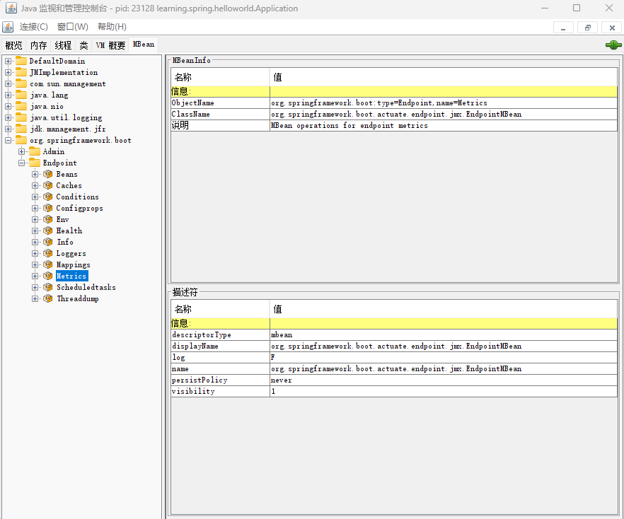
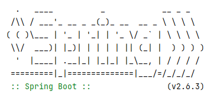

# Spring Boot

[TOC]

## 概述

Spring Boot 围绕着「运维」和「配置」提供了大量的功能，其中核心功能是：

- **起步依赖**：它主要解决依赖管理的难题：针对一个功能，需要引入哪些依赖、它们的版本又是什么、互相之间是否存在冲突、它们的间接依赖项之间是否存在冲突？

  起步依赖是以功能为单位来组织依赖的

- **自动配置**：它能根据 CLASSPATH 中存在的类判断出引入了哪些依赖，并为这些依赖提供常规的默认配置，以此来消除模板化的配置过程。与此同时，Spring Boot 仍然给我们留下了很大的自由度，可以对配置进行各种定制

- **Spring Boot Actuator**：提供一系列在生产环境运行时所需的特性，帮助我们监控并管理应用程序。通过 HTTP 端点或者 JMX，Spring Boot Actuator 可以实现健康检查、度量收集、审计、配置管理等功能。

Spring Boot 工程的目录结构如下：

~~~
|-pom.xml
|-src
  	|-main
    	|-java
    	|-resources
  	|-test
    	|-java
    	|-resources
~~~

- pom.xml 中管理了整个项目的依赖和构建相关的信息；它分为以下几个部分：

  - 工程自身的 GroupId、ArtifactId 与 Version 等内容定义；

  - 工程所继承的 `org.springframework.boot:spring-boot-starter-parent` 父项目文件；

    ~~~xml
    <parent>
        <groupId>org.springframework.boot</groupId>
        <artifactId>spring-boot-starter-parent</artifactId>
        <version>2.6.3</version>
        <relativePath/> <!-- lookup parent from repository -->
    </parent>
    ~~~

    `org.springframework.boot:spring-boot-starter-parent` 又继承了 `org.springframework.boot:spring-boot-dependencies`。

    `spring-boot-dependencies.pom`在`<properties>` 内定义了很多版本号

    

    在`dependencyManagement`中定义了各种`dependency`，这些依赖引用了`properties`中的版本号。其中`dependencyManagement`表示声明依赖，但不加载。只有在子项目中配置了一个没有版本号的依赖时，才会进行加载。这样我们就无需在我们自己的pom文件中说明依赖的版本号，springboot已经帮我们配置好了。

  - `<dependencies/>` 依赖项定义；

  - `<build/>` 构建（build）相关的配置定义（插件）。

    ~~~xml
    <build>
        <plugins>
            <plugin>
                <groupId>org.springframework.boot</groupId>
                <artifactId>spring-boot-maven-plugin</artifactId>
            </plugin>
        </plugins>
    </build>
    ~~~

    

  

- **`src/main`** 中是生产的 Java 代码和相关资源文件；

  - java：Java代码
  - resources：项目的资源文件

- **`src/test`** 中是测试的 Java 代码和相关资源文件。

## 起步依赖

管理依赖时有以下问题： 

- GroupId 和 ArtifactId 相同但 Version 不同的依赖，Maven 会仅保留某个依赖。

- 同一个依赖项因为版本升级替换了 GroupId 或 ArtifactId 的情况。这更糟糕，Maven 会认为这是两个不同的依赖，它们都会被保留下来

Spring Boot 的起步依赖之后，此类问题就能得到缓解，同一版本的 Spring Boot 中的各个起步依赖所引入的依赖不会产生冲突，因为官方对这些依赖进行了严格的测试。

Spring Boot 按照功能划分了很多起步依赖，大家只需要知道自己要什么功能，比如要实现 Web 功能、需要 JPA 支持等。具体引入什么依赖、分别是什么版本，都可以交给起步依赖来完成。

一些常用的 Spring Boot 起步依赖：

| 名称                             | 描述                                                         |
| :------------------------------- | :----------------------------------------------------------- |
| `spring-boot-starter`            | Spring Boot 的核心功能，比如自动配置、配置加载等             |
| `spring-boot-starter-actuator`   | Spring Boot 提供的各种生产级特性                             |
| `spring-boot-starter-aop`        | Spring AOP 相关支持                                          |
| `spring-boot-starter-data-jpa`   | Spring Data JPA 相关支持，默认使用 Hibernate 作为 JPA 实现   |
| `spring-boot-starter-data-redis` | Spring Data Redis 相关支持，默认使用 Lettuce 作为 Redis 客户端 |
| `spring-boot-starter-jdbc`       | Spring 的 JDBC 支持                                          |
| `spring-boot-starter-logging`    | 日志依赖，默认使用 Logback                                   |
| `spring-boot-starter-security`   | Spring Security 相关支持                                     |
| `spring-boot-starter-test`       | 在 Spring 项目中进行测试所需的相关库                         |
| `spring-boot-starter-web`        | 构建 Web 项目所需的各种依赖，默认使用 Tomcat 作为内嵌容器    |

如果我们出于修复安全漏洞或使用新功能的目的，想要升级某些依赖，但 Spring Boot 的依赖并未升级。我们可以在 Maven 的 `<properties/>` 中指定对应依赖的版本

~~~xml
<properties>
    <jackson-bom.version>2.11.0</jackson-bom.version>
</properties>
~~~

我们也可以代替掉一些依赖，例如用 Log4j2 代替 Logback：

~~~xml
<dependencies>
    <dependency>
        <groupId>org.springframework.boot</groupId>
        <artifactId>spring-boot-starter-web</artifactId>
        <exclusions>
            <exclusion>
                <groupId>org.springframework.boot</groupId>
                <artifactId>spring-boot-starter-logging</artifactId>
            </exclusion>
        </exclusions>
    </dependency>

    <dependency>
        <groupId>org.springframework.boot</groupId>
        <artifactId>spring-boot-starter-log4j2</artifactId>
    </dependency>
</dependencies>
~~~

起步依赖背后使用的其实就是 **Maven 的传递依赖机制**。

## 自动配置

`@SpringBootApplication`主要是这三个注解

- @`SpringBootConfiguration`：说明它是一个配置类
- `@EnableAutoConfiguration`（下面会介绍）
- `@ComponentScan`：扫描指定包（以及子包）中的Bean对象，默认就是`@SpringBootAplication`类所在的包

~~~java
@SpringBootApplication
public class BinaryTeaApplication {
	public static void main(String[] args) {
		ConfigurableApplicationContext context = SpringApplication.run(BinaryTeaApplication.class, args);
	}
}
~~~

`SpringApplication.run`方法会创建一个`ApplicationContext`容器实例，完成IoC容器构建工作。

In a Spring Boot application, you can define Spring beans by 

- Annotating a Java class with a @Component, @Service, or @Repository annotation tag 
- Annotating a class with a @Configuration tag and then defining a factory method for each Spring bean you want to build with a @Bean tag

上面的实现原理是通过`@SpringBootApplication`注解上的`@ComponentScan`来加载Bean对象。注意，@Configuration注解上有@Component

~~~java
//...
@Component
public @interface Configuration {
	//...
}

~~~

此外，还可以通过`@EnableAutoConfiguration`启用`spring-boot-autoconfigure`模块中的自动配置类来加载`Bean`（**约定大于配置**）。如果不想启用自动配置功能，可以在配置文件中配置`spring.boot.enableautoconfiguration=false`。

自动配置类是如何被加载的呢？关键在于 `@EnableAutoConfiguration` 上的 `@Import(AutoConfigurationImportSelector.class)`。`AutoConfigurationImportSelector` 类是 `ImportSelector` 的实现，这个接口的作用就是根据特定条件决定可以导入哪些配置类。`AutoConfigurationImportSelector`会读取

- `/META-INF/spring/org.springframework.boot.autoconfigure.AutoConfiguration.imports` 文件（或者是`META-INF/spring.factories`）来加载我们自己定义的自动配置类。

  > 有些读者可能困惑这与之前介绍的@ComponentScan来加载自动配置类有什么区别呢？ 这种方式一般在自定义spring-boot-starter时使用，相当于向其他模块暴露本项目的自动配置类。而通过@ComponentScan来加载自动配置类是本项目的私有自动配置类

- `AutoConfigurationImportSelector`会扫描所有在`spring-boot-autoconfigure`模块中的自动配置类，这些配置类一般以`“xxxAutoConfiguration”`来命名。

**这样容器都有根据配置类预先装配好的Bean对象了**。

自动配置类其实就是一个 `@Configuration` 类（基于 Java 类的配置）。

~~~java
@Target({ElementType.TYPE})
@Retention(RetentionPolicy.RUNTIME)
@Documented
@Component
public @interface Configuration {
    @AliasFor(
        annotation = Component.class
    )
    String value() default "";

    boolean proxyBeanMethods() default true;

    boolean enforceUniqueMethods() default true;
}

~~~

而它使用条件注解 `@Conditional` 来实现「根据特定条件来启用」的特性，也就是按需装配。注解中传入的 `Condition` 类就是不同条件的判断逻辑。Spring Boot 内置了很多条件注解（`@Conditional` + `Condition`类）

| 条件注解                          | 生效条件                                                     |
| :-------------------------------- | :----------------------------------------------------------- |
| `@ConditionalOnBean`              | 存在特定名称、特定类型、特定泛型参数或带有特定注解的 Bean    |
| `@ConditionalOnMissingBean`       | 与前者相反，不存在特定 Bean                                  |
| `@ConditionalOnClass`             | 存在特定的类                                                 |
| `@ConditionalOnMissingClass`      | 与前者相反，不存在特定类                                     |
| `@ConditionalOnCloudPlatform`     | 运行在特定的云平台上，截至 2.6.3 版本，代表云平台的枚举类支持无云平台、CloudFoundry、Heroku、SAP、Kubernetes 和 Azure，可以通过 `spring.main.cloud-platform` 配置强制使用的云平台 |
| `@ConditionalOnExpression`        | 指定的 SpEL 表达式为真                                       |
| `@ConditionalOnJava`              | 运行在满足条件的 Java 上，可以比指定版本新，也可以比指定版本旧 |
| `@ConditionalOnJndi`              | 指定的 JNDI 位置必须存在一个，如没有指定，则需要存在 `InitialContext` |
| `@ConditionalOnProperty`          | 属性值满足特定条件，比如给定的属性值都不能为 `false`         |
| `@ConditionalOnResource`          | 存在特定资源                                                 |
| `@ConditionalOnSingleCandidate`   | 当前上下文中，特定类型的 Bean 有且仅有一个                   |
| `@ConditionalOnWarDeployment`     | 应用程序是通过传统的 War 方式部署的，而非内嵌容器            |
| `@ConditionalOnWebApplication`    | 应用程序是一个 Web 应用程序                                  |
| `@ConditionalOnNotWebApplication` | 与前者相反，应用程序不是一个 Web 应用程序                    |

以 `@ConditionalOnClass` 注解为例，它的定义如下所示：其中最关键的就是 `OnClassCondition` 条件类

~~~java
@Target({ ElementType.TYPE, ElementType.METHOD })
@Retention(RetentionPolicy.RUNTIME)
@Documented
@Conditional(OnClassCondition.class)
public @interface ConditionalOnClass {
    Class<?>[] value() default {};
    String[] name() default {};
}
~~~

下面我们来看一个配置类：

~~~java
@Configuration(proxyBeanMethods = false)
@ConditionalOnClass({ DataSource.class, JdbcTemplate.class })
@ConditionalOnSingleCandidate(DataSource.class)
@AutoConfigureAfter(DataSourceAutoConfiguration.class)
@EnableConfigurationProperties(JdbcProperties.class)
@Import({ JdbcTemplateConfiguration.class, NamedParameterJdbcTemplateConfiguration.class })
public class JdbcTemplateAutoConfiguration {
    //...
}
~~~

可以看到这个配置类的生效条件是

1. 存在 `DataSource` 和 `JdbcTemplate` 类，

2. 在上下文中只能有一个 `DataSource`。

此外，这个自动配置类满足

1. 需要在 `DataSourceAutoConfiguration` 之后再配置（可以用 `@AutoConfigureBefore`、`@AutoConfigureAfter` 和 `@AutoConfigureOrder` 来控制自动配置的顺序）。
2. 同时导入 `JdbcTemplateConfiguration` 和 `NamedParameterJdbcTemplateConfiguration` 里的配置。

有些情况我们会想要强制禁用某些自动配置，这时就需要做以下处理：

- 在配置文件中使用 `spring.autoconfigure.exclude` 配置项，其值为所要排除自动配置类的全限定类名
- 在 `@SpringBootApplication` 注解中添加 `exclude` 注解元素

Spring Boot 有 18 种方式来加载属性，且存在同名覆盖关系，其覆盖优先级如下（从高到低）

- 测试类上的 `@TestPropertySource` 注解
-  测试类上的 `@SpringBootTest` 注解中的 `properties` 属性
- 命令行参数
- `java:comp/env` 中的 JNDI 属性
- `System.getProperties()` 中获取到的系统属性
- 操作系统环境变量
- 应用配置文件（具体优先级见下）
- 配置类上的 `@PropertySource` 注解

Spring Boot 还为我们指定了默认的配置文件，以 `application` 为文件名，有 `.properties` 和` .yml`格式。 Spring Boot 会按如下优先级加载属性：

- Jar包外的`application-{profile}.properties`；
- Jar包外的`application.properties`；
- Jar 包内部的 `application-{profile}.properties`；
- Jar 包内部的 `application.properties`。

Spring Boot 会在如下几处位置寻找 `application.properties` 文件，并将其中的内容添加到 Spring 的 `Environment` 中（优先级从高到低）：

- 项目根路径下的`/config`目录
- 项目目录
- CLASSPATH 中的 `/config` 目录；
- CLASSPATH 根目录。

如果同时存在 `.propertries` 文件和 `.yml` 文件，那么后者中配置的属性优先级更高。

如果我们不想用 `application` 来做文件名，可以通过 `spring.config.name`来设置。通过下面的方式可以将 `application.properties` 改为 `spring.properties`：

~~~shell
java -jar foo.jar --spring.config.name=spring
~~~

还可以通过 `spring.config.location` 来修改查找配置文件的路径，用逗号分隔，越靠后的优先级越高：

~~~shell
--spring.config.location=classpath:/,classpath:/config/,file:./,file:./config/*/,file:./config/
~~~

Spring Boot 提供了一种结构化且类型安全的方式来处理配置属性（configuration properties）——使用 `@ConfigurationProperties` 注解。

通常，我们会在类中用 `@Value("${}")` 注解来访问属性，或者在 XML 文件中使用 `${}` 占位符。Spring Boot 提供了一种结构化且类型安全的方式来处理配置属性（configuration properties）——使用 `@ConfigurationProperties` 注解。这样我们可以将大量属性对应到类的成员变量上：

~~~java
//Spring Boot 会把环境中以 spring.datasource 打头的属性都绑定到类的成员变量上，并且完成对应的类型转换。例如，spring.datasource.url 就会绑定到 url 上。

@ConfigurationProperties(prefix = "spring.datasource")
public class DataSourceProperties implements BeanClassLoaderAware, InitializingBean {
    private ClassLoader classLoader;
    private String name;
    private boolean generateUniqueName = true;
    private Class<? extends DataSource> type;
    private String driverClassName;
    private String url;
    // 以下省略
}
~~~

如果为类加上 `@ConstructorBinding` 注解，还可以通过构造方法完成绑定，不过并不常用。

Spring使用一些宽松的绑定属性规则。它一共支持四种属性命名形式：

- 短横线分隔，推荐的写法，比如 `spring.datasource.driver-class-name`；
- 驼峰式，比如 `spring.datasource.driverClassName`；
- 下划线分隔，比如 `spring.datasource.driver_class_name`；
- 全大写且用下划线分隔，比如 `SPRING_DATASOURCE_DRIVERCLASSNAME`。
- ...

默认情况下，Spring Boot 会忽略那些不能绑定到 `@ConfigurationProperties` 类字段的属性。可以将@`ConfigurationProperties`的`ignoreUnknownFields` 元素设置为 `false`，就实现当发现未绑定的属性时，控制台将会反馈给我们异常信息。然而这个注解被标记为`@Deprecated`了

我们可以通过在`@Configuration`类上添加 `@EnableConfigurationProperties (DataSourceProperties.class)` 注解，将绑定后的 `DataSourceProperties` 注册为 Bean，此时的 Bean 名称为“属性前缀 - 配置类的全限定类名”。

~~~java
@Component
@ConfigurationProperties(prefix = "myapp.mail")
class MailModuleProperties {
    
}

@Configuration
@ComponentScan("...") 
class PropertiesConfig {
    
}

// 等价于
@EnableConfigurationProperties(MailModuleProperties.class)
class PropertiesConfig {
    
}

// 等价于
@Configuration
class PropertiesConfig {
    @Bean
    public MailModuleProperties mailModuleProperties() {
        return new MailModuleProperties();
    }
}

@ConfigurationProperties(prefix = "myapp.mail")
class MailModuleProperties {
    
}
~~~

### 自定义

官方的命名空间

- 模式：spring-boot-starter-模块名
- 举例：spring-boot-starter-web、spring-boot-starter-jdbc

自定义的命名空间

- 模式：模块名-spring-boot-starter
- 举例：mybatis-spring-boot-starter

步骤

1. 新建两个模块，注意不需要父pom文件

   1. xxx-spring-boot-autoconfigure：自动配置核心代码
   2. xxx-spring-boot-starter：管理依赖

2. 在 xxx-spring-boot-autoconfigure 项目中

   1. 引入 spring-boot-autoconfigure 的 maven 依赖
   2. 创建自定义的 XXXProperties 类，以及相关的业务逻辑类
   3. 创建自定义的 XXXAutoConfiguration 类：这个类用于做自动配置时的一些逻辑。
   4. 创建自定义的 spring.factories 文件：在 resources/META-INF 创建一个 spring.factories 文件和 spring-configuration-metadata.json
      1. spring-configuration-metadata.json 文件是用于在填写配置文件时的智能提示
      2. spring.factories用于导入自动配置类。
   
3. 在 xxx-spring-boot-starter 项目中引入 xxx-spring-boot-autoconfigure 依赖，其他项目使用该 starter 时只需要依赖 xxx-spring-boot-starter 即可

   

## SpringBootTest

@SpringBootTest 在默认情况下开始在测试类的当前包中搜索，寻找用 @SpringBootConfiguration 注解的类，然后从中读取配置以创建应用程序上下文。

## Spring Boot Actuator 

通过Spring Boot Actuator所提供的各种**端点（endpoint）**来了解系统的运行情况，以及使用 `Micrometer` 为各种监控系统提供度量指标数据

引入 `org.springframework.boot:spring-boot-starter-actuator` 起步依赖后，我们就可以通过 HTTP 来访问这些功能（也可以使用 JMX 来访问）

~~~xml
<dependency>
    <groupId>org.springframework.boot</groupId>
    <artifactId>spring-boot-starter-actuator</artifactId>
</dependency>
~~~

### 端点

根据功能的不同，我们可以将这些端点划分成四类：

- 信息类端点：

  | 端点 ID            | 默认开启 HTTP | 默认开启 JMX | 端点说明                                                     |
  | :----------------- | :------------ | :----------- | :----------------------------------------------------------- |
  | `auditevents`      | 否            | 是           | 提供系统的审计信息                                           |
  | `beans`            | 否            | 是           | 提供系统中的 Bean 列表                                       |
  | `caches`           | 否            | 是           | 提供系统中的缓存信息                                         |
  | `conditions`       | 否            | 是           | 提供配置类的匹配情况及条件运算结果                           |
  | `configprops`      | 否            | 是           | 提供 `@ConfigurationProperties` 的列表                       |
  | `env`              | 否            | 是           | 提供 `ConfigurableEnvironment` 中的属性信息                  |
  | `flyway`           | 否            | 是           | 提供已执行的 Flyway 数据库迁移信息                           |
  | `httptrace`        | 否            | 是           | 提供 HTTP 跟踪信息，默认最近 100 条                          |
  | `info`             | 是            | 是           | 显示事先设置好的系统信息                                     |
  | `integrationgraph` | 否            | 是           | 提供 Spring Integration 图信息                               |
  | `liquibase`        | 否            | 是           | 提供已执行的 Liquibase 数据库迁移信息                        |
  | `logfile`          | 否            | 无此功能     | 如果设置了 `logging.file.name` 或 `logging.file.path` 属性，则显示日志文件内容 |
  | `mappings`         | 否            | 是           | 提供 `@RequestMapping` 的映射列表                            |
  | `scheduledtasks`   | 否            | 是           | 提供系统中的调度任务列表                                     |

  默认只有 `info` 是开启了 HTTP 访问的，因此在运行程序后，通过浏览器或者其他方式访问 `http://localhost:8080/actuator/health` 就能访问到 `health` 端点的信息。

- 监控类端点：

  | 端点 ID      | 默认开启 HTTP | 默认开启 JMX | 端点说明                             |
  | :----------- | :------------ | :----------- | :----------------------------------- |
  | `health`     | 是            | 是           | 提供系统运行的健康状态               |
  | `metrics`    | 否            | 是           | 提供系统的度量信息                   |
  | `prometheus` | 否            | 无此功能     | 提供 Prometheus 系统可解析的度量信息 |

- 操作类端点：

  | 端点 ID      | 默认开启 HTTP | 默认开启 JMX | 端点说明                                                     |
  | :----------- | :------------ | :----------- | :----------------------------------------------------------- |
  | `heapdump`   | 否            | 无此功能     | 执行 Heap Dump 操作                                          |
  | `loggers`    | 否            | 是           | 查看并修改日志信息                                           |
  | `sessions`   | 否            | 是           | 针对使用了 Spring Session 的系统，可获取或删除用户的 Session |
  | `shutdown`   | 否            | 否           | 优雅地关闭系统                                               |
  | `threaddump` | 否            | 是           | 执行 Thread Dump 操作                                        |

- 集成类端点：

  | 端点 ID   | 默认开启 HTTP | 默认开启 JMX | 端点说明                  |
  | :-------- | :------------ | :----------- | :------------------------ |
  | `jolokia` | 否            | 无此功能     | 通过 HTTP 来发布 JMX Bean |

如果要开启或者禁用某个端点，可以在`application.properties`中调整 `management.endpoint.<id>.enabled` 属性。例如，想要开启 `shutdown` 端点，就可以这样配置：

~~~xml
management.endpoint.shutdown.enabled=true
~~~

也可以调整默认值，禁用所有端点，随后开启指定端点。例如，只开启 `health` 端点：

~~~xml
management.endpoints.enabled-by-default=false
management.endpoint.health.enabled=true
~~~

### 通过HTTP访问端点

可以使用 `management.endpoints.web.exposure.include` 和 `management.endpoints.web.exposure.exclude` 这两个属性来控制哪些端点可以通过 HTTP 方式发布，而哪些是忽略掉的（注意，访问和开启是不一样的）：

~~~xml
management.endpoints.web.exposure.include=beans,env,health,info
management.endpoints.web.exposure.include=*
~~~

要是一个端点同时出现在 `management.endpoints.web.exposure.include` 和 `management.endpoints.web.exposure.exclude` 这两个属性里，那么后者的优先级会高于前者，也就是说该端点会被排除。

如果我们希望了解 HTTP 方式可以访问哪些端点，可以直接访问 `/actuator` 地址，会得到类似下面的 JSON 信息，其中 `templated` 为 `true` 的 URL ，表示可以用具体的值去代替 `{}` 里的内容：

~~~xml
{
    "_links": {
        "health": {
            "href": "http://localhost:8080/actuator/health",
            "templated": false
        },
        "health-path": {
            "href": "http://localhost:8080/actuator/health/{*path}",
            "templated": true
        },
        "info": {
            "href": "http://localhost:8080/actuator/info",
            "templated": false
        },
        "self": {
            "href": "http://localhost:8080/actuator",
            "templated": false
        }
    }
}
~~~

需要特别说明一点，要发布 HTTP 端点，必须要有 Web 支持，因此项目需要引入 `spring-boot-starter-web` 起步依赖。

### 通过JMX访问端点

与 HTTP 方式类似，JMX 也有两个属性，即 `management.endpoints.jmx.exposure.include` 和 `management.endpoints.jmx.exposure.exclude`。前者的默认值为 `*`，后者的默认值为空。

有不少工具可以用来访问 JMX 端点，比如 JVisualVM 和 JConsole，它们都是 JDK 自带的工具。

因SpringBoot Actuator会暴露服务的详细信息，为了保障安全性，建议添加安全控制的相关依赖spring-boot-starter-security。但是就算做了保护，黑客也能通过端点信息推断出这个系统是通过 Spring Boot 实现的，进而利用Spring Boot 存在的漏洞来进行攻击。如何解决这个问题呢？

- 在防火墙或者负载均衡层面，禁止外部访问 Spring Boot Actuator 的 URL，例如，直接禁止访问 `/actuator` 及其子路径。

- （推荐做法）让 Actuator 的端点暴露在与业务代码不同的 HTTP 端口上（例如`8081`端口），而防火墙和负载均衡设备只知道 `8080` 端口的存在，也只会转发请求到 `8080` 端口，就不用担心外部能访问到 `8081` 端口的问题了。

  

  如果像下面这样来做设置，就能将 `health` 端点访问的 URL 调整为 `http://localhost:8081/management/my-actuator/health` 了：

  ~~~xml
  management.server.port=8081
  management.server.base-path=/management
  management.endpoints.web.base-path=/my-actuator
  ~~~

  - `management.server.port`：设置 Actuator 的端口
  - `management.server.base-path` ：为 Spring Boot Actuator 设置 Servlet 上下文，默认为空
  - `management.endpoints.web.base-path` 属性来调整 `/actuator` 这个默认的基础路径

### 定制端点信息

可以在 `org.springframework.boot:spring-boot-actuator-autoconfigure` 包中查看各种以 `Properties` 结尾的属性类，也可以直接通过 `configprops` 端点来查看属性类，**这些属性类包括了每个端点的私有配置属性**，这些配置属性会改变端点的行为。

例如，`EnvironmentEndpointProperties` 就对应了 `management.endpoint.env` 中的属性，其中其中的 `keysToSanitize` 就是环境中要过滤的自定义敏感信息键名清单，在设置了 `management.endpoint.env.keys-to-sanitize=java.*,sun.*` 后，`env` 端点返回的属性中，所有 `java` 和 `sun` 打头的属性值都会以 `*` 显示。

#### 定制info端点信息

根据 `InfoEndpointAutoConfiguration` 可以得知，`InfoEndpoint` 中会被注入从 Spring 上下文中搜索到的所有 `InfoContributor` Bean 实例，这些`InfoContributor`实例包含了更多的端点信息。`InfoContributorAutoConfiguration` 已经自动注入了 `env`、`git` 和 `build` 这三个 `InfoContributor` Bean，我们也可以注入自己的`InfoContributor` Bean实例

| ID      | Name                                                         | Description                                                  | Prerequisites                                |
| :------ | :----------------------------------------------------------- | :----------------------------------------------------------- | :------------------------------------------- |
| `build` | [`BuildInfoContributor`](https://github.com/spring-projects/spring-boot/tree/v3.2.0/spring-boot-project/spring-boot-actuator/src/main/java/org/springframework/boot/actuate/info/BuildInfoContributor.java) | Exposes build information.                                   | A `META-INF/build-info.properties` resource. |
| `env`   | [`EnvironmentInfoContributor`](https://github.com/spring-projects/spring-boot/tree/v3.2.0/spring-boot-project/spring-boot-actuator/src/main/java/org/springframework/boot/actuate/info/EnvironmentInfoContributor.java) | Exposes any property from the `Environment` whose name starts with `info.`. | None.                                        |
| `git`   | [`GitInfoContributor`](https://github.com/spring-projects/spring-boot/tree/v3.2.0/spring-boot-project/spring-boot-actuator/src/main/java/org/springframework/boot/actuate/info/GitInfoContributor.java) | Exposes git information.                                     | A `git.properties` resource.                 |
| `java`  | [`JavaInfoContributor`](https://github.com/spring-projects/spring-boot/tree/v3.2.0/spring-boot-project/spring-boot-actuator/src/main/java/org/springframework/boot/actuate/info/JavaInfoContributor.java) | Exposes Java runtime information.                            | None.                                        |
| `os`    | [`OsInfoContributor`](https://github.com/spring-projects/spring-boot/tree/v3.2.0/spring-boot-project/spring-boot-actuator/src/main/java/org/springframework/boot/actuate/info/OsInfoContributor.java) | Exposes Operating System information.                        | None.                                        |
|         | `SimpleInfoContributor`                                      | 信息以键值对形式输出                                         |                                              |
|         | `MapInfoContributor`                                         | 信息以Map形式输出                                            |                                              |

假设在配置文件中设置了如下内容（`EnvironmentInfoContributor`）：

~~~xml
<!--这不是之前介绍的私有配置属性，而是用户自定义设置的属性，由EnvironmentInfoContributor负责加载-->
info.app=HelloWorld
info.welcome=Welcome to the world of Spring.
~~~

以及提供如下的 Bean：

~~~java
@Bean
public SimpleInfoContributor simpleInfoContributor() {
    return new SimpleInfoContributor("simple", "HelloWorld!");
}
~~~

那么 info 端点输出的内容大致如下所示：

~~~json
{
    "app": "HelloWorld",
    "simple": "HelloWorld!",
    "welcome": "Welcome to the world of Spring."
}
~~~

With no prerequisites to indicate that they should be enabled, the `env`, `java`, and `os` contributors are disabled by default. Each can be enabled by setting its `management.info.<id>.enabled` property to `true`.

The `build` and `git` info contributors are enabled by default. Each can be disabled by setting its `management.info.<id>.enabled` property to `false`. Alternatively, to disable every contributor that is usually enabled by default, set the `management.info.defaults.enabled` property to `false`.

#### 定制health端点信息

健康检查主要是依赖 `HealthIndicator`的各种实现来完成的。Spring Boot Actuator 内置了近 20 种不同的实现，下面列出一些常用的 `HealthIndicator` 实现，基本可以满足日常开发的需求

| 实现类                          | 作用                                                         |
| :------------------------------ | :----------------------------------------------------------- |
| `DataSourceHealthIndicator`     | 检查 Spring 上下文中能取到的所有 `DataSource` 是否健康       |
| `DiskSpaceHealthIndicator`      | 检查磁盘空间                                                 |
| `LivenessStateHealthIndicator`  | 检查系统的存活（Liveness）情况，一般用于 Kubernetes 中       |
| `ReadinessStateHealthIndicator` | 检查系统是否处于就绪（Readiness）状态，一般用于 Kubernetes 中 |
| `RedisHealthIndicator`          | 检查所依赖的 Redis 健康情况                                  |

每个 `HealthIndicator` 检查后都会有自己的状态信息，`org.springframework.boot.actuate.health.Status` 定义了几种默认状态，按照优先级降序排列分别为 `DOWN`、`OUT_OF_SERVICE`、`UP` 和 `UNKNOWN`。如果有需要，我们也可以通过 `management.endpoint.health.status.order` 来更改状态的优先级。例如，假设在您的一个`HealthIndicator`实现中使用了一个code为`FATAL`的新`Status`。要配置严重性顺序，请将以下属性添加到应用程序属性中：

~~~xml
management.endpoint.health.status.order=fatal,down,out-of-service,unknown,up
~~~

默认情况下，最终的 Spring Boot 应用的状态是由 `HealthAggregator`汇总而成的，汇总的算法是：

1. 设置状态顺序：`setStatusOrder(Status.DOWN, Status.OUT_OF_SERVICE, Status.UP, Status.UNKNOWN);`。
2. 过滤掉不能识别的状态。
3. 如果无任何状态，整个 Spring Boot 应用的状态是 `UNKNOWN`。
4. 将所有收集到的状态码按照 1 中的顺序排序。
5. 返回有序状态序列中的第一个状态，作为整个 Spring Boot 应用的状态。

Http Respond中的状态码反映上述汇总的结果。`OUT_OF_SERVICE`和`DOWN`对应为503，其他状态的默认状态码为`200`。可以通过`management.endpoint.health.status.http-mapping`来设置状态所对应的状态码：

~~~xml
management.endpoint.health.status.http-mapping.fatal=503
~~~

Spring Boot Actuator 默认开启了所有的 `HealthIndicator`。以通过 `management.health.defaults.enabled=false` 开关（默认关闭），随后使用 `management.health.<name>.enabled` 选择性地开启 `HealthIndicator`。

例如，`DataSourceHealthContributorAutoConfiguration` 是这样定义的：

~~~java
@Configuration(proxyBeanMethods = false)
@ConditionalOnClass({ JdbcTemplate.class, AbstractRoutingDataSource.class })
@ConditionalOnBean(DataSource.class)
@ConditionalOnEnabledHealthIndicator("db")
@AutoConfigureAfter(DataSourceAutoConfiguration.class)
public class DataSourceHealthContributorAutoConfiguration extends
    CompositeHealthContributorConfiguration<AbstractHealthIndicator, DataSource>
    implements InitializingBean {
    
}
~~~

那么它的生效条件是这样的：

- CLASSPATH 中存在 `JdbcTemplate` 和 `AbstractRoutingDataSource` 类；
- Spring 上下文中存在 `DataSource` 类型的 Bean；
- 默认开关打开，或者 `management.health.db.enabled=true`，此处 `@ConditionalOnEnabledHealthIndicator` 中的 `db` 就是 `name`

通过配置 `management.endpoint.health.show-details` 和 `management.endpoint.health.show-components` 的属性值来查看结果：

- `never`：从不显示
-  `always` ：显示给所有用户
-  `when-authorized`：仅显示给授权用户，使用`management.endpoint.health.roles`来配置授权角色。

根据 `HealthEndpointConfiguration` 类的代码，我们可以知道 `healthContributorRegistry` 会从 Spring 上下文获取所有 `HealthContributor` 类型（`HealthIndicator` 继承了这个接口）的 Bean，并进行注册。所以我们也只需要把写好的 `HealthIndicator` 配置为 Bean 即可。

~~~java
@Component("shopReady")
public class ShopReadyHealthIndicator extends AbstractHealthIndicator {
    private BinaryTeaProperties binaryTeaProperties;

    public ShopReadyHealthIndicator(ObjectProvider<BinaryTeaProperties> binaryTeaProperties) {
        this.binaryTeaProperties = binaryTeaProperties.getIfAvailable();
    }

    @Override
    protected void doHealthCheck(Health.Builder builder) throws Exception {
        if (binaryTeaProperties == null || !binaryTeaProperties.isReady()) {
            builder.down();
        } else {
            builder.up();
        }
    }
}
~~~

~~~xml
{
    "components": {
        // 省略部分内容
        "ping": {
            "status": "UP"
        },
        "shopReady": {
            "status": "UP"
        }
    },
    "status": "UP"
}
~~~

>**优先通过 `ObjectProvider` 获取 Bean**
>
>容器中没有Bean时，或者有多个未决候选者Bean时，那么就在编译时抛出异常。而通过ObjectProvider类型，可以将这些问题放在运行时来处理，例如：
>
>~~~java
>public IndexService(ObjectProvider<B> b) {
>    this.b = b.getIfAvailable();
>}
>~~~
>
>上述代码在没有发现B类型的Bean对象时，返回`null`，而不是抛出异常。

#### 开发自己的端点

首先，在 Bean 上添加 `@Endpoint` 注解，其中带有 `@ReadOperation`、`@WriteOperation` 和 `@DeleteOperation` 的方法能被发布出来，而且能通过 JMX 或者 HTTP 的方式访问到这些方法。如果我们希望限制只用其中的一种方式来发布，则可以将 `@Endpoint` 替换为 `@JmxEndpoint` 或 `@WebEndpoint`。

如果是通过 HTTP 方式访问的，默认的 URL 是 `/actuator/<id>`，其中的 `id` 就是 `@Endpoint` 注解中指定的 `id`，而 `@ReadOperation`、`@WriteOperation` 和 `@DeleteOperation` 的方法分别对应了 HTTP 的 `GET`、`POST` 和 `DELETE` 方法。

~~~java
@Component
@Endpoint(id = "shop")
public class ShopEndpoint {
    private BinaryTeaProperties binaryTeaProperties;

    public ShopEndpoint(ObjectProvider<BinaryTeaProperties> binaryTeaProperties) {
        this.binaryTeaProperties = binaryTeaProperties.getIfAvailable();
    }

    @ReadOperation
    public String state() {
        if (binaryTeaProperties == null || !binaryTeaProperties.isReady()) {
            return "We're not ready.";
        } else {
            return "We open " + binaryTeaProperties.getOpenHours() + ".";
        }
    }
}
~~~

为了能访问到我们的端点，需要在 `application.properties` 中允许它以 Web 形式发布：

~~~xml
management.endpoints.web.exposure.include=health,info,shop
~~~

启动系统后，通过 `http://localhost:8080/actuator/shop` 即可访问 `ShopEndpoint` 的输出。

### 基于 Micrometer 的系统度量

系统在生产环境中运行时，我们需要通过各种方式了解系统的运作是否正常。之前提到的 `health` 端点只能判断最基本的情况。至于更多细节，还需要通过`metrics` 端点来获取详细的度量指标

`Micrometer` 为很多主流的监控系统提供了一套简单且强大的客户端门面（Facade），它定义了一套 **SPI（Service Provider Interface）**，支持接入不同的监控系统，下面给出一小部分监控系统

|  监控系统  | 是否支持多维度 | 数据聚合方式 | 数据获取方式 |
| :--------: | :------------: | :----------: | :----------: |
|  Ganglia   |       否       |  客户端聚合  |   客户端推   |
|  Graphite  |       否       |  客户端聚合  |   客户端推   |
|    JMX     |       否       |  客户端聚合  |   客户端推   |
| Prometheus |       是       |  服务端聚合  |   服务端拉   |

 `Meter` 接口表示从系统收集来的度量数据，内置的 `Meter` 实现如下：

|     `Meter` 类型      |                             说明                             |
| :-------------------: | :----------------------------------------------------------: |
|        `Timer`        |                计时器，用来记录一个事件的耗时                |
|       `Counter`       |               计数器，用来表示一个单调递增的值               |
|        `Gauge`        | 计量仪，用来表示一个变化的值，通常能用 `Counter` 就不用 `Gauge` |
| `DistributionSummary` | 分布统计，用来记录事件的分布情况，可以设置一个范围，获取范围内的直方图和百分位数 |
|    `LongTaskTimer`    | 长任务计时器，记录一个长时间任务的耗时，可以记录已经耗费的时间 |
|   `FunctionCounter`   |           函数计数器，追踪某个单调递增函数的计数器           |
|    `FunctionTimer`    |    函数计时器，追踪两个单调递增函数，一个计数，另一个计时    |

 `MeterRegistry` 负责创建并管理这些 `Meter`。`Micrometer` 所支持的各种监控系统都有自己的 `MeterRegistry` 实现。创建 `Meter`，并向`MeterRegistry`注册的两种方式：

- `MeterRegistry` 上的方法：`registry.timer("foo")`，
-  `Fluent` 风格的构建方法：` Timer.builder("foo").tags("bar").register(registry)`

~~~java
MeterRegistry meterRegistry = new SimpleMeterRegistry();

//  方式一
Counter counter = meterRegistry.counter("request.times.order", "country", "China");

//  方式二
Counter counter2 = Counter
     .builder("request.times.order")
     .baseUnit("short") // optional
     .description("a description of what this counter does") // optional
     .tags("country", "China") // optional
     .register(registry);

// 记录数值
counter.increment();
counter2.increment();
~~~

`Meter` 的命名采用以 `.` 分隔的全小写单词组合，不同的监控系统功能有不同的命名方式，Micrometer 会负责将 `Meter` 的名称转为合适的方式

~~~java
registry.timer("http.server.requests");
~~~

在使用 `Prometheus` 监控系统时，这个 `Timer` 的名字就会被转为 `http_server_requests_duration_seconds`

`Micrometer`还支持标签（Key-Value）功能，使用它对数据进行分类（多维度），例如：

~~~java
registry.timer("http.server.requests", "uri", "/api/orders");
~~~

我们还可以给每一个向`MeterRegistry`注册的Metrics对象添加共有的标签：

~~~java
registry.config().commonTags("region", "cn-shanghai-1");
~~~

Spring Boot 还自动为我们向`MeterRegistry`注册了以下`Metrics`：

| 度量指标             | 说明                   |
| :------------------- | :--------------------- |
| `ClassLoaderMetrics` | 收集加载和卸载的类信息 |
| `JvmMemoryMetrics`   | 收集 JVM 内存利用情况  |
| `JvmGcMetrics`       | 收集 JVM 的 GC 情况    |
| `ProcessorMetrics`   | 收集 CPU 负载情况      |
| `JvmThreadMetrics`   | 收集 JVM 中的线程情况  |

下面的语句就能向`MeterRegistry`注册一个 `ClassLoaderMetrics`

~~~java
new ClassLoaderMetrics().bindTo(registry);
~~~

Spring Boot 通过 `JvmMetricsAutoConfiguration` 之类的自动配置类已经替我们做好了注册工作。此外，它还自动给 Spring MVC、HTTP 客户端和数据源定义并注册了其他度量指标，例如：

- 默认情况下，所有基于 Spring MVC 的 Web 请求都会被记录下来（`management.metrics.web.server.request.autotime.enabled=true`），通过 `/actuator/metrics/http.server.requests`可以查看这些记录

- 只要在 Spring 上下文中存在 `DataSource`  Bean，Spring Boot Actuator 就会自动为其创建对应的度量指标

每一个内置Meter对象都有可配置的属性，例如，我们注册了一个名为order.summary的Timer类型的Metrics对象，那么我们可以做如下配置，来设置该Metrics对象的分布统计百分比为95%：

~~~xml
management.metrics.distribution.percentiles.order.summary=0.95
~~~

**部分针对单个 `Meter` 的属性前缀**：

|                         属性前缀                         |             说明             |             适用范围             |
| :------------------: | :--------------------------: | :------------------------: |
|               `management.metrics.enable`                |           是否开启           |               全部               |
| `management.metrics.distribution.minimum-expected-value` |    分布统计时范围的最小值    | `Timer` 与 `DistributionSummary` |
| `management.metrics.distribution.maximum-expected-value` |    分布统计时范围的最大值    | `Timer` 与 `DistributionSummary` |
|      `management.metrics.distribution.percentiles`       | 分布统计时希望计算的百分位值 | `Timer` 与 `DistributionSummary` |

### 自定义度量指标

我们还可以针对各种业务做对应的数据埋点，来进一步了解系统的情况。

有两种注册 `Meter` 的方法

- 通过依赖注入获取到Spring 上下文中的 `MeterRegistry`，通过它来注册 `Meter`；

- 让 Bean 实现 `MeterBinder`接口，在其 `bindTo()` 方法中注册 `Meter`

  ~~~JAVA
  @Component
  public class SalesMetrics implements MeterBinder {
      private Counter orderCount;
      private Counter totalAmount;
      private DistributionSummary orderSummary;
      private AtomicInteger averageAmount = new AtomicInteger();
  
      @Override
      public void bindTo(MeterRegistry registry) {
          this.orderCount = registry.counter("order.count", "direction", "income");
          this.totalAmount = registry.counter("order.amount.sum", "direction", "income");
          this.orderSummary = registry.summary("order.summary", "direction", "income");
          registry.gauge("order.amount.average", averageAmount);
      }
  	
      // 从这里更新度量
      public void makeNewOrder(int amount) {
          orderCount.increment();
          totalAmount.increment(amount);
          orderSummary.record(amount);
          averageAmount.set((int) orderSummary.mean());
      }
  }
  ~~~

  

### Metrics输出

除了通过URL查看`Metrics`，还可以通过日志来查看。

 `LoggingMeterRegistry`，它可以定时将系统中的各个度量指标输出到日志中。有了结构化的日志信息，就能通过 ELK（Elasticsearch、Logstash 和 Kibana）等方式将它们收集起来，并加以分析。

~~~java
@Bean
public MeterRegistry customMeterRegistry() {
    CompositeMeterRegistry meterRegistry = new CompositeMeterRegistry();
    meterRegistry.add(new SimpleMeterRegistry());
    meterRegistry.add(new LoggingMeterRegistry());
    return meterRegistry;
}
~~~

## 打包

要运行 Java EE 的应用程序需要一个应用容器，比如 JBoss 或者 Tomcat。Spring Boot 内嵌了 Tomcat、Jetty 等容器。

在用 Maven 命令打包前，先来回顾一下 pom.xml 中配置的插件：

~~~xml
<build>
    <plugins>
        <plugin>
            <groupId>org.springframework.boot</groupId>
            <artifactId>spring-boot-maven-plugin</artifactId>
        </plugin>
    </plugins>
</build>
~~~

`spring-boot-maven-plugin` 会在 Maven 的打包过程中自动介入。它会生成两个文件，一个`.jar`，另一个是`.jar.original`。其中`.jar.original`就是普通的jar包结构，而`.jar`由以下几部分组成：

- **`META-INF`**，工程的元数据，例如 Maven 的描述文件与 `spring.factories` 文件；运行这个 Jar 所需要的信息都记录在了 `META-INF/MANIFEST.MF` 中，具体内容如下所示：

  ~~~xml
  Manifest-Version: 1.0
  Created-By: Maven JAR Plugin 3.2.2
  Build-Jdk-Spec: 11
  Implementation-Title: BinaryTea
  Implementation-Version: 0.0.1-SNAPSHOT
  Main-Class: org.springframework.boot.loader.JarLauncher
  Start-Class: learning.spring.binarytea.BinaryTeaApplication
  Spring-Boot-Version: 2.6.3
  Spring-Boot-Classes: BOOT-INF/classes/
  Spring-Boot-Lib: BOOT-INF/lib/
  Spring-Boot-Classpath-Index: BOOT-INF/classpath.idx
  Spring-Boot-Layers-Index: BOOT-INF/layers.idx
  ~~~

- **`org/springframework/boot/loader`**，Spring Boot 用来引导工程启动的 Loader 相关类；Spring Boot 提供了三种不同的 `Launcher`，可以从内嵌文件中加载启动所需的资源：

  - **`JarLauncher`**，从 Jar 包的固定位置加载内嵌资源，即 `BOOT-INF/lib/`；
  - **`WarLauncher`**，从 War 包的固定位置加载内嵌资源，分别为 `WEB-INF/lib/` 和 `WEB-INF/lib-provided/`；
  - **`PropertiesLauncher`**，默认从 `BOOT-INF/lib/` 加载资源，但可以通过环境变量来指定额外的位置。

- **`BOOT-INF/classes`**，工程自身的类与资源文件

- **`BOOT-INF/lib`**，工程所依赖的各种其他 Jar 文件

## 自定义SpringApplication

我们可以定制`SpringApplication`，例如：

~~~java
public static void main(String[] args) {
    new SpringApplicationBuilder()
        .sources(BinaryTeaApplication.class)
        .main(BinaryTeaApplication.class)
        .bannerMode(Banner.Mode.OFF)
        .web(WebApplicationType.SERVLET)
        // .web(WebApplicationType.NONE)
        .run(args);
}
~~~

我们可以通过 FailureAnalyzer 提供SrpingBoot应用启动失败的原因分析，Spring Boot 内置了近 20 种不同的分析器，这里只展示一小部分：

| `FailureAnalyzer` 实现类                          | 功能                                        |
| :------------------------------------------------ | :------------------------------------------ |
| `BindFailureAnalyzer`                             | 提示属性绑定相关异常                        |
| `DataSourceBeanCreationFailureAnalyzer`           | 提示数据源创建相关异常                      |
| `InvalidConfigurationPropertyNameFailureAnalyzer` | 提示配置属性名不正确                        |
| `NoSuchBeanDefinitionFailureAnalyzer`             | 提示 Spring 上下文中找不到需要的 Bean 定义  |
| `NoUniqueBeanDefinitionFailureAnalyzer`           | 提示要注入一个 Bean，但实际却找到了不止一个 |

我们也可以根据实际情况，提供自己的 `FailureAnalyzer` 实现类：

- 创建一个类并继承`AbstractFailureAnalyzer<T>`，其中的泛型 `T` 就是要分析的异常。然后，重写`analyze()`方法，用于分析异常并返回`FailureAnalysis`对象

  ~~~java
  class PortInUseFailureAnalyzer extends AbstractFailureAnalyzer<PortInUseException> {
      @Override
      protected FailureAnalysis analyze(Throwable rootFailure, PortInUseException cause) {
          return new FailureAnalysis("Web server failed to start. Port " + cause.getPort() + " was already in use.",
                 "Identify and stop the process that's listening on port " + cause.getPort() + " or configure this "
                 + "application to listen on another port.", cause);
      }
  }
  ~~~

- 将自定义的`FailureAnalyzer`类注册到`spring.factories`文件中

  ~~~xml
  org.springframework.boot.diagnostics.FailureAnalyzer=\
  com.example.demo.RequiredPropertyFailureAnalyzer
  ~~~

  

我们也可以自定义`Banner`栏，可以通过 `spring.main.banner-mode` 属性来控制 Banner 的输出方式：

- **`Banner.Mode.OFF`**（属性值为 `off`），关闭输出；
- **`Banner.Mode.CONSOLE`**（属性值为 `console`），输出到控制台，即标准输出 STDOUT；
- **`Banner.Mode.LOG`**（属性值为 `log`），输出到日志。

如果要自定义输出的内容

- 在 CLASSPATH 中放置一个 banner.txt

- 也可以通过 `spring.banner.location` 指定文件位置（以`resources`为根文件）

- 实现 `org.springframework.boot.Banner` 接口，在其中的 `printBanner()` 方法里打印 Banner。

  ~~~java
  public static void main(String[] args) {
      SpringApplication app = new SpringApplication(BinaryTeaApplication.class);
      app.setBanner(new Banner() {
          @Override
          public void printBanner(Environment environment, Class<?> sourceClass, PrintStream out) {
              out.println("打倒国内反革命叛徒集团，重铸共产主义荣光");
          }
      });
      app.run(args);
  }
  ~~~

  

文件中除了 ASCII 图案，还可以写一些占位符，例如，可以从 MANIFEST.MF 文件中获取一些信息：

- **`${application.title}`**，对应 `Implementation-Title`；
- **`${application.version}`**，对应 `Implementation-Version`；

Spring Boot 为我们提供了两个接口，分别是 `ApplicationRunner` 与 `CommandLineRunner`，表示启动后的一次性执行逻辑。

~~~java
public interface ApplicationRunner {
    void run(ApplicationArguments args) throws Exception;
}

public interface CommandLineRunner {
    void run(String... args) throws Exception;
}
~~~

其中ApplicationArguments可执行的操作有：

- **`containsOption()`**，是否包含指定选项
- **`getOptionValues()`**，获取指定选项的值，返回的是一个 `List`，
- **`getNonOptionArgs()`**，获取非选项类型的其他参数。

通过ComposeScan + `Bean`来启用这个功能

~~~java
@Component
public class ApplicationRunnerImpl implements ApplicationRunner {
    @Override
    public void run(ApplicationArguments args) throws Exception {
        Set<String> optionNames = args.getOptionNames();
        for (String optionName : optionNames) {
            List<String> values = args.getOptionValues(optionName);
            System.out.println(values.toString());
        }
    }
}
~~~

如果 Spring 上下文中存在多个 `ApplicationRunner` 或 `CommandLineRunner` 类型的Bean，可以通过 `@Order` 注解或 `Ordered` 接口来指定运行的顺序。

Spring Boot 为我们提供了 `ExitCodeGenerator` 接口，通过实现该接口我们可以加入自己的逻辑来生成退出码。然后再将这个退出码传入到`System.exit`方法中即可，通过`Bean`来注册这个接口

~~~java
@SpringBootApplication
public class MyApplication {

    @Bean
    public ExitCodeGenerator exitCodeGenerator() {
        return () -> 42;
    }

    public static void main(String[] args) {
        System.exit(SpringApplication.exit(SpringApplication.run(MyApplication.class, args)));
    }

}
~~~

此外，对于因异常而导致应用退出的情况，我们可以实现`ExitCodeExceptionMapper`接口来定义退出码：

~~~java
@SpringBootApplication
public class DemoApplication{
    // 异常信息仍会打印出来
    @Bean
    public ExitCodeExceptionMapper getExitCodeMapper(){
        return new ExitCodeExceptionMapper() {
            @Override
            public int getExitCode(Throwable exception) {
                return 243;
            }
        };
    }

    public static void main(String[] args) {
        SpringApplication.run(DemoApplication.class, args);
    }

    @Bean
    CommandLineRunner showUsers() {
        return args -> {throw new Exception("xxxxx");};
    }
}

~~~

## Lombok

Lombok是一个解放生产力的利器，它通过一系列注解消灭了上述冗长繁琐的语句。常用的一些注解如表：

| 注解                                                         | 作用                                                         |
| :----------------------------------------------------------- | :----------------------------------------------------------- |
| `@Getter / @Setter`                                          | 自动生成成员属性的 `Getter` 和 `Setter` 方法                 |
| `@ToString`                                                  | 自动生成 `toString()` 方法，默认拼接所有的成员属性，也可以排除指定的属性 |
| `@NoArgsConstructor` / `@RequiredArgsConstructor` / `@AllArgsConstructor` | 自动生成无参数的构造方法，必要参数的构造方法以及包含全部参数的构造方法 |
| `@EqualsAndHashCode`                                         | 自动生成 `equals()` 与 `hashCode()` 方法                     |
| `@Data`                                                      | 相当于添加了 `@ToString`、`@EqualsAndHashCode`、`@Getter`、`@Setter` 和 `@RequiredArgsConstructor` 注解 |
| `@Builder`                                                   | 提供了一个灵活的构造器，能够设置各个成员变量，再据此创建对象实例 |
| `@Slf4j` / `@CommonsLog` / `@Log4j2`                         | 自动生成对应日志框架的日志类，例如定义了一个 `Logger` 类型的 `log`，方便输出日志 |

在 IDE 中，为了开启对 Lombok 的支持，我们需要安装对应 IDE 的 Lombok 插件，例如，IDEA 中要安装 IntelliJ Lombok plugin。
