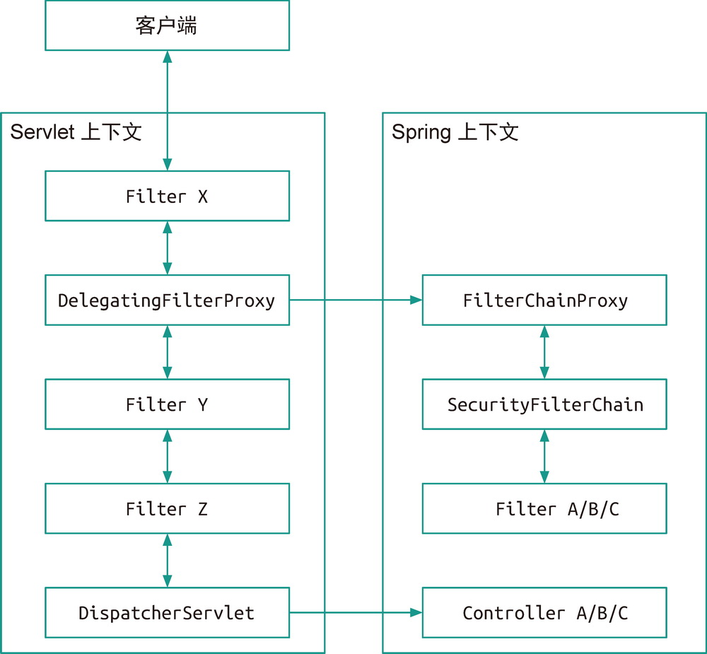
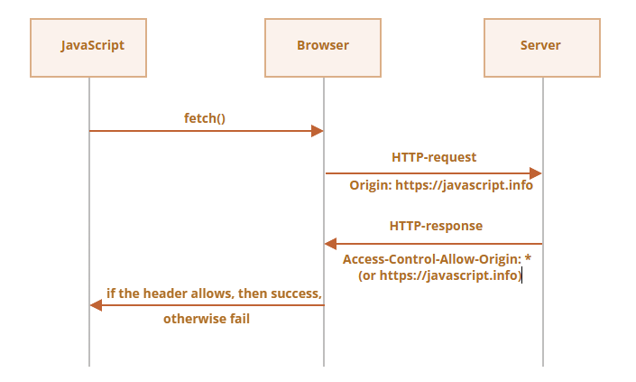
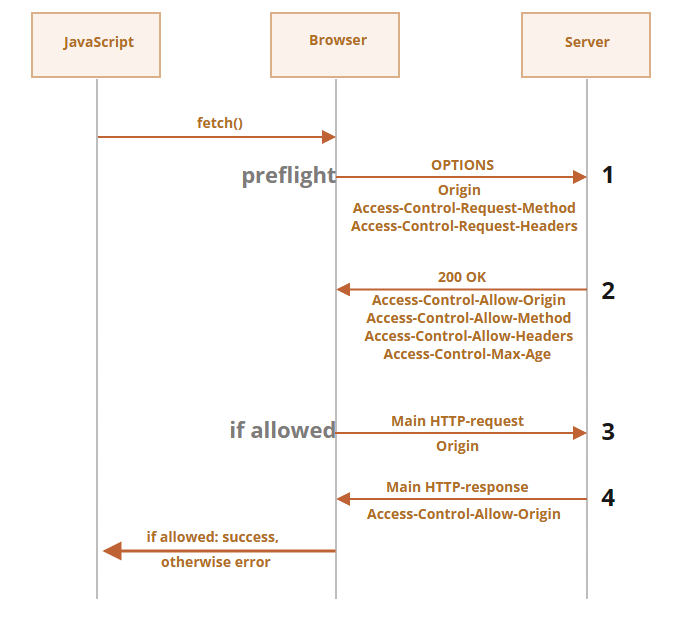
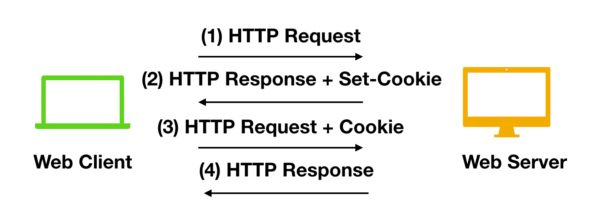
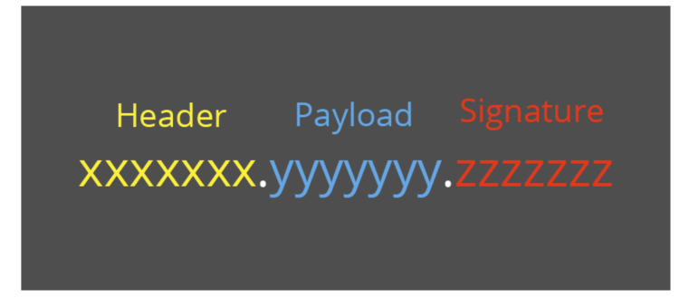

# Spring Security

Spring Security 主要提供了如下一些特性：

- **身份认证**
- **操作授权**
- **常见攻击防御**


`Spring Security`通过`Servlet`的过滤器`Filter`来做一些拦截操作，在这些拦截中来实现安全功能。




 `DelegatingFilterProxy` 在处理时会把请求转给在 `Spring` 上下文中的 `FilterChainProxy`，后者再将请求转给 `SecurityFilterChain`。

针对当前请求该对应哪些过滤器，都由 `SecurityFilterChain`（默认实现是 `DefaultSecurityFilterChain`，正是`http.build()`的返回值） 来决定。`Spring Security` 针对不同安全需求提供了大量过滤器，具体可见表 10-2。

**表 10-2　Spring Security 提供的部分 `Filter` 实现**

| `Filter`                               | 作用                                                         |
| :------------------------------------- | :----------------------------------------------------------- |
| `CorsFilter`                           | 处理 CORS（Cross-Origin Resource Sharing，跨域资源共享）的 `Filter` 实现 |
| `CsrfFilter`                           | 处理 CSRF（Cross-Site Request Forgery，跨站请求伪造）的 `Filter` 实现 |
| `UsernamePasswordAuthenticationFilter` | 处理用户名与密码认证的 `Filter` 实现                         |
| `AnonymousAuthenticationFilter`        | 处理匿名请求的 `Filter` 实现                                 |
| `RememberMeAuthenticationFilter`       | 实现“记住我”功能的 `Filter` 实现                             |
| `BasicAuthenticationFilter`            | 处理 HTTP Basic 认证的 `Filter` 实现                         |
| `ExceptionTranslationFilter`           | 翻译异常信息的 `Filter` 实现                                 |


在 Spring Security 中，有一个安全上下文的概念，即存储"**当前用户**"认证授权的相关信息。

~~~java
public interface SecurityContext extends Serializable {
    Authentication getAuthentication();

    void setAuthentication(Authentication authentication);
}
~~~

"**当前用户**"实际上指的是当前这个请求所对应的用户。由于一个请求从开始到结束都由一个线程处理，所以在这段时间内，相当于这个线程跟当前用户是一一对应的。`SecurityContextHolder`工具类就是把`SecurityContext`存储在当前线程中（`ThreadLocal`）。

~~~java
public class SecurityContextHolder {
    private static SecurityContextHolderStrategy strategy;
}

public interface SecurityContextHolderStrategy {
    SecurityContext getContext();
}
~~~

请求结束后，`SpringSecurity`将认证结果存储到Session，对应的Key是：`SPRING_SECURITY_CONTEXT`。每次请求再从Session对象中取回认证信息。


`Authentication`表示用户的信息

~~~java
public interface Authentication extends Principal, Serializable {
    Collection<? extends GrantedAuthority> getAuthorities();

    Object getCredentials();

    // 包含密码、账户等信息
    Object getDetails();

    Object getPrincipal();

    boolean isAuthenticated();

    void setAuthenticated(boolean isAuthenticated) throws IllegalArgumentException;
}

// 权限
public interface GrantedAuthority extends Serializable {
    String getAuthority();
}


public interface UserDetails extends Serializable {
    Collection<? extends GrantedAuthority> getAuthorities();

    String getPassword();

    String getUsername();

    boolean isAccountNonExpired();

    boolean isAccountNonLocked();

    boolean isCredentialsNonExpired();

    boolean isEnabled();
}

~~~

## 初步

~~~xml
<dependency>
    <groupId>org.springframework.boot</groupId>
    <artifactId>spring-boot-starter-security</artifactId>
</dependency>
~~~

启动程序后，在输出的日志中能看到类似下面这样的一段输出，这是 Spring Boot 的自动配置类 `SecurityProperties.User` 中用 UUID 生成的一段密码，对应的用户名默认是 `user`，用 UUID 做密码（如果配置了`User`，那么就不会生成这个默认用户）：

```
Using generated security password: 40e5d02a-de50-46d6-97a6-970252c35d57
```

在浏览器中，如果访问 http://localhost:8080/order 页面，会被 `302 Found` 重定向到 Spring Security 提供的默认登录页面

可以在 `application.properties` 中配置下面的属性，将用户名和密码变成我们指定的内容：

```
spring.security.user.name=binarytea
spring.security.user.password=showmethemoney
```


此外，我们可以调整责任链的行为：

~~~JAVA
@Configuration
@EnableWebSecurity
//@EnableWebSecurity会开启SpringSecurity，并注册大量的Servlet Filter
public class SecurityConfig {

    @Bean
    public SecurityFilterChain securityFilterChain(HttpSecurity http) throws Exception {
        // authorizeHttpRequests：针对http请求进行授权配置
        http.authorizeHttpRequests(authorizationHttpRequests -> {
                // login具有所有权限，即所有人都可以访问
                authorizationHttpRequests
                    .requestMatchers("/login")
                    .permitAll()
                    // 其他所有的请求需要验证
                    .anyRequest()
                    .authenticated();
            }
        );

        // 登录页面的配置
        http.formLogin(formLogin -> {
            formLogin
                .loginPage("/login").permitAll()
                .loginProcessingUrl("/login")
                .defaultSuccessUrl("index");
        });
        
        // 关闭CSRF
        http.csrf(csrf -> csrf.disable());
        
		// 关闭跨域拦截
        http.cors(cors -> cors.disable());
        
        // 退出页面的设置
        http.logout(logout -> logout.invalidateHttpSession(true));
        
        return http.build();
    }
}

~~~

更多的行为在下面章节会一一介绍。

## 登录、登出

**`formLogin()` 提供的一些常用配置**

| 配置方法               | 作用                                                         |
| :--------------------- | :----------------------------------------------------------- |
| `usernameParameter()`  | 配置表单中的用户名字段                                       |
| `passwordParameter()`  | 配置表单中的密码字段                                         |
| `defaultSuccessUrl()`  | 登录成功后跳转的 URL                                         |
| `failureUrl()`         | 登录失败后跳转的 URL                                         |
| `loginProcessingUrl()` | 处理验证的URL。POST                                          |
| `loginPage()`          | 指定自己的登录页，GET。如果设置了这个配置，就不会再有默认的登录页了。 |

**`logout()` 提供的一些常用配置方法**

| 配置方法                  | 作用                                                         |
| :------------------------ | :----------------------------------------------------------- |
| `logoutUrl()`             | 触发退出操作的 URL，默认是 `/logout`                         |
| `logoutSuccessUrl()`      | 成功退出后跳转的 URL                                         |
| `logoutSuccessHandler()`  | 指定自定义的 `LogoutSuccessHandler`，有这个设置 `logoutSuccessUrl()` 会失效 |
| `invalidateHttpSession()` | 是否清理 HTTP Session                                        |
| `deleteCookies()`         | 删除指定 Cookies                                             |
| `addLogoutHandler()`      | 添加 `LogoutHandler`，Spring Security 有好多该接口的实现，默认 `SecurityContextLogoutHandler` 会加在最后 |
| `logoutRequestMatcher()`  | 设置退出请求的匹配规则                                       |

Spring Security 中默认开启了 CSRF 防护，所以 `/logout` 也要求带有 CSRF 的 Token，而且必须要使用 `POST` 方法


在 Spring Security 中，如果我们不做任何配置，默认的登录页面和登录接口的地址都是 /login，也就是说，默认会存在如下两个请求：

- GET http://localhost:8080/login：表示你想访问登录页面
- POST http://localhost:8080/login：表示你想提交登录数据。

此外，登录成功后，可以通过`successHandler()`获取到用户名等信息：

~~~java
formLogin
    .loginPage("/login").permitAll()
    .successHandler(new AuthenticationSuccessHandler() {
        @Override
        public void onAuthenticationSuccess(
            HttpServletRequest request, 
            HttpServletResponse response, 
            Authentication authentication) 
            throws IOException, ServletException {
            // 通过HttpServletResponse 返回一些自定义的JSON数据
			authentication.getAuthorities();
        }
    });
~~~

相应地，也有登录失败处理器`failureHandler`（处理用户名找不到的情况，即抛出`UsernameNotFoundException`异常）。


我们可以实现自己的登录逻辑：

~~~java
下面设计登录接口：
@RestController
@Slf4j
public class TokenController {
    
    // 依赖注入一个验证器
    @Autowired
    private AuthenticationManager authenticationManager;
    

    @PostMapping("/login")
    public ResponseEntity<TokenResponse> createToken(
        String username,
        String password,
        String token
    ) {
        
        // 构建一个认证信息
        Authentication authentication =
                new UsernamePasswordAuthenticationToken(username, password, token);
        try {
            authenticationManager.authenticate(authentication);
            
            // 验证成功
            // 一定要设置安全上下文
			SecurityContextHolder
                .getContext()
                .setAuthentication(authentication);
            
        	return ResponseEntity.ok();
        } catch (AuthenticationException e) {
         	// 验证失败
            return ResponseEntity.status(HttpStatus.FORBIDDEN);
        }
    }
}
~~~


## 认证

`AuthenticationManager` 接口定义了 `Spring Security` 应该如何进行身份认证。

~~~java
public interface AuthenticationManager {
    Authentication authenticate(Authentication authentication) throws AuthenticationException;
}
~~~

而`ProviderManager`是`AuthenticationManager`的实现类，它持有多个认证器，认证逻辑如下：

~~~java
public class ProviderManager implements AuthenticationManager, MessageSourceAware, InitializingBean {
    private List<AuthenticationProvider> providers;
    
    public Authentication authenticate(Authentication authentication) throws AuthenticationException {
        ... 
        while(var9.hasNext()) {
        	AuthenticationProvider provider = (AuthenticationProvider)var9.next();
        	if (provider.supports(toTest)) {
                ...
                try {
                    result = provider.authenticate(authentication);
                    if (result != null) {
                        this.copyDetails(authentication, result);
                        break;
                    }
                }
                ...
            }
            ...
        }
        ...
    }
}
~~~

认证器的接口定义如下：

~~~java
public interface AuthenticationProvider {
    Authentication authenticate(Authentication authentication) throws AuthenticationException;

    boolean supports(Class<?> authentication);
}
~~~


默认提供一个`DaoAuthenticationProvider`来做检验。在启动时，会给`DaoAuthenticationProvider`配置好所需的数据（例如，`UserDetailsService`）。我们可以注入一个`DaoAuthenticationProvider`子类来代替这个默认的`DaoAuthenticationProvider`，这样就可以在登录时做额外的检测逻辑（例如验证码）

~~~java
@Component
public class MyDaoAuthenticationProvider extends DaoAuthenticationProvider {
    public MyDaoAuthenticationProvider(
    	UserDetailsService userDetailsService,
        PasswordEncoder passowrdEncoder
    ) {
        super.setUserDetailsService(userDetailsService);
        super.setPasswordEncoder(passowrdEncoder;
    }
                                 
    @Override
    protected void additionalAuthenticationChecks(
        UserDetails userDetails, 
        UsernamePasswordAuthenticationToken
     authentication) {
       
       
       // 用于检查账户和密码是否正确
      super.additionalAuthenticationChecks(userDetails, authentication);
        
      // 下面实现自己的检验逻辑
    }
}
~~~

那么如何在`DaoAuthenticationProvider`获取到`Http Request`呢？关键在于`WebAuthenticationDetailsSource`。

~~~java
public class MyWebAuthenticationDetailsSource extends WebAuthenticationDetailsSource {
    @Override
    public WebAuthenticationDetails buildDetails(HttpServletRequest context) {
        return new MyWebAuthenticationDetails(context);
    }
}

public class MyWebAuthenticationDetails extends WebAuthenticationDetails {
    
    // 自定义一些属性
    bool isPass;
    
    public MyWebAuthenticationDetails(
        HttpServletRequest request) {
        // 维护这些属性
        super(request);
    }

    public MyWebAuthenticationDetails(
        String remoteAddress, 
        String sessionId) {
        super(remoteAddress, sessionId);
    }
}
~~~

注册这个`WebAuthenticationDetailsSource`对象

~~~java
http.formLogin(formLogin -> {
    formLogin.authenticationDetailsSource(
    	new MyWebAuthenticationDetailsSource()
    )
})
~~~

那么`DaoAuthenticationProvider`可以在`additionalAuthenticationChecks()`方法中的`UsernamePasswordAuthenticationToken`类型对象获取这些信息

~~~java
@Component
public class MyDaoAuthenticationProvider extends DaoAuthenticationProvider {           
    @Override
    protected void additionalAuthenticationChecks(
        UserDetails userDetails, 
        UsernamePasswordAuthenticationToken
     authentication) {
        
        // 构造认证信息
       MyWebAuthenticationDetails details = (MyWebAuthenticationDetails)authentication.details
       if (!details.isPass) {
           throw new RuntimeExpcetion();
       }
        
       // 用于检查密码
      super.additionalAuthenticationChecks(userDetails, authentication);
    }
}
~~~

实际上，在自定义过滤器中，也可以完成`WebAuthenticationDetails`所作的工作。


下面介绍一种更加通用的自定义认证的方式。

- 实现`Authentication`接口，包含更多的验证信息，例如验证码、JWT
- 一个自定义的过滤器，针对特定的请求，封装认证信息，调用认证逻辑。
- 一个 `AuthenticationProvider` 的实现类，提供认证逻辑

~~~java
public class SmsCodeAuthenticationProcessingFilter extends AbstractAuthenticationProcessingFilter {
    @Override
    public Authentication attemptAuthentication(HttpServletRequest request, HttpServletResponse response) throws AuthenticationException, IOException, ServletException {
		// 构造认证信息
        Authentication authentication;
        
        // 开始认证
        return this.getAuthenticationManager().authenticate(authRequest);
    }
}
~~~


~~~java
public class SmsCodeAuthenticationProvider implements AuthenticationProvider {
    private UserDetailsService userDetailsService; // 获取认证数据源
    
    @Override
    public Authentication authenticate(Authentication authentication) throws AuthenticationException {
        // 这里无需设置安全上下文，因为过滤器还未执行完成。
        
        // 认证逻辑的处理
    }
}
~~~


下面定义认证成功以及失败的处理器：

~~~java
public class SmsCodeAuthenticationSuccessHandler implements AuthenticationSuccessHandler {
    @Override
    public void onAuthenticationSuccess(HttpServletRequest request, HttpServletResponse response, Authentication authentication) throws IOException, ServletException {
        response.setContentType("text/plain;charset=UTF-8");
        response.getWriter().write(authentication.getName());
    }
}
~~~

~~~java
public class SmsCodeAuthenticationFailureHandler implements AuthenticationFailureHandler {
    @Override
    public void onAuthenticationFailure(HttpServletRequest request, HttpServletResponse response, AuthenticationException exception) throws IOException, ServletException {
        response.setContentType("text/plain;charset=UTF-8");
        response.getWriter().write("认证失败");
    }
}
~~~

最后将上面这些组装起来：

~~~java
@Component
@RequiredArgsConstructor
public class SmsCodeAuthenticationSecurityConfig extends SecurityConfigurerAdapter<DefaultSecurityFilterChain, HttpSecurity> {
    private final UserDetailsService userDetailsService;

    @Override
    public void configure(HttpSecurity http) {
        // 创建过滤器
        SmsCodeAuthenticationProcessingFilter smsCodeAuthenticationFilter = new SmsCodeAuthenticationProcessingFilter();
        
        // 为过滤器设置认证器管理器
		smsCodeAuthenticationFilter
    		.setAuthenticationManager(http.getSharedObject(AuthenticationManager.class));
        
        // 为过滤器设置成功处理器
        smsCodeAuthenticationFilter
            .setAuthenticationSuccessHandler(new SmsCodeAuthenticationSuccessHandler());
        
        smsCodeAuthenticationFilter
            .setAuthenticationFailureHandler(new SmsCodeAuthenticationFailureHandler());

        // 创建过滤器
        SmsCodeAuthenticationProvider smsCodeAuthenticationProvider = new SmsCodeAuthenticationProvider();
        smsCodeAuthenticationProvider.setUserDetailsService(userDetailsService);

        // 注册认证器，注册过滤器
        http.authenticationProvider(smsCodeAuthenticationProvider)
                .addFilterAfter(smsCodeAuthenticationFilter, UsernamePasswordAuthenticationFilter.class);
    }
}
~~~


## 过滤器

过滤器`Filter`的定义如下：

~~~java
public interface Filter {

    public void init(FilterConfig filterConfig) throws ServletException;
	
    public void doFilter(
        ServletRequest request, 
        ServletResponse response,
        FilterChain chain)
            throws IOException, ServletException;

    public void destroy();
}
~~~

自定义过滤器

~~~java
public class LoginFilter extends UsernamePasswordAuthenticationFilter {
    @Override
    public Authentication attemptAuthentication(
    	HttpServletRequest request,
        HttpServletResponse response
    ) throw AuthenticationException {
        // Servlet获取HTTP内容
        // 从这里可以自由的处理前端传过来的JSON格式数据了
        // 根据内容判断是否校验通过
        UsernamePasswordAuthenticationToken authRequest
            
        // 这里authenticate()会开始认证工作
        return this.getAuthenticationManager().authenticate(authRequest);
    }
}
~~~

注册过滤器

~~~java
LoginFilter loginFilter = new LoginFilter();
loginFilter.setAuthenticationManager(...);		// SpringSecurity提供的默认LoginFilter已经在启动时设置了权限检验器，但是我们自己的却没有。因此这里推荐依赖注入一个authenticationManager

http.addFilterAt(loginFilter, UsernamePasswordAuthenticationFilter.class);		// 替换掉过滤器
~~~


`OncePerRequestFilter`表示每次的`Request`都会进行拦截。

~~~java
public class AuthenticationFilter extends OncePerRequestFilter {
    @Override
    protected void doFilterInternal(
        HttpServletRequest request, 
        HttpServletResponse response,
        FilterChain filterChain) throws ServletException, IOException {
        String usrName = request.getHeader(“userName”);
        filterChain.doFilter(request, response);// 继续处理
    }
}
~~~

~~~java
http.addFilterBefore(new OncePerRequestFilter(), UsernamePasswordAuthenticationFilter.class)
~~~


## 用户

本节我们回答两个问题：

- 如何创建用户？

- 用户校验数据的来源是什么？

~~~java
@Configuration
@EnableWebSecurity
public class SecurityConfig {
    
    // 用户校验数据的来源
	@Bean
    public UserDetailsService userDetailsService() {
        UserDetails user1 = User.withUsername("admin").password("123456").roles("admin", "user").build();
        UserDetails user2 = User.withUsername("user").password("123456").roles("user").build();
                                                                             return new InMemoryUserDetailsManager(user1, user2);
    }
    
    // 必须提供一个加密器
    @Bean
    public PasswordEncoder passwordEncoder() {
         
    }
}
~~~

`Spring Security`支持各种来源的用户验证数据，包括内存、数据库等。它们被抽象为一个`UserDetailsService`接口，任何实现了`UserDetailsService` 接口的对象都可以作为**进行认证的数据源**。

SrpingSecurity提供了两个`UserDetailsService`的实现类：

- `InMemoryUserDetailsManager`：
- `JdbcUserDetailsManager`：

JdbcUserDetailsManager定义了一个默认的数据库表，Spring Security将该表定义在`org/springframework/security/core/userdetails/jdbc/users.ddl`

~~~sql
drop table if exists users;
drop table if exists authorities;

create table users(
    username varchar(50) not null primary key,
    password varchar(500) not null,
    enabled boolean not null
);

create table authorities (
    username varchar(50) not null,
    authority varchar(50) not null
);

create unique index ix_auth_username on authorities (username, authority);
~~~

~~~java
@Configuration
@EnableWebSecurity
public class WebSecurityConfiguration {
    @Autowired
    DataSource dataSource;
    
    @Bean
    public UserDetailsService userDetailsService(
        ObjectProvider<DataSource> dataSources) {
        
        JdbcUserDetailsManager userDetailsManager = new JdbcUserDetailsManager();
        userDetailsManager.setDataSource(dataSources.getIfAvailable());
        UserDetails manager = User.builder()
            .username("HanMeimei")
            .password("1234567");
        
        // 向表中插入一个用户
        userDetailsManager.createUser(manager);
    	return userDetailsManager;
    }
}
~~~

显然，这张表并不满足我们的业务需求，例如支持下面这张权限表：

~~~sql
CREATE TABLE `t_user` (
  `id` int,
  `username` varchar(100),
  `password` varchar(100),
  `enabled` int,
  `roles` text
  PRIMARY KEY (`id`)
);
~~~

为此我们必须自定义数据库的认证与授权。只需覆写`UserDetailsService`接口，该接口的定义如下：

~~~java
public interface UserDetailsService {
    UserDetails loadUserByUsername(String username) throws UsernameNotFoundException;
}
~~~

在`loadUserByUsername`中，实现相关的加载UserDetails的逻辑即可（可配合`MyBatis` + @Service）。

~~~java
@Service
public class UserService implements UserDetailsService {
    
}
~~~


## PasswordEncoder

`SpringSecurity`要求我们提供一个`PasswordEncoder`，用于将密码加密。我们使用`PasswordEncoderFactories.createDelegatingPasswordEncoder()` 可以创建一个包含大量算法的 `PasswordEncoder` 实例。在解码时，它会根据密文的前缀自动选择解码器：

| 前缀        | 对应的 `PasswordEncoder` 实现  |
| :---------- | :----------------------------- |
| `{noop}`    | `NoOpPasswordEncoder`          |
| `{bcrypt}`  | `BCryptPasswordEncoder`        |
| `{pbkdf2}`  | `Pbkdf2PasswordEncoder`        |
| `{scrypt}`  | `SCryptPasswordEncoder`        |
| `{SHA-1}`   | `MessageDigestPasswordEncoder` |
| `{SHA-256}` | `MessageDigestPasswordEncoder` |
| `{sha256}`  | `StandardPasswordEncoder`      |

~~~java
PasswordEncoder encoder = passwordEncoder
                .getIfAvailable(() -> PasswordEncoderFactories.createDelegatingPasswordEncoder());

UserDetails employee = User.builder()
    // 直接使用明文
    .password("binarytea")
    // 指定一个编码器
    .passwordEncoder(encoder::encode)
    .build();

UserDetails employee = User.builer()
    // 使用预先处理好的密文
    .password("{bcrypt}$2a$10$GUextEAokHFRL7vWGk6sqOE8RKyiXD1tnPLJxpqlvBfur4BXzvOSG")

~~~


可以通过`Bean`，注册自己的`PasswordEncoder`

~~~java
@Bean
PasswordEncoder passwordEncode() {
    return new PasswordEncoderFactories.createDelegatingPasswordEncoder();
}
~~~


## 授权

授权机制无外乎两个因素：「用户」、「权限」。它们回答了两个问题：

- 哪些用户可以访问资源
- 用户带有哪些权限可以访问资源

> 由源码可知，用户就是添加`ROLE_`前缀的权限，例如用户admin会翻译为`ROLE_admin`。SpringSecurity会自动帮我们处理好这个前缀的。


给用户授权：

~~~java
 UserDetails manager = User.builder().username("HanMeimei")
        .password("1234")
        .authorities("READ_MENU", "WRITE_MENU", "READ_ORDER", "WRITE_ORDER").build();
~~~


## 权限控制

在Spring Security 中，有四种常见的权限控制方式：

- 利用Ant表达式实现权限控制；
- 利用授权注解结合SpEl表达式实现权限控制；
- 利用过滤器注解实现权限控制；
- 利用动态权限实现权限控制。


利用Ant表达式实现权限控制进行静态权限检查，如果检查未通过，那么就会抛出异常并会返回`403 Forbidden`状态码。

~~~java
@Configuration
@EnableWebSecurity
//@EnableWebSecurity会开启SpringSecurity，并注册大量的Servlet Filter
public class SecurityConfig {

    @Bean
    public SecurityFilterChain securityFilterChain(HttpSecurity http) throws Exception {
        http.authorizeHttpRequests(authorizationHttpRequests -> {
            	// 说明哪些用户可以访问资源
                authorizationHttpRequests
                    .requestMatchers("/login").hasRole("admin")
                    .requestMachers("/user").hasAnyRole("admin", "user")
                    .anyRequest().permitAll();
            }
        );
        
        http.authorizeHttpRequests(authorizationHttpRequests -> {
            	// 说明用户带有哪些权限可以访问资源
                authorizationHttpRequests
                    .requestMatchers("/login").hasAuthority("admin:api")
                    .requestMatchers("/user").hasAuthority("admin:api", "user:api");
            }
        );
    }
}
~~~

这里说明一下`requestMathcers`的匹配规则：

| 符号 |       含义        |
| :--: | :---------------: |
|  ?   |   任意单个字符    |
|  *   | 0到任意数量的字符 |
|  **  |   0到任意个目录   |


下面介绍利用授权注解结合SpEl表达式实现权限控制。我们可以在方法上添加授权注解来权限控制，常用的授权注解有3个：

- @PreAuthorize：方法执行前进行权限检查；
- @PostAuthorize：方法执行后进行权限检查；
- @Secured：类似于 @PreAuthorize。

我们首先需要**利用@EnableGlobalMethodSecurity注解开启授权注解功能**：

~~~java
@Configuration
@EnableGlobalMethodSecurity(prePostEnabled = true,securedEnabled = true)
public class SecurityConfig  {
    ...
    ...
}
~~~

然后在具体的接口方法上利用授权注解进行权限控制，代码如下：

~~~java
@RestController
public class UserController {
 
    @Secured({"ROLE_USER"})
    @PreAuthorize("permitAll()")
    //@PreAuthorize("@ph.check('USERx')") ph:是Spring的bean
    @PreAuthorize("hasRole('USER')")
    
    @GetMapping("/user/hello")
    public String helloUser() {
 
        return "hello, user";
    }
 
    @PreAuthorize("hasRole('ADMIN')")
    @GetMapping("/admin/hello")
    public String helloAdmin() {
 
        return "hello, admin";
    }
 
    @PreAuthorize("#age>100")
    @GetMapping("/age")
    public String getAge(@RequestParam("age") Integer age) {
 
        return String.valueOf(age);
    }
 
    @GetMapping("/visitor/hello")
    public String helloVisitor() {
 
        return "hello, visitor";
    }
 
}
~~~


接着介绍使用过滤器注解实现**数据权限控制**。在Spring Security中还提供了另外的两个注解，即@PreFilter和@PostFilter，这两个注解可以对集合类型的参数或返回值进行过滤。即Spring Security将移除对应表达式结果为false的元素。也就是说权限的控制粒度在数据级别。

~~~java
@RestController
public class FilterController {

    /**
     * 只返回结果中id为偶数的user元素。
     * filterObject是@PreFilter和@PostFilter中的一个内置表达式，表示集合中的当前所遍历到的对象。
     */
    //@PostFilter("filterObject.userName == authentication.principal.username")
      @PostFilter("filterObject.id%2==0")
//    @PostFilter("hasRole('USER') and filterObject.userName == authentication.principal.username")
    
    @GetMapping("/users")
    public List<User> getAllUser() {
        List<User> userList = new ArrayList<>(Arrays.asList(
                new User(1L,"admin","123456"),
                new User(2L,"test","123456"),
                new User(3L,"王五","123456"),
                new User(4L,"赵六","123456"),
                new User(5L,"小王","123456"),
                new User(6L,"小张","123456")
        ));
        return userList;
    }

~~~


~~~java
@Slf4j
@Service
public class FilterService {

    /**
     * 当@PreFilter标注的方法内拥有多个集合类型的参数时，
     * 可以通过@PreFilter的filterTarget属性来指定当前是针对哪个参数进行过滤的。
     */
    @PreFilter(filterTarget = "ids", value = "filterObject%2==0")
    public List<Integer> doFilter(List<Integer> ids, List<User> users) {
        log.warn("ids=" + ids.toString());
        log.warn("users=" + users.toString());
        return ids;
    }

}
~~~


最后介绍最常用的权限控制方法：**使用过滤器实现动态权限控制！**。`AuthorizationFilter`已经实现了权限控制，我们只需实现`AuthorizationManager`接口即可

~~~java
public class AuthorizationFilter extends GenericFilterBean {
}
~~~

~~~java
public interface AuthorizationManager<T> {
    default void verify(Supplier<Authentication> authentication, T object) {
        AuthorizationDecision decision = this.check(authentication, object);
        if (decision != null && !decision.isGranted()) {
            throw new AccessDeniedException("Access Denied");
        }
    }

    @Nullable
    AuthorizationDecision check(Supplier<Authentication> authentication, T object);
}

~~~


~~~java
@Component
public class MyAuthorizationManager implements AuthorizationManager<RequestAuthorizationContext> {
    
    @Autowired
    RoleMapper roleMapper;
    
    @Override
    void verify(
        Supplier<Authentication> authentication, 
        T object) {
        
        // 当前用户的权限信息
        Collection<? extends GrantedAuthority> authorities = authenticationSupplier.get().getAuthorities();
        
        // 我们可以获取携带的参数
        Map<String, String> variables = requestAuthorizationContext.getVariables();
        
        // 获取URL
        String requestURI = requestAuthorizationContext.getRequest().getRequestURI();
        
        // 根据URL、当前用户的权限信息以及对应的权限（@Mapper）做出进一步判断
        
        // 有两种方式来说明授权失败
        // return new AuthorizationDecision(false)
		// throw new AccessDeniedException()
    }
}
~~~

`.getAuthorities()`要求我们在UserServiceSource中实现相应的权限设置。还有一种代替方法就是在此提供一个@Mapper，用于获取权限。


**RBAC基于角色的权限访问控制（Role-Based Access Control）**是一种权限管理技术。在RBAC中，权限与角色相关联。

## 异常

**Spring Security** 中的异常主要分为两大类：一类是认证异常（`AuthenticationException`），另一类是授权相关的异常（`AccessDeniedException`）。

**HTTP 401 错误 - 未授权(Unauthorized)**，一般来说该错误消息表明您首先需要登录

**HTTP 403 错误 - 被禁止(Forbidden)** 出现该错误表明您在访问受限资源时没有得到许可


`exceptionHandling()`用于统一处理异常。

~~~java
http.exceptionHandling(e -> {
    e.accessDeniedHandler(new AccessDeniedHandler() {
        @Override
        public void handle(
            HttpServletRequest request, 
            HttpServletResponse response, 
            AccessDeniedException accessDeniedException) 
            throws IOException, ServletException {
            
            System.out.println("Fail");
        }
    });
});
~~~


## 记住我

Spring Security 里为我们提供了一个 `RememberMeServices` 抽象，由它来实现“记住我”功能，默认有几个实现：

- `NullRememberMeServices`，空实现，即不提供“记住我”功能，`UsernamePasswordAuthenticationFilter` 内部默认使用了这个实现；

- `TokenBasedRememberMeServices`，通过 `Cookie` 中的一段经 `BASE64` 编码的令牌来实现“记住我”功能，实现较为简单；

  ~~~xml
  base64(用户名 + ":" + 失效时间 + ":" + md5Hex(用户名 + ":" + 失效时间 + ":" + 密码 + ":" + 私钥))
  ~~~

  这样服务器就可以根据令牌来将用户信息放入到安全上下文中了

- `PersistentTokenBasedRememberMeServices`，通过持久化的令牌来实现“记住我”功能，这里的持久化可以是在内存里的（这严格上不算真正的持久化），也可以是持久化到数据库里的。

~~~java
http.rememberMe(e -> e.rememberMeParameter("rememberMe").key("i*24qg}{bp}"));
~~~


**`rememberMe()` 中常用的配置方法**

| 配置方法                 | 作用                                                         |
| :----------------------- | :----------------------------------------------------------- |
| `key()`                  | 设置 `md5Hex()` 时使用的私钥                                 |
| `rememberMeParameter()`  | 请求中表示是否要“记住我”的参数名，默认是 `remember-me`       |
| `rememberMeCookieName()` | 在 Cookies 中保存令牌的 Cookie 名称，默认是 `remember-me`    |
| `tokenValiditySeconds()` | 令牌的有效时间，默认两周                                     |
| `userDetailsService()`   | 设置用来根据用户名获取用户信息的 `UserDetailsService`        |
| `alwaysRemember()`       | 是否始终开启“记住我”功能                                     |
| `tokenRepository()`      | 设置用于保存持久化令牌的 `PersistentTokenRepository`，设置了这个后，就会使用 `PersistentTokenBasedRememberMeServices`，否则是 `TokenBasedRememberMeServices` |


通过`PersistentTokenRepository`来实现持久化令牌：

~~~java
public interface PersistentTokenRepository {
    void createNewToken(PersistentRememberMeToken token);

    void updateToken(String series, String tokenValue, Date lastUsed);

    PersistentRememberMeToken getTokenForSeries(String seriesId);

    void removeUserTokens(String username);
}


// 在持久化令牌方案中，最核心的是series和token两个值，这两个值都是用MD5散列计算生成的随机字符串。不同的是，series仅在用户使用密码重新登录时更新，而 token 会在每一个新的session会话中都重新生成。
public class PersistentRememberMeToken {
    private final String username;
    private final String series;
    private final String tokenValue;
    private final Date date;
    // ...
}
~~~

然后在`rememberMe`中注册：

~~~java
http.rememberMe(e -> {
    e.tokenRepository(null);
});
~~~


`spring security`的`remember-me`功能是通过`RememberMeAuthenticationFilter` 过滤器实现


## 会话 Session

~~~java
http.sessionManagement(e -> {
    // 用户请求携带无效的 JSESSIONID 访问时的处理策略，即对应的 Session 会话失效
    e.invalidSessionStrategy(new InvalidSessionStrategy() {
        @Override
        public void onInvalidSessionDetected(HttpServletRequest request, HttpServletResponse response) throws IOException, ServletException {
            // 清除浏览器中的无效的 JSESSIONID
            Cookie cookie = new Cookie("JSESSIONID", null);
            cookie.setPath(getCookiePath(request));
            cookie.setMaxAge(0);
            response.addCookie(cookie);

            String xRequestedWith = request.getHeader("x-requested-with");
            // 判断前端的请求是否为 ajax 请求
            if ("XMLHttpRequest".equals(xRequestedWith)) {
                // 响应 JSON 数据
                response.setContentType("application/json;charset=utf-8");
                response.getWriter().write(objectMapper.writeValueAsString(new ResultData<>(1, "SESSION 失效，请重新登录！")));
            } else {
                // 重定向到登录页面
                redirectStrategy.sendRedirect(request, response, "/login/page");
            }
        }
    });
    
    // 配置用户允许同时登陆的最大session数。这里配置成 1
    e.maximumSessions(1)
});
~~~


~~~java
// 通过SessionRegistry获取到当前所有已经登录的用户
// 并且可以获取用户所持有Session的状态
@Bean
public SessionRegistry sessionRegistry() {
    return new SessionRegistryImpl();
}
~~~

~~~java
@Autowired
SessionRegistry sessionRegistrty;

http.sessionManagement(e -> {
    e.sessionRegistry(sessionRegistrty);
});
~~~


~~~java
//在Controller层
@Autowired
SessionRegistry sessionRegistrty;

List<Object> allPrincipals = sessionRegistry.getAllPrincipals();

for (Object principal : allPrincipals) {
    // 获取该用户所有未失效的session
    List<SessionInformation> allSessions 
        = sessionRegistry.getAllSessions(allPrincipals, false);
    
    allSessions.forEach(e -> e.expireNow())// 将所有Session失效
}
~~~

## HTTP

### URL

HTTP 请求的内容通称为"资源"，每个资源都由一个 ([URI](https://developer.mozilla.org/zh-CN/docs/Glossary/URI)) 来进行标识，它由五部分组成：

- **协议**

  

- **域名**

  

- **端口**

  

- **资源访问路径**

  

- **查询参数**

  

- **片段**

  


**媒体类型**用来表示文档、文件或一组数据的性质和格式。它在 IETF 的 [RFC 6838](https://datatracker.ietf.org/doc/html/rfc6838) 中进行了定义。MIME 类型通常仅包含两个部分：

- **类型（type）**：代表数据类型所属的大致分类，例如 `video` 或 `text`。类型可分为两类：
  - **独立的**（discrete）：代表单一文件或媒介，比如一段文字、一个音乐文件、一个视频文件等。
  - **多部分的**（multipart）：代表由多个部件组合成的文档，其中每个部分都可能有各自的 MIME 类型；
- **子类型（subtype）**：代表的指定类型的确切数据类型。以 `text` 类型为例，它的子类型包括：`plain`（纯文本）、`html`（[HTML](https://developer.mozilla.org/zh-CN/docs/Glossary/HTML) 源代码）、`calender`（iCalendar/`.ics` 文件）。

几个重要的MIME类型：

- application/octet-stream：未知的二进制文件。

- text/plan：未知的文本文件

- multipart/form-data：可用于 [HTML 表单](https://developer.mozilla.org/zh-CN/docs/Learn/Forms)从浏览器发送信息给服务器。其中`multipart`是多部份类型

  ~~~http
  Content-Type: multipart/form-data; boundary=---------------------------8721656041911415653955004498
  Content-Length: 465
  
  -----------------------------8721656041911415653955004498
  Content-Disposition: form-data; name="myTextField"
  
  Test
  -----------------------------8721656041911415653955004498
  Content-Disposition: form-data; name="myCheckBox"
  
  on
  -----------------------------8721656041911415653955004498
  Content-Disposition: form-data; name="myFile"; filename="test.txt"
  Content-Type: text/plain
  
  Simple file.
  -----------------------------8721656041911415653955004498--
  ~~~

  

### 重定向

1. 服务器收到向 `http://www.example.org/whaddup` 的请求
2. 服务器回应代码 [`301`](https://developer.mozilla.org/zh-CN/docs/Web/HTTP/Status/301)，以及标头 `Location: http://example.org/whaddup`。
3. 该客户端向`http://example.org/whaddup`——发送请求。

### CSRF

**CSRF（Cross-site request forgery）**跨站请求伪造：攻击者诱导受害者进入第三方网站，在第三方网站中，向被攻击网站发送跨站请求。受害者在被攻击网站已经获取的注册凭证，这样拿着凭证绕过后台的用户验证，达到冒充用户对被攻击的网站执行某项操作的目的。


一个典型的CSRF攻击有着如下的流程：

- 受害者登录a.com，并保留了登录凭证（Cookie）。
- 攻击者引诱受害者访问了b.com。
- b.com 向 a.com 发送了一个请求：a.com/act=xx。浏览器会默认携带a.com的Cookie。
- a.com接收到请求后，对请求进行验证，并确认是受害者的凭证，误以为是受害者自己发送的请求。
- a.com以受害者的名义执行了act=xx。
- 攻击完成，攻击者在受害者不知情的情况下，冒充受害者，让a.com执行了自己定义的操作。


显然，CSRF攻击具有两个特点：

- CSRF（通常）发生在第三方域名。
- CSRF攻击者不能获取到Cookie等信息，只是使用。


针对这两点，我们可以专门制定防护策略，如下：

- 阻止不明外域的访问（对应第一个特点）
  - 同源检测：同协议，同域名，同端口就是同源的。
  
    如果攻击者有权限在本域发布评论（含链接、图片等，统称UGC），那么它可以直接在本域发起攻击，这种情况下同源策略无法达到防护的作用。
  
  - `Samesite Cookie`：Set-Cookie响应头新增`Samesite`属性，它用来标明这个 `Cookie`是个“同站 `Cookie`”，同站`Cookie`只能作为第一方`Cookie`，不能作为第三方`Cookie`，`Samesite` 有两个属性值，分别是 `Strict` 和 `Lax`。
  
- 提交时要求附加本域才能获取的信息（对应第二个特点）
  - CSRF Token：要求所有的用户请求都携带一个CSRF攻击者无法获取到的Token。服务器通过校验请求是否携带正确的Token，来把正常的请求和攻击的请求区分开，也可以防范CSRF的攻击。
  
    1. 用户打开页面的时候，服务器需要给这个用户生成一个Token，该Token通过加密算法对数据进行加密，一般`Token`都包括随机字符串和时间戳的组合
    2. 显然在提交时`Token`不能再放在`Cookie`中了，否则又会被攻击者冒用。因此，为了安全起见`Token`最好还是存在服务器的`Session`中，之后在每次页面加载时，使用JS遍历整个`DOM`树，对于`DOM`中所有的`a`和`form`标签后加入`Token`。**页面提交的请求URL携带这个Token**
    3. 当用户从客户端得到了Token，再次提交给服务器的时候，服务器需要判断Token的有效性，验证过程是先解密Token，对比加密字符串以及时间戳，如果加密字符串一致且时间未过期，那么这个Token就是有效的。
  
    在大型网站中，使用`Session`存储`CSRF Token`会带来很大的压力，而且`Session`机制在分布式环境下失效。目前很多网站采用`Encrypted Token Pattern`方式。这种方法的`Token`是一个计算出来的结果，而非随机生成的字符串。这样在校验时无需再去读取存储的`Token`，只用再次计算一次即可。在`token`解密成功之后，服务器可以访问解析值，`Token`中包含的`UserID`和时间戳将会被拿来被验证有效性。类似JWT，此外这种策略也可以防止重放攻击（时间戳）
  
  - 双重Cookie验证：在会话中存储CSRF Token比较繁琐，而且不能在通用的拦截上统一处理所有的接口。
  
    双重Cookie采用以下流程：
  
    - 在用户访问网站页面时，向请求域名注入一个Cookie，内容为随机字符串（例如`csrfcookie=v8g9e4ksfhw`）。
    - 在前端向后端发起请求时，取出Cookie，并添加到URL的参数中（接上例`POST https://www.a.com/comment?csrfcookie=v8g9e4ksfhw`）。
    - 后端接口验证Cookie中的字段与URL参数中的字段是否一致，不一致则拒绝。
  
    
  
    由于任何跨域都会导致前端无法获取Cookie中的字段（包括子域名之间），于是发生了如下情况：
  
    - 如果用户访问的网站为`www.a.com`，而后端的api域名为`api.a.com`。那么在`www.a.com`下，前端拿不到`api.a.com`的Cookie，也就无法完成双重Cookie认证。


### CORS

**跨源资源共享**（[CORS](https://developer.mozilla.org/zh-CN/docs/Glossary/CORS)）允许服务器标示其他[源](https://developer.mozilla.org/zh-CN/docs/Glossary/Origin)（域、协议或端口）来加载访问自己的资源。

跨源 HTTP 请求的一个例子：运行在 `https://domain-a.com` 的 JavaScript 代码使用 [`XMLHttpRequest`](https://developer.mozilla.org/zh-CN/docs/Web/API/XMLHttpRequest) 来发起一个到 `https://domain-b.com/data.json` 的请求。出于安全考虑，浏览器限制脚本内发起的跨源 HTTP 请求，除非响应报文包含了正确 CORS 响应头。


如果一个请求满足下面这两个条件，则该请求是安全的：

1. 安全的方法：GET，POST 或 HEAD
2. 安全的 header
   - `Accept`，
   - `Accept-Language`，
   - `Content-Language`，
   - `Content-Type` 的值为 `application/x-www-form-urlencoded`，`multipart/form-data` 或 `text/plain`。

任何其他请求都被认为是“非安全”请求，

安全请求和非安全的区别在于，安全请求会立即发送，并带有 `Origin` header，而对于其他非安全请求，浏览器会发出初步的“预检”请求，以请求许可。


我们先来看看安全请求的跨源处理。

如果一个请求是跨源的，浏览器始终会向其添加 `Origin` header。服务器可以检查 `Origin`，如果同意接受这样的请求，就会在响应中添加一个特殊的 header `Access-Control-Allow-Origin`。该 header 包含了允许的源

浏览器在这里扮演受被信任的中间人的角色：

1. 它确保发送的跨源请求带有正确的 `Origin`。
2. 它检查响应中的许可 `Access-Control-Allow-Origin`，如果存在，则允许 JavaScript 访问响应，否则将失败并报错。



对于跨源请求，默认情况下，JavaScript 只能访问“安全的” response header：

- `Cache-Control`
- `Content-Language`
- `Content-Type`
- `Expires`
- `Last-Modified`
- `Pragma`

访问任何其他 response header 都将导致 error。要授予 JavaScript 对任何其他 response header 的访问权限，服务器必须发送 `Access-Control-Expose-Headers` header。

~~~http
Access-Control-Expose-Headers: Content-Length,API-Key
~~~


对于非安全请求，HTTP客户端会先发送一个初步的、所谓的**“预检（preflight）”**请求，来请求许可。预检请求使用 `OPTIONS` 方法，它没有 body，但是有三个 header：

- `Access-Control-Request-Method` header 带有非安全请求的方法。
- `Access-Control-Request-Headers` header 提供一个以逗号分隔的非安全 HTTP-header 列表。

如果服务器同意处理请求，那么它会进行响应，此响应的状态码应该为 200，没有 body，具有 header：

- `Access-Control-Allow-Origin` 必须为 `*` 或进行请求的源才能允许此请求。
- `Access-Control-Allow-Methods` 必须具有允许的方法。
- `Access-Control-Allow-Headers` 必须具有一个允许的 header 列表。
- 另外，header `Access-Control-Max-Age` 可以指定缓存此权限的秒数。因此，浏览器不是必须为满足给定权限的后续请求发送预检。



- 然后，发送实际的请求，并应用之前的“安全请求”的方案。


默认情况下，由 JavaScript 代码（MLHttpRequest 或 Fetch API）发起的跨源请求不会带来任何凭据（cookies 或者 HTTP 认证）。若要携带 Cookie，以 XMLHttpRequest 对象为例，需要设置属性 withCredentials 的值为 true。

如果服务器同意接受 **带有凭据** 的请求，则除了 `Access-Control-Allow-Origin` 外，服务器还应该在响应中添加 header `Access-Control-Allow-Credentials: true`。


~~~java
http.cors();
~~~

启用SpringSecurity的CORS支持:

~~~java
@Configuration
public class CorsConfig implements WebMvcConfigurer {
    @Override
    public void addCorsMappings(CorsRegistry registry) {
        registry.addMapping("/**")
                //是否发送Cookie
                .allowCredentials(true)
                //放行哪些原始域
                .allowedOriginPatterns("*")
                .allowedMethods("GET", "POST", "PUT", "DELETE")
                .allowedHeaders("*")
                .exposedHeaders("*");
    }
}

~~~


### HTTP 认证


### Cookie、Session

Cookie 使基于[无状态](https://developer.mozilla.org/zh-CN/docs/Web/HTTP/Overview#http_是无状态，有会话的)的 HTTP 协议记录稳定的状态信息成为了可能。

服务器使用 [`Set-Cookie`](https://developer.mozilla.org/zh-CN/docs/Web/HTTP/Headers/Set-Cookie) 响应头部向用户代理（一般是浏览器）发送 Cookie 信息。

~~~http
HTTP/1.0 200 OK
Content-type: text/html
Set-Cookie: yummy_cookie=choco
Set-Cookie: tasty_cookie=strawberry
~~~

现在，对该服务器发起的每一次新请求，浏览器都会将之前保存的 Cookie 信息通过 [`Cookie`](https://developer.mozilla.org/zh-CN/docs/Web/HTTP/Headers/Cookie) 请求头部再发送给服务器。

~~~http
GET /sample_page.html HTTP/1.1
Host: www.example.org
Cookie: yummy_cookie=choco; tasty_cookie=strawberry
~~~


Cookie 的生命周期可以通过两种方式定义：

- *会话期* Cookie 会在当前的会话结束之后删除

- *持久性* Cookie 在过期时间（`Expires`）指定的日期或有效期（`Max-Age`）指定的一段时间后被删除。

  ~~~http
  Set-Cookie: id=a3fWa; Expires=Wed, 21 Oct 2015 07:28:00 GMT;
  ~~~

  


Session是另一种记录客户状态的机制，不同的是Cookie保存在客户端浏览器中，而Session保存在服务器上。



1. 服务器第一次接收到请求时，创建了Session对象，同时生成一个 sessionId 
2. 该sessionId通过响应头的 **Set-Cookie：JSESSIONID=XXXXXXX **返回到客户端
3. 客户端保存该Cookie，该 Cookie 的过期时间为浏览器会话结束；

Session在集群中的处理。


有时用户会在浏览器中禁用cookie，在这种情况下，我们可以使用URL重写方案：

~~~url
http://localhost:8080;jsessionid=xxxx
~~~


### Token

 `token`是服务端生成的一串加密的字符串，由客户端负责保存。客户端每次进行请求时，都要携带token。这样服务端通过解码，就可以获取之前保存的信息。Token会被篡改的风险

### JWT

Json Web Token（RFC 7519），用于安全地传输 Json 对象。JWT 中存储的信息是经过数字签名的，因此可以被信任和理解。

JWT 主要由三部分组成（Base64编码），每个部分用 . 进行分割：

- Header，保存了令牌类型type和所使用的的加密算法
- Payload
- Signature



### XSS

**跨站脚本攻击（Cross-site scripting，XSS）**是一种安全漏洞，攻击者可以利用这种漏洞在网站上注入恶意的客户端代码。若受害者运行这些恶意代码，攻击者就可以突破网站的访问限制并冒充受害者。浏览器无法探测到这些恶意脚本是不可信的，所以，这些脚本可以任意读取 cookie，session tokens，或者其他敏感的网站信息，或者让恶意脚本重写[HTML](https://developer.mozilla.org/zh-CN/docs/Glossary/HTML)内容。

### 点击劫持攻击防护

“点击劫持”攻击允许恶意页面 **以用户的名义** 点击“受害网站”。

我们以 Facebook 为例，解释点击劫持是如何完成的：

1. 访问者被恶意页面吸引。怎样吸引的不重要。
2. 恶意页面在该链接上方放置了一个**透明的** `<iframe>`，其 `src` 来自于 facebook.com，这使得“点赞”按钮恰好位于该链接上面。
3. 用户尝试点击该链接时，实际上点击的是“点赞”按钮。

~~~html
<style>
iframe { /* 来自受害网站的 iframe */
  width: 400px;
  height: 100px;
  position: absolute;
  top:0; left:-20px;
  opacity: 0.5; /* 在实际中为 opacity:0 */
  z-index: 1;
}
</style>

<div>点击即可变得富有：</div>

<!-- 来自受害网站的 url -->
<iframe src="/clickjacking/facebook.html"></iframe>

<button>点这里！</button>

<div>……你很酷（我实际上是一名帅气的黑客）！</div>
~~~

服务器端 header `X-Frame-Options` 可以允许或禁止在 frame 中显示页面。这个 header 可能包含 3 个值：

- `DENY`

  始终禁止在 frame 中显示此页面。

- `SAMEORIGIN`

  允许在和父文档同源的 frame 中显示此页面。

- `ALLOW-FROM domain`

  允许在来自给定域的父文档的 frame 中显示此页面。


如果我们希望允许在 frame 中显示我们的页面，那我们使用一个 `<div>` 对整个页面进行遮盖，这样也是安全的。

~~~java
<style>
  #protector {
    height: 100%;
    width: 100%;
    position: absolute;
    left: 0;
    top: 0;
    z-index: 99999999;
  }
</style>

<div id="protector">
  <a href="/" target="_blank">前往网站</a>
</div>

<script>
  // 如果顶级窗口来自其他源，这里则会出现一个 error
  // 但是在本例中没有问题
  if (top.document.domain == document.domain) {
    protector.remove();
  }
</script>
~~~


`samesite` cookie 特性也可以阻止点击劫持攻击。

