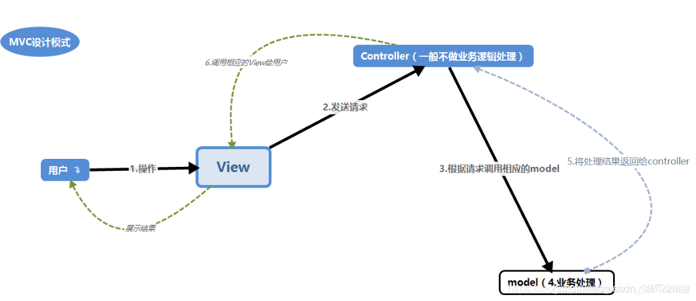
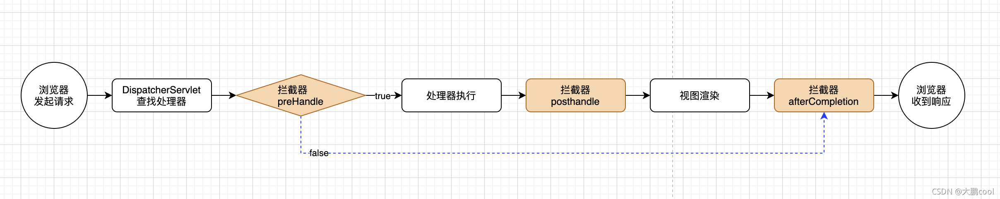
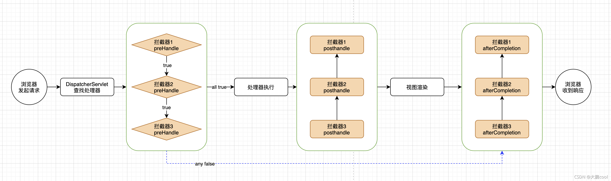
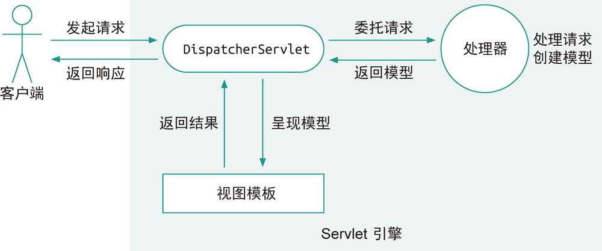
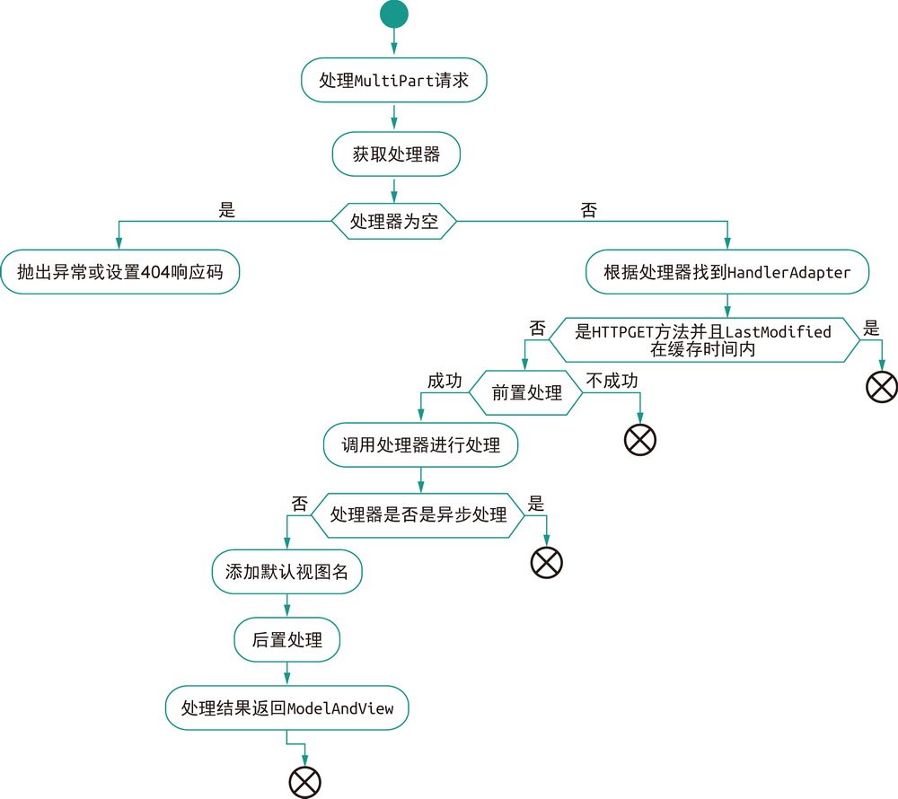

# Web

[TOC]

## 概述

Spring MVC 能帮助我们方便地开发符合 MVC 模式的 Web 应用，MVC 即 **Model-View-Controller**（模型——视图——控制器），是一种软件架构模式。MVC 的主要目标就是对用户界面与业务逻辑进行解耦，提升系统代码的可扩展性、可复用性和可维护性。

- **模型层**封装了业务逻辑，
- **视图层**则是暴露给用户的界面，
- **控制器层**则在两者之间充当黏合剂，很单薄



Spring MVC 的设计是围绕 `DispatcherServlet` 展开的，它是整个 Spring MVC 的核心，跟它配合的组件主要有下面这些：

- **控制器**，我们编写的各种 `Controller`；
- 各类**校验器**，例如，Spring MVC 内置了对 Hibernate Validator 的支持；
- 各类**解析器**，例如，视图解析器 `ViewResolver`、异常解析器 `HandlerExceptionResolver` 和 Multipart 解析器 `MultipartResolver`；
- **处理器映射**，`HandlerMapping` 定义了请求该如何找到对应的处理器，例如，根据 Bean 名称的 `BeanNameUrlHandlerMapping`，以及根据 `@RequestMapping` 注解的 `RequestMappingHandlerMapping`；
- **处理器适配器**，`DispatcherServlet` 在收到请求时，通过 `HandlerAdapter` 来调用所映射的处理器。


>什么是Servlet？
>
>早期的 Web 只是简单地提供静态资源。随着技术的发展，逐步出现了一些动态技术，即通过调用服务器上的一些程序动态地响应用户的请求。1993 年美国国家超级电脑应用中心（NCSA）提出了 CGI（Common Gateway Interface，通用网关接口）标准来规范化这种技术。
>
>为了规范 Java Web 程序，提升开发效率，Java EE（以前叫 J2EE）中诞生了 Java Servlet 技术。Servlet 规范定义了如何接收请求，如何返回响应，如何处理表单，如何处理异常，如何处理 Cookie，如何处理 Session……
>
>所有的 Servlet 都必须实现 `Servlet` 接口，其中有 5 个方法，分别是：
>
>- `init()`，初始化方法；
>- `getServletConfig()`，获得 Servlet 的配置，例如名称、初始化参数等；
>- `getServletInfo()`，获得 Servlet 的信息，例如作者、版本等；
>- `service()`，主要的执行方法；
>- `destroy()`，销毁方法。
>
>但在实际开发时，我们更多地会使用 `HttpServlet` 这个抽象类，去实现里面的 `doXxx()` 方法


## 配置Spring MVC

### 传统配置

首先介绍一下如何在没有 Spring Boot 的情况下配置 Spring MVC。

在传统的 Web 工程里，基本都会有一个 web.xml，我们可以把 `DispatcherServlet` 配置在这个文件里，例如：

~~~xml
<web-app>
    <!-- 配置应用上下文 -->
    <listener>
        <listener-class>org.springframework.web.context.ContextLoaderListener</listener-class>
    </listener>

    <context-param>
        <param-name>contextConfigLocation</param-name>
        <param-value>/WEB-INF/applicationContext.xml</param-value>
    </context-param>
    <!-- 配置Servlet -->
    <servlet>
        <servlet-name>dispatcher</servlet-name>
        <servlet-class>org.springframework.web.servlet.DispatcherServlet</servlet-class>
        <init-param>
            <param-name>contextConfigLocation</param-name>
            <param-value>classpath:dispatcher-servlet.xml</param-value>
        </init-param>
        <load-on-startup>1</load-on-startup>
    </servlet>

    <servlet-mapping>
        <servlet-name>dispatcher</servlet-name>
        <url-pattern>/</url-pattern>
    </servlet-mapping>

</web-app>
~~~

在 Servlet 3.0 以上的容器里，只要实现 `WebApplicationInitializer` 接口来注册并初始化 `DispatcherServlet`，容器会自动找到它。例如：

~~~java
public class WebInitializer implements WebApplicationInitializer {
    @Override
    public void onStartup(ServletContext container) {
        XmlWebApplicationContext appContext = new XmlWebApplicationContext();
        appContext.setConfigLocation("classpath:dispatcher-servlet.xml");

        ServletRegistration.Dynamic registration = container.addServlet("dispatcher",
            new DispatcherServlet(appContext));
        registration.setLoadOnStartup(1);
        registration.addMapping("/");
    }
}
~~~

在上面的代码中，我们还需要自己配置 Spring 的上下文，Spring MVC 提供了一个实现了 `WebApplicationInitializer` 的抽象类 `AbstractDispatcherServletInitializer`，通过它的子类 `AbstractAnnotationConfigDispatcherServletInitializer` 和 `AbstractDispatcherServletInitializer` 可以轻松地配置基于 Java 配置类的 `DispatcherServlet` 和基于 XML 文件的 `DispatcherServlet`。

在配置完 Servlet 后，就该配置 Spring MVC 了，同样有 XML 和 Java 类两种配置方式。在 XML文件 （在`web.xml`中配置的标签`<context-param>`）中，使用 `<mvc:annotation-driven/>` 来开启 Spring MVC，就像下面这样：

~~~xml
<?xml version="1.0" encoding="UTF-8"?>
<beans xmlns="http://www.springframework.org/schema/beans"
        xmlns:mvc="http://www.springframework.org/schema/mvc"
        xmlns:xsi="http://www.w3.org/2001/XMLSchema-instance"
        xsi:schemaLocation="http://www.springframework.org/schema/beans
                              https://www.springframework.org/schema/beans/spring-beans.xsd
                              http://www.springframework.org/schema/mvc
                              https://www.springframework.org/schema/mvc/spring-mvc.xsd">

     <!--开启自动包扫描-->
    <context:component-scan base-package="com.xxxx" annotation-config="true"/>
	<!--自动注册最合适的处理器映射器，处理器适配器(调用handler方法)-->
    <mvc:annotation-driven>
        <!--<mvc:message-converters>-->
        
    </mvc:annotation-driven>

</beans>
~~~

基于 Java 类的配置大概是下面这样的：

~~~java
@Configuration
@EnableWebMvc
// 还可以让配置类实现 WebMvcConfigurer 接口，实现更精准的配置
public class WebConfig implements WebMvcConfigurer {
    
    @Controller
    ...
}
~~~


### 基于SpringBoot的配置

Spring Boot 的 `DispatcherServletAutoConfiguration` 提供了针对 `DispatcherServlet` 的自动配置，而 `WebMvcAutoConfiguration` 则提供了 Spring MVC 的自动配置。

如果希望在保留自动配置的基础上再做一些 Spring MVC 的定制，可以添加一个实现了 `WebMvcConfigurer` 的配置类，但**一定不要加 `@EnableWebMvc` 注解**，因为这样会破坏 Spring Boot 对 Spring MVC 的自动配置。

如果希望定制 `RequestMappingHandlerMapping`、`RequestMappingHandlerAdapter` 和 `ExceptionHandlerExceptionResolver`，可以声明一个 `WebMvcRegistrations` 类型的 Bean。

在 Spring Boot 项目中，要注册 `Servlet`、`Filter` 或者 `Listener`，最简单的办法就是把它们配置为 Bean。如果需要做更多定制，就注册对应的 `ServletRegistrationBean`、`FilterRegistrationBean` 和 `ServletListenerRegistrationBean`。

## Controller

### 概述

**表 9-1　Spring MVC 中的常用注解**

| 注解              | 说明                                                         |
| :---------------- | :----------------------------------------------------------- |
| `@Controller`     | 定义控制器类，与 `@Service` 和 `@Repository` 类似            |
| `@RestController` | 定义 REST 服务的控制器类，这是个快捷方式注解，其实就是结合了 `@Controller` 和 `@ResponseBody` |
| `@RequestMapping` | 定义URL请求的处理方法，其中的 `path` 属性是正是 URL，`method` 是 `RequestMethod` 枚举中的 HTTP 方法，对于后者，还可以使用一些快捷注解，例如 `@GetMapping`、`@PostMapping`、`@PutMapping`、`@DeleteMapping` 和 `@PathMapping` |
| `@RequestBody`    |                                                              |
| `@ResponseBody`   | `@ResponseBody`注解主要作用是将Controller的方法返回的对象，通过适当的`HttpMessageConverter`转换为指定的格式后，写入到 HTTP 响应（response）体中。 |
| `@ResponseStatus` | 定义请求应答的 HTTP 响应码，具体的响应码可以用 `HttpStatus` 枚举 |


依赖如下：

~~~xml
<dependency>
    <groupId>org.springframework.boot</groupId>
    <artifactId>spring-boot-starter-web</artifactId>
</dependency>
~~~


下面给出一些例子

~~~java
// POST请求的body中的JSON数据会被转换为User对象。
@PostMapping("/user")
public User updateUser(@RequestBody User user) {
    // ...
    return user;
}
~~~


### 一个简单的控制器

~~~java
@Controller			// 表明是MVC控制器
@ResponseBody		// @ResponseBody 可以写在类上，也可以写在方法上，表示将方法的返回值作为响应的正文。
@RequestMapping("/menu")		// 类上的 @RequestMapping 注解设置了整个类里的公共属性，在这里是设置了 URL 映射的基础路径 /menu
public class MenuController {
    @Autowired
    private MenuService menuService;

    // @GetMapping 相当于 @RequestMapping(method = RequestMethod.GET)
    @GetMapping(params = "!name")
    public List<MenuItem> getAll() {
        return menuService.getAllMenu();
    }

    @GetMapping(path = "/{id}", produces = MediaType.APPLICATION_JSON_VALUE)
    public Optional<MenuItem> getById(@PathVariable Long id) {
        return menuService.getById(id);
    }

    @RequestMapping(params = "name", method = RequestMethod.GET)
    public List<MenuItem> getByName(@RequestParam String name) {
        return menuService.getByName(name);
    }
}
~~~


### @RequestMapping

在 Spring MVC 中，`@RequestMapping` 是一个非常重要的注解，下面列出它的属性：

| 属性       | 类型              | 说明                                                         |
| :--------- | :---------------- | :----------------------------------------------------------- |
| `name`     | `String`          | 为映射定义一个名称，当类上和方法上的注解里都定义了名称，会用 `#` 将它们连接起来 |
| `path`     | `String[]`        | 指定映射的 URL，也是本注解的默认属性，类上的 `path` 会作为方法上的 `path` 的前缀，如果路径中用了占位符 `{}`，可以用 `@PathVariable` 注解来取得对应占位符的值 |
| `method`   | `RequestMethod[]` | 用来缩小映射的范围，指定可以接受的 HTTP 方法，`RequestMethod` 定义了支持的 HTTP 方法 |
| `params`   | `String[]`        | 用来缩小映射的范围，当请求参数匹配规则时才做映射，可以用 `param1=value1`、`param2!=value2`、`param3` 和 `!param4` 分别表示参数等于某个值，参数不等于某个值，必须包含某个参数和不能包含某个参数 |
| `headers`  | `String[]`        | 当 HTTP 请求头匹配规则时才做映射，规则配置方式与 `params` 相同 |
| `consumes` | `String[]`        | 只能处理特定媒体类型的请求，也就是匹配请求头里的 `Content-Type`，可以用 `!` 表示否定 |
| `produces` | `String[]`        | 只能处理接受特定「返回媒体类型」的请求，本方法的结果会被限制在指定的媒体类型里 |


被@RequestMapping注解的方法称为请求处理方法，这些方法可以携带特定类型的参数，在被调用处理请求时，MVC框架会自动注入这些参数。

| 参数类型                              | 说明                                                         |
| ------------------------------------- | ------------------------------------------------------------ |
| `ServletRequest`、`ServletResponse`   | 获取当前对应的请求与响应，可以是这两个接口的子类型，例如 `HttpServletRequest`，对这些对象的操作是最灵活的，但如果没有特殊原因，不建议直接操作 `ServletRequest` 和 `ServletResponse` |
| `HttpEntity<T>` 与 `RequestEntity<T>` | 获取当前请求的 HTTP 头和请求体，请求体会被 `HttpMessageConverter` 转换成对应的泛型类型 |
| `HttpSession`                         | 获取当前的 Session 信息，注意这里对 `Session` 的操作不是线程安全的. |
| `HttpMethod`                          | 获得请求的 HTTP 方法，例如 `GET` 或 `POST`                   |
| `InputStream` 与 `Reader`             | 获得请求的原始消息体内容                                     |
| `OutputStream` 与 `Writer`            | 获得响应的输出流，以便能够直接输出内容                       |
| `Map`、`Model` 与 `ModelMap`          | 获得用于呈现视图时要使用的模型信息，这三个类型的本质都是 `Map` |
| `Errors` 与 `BindingResult`           | 获得绑定对象和校验时的错误信息                               |
| `Principal`                           | 获得当前认证的用户信息                                       |
| `SessionStatus`                       | 与 `@SessionAttributes` 搭配使用，这是一个加在控制器类上的注解，指定将模型中的哪个属性作为 Session 属性存储起来，`SessionStatus` 的 `setComplete()` 方法用来清除存储的内容 |

除了上述类型，还可以在参数上增加一些注解，获取特定的信息，常用的注解如表 9-7 所示。


**表 9-7　Spring MVC 请求处理方法的常用参数注解**

| 注解                | 说明                                                         |
| ------------------- | ------------------------------------------------------------ |
| `@PathVariable`     | 获得 `@RequestMapping` 的 `path` 里配置的占位符对应的值      |
| `@RequestParam`     | 获得请求的参数                                               |
| `@RequestHeader`    | 获得请求的 HTTP 头                                           |
| `@RequestBody`      | 获得请求的消息体                                             |
| `@RequestPart`      | 针对 Multipart 请求，获取其中指定的一段内容                  |
| `@CookieValue`      | 获得 Cookie 内容                                             |
| `@ModelAttribute`   | 获得模型中的属性，如果不存在则初始化一个，请求数据会绑定到对象上并做校验。 |
| `@SessionAttribute` | 获得 Session 中已有的属性                                    |
| `@RequestAttribute` | 获得请求中已有的属性                                         |

例子：

~~~java
@SpringBootApplication
@RestController
@RequestMapping(value="hello")
public class SimpleApplication {

    public static void main(String[] args) {
        SpringApplication.run(SimpleApplication.class, args);
    }

    @GetMapping(value="/{firstName}")
    public String helloGET(
        @PathVariable("firstName") String firstName,
        @RequestParam("lastName") String lastName) {
        return String.format("{\"message\":\"Hello %s %s\"}",firstName, lastName);
    }

    @PostMapping
    public String helloPOST( @RequestBody HelloRequest request) {
        return String.format("{\"message\":\"Hello %s %s\"}",request.getFirstName(), request.getLastName());
    }
}

~~~


**表 9-8　Spring MVC 请求处理方法的常见返回值类型**

| 返回值类型                             | 说明                                                         |
| -------------------------------------- | ------------------------------------------------------------ |
| `@ResponseBody`                        | 方法的返回值会直接序列化为响应的消息正文                     |
| `ModelAndView`                         | 返回最终呈现结果时会用到的模型与视图                         |
| `Map` 与 `Model`                       | 返回的数据会被加入模型中，用来最终呈现的视图由 `RequestToViewNameTranslator` 来决定 |
| `View`                                 | 返回视图对象，结合模型呈现最终内容                           |
| `String`                               | 返回一个视图名，`ViewResolver` 要从中解析出视图，再结合模型呈现最终内容 |
| `HttpEntity<T>` 与 `ResponseEntity<T>` | 返回的对象就是完整的响应报文，可以设置响应码、响应头部和正文 |
| `HttpHeaders`                          | 响应只有 HTTP 头，没有消息正文                               |


如果方法（不是`@ResponseBody`）的返回值类型是 `void`，那么下面几种情况意味着请求已经被处理（不会返回视图）：

- 设置了 `ServletResponse` 的 `OutputStream` 参数；
- 有 `@ResponseStatus` 注解设置了返回的 HTTP 响应码；
- 做过 HTTP 缓存处理，例如检查过 `E-TAG` 没变化。

其他情况下，返回与方法名同名的视图。


Session对应着用户的多次请求，Session 的信息是存储在服务器端的，用户的请求里带有名为 `JSESSIONID` 的 Cookie 值，通过这个值就能在服务器上找到对应的 Session 信息。

Session仅在本地服务器中保存，如果想要在有状态集群式服务器中共享，那么推荐放进集群Redis中。这就是分布式 Session。

**表 9-9　Web 应用程序上下文中所特有的作用范围**

| 范围          | 说明                                                         |
| :------------ | :----------------------------------------------------------- |
| `request`     | 仅存活在单次 HTTP 请求里                                     |
| `session`     | 仅存活在单个 Session 范围里，会话失效（也就是 Session 失效后），Bean 也就被销毁了 |
| `application` | 在整个 `ServletContext` 的生命周期里有效                     |
| `websocket`   | 在单个 `WebSocket` 的生命周期里有效                          |


### 消息转换

`@RequestBody` 和 `@RequestPart` 也会对请求的内容进行转换，将它们转换为各种不同的类型传到参数中，这里的转换其实就是由 `HttpMessageConverter` 来实现的。在 Spring MVC 中，框架为我们内置了大量的转换器，例如之前已经用到过的 Jackson JSON 的转换，其他默认的常用 `HttpMessageConverter` 如表 9-10 所示。

**表 9-10　Spring MVC 内置的常用`HttpMessageConverter` 列表**

| 类名                                      | 生效条件                     | 处理类型                             |
| :---------------------------------------- | :--------------------------- | ------------------------------------ |
| `ByteArrayHttpMessageConverter`           | 默认生效                     | 字节数组                             |
| `StringHttpMessageConverter`              | 默认生效                     | 文本                                 |
| `AllEncompassingFormHttpMessageConverter` | 默认生效                     | 按 CLASSPATH 加载支持的所有类型      |
| `AtomFeedHttpMessageConverter`            | 存在 ROME 依赖               | Atom Feed，即 `application/atom+xml` |
| `MappingJackson2XmlHttpMessageConverter`  | 存在 Jackson 的 XML 依赖     | XML                                  |
| `Jaxb2RootElementHttpMessageConverter`    | 存在 `javax.xml.bind.Binder` | XML                                  |
| `MappingJackson2HttpMessageConverter`     | 存在 Jackson 的 JSON 依赖    | JSON                                 |

我们可以实现 `WebMvcConfigurer` 接口，覆盖 `configureMessageConverters()` 方法来配置自己的 `HttpMessageConverter`。但在 Spring Boot 里，还有更简单的方法，有一个 `HttpMessageConvertersAutoConfiguration` 自动配置类，大致代码如下：

```java
@Configuration(proxyBeanMethods = false)
// ...
public class HttpMessageConvertersAutoConfiguration {

    @Bean
    @ConditionalOnMissingBean
    public HttpMessageConverters messageConverters(
        ObjectProvider<HttpMessageConverter<?>> converters) {
        
        return new HttpMessageConverters(
            converters.orderedStream().collect(Collectors.toList()));
    }
    // 省略其他代码
}
```

它从上下文里获取 `HttpMessageConverter` Bean对象，并设置到 `HttpMessageConverters` 对象中。

### 绑定与校验

当`handler`方法上的参数类型为`Date`，而从`request`中获取到的参数类型是字符串，`SpringMVC`在默认情况下无法实现字符串转`Date`。此时可以在由@`InitBinder`注解修饰的方法中为`WebDataBinder`对象注册`CustomDateEditor`，从而使得`WebDataBinder`能将从`request`中获取到的字符串再转换为`Date`对象。

~~~java
@Controller
public class FormController {
    @InitBinder
    protected void initBinder(WebDataBinder binder) {
        binder.addCustomFormatter(new DateFormatter("yyyy-MM-dd"));
    }
    // ...
}
~~~

这里的`DateFormatter`是`Formatter`接口的实现类：

~~~java
public interface Formatter<T> extends Printer<T>, Parser<T> {}
~~~

其中，`Printer<T>`是将`T`转变为`String`，而`Parser<T>`是将`String`转换为`T`


在 Spring Boot 中，我们无须去手动初始化 `WebDataBinder`。Spring Boot 的 MVC 自动配置会收集上下文中的 `Converter` 和 `Formatter`，自动完成注册。我们只需通过 将它们声明为 Bean 就可以了。


在将请求内容绑定到参数上之后，一般还会做一些内容的校验，Spring Framework 中就支持 Jakarta Bean Validation API，Hibernate Validator 就是它的一种实现。

**表 9-11　Jakarta Bean Validation API 中的一些常用注解**

| 注解                                                         | 说明                                       |
| :----------------------------------------------------------- | :----------------------------------------- |
| `@Null`、`@NotNull`、`@NotBlank`、`@NotEmpty`                | 各种 `null`、非 `null`、非空白、非空的判断 |
| `@Email`                                                     | 是否为电子邮件地址                         |
| `@Digits`                                                    | 是否是指定范围和类型的数字                 |
| `@Min`、`@Max`、`@DecimalMin`、`@DecimalMax`                 | 数字是否在给定最大、最小范围内             |
| `@Negative`、`@NegativeOrZero`、`@Positive`、`@PositiveOrZero` | 数字是负数、正数和零的相关判断             |
| `@Future`、`@FutureOrPresent`、`@Past`、`@PastOrPresent`     | 时间是过去、现在和将来的判断               |
| `@Size`                                                      | 集合类型、数组、字符串的长度判断           |
| `@Pattern`                                                   | 按正则表达式进行匹配                       |

在对象的属性上添加了上述注解后，还需要在控制器方法的对应参数上增加 `@Valid` 注解，声明这个参数需要进行绑定校验。紧随其后的参数必须是 `Errors` 或 `BindingResult` 类型的，以便我们能够获得校验的错误信息。

~~~java
@Getter
@Setter
public class NewMenuItemForm {
    @NotBlank
    private String name;
    @NotNull
    private Money price;
    @NotNull
    private Size size;
}
~~~

~~~java
@Controller
@ResponseBody
@RequestMapping("/menu")
@Slf4j
public class MenuController {
    @Autowired
    private MenuService menuService;

    @PostMapping(consumes = MediaType.APPLICATION_FORM_URLENCODED_VALUE)
    public Optional<MenuItem> createByForm(
        @Valid NewMenuItemForm form, 
        BindingResult result,              
        HttpServletResponse response) {
        
        if (result.hasErrors()) {
            log.warn("绑定参数错误：{}", result.getAllErrors());
            response.setStatus(HttpStatus.BAD_REQUEST.value());
            return Optional.empty();
        }
        
        MenuItem item = MenuItem.builder().name(form.getName())
                .price(form.getPrice()).size(form.getSize()).build();
        return menuService.save(item);
    }
    // 省略其他内容
}
~~~


### 文件上传

HTTP文件上传是通过 **multipart/form-data 协议**实现的，

~~~
Content-Type: multipart/form-data; boundary=xxxx
~~~

>HTML Form的HTTP Request内容
>
>```html
><form action="http://foo.com" method="get">
>    <label for="say">What greeting do you want to say?</label>
>    <input name="say" id="say" value="Hi" />
>    
>    <label for="to">Who do you want to say it to?</label>
>    <input name="to" id="to" value="Mom" />
></form>   
>```
>
>get方法的form对应着URL查询参数，例如
>
>~~~
>GET /?say=Hi&to=Mom HTTP/2.0
>Host: foo.com
>~~~
>
>而post方法的form却有所不同。它将表单数据追加到HTTP请求体中
>
>~~~
>POST / HTTP/2.0
>Host: foo.com
>Content-Type: application/x-www-form-urlencoded
>Content-Length: 13
>
>say=Hi&to=Mom
>~~~


~~~dart
@PostMapping(consumes = MediaType.MULTIPART_FORM_DATA_VALUE)
public ResponseEntity<List<MenuItem>> createBatch(
    @RequestParam("file") MultipartFile file) {
    // 参数类型可以是MultipartFile，这样可以处理多个文件的上传
    // 在定义方法时，我们可以通过 MultipartFile 这个参数类型来获得上传的文件，从中取得 InputStream 读取内容
    try (BufferedReader reader = new BufferedReader(new InputStreamReader(file.getInputStream()))) {
        
    }
    
}
~~~

MultipartFile 接口的相关方法如下：

- byte[] getBytes() ：以字节数组的形式返回文件内容。
- String getContentType() ：返回文件内容类型。
- InputStream getInputStream() ：返回一个InputStream，从中读取文件内容。
- String getName() ：返回请求参数的名称。
- String getOriginalFilename() ：返回上传文件的文件名。
- long getSize() ：返回文件的大小，单位为字节。
- boolean isEmpty() ：判断被上传文件是否为空。
- void transferTo(File destination) ：将上传文件保存到目标目录下。


### 文件下载

文件下载需要两个响应报头：

- `Content-Type：application/x-msdownload`
- `Content-Disposition`

~~~java
@RequestMapping(value = "download")
public void download(
    String fileName, 
    HttpServletRequest request, 
    HttpServletResponse response) throws IOException {
    // 获取下载的文件路径
    // 设置下载文件时的响应报头
    response.setHeader("Content-Type", "application/x-msdownload");
    response.setHeader("Content-Disposition", "attachment;filename=" + toUTF8String(fileName));

    // 获取文件输入流
    FileInputStream in = new FileInputStream(new File(realpath, fileName));

    // 获得响应对象的输出流，用于向客户端输出二进制数据
    ServletOutputStream out = response.getOutputStream();
}
~~~


## Jackson

Jackson提供了三种JSON的处理方式，分别是：

- 对象绑定

- JSON树模型

- 流式API

其中前两项功能都是基于ObjectMapper来实现的，而流式API功能则需要基于更底层的JsonGenerator和JsonParser来实现。

使用Maven构建项目，需要添加依赖：

~~~xml
<dependency>
  <groupId>com.fasterxml.jackson.core</groupId>
  <artifactId>jackson-core</artifactId>
  <version>2.9.6</version>
</dependency>

<dependency>
  <groupId>com.fasterxml.jackson.core</groupId>
  <artifactId>jackson-annotations</artifactId>
  <version>2.9.6</version>
</dependency>

<dependency>
  <groupId>com.fasterxml.jackson.core</groupId>
  <artifactId>jackson-databind</artifactId>
  <version>2.9.6</version>
</dependency>

~~~


### 对象绑定

- JSON字符串转换为Car类对象：

  ~~~java
  ObjectMapper mapper = new ObjectMapper();
  String carJson ="{ \"brand\" : \"Mercedes\", \"doors\" : 5 }";
  
  Car car = objectMapper.readValue(carJson, Car.class);
  ~~~

- JSON流转换为Java对象

  ~~~java
  ObjectMapper objectMapper = new ObjectMapper();
  
  String carJson = "{ \"brand\" : \"Mercedes\", \"doors\" : 4 }";
  Reader reader = new StringReader(carJson);
  
  Car car = objectMapper.readValue(reader, Car.class);
  
  ~~~

- JSON文件转换为Java对象

  ~~~java
  ObjectMapper objectMapper = new ObjectMapper();
  
  File file = new File("data/car.json");
  
  Car car = objectMapper.readValue(file, Car.class);
  ~~~

- JSON数组以及Map对象

  ~~~java
  ObjectMapper objectMapper = new ObjectMapper();
  
  String jsonArray = "[{\"brand\":\"ford\"}, {\"brand\":\"Fiat\"}]";
  List<Car> cars1 = objectMapper.readValue(
      jsonArray, 
      new TypeReference<List<Car>>(){});
  ~~~

  ~~~java
  String jsonObject = "{\"brand\":\"ford\", \"doors\":5}";
  
  ObjectMapper objectMapper = new ObjectMapper();
  Map<String, Object> jsonMap = objectMapper.readValue(
      jsonObject,
      new TypeReference<Map<String,Object>>(){});
  ~~~

- Java对象到JSON，可以使用以下方法之一进行操作：

  - writeValue()
  - writeValueAsString()
  - writeValueAsBytes()

  ~~~java
  ObjectMapper objectMapper = new ObjectMapper();
  Car car = new Car();
  objectMapper.writeValue(
        new FileOutputStream("data/output-2.json"), car);
  ~~~

  

默认情况下，Jackson通过将JSON字段的名称与Java对象中的getter和setter方法进行匹配


### datatype

spring jpa的底层默认使用的是hibernate。通过hibernate查询出来的实体对象实际上都是代理对象，在序列化的时候，我们可能会遇到懒加载导致jackson无法正确解析对象的问题，这个可以通过导入maven包

~~~java
<dependency>
    <groupId>com.fasterxml.jackson.datatype</groupId>
    <artifactId>jackson-datatype-hibernate5</artifactId>
</dependency>
~~~

然后加载进objectMapper上下文

~~~java
@Bean
public Jackson2ObjectMapperBuilderCustomizer builderCustomizer() {
    return builder -> {
        //jackson序列化 和 hibernate懒加载
        builder.modulesToInstall(hibernate5Module());
    };
}

private static Hibernate5Module hibernate5Module() {
    Hibernate5Module hibernate5Module = new Hibernate5Module();
    hibernate5Module.configure(REPLACE_PERSISTENT_COLLECTIONS, true);
    //hibernate5Module.configure(FORCE_LAZY_LOADING, true);
    return hibernate5Module;
}
~~~


或者注册一个Bean对象（推荐）：

~~~java
@SpringBootApplication
@EnableCaching
public class BinaryTeaApplication {

    public static void main(String[] args) {
        SpringApplication.run(BinaryTeaApplication.class, args);
    }

    @Bean
    public JodaMoneyModule jodaMoneyModule() {
        return new JodaMoneyModule();
    }

    @Bean
    public Hibernate5Module hibernate5Module() {
        return new Hibernate5Module();
    }
}
~~~


## 测试

### MockMvc

通过MockMvc，我们可以方便地构建各种HTTP请求：

~~~java
@SpringBootTest
class MenuControllerTest {
    private MockMvc mockMvc;

    @BeforeEach
    void setUp(WebApplicationContext wac) {
        this.mockMvc = MockMvcBuilders.webAppContextSetup(wac).alwaysExpect(status().isOk()).build();
    }

    @AfterEach
    void tearDown() {
        mockMvc = null;
    }
    // 省略其他部分
}
~~~

测试部分如下：

~~~java
@SpringBootTest
class MenuControllerTest {
    // 省略其他部分
    @Test
    void testGetAll() throws Exception {
        mockMvc.perform(get("/menu"))
            	// 设置查询参数
            	.param("name", "Java"))
             	// 判断响应头
            	.andExpect(content()
                           .contentType(MediaType.APPLICATION_JSON))
                // 判断处理方法
                .andExpect(handler().handlerType(MenuController.class))
                .andExpect(handler().methodName("getAll"))
                // 判断返回JSON内容
                .andExpect(jsonPath("$").isArray())
                .andExpect(jsonPath("$.length()").value(2))
                .andExpect(jsonPath("$..name")
                           .value(Matchers.hasItem("Java咖啡")));
    }
}
~~~

1. 首先通过 `MockMvcRequestBuilders.get()` 发起 `GET` 请求
2. `andExpect()` 用来设置期望的检查项，通过各种静态方法（`handler()`、`jsonPath()`等）获取请求体的信息。这些静态类包括
   - `MockMvcBuilders.*`
   - `MockMvcRequestBuilders.*`
   - `MockMvcResultMatchers.*`
   - `MockMvcResultHandlers.*`

**表 9-3　JsonPath 的常用操作符**

| 操作符                          | 说明                               |
| :------------------------------ | :--------------------------------- |
| `$`                             | JSON 的根元素                      |
| `@`                             | 正在处理的当前节点                 |
| `*`                             | 通配符                             |
| `..`                            | 深度扫描，可以扫描很多层以下的内容 |
| .< 名称 >                       | 特定名称的子节点                   |
| [ 数组下标 ]                    | 返回数组的特定位置的元素           |
| [ 起始数组下标 : 结束数组下标 ] | 从数组中切出一部分                 |


### MockwebServer

有时候，我们通过RestTemplate去调用业务部门的微服务。但是这些微服务的代码资产并不在本开发小组中，因此无法有效地展开单元测试。我们可以通过MockwebServer工具来解决这个问题。

使用`MockWebServer` 编写一个单元测试，大概分成下面几个步骤：

1. 引入 `com.squareup.okhttp3:mockwebserver` 依赖；

   ~~~xml
   <dependency>
       <groupId>com.squareup.okhttp3</groupId>
       <artifactId>mockwebserver</artifactId>
       <scope>test</scope>
   </dependency>
   ~~~

2. 在测试类中构造并启动 `MockWebServer`

   ~~~java
   class OrderRunnerTest {
       private static MockWebServer webServer;
   	private OrderRunner runner; 	// 被测试的对象
       @BeforeAll
       static void setUp() throws IOException {
           webServer = new MockWebServer();
           webServer.start();
       }
   
       @AfterAll
       static void tearDown() throws IOException {
           webServer.shutdown();
       }
       
       @BeforeEach
       void setUpBeforeEach() {
           runner = new OrderRunner();
           // 获取MockWebServer的接口
           runner.setBinarytea("http://localhost:" + webServer.getPort());
       }
       // 省略具体测试方法
   }
   ~~~

3. 构造模拟的响应；客户端发起 HTTP 调用，并验证应答以及请求。

   ~~~java
   class OrderRunnerTest {
       // 省略公共部分代码
       @Test
       void testCallForEntity() throws Exception {
           // 构造应答
           String body = "{\"id\":1, \"status\":\"ORDERED\"}";
           MockResponse response = new MockResponse().setResponseCode(HttpStatus.CREATED.value())
                   .addHeader(HttpHeaders.CONTENT_TYPE, MediaType.APPLICATION_JSON_VALUE).setBody(body);
           webServer.enqueue(response);
   
           // 发送请求
           ResponseEntity<String> entity = runner.callForEntity();
           
           // 验证响应
           assertEquals(HttpStatus.CREATED, entity.getStatusCode());
           assertEquals(MediaType.APPLICATION_JSON_VALUE,entity.getHeaders().getFirst(HttpHeaders.CONTENT_TYPE));
           assertEquals(body, entity.getBody());
   
           // 验证请求
           RecordedRequest request = webServer.takeRequest();
           assertEquals("/order", request.getPath());
   
           NewOrderForm form = objectMapper.readValue(request.getBody().readUtf8(),NewOrderForm.class);
           assertLinesMatch(Arrays.asList("1"), form.getItemIdList());
           assertEquals(90, form.getDiscount());
       }
   }
   ~~~

   

## 拦截器

拦截器 Interceptor 在 Spring MVC 中的定义：

~~~java
public interface HandlerInterceptor {
	default boolean preHandle(
        HttpServletRequest request, 
        HttpServletResponse response, 
        Object handler) throws Exception {
		return true;
	}

	default void postHandle(
        HttpServletRequest request, 
        HttpServletResponse response, 
        Object handler,	
        @Nullable ModelAndView modelAndView) throws Exception {
        
	}

	default void afterCompletion(
        HttpServletRequest request, 
        HttpServletResponse response, Object handler, 
        @Nullable Exception ex) throws Exception {
        
	}
}
~~~

三个方法具体的执行流程如下：

- `preHandle`：处理器执行之前执行，如果返回 false 将跳过处理器，并直接执行拦截器 afterCompletion 方法。
- `postHandle`：如果处理器抛出异常，将跳过该方法直接执行拦截器 afterCompletion 方法。
- `afterCompletion`：不管处理器是否抛出异常，该方法都将执行。



当多个拦截器同时工作时，它们的preHandle()方法会按照配置文件中拦截器的配置顺序执行，而它们的postHandle()方法和afterCompletion()方法则会按照配置顺序的反序执行。




通过Bean的方式来注册一个拦截器：

~~~java
public class LogInterceptor implements HandlerInterceptor {
    @Override
    public boolean preHandle(
        HttpServletRequest request, 
        HttpServletResponse response, 
        Object handler) throws Exception {
        System.out.println("请求来了");
        return true;
    }
}

@Configuration
public class MvcConfig {
    @Bean
    public MappedInterceptor loginInterceptor() {
        return new MappedInterceptor(new String[]{"/**"}, new String[]{"/login"}, new LoginInterceptor());
    }
}
~~~

或者通过InterceptorRegistry来注册：

~~~java
@Configuration
public class MvcConfig implements WebMvcConfigurer {
    
    @Override
    public void addInterceptors(InterceptorRegistry registry) {
        registry.addInterceptor(new LogInterceptor());
        registry.addInterceptor(new LoginInterceptor())
            .addPathPatterns("/**")
            .excludePathPatterns("/login");
    }
}
~~~


## 请求处理的逻辑

现代 Java Web 项目在处理 HTTP 请求时基本都遵循一样的规范，即 Java Servlet 规范（JSR 340）。

> JSR（Java Specification Requests），是指 Java 规范请求。这个请求（提案）是提给 JCP 的（Java Community Process），而JCP 是一家专门为 Java 技术开发标准技术规范的组织机构。

其处理流程都是 Servlet 容器（例如 Tomcat 或者 Jetty）收到一个请求，接着找到合适的 Servlet 进行处理，随后返回响应。

在 Spring MVC 中，这个处理请求的 Servlet 就是前面提到过的 `DispatcherServlet`。根据配置，Servlet 容器会将指定的请求都交由它来处理，在收到请求后，`DispatcherServlet` 会在 Spring 容器中找到合适的处理器（大部分情况下是控制器，即带有 `@Controller` 注解的类）来处理请求，处理结果经过视图模板后得到可以呈现（render）的响应内容，最后再返回给用户




`DispatcherServlet` 在收到请求后，会交由 `doService()` 方法来进行处理，其中包含了两个主要的步骤：

1. 在Request中设置一些与 Spring MVC 相关的属性，例如

   | 属性名**9**                         | 说明                                                         |
   | :---------------------------------- | :----------------------------------------------------------- |
   | `WEB_APPLICATION_CONTEXT_ATTRIBUTE` | `WebApplicationContext`，即 Web 的应用上下文                 |
   | `LOCALE_RESOLVER_ATTRIBUTE`         | 处理请求时可能会需要用到的 `LocaleResolver`，如果没有国际化需求，可以忽略它 |
   | ...                                 | ...                                                          |

2. 调用 `doDispatch()` ，将请求分派给具体的处理器。它的处理逻辑如下：

   

   `DispatcherServlet` 会尝试根据请求来找到合适的处理器，再通过 `HandlerAdapter` 来执行处理器的逻辑。

   而且需要特别说明的是，在后置处理中，会调用`HandlerMethodReturnValueHandler`对返回值进行处理。例如，
   
   -  `@ResponseBody` 的方法，返回值就直接被 `RequestResponseBodyMethodProcessor` 处理掉了。即选择合适的 `HttpMessageConverter` 将对象直接序列化为相应的内容；
   - 而未加`@ResponseBody`而且返回String类型的值，则是由 `ViewNameMethodReturnValueHandler` 来处理的。


## 视图机制

略

## 访问Web资源

### 静态资源和缓存

现在基本上中大型系统都采用了前后端分离的开发模式，前端所有的资源都会放在静态资源服务器上，而且用户对静态资源的访问都会先经过 CDN。但对一些小系统，可能还是会将静态资源放在 Servlet 容器里，性能虽然不好，但勉强够用就行。

Spring MVC 不仅能够处理动态请求，也为静态资源提供了一定的支持。在 Spring Boot 中，可以通过配置来调整静态资源的设置：

| 配置                                    | 默认值                                                       | 说明                                               |
| :-------------------------------------- | :----------------------------------------------------------- | :------------------------------------------------- |
| `spring.mvc.static-path-pattern`        | `/**`                                                        | 静态资源映射的路径                                 |
| `spring.web.resources.static-locations` | `[classpath:/META-INF/resources/, classpath:/resources/, classpath:/static/, classpath:/public/]` | 静态资源的存放位置                                 |
| `spring.web.resources.cache.period`     |                                                              | 静态资源的缓存时间，不指定单位的话，默认以秒为单位 |

如果没有在 Spring Boot 中，或者我们希望自己配置静态资源，那也可以使用 Spring MVC 原生的配置方式，例如，想把静态资源都映射到 /static/ 下，XML 的配置是这样的：

~~~xml
<mvc:resources mapping="/static/**"
    location="/static, classpath:/static/"
    cache-period="600" />
~~~


对应的 Java 配置，需要在 `WebMvcConfigurer` 的实现类里覆盖 `addResourceHandlers()` 方法，就像下面这样：

~~~java
@Configuration
@EnableWebMvc
public class WebConfig implements WebMvcConfigurer {
    @Override
    public void addResourceHandlers(ResourceHandlerRegistry registry)    {
        registry.addResourceHandler("/static/**")
                 .addResourceLocations("/static", "classpath:/static/")
                 .setCachePeriod(600);
    }
}
~~~


通常服务器会对静态资源进行缓存处理。如果命中缓存，服务器会直接返回不带正文的 `304 Not Modified` 应答，同时可以使用 `Cache-Control` 这个响应头来设置相关的缓存参数，RFC 7234 对这个响应头做了详细的规定。

> HTTP的缓存机制所涉及到的头字段包括`Cache-Control`, `Last-Modified`, `If-Modified-Since`, `Etag`, `If-None-Match` 等。
>
> - `Cache-Control` 响应头表示了资源是否可以被缓存，以及缓存的有效期。
>
> - `Etag`响应头标识了资源的版本，此后浏览器可据此进行缓存以及询问服务器。
>
> - `Last-Modified` 响应头标识了资源的修改时间，此后浏览器可据此进行缓存以及询问服务器。
>
> `Etag` 响应头字段表示资源的版本，浏览器在发送请求时会带 `If-None-Match` 头字段， 来询问服务器该版本是否仍然可用。如果服务器发现该版本仍然是最新的， 就可以返回 304 状态码指示 UA 继续使用缓存。
>
> 与 `Etag` 类似，`Last-Modified` HTTP 响应头也用来标识资源的有效性。 不同的是使用修改时间而不是实体标签。对应的请求头字段为`If-Modified-Since`
>
> 


Spring Boot 可以对静态资源缓存做更精细的控制，相关的配置就在 `WebProperties.Resources.Cache.Cachecontrol` 这个内部类里，对应的就是 `spring.web.resources.cache.cachecontrol.*` 的配置项

| 配置项                                                  | 说明                                                         |
| :------------------------------------------------------ | :----------------------------------------------------------- |
| `spring.web.resources.cache.cachecontrol.max-age`       | 最大的可缓存时间，例如 `3600s`，如果没有指定时间单位，默认为秒 |
| `spring.web.resources.cache.cachecontrol.no-store`      | 是否可缓存，取值为 `true` 和 `false`                         |
| `spring.web.resources.cache.cachecontrol.cache-public`  | 是否是公开缓存，所有地方都可进行缓存，取值为 `true` 和 `false` |
| `spring.web.resources.cache.cachecontrol.cache-private` | 是否是针对单个用户的私有缓存，共享缓存不可对其进行缓存，取值为 `true` 和 `false` |
| `spring.web.resources.cache.cachecontrol.no-transform`  | 缓存或其他中介不能对响应内容进行转换处理，取值为 `true` 和 `false` |

除了静态资源，也能对Spring MVC 控制器所返回的对象做缓存：

~~~java
@GetMapping
void cachedContent(ResposeEntity resposeEntity) {
    CacheControl cc = CacheControl.maxAge(2, TimeUnit.HOURS).cachePublic();
    // 设置Cache-Control 响应头部
    reposeEntity.ok().cacheControl(cc).body(...);
}
~~~


###  RestTemplate

当我们以Rest风格远程调用一个 HTTP 接口时，我们经常会用到 RestTemplate 这个类。Spring 官网对它的介绍如下：

- `RestTemplate`: The original Spring REST client with a synchronous, template method API.


**表 9-16　`RestTemplate` 的一些常用方法**

| 方法名              | 返回类型            | 对应 HTTP 方法 | 说明                                                         |
| :------------------ | :------------------ | :------------- | :----------------------------------------------------------- |
| `getForObject()`    | `T`                 | `GET`          | 获取内容并转换为指定类型                                     |
| `getForEntity()`    | `ResponseEntity<T>` | `GET`          | 获取内容并转换为指定类型，同时提供 HTTP 应答头等信息         |
| `postForObject()`   | `T`                 | `POST`         | 提交内容，将结果转换为指定类型                               |
| `postForEntity()`   | `ResponseEntity<T>` | `POST`         | 提交内容，将结果转换为指定类型，同时提供 HTTP 应答头等信息   |
| `postForLocation()` | `URI`               | `POST`         | 提交内容，无须获得返回，只要拿到结果中的地址信息即可         |
| `put()`             | `void`              | `PUT`          | 发送 `PUT` 请求，创建或更新内容，无返回值                    |
| `delete()`          | `void`              | `DELETE`       | 发送 `DELETE` 请求，删除内容，无返回值                       |
| exchange            |                     |                | 接收一个 `RequestEntity` 参数，可以自己设置 HTTP method，URL，headers 和 body，返回 ResponseEntity； |


`RestTemplateAutoConfiguration` 向容器注册了 `RestTemplateBuilder` Bean。`RestTemplateAutoConfiguration` 会将上下文中的 `RestTemplateCustomizer` 和 `RestTemplateRequestCustomizer` 收集起来，放到 `RestTemplateBuilder` 里。而我们可以直接通过这个 `RestTemplateBuilder` 的 `build()` 方法来构造自己的 `RestTemplate` Bean。

~~~java
@SpringBootApplication
public class CustomerApplication {
    @Bean
    public RestTemplate restTemplate(RestTemplateBuilder builder) {
        return builder
                .setConnectTimeout(Duration.ofSeconds(1)) 	// 连接超时
                .setReadTimeout(Duration.ofSeconds(5)) 		// 读取超时
                .build();
    }
}
~~~


使用示例：

~~~java
Map<String, String> vars = Collections.singletonMap("hotel", "42");
String result = restTemplate.getForObject(
    "https://example.com/hotels/{hotel}/rooms/{hotel}", 
    String.class, 
    vars);
~~~


~~~java
String url = "http://127.0.0.1:8080/hello";
JSONObject param = new JSONObject();
// restTemplate 会根据 params 的具体类型，调用合适的 HttpMessageConvert 将请求参数写到请求体 body 中，并在请求头中添加合适的 content-type；
ResponseEntity<JSONObject> responseEntity = restTemplate.postForEntity(
    url,
    params,
    JSONObject.class);
// 等待结果，是一个同步方法
~~~


~~~java
// 添加 Header 和 Cookie
RequestEntity<JSONObject> requestEntity = RequestEntity.post(uri).
                header(HttpHeaders.COOKIE, "key1=value1").
                header(("MyRequestHeader", "MyValue")
                accept(MediaType.APPLICATION_JSON).
                contentType(MediaType.APPLICATION_JSON).
                body(requestParam);
ResponseEntity<JSONObject> responseEntity = restTemplate.exchange(requestEntity, JSONObject.class);
~~~


~~~java
// 文件上传
public String uploadFile(String filePath) {
    String requestUrl = "";
    File file = new File(filePath);

    //设置请求头
    HttpHeaders headers = new HttpHeaders();
    //1.设置请求类型 上传文件必须用表单类型
    headers.setContentType(MediaType.MULTIPART_FORM_DATA);
    //2.设置内容长度，必须设置
    headers.setContentLength(file.length());
    //3.设置文件名称，处理文件名是中文的情况
    headers.setContentDispositionFormData("fileName", URLEncoder.encode(file.getName()));

    //4.设置请求体，注意是LinkedMultiValueMap
    MultiValueMap<String, Object> form = new LinkedMultiValueMap<>();
    //5.把文件填充到表单里，注意使用FileSystemResource
    form.add("uploadedFile", new FileSystemResource(file));
    HttpEntity requestEntity = new HttpEntity<>(form, headers);
    //6.发起请求
    ResponseEntity<String> responseEntity = restTemplate.postForEntity(requestUrl, requestEntity, String.class);
}
~~~


下面介绍如何更精细地配置`RestTemplate`

`RestTemplate` 在其父类 `HttpAccessor` 中默认设置了 `SimpleClientHttpRequestFactory` 作为请求工厂类。该工厂使用 Java 内置的 `HttpURLConnection` 来处理请求。但其实 `RestTemplate` 支持不少 HTTP 客户端（与浏览器一样，可以处理SSL、Cookie等Web特性）：

| 客户端                | 版本                                            | `ClientHttpRequestFactory` 实现类                            |
| :-------------------- | :---------------------------------------------- | :----------------------------------------------------------- |
| Apache HttpComponents | 从 Spring Framework 4.0 开始仅支持 4.3 以上版本 | `HttpComponentsClientHttpRequestFactory`                     |
| OkHttp                | 3.*x* 版本                                      | `OkHttp3ClientHttpRequestFactory`                            |
| Netty                 | 4.*x* 版本                                      | `ReactorClientHttpConnector`，在 Spring Framework 5.0 前是 `Netty4ClientHttpRequestFactory` |

下面给出使用HttpComponents 作为底层 HTTP 客户端的例子：

~~~java
@SpringBootApplication
public class CustomerApplication {
    // 省略其他代码
    @Bean
    public RestTemplate restTemplate(RestTemplateBuilder builder) {
        return builder
                .requestFactory(this::requestFactory)		// 设置HTTP客户端
                .setConnectTimeout(Duration.ofSeconds(1)) 	// 连接超时
                .setReadTimeout(Duration.ofSeconds(5)) 		// 读取超时
                .build();
    }

    @Bean
    public ClientHttpRequestFactory requestFactory() {
        HttpClientBuilder builder = HttpClientBuilder.create()
        .disableAutomaticRetries() // 默认重试是开启的，建议关闭
        .evictIdleConnections(10, TimeUnit.MINUTES) // 空闲连接10分钟关闭
        .setConnectionTimeToLive(30, TimeUnit.SECONDS) // 连接的TTLS时间
        .setMaxConnTotal(200) // 连接池大小
        .setMaxConnPerRoute(20); // 每个主机的最大连接数
        return new HttpComponentsClientHttpRequestFactory(builder.build());
    }
}
~~~


**`Keep-Alive`** 是一个通用消息头，说明连接的状态，还可以用来设置超时时长（主动断开）和最大请求数。

~~~http
Keep-Alive: timeout=5, max=1000
~~~

通过 `HttpClientBuilder` 构造的 `HttpClient` 默认会使用 `DefaultConnectionKeepAliveStrategy` 这个 Keep-Alive 策略，该策略比较简单：

- 查看HTTP头部是否设置了Keep-Alive，若未设置，那么将其设置为-1，即永久连接

连接永久有效往往不是我们想要的结果，通常都会给一个默认时间，比如 300 秒。可以像下面这样通过 Lambda 表达式来实现一个 `ConnectionKeepAliveStrategy`，传给 `HttpClientBuilder`：

~~~java
builder.setKeepAliveStrategy((response, context) ->
        Arrays.asList(response.getHeaders(HTTP.CONN_KEEP_ALIVE))
                .stream()
                .filter(h -> StringUtils.equalsIgnoreCase(h.getName(), "timeout")
                	&& StringUtils.isNumeric(h.getValue()))
                .findFirst()
                .map(h -> NumberUtils.toLong(h.getValue(), 300L))
                .orElse(300L) * 1000);

// StringUtils 和 NumberUtils 都是 Apache Common Langs3 中的辅助类。
~~~


往往在很多企业内部会选择自己签发证书，这时 Java 无法验证证书的有效性，出于安全考虑就会让请求失败。这时有以下方案可以选择：

1. 将自签证书的根证书导入 Java 的证书链里

2. 调整 `HttpClient` 的设置，忽略证书校验相关的错误

   ~~~java
   // 不校验证书和主机名的 HttpClientBuilder 代码片段
   SSLContext sslContext = null;
   try {
       sslContext = SSLContextBuilder.create()
       // 放过所有证书校验
       .loadTrustMaterial(null, (certificate, authType) -> true).build();
   } catch (GeneralSecurityException e) {
       log.error("Can NOT create SSLContext", e);
   }
   if (sslContext != null) {
       builder.setSSLContext(sslContext) // 设置SSLContext
               .setSSLHostnameVerifier(NoopHostnameVerifier.INSTANCE); // 不校验主机名
   }
   ~~~

   如果是希望加载一个证书用于校验，可以在使用 `loadTrustMaterial()` 时，传入对应的证书与密码。

## 项目分层

**POJO（Plain Old Java Object）**对象一般作为数据的载体，不涉及数据处理的逻辑，它要满足

- 没有继承任何类、也没有实现任何接口
- 属性都是私有的，并且为每一个属性提供`getter`、`setter`方法

实际上VO/PO/BO，都是属于POJO对象


分层领域模型规约：

- **PO（Persistent Object）**：持久化层对象。它满足
  - 属性与数据库表的字段是一一对应的
  - 实现序列化接口
- **DAO（Data Access Object）**：数据访问对象。负责持久层的业务逻辑的实现，一般与PO对象建立依赖关系。
- **DTO（Data Transfer Object）**：数据传输对象
- **VO（View Object）**：视图层对象
- **BO（Business Object）**：业务对象
- **Entity**：`Service`层与`DAO`层之间传输的对象


在前后端分离的设计中，后端负责暴露接口给前端调用。也就是将MVC中的View层分离到前端去，原本的`Model`层细分为`Service`层以及`Repository`层。这种情况下，我们一般就将后端项目分为：

- `Repository`层：负责数据访问

- `Service`层：负责业务逻辑

- `Controller`层：负责暴露接口


## 贫血模型 vs 充血模型

一个典型基于贫血模型的代码结构如下：

~~~java
////////// Controller + VO(View Object) //////////
public class UserController {
  private UserService userService; //通过构造函数或者IOC框架注入一个Service层对象
  
  public UserVo getUserById(Long userId) {
    UserBo userBo = userService.getUserById(userId);
    UserVo userVo = [...convert userBo to userVo...];
    //向前端返回数据
    return userVo;
  }
}

public class UserVo {
  private Long id;
  private String name;
  private String cellphone;
}

////////// Service + BO(Business Object) //////////
public class UserService {
  private UserRepository userRepository; //通过构造函数或者IOC框架注入一个Repository层对象
  
  public UserBo getUserById(Long userId) {
    UserEntity userEntity = userRepository.getUserById(userId);
    UserBo userBo = [...convert userEntity to userBo...];
    return userBo;
  }
}

public class UserBo {//省略其他属性、get/set/construct方法
  private Long id;
  private String name;
  private String cellphone;
}

////////// Repository + Entity //////////
public class UserRepository {
  public UserEntity getUserById(Long userId) { //... }
}

public class UserEntity {//省略其他属性、get/set/construct方法
  private Long id;
  private String name;
  private String cellphone;
}
~~~

像UserBo、UserEntity、UserVo这样，只包含数据，不包含业务逻辑的类（POJO类），就叫作**贫血模型（Anemic Domain Model）**。这种贫血模型将数据与操作分离，破坏了面向对象的封装特性，是一种典型的面向过程的编程风格。

基于贫血模型的MVC三层架构开发模式已经成为标准的Web项目的开发模式。一般我们开发的系统业务都比较简单，就是基于SQL的CRUD操作，贫血模型就足够应付。充血模型在设计上要比贫血模型更加有难度，因为充血模型是一种面向对象的编程风格，即我们从一开始就要设计好针对数据要暴露哪些操作，定义哪些业务逻辑。而贫血模型不需要事先做太多设计，只需定义数据对象，之后有新的开发需求，就直接在Service层实现业务逻辑。在**领域驱动设计（Domain Driven Design，简称DDD）**盛行之后，面向对象编程风格的充血模型正好切合了DDD的设计需求，被人们越来越提倡。

> 领域驱动设计，即DDD，主要是用来指导如何解耦业务系统，划分业务模块，定义业务领域模型及其交互。做好领域驱动设计的关键是，看你对自己所做业务的熟悉程度，而并不是对领域驱动设计这个概念本身的掌握程度。不过，DDD也并非银弹。对于业务不复杂的系统开发来说，基于贫血模型的传统开发模式简单够用。
>
> 微服务除了监控、调用链追踪、API网关等服务治理系统的开发之外，还有针对公司的业务，合理地做微服务拆分。而领域驱动设计恰好就是用来指导如何划分服务的。所以，微服务加速了领域驱动设计的盛行。


在贫血模型中，数据和业务逻辑被分割到不同的类中。**充血模型（Rich Domain Model）**正好相反，数据和对应的业务逻辑被封装到同一个类中。因此，这种充血模型满足面向对象的封装特性，是典型的面向对象编程风格。

实际上，基于充血模型的DDD开发模式实现的代码，也是按照MVC三层架构分层的，它跟基于贫血模型的传统开发模式的区别主要在Service层。其中，它的Service层包含Service类和Domain类两部分，其中将Service层中的业务逻辑转移到Domain类中的来实现。Service层主要负责：

- Service类负责与Repository交流，避免Domain类与Repository层过度耦合，即将流程性的代码逻辑（比如从DB中取数据、映射数据）与领域模型的业务逻辑解耦，让领域模型更加可复用。

- Service类负责跨领域模型的业务聚合功能。
- Service类负责一些非功能性及与三方系统交互的工作。比如幂等、事务、发邮件、发消息、记录日志、调用其他系统的RPC接口等，都可以放到Service类中。


为什么不将Controller层和Repository层进行充血领域建模呢？

- Controller层与Repository层的业务逻辑简单，直接对其贫血建模即可。即使违反面向对象设计原则——数据与操作分离，也无关紧要。因为对象在其整个生命周期中是不可变的，即没有被修改的 。

  

在代码层面上，就是一个将业务逻辑放到Service类中，一个将业务逻辑放到Domain领域模型中，这体现不出充血模型的优势。但是在开发流程上，两者的区别就体现出来了。我们平时的开发，大部分都是**SQL驱动（SQL-Driven）**的开发模式，业务逻辑基本上包裹在一个大的SQL语句中。当需求变化后，只能重新写个满足新需求的SQL语句，复用性很差！

如果我们在项目中，应用基于充血模型的DDD的开发模式，我们就需要事先理清楚所有的业务，定义领域模型所包含的属性和方法，这样领域模型充当可复用的业务中间层。所以，基于充血模型的DDD开发模式，更适合开发对代码的复用性、易维护性要求更高的复杂业务系统。例如，包含各种利息计算模型、还款模型等复杂业务的金融系统。


## 国际化

首先注册bean对象

~~~java
    @Bean
    public LocaleResolver localeResolver() {
        SessionLocaleResolver localeResolver = new SessionLocaleResolver();
        localeResolver.setDefaultLocale(Locale.US);
        return localeResolver;
    }

    @Bean
    public ResourceBundleMessageSource messageSource() {
        ResourceBundleMessageSource messageSource = new ResourceBundleMessageSource();

        // Doesn’t throw an error if a message isn’t found, instead it returns the message code
        messageSource.setUseCodeAsDefaultMessage(true);

        //  sets messages as the base name of the message source file
        messageSource.setBasename("messages");

        // For example, if we were in Italy, we would use the
        // Locale.IT, and we would have a file called messages_it.properties. In case we don’t
        // find a message in a specific language, the message source will search on the default
        // message file called messages.properties.
        return  messageSource;
    }
~~~

