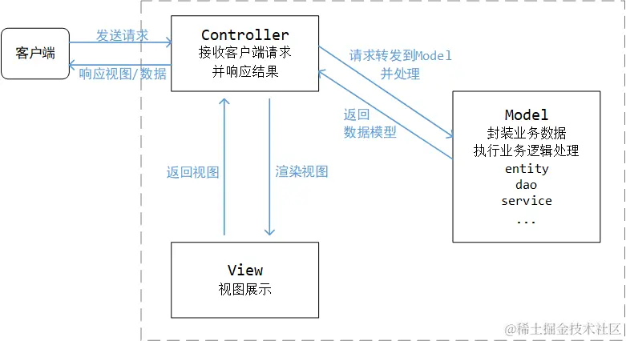
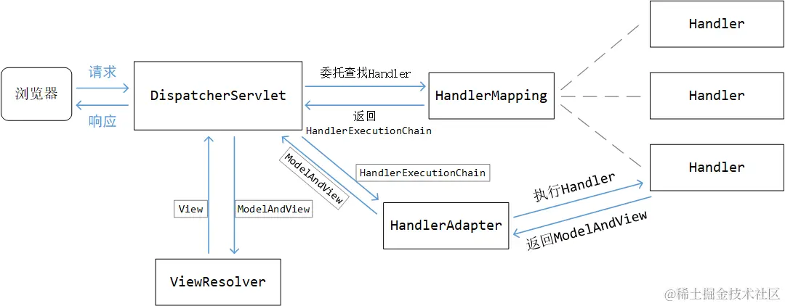

# Web

[TOC]

## 概述

Spring MVC 能帮助我们方便地开发符合 MVC 模式的 Web 应用，MVC 即 **Model-View-Controller**（模型——视图——控制器），是一种软件架构模式。MVC 的主要目标就是对用户界面与业务逻辑进行解耦，提升系统代码的可扩展性、可复用性和可维护性。

- **模型层**封装了业务逻辑，
- **视图层**则是暴露给用户的界面，
- **控制器层**则在两者之间充当黏合剂，很单薄




在前后端分离的设计中，后端负责暴露接口给前端调用。也就是将MVC中的View层分离到前端去，原本的`Model`层细分为`Service`层以及`Repository`层。这种情况下，我们一般就将后端项目分为：

- `Repository`层：负责数据访问

- `Service`层：负责业务逻辑

- `Controller`层：负责暴露接口


Spring MVC 的设计是围绕 `DispatcherServlet` 展开的，它是整个 Spring MVC 的核心，跟它配合的组件主要有下面这些：

- **控制器**，我们编写的各种 `Controller`；
- 各类**校验器**，例如，Spring MVC 内置了对 Hibernate Validator 的支持；
- 各类**解析器**，例如，视图解析器 `ViewResolver`、异常解析器 `HandlerExceptionResolver` 和 Multipart 解析器 `MultipartResolver`；
- **处理器映射**，`HandlerMapping` 定义了请求该如何找到对应的处理器，例如，根据 Bean 名称的 `BeanNameUrlHandlerMapping`，以及根据 `@RequestMapping` 注解的 `RequestMappingHandlerMapping`；
- **处理器适配器**，`DispatcherServlet` 在收到请求时，通过 `HandlerAdapter` 来调用所映射的处理器。

>什么是Servlet？
>
>早期的 Web 只是简单地提供静态资源。随着技术的发展，逐步出现了一些动态技术，即通过调用服务器上的一些程序动态地响应用户的请求。1993 年美国国家超级电脑应用中心（NCSA）提出了 CGI（Common Gateway Interface，通用网关接口）标准来规范化这种技术。
>
>为了规范 Java Web 程序，提升开发效率，Java EE（以前叫 J2EE）中诞生了 Java Servlet 技术。Servlet 规范定义了如何接收请求，如何返回响应，如何处理表单，如何处理异常，如何处理 Cookie，如何处理 Session……
>
>所有的 Servlet 都必须实现 `Servlet` 接口，其中有 5 个方法，分别是：
>
>- `init()`，初始化方法；
>- `getServletConfig()`，获得 Servlet 的配置，例如名称、初始化参数等；
>- `getServletInfo()`，获得 Servlet 的信息，例如作者、版本等；
>- `service()`，主要的执行方法；
>- `destroy()`，销毁方法。
>
>但在实际开发时，我们更多地会使用 `HttpServlet` 这个抽象类，去实现里面的 `doXxx()` 方法


## Controller

### 概述

**表 9-1　Spring MVC 中的常用注解**

| 注解              | 说明                                                         |
| :---------------- | :----------------------------------------------------------- |
| `@Controller`     | 定义控制器类，与 `@Service` 和 `@Repository` 类似            |
| `@RestController` | 定义 REST 服务的控制器类，这是个快捷方式注解，其实就是结合了 `@Controller` 和 `@ResponseBody` |
| `@RequestMapping` | 定义URL请求的处理方法，其中的 `path` 属性是正是 URL，`method` 是 `RequestMethod` 枚举中的 HTTP 方法，对于后者，还可以使用一些快捷注解，例如 `@GetMapping`、`@PostMapping`、`@PutMapping`、`@DeleteMapping` 和 `@PathMapping` |
| `@RequestBody`    |                                                              |
| `@ResponseBody`   | `@ResponseBody`注解主要作用是将Controller的方法返回的对象，通过适当的`HttpMessageConverter`转换为指定的格式后，写入到 HTTP 响应（response）体中。 |
| `@ResponseStatus` | 定义请求应答的 HTTP 响应码，具体的响应码可以用 `HttpStatus` 枚举 |


依赖如下：

~~~xml
<dependency>
    <groupId>org.springframework.boot</groupId>
    <artifactId>spring-boot-starter-web</artifactId>
</dependency>
~~~


### 简单的示例

~~~java
// 表明是MVC控制器
@Controller			
// @ResponseBody 可以写在类上，也可以写在方法上，表示将方法的返回值作为响应的正文。
@ResponseBody		
// 类上的 @RequestMapping 注解设置了整个类里的公共属性，在这里是设置了 URL 映射的基础路径 /menu
@RequestMapping("/menu")		
public class MenuController {
    @Autowired
    private MenuService menuService;

    // @GetMapping 相当于 @RequestMapping(method = RequestMethod.GET)
    @GetMapping(params = "!name")
    public List<MenuItem> getAll() {
        return menuService.getAllMenu();
    }

    @GetMapping(path = "/{id}", produces = MediaType.APPLICATION_JSON_VALUE)
    public Optional<MenuItem> getById(@PathVariable Long id) {
        return menuService.getById(id);
    }

    @RequestMapping(params = "name", method = RequestMethod.GET)
    public List<MenuItem> getByName(@RequestParam String name) {
        return menuService.getByName(name);
    }
}
~~~


### @RequestMapping

被@RequestMapping注解的方法称为**「请求处理方法」**

| 属性       | 类型              | 说明                                                         |
| :--------- | :---------------- | :----------------------------------------------------------- |
| `name`     | `String`          | 为映射定义一个名称。当类上和方法上的@RequestMapping注解里都定义了名称，会用 `#` 将它们连接起来 |
| `path`     | `String[]`        | 指定映射的 URL，也是本注解的默认属性，类上的 `path` 会作为方法上的 `path` 的前缀，如果路径中用了占位符 `{}`，可以用 `@PathVariable` 注解来取得对应占位符的值 |
| `method`   | `RequestMethod[]` | 用来缩小映射的范围，指定可以接受的 HTTP 方法，`RequestMethod` 定义了支持的 HTTP 方法 |
| `params`   | `String[]`        | 用来缩小映射的范围，当请求参数匹配规则时才做映射，可以用 `param1=value1`、`param2!=value2`、`param3` 和 `!param4` 分别表示参数等于某个值，参数不等于某个值，必须包含某个参数和不能包含某个参数 |
| `headers`  | `String[]`        | 当 HTTP 请求头匹配规则时才做映射，规则配置方式与 `params` 相同 |
| `consumes` | `String[]`        | 只能处理特定媒体类型的请求，也就是匹配请求头里的 `Content-Type`，可以用 `!` 表示否定 |
| `produces` | `String[]`        | 只能处理接受特定「返回媒体类型」的请求，本方法的结果会被限制在指定的媒体类型里 |

Spring默认将每个`@Controller`注释的类作为单例（Singleton）进行管理。`@Scope`注解可以用来指定Spring bean的生命周期范围：

1. singleton（默认）：对每个Spring IoC容器只存在一个Bean实例。
2. prototype：每次请求创建一个新的Bean实例。
3. request：每次Http请求都会创建一个新的Bean，这只在web应用中有效。
4. session：同一个Http Session内共享一个Bean，不同的Http Session使用不同的Bean。

~~~java
@Controller
@Scope("request")
public class FileHandlerController {
    
}
~~~


### 参数

这些方法可以携带特定类型的参数，在被调用处理请求时，MVC框架会自动注入这些参数。

| 参数类型                              | 说明                                                         |
| ------------------------------------- | ------------------------------------------------------------ |
| `ServletRequest`、`ServletResponse`   | 获取当前对应的请求与响应，可以是这两个接口的子类型，例如 `HttpServletRequest`，对这些对象的操作是最灵活的，但如果没有特殊原因，不建议直接操作 `ServletRequest` 和 `ServletResponse` |
| `HttpEntity<T>` 与 `RequestEntity<T>` | 获取当前请求的 HTTP 头和请求体，请求体会被 `HttpMessageConverter` 转换成对应的泛型类型 |
| `HttpSession`                         | 获取当前的 Session 信息，注意这里对 `Session` 的操作不是线程安全的. |
| `HttpMethod`                          | 获得请求的 HTTP 方法，例如 `GET` 或 `POST`                   |
| `InputStream` 与 `Reader`             | 获得请求的原始消息体内容                                     |
| `OutputStream` 与 `Writer`            | 获得响应的输出流，以便能够直接输出内容                       |
| `Map`、`Model` 与 `ModelMap`          | 获得用于呈现视图时要使用的模型信息，这三个类型的本质都是 `Map` |
| `Errors` 与 `BindingResult`           | 获得绑定对象和校验时的错误信息                               |
| `Principal`                           | 获得当前认证的用户信息                                       |
| `SessionStatus`                       | 与 `@SessionAttributes` 搭配使用，这是一个加在控制器类上的注解，指定将模型中的哪个属性作为 Session 属性存储起来，`SessionStatus` 的 `setComplete()` 方法用来清除存储的内容 |

除了上述类型，还可以在参数上增加一些注解，获取特定的信息，常用的注解如表 9-7 所示。

**表 9-7　Spring MVC 请求处理方法的常用参数注解**

| 注解                | 说明                                                    |
| ------------------- | ------------------------------------------------------- |
| `@PathVariable`     | 获得 `@RequestMapping` 的 `path` 里配置的占位符对应的值 |
| `@RequestParam`     | 获得请求的参数。                                        |
| `@RequestHeader`    | 获得请求的 HTTP 头                                      |
| `@RequestBody`      | 获得请求的消息体                                        |
| `@RequestPart`      | 针对 Multipart 请求，获取其中指定的一段内容             |
| `@CookieValue`      | 获得 Cookie 内容                                        |
| `@ModelAttribute`   | 获得模型中的属性，如果不存在则初始化一个。              |
| `@SessionAttribute` | 获得 Session 中已有的属性                               |
| `@RequestAttribute` | 获得请求中已有的属性                                    |

简单的例子：

~~~java
@SpringBootApplication
@RestController
@RequestMapping(value="hello")
public class SimpleApplication {

    public static void main(String[] args) {
        SpringApplication.run(SimpleApplication.class, args);
    }

    @GetMapping(value="/{firstName}")
    public String helloGET(
        @PathVariable("firstName") String firstName,
        @RequestParam("lastName") String lastName) {
        return String.format("{\"message\":\"Hello %s %s\"}",firstName, lastName);
    }

    @PostMapping
    public String helloPOST( @RequestBody Hello hello) {
        return String.format("{\"message\":\"Hello %s %s\"}",request.getFirstName(), request.getLastName());
    }
}

~~~


在`@RequestMapping`方法中，Spring会将简单类型和某些特殊类型默认处理为`@RequestParam`。然而，对于POJO类型，Spring会尝试将请求参数注入到到这些对象。如果一个请求参数被`@RequestParam`显式指定了，那么该参数不会自动注入到POJO对象中。


在`@Requestmapping`方法中，简单类型和某些特殊类型会默认标记为`@RequestParam`，而POJO类型会默认标记为@RequestBody

`@RequestParam`注解：

- `value`：获取由`value`指定的参数，解决请求中的参数名和方法中的参数名不一致的情况
- `required`：它表示请求参数中是否必须携带指定的参数，默认值为`true`，此时如果并未携带，那么返回400错误码。
- `defaultValue`：当未携带此参数时（`required = false`），返回一个默认值


`@RequestPart`注解：

- `name`/`value`: 这两个属性意义相同，用于指定请求 part 的名字
- `required`: 这个属性是一个布尔值，用于确定是否这个请求 part 是必需的。如果设为 true（也是默认值），而 part 缺失，那么Spring 会抛出一个异常。如果设为 false，相应的方法参数会被设为 null。

使用示例：

~~~http
POST /upload HTTP/1.1
Host: www.example.com
Content-Type: multipart/form-data; boundary=abc123

--abc123
Content-Disposition: form-data; name="username"

John Doe
--abc123
Content-Disposition: form-data; name="email"

john.doe@example.com
--abc123
Content-Disposition: form-data; name="profile_picture"; filename="profile.jpg"
Content-Type: image/jpeg

(BINARY DATA)
--abc123--
~~~

~~~java
@PostMapping("/fileupload")
public String handleFileUpload(@RequestPart("file") MultipartFile file) {
    // 获取文件名
    String name = file.getOriginalFilename();

    // 获取文件内容，注意处理可能抛出的异常
    try {
        byte[] bytes = file.getBytes();
    }
}
~~~


### 返回值

**表 9-8　Spring MVC 请求处理方法的常见返回值类型**

| 返回值类型                             | 说明                                                         |
| -------------------------------------- | ------------------------------------------------------------ |
| `@ResponseBody`                        | 方法的返回值会直接序列化为响应的消息正文                     |
| `ModelAndView`                         | 返回最终呈现结果时会用到的模型与视图                         |
| `Map` 与 `Model`                       | 返回的数据会被加入模型中，用来最终呈现的视图由 `RequestToViewNameTranslator` 来决定 |
| `View`                                 | 返回视图对象，结合模型呈现最终内容                           |
| `String`                               | 返回一个视图名，`ViewResolver` 要从中解析出视图，再结合模型呈现最终内容 |
| `HttpEntity<T>` 与 `ResponseEntity<T>` | 返回的对象就是完整的响应报文，可以设置响应码、响应头部和正文 |
| `HttpHeaders`                          | 响应只有 HTTP 头，没有消息正文                               |

如果方法（不被`@RequestBody`标注）的返回值类型是 `void`，Spring MVC 会默认去找与请求处理方法名同名的视图，但是下面几种情况意味着请求已经被处理（不会返回视图）

- 设置了 `ServletResponse` 的 `OutputStream` 参数；
- 有 `@ResponseStatus` 注解设置了返回的 HTTP 响应码；
- 做过 HTTP 缓存处理，例如检查过 `E-TAG` 没变化。

如果被`@RequestBody`标注的方法返回类型为`void`，那么消息正文就为空。

### 消息转换

`Formatter`作用于路径中的参数转换，而`HttpMessageConverter`作用于HTTP消息正文

#### HttpMessageConverter

`@RequestBody` 和 `@RequestPart` 也会对请求正文进行转换，将它们转换为各种不同的类型传到参数中，这里的转换其实就是由 `HttpMessageConverter` 来实现的。在 Spring MVC 中，框架为我们内置了大量的转换器，例如之前已经用到过的 Jackson JSON 的转换。

**表 9-10　Spring MVC 内置的常用`HttpMessageConverter` 列表**

| 类名                                      | 生效条件                     | 处理类型                             |
| :---------------------------------------- | :--------------------------- | ------------------------------------ |
| `ByteArrayHttpMessageConverter`           | 默认生效                     | 字节数组                             |
| `StringHttpMessageConverter`              | 默认生效                     | 文本                                 |
| `AllEncompassingFormHttpMessageConverter` | 默认生效                     | 按 CLASSPATH 加载支持的所有类型      |
| `AtomFeedHttpMessageConverter`            | 存在 ROME 依赖               | Atom Feed，即 `application/atom+xml` |
| `MappingJackson2XmlHttpMessageConverter`  | 存在 Jackson 的 XML 依赖     | XML                                  |
| `Jaxb2RootElementHttpMessageConverter`    | 存在 `javax.xml.bind.Binder` | XML                                  |
| `MappingJackson2HttpMessageConverter`     | 存在 Jackson 的 JSON 依赖    | JSON                                 |


我们可以实现 `WebMvcConfigurer` 接口，覆盖 `configureMessageConverters()` 方法来配置自己的 `HttpMessageConverter`。

但在 Spring Boot 里还有更简单的方法，`HttpMessageConvertersAutoConfiguration` 自动配置类从上下文里获取 `HttpMessageConverter` Bean对象，并设置到 `HttpMessageConverters` 对象中。大致代码如下：

```java
@Configuration(proxyBeanMethods = false)
// ...
public class HttpMessageConvertersAutoConfiguration {

    @Bean
    @ConditionalOnMissingBean
    public HttpMessageConverters messageConverters(
        ObjectProvider<HttpMessageConverter<?>> converters) {
        return new HttpMessageConverters(
            converters.orderedStream().collect(Collectors.toList()));
    }
    // 省略其他代码
}
```


#### Formatter

当`handler`方法上的参数类型为`Date`，而从`request`中获取到的参数类型是字符串，`SpringMVC`在默认情况下无法实现字符串转`Date`。此时，可以在由@`InitBinder`注解修饰的方法中，为`WebDataBinder`对象注册一个转换器，从而使得`WebDataBinder`能将从`request`中获取到的字符串再转换为`Date`对象。

~~~java
@Controller
public class FormController {
    
    @InitBinder
    protected void initBinder(WebDataBinder binder) {
        binder.addCustomFormatter(new DateFormatter("yyyy-MM-dd"));
    }
    
    // ...
}
~~~

这里的`DateFormatter`是`Formatter`接口的实现类：

~~~java
public interface Formatter<T> extends Printer<T>, Parser<T> {}
~~~

其中，`Printer<T>`是将`T`转变为`String`，而`Parser<T>`是将`String`转换为`T`


Spring Boot  会收集上下文中的 `Converter` 和 `Formatter` Bean，自动完成注册，我们无须去手动初始化 `WebDataBinder`。

### 校验

在将请求内容绑定到参数上之后，一般还会做一些内容的校验，Spring Framework 中就支持 Jakarta Bean Validation API，Hibernate Validator 就是它的一种实现。

**表 9-11　Jakarta Bean Validation API 中的一些常用注解**

| 注解                                                         | 说明                                       |
| :----------------------------------------------------------- | :----------------------------------------- |
| `@Null`、`@NotNull`、`@NotBlank`、`@NotEmpty`                | 各种 `null`、非 `null`、非空白、非空的判断 |
| `@Email`                                                     | 是否为电子邮件地址                         |
| `@Digits`                                                    | 是否是指定范围和类型的数字                 |
| `@Min`、`@Max`、`@DecimalMin`、`@DecimalMax`                 | 数字是否在给定最大、最小范围内             |
| `@Negative`、`@NegativeOrZero`、`@Positive`、`@PositiveOrZero` | 数字是负数、正数和零的相关判断             |
| `@Future`、`@FutureOrPresent`、`@Past`、`@PastOrPresent`     | 时间是过去、现在和将来的判断               |
| `@Size`                                                      | 集合类型、数组、字符串的长度判断           |
| `@Pattern`                                                   | 按正则表达式进行匹配                       |

在对象的属性上添加了上述注解后，还需要在控制器方法的对应参数上增加 `@Valid` 注解，声明这个参数需要进行绑定校验。紧随其后的参数必须是 `Errors` 或 `BindingResult` 类型的，以便我们能够获得校验的错误信息。

~~~java
@Getter
@Setter
public class NewMenuItemForm {
    @NotBlank
    private String name;
    @NotNull
    private Money price;
    @NotNull
    private Size size;
}
~~~

~~~java
@Controller
@ResponseBody
@RequestMapping("/menu")
@Slf4j
public class MenuController {
    @Autowired
    private MenuService menuService;

    @PostMapping(consumes = MediaType.APPLICATION_FORM_URLENCODED_VALUE)
    public Optional<MenuItem> createByForm(
        @Valid NewMenuItemForm form, 
        BindingResult result,              
        HttpServletResponse response) {
        
        if (result.hasErrors()) {
            log.warn("绑定参数错误：{}", result.getAllErrors());
            response.setStatus(HttpStatus.BAD_REQUEST.value());
            return Optional.empty();
        }
        
        MenuItem item = MenuItem.builder().name(form.getName())
                .price(form.getPrice()).size(form.getSize()).build();
        return menuService.save(item);
    }
    // 省略其他内容
}
~~~


分组校验的例子：

1. 首先创建标记接口，作为分组的标识：

   ~~~java
   public interface UserInfoGroup { }
   public interface UserPasswordGroup { }
   ~~~

2. 通过groups属性，表明所属的分组

   ~~~java
   @NotBlank(message = "用户名不能为空", groups = {UserInfoGroup.class, UserPasswordGroup.class})
   @Length(min = 6, max = 20, message = "用户名的长度必须为6-20位", groups = {UserInfoGroup.class, UserPasswordGroup.class})
   private String username;
   
   @NotBlank(message = "用户姓名不能为空", groups = UserInfoGroup.class)
   private String name;
   ~~~

3. 通过`@Validated`指定要使用的分组：

   ~~~java
   public String save(@Validated(UserPasswordGroup.class) User user, BindingResult bindingResult) { ... }
   ~~~

   这样，save请求方法只会对name属性做校验。


### 文件上传

HTTP文件上传是通过 **multipart/form-data 协议**实现的，

~~~
Content-Type: multipart/form-data; boundary=xxxx
~~~

>HTML Form的HTTP Request内容
>
>```html
><form action="http://foo.com" method="get">
>    <label for="say">What greeting do you want to say?</label>
>    <input name="say" id="say" value="Hi" />
>    
>    <label for="to">Who do you want to say it to?</label>
>    <input name="to" id="to" value="Mom" />
></form>   
>```
>
>get方法的form对应着URL查询参数，例如
>
>~~~
>GET /?say=Hi&to=Mom HTTP/2.0
>Host: foo.com
>~~~
>
>而post方法的form却有所不同。它将表单数据追加到HTTP请求体中
>
>~~~
>POST / HTTP/2.0
>Host: foo.com
>Content-Type: application/x-www-form-urlencoded
>Content-Length: 13
>
>say=Hi&to=Mom
>~~~


~~~dart
@PostMapping(consumes = MediaType.MULTIPART_FORM_DATA_VALUE)
public ResponseEntity<List<MenuItem>> createBatch(
    @RequestParam("file") MultipartFile file) {
    // 参数类型可以是MultipartFile，这样可以处理多个文件的上传
    // 在定义方法时，我们可以通过 MultipartFile 这个参数类型来获得上传的文件，从中取得 InputStream 读取内容
    try (BufferedReader reader = new BufferedReader(new InputStreamReader(file.getInputStream()))) {
        
    }
    
}
~~~

MultipartFile 接口的相关方法如下：

- byte[] getBytes() ：以字节数组的形式返回文件内容。
- String getContentType() ：返回文件内容类型。
- InputStream getInputStream() ：返回一个InputStream，从中读取文件内容。
- String getName() ：返回请求参数的名称。
- String getOriginalFilename() ：返回上传文件的文件名。
- long getSize() ：返回文件的大小，单位为字节。
- boolean isEmpty() ：判断被上传文件是否为空。
- void transferTo(File destination) ：将上传文件保存到目标目录下。


### 文件下载

文件下载需要两个响应报头：

- `Content-Type：application/x-msdownload`
- `Content-Disposition`

~~~java
@RequestMapping(value = "download")
public void download(
    String fileName, 
    HttpServletRequest request, 
    HttpServletResponse response) throws IOException {
    // 获取下载的文件路径
    // 设置下载文件时的响应报头
    response.setHeader("Content-Type", "application/x-msdownload");
    response.setHeader("Content-Disposition", "attachment;filename=" + toUTF8String(fileName));

    // 获取文件输入流
    FileInputStream in = new FileInputStream(new File(realpath, fileName));

    // 获得响应对象的输出流，用于向客户端输出二进制数据
    ServletOutputStream out = response.getOutputStream();
}
~~~

### 跨域

只要触发以下三种情况之一，都会引起跨域问题：

- http 访问 https ，或者 https 访问 http
- 不同域名 / 服务器主机之间的访问
- 不同端口之间的访问

目前来讲，浏览器的同源策略，在处理跨域问题时的态度如下：

- 非同源的 cookie 、localstorage 、indexedDB 无法访问
- 非同源的 iframe 无法访问（防止加载其他网站的页面元素）
- 非同源的 ajax 请求可以访问，但浏览器拒绝接收响应


`@CrossOrigin` 注解不止可以标注在类上，也可以标注在方法上。默认情况下 `@CrossOrigin` 的允许跨域范围是 * ，也就是任意，我们可以自行声明可以跨域的域名与端口

~~~java
@Controller
@RequestMapping("/user")
// 从 localhost:8080 的请求才允许跨域访问
@CrossOrigin(origins = "http://localhost:8080")
public class UserController76 { ... }
~~~

`@CrossOrigin` 干的事，其实就相当于我们用 `HttpServletResponse` 执行了这么一句代码：

~~~java
response.addHeader("Access-Control-Allow-Origin", "*");
~~~


## 异常处理

通过`@ExceptionHandler` 注解，声明式地捕获指定的异常，下面给出一个例子：

~~~java
@ControllerAdvice
public class RuntimeExceptionHandler {
    
    // 当抛出RuntimeException异常时，就会调用该方法
    @ExceptionHandler(RuntimeException.class)
    public String handleRuntimeException(
        HttpServletRequest request, 
        HttpServletResponse response, 
        RuntimeException e) {
        return "error";
    }
}
~~~

可以通过声明 `@ControllerAdvice` 的 `value` / `basePackages` 来指定增强的包，也可以声明 `assignableTypes` 来单独点名指定要增强的 `@Controller` ：

~~~java
@ControllerAdvice(basePackages = "com.linkedbear.spring.withdao.controller")
@ControllerAdvice(assignableTypes = UserController.class)
~~~


 `@ControllerAdvice`除了配合 `@ExceptionHandler` 来完成的统一异常处理，它还可以配合`@InitBinder` 、`@ModelAttribute` 注解

## Jackson

Jackson提供了三种JSON的处理方式，分别是：

- 对象绑定

- JSON树模型

- 流式API

其中前两项功能都是基于`ObjectMapper`来实现的，而流式API功能则需要基于更底层的`JsonGenerator`和`JsonParser`来实现。

使用Maven构建项目，需要添加依赖：

~~~xml
<dependency>
  <groupId>com.fasterxml.jackson.core</groupId>
  <artifactId>jackson-core</artifactId>
  <version>2.9.6</version>
</dependency>

<dependency>
  <groupId>com.fasterxml.jackson.core</groupId>
  <artifactId>jackson-annotations</artifactId>
  <version>2.9.6</version>
</dependency>

<dependency>
  <groupId>com.fasterxml.jackson.core</groupId>
  <artifactId>jackson-databind</artifactId>
  <version>2.9.6</version>
</dependency>

~~~

这里，我们先介绍对象绑定的方式

- JSON字符串转换为Car类对象：

  ~~~java
  ObjectMapper mapper = new ObjectMapper();
  String carJson ="{ \"brand\" : \"Mercedes\", \"doors\" : 5 }";
  
  Car car = objectMapper.readValue(carJson, Car.class);
  ~~~

- JSON流转换为Java对象

  ~~~java
  ObjectMapper objectMapper = new ObjectMapper();
  
  String carJson = "{ \"brand\" : \"Mercedes\", \"doors\" : 4 }";
  Reader reader = new StringReader(carJson);
  
  Car car = objectMapper.readValue(reader, Car.class);
  
  ~~~

- JSON文件转换为Java对象

  ~~~java
  ObjectMapper objectMapper = new ObjectMapper();
  
  File file = new File("data/car.json");
  
  Car car = objectMapper.readValue(file, Car.class);
  ~~~

- JSON数组以及Map对象

  ~~~java
  ObjectMapper objectMapper = new ObjectMapper();
  
  String jsonArray = "[{\"brand\":\"ford\"}, {\"brand\":\"Fiat\"}]";
  List<Car> cars1 = objectMapper.readValue(
      jsonArray, 
      new TypeReference<List<Car>>(){});
  ~~~

  ~~~java
  String jsonObject = "{\"brand\":\"ford\", \"doors\":5}";
  
  ObjectMapper objectMapper = new ObjectMapper();
  Map<String, Object> jsonMap = objectMapper.readValue(
      jsonObject,
      new TypeReference<Map<String,Object>>(){});
  ~~~

- Java对象到JSON，可以使用以下方法之一进行操作：

  - writeValue()
  - writeValueAsString()
  - writeValueAsBytes()

  ~~~java
  ObjectMapper objectMapper = new ObjectMapper();
  Car car = new Car();
  objectMapper.writeValue(
        new FileOutputStream("data/output-2.json"), car);
  ~~~

  
  
  
  

默认情况下，Jackson通过将JSON字段的名称与Java对象中的getter和setter方法进行匹配

## 测试

### MockMvc

通过MockMvc，我们可以方便地构建各种HTTP请求：

~~~java
@SpringBootTest
class MenuControllerTest {
    private MockMvc mockMvc;

    @BeforeEach
    void setUp(WebApplicationContext wac) {
        this.mockMvc = MockMvcBuilders.webAppContextSetup(wac).alwaysExpect(status().isOk()).build();
    }

    @AfterEach
    void tearDown() {
        mockMvc = null;
    }
    // 省略其他部分
}
~~~

测试部分如下：

~~~java
@SpringBootTest
class MenuControllerTest {
    // 省略其他部分
    @Test
    void testGetAll() throws Exception {
        mockMvc.perform(get("/menu"))
            	// 设置查询参数
            	.param("name", "Java"))
             	// 判断响应头
            	.andExpect(content()
                           .contentType(MediaType.APPLICATION_JSON))
                // 判断处理方法
                .andExpect(handler().handlerType(MenuController.class))
                .andExpect(handler().methodName("getAll"))
                // 判断返回JSON内容
                .andExpect(jsonPath("$").isArray())
                .andExpect(jsonPath("$.length()").value(2))
                .andExpect(jsonPath("$..name")
                           .value(Matchers.hasItem("Java咖啡")));
    }
}
~~~

1. 首先通过 `MockMvcRequestBuilders.get()` 发起 `GET` 请求
2. `andExpect()` 用来设置期望的检查项，通过各种静态方法（`handler()`、`jsonPath()`等）获取请求体的信息。这些静态类包括
   - `MockMvcBuilders.*`
   - `MockMvcRequestBuilders.*`
   - `MockMvcResultMatchers.*`
   - `MockMvcResultHandlers.*`

**表 9-3　JsonPath 的常用操作符**

| 操作符                          | 说明                               |
| :------------------------------ | :--------------------------------- |
| `$`                             | JSON 的根元素                      |
| `@`                             | 正在处理的当前节点                 |
| `*`                             | 通配符                             |
| `..`                            | 深度扫描，可以扫描很多层以下的内容 |
| .< 名称 >                       | 特定名称的子节点                   |
| [ 数组下标 ]                    | 返回数组的特定位置的元素           |
| [ 起始数组下标 : 结束数组下标 ] | 从数组中切出一部分                 |


### MockwebServer

有时候，我们通过RestTemplate去调用业务部门的微服务。但是这些微服务的代码资产并不在本开发小组中，因此无法有效地展开单元测试。我们可以通过MockwebServer工具来解决这个问题。

使用`MockWebServer` 编写一个单元测试，大概分成下面几个步骤：

1. 引入 `com.squareup.okhttp3:mockwebserver` 依赖；

   ~~~xml
   <dependency>
       <groupId>com.squareup.okhttp3</groupId>
       <artifactId>mockwebserver</artifactId>
       <scope>test</scope>
   </dependency>
   ~~~

2. 在测试类中构造并启动 `MockWebServer`

   ~~~java
   class OrderRunnerTest {
       private static MockWebServer webServer;
   	private OrderRunner runner; 	// 被测试的对象
       
       @BeforeAll
       static void setUp() throws IOException {
           webServer = new MockWebServer();
           webServer.start();
       }
   
       @AfterAll
       static void tearDown() throws IOException {
           webServer.shutdown();
       }
       
       @BeforeEach
       void setUpBeforeEach() {
           runner = new OrderRunner();
           // 获取MockWebServer的接口
           runner.setBinarytea("http://localhost:" + webServer.getPort());
       }
       // 省略具体测试方法
   }
   ~~~

3. 构造模拟的响应；客户端发起 HTTP 调用，并验证应答以及请求。

   ~~~java
   class OrderRunnerTest {
       // 省略公共部分代码
       @Test
       void testCallForEntity() throws Exception {
           // 构造应答
           String body = "{\"id\":1, \"status\":\"ORDERED\"}";
           MockResponse response = new MockResponse().setResponseCode(HttpStatus.CREATED.value())
                   .addHeader(HttpHeaders.CONTENT_TYPE, MediaType.APPLICATION_JSON_VALUE).setBody(body);
           webServer.enqueue(response);
   
           // 发送请求
           ResponseEntity<String> entity = runner.callForEntity();
           
           // 验证响应
           assertEquals(HttpStatus.CREATED, entity.getStatusCode());
           assertEquals(MediaType.APPLICATION_JSON_VALUE,entity.getHeaders().getFirst(HttpHeaders.CONTENT_TYPE));
           assertEquals(body, entity.getBody());
   
           // 验证请求
           RecordedRequest request = webServer.takeRequest();
           assertEquals("/order", request.getPath());
   
           NewOrderForm form = objectMapper.readValue(request.getBody().readUtf8(),NewOrderForm.class);
           assertLinesMatch(Arrays.asList("1"), form.getItemIdList());
           assertEquals(90, form.getDiscount());
       }
   }
   ~~~

   

## 拦截器

拦截器是 SpringWebMvc（框架） 的概念，而过滤器是 Servlet（Web容器） 的概念。

- 任何来自于 Servlet 容器的请求都会走这些过滤器
- 拦截器只能拦截到被 `DispatcherServlet` 接收处理的请求。


拦截器 `Interceptor` 在 Spring MVC 中的定义：

~~~java
public interface HandlerInterceptor {
	default boolean preHandle(
        HttpServletRequest request, 
        HttpServletResponse response, 
        Object handler) throws Exception {
		return true;
	}

	default void postHandle(
        HttpServletRequest request, 
        HttpServletResponse response, 
        Object handler,	
        @Nullable ModelAndView modelAndView) throws Exception {
        
	}

	default void afterCompletion(
        HttpServletRequest request, 
        HttpServletResponse response, Object handler, 
        @Nullable Exception ex) throws Exception {
        
	}
}
~~~

三个方法具体的执行流程如下：

- `preHandle` ：在执行 Controller 的方法之前触发，可用于编码、权限校验拦截等
- `postHandle` ：在执行完 Controller 方法后，跳转页面 / 返回 json 数据之前触发
- `afterCompletion` ：在完全执行完 Controller 方法后触发，可用于异常处理、性能监控等


当多个拦截器同时工作时，它们的`preHandle()`方法会按照配置文件中拦截器的配置顺序执行，而它们的`postHandle()`方法和`afterCompletion()`方法则会逆序执行。


通过Bean的方式来注册一个拦截器：

~~~java
public class LogInterceptor implements HandlerInterceptor {
    @Override
    public boolean preHandle(
        HttpServletRequest request, 
        HttpServletResponse response, 
        Object handler) throws Exception {
        System.out.println("请求来了");
        return true;
    }
}

@Configuration
public class MvcConfig {
    @Bean
    public MappedInterceptor loginInterceptor() {
        return new MappedInterceptor(new String[]{"/**"}, new String[]{"/login"}, new LoginInterceptor());
    }
}
~~~

或者通过InterceptorRegistry来注册：

~~~java
@Configuration
public class MvcConfig implements WebMvcConfigurer {
    
    @Override
    public void addInterceptors(InterceptorRegistry registry) {
        registry.addInterceptor(new LogInterceptor());
        registry.addInterceptor(new LoginInterceptor())
            .addPathPatterns("/**")
            .excludePathPatterns("/login");
    }
}
~~~


## 异步请求

如果请求方法返回一个Callable对象，那么就异步执行。

~~~java
@RestController
public class AsyncController {
    
    @GetMapping("/async")
    public Callable<String> async() {
        return () -> {
            TimeUnit.SECONDS.sleep(5);
            return "AsyncController async ......";
        };
    }
}
~~~


~~~~java
private DeferredResult<String> deferredResult = null;

@GetMapping("/deferred")
public DeferredResult<String> deferred() {
    // 设置超时时间
    DeferredResult<String> deferredResult = new DeferredResult<>(5000L);
    this.deferredResult = deferredResult;
    return deferredResult;
}

@GetMapping("/addData")
public void addData() {
    if (this.deferredResult != null) {
        // deferredResult返回请求
        this.deferredResult.setResult("AsyncController deferredResult setResult");
        this.deferredResult = null;
    }
}
~~~~


## 请求处理的逻辑

现代 Java Web 项目在处理 HTTP 请求时基本都遵循一样的规范，即 Java Servlet 规范（JSR 340）。

> JSR（Java Specification Requests），是指 Java 规范请求。这个请求（提案）是提给 JCP 的（Java Community Process），而JCP 是一家专门为 Java 技术开发标准技术规范的组织机构。

其处理流程都是 Servlet 容器（例如 Tomcat 或者 Jetty）收到一个请求，接着找到合适的 Servlet 进行处理，随后返回响应。

在 Spring MVC 中，这个处理请求的 Servlet 就是前面提到过的 `DispatcherServlet`。根据配置，Servlet 容器会将指定的请求都交由它来处理，在收到请求后，`DispatcherServlet` 会在 Spring 容器中找到合适的处理器（大部分情况下是控制器，即带有 `@Controller` 注解的类）来处理请求，处理结果经过视图模板后得到可以呈现（render）的响应内容，最后再返回给用户


`DispatcherServlet` 在收到请求后，会交由 `doService()` 方法来进行处理，其中包含了两个主要的步骤：

1. 在Request中设置一些与 Spring MVC 相关的属性，例如

   | 属性名**9**                         | 说明                                                         |
   | :---------------------------------- | :----------------------------------------------------------- |
   | `WEB_APPLICATION_CONTEXT_ATTRIBUTE` | `WebApplicationContext`，即 Web 的应用上下文                 |
   | `LOCALE_RESOLVER_ATTRIBUTE`         | 处理请求时可能会需要用到的 `LocaleResolver`，如果没有国际化需求，可以忽略它 |
   | ...                                 | ...                                                          |

2. 调用 `doDispatch()` ，将请求分派给具体的处理器。它的处理逻辑如下：

   

   而且需要特别说明的是，在后置处理中，会调用`HandlerMethodReturnValueHandler`对返回值进行处理。例如，

   -  `@ResponseBody` 的方法，返回值就直接被 `RequestResponseBodyMethodProcessor` 处理掉了。即选择合适的 `HttpMessageConverter` 将对象直接序列化为相应的内容；
   - 而未加`@ResponseBody`而且返回String类型的值，则是由 `ViewNameMethodReturnValueHandler` 来处理的。




- 一个标注了 `@RequestMapping` 注解的方法，就是一个 `Handler`
- `DispatcherServlet` 委托 `HandlerMapping` 来负责找 `Handler`。`HandlerMapping`将`Handler`、涉及到的拦截器以及请求封装成`HandlerExecutionChain`返回给`DispatcherServlet` 
- `DispatcherServlet` 委托`HandlerAdapter` 去执行`Handler`

## 访问Web资源

### 静态资源和缓存

现在基本上中大型系统都采用了前后端分离的开发模式，前端所有的资源都会放在静态资源服务器上，而且用户对静态资源的访问都会先经过 CDN。但对一些小系统，可能还是会将静态资源放在 Servlet 容器里，性能虽然不好，但勉强够用就行。

Spring MVC 不仅能够处理动态请求，也为静态资源提供了一定的支持。在 Spring Boot 中，可以通过配置来调整静态资源的设置：

| 配置                                    | 默认值                                                       | 说明                                               |
| :-------------------------------------- | :----------------------------------------------------------- | :------------------------------------------------- |
| `spring.mvc.static-path-pattern`        | `/**`                                                        | 静态资源映射的路径                                 |
| `spring.web.resources.static-locations` | `[classpath:/META-INF/resources/, classpath:/resources/, classpath:/static/, classpath:/public/]` | 静态资源的存放位置                                 |
| `spring.web.resources.cache.period`     |                                                              | 静态资源的缓存时间，不指定单位的话，默认以秒为单位 |

如果没有在 Spring Boot 中，或者我们希望自己配置静态资源，那也可以使用 Spring MVC 原生的配置方式，例如，想把静态资源都映射到 /static/ 下，XML 的配置是这样的：

~~~xml
<mvc:resources mapping="/static/**"
    location="/static, classpath:/static/"
    cache-period="600" />
~~~


对应的 Java 配置，需要在 `WebMvcConfigurer` 的实现类里覆盖 `addResourceHandlers()` 方法，就像下面这样：

~~~java
@Configuration
@EnableWebMvc
public class WebConfig implements WebMvcConfigurer {
    @Override
    public void addResourceHandlers(ResourceHandlerRegistry registry)    {
        registry.addResourceHandler("/static/**")
                 .addResourceLocations("/static", "classpath:/static/")
                 .setCachePeriod(600);
    }
}
~~~


通常服务器会对静态资源进行缓存处理。如果命中缓存，服务器会直接返回不带正文的 `304 Not Modified` 应答，同时可以使用 `Cache-Control` 这个响应头来设置相关的缓存参数，RFC 7234 对这个响应头做了详细的规定。

> HTTP的缓存机制所涉及到的头字段包括`Cache-Control`, `Last-Modified`, `If-Modified-Since`, `Etag`, `If-None-Match` 等。
>
> - `Cache-Control` 响应头表示了资源是否可以被缓存，以及缓存的有效期。
>
> - `Etag`响应头标识了资源的版本，此后浏览器可据此进行缓存以及询问服务器。
>
> - `Last-Modified` 响应头标识了资源的修改时间，此后浏览器可据此进行缓存以及询问服务器。
>
> `Etag` 响应头字段表示资源的版本，浏览器在发送请求时会带 `If-None-Match` 头字段， 来询问服务器该版本是否仍然可用。如果服务器发现该版本仍然是最新的， 就可以返回 304 状态码指示 UA 继续使用缓存。
>
> 与 `Etag` 类似，`Last-Modified` HTTP 响应头也用来标识资源的有效性。 不同的是使用修改时间而不是实体标签。对应的请求头字段为`If-Modified-Since`
>
> 


Spring Boot 可以对静态资源缓存做更精细的控制，相关的配置就在 `WebProperties.Resources.Cache.Cachecontrol` 这个内部类里，对应的就是 `spring.web.resources.cache.cachecontrol.*` 的配置项

| 配置项                                                  | 说明                                                         |
| :------------------------------------------------------ | :----------------------------------------------------------- |
| `spring.web.resources.cache.cachecontrol.max-age`       | 最大的可缓存时间，例如 `3600s`，如果没有指定时间单位，默认为秒 |
| `spring.web.resources.cache.cachecontrol.no-store`      | 是否可缓存，取值为 `true` 和 `false`                         |
| `spring.web.resources.cache.cachecontrol.cache-public`  | 是否是公开缓存，所有地方都可进行缓存，取值为 `true` 和 `false` |
| `spring.web.resources.cache.cachecontrol.cache-private` | 是否是针对单个用户的私有缓存，共享缓存不可对其进行缓存，取值为 `true` 和 `false` |
| `spring.web.resources.cache.cachecontrol.no-transform`  | 缓存或其他中介不能对响应内容进行转换处理，取值为 `true` 和 `false` |

除了静态资源，也能对Spring MVC 控制器所返回的对象做缓存：

~~~java
@GetMapping
void cachedContent(ResposeEntity resposeEntity) {
    CacheControl cc = CacheControl.maxAge(2, TimeUnit.HOURS).cachePublic();
    // 设置Cache-Control 响应头部
    reposeEntity.ok().cacheControl(cc).body(...);
}
~~~


###  RestTemplate

当我们以Rest风格远程调用一个 HTTP 接口时，我们经常会用到 RestTemplate 这个类。Spring 官网对它的介绍如下：

- `RestTemplate`: The original Spring REST client with a synchronous, template method API.


**表 9-16　`RestTemplate` 的一些常用方法**

| 方法名              | 返回类型            | 对应 HTTP 方法 | 说明                                                         |
| :------------------ | :------------------ | :------------- | :----------------------------------------------------------- |
| `getForObject()`    | `T`                 | `GET`          | 获取内容并转换为指定类型                                     |
| `getForEntity()`    | `ResponseEntity<T>` | `GET`          | 获取内容并转换为指定类型，同时提供 HTTP 应答头等信息         |
| `postForObject()`   | `T`                 | `POST`         | 提交内容，将结果转换为指定类型                               |
| `postForEntity()`   | `ResponseEntity<T>` | `POST`         | 提交内容，将结果转换为指定类型，同时提供 HTTP 应答头等信息   |
| `postForLocation()` | `URI`               | `POST`         | 提交内容，无须获得返回，只要拿到结果中的地址信息即可         |
| `put()`             | `void`              | `PUT`          | 发送 `PUT` 请求，创建或更新内容，无返回值                    |
| `delete()`          | `void`              | `DELETE`       | 发送 `DELETE` 请求，删除内容，无返回值                       |
| exchange            |                     |                | 接收一个 `RequestEntity` 参数，可以自己设置 HTTP method，URL，headers 和 body，返回 ResponseEntity； |


`RestTemplateAutoConfiguration` 向容器注册了 `RestTemplateBuilder` Bean。`RestTemplateAutoConfiguration` 会将上下文中的 `RestTemplateCustomizer` 和 `RestTemplateRequestCustomizer` 收集起来，放到 `RestTemplateBuilder` 里。而我们可以直接通过这个 `RestTemplateBuilder` 的 `build()` 方法来构造自己的 `RestTemplate` Bean。

~~~java
@SpringBootApplication
public class CustomerApplication {
    @Bean
    public RestTemplate restTemplate(RestTemplateBuilder builder) {
        return builder
                .setConnectTimeout(Duration.ofSeconds(1)) 	// 连接超时
                .setReadTimeout(Duration.ofSeconds(5)) 		// 读取超时
                .build();
    }
}
~~~


使用示例：

~~~java
Map<String, String> vars = Collections.singletonMap("hotel", "42");
String result = restTemplate.getForObject(
    "https://example.com/hotels/{hotel}/rooms/{hotel}", 
    String.class, 
    vars);
~~~


~~~java
String url = "http://127.0.0.1:8080/hello";
JSONObject param = new JSONObject();
// restTemplate 会根据 params 的具体类型，调用合适的 HttpMessageConvert 将请求参数写到请求体 body 中，并在请求头中添加合适的 content-type；
ResponseEntity<JSONObject> responseEntity = restTemplate.postForEntity(
    url,
    params,
    JSONObject.class);
// 等待结果，是一个同步方法
~~~


~~~java
// 添加 Header 和 Cookie
RequestEntity<JSONObject> requestEntity = RequestEntity.post(uri).
                header(HttpHeaders.COOKIE, "key1=value1").
                header(("MyRequestHeader", "MyValue")
                accept(MediaType.APPLICATION_JSON).
                contentType(MediaType.APPLICATION_JSON).
                body(requestParam);
ResponseEntity<JSONObject> responseEntity = restTemplate.exchange(requestEntity, JSONObject.class);
~~~


~~~java
// 文件上传
public String uploadFile(String filePath) {
    String requestUrl = "";
    File file = new File(filePath);

    //设置请求头
    HttpHeaders headers = new HttpHeaders();
    //1.设置请求类型 上传文件必须用表单类型
    headers.setContentType(MediaType.MULTIPART_FORM_DATA);
    //2.设置内容长度，必须设置
    headers.setContentLength(file.length());
    //3.设置文件名称，处理文件名是中文的情况
    headers.setContentDispositionFormData("fileName", URLEncoder.encode(file.getName()));

    //4.设置请求体，注意是LinkedMultiValueMap
    MultiValueMap<String, Object> form = new LinkedMultiValueMap<>();
    //5.把文件填充到表单里，注意使用FileSystemResource
    form.add("uploadedFile", new FileSystemResource(file));
    HttpEntity requestEntity = new HttpEntity<>(form, headers);
    //6.发起请求
    ResponseEntity<String> responseEntity = restTemplate.postForEntity(requestUrl, requestEntity, String.class);
}
~~~


下面介绍如何更精细地配置`RestTemplate`

`RestTemplate` 在其父类 `HttpAccessor` 中默认设置了 `SimpleClientHttpRequestFactory` 作为请求工厂类。该工厂使用 Java 内置的 `HttpURLConnection` 来处理请求。但其实 `RestTemplate` 支持不少 HTTP 客户端（与浏览器一样，可以处理SSL、Cookie等Web特性）：

| 客户端                | 版本                                            | `ClientHttpRequestFactory` 实现类                            |
| :-------------------- | :---------------------------------------------- | :----------------------------------------------------------- |
| Apache HttpComponents | 从 Spring Framework 4.0 开始仅支持 4.3 以上版本 | `HttpComponentsClientHttpRequestFactory`                     |
| OkHttp                | 3.*x* 版本                                      | `OkHttp3ClientHttpRequestFactory`                            |
| Netty                 | 4.*x* 版本                                      | `ReactorClientHttpConnector`，在 Spring Framework 5.0 前是 `Netty4ClientHttpRequestFactory` |

下面给出使用HttpComponents 作为底层 HTTP 客户端的例子：

~~~java
@SpringBootApplication
public class CustomerApplication {
    // 省略其他代码
    @Bean
    public RestTemplate restTemplate(RestTemplateBuilder builder) {
        return builder
                .requestFactory(this::requestFactory)		// 设置HTTP客户端
                .setConnectTimeout(Duration.ofSeconds(1)) 	// 连接超时
                .setReadTimeout(Duration.ofSeconds(5)) 		// 读取超时
                .build();
    }

    @Bean
    public ClientHttpRequestFactory requestFactory() {
        HttpClientBuilder builder = HttpClientBuilder.create()
        .disableAutomaticRetries() // 默认重试是开启的，建议关闭
        .evictIdleConnections(10, TimeUnit.MINUTES) // 空闲连接10分钟关闭
        .setConnectionTimeToLive(30, TimeUnit.SECONDS) // 连接的TTLS时间
        .setMaxConnTotal(200) // 连接池大小
        .setMaxConnPerRoute(20); // 每个主机的最大连接数
        return new HttpComponentsClientHttpRequestFactory(builder.build());
    }
}
~~~


**`Keep-Alive`** 是一个通用消息头，说明连接的状态，还可以用来设置超时时长（主动断开）和最大请求数。

~~~http
Keep-Alive: timeout=5, max=1000
~~~

通过 `HttpClientBuilder` 构造的 `HttpClient` 默认会使用 `DefaultConnectionKeepAliveStrategy` 这个 Keep-Alive 策略，该策略比较简单：

- 查看HTTP头部是否设置了Keep-Alive，若未设置，那么将其设置为-1，即永久连接

连接永久有效往往不是我们想要的结果，通常都会给一个默认时间，比如 300 秒。可以像下面这样通过 Lambda 表达式来实现一个 `ConnectionKeepAliveStrategy`，传给 `HttpClientBuilder`：

~~~java
builder.setKeepAliveStrategy((response, context) ->
        Arrays.asList(response.getHeaders(HTTP.CONN_KEEP_ALIVE))
                .stream()
                .filter(h -> StringUtils.equalsIgnoreCase(h.getName(), "timeout")
                	&& StringUtils.isNumeric(h.getValue()))
                .findFirst()
                .map(h -> NumberUtils.toLong(h.getValue(), 300L))
                .orElse(300L) * 1000);

// StringUtils 和 NumberUtils 都是 Apache Common Langs3 中的辅助类。
~~~


往往在很多企业内部会选择自己签发证书，这时 Java 无法验证证书的有效性，出于安全考虑就会让请求失败。这时有以下方案可以选择：

1. 将自签证书的根证书导入 Java 的证书链里

2. 调整 `HttpClient` 的设置，忽略证书校验相关的错误

   ~~~java
   // 不校验证书和主机名的 HttpClientBuilder 代码片段
   SSLContext sslContext = null;
   try {
       sslContext = SSLContextBuilder.create()
       // 放过所有证书校验
       .loadTrustMaterial(null, (certificate, authType) -> true).build();
   } catch (GeneralSecurityException e) {
       log.error("Can NOT create SSLContext", e);
   }
   if (sslContext != null) {
       builder.setSSLContext(sslContext) // 设置SSLContext
               .setSSLHostnameVerifier(NoopHostnameVerifier.INSTANCE); // 不校验主机名
   }
   ~~~

   如果是希望加载一个证书用于校验，可以在使用 `loadTrustMaterial()` 时，传入对应的证书与密码。


