# ORM

[TOC]

在关系数据库中，数据类型是Table，这与面向对象编程语言中的类类型存在天然结构上的差异。因此我们必须在它们两种类型之间做转换，好在**对象关系映射（Object-Relational Mapping，ORM）**框架能够自动帮我们完成这项转换工作。

**Java 的持久化标准 JPA（Java Persistent API，Java 持久化 API）**旨在屏蔽不同持久化 API 之间的差异。

## Hibernate

Hibernate 从 3.2 版本开始兼容 JPA，即**Hibernate其实是JPA的一种实现**。下面对 Hibernate 与 JPA 的接口做了一个比较：

| JPA 接口               | Hibernate 接口   | 实现类               | 作用                                       |
| :--------------------- | :--------------- | :------------------- | :----------------------------------------- |
| `EntityManagerFactory` | `SessionFactory` | `SessionFactoryImpl` | 管理领域模型与数据库的映射关系             |
| `EntityManager`        | `Session`        | `SessionImpl`        | 基本的工作单元，封装了连接与事务相关的内容 |
| `EntityTransaction`    | `Transaction`    | `TransactionImpl`    | 用来抽象底层的事务细节                     |

 `SessionFactory` 或 `EntityManagerFactory` 的创建成本比较高。一般应用程序中只有一个实例，但它们是线程安全的。

SpringBoot中的起步依赖：

~~~xml
<dependency>
    <groupId>org.springframework.boot</groupId>
    <artifactId>spring-boot-starter-data-jpa</artifactId>
</dependency>
~~~

### 实体/字段

@Entity类与数据库中的Table相对应，**定义实体及其主键的注解**：

| 注解              | 作用                                             |
| :---------------- | :----------------------------------------------- |
| `@Entity`         | 定义该类为实体类                                 |
| `@Table`          | 指定实体对应的数据表，不加的话默认将类名作为表名 |
| `@Id`             | 指定字段是实体的主键                             |
| `@GeneratedValue` | 指定主键的生成策略                               |

`strategy`是 `GenerationType`类型的枚举值，它的取值为

- `GeneratorType.AUTO`

  表示实体标识由 OpenJPA 容器自动生成，这也是 Strategy 属性的默认值。

- `GenerationType.IDENTITY`

  OpenJPA 容器将使用数据库的自增长字段（**AUTO_INCREMENT**）为新增加的实体对象赋唯一值，作为实体的标识。这种情况下需要数据库提供对自增长字段的支持

- `GenerationType.SEQUENCE`

  表示使用数据库的序列号为新增加的实体对象赋唯一值，作为实体的标识。

- `GenerationType.TABLE`

  表示使用数据库中指定表的某个字段记录实体对象的标识，通过该字段的增长为新增加的实体对象赋唯一值，作为实体的标识。

下面给出一个示例：

~~~java
@Builder
@Data
@AllArgsConstructor
@NoArgsConstructor
// 上面是Lombok的注解

@Entity
@Table(name = "t_menu")
public class MenuItem {
    @Id
    @GeneratedValue
    private Long id;
}
~~~

如果实体标识的自动生策略是 `GenerationType.SEQUENCE`，开发者需要为实体标识字段提供 `@SequenceGenerator`注释。`GenerationType.TABLE`也是类似的

~~~java
@Entity
@Table(name = "t_menu")
public class MenuItem {
    @Id
    @GeneratedValue(strategy = GenerationType.SEQUENCE, generator = "sequence-generator")
    @SequenceGenerator(name = "sequence-generator", sequenceName = "seq_menu")
    private Long id;
    // 以下省略
}
~~~

**一些与字段相关的常用注解**

| 注解                 | 作用                                                         | 重点属性说明                                                 |
| :------------------- | :----------------------------------------------------------- | :----------------------------------------------------------- |
| `@Basic`             | 用于映射简单类型，例如 Java 原子类型及其封装类、日期时间类型等，**一般不用添加该注解，默认就有同样的效果** |                                                              |
| `@Column`            | 描述字段信息                                                 | `name`，字段名称，默认同属性名； `unique` 是否唯一；`nullable` 是否可为 `null`； `insertable` 是否出现在 `INSERT` 语句中； `updatable` 是否出现在 `UPDATE` 语句中 |
| `@Enumerated`        | 用于映射枚举类型                                             | `value`，映射方式，默认是 `ORDINAL`，使用枚举的序号，也可以用 `STRING`，使用枚举值 |
| `@Type`              | 用于映射其他类型                                             |                                                              |
| `@Temporal`          | 映射日期与时间类型，适用于 `java.util.Date` 和 `java.util.Calendar` | `value`，要映射的内容；`DATE` 对应 `java.sql.Date`；`TIME` 对应 `java.sql.Time`；`TIMESTAMP` 对应 `java.sql.Timestamp` |
| `@CreationTimestamp` | 插入时传入当前时间                                           |                                                              |
| `@UpdateTimestamp`   | 更新时传入当前时间                                           |                                                              |

下面给出一个示例：
~~~java
public enum Size {
    SMALL, MEDIUM, LARGE
}

@Builder
@Data
@AllArgsConstructor
@NoArgsConstructor
@Entity
@Table(name = "t_menu")
public class MenuItem {
    @Id
    @GeneratedValue
    private Long id;
    private String name;

    // 通过 @Enumerated(EnumType.STRING) 指明用枚举值来做映射，也就是说数据库里的值会是 SMALL、MEDIUM 和 LARGE
    @Enumerated(EnumType.STRING)
    private Size size;

    // price 从 BigDecimal 换成了 Joda-Money 库中的 Money 类型。通过 @Type 声明了如何将数据库中 Long 类型的值转换为 Money，这里用到了一个开源的转换类，如果数据库里存的是小数类型，可以考虑把 PersistentMoneyMinorAmount 替换为 PersistentMoneyAmount。
    @Type(type = "org.jadira.usertype.moneyandcurrency.joda.PersistentMoneyMinorAmount",
            parameters = {@org.hibernate.annotations.Parameter(name = "currencyCode", value = "CNY")})
    private Money price;

    // createTime 标记为不可修改的（@Column(updatable = false)），在创建时会填入当前时间戳。
    @Column(updatable = false)
    @Temporal(TemporalType.TIMESTAMP)
    @CreationTimestamp
    private Date createTime;

    // updateTime 会在每次修改时填入当前时间戳
    @Temporal(TemporalType.TIMESTAMP)
    @UpdateTimestamp
    private Date updateTime;
}
~~~

我们在学习数据库的范式时，为了适当地降低冗余，提升操作效率，会去设计不同的表之间的关系。在做对象关系映射时，这种关系也需要体现出来：

| 关系    | 数据库的实现方式 | 注解                                    |
| :------ | :--------------- | :-------------------------------------- |
| 1:1     | 外键             | `@OneToOne`                             |
| 1:*n*   | 外键             | `@OneToMany`、`@JoinColumn`、`@OrderBy` |
| *n*:1   | 外键             | `@ManyToOne`、`@JoinColumn`             |
| *n*:*n* | 关联表           | `@ManyToMany`、`@JoinTable`、`@OrderBy` |

> 虽然Hibernate 的懒加载机制提升了性能，但是面临着 `OpenSessionInView` 这个问题，如果 Service 层返回一个启用了延迟加载功能的领域对象给 Web 层，当 Web 层访问到那些需要延迟加载的数据时，由于加载领域对象的 Hibernate Session 已经关闭，这些导致延迟加载数据的访问异常。
>
> Spring Framework 为我们提供了对应的三种解决方案：
>
> 1. 在 web.xml 中配置 `OpenSessionInViewFilter`，
> 2. 在 Spring 的 Web 上下文中配置 `OpenSessionInViewInterceptor`，两者都可以实现在视图层处理结束后才关闭 Session 的效果。
> 3. 如果用的是 JPA，那 Spring Framework 中也有对应的 `OpenEntityManagerInViewInterceptor` 拦截器可供开发者使用。
>

单向ManyToOne的示例：

| JAVA                                                         | SQL                                                          |
| ------------------------------------------------------------ | ------------------------------------------------------------ |
| 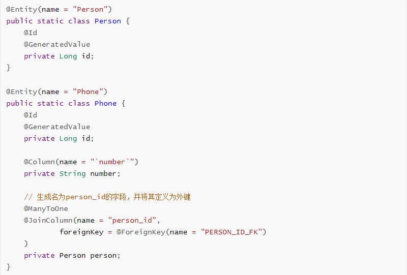 | 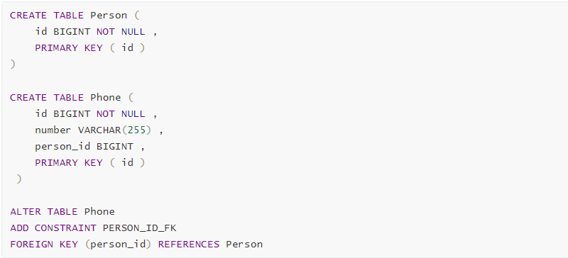 |

单向OneToMany的示例：

| Java                                                         | SQL                                                          |
| ------------------------------------------------------------ | ------------------------------------------------------------ |
| 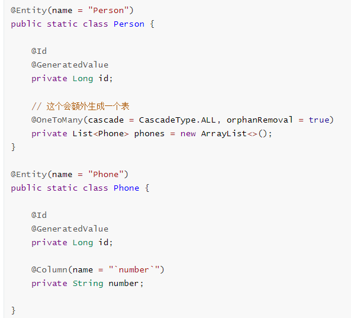 | 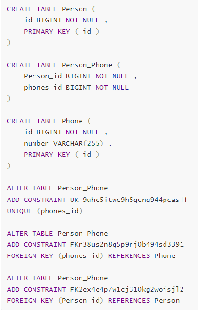 |

`OneToMany` *association mappedBy the* `@ManyToOne` *side*：

| Java                                                         | SQL                                                          |
| ------------------------------------------------------------ | ------------------------------------------------------------ |
| 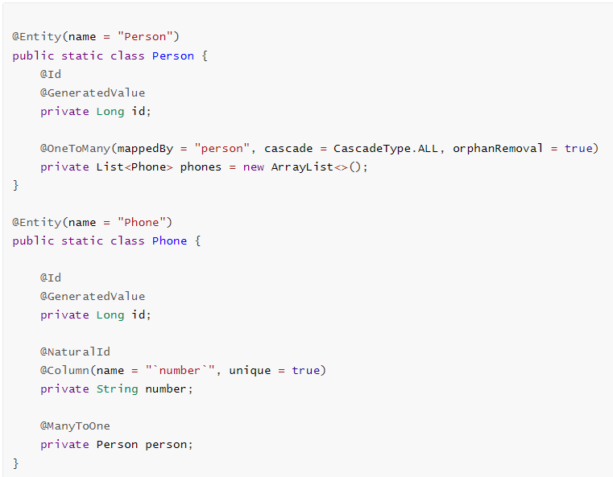 | 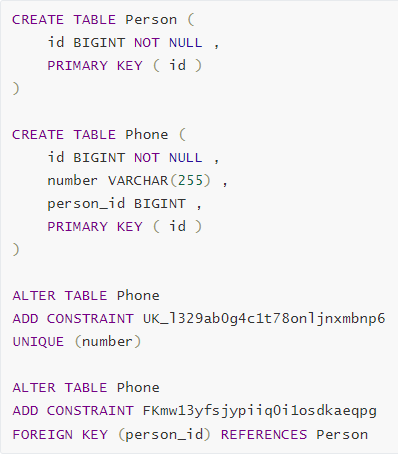 |

*Unidirectional* `@OneToOne`

| Java                                                         | SQL                                                          |
| ------------------------------------------------------------ | ------------------------------------------------------------ |
| 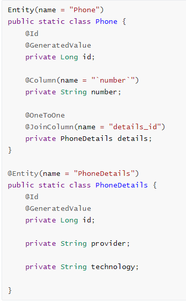 | 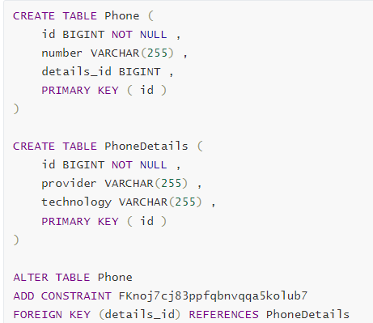 |

*Bidirectional* `@OneToOne`

| Java                                                         | SQL                                                          |
| ------------------------------------------------------------ | ------------------------------------------------------------ |
| 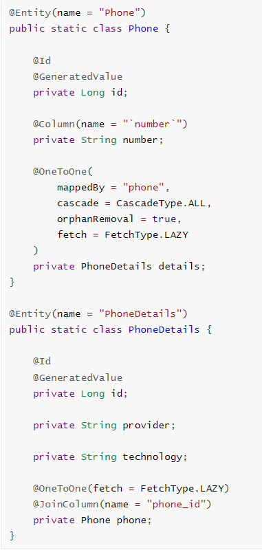 | 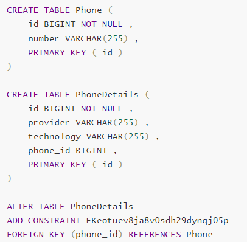 |

*Unidirectional* `@ManyToMany`

| Java                                                         | SQL                                                          |
| ------------------------------------------------------------ | ------------------------------------------------------------ |
| 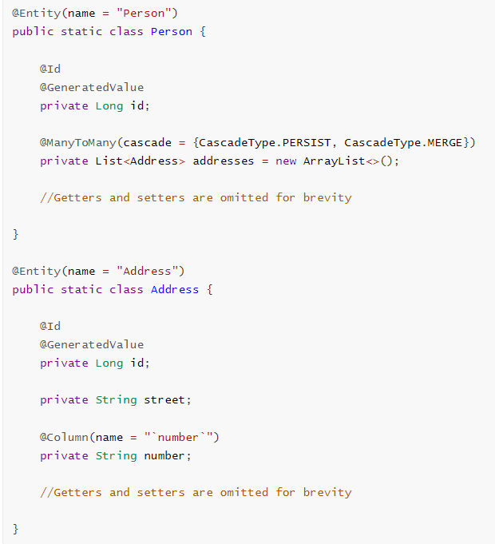 | 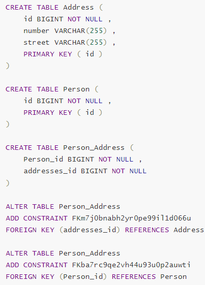 |

*Bidirectional* `@ManyToMany`

| Java                                                         | SQL                                                          |
| ------------------------------------------------------------ | ------------------------------------------------------------ |
| 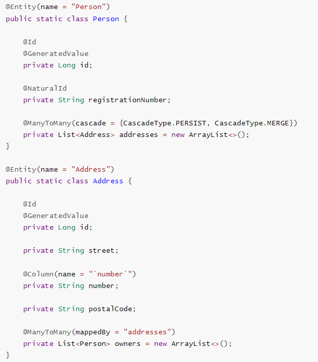 | 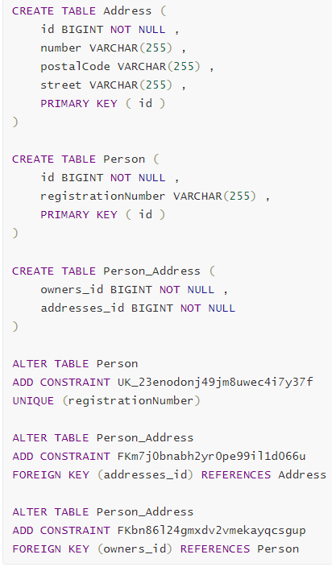 |

Embedded:

| Java                                                         | SQL                                                          |
| ------------------------------------------------------------ | ------------------------------------------------------------ |
| 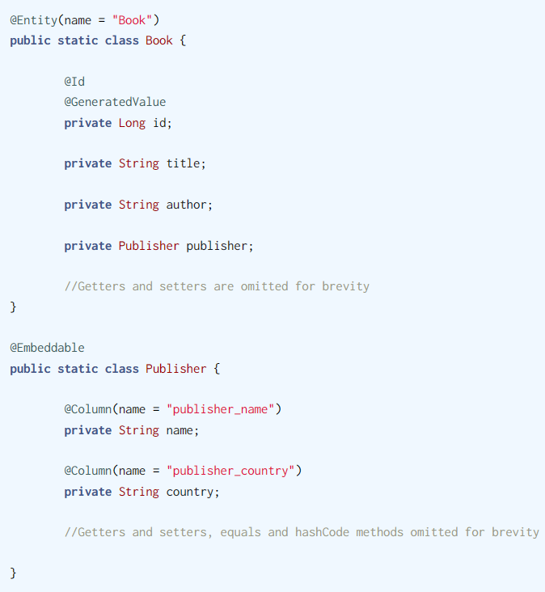 | 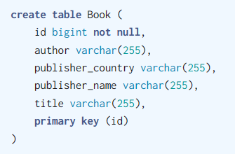 |

### Hibernate API 操纵数据库

但在使用Hibernate API 操纵数据库前，需要先在 Spring 上下文中做一些简单的配置。Spring Boot 的 `HibernateJpaConfiguration` 提供了一整套完整的自动配置。

| 配置内容   | Hibernate                     | JPA                                                          |
| :--------- | :---------------------------- | :----------------------------------------------------------- |
| 会话工厂   | `LocalSessionFactoryBean`     | `LocalEntityManagerFactoryBean` / `LocalContainerEntityManagerFactoryBean` |
| 事务管理器 | `HibernateTransactionManager` | `JpaTransactionManager`                                      |

我们也可以自己配置这些`Bean`：

~~~java
@SpringBootApplication
public class BinaryTeaApplication {

    public static void main(String[] args) {
        SpringApplication.run(BinaryTeaApplication.class, args);
    }

    @Bean
    public LocalSessionFactoryBean sessionFactory(DataSource dataSource) {
        // 依赖注入dataSource对象
        Properties properties = new Properties();
        
        // hibernate.hbm2ddl.auto，自动根据实体类生成 DDL 语句并执行。一般在生产环境中，数据库都是由 DBA 来运维的，不会像这样子创建表
        properties.setProperty("hibernate.hbm2ddl.auto", "create-drop");
        
        // hibernate.show_sql，打印 Hibernate 具体执行的 SQL 语句；
        properties.setProperty("hibernate.show_sql", "true");
        
        // hibernate.format_sql，对要打印的 SQL 进行格式化。
        properties.setProperty("hibernate.format_sql", "true");
        
        LocalSessionFactoryBean factoryBean = new LocalSessionFactoryBean();
        factoryBean.setDataSource(dataSource);
        factoryBean.setHibernateProperties(properties);
        
        // 要扫描的包路径，在这个路径中查找要映射的实体
        factoryBean.setPackagesToScan("learning.spring.binarytea.model");
        return factoryBean;
    }

    @Bean
    public PlatformTransactionManager transactionManager(SessionFactory sessionFactory) {
        return new HibernateTransactionManager(sessionFactory);
    }
}
~~~

我们介绍了 Spring Framework 为各种模板化的操作提供了模板类，例如，事务操作有 `TransactionTemplate`，JDBC 操作有 `JdbcTemplate`，而 Hibernate 操作也有专门的 `HibernateTemplate`。通过该模板，我们可以轻松对数据库进行访问。

为了方便使用模板，Spring Framework 还供了一个 `HibernateDaoSupport` 辅助类。

~~~java
@Repository
@Transactional
public class MenuRepository extends HiernateDaoSupport {
     // 传入SessionFactory
    public MenuRepository(SessionFactory sessionFactory) {
        super.setSessionFactory(sessionFactory);
    }
    
    public long countMenuItems() {
        // 这里的是HQL，不是SQL语句
        return getSessionFactory()
            .getCurrentSession()
            .createQuery("select count(t) from MenuItme t", Long.class)
            .getSingleResult();
    }
    
    public List<MenuItem> queryAllItems() {
        // 通过 getHibernateTemplate() 获取 HibernateTemplate 后进行的各种查询类操作
        return getHibernateTemplate().loadAll(MenuItem.class);
    }
    
    public MenuItem queryForItem(Long id) {
        return getHibernateTemplate().get(MenuItem.class, id);
    }
    
    public void insertItem(MenuItem item) {
        getHibernateTemplate().save(item);
    }

    public void updateItem(MenuItem item) {
        getHibernateTemplate().update(item);
    }

    public void deleteItem(Long id) {
        MenuItem item = getHibernateTemplate().get(MenuItem.class, id);
        if (item != null) {
            getHibernateTemplate().delete(item);
        }
    }

}
~~~

## Spring Data

Spring Data 项目就为不同的数据库提供了统一的 `Repository` 抽象层。我们可以通过约定好的方式定义接口，剩下的实现工作完全交由 Spring Data 来完成。

Spring Data 的核心接口是 `Repository<T, ID>`，`T` 是实体类型，`ID` 是主键类型，一般我们会使用它的子接口 `CrudRepository<T, ID>` 或者 `PagingAndSortingRepository<T, ID>`。`CrudRepository<T, ID>` 的定义如下所示：

~~~java
@NoRepositoryBean
public interface CrudRepository<T, ID> extends Repository<T, ID> {
    <S extends T> S save(S var1);
    <S extends T> Iterable<S> saveAll(Iterable<S> var1);

    Optional<T> findById(ID var1);
    boolean existsById(ID var1);
    Iterable<T> findAll();
    Iterable<T> findAllById(Iterable<ID> var1);

    long count();

    void deleteById(ID var1);
    void delete(T var1);
    void deleteAll(Iterable<? extends T> var1);
    void deleteAll();
}
~~~

`PagingAndSortingRepository<T, ID>` 则是在此基础之上又增加了分页和排序功能。

Spring Data JPA 是专门针对 JPA 的，其中提供了一个`JpaRepository<T, ID>` 接口。可以在配置类上增加 `@EnableJpaRepositories` 来开启对 JPA 的支持。

Spring Boot 的 `JpaRepositoriesAutoConfiguration` 提供了 `JpaRepository` 相关的自动配置。它通过 `@Import` 注解导入了 `JpaRepositoriesRegistrar` 类。这个注册类有一个静态内部类 `EnableJpaRepositoriesConfiguration`，上面添加了 `@EnableJpaRepositories`。所以在 Spring Boot 项目里无须自己添加该注解，只要有相应的依赖，Spring Boot 的自动配置就能帮忙完成剩下的工作：

~~~java
@Configuration(proxyBeanMethods = false)
@ConditionalOnBean(DataSource.class)
@ConditionalOnClass(JpaRepository.class)
@ConditionalOnMissingBean({ JpaRepositoryFactoryBean.class, JpaRepositoryConfigExtension.class })
@ConditionalOnProperty(prefix = "spring.data.jpa.repositories", name = "enabled", havingValue = "true",
    matchIfMissing = true)
@Import(JpaRepositoriesRegistrar.class)
@AutoConfigureAfter({ HibernateJpaAutoConfiguration.class, TaskExecutionAutoConfiguration.class })
public class JpaRepositoriesAutoConfiguration { ... }
~~~

`JpaRepositoryConfigExtension` 还注册了很多 Bean，例如：

- `EntityManagerBeanDefinitionRegistrarPostProcessor`
- `JpaMetamodelMappingContextFactoryBean`
- `PersistenceAnnotationBeanPostProcessor`
- `DefaultJpaContext`
- `JpaMetamodelCacheCleanup`
- `JpaEvaluationContextExtension`

要定义自己的 `Repository` ，只需扩展 `CrudRepository<T, ID>`、`PagingAndSortingRepository<T, ID>` 或 `JpaRepository<T, ID>`，并明确指定泛型类型即可。

~~~java
public interface MenuRepository extends JpaRepository<MenuItem, Long> {}
public interface TeaMakerRepository extends JpaRepository<TeaMaker, Long> {}
~~~

之后SpringBoot在启动时，会扫描包下所有的`JpaRepository`类型，并向容器注册它们。之后就可以通过依赖注入的方式访问这些`Repository`层的对象了：

~~~java
@Component
public class MyRunner implements CommandLineRunner {
    @Autowired
    private CityRepository cityRepository;
}
~~~

除了`JpaRepository`接口声明的方法，我们可以根据自己的业务需要按照约定声明一些方法，SpringData会根据方法名自动生成相应的实现。

- `find...By...`
- `read...By...`
- `query...By...`
- `get...By...`
- `count...By...`

其中，第一个`...`部分表示返回的结果条数，比如用 `TopN`、`FirstN` 表示返回头 *N* 个结果，还可以用 `Distinct` 起到 SQL 语句中 `distinct` 关键词的效果。第二个`...`部分是查询的条件，也就是 SQL 语句中 `where` 的部分，条件所需的内容与方法的参数列表对应，可以通过 `And`、`Or` 关键词组合多个条件，用 `Not` 关键词取反。Spring Data 方法支持多种形式的条件：

**Spring Data 查询方法支持的关键词**

| 作用                     | 关键词                                                       | 例子                                                         |
| :----------------------- | :----------------------------------------------------------- | :----------------------------------------------------------- |
| 相等                     | `Is`、`Equals`，不写的话默认就是相等                         | `findByNameIs(String name)`                                  |
| 比较                     | `LessThan`、`LessThanEqual`、`GreaterThan`、`GreaterThanEqual` | `findByNumberLessThan(int number)`                           |
| 比较                     | `Between`，用于日期时间的比较                                | `findByStartDateBetween(Date d1, Date d2)`                   |
| 比较                     | `Before`、`After`，用于日期时间的比较                        | `findByEndDateBefore(Date date)`                             |
| 是否为空                 | `Null`、`IsNull`、`NotNull`、`IsNotNull`                     | `findBySizeIsNotNull()`                                      |
| 相似                     | `Like`、`NotLike`                                            | `findByNameNotLike(String name)`                             |
| 字符串判断               | `StartingWith`、`EndingWith`、`Containing`                   | `findByNameContaining(String name)`                          |
| 忽略字符串大小写进行判断 | `IgnoreCase`、`AllIgnoreCase`                                | `findByLastnameAndFirstnameAllIgnoreCase(String lastname, String firstname)` |
| 集合                     | `In`、`NotIn`                                                | `findBySizeIn(List<Size> sizeList)`                          |
| 布尔判断                 | `True`、`False`                                              | `findByActiveFalse()`                                        |

对于会返回多条结果的方法，可以在方法名结尾处增加 `OrderBy` 关键词指定排序的字段，通过 `Asc` 和 `Desc` 指定升序或者降序（默认为 `Asc`）。例如：`findByNameOrderByIdDesc(String name)`、`findByNameOrderByUpdateTimeDescId(String name)`

~~~java
public interface OrderRepository extends JpaRepository<Order, Long> {
    List<Order> findByStatusOrderById(OrderStatus status);
    List<Order> findByMaker_NameLikeIgnoreCaseOrderByUpdateTimeDescId(String name);
}
~~~

- 上面的第一个方法根据 `Order.status` 进行查找，结果按照 `id` 升序排列；
- `Order.maker.name` 进行相似匹配，且忽略大小写，结果先按照 `updateTime` 降序排列，如果相同再按 `id` 升序排列。

如果有一些方法能抽离到公共接口里，但是不希望这个公共接口被注册为Repository Bean。那么就可以在接口上添加 `@NoRepositoryBean` 注解。`JpaRepository` 接口就是这样的：

~~~java
@NoRepositoryBean
public interface JpaRepository<T, ID> extends PagingAndSortingRepository<T, ID>, QueryByExampleExecutor<T> {
    
}
~~~

## MyBatis

|                      |        MyBatis        |         Hibernate         |
| :------------------- | :-------------------: | :-----------------------: |
| XML 方式配置映射     |         支持          |           支持            |
| 注解方式配置映射     |         支持          |           支持            |
| 自动生成目标 SQL     |        不支持         |           支持            |
| 复杂的 SQL 操作      |         支持          |         部分支持          |
| SQL 优化难易程度     |         方便          |          不方便           |
| 底层数据库的可移植性 | 映射 SQL 与数据库绑定 | 有灵活的“方言”（HQL）支持 |

`Mapper`接口就相当于`Repository`层了

### 定义Mapper

MyBatis 支持通过 XML 和注解两种方式来配置映射。下面我们通过一个例子来介绍如何使用注解的方式来配置映射：首先是MyBatis 中使用的部分实体类定义：

~~~java
public enum Size {
    SMALL, MEDIUM, LARGE
}

@Builder
@Data
@AllArgsConstructor
@NoArgsConstructor
public class MenuItem {
    private Long id;
    private String name;
    private Size size;
    private Money price;
    private Date createTime;
    private Date updateTime;
}
~~~

添加了 @Mapper注解 的 `Mapper` 接口

~~~java
@Mapper
public interface MenuItemMapper {
    @Select("select count(*) from t_menu")
    long count();

    @Insert("insert into t_menu (name, price, size, create_time, update_time) " +
            "values (#{name}, #{price}, #{size}, now(), now())")
    @Options(useGeneratedKeys = true, keyProperty = "id")
    int save(MenuItem menuItem);
1
    p'p'p
    @Update("update t_menu set name = #{name}, price = #{price}, size = #{size}, update_time = now() " +
            "where id = #{id}")
    int update(MenuItem menuItem);

    @Select("select * from t_menu where id = #{id}")
    @Results(id = "menuItem", value = {
        // 表中的列到对象属性的映射
        @Result(column = "id", property = "id", id = true),
        @Result(column = "size", property = "size", typeHandler = EnumTypeHandler.class),
        @Result(column = "price", property = "price", typeHandler = MoneyTypeHandler.class),
        @Result(column = "create_time", property = "createTime"),
        @Result(column = "update_time", property = "updateTime")
    })
    MenuItem findById(@Param("id") Long id);

    @Delete("delete from t_menu where id = #{id}")
    int deleteById(@Param("id") Long id);

    @Select("select * from t_menu")
    List<MenuItem> findAll();

    @Select("select m.* from t_menu m, t_order_item i where m.id = i.item_id and i.order_id = #{orderId}")
    List<MenuItem> findByOrderId(Long orderId);
}
~~~

**MyBatis 中的常用注解**

| 注解         | 作用                                                    | 重点属性说明                                                 |
| :----------- | :------------------------------------------------------ | :----------------------------------------------------------- |
| `@Insert`    | 定义插入操作                                            | `value` 为具体使用的 SQL 语句                                |
| `@Delete`    | 定义删除操作                                            | 同上                                                         |
| `@Update`    | 定义更新操作                                            | 同上                                                         |
| `@Select`    | 定义查询操作                                            | 同上                                                         |
| `@Param`     | 指定参数名称，方便在 SQL 中使用对应参数（一般不用指定） |                                                              |
| `@Results`   | 指定返回对象的映射方式，具体内容通过 `@Result` 注解设置 | `id`  以便复用（通过ResultMap）                              |
| `@Result`    | 指定具体字段、属性的映射关系                            | `javaType`                                                   |
| `@ResultMap` | 引用其他地方已事先定义好的映射关系                      |                                                              |
| `@Options`   | 设置开关和配置选项                                      | `useGeneratedKeys`——使用生成的主键，`keyProperty`——主键属性名，`fetchSize`——获取结果集的条数，`timeout`——超时时间 |
| `@One`       | 指定复杂的单个属性映射                                  | Select，用于指定关联查询的方法（一般是ByID）                 |
| `@Many`      | 指定复杂的集合属性映射                                  | 同上                                                         |

MyBatis 是通过 `TypeHandler` 来实现特殊类型的处理的。在上述代码示例中，有一段代码定义了特殊类型的映射：

~~~java
@Result(column = "size", property = "size", typeHandler = EnumTypeHandler.class),
@Result(column = "price", property = "price", typeHandler = MoneyTypeHandler.class),
~~~

`size` 属性是一个枚举，通常枚举在数据库中有两种保存方式，一种是保存枚举名，用的就是 `EnumTypeHandler`。另一种是保存枚举的顺序，用的是 `EnumOrdinalTypeHandler`。MyBatis 中默认使用 `EnumTypeHandler` 来处理枚举类型。

`price` 属性的类型是 `Money`，这个类 MyBatis 没有提供内置的 `TypeHandler`，因此需要我们自己来实现一个针对 `Money` 类型的处理器。MyBatis 提供了 `BaseTypeHandler` 抽象类，通过它可以方便地实现 `TypeHandler`。

~~~java
public class MoneyTypeHandler extends BaseTypeHandler<Money> {
    @Override
    public void setNonNullParameter(
        PreparedStatement ps, 
        int i,                    
        Money parameter, 
        JdbcType jdbcType) throws SQLException {
        
        ps.setLong(i, parameter.getAmountMinorLong());
    }

    @Override
    public Money getNullableResult(ResultSet rs, String columnName) throws SQLException {
        return parseMoney(rs.getLong(columnName));
    }

    @Override
    public Money getNullableResult(ResultSet rs, int columnIndex) throws SQLException {
        return parseMoney(rs.getLong(columnIndex));
    }

    @Override
    public Money getNullableResult(CallableStatement cs, int columnIndex) throws SQLException {
        return parseMoney(cs.getLong(columnIndex));
    }

    private Money parseMoney(Long value) {
        return Money.ofMinor(CurrencyUnit.of("CNY"), value);
    }
}
~~~

我们再来考察在MyBatis中的一对多与多对多关系。

~~~java
@Mapper
public interface TeaMakerMapper {
    @Select("select * from t_tea_maker where id = #{id}")
    @Results(id = "teaMakerMap", value = {
        @Result(column = "id", property = "id"),
        @Result(column = "id", property = "orders",
                many = @Many(select = "learning.spring.binarytea.repository.OrderMapper.findByMakerId"))
    })
    TeaMaker findById(Long id);
    // 省略其他方法
}
~~~

~~~java
@Mapper
public interface OrderMapper {
    @Select("select * from t_order where id = #{id}")
    @Results(id = "orderMap", value = {
        @Result(column = "status", property = "status", typeHandler = EnumOrdinalTypeHandler.class),
        @Result(column = "amount_discount", property = "amount.discount"),
        @Result(column = "amount_total", property = "amount.totalAmount"),
        @Result(column = "amount_pay", property = "amount.payAmount"),
        @Result(column = "maker_id", property = "maker",
                one = @One(select = "learning.spring.binarytea.repository.TeaMakerMapper.findById")),
        @Result(column = "id", property = "items",
                many = @Many(select = "learning.spring.binarytea.repository.MenuItemMapper.findByOrderId"))
    })
    Order findById(Long id);

    @Select("select * from t_order where maker_id = #{makerId}")
    @ResultMap("orderMap")
    List<Order> findByMakerId(Long makerId);
    // 省略其他方法
}
~~~

### 使用Mapper

如何在工程中使用它们呢？有三种方式

- XML：

  ~~~xml
  <bean id="sqlSessionFactory" class="org.mybatis.spring.SqlSessionFactoryBean">
      <property name="dataSource" ref="dataSource" />
  </bean>
  
  <!-- 按需定义Mapper Bean -->
  <bean id="menuItemMapper" class="org.mybatis.spring.mapper.MapperFactoryBean">
      <property name="mapperInterface" value="learning.spring.binarytea.repository.MenuItemMapper" />
      <property name="sqlSessionFactory" ref="sqlSessionFactory" />
  </bean>
  ~~~

  在 `Mapper` 多的时候，可以直接通过扫描来实现 `Mapper` 的自动注册：

  ~~~xml
  <mybatis:scan base-package="learning.spring.binarytea.repository" />
  ~~~

- MapperScan：

  ~~~java
  @Configuration
  @MapperScan("learning.spring.binarytea.repository")
  public class Config {
      
  }
  ~~~

- starter：它自动会扫描项目下所有@Mapper标注的Mapper接口。

  ~~~java
  <dependency>
      <groupId>org.mybatis.spring.boot</groupId>
      <artifactId>mybatis-spring-boot-starter</artifactId>
      <version>2.2.2</version>
  </dependency>
  ~~~

  可以通过 `application.properties` 来定制一些配置：

  | 配置项                                               | 说明                                                         |
  | :--------------------------------------------------- | :----------------------------------------------------------- |
  | `mybatis.type-aliases-package`                       | 映射的 POJO 类型放置的包路径                                 |
  | `mybatis.type-handlers-package`                      | 类型映射所需的 `TypeHandler` 放置的包路径                    |
  | `mybatis.config-location`                            | MyBatis 配置文件的位置                                       |
  | `mybaits.mapper-locations`                           | 映射文件的位置                                               |
  | `mybatis.configuration.*`                            | MyBatis 核心配置，例如下面两个，不能和 `mybatis.config-location` 一起使用 |
  | `mybatis.configuration.map-underscore-to-camel-case` | 是否将下划线映射为驼峰规则 11                                |
  | `mybatis.configuration.default-statement-timeout`    | 默认语句超时时间                                             |

### 分页

MyBatis 分页插件 PageHelper，其spring-boot-starter为

~~~java
<dependency>
    <groupId>com.github.pagehelper</groupId>
    <artifactId>pagehelper-spring-boot-starter</artifactId>
    <version>1.4.1</version>
</dependency>
~~~

接下来，在 `application.properties` 中添加一些设置。**PageHelper 在 Spring Boot 中的一些设置**

| 配置项                               | 说明                                                         |
| :----------------------------------- | :----------------------------------------------------------- |
| `pagehelper.offsetAsPageNum`         | 在使用 `RowBounds` 作为分页参数时，将 `offset` 作为页码      |
| `pagehelper.rowBoundsWithCount`      | 在使用 `RowBounds` 作为分页参数时，也会执行 `count` 操作     |
| `pagehelper.pageSizeZero`            | 如果分页大小为 `0`，则返回所有结果                           |
| `pagehelper.reasonable`              | 合理化分页，传入的页码小于等于 `0` 时返回第一页，大于最大页时返回最后一页 |
| `pagehelper.supportMethodsArguments` | 从方法的参数中获取分页所需的信息                             |

针对分页功能测试的 `MenuItemMapperTest` 代码片段：

~~~java
@SpringBootTest
public class MenuItemMapperTest {
    @Autowired
    private MenuItemMapper menuItemMapper;

    @Test
    public void testPagination() {
        // 不分页
        List<MenuItem> list = menuItemMapper.findAll();
        assertEquals(2, list.size());

        // 分页, 只有紧跟着PageHelper.startPage()的mapper方法才会有分页效果
        PageHelper.startPage(1, 1);
        list = menuItemMapper.findAll();
        assertEquals(1, list.size());
        assertTrue(list instanceof Page);
        PageInfo<MenuItem> pageInfo = new PageInfo<>(list);
        assertEquals(2, pageInfo.getPages()); // 总页数
        assertEquals(1, pageInfo.getPageSize()); // 每页大小
        assertEquals(1, pageInfo.getPageNum()); // 当前页码
        assertEquals(2, pageInfo.getNextPage()); // 下页页码
    }
}
~~~

此外，还可以在Mapper方法声明中，通过参数中指定分页信息（这是通过拦截器来实现的）：

~~~java
@Mapper
public interface TeaMakerMapper {
    @Select("select * from t_tea_maker")
    @ResultMap("teaMakerMap")
    List<TeaMaker> findAllWithRowBounds(RowBounds rowBounds);

    @Select("select * from t_tea_maker")
    @ResultMap("teaMakerMap")
    List<TeaMaker> findAllWithPage(int pageSize, int pageNum);

    // 省略其他方法
}
~~~

RowBounds会将所有的数据都加载到内存中，然后再做逻辑分页，而不是做物理分页。

~~~java
@SpringBootTest
public class TeaMakerMapperTest {
    @Autowired
    private TeaMakerMapper teaMakerMapper;

    @Test
    public void testPagination() {
        List<TeaMaker> list = teaMakerMapper.findAllWithRowBounds(new RowBounds(1, 1));
        PageInfo<TeaMaker> pageInfo = new PageInfo<>(list);
        assertEquals(1, list.size());
        assertEquals(1, pageInfo.getPageNum());
        assertEquals(1, pageInfo.getPageSize());
        assertEquals(2, pageInfo.getPages());

        list = teaMakerMapper.findAllWithPage(1, 2);
        pageInfo = new PageInfo<>(list);
        assertEquals(2, pageInfo.getPageNum());
        assertEquals(1, pageInfo.getPrePage());
        assertEquals(0, pageInfo.getNextPage()); // 没有下一页
    }
}
~~~

###  MyBatis Plus

在 MyBatis Plus 的帮助下，即只需要定义 POJO 类，再定义一个扩展了 `BaseMapper<T>` 的接口就能执行一些常规操作了。BaseMapper会自动为我们提供一些常用的方法。

`MyBatisPlus`的`spring-boot-starter`：

~~~java
<dependency>
    <groupId>com.baomidou</groupId>
    <artifactId>mybatis-plus-boot-starter</artifactId>
    <version>3.5.1</version>
</dependency>
~~~

`MenuItem` 类的定义：

~~~java
@Builder
@Data
@AllArgsConstructor
@NoArgsConstructor
@TableName("t_menu")
public class MenuItem {...}
~~~

Mapper的定义：

~~~java
public interface MenuItemMapper extends BaseMapper<MenuItem> {
    // 在这个接口中，定义符合我们需求的方法即可
    @Select("select m.* from t_menu m, t_order_item i where m.id = i.item_id and i.order_id = #{orderId}")
    List<MenuItem> findByOrderId(Long orderId);
}
~~~

~~~java
@SpringBootTest
public class MenuItemMapperTest {
    @Autowired
    private MenuItemMapper menuItemMapper;

    @Test
    public void testSelect() {
        assertEquals(2, menuItemMapper.selectCount(null));

        MenuItem item = menuItemMapper.selectById(1L);
        assertEquals(1L, item.getId());
        assertEquals("Java咖啡", item.getName());
        assertEquals(Size.MEDIUM, item.getSize());
        assertEquals(Money.ofMinor(CurrencyUnit.of("CNY"), 1200), item.getPrice());

        // 这个selectList是BaseMapper里的
        List<MenuItem> list = menuItemMapper.selectList(null);
        assertEquals(2, list.size());
    }
    // 省略其他方法
}
~~~

MyBatis Plus 的 `BaseMapper<T>` 中带有分页的查询方法，但还需要配置分页插件才能完全发挥它的功能。在 Spring Boot 的配置类中增加如下 Bean，其中的 `PaginationInnerInterceptor` 就是分页插件

~~~java
@Bean
public MybatisPlusInterceptor mybatisPlusInterceptor() {
    MybatisPlusInterceptor mybatisPlusInterceptor = new MybatisPlusInterceptor();
    mybatisPlusInterceptor.addInnerInterceptor(new PaginationInnerInterceptor());
    return mybatisPlusInterceptor;
}
~~~

分页测试代码：

~~~java
@Test
public void testPagination() {
    Page<MenuItem> page = menuItemMapper.selectPage(new Page<MenuItem>(1, 1).addOrder(OrderItem.asc("id")), null);
    assertEquals(1, page.getCurrent());
    assertEquals(1L, page.getRecords().get(0).getId());
    assertEquals(1, page.getRecords().size());
    assertEquals(2, page.getTotal());
}
~~~

