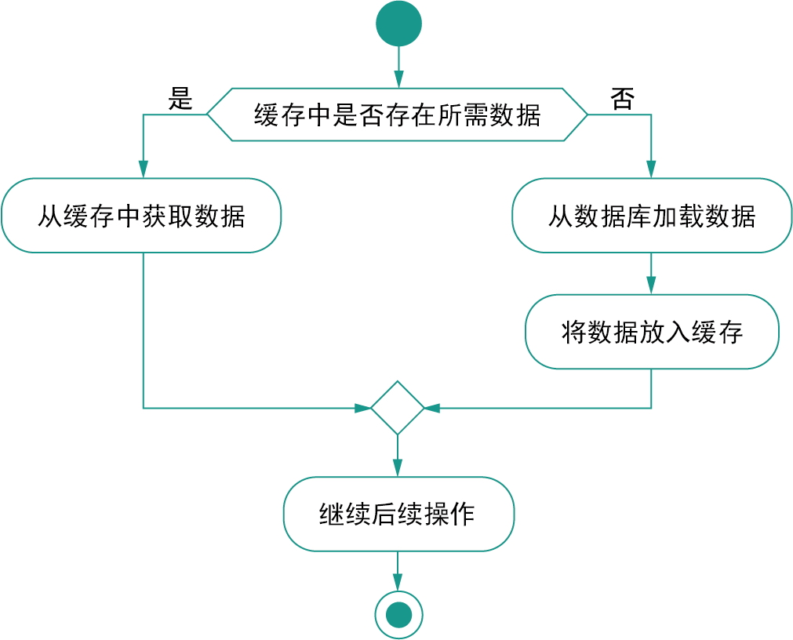

# 数据访问进阶

[TOC]

## Spring的缓存抽象

当然，这里还要考虑缓存内容过期、超过缓存上限时内容淘汰、数据写入缓存时是否加锁等问题。

Spring Framework将上述流程做了一层抽象，它通过注解或者 XML 的方式配置到方法上，每次执行方法就会在缓存里做一次检查，看看是否已经用当前参数调用过这个方法了，如果调用过并且有结果在缓存里了，就不再执行实际的方法调用，而是直接返回缓存值；

这里有两点需要着重说明一下：

- 这套缓存抽象背后是通过 AOP 来实现的，所以如果执行缓存操作，那么必须访问代理后的对象（依赖注入帮我们处理好了）
- 只有那些**可幂等操作**的方法才适用于这套抽象，因为必须要保证相同的参数拥有一样的返回值。

| Spring 注解    | JSR-107 对应注解                   | 说明                                                         |
| :------------- | :--------------------------------- | :----------------------------------------------------------- |
| `@Cacheable`   | `@CacheResult`                     | 从缓存中获取对应的缓存值，没有的话就执行方法并缓存，然后返回。其中 `sync` 如果为 `true`，在调用方法时会锁住缓存，相同的参数只有一个线程会计算，其他线程等待结果 |
| `@CachePut`    | `@CachePut`                        | 直接更新缓存                                                 |
| `@CacheEvict`  | `@CacheRemove` / `@CacheRemoveAll` | 清除缓存，其中的 `allEntries` 如果设置为 `true`，则清除指定缓存 |
| `@Caching`     | 无                                 | 可以用来组合多个缓存抽象的注解，比如两个 `@CacheEvict`       |
| `@CacheConfig` | `@CacheDefaults`                   | 添加在类上，为这个类里的缓存抽象注解提供公共配置，例如统一的 `cacheNames` 和 `cacheManager` |

这些注解中有很多一样的属性（除了 `@Caching`），具体如下

- **`cacheNames`**，标识一个缓存
- **`key`**，计算缓存Key名的 SpEL 表达式
- **`keyGenerator`**，自定义的 `KeyGenerator` Bean 名称，用来生成缓存键名，与 `key` 属性互斥。
- **`cacheManager`**，缓存管理器的 Bean 名称，负责管理实际的缓存
- **`cacheResolver`**，缓存解析器的 Bean 名称，与 `cacheManager` 属性互斥
- **`condition`**，操作缓存的条件，也是用 SpEL 表达式来计算的

~~~java
@Cacheable(cacheNames="menu", condition="#name.length() < 16")
public MenuItem findByName(String name) {...}
~~~

添加依赖：

~~~xml
<dependency>
    <groupId>org.springframework.boot</groupId>
    <artifactId>spring-boot-starter-cache</artifactId>
</dependency>
~~~

在配置类加上`@EnableCaching`注解即可开启使用缓存：

~~~java
@Configuration
@EnableCaching
public class Config {}
~~~

也可以在 XML 配置文件中使用 `<cache:annotation-driven/>` 标签，例如：

~~~xml
<beans xmlns="http://www.springframework.org/schema/beans"
        xmlns:xsi="http://www.w3.org/2001/XMLSchema-instance"
        xmlns:cache="http://www.springframework.org/schema/cache"
        xsi:schemaLocation="
        http://www.springframework.org/schema/beans
        https://www.springframework.org/schema/beans/spring-beans.xsd
        http://www.springframework.org/schema/cache
        https://www.springframework.org/schema/cache/spring-cache.xsd">

    <cache:annotation-driven/>
</beans>
~~~

使用示例：

~~~java
@Service
@CacheConfig(cacheNames = "menu")
// 类上添加的 @CacheConfig 注解配置了公共的 cacheNames
public class MenuService {
    @Autowired
    private MenuRepository menuRepository;

    @Cacheable
    public List<MenuItem> getAllMenu() {
        return menuRepository.findAll();
    }

    // 此处将方法名、name 参数与 size 参数用“-”拼接在一起作为缓存的键名。
    @Cacheable(key = "#root.methodName + '-' + #name + '-' + #size")
    public Optional<MenuItem> getByNameAndSize(String name, Size size) {
        return menuRepository.findByNameAndSize(name, size);
    }
}

~~~

预热缓存：

~~~java
@Component
@Order(1)
@Slf4j
public class MenuCacheRunner implements ApplicationRunner {
    @Autowired
    private MenuService menuService;

    @Override
    public void run(ApplicationArguments args) throws Exception {
        log.info("从数据库加载菜单列表，后续应该就在缓存里了");
        List<MenuItem> list = menuService.getAllMenu();
        log.info("共取得{}个条目。", list.size());
        menuService.getByNameAndSize("Java咖啡", Size.MEDIUM).ifPresent(m -> log.info("加载中杯Java咖啡，放入缓存，ID={}", m.getId()));
    }
}
~~~

删除缓存：

~~~java
@CacheEvict(cacheNames = "hello", key = "#id") 
public String delete(String id) {
    // 删除key为id的缓存
    return "删除成功";
}
~~~

修改缓存：

~~~java
@CachePut(cacheNames = "hello", key = "#id") 
public String update(String id) {
    return "修改后的缓存数据";
}
~~~

unless条件，condition是在调用方法之前判断条件，决定是否准备缓存。unless是在调用方法之后判断条件，决定是否不缓存。

~~~java
@Cacheable(cacheNames = "hello",unless="#result.id.contains('1')" )
// 如果SpEL条件成立，则不缓存
public User find(String id) {
    User user = new User();
    user.setId(id);
    return user;
}
~~~

 Spring 缓存抽象的默认实现为`ConcurrentHashMap`，其实 Spring 的缓存抽象能够支持多种不同的后端缓存实现，通过ChacheMananger来指定：

| 实现类                      | 底层实现            | 说明                                                      |
| :-------------------------- | :------------------ | :-------------------------------------------------------- |
| `ConcurrentMapCacheManager` | `ConcurrentHashMap` | 建议仅用于测试目的                                        |
| `NoOpCacheManager`          | 无                  | 不做任何缓存操作，可以视为关闭缓存                        |
| `CompositeCacheManager`     | 无                  | 用于组合多个不同的 `CacheManager`，会在其中遍历要找的缓存 |
| `EhCacheCacheManager`       | EhCache             | 适用于 EhCache                                            |
| `CaffeineCacheManager`      | Caffeine            | 适用于 Caffeine                                           |
| `JCacheCacheManager`        | JCache              | 适用于遵循 JSR-107 规范的缓存                             |

此外还有Redis、Hazelcast、Infinispan

SpEL基本表达式：

- 算术运算符：加（+）、减（-）、乘（*）、除（/）、求余 （%）、幂（^）、求余（MOD）和除（DIV）等算术运算符
- 关系运算符：等于（==）、不等于（!=）、大于（>）、大 于等于（>=）、小于（<）、小于等于（<=）、区间（between）运算等
- 逻辑运算符：与（and）、或（or）、非（!或NOT）
- 字符串运算符：连接（+）和截取（[ ]）
- 三目运算符
- 正则表达式匹配符matcher。例如` #{'123' matches '\\d{3}' }` 返回true。
- 变量引用符：SpEL提供了一个上下文变量的引用符“#”， 可在表达式中使用“#variableName”引用上下文变量。
- 类型访问运算符：SpEL提供了一个类型访问运算符 T(Type)。其中，“Type”表示某个Java类型，实际上对应于Java类的 java.lang.Class实例。Type必须是类的全限定名（包括包名），但是 核心包“java.lang”中的类除外。例如：\#{T(String).valueOf(1)}表示将整数1转换成 字符串。
