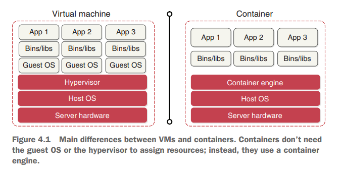
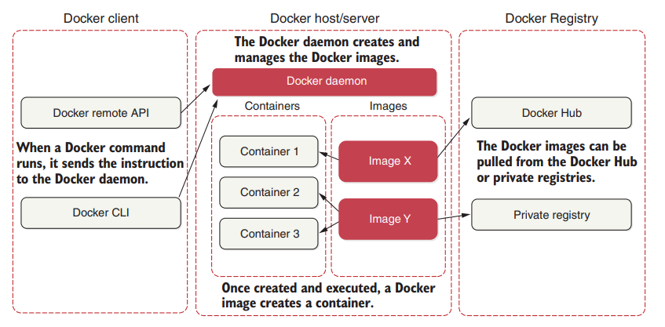
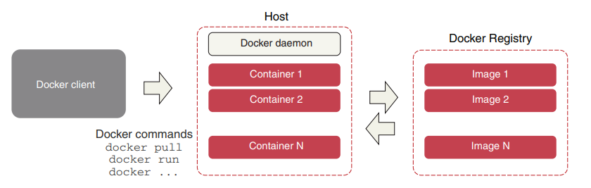
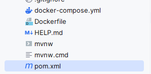
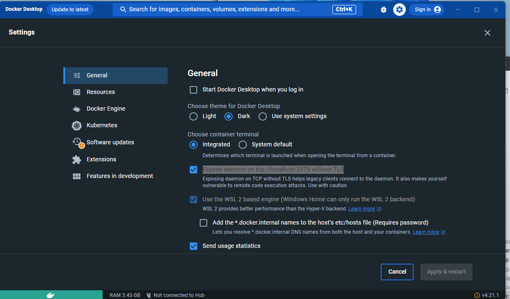
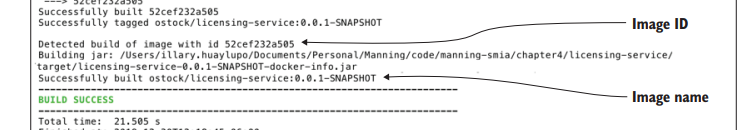
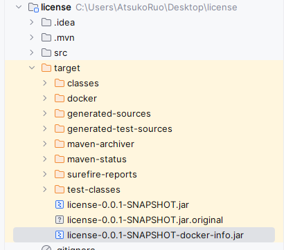
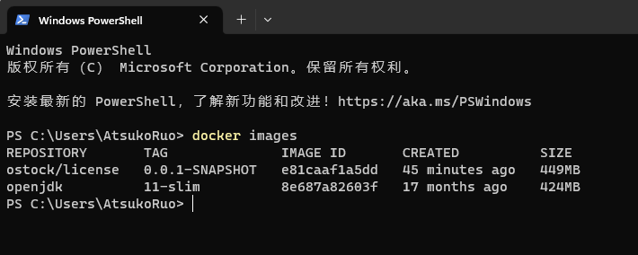
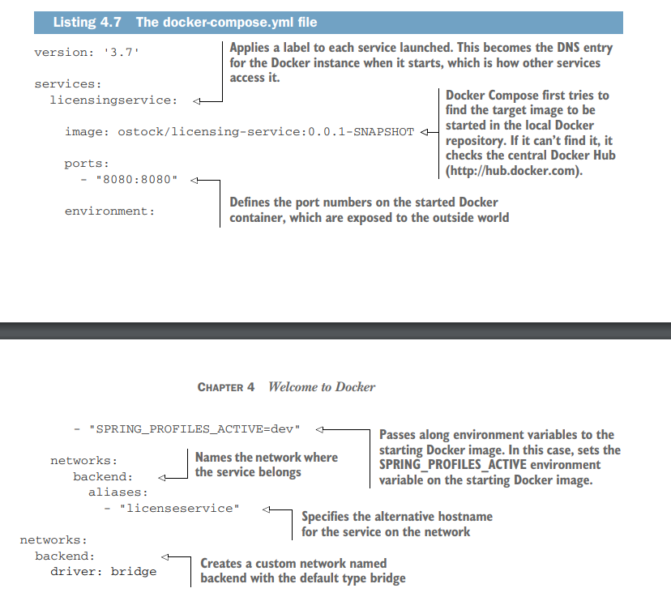

# Docker


## VM & Docker

容器是一种轻量级的虚拟化技术，它虚拟化操作系统，这样每个容器实例都共享一个操作系统，但是拥有自己的应用程序、库和依赖项。

而虚拟机是一种重量级的虚拟化技术，它虚拟化真实硬件来模拟一个逻辑计算机系统，这使得每个虚拟机都可以拥有自己的操作系统。



关于资源分配

- 在VM中，物理资源需要提前分配
- 在容器中，我们可以使用k8s来提前分配资源，但这不是必须的。容器引擎会自动分配必要的资源，以支撑功能的正常运行。


Docker 引擎是整个Docker系统的核心，它遵循CS架构：



The Docker Engine contains the following components:

- **Docker daemon**：负责创建、运行和监控Docker容器。
- **Docker client**：用户通过客户端与Docker交互。
- **Docker Registr**：它保存了Docker镜像存储的位置，Registries可以是公开的，也可以是私有的。Docker Hub就是默认的公开Redgistr，你可以自己创建私有的Registry
- **Docker images**：它是只读模板，包含了一些创建Docker的指令 The images can be pulled from the Docker Registr, and you can use them, or you can modify them by adding additional instructions. Also, you can create new images by using a Dockerfile
- **Docker container**：Once created and executed with the `docker run` command, a Docker image creates a container. The application and its environment run inside this container. In order to start, stop, and delete a Docker container, you can use the Docker API or the CLI.
- **Docker volumes**：Docker volumes are the preferred mechanism to store data generated by Docker and used by the Docker containers. They can be managed using the Docker API or the Docker CLI.
- **Docker networks**：The Docker networks allow us to attach the containers to as many networks as we like. Docker contains the following five network driver types: bridge, host, overlay, none, and macvlan. 


Docker daemon is responsible for all the container’s actions. daemon receives the commands from the Docker client; these commands can be sent via the CLI or the REST APIs.




A **Dockerfile** is a simple text file that contains a list of instructions and commands that the Docker client calls to create and prepare an image

~~~dockerfile
FROM openjdk:11-slim
ARG JAR_FILE=target/*.jar
COPY ${JAR_FILE} app.jar
ENTRYPOINT ["java","-jar","/app.jar"]
~~~


Table 4.1 shows the most common Dockerfile commands

- **FROM**：Defines a base image to start the build process. In other words, the FROM command specifies the Docker image that you’ll use in your Docker run time.
- **LABEL**：Adds metadata to an image. This is a key-value pair.
- **AGE**：Defines variables that the user can pass to the builder using the docker build command.
- **COPY**：Copies new files, directories, or remote file URLs from a source and adds them to the filesystem of the image we are creating at the specified destination path 
- **VOLUME**：Creates a mount point in our container. When we create a new container using the same image, we will create a new volume that will be isolated from the previous one.
- **RUN**：Takes the command and its arguments to run a container from the image. We often use this for installing software packages.
- **CMD**：Provides arguments to the ENTRYPOINT. This command is similar to the docker run command, but this command gets executed only after a container is instantiated.
- **ADD**：Copies and adds the files from a source to a destination within the container.
- **ENTRYPOINT**：Configures a container that will run as an executable.
- **ENV**：Sets the environment variables


**Docker Compose** simplifies the use of Docker by allowing us to create scripts that facilitate the design and the construction of services. With Docker Compose, you can run multiple containers as a single service or you can create different containers simultaneously. To use Docker Compose, follow these steps:

- Install Docker Compose if you don’t have it already installed. You can access this tool at https://docs.docker.com/compose/install/.
- Create a YAML file to configure your application services. You should name this file docker-compose.yml.
- Check the validity of the file using the following command: `docker-compose config`.
- Start the services using the following command: `docker-compose up`.


the instructions that are used in the docker-compose.yml file：

- **version**：Specifies the version of the Docker Compose tool.
- **service**：Specifies which services to deploy. The service name becomes the DNS entry for the Docker instance when started and is how other services access it.
- **image**：Specifies the tool to run a container using the specified image
- **port**：Defines the port number on the started Docker container that will be exposed to the outside world. Maps the internal and the external port.
- **environment**：Passes the environment variables to the starting Docker image.
- **network**：Specifies a custom network, allowing us to create complex topologies. The default type is bridge, so if we don’t specify another type of network (host, overlay, macvlan, or none), we will create a bridge. The bridge network allows us to maintain the container’s connection to the same network. Note that the bridge network only applies to the containers running on the same Docker daemon host.
- **alias** ：Specifies an alternative hostname for the service on the network.


the docker-compose commands：

- `docker-compose up -d`：Builds the images for your application and starts the services you define. This command downloads all the necessary images and then deploys these and starts the container. The -d parameter indicates to run Docker in the background.
- `docker-compose logs`：Lets you view all the information about your latest deployment.
- `docker-compose logs <service_id>`：Lets you view the logs for a specific service. To view the licensing service deployment
-  `docker-compose ps`：Outputs the list of all the containers you have deployed in your system.
- `docker-compose stop`：Stops your services once you have finished with them. This also stops the containers.
- `docker-compose down`：Shuts down everything and removes all containers.


Docker Maven plugin allow us to manage the Docker images and containers from our Maven pom.xml file

~~~xml
<plugin>
    <groupId>com.spotify</groupId>
    <artifactId>dockerfile-maven-plugin</artifactId>
    <version>1.4.10</version>
    <configuration>
        <repository>${docker.image.prefix}/
            ${project.artifactId}</repository>
        <tag>${project.version}</tag>
        <buildArgs>
            <JAR_FILE>target/${project.build.finalName}
                .jar</JAR_FILE>
        </buildArgs>
    </configuration>
    <executions>
        <execution>
        <id>default</id>
        <phase>install</phase>
            <goals>
                <goal>build</goal>
                <goal>push</goal>
            </goals>
        </execution>
    </executions>
</plugin>
~~~

配置`docker.image.prefix`变量：

~~~xml
<properties>
    <java.version>17</java.version>
    <docker.image.prefix>ostock</docker.image.prefix>
</properties>
~~~

`Dockerfile`文件一定要放在和`pom.xml`文件一起的最外层目录



可以使用Basic Dockerfile或者Multistage Build Dockerfile来构建微服务。它们的主要区别在于，使用基础的Dockerfile，你会复制整个Spring Boot微服务；而使用多阶段构建，你只会复制构建微服务所需的部分。

- 基础的Dockerfile：

  ~~~dockerfile
  #Start with a base image containing Java runtime
  FROM openjdk:17-slim
  
  # Add Maintainer Info
  LABEL maintainer="Illary Huaylupo <illaryhs@gmail.com>"
  
  # The application's jar file
  ARG JAR_FILE
  
  # Add the application's jar to the container
  COPY ${JAR_FILE} app.jar
  
  # Execute the application
  ENTRYPOINT ["java","-jar","/app.jar"]
  ~~~

- 多阶段构建

  ~~~dockerfile
  #stage 1
  #Start with a base image containing Java runtime
  FROM openjdk:17-slim as build
  
  # Add Maintainer Info
  LABEL maintainer="Illary Huaylupo <illaryhs@gmail.com>"
  
  # The application's jar file
  # the Dockerfile obtains the value for the JAR_FILE variable that we set in the<configuration> <buildArgs> section of the pom.xml
  ARG JAR_FILE
  
  # Add the application's jar to the container
  COPY ${JAR_FILE} app.jar
  
  #unpackage jar file
  RUN mkdir -p target/dependency &&
   (cd target/dependency; jar -xf /app.jar)
   
  #stage 2
  #Same Java runtime
  FROM openjdk:11-slim
  
  #Add volume pointing to /tmp
  VOLUME /tmp
  
  #Copy unpackaged application to new container
  ARG DEPENDENCY=/target/dependency
  #  /BOOT-INF/lib是Spring Boot打包后，存放应用所依赖的第三方JAR包文件。
  COPY --from=build ${DEPENDENCY}/BOOT-INF/lib /app/lib
  COPY --from=build ${DEPENDENCY}/META-INF /app/META-INF
  COPY --from=build ${DEPENDENCY}/BOOT-INF/classes /app
  
  #execute the application
  ENTRYPOINT ["java","-cp","app:app/lib/*","com.optimagrowth.license.
   LicenseServiceApplication"]
  ~~~

  

接着开始构建项目

~~~shell
$ mvn clean package
$ mvn package dockerfile:build
~~~

记得打开Docker，以及开启`Expose daemon on tcp://localhost:2375 without TLS`选项。

注：左下角Docker图标为绿色的，说明Docker正在运行



然后我们得到这样的输出



Now that we have the Docker image



 To list all of the Docker images, we need to execute the `docker images` command



we can run it by using the following command: 

~~~shell
$ docker run ${IMAGE ID}
~~~

You can also use the `-d` option in the docker run command to run the container in the background.

 In order to see all the running containers in your system, you can execute the `docker ps` command

If you need to stop the container, you can execute the following command with the corresponding container ID:

~~~shell
$ docker stop <container_id>
~~~


我们可以使用Docker-compose up来加载镜像

 Let’s create our first docker-compose.yml file（与pom.xml在同一目录下）

~~~yml
version: '3.7'
services:
	# Applies a label to each service launched. This becomes the DNS entry for the Docker instance when it starts, which is how other services access it.
	licensingservice:
	
		# Docker Compose first tries to find the target image to be started in the local Docker repository. If it can’t find it, it checks the central Docker Hub (http://hub.docker.com).
        image: ostock/licensing-service:0.0.1-SNAPSHOT
        ports:
            - "8080:8080"
        # Passes along environment variables to the starting Docker image. In this case, sets the SPRING_PROFILES_ACTIVE environment variable on the starting Docker image.
        environment:
            - "SPRING_PROFILES_ACTIVE=dev"
        networks:
            backend:
            	# Specifies the alternative hostname for the service on the network
                aliases:
                    - "licenseservice" 
 
# Creates a custom network named backend with the default type bridge
networks:
	backend:
    	driver: bridge
~~~




执行以下命令来启动应用程序：

~~~SHELL
$ docker-compose up
~~~

如果你想在后台执行该服务可以加上 **-d** 参数：

```shell
$ docker-compose up -d
```