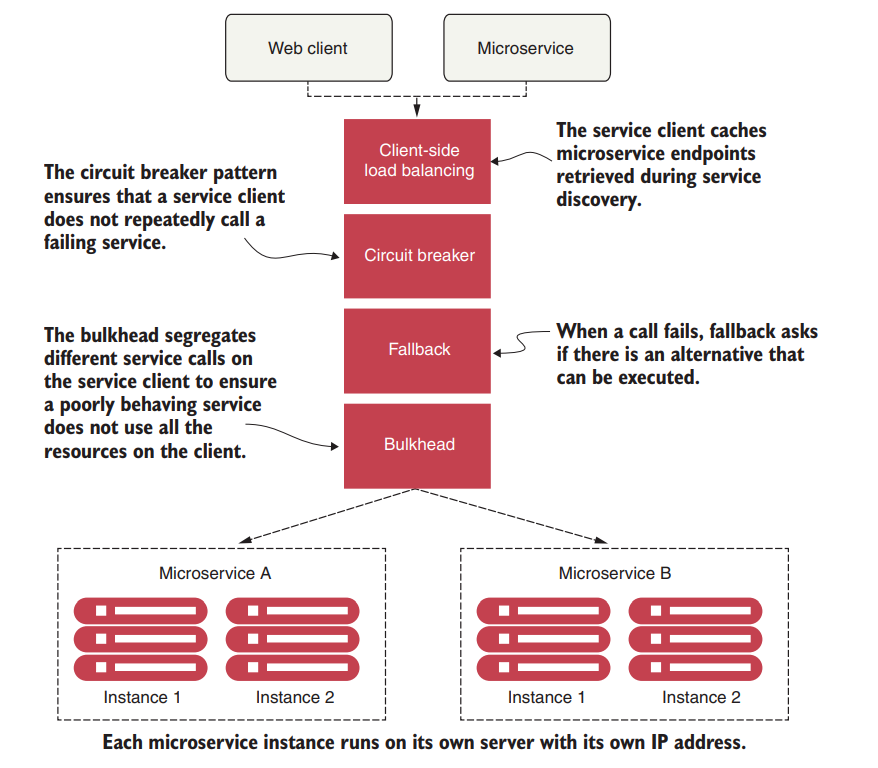
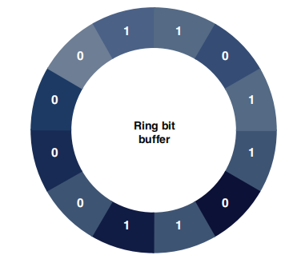

# 弹性

[TOC]

## 概述

Applications are often designed to deal with complete failures of remote resources, not partial degradations. What’s insidious about problems caused by poorly performing remote services is that they are not only difficult to detect but can trigger a cascading effect that can ripple throughout an entire application ecosystem.

## Client-Side Resiliency Pattern

Client-side resiliency software patterns focus on protecting a client of a remote resource from crashing when the remote resource fails because of errors or poor performance

These patterns are implemented in the client calling the remote resource. 

- *Circuit breaker*—Stops making requests when an invoked service is failing

- *Retry*—Retries a service when it temporarily fails

- *Bulkhead*—Limits the number of outgoing concurrent service requests to avoid overload.

  可以避免某类调用异常或占用过多连接资源而线程崩溃

- *Rate limit*—Limits the number of calls that a service receives at a time

- *Fallback*—Sets alternative paths for failing requests

熔断这一概念来源于电子工程中的断路器（Circuit Breaker）。在互联网系统中，当下游服务因访问压力过大而响应变慢或失败，上游服务为了保护系统整体的可用性，可以暂时切断对下游服务的调用。即**牺牲局部，保全整体**

> 服务熔断一般是某个服务（下游服务）故障引起，而服务降级一般是从整体负荷考虑；

## Resilience4j

It is important to note that Resilience4j’s retry order is as follows: 

~~~java
Retry(CircuitBreaker(RateLimiter(TimeLimiter(Bulkhead(Function)))))
~~~

Maven依赖如下：

~~~xml
<dependency>
    <groupId>io.github.resilience4j</groupId>
    <artifactId>resilience4j-spring-boot2</artifactId>
</dependency>
<dependency>
    <groupId>io.github.resilience4j</groupId>
    <artifactId>resilience4j-circuitbreaker</artifactId>
</dependency>
<dependency>
    <groupId>io.github.resilience4j</groupId>
    <artifactId>resilience4j-ratelimiter</artifactId>
</dependency>
<dependency>
    <groupId>io.github.resilience4j</groupId>
    <artifactId>resilience4j-retry</artifactId>
</dependency>
<dependency>
    <groupId>io.github.resilience4j</groupId>
    <artifactId>resilience4j-bulkhead</artifactId>
</dependency>
<dependency>
    <groupId>io.github.resilience4j</groupId>
    <artifactId>resilience4j-cache</artifactId>
</dependency>
<dependency>
    <groupId>io.github.resilience4j</groupId>
    <artifactId>resilience4j-timelimiter</artifactId>
</dependency>
~~~

### Circuit Breaker

In Resilience4j, the circuit breaker is implemented via a finite state machine with three normal states. 

Initially, the Resilience4j circuit breaker starts in a closed state. The closed state uses a ring bit buffer to store the success or failure status of the requests. When a successful request is made, the circuit breaker saves a 0 bit in the ring bit buffer. otherwise it saves a 1 bit

 To calculate a failure rate, the ring must be full. When the circuit breaker is in the open state, all calls are rejected during a configurable time, and the circuit breaker throws a `CallNotPermittedException`. Once the configuration time expires, the circuit breaker changes to the half-open state and allows a number of requests to see if the service is still unavailable. 

In the half-open state, the circuit breaker uses another configurable ring bit buffer to evaluate the failure rate. If this new failure rate is above the configured threshold, the circuit breaker changes back to open;

 Also, in the Resilience4j circuit breaker pattern, you can define the following additional states.

- *DISABLED*—Always allow access
- *FORCED_OPEN*—Always deny access

the only way to exit from the these states is to reset the circuit breaker or trigger a state transition

Resilience4j and Spring Cloud use @CircuitBreaker to mark the Java class methods managed by a Resilience4j circuit breaker.

~~~java
@CircuitBreaker(name = "licenseService") 
public List<License> getLicensesByOrganization(String organizationId) {
 	return licenseRepository.findByOrganizationId(organizationId);
}
~~~

By default, the circuit breaker exposes the configuration in the Spring Boot Actuator health service. 

CircuitBreaker的配置文件如下：

~~~yml
 instances:
 	# The name  given to the circuit breaker in the annotation
     licenseService: 	
         registerHealthIndicator: true 
         ringBufferSizeInClosedState: 5 
         ringBufferSizeInHalfOpenState: 3 
         waitDurationInOpenState: 10s 
         failureRateThreshold: 50 
         recordExceptions: 
             - org.springframework.web.client.HttpServerErrorException
             - java.io.IOException
             - java.util.concurrent.TimeoutException
             - org.springframework.web.client.ResourceAccessException
	organizaionService: 
         registerHealthIndicator: true
         ringBufferSizeInClosedState: 6
         ringBufferSizeInHalfOpenState: 4
         waitDurationInOpenState: 20s
         failureRateThreshold: 60
~~~

|                   配置属性                   |   默认值    | 描述                                                         |
| :------------------------------------------: | :---------: | ------------------------------------------------------------ |
|             failureRateThreshold             |     50      | 失败请求百分比,超过这个比例,CircuitBreaker就会变成OPEN状态   |
|          slowCallDurationThreshold           |  60000(ms)  | 慢调用时间,当一个调用慢于这个时间时，会被记录为慢调用        |
|            slowCallRateThreshold             |     100     | 当慢调用达到这个百分比的时候,CircuitBreaker就会变成OPEN状态  |
|    permittedNumberOfCallsInHalfOpenState     |     10      | 当CircuitBreaker处于HALF_OPEN状态的时候,允许通过的请求数量   |
|              slidingWindowType               | COUNT_BASED | 滑动窗口类型:COUNT_BASED代表是基于计数的滑动窗口,TIME_BASED代表是基于计时的滑动窗口 |
|              slidingWindowSize               |     100     | 滑动窗口大小,如果配置COUNT_BASED默认值100就代表是最近100个请求,如果配置TIME_BASED代表记录:最近100s的请求. |
|             minimumNumberOfCalls             |     100     | 最小请求个数.只有在滑动窗口内,请求个数达到这个个数,才会触发CircuitBreaker对于是否打开断路器的判断 |
|           waitDurationInOpenState            |  60000(ms)  | 从OPEN状态变成HALF_OPEN状态需要的等待时间                    |
| automaticTransitionFromOpenToHalfOpenEnabled |    false    | 如果设置为true代表:是否自动从OPEN状态变成HALF_OPEN,即使没有请求过来. |
|               recordExceptions               |    empty    | 需要记录为失败的异常列表                                     |
|               ignoreExceptions               |    empty    | 需要忽略的异常列表                                           |

###  Fallback processing

~~~java
@CircuitBreaker(name= "licenseService", fallbackMethod= "buildFallbackLicenseList") 
public List<License> getLicensesByOrganization(String organizationId) throws TimeoutException {
    
}

// This method must reside in the same class as the original method that was protected by @CircuitBreaker.
//we need to create a method that contains the same signature as the originating function plus one extra parameter, which is the target exception parameter
private List<License> buildFallbackLicenseList(String organizationId, Throwable t){
	// 返回 dummy 数据
}
~~~

### bulkhead pattern

Resilience4j provides two different implementations of the bulkhead pattern.

- *Semaphore bulkhead*—Uses a semaphore isolation approach, limiting the number of concurrent requests to the service. Once the limit is reached, it starts rejecting requests.
- *Thread pool bulkhead*—Uses a bounded queue and a fixed thread pool. This approach only rejects a request when the pool and the queue are full. 

Resilience4j, by dfault, uses the semaphore bulkhead type.

配置如下：

~~~yml
# 信号量舱壁
resilience4j.bulkhead:
    instances:
    	bulkheadLicenseService:
    		maxWaitDuration: 10ms 
    		maxConcurrentCalls: 20 
    		
# 线程池舱壁
resilience4j.thread-pool-bulkhead:
	instances:
		bulkheadLicenseService:
            maxThreadPoolSize: 1 
            coreThreadPoolSize: 1 
            queueCapacity: 1 
            keepAliveDuration: 20ms
~~~

- maxWaitDuration—Sets the maximum amount of time to block a thread when entering a bulkhead. The default value is 0.
- maxConcurrentCalls—Sets the maximum number of concurrent calls allowed by the bulkhead. The default value is 25.
- maxThreadPoolSize—Sets the maximum thread pool size. The default value is `Runtime.getRuntime().availableProcessors().`
- coreThreadPoolSize—Sets the core thread pool size. The default value is `Runtime.getRuntime().availableProcessors().`
- queueCapacity—Sets the wait capacity of the queue. The default value is 100.
- KeepAliveDuration—Sets the maximum time that idle threads will wait for new tasks before terminating. This happens when the number of threads is higher than the number of core threads. The default value is 20 ms.

What’s the proper sizing for a custom thread pool?

`(requests per second at peak when the service is healthy * 99th percentile latency in seconds) + small amount of extra threads for overhead`