# Spring Cloud 初步

[TOC]

## 微服务是什么？


Microservice is  a **distributed, loosely coupled** software service that carries out a small number of well-defined tasks. 

微服务架构和其他常见架构：

- **N-tier architecture**：With this design, an applications is divided into multiple layers, each with their own responsibilities and functions, such as UI, services, data, testing, and so forth. As you create your application, you make a specific project or solution for the UI, then another one for the services, another for the data layer, and so on. In the end, you will have several projects that, combined, create an entire application. n-tier applications have many advantages, including these:

  - N-tier applications offer good separation of concerns. making it possible to consider areas like UI (user interface), data, and business logic separately.

  N-tier applications also have drawbacks:

  - You must stop and restart the entire application when you want to make a change.
  - Messages tend to pass up and down through the layers, which can be inefficient.

- **monolithic architectural**：All of the UI, business, and database access logic are packaged together into a unique application and deployed to an application server.   Monolithic architectures have all processes tightly coupled, and these run as a single servic

  Each development team is responsible for their own discrete piece of the application that usually targets specific customers. 

  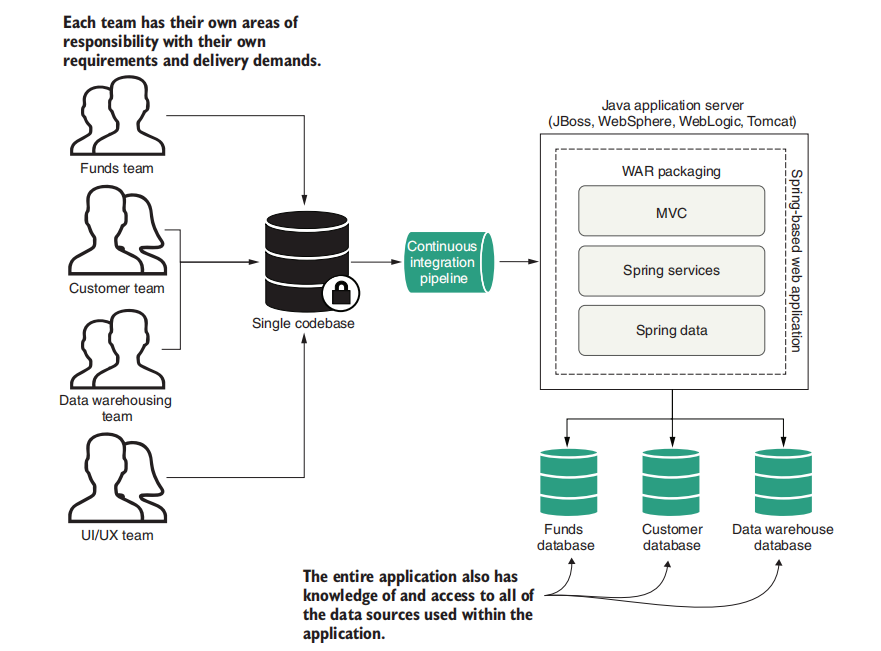

  Monoliths are easier to build and deploy than more complex architectures like n-tier or microservices.  When an application begins to increase in size and complexity, however, monoliths can become difficult to manage. Each change to a monolith can have a cascading effect on other parts of the application, which may make it time consuming and expensive, especially in a production system. 

- **microservice**：The key concepts you need to embrace as you think about microservices are **decomposing** and **unbundling**. 

  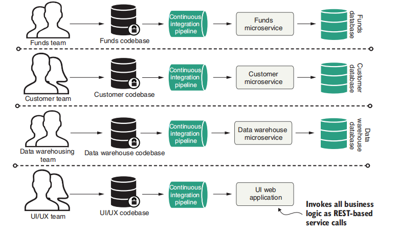

  a microservice architecture has the following characteristics:

  - 应用被拆分为细粒度的组件，该组件具有良好的定义以及清晰的责任边界。 Each component has a small domain of responsibility and is deployed independently of the others. **A single microservice is responsible for one part of a business domain.** 
  - Microservices employ lightweight communication protocols such as HTTP and JSON (JavaScript Object Notation) for exchanging data between the service consumer and service provider. Because microservice applications always communicate with a technology-neutral format (JSON is the most common), **the underlying technical implementation of the service is irrelevant.** This means that an application built using a microservice approach can be constructed with multiple languages and technologies.

Figure 1.3 compares a monolithic design with a microservices approach for a typical small e-commerce application. 

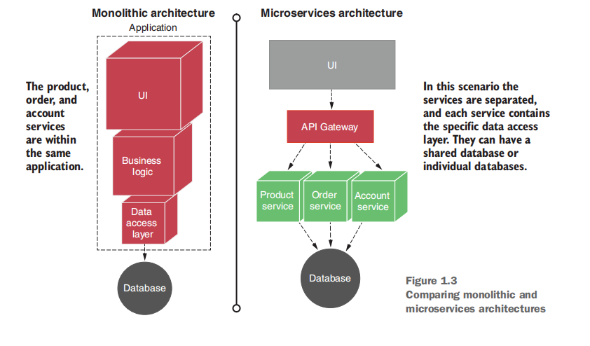

***Small, Simple, and Decoupled Services = Scalable, Resilient, and Flexible Applications***

- **Flexible**（灵活性）—Decoupled services can be composed and rearranged to quickly deliver new functionality. 
- **Resilient**（健壮性）— Failures can be localized to a small part of the application. This also enables the application to degrade gracefully in case of an unrecoverable error.
- **Scalable**（可扩展）—Decoupled services can easily be distributed horizontally across multiple servers, making it possible to scale the features/services appropriately. 

 Conway’s law states that

> “Organizations which design systems . . . are constrained to produce designs which are copies of the communication structures of these organizations.” 

Basically, what that indicates is that the way teams communicate within the team and with other teams is directly reflected in the code they produce. we can apply **Conway’s law** in reverse by using microservice. 


Figure 1.4 shows a high-level overview of some of the services and technology integrations that we will use throughout the book

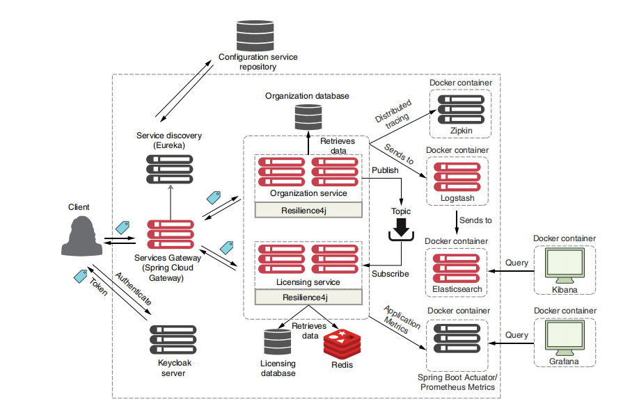


## 例子：基于SpringBoot构建的REST Service

Spring Boot simplifies the building of REST-based/JSON microservices

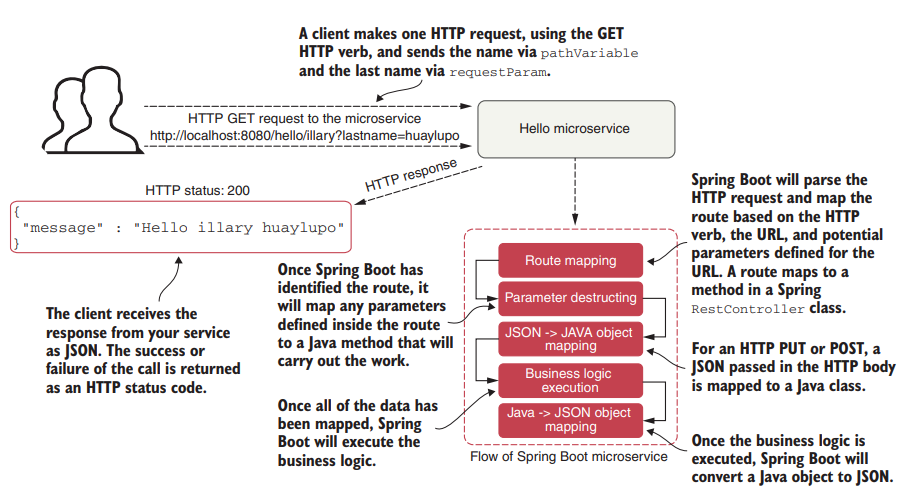

~~~java
@SpringBootApplication
@RestController
@RequestMapping(value="hello")
public class SimpleApplication {

    public static void main(String[] args) {
        SpringApplication.run(SimpleApplication.class, args);
    }

    //  you’re basically exposing one endpoint with a GET HTTP verb that takes two parameters (firstName and lastName) on the URL: one from the path variable (@PathVariable) and another one as the request parameter (@RequestParam)
    // http://localhost:8080/hello/Ruofan?lastName=Gao
    @GetMapping(value="/{firstName}")
    public String helloGET(
        @PathVariable("firstName") String firstName,
        @RequestParam("lastName") String lastName) {
        return String.format("{\"message\":\"Hello %s %s\"}",firstName, lastName);
    }

    @PostMapping
    public String helloPOST( @RequestBody HelloRequest request) {
        return String.format("{\"message\":\"Hello %s %s\"}",request.getFirstName(), request.getLastName());
    }
}
~~~


## 云计算是什么？

人们谈及微服务的时候，总是把它和云计算关联起来。那么它们俩之间存在何种关系呢？首先我们来认识一下云计算。

**「Cloud computing 」**is the delivery of computing and virtualized IT services—databases, networking, software, servers, analytics, and more—through the internet to provide a flexible, secure, and easy-to-use environment

 The cloud computing models let the user choose the level of control over the information and services that these models provide. These models are known by their acronyms, and are generically referred to as **XaaS**—an acronym that means anything as a service.The following lists the most common cloud computing models：

- 「**Infrastructure as a Service (IaaS)**」—The vendor provides the infrastructure that lets you access computing resources such as servers, storage, and networks. In this model, the user is responsible for everything related to the maintenance of the infrastructure and the scalability of the application. 

  > IaaS platforms include AWS (EC2), Azure Virtual Machines, Google Compute Engine, and Kubernetes

- **「Container as a Service (CaaS)」**—Unlike an IaaS model, where a developer manages the virtual machine to which the service is deployed, with CaaS, you deploy your microservices in a lightweight, portable virtual container (such as Docker) to a cloud provider. The cloud provider runs the virtual server the container is running on, as well as the provider’s comprehensive tools for building, deploying, monitoring, and scaling containers

  > CaaS platforms include Google Container Engine (GKE) and Amazon’s Elastic Container Service (ECS）

- **「Platform as a Service (PaaS)」**— This model provides a platform and an environment that allow users to focus on the development, execution, and maintenance of the application. Service Provider gives you the ability to deploy your services without having to know about the underlying application container. These provide a web interface and command-line interface (CLI) to allow you to deploy your application as a WAR or JAR file. 

  > PaaS platforms include Google App Engine, Cloud Foundry, Heroku, and AWS Elastic Beanstalk.

- **「Function as a Service (FaaS)」**— Serverless architecture allows us to focus only on the development of services without having to worry about scaling, provisioning（配置）, and server administration. Instead, we can solely concentrate on uploading our functions without handling any administration infrastructure. 

  > NOTE：If you’re not careful, FaaS-based platforms can lock your code into a cloud vendor platform because your code is deployed to a vendor-specific runtime engine. With a FaaS-based model, you might be writing your service using a general programming language (Java, Python, JavaScript, and so on), but you’re still tying yourself to the underlying vendor’s APIs and runtime engine that your function will be deployed to.

  > FaaS platforms include AWS (Lambda), Google Cloud Function, and Azure functions

- **「Software as a Service (SaaS)」**：Also known as software on demand, this model allows users to use a specific application without having to deploy or to maintain it. In most cases, the access is through a web browser（RESTful request）. Everything is managed by the service provider: application, data, operating system, virtualization, servers, storage, and network

  > SaaS platforms include Salesforce, SAP, and Google Business.

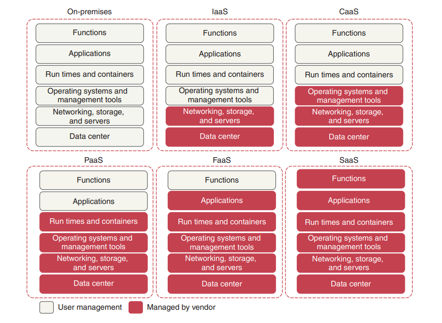


One of the core concepts of a microservice architecture is that each service is packaged and deployed as its own discrete and independent artifact. Service instances should be brought up（启动） quickly, and each should be indistinguishable（无差别的） from another. When writing a microservice, sooner or later you’re going to have to decide whether your service is going to be deployed to one of the following

- **Physical server**— 如果要在原有物理服务器基础上进行微服务的横向扩展，成本可能会变得非常高。横向扩展指的是增加更多的服务器以提高系统的处理能力，而不是增加单台服务器的性能（称为纵向扩展）。在物理服务器上进行横向扩展会涉及到很多成本，包括硬件购置、软件许可、能源消耗、网络设施、维护人员以及管理软件等开销。
- **Virtual machine images**—One of the key benefits of microservices is their ability to quickly start up and shut down instances in response to scalability and service failure events. Virtual machines (VMs) are the heart and soul of the major cloud providers. 
- **Virtual container**—Virtual containers are a natural extension of deploying your microservices on a VM image. Rather than deploying a service to a full VM, many developers deploy their services as Docker containers (or equivalent container technology) to the cloud. Virtual containers run inside a VM, and using a virtual container, you can segregate a single VM into a series of self-contained processes that share the same image


云基础微服务的优势主要围绕**「弹性（elasticity）」**这一概念来展开的。-

- Server elasticity means that your applications can be more resilient. 如果微服务由于Bug导致下线，那么我们可以迅速再次启动该微服务来保证服务的可用性，同时争取到足够长的时间来修复Bug

- 弹性可以让我们动态地使用服务器资源（横向扩展），避免资源的浪费。

  

 For this book, **all the microservices and corresponding service infrastructure will be deployed to a CaaS-based cloud provider using Docker containers**. The most common characteristics of CaaS cloud providers are as follows：

- **「Simplified infrastructure management」**：New services can be started and stopped with simple API calls.
- **「Massive horizontal scalability」**：CaaS cloud providers allow you to quickly and succinctly start one or more instances of a service.
- **「High redundancy through geographic distribution」**：—By necessity, CaaS providers have multiple data centers. By deploying your microservices using a CaaS cloud provider, you can gain a higher level of redundancy beyond using clusters in a data center.

The services built in this book are packaged as Docker containers; the main reason is that Docker is deployable to all major cloud providers. 

## 微服务模式

Microservices are more than writing the business code. Writing a robust service includes considering several topics：

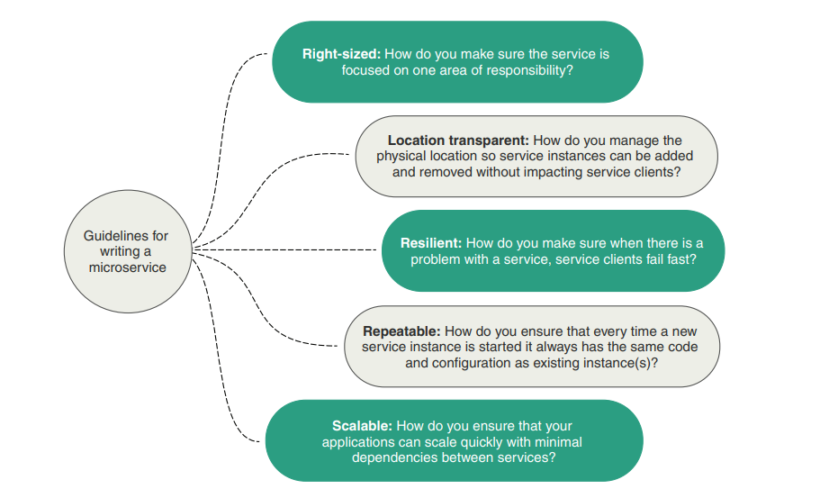


上面这几个问题都可以通过微服务模式来解决。微服务模式主要用来解决分布式系统设计和管理的问题。具体包括：

- **Core development pattern**
- **Client resiliency patterns**
- **Logging and tracing patterns**
- **Build and deployment pattern**
- **Routing patterns**
- **Security patterns**
- **Application metrics patterns**


### Core microservice development pattern


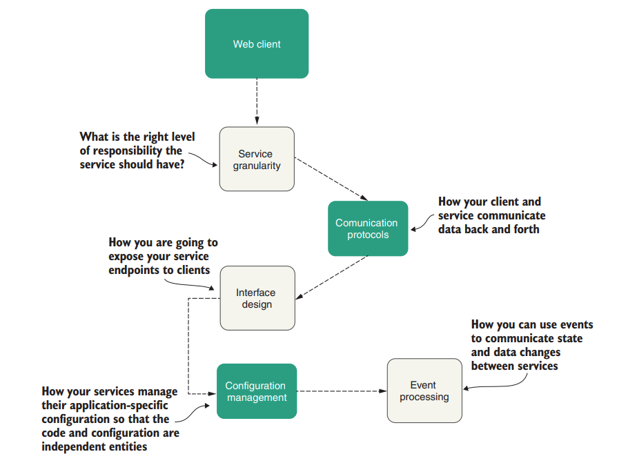

The core microservice development pattern addresses the basics of building a microservice.

- **「Service granularity」**服务粒度：Making a service too coarse-grained with responsibilities that overlap into different business-problems domains makes the service difficult to maintain and change over time. Making the service too fine-grained increases the overall complexity of the application and turns the service into a “dumb” （笨拙的）data abstraction layer with no logic except for that needed to access the data store.
- **「Communication protocols」**通信协议：How will developers communicate with your service? The first step is to define whether you want a synchronous or asynchronous protocol. 
  - **For synchronous,** the most common communication is HTTP-based REST using **XML (Extensible Markup Language)**, **JSON (JavaScript Object Notation)**, or a binary protocol such as **Thrift** to send data back and forth to your microservices. 
  - **For asynchronous,** the most popular protocol is AMQP (Advanced Message Queuing Protocol) using a one-to-one (queue) or a one-to-many (topic) with message brokers such as **RabbitMQ**, **Apache Kafka**, and **Amazon Simple Queue Service (SQS).** 
- xxxxxxxxxx $ docker-compose up -dshell
- **「Configuration management of service」**服务的配置管理：How do you manage the configuration of your microservice so that it moves between different environments in the cloud?
- **「Event processing between services」**服务之间的事件处理：How do you decouple your microservice using events so that you minimize hardcoded dependencies between your services and increase the resiliency of your application?

### Microservice routing patterns

The microservice routing patterns deal with how a client application that wants to consume a microservice discovers the location of the service and is routed over to it. 

In a cloud-based application, it is possible to have hundreds of microservice instances running. To enforce security and content policies, it is required to abstract the physical IP address of those services and have a single point of entry for the service calls. How? The following patterns are going to answer that question.

- **「Service Discovery」**：With service discovery and its key feature, service registry, you can make your microservice discoverable so client applications can find them without having the location of the service hardcoded into their application. Remember the service discovery is an internal service, not a client-facing service.

  **Note that in this book, we use Netflix Eureka Service Discovery**, but there are other service registries such as etcd, Consul, and Apache Zookeeper.

- **「Service routing」：**With an API Gateway, you can provide a single entry point for all of your services so that security policies and routing rules are applied uniformly to multiple services and service instances in your microservices application

服务发现主要关注如何找到服务，而服务路由关注的是如何达到这些服务。

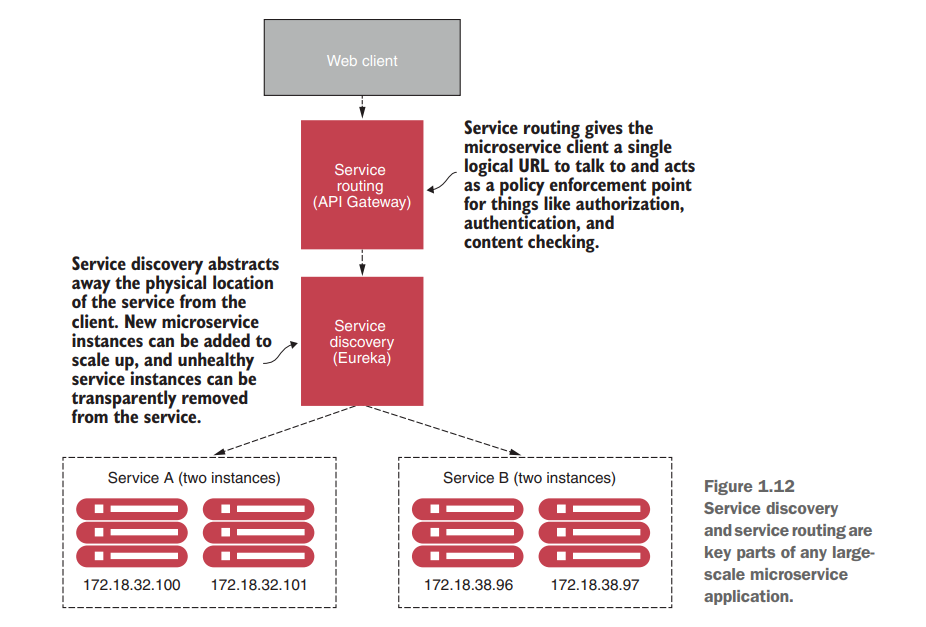


### Microservice client resiliency（容错与韧性）

To prevent a problem in a service instance from cascading up and out to the consumers of the service, use the client resiliency patterns

- **Client-side load balancing**（**负载均衡**）：How you cache the location of your service instances on the service so that calls to multiple instances of a microservice are load balanced to all the health instances of that microservice
- **Circuit breaker pattern**（**熔断器模式**）：How you prevent a client from continuing to call a service that’s failing or suffering performance problems. When a service is running slowly, it consumes resources on the client calling it. You want these microservice calls to fail fast so that the calling client can quickly respond and take appropriate action.
- **Fallback pattern**：When a service call fails, how you provide a “plug-in” mechanism that allows the service client to try to carry out its work through alternative means other than the microservice being called.
- **Bulkhead pattern**（隔舱模式）：Microservice applications use multiple distributed resources to carry out their work. This pattern refers to how you compartmentalize（隔离） these calls so that the misbehavior of one service call doesn’t negatively impact（负面影响） the rest of the application


###  Microservice security patterns

it is important to apply the following security patterns to the architecture in order to ensure that only granted requests with proper credentials can invoke the services

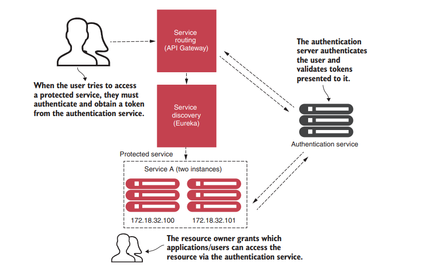

- **Authentication**—How you determine the service client calling the service is who they say they are
- **Authorization**—How you determine whether the service client calling a microservice is allowed to undertake the action they’re trying to take
- **Credential management and propagation**—How you prevent a service client from constantly having to present their credentials for service calls involved in a transaction.（避免反复授权验证） To achieve this, we’ll look at how you can use token-based security standards such as **OAuth2** and **JSON Web Tokens (JWT)** to obtain a token that can be passed from service call to service call to authenticate and authorize the user.

> OAuth2 is a token-based security framework that allows a user to authenticate themselves with a third-party authentication service. If the user successfully authenticates, they will be presented with a token that must be sent with every request.  The main goal behind OAuth2 is that when multiple services are called to fulfill a user’s request, the user can be authenticated by each service without having to present their credentials to each service processing their request.


### Microservice logging and tracing patterns

The downside of a microservice architecture is that it’s much more difficult to debug, trace, and monitor the issues because one simple action can trigger numerous microservice calls within your application. The following three core logging and tracing patterns to achieve distributed tracing:

- **Log correlation **日志相关性：How you tie together all the logs produced between services for a single user transaction
- **Log aggregation ** 日志聚合性：With this pattern, we’ll look at how to pull together all of the logs produced by your microservices into a single queryable database across all the services involved
- **Microservice tracing**：We’ll explore how to visualize the flow of a client transaction across all the services involved and understand the performance characteristics of the transaction’s services.

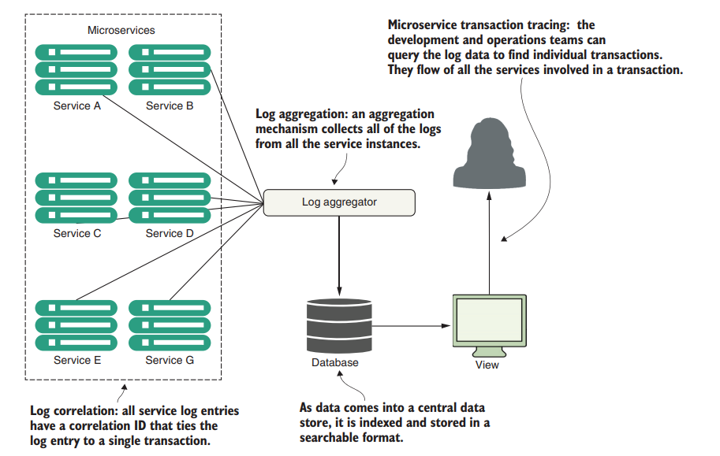


we can o implement distributed tracing with Spring Cloud Sleuth, Zipkin, and the ELK Stack. t

###  Application metrics pattern

The application metrics pattern deals with how the application is going to monitor metrics and warn of possible causes of failure within our applications or performance issues. 

This pattern contains the following three main components:

- Metrics—How you create critical information about the health of your application and how to expose those metrics
- Metrics service—Where you can store and query the application metrics
- Metrics visualization suite—Where you can visualize business-related time data for the application and infrastructur


The metrics service can obtain the metrics using the pull or push style: 

- **With the push style**, the service instance invokes a service API exposed by the metrics service in order to send the application data.
- **With the pull style**, the metrics service asks or queries a function to fetch the application data.

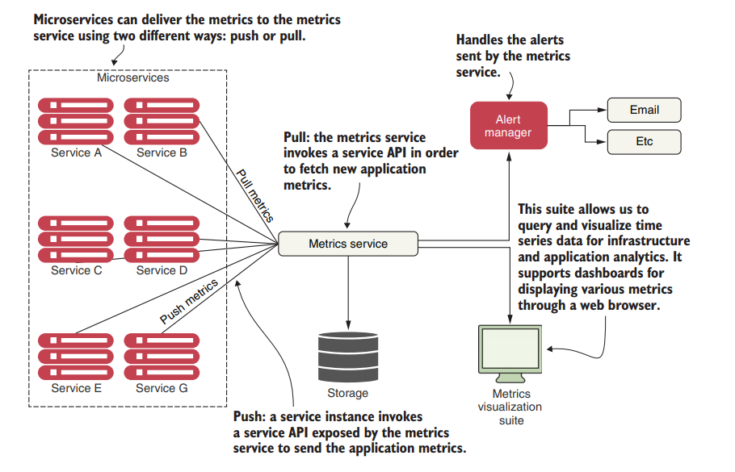


### Microservice build/deployment patterns

One of the core parts of a microservice architecture is that each instance of a microservice should be identical to all its other instances. You can’t allow **configuration drift** (something changes on a server after it’s been deployed) to occur because this can introduce instability in your applications.

这种模式的目标是将你的基础设施配置直接整合到你的构建/部署过程中。你需要将你的微服务和它运行的虚拟服务器镜像作为构建过程的一部分进行构建和编译。然后，当你的微服务被部署时，整个搭载了运行服务的机器镜像就会一起部署。

- **「Build and deployment pipelines」**：How you create a repeatable build and deployment process that emphasizes one-button（一键式） builds and deployment to any environment in your organization.
- **「Infrastructure as code」**：How you treat the provisioning of your services as code that can be executed and managed under source control（源代码管理）
- **「Immutable servers」**：Once a microservice image is created, how you ensure that it’s never changed after it has been deployed.
- **「Phoenix servers」**：How you ensure that servers that run individual containers get torn down on a regular basis（定期被关闭） and re-created from an immutable image. The longer a server is running, the more opportunity there is for configuration drift. A configuration drift can occur when ad hoc changes（临时的改变） to a system configuration are unrecorded.

Our goal with these patterns and topics is to ruthlessly expose and stamp out（无情地暴露并消除） configuration drift as quickly as possible before it can hit your upper environments (stage or production).

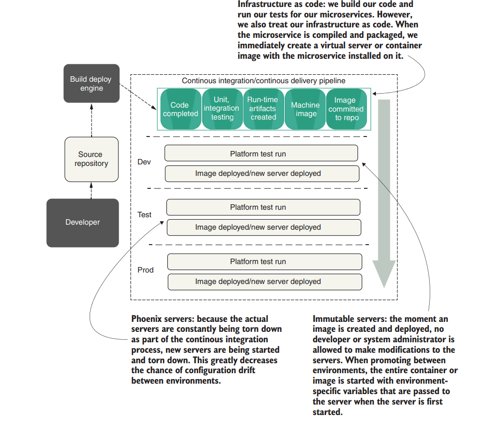

## Microservices with SpringCloud

> The more distributed a system is, the more places it can fail.


实现所有微服务模式将需要大量的工作。幸运的是，Spring团队将大量经过实战测试的开源项目整合到一个称为Spring Cloud的Spring子项目中(https://projects.spring.io/spring-cloud/).。Spring Cloud提供一组特性（如服务注册和发现、断路器、监控等），使我们能够快速构建需要最少配置的微服务架构，这正是Spring Cloud背后的真正优雅之处。


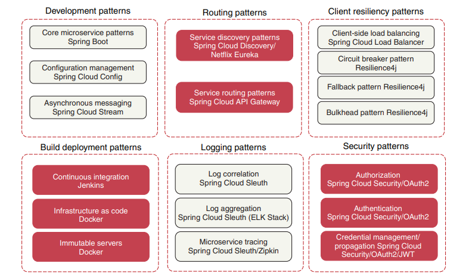


- **Spring Cloud Config**：Spring Cloud Config通过中心化的服务管理应用配置数据。你的应用配置数据（尤其是特定环境配置数据）被整洁地从部署的微服务中分离出来。这确保无论你启动多少微服务实例，他们的配置总是一致的。Spring Cloud Config有自己的属性管理库，也整合了如下的开源项目：

  - Git (https://git-scm.com/)：Spring Cloud Config integrates with a Git backend repository and reads the application’s configuration data from the repository
  - Consul (https://www.consul.io/)：—An open source service discovery that allows service instances to register themselves with a service. Service clients can then query Consul to find the location of their service instances. Consul also includes a key-value store database that Spring Cloud Config uses to store application configuration data.
  - Eureka (https://github.com/Netflix/eureka)：An open source Netflix project that, like Consul, offers similar service discovery capabilities. Eureka also has a key-value database that can be used with Spring Cloud Config.

- **Spring Cloud Service Discovery**：With Spring Cloud Service Discovery, you can abstract away the physical location (IP and/or server name) of where your servers are deployed from the clients consuming the service. Spring Cloud Service Discovery also handles the registration and deregistration of service instances as these are started and shut down. Spring Cloud Service Discovery can be implemented using the following services:

  - Consul (https:// www.consul.io/)
  - Zookeeper (https://spring.io/projects/spring-cloud-zookeeper)
  - Eureka (https://github.com/Netflix/eureka) 

- **Spring Cloud LoadBalancer and Resilience4j**：

  - **Resilience4j**（ https://github.com/resilience4j/resilience4j） —you can quickly implement service client resiliency patterns such as circuit breaker, retry, bulkhead, and more. 
  - **Spring Cloud LoadBalance** —While the Spring Cloud LoadBalancer project simplifies integrating with service discovery agents such as Eureka, it also provides client-side load balancing of calls from a service consumer

- **Spring Cloud API Gateway**：The API Gateway provides service-routing capabilities for your microservice application. Like the name says, it is a service gateway that proxies service requests and makes sure that all calls to your microservices go through a single “front door” before the targeted service is invoked. With this centralization of service calls, you can enforce standard service policies such as security authorization, authentication, content filtering, and routing rules. You can implement the API Gateway using Spring Cloud Gateway (https://spring.io/projects/spring-cloud-gateway).

- **Spring Cloud Stream**—Using Spring Cloud Stream, you can build intelligent microservices that use asynchronous events. You can also quickly integrate your microservices with message brokers such as RabbitMQ (https://www.rabbitmq .com) and Kafka (http://kafka.apache.org).

- **Spring Cloud Sleuth**—Spring Cloud Sleuth (https://cloud.spring.io/spring-cloud-sleuth/) lets you integrate **unique tracking identifiers**（correlation ID or  trace ID） into the HTTP calls and message channels (RabbitMQ, Apache Kafka) used within your application.  The real beauty of Spring Cloud Sleuth is seen when it’s combined with loggingaggregation technology tools like the ELK Stack (https://www.elastic.co/what-is/ elk-stack) and tracking tools like Zipkin (http://zipkin.io).

  The ELK Stack is the acronym for three open source projects: 

  - **Elasticsearch** (https://www.elastic.co) is a search and analytics engine. 
  - **Logstash** (https://www.elastic.co/products/logstash) is a server-side, data-processing pipeline that consumes data and then transforms it in order to send it to a “stash.”
  - **Kibana** (https://www.elastic.co/products/kibana) is a client UI that allows the user to query and visualize the data of the whole stack. 

- **Spring Cloud Security**：Spring Cloud Security (https://cloud.spring.io/spring-cloud-security/) is an authentication（认证） and authorization（授权） framework that controls who can access your services and what they can do with them. Because Spring Cloud Security is token-based, it allows services to communicate with one another through a token issued by an authentication server. Each service receiving an HTTP call can check the provided token to validate the user’s identity and their access rights. 

  Spring Cloud Security also supports JSON Web Tokens (JWT). JWT (https://jwt.io) standardizes the format for creating an OAuth2 token and normalizes digital signatures for a generated token.


## 云原生微服务


**Cloud** is a technology resource management system that lets you replace local machines and private data centers by using a **virtual infrastructure**. There are several levels or types of cloud applications：

- A **cloud-ready** application：A cloud-ready application is an application that was once used on a computer or on an onsite server. With the arrival of the cloud, these types of applications have moved from static to dynamic environments with the aim of running in the cloud. we need to externalize the application’s configuration so that it quickly adapts to different environments. By doing this, we can ensure the application will run on multiple environments without changing any source code during the builds. （是将传统应用无缝移植到云环境的一种技术）

- A **cloud-native** application is designed specifically for a cloud computing architecture to take advantage of all of its benefits and services.  When creating this type of application, developers divide the functions into microservices with scalable components like containers, enabling these to run on several servers. These services are then managed by virtual infrastructures through the DevOps processes with continuous delivery workflows.

  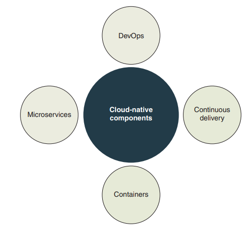

- ......


 The four principles of native cloud development are：

- **DevOps is the acronym for development (Dev) and operations (Ops)**：It refers to a software development methodology that focuses on communication, collaboration, and integration among software developers and IT operations. The main goal is to automate the software delivery processes and infrastructure changes at lower costs.
- **Microservices are small, loosely coupled, distributed services**：These allow you to take a large application and decompose it into easy-to-manage components with narrowly defined responsibilities.
- **Continuous delivery is a software development practice.**：With this practice, the process of delivering software is automated to allow short-term deliveries to a production environment.
- **Containers are a natural extension of deploying your microservices on a virtual machine (VM) image**：Rather than deploying a service to a full VM, many developers deploy their services as Docker containers (or similar container technology) to the cloud.


## Twelve-Factor App

In order to build high-quality microservices, we will use Heroku’s best practice guide—called **the twelve-factor app**(https://12factor.net/)


- **Codebase**：With this practice, each microservice should have a single, source-controlled codebase. the server provisioning information should be in version control as well.Remember, **version control** is the management of changes to a file or set of files. 

  The codebase can have multiple instances of deployment environments. 每个微服务都应该有自己独立的代码库。如果所有的微服务公用一个代码库，每当一个微服务需要更新时，都会产生一个不可更改的新版本。这会导致大量的版本产生，每个环境都有多个版本，管理和追踪将会变得非常复杂。

  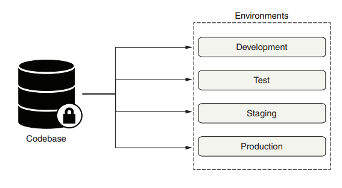

- **Dependencies**：This best practice explicitly declares the dependencies your application uses through build tools like Maven or Gradle (Java). 

  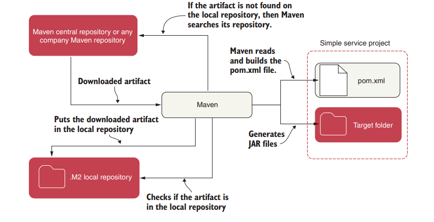

- **Config**

  This practice refers to how you store your application configurations. **Never add embedded configurations to your source code!** ，即**配置与代码分离**

  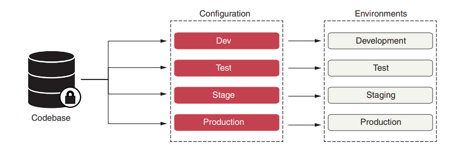

- **Backing Service**：Your microservice will often communicate over a network with databases, API RESTful services, other servers, or messaging systems. When it does, you should ensure that you can swap your deployment implementations between local and third-party connections without any changes to the application code.（有助于在发生问题时快速迁移你的服务）

- **Build, Release, Run**：

  This best practice reminds us to keep our build, release, and run stages of application deployment completely separated

  - Once our code is built, any runtime changes need to go back to the build process and be redeployed. A built service is immutable and cannot be changed. 
  - The release phase is in charge of combining the built service with a specific configuration for each targeted environment

  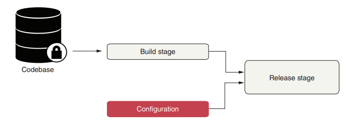

- **Processes**：**Your microservices should always be stateless**，这意味着微服务不应维护关于过去请求的任何信息。每个请求都应当独立处理，所需的所有信息都应包含在请求本身中。Microservices can be killed and replaced at any time without the fear that a loss of a service instance will result in data loss.

  虽然微服务是无状态的，但是有时候在服务实例之间共享信息是必要的。此时我们可以使用内存缓存（如Redis）来实现这一点

- **Port Binding**：Port binding means to publish services through a specific port. 

  In a microservices architecture, a microservice is completely self-contained with the run-time engine for the service packaged in the service executable. You should run the service without the need for a separate web or application server. The service should start by itself on the command line and be accessed immediately through an exposed HTTP port.

- **Concurrency**

  The concurrency best practice explains that cloud-native applications should scale out using the process model.rather than making a single significant process larger, we can create multiple processes and then distribute the service’s load among different processes. 

  - **Vertical scaling** (scale up) refers to increasing the hardware infrastructure (CPU, RAM). 
  - **Horizontal scaling** (scale out) refers to adding more instances of the application. 

  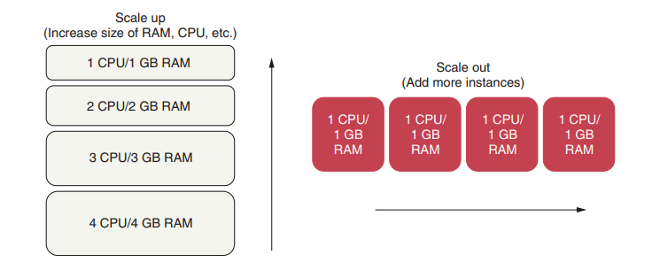

- **Disposability**（一次性）：Microservices are disposable and can start and stop on demand in order to facilitate elastic scaling and to quickly deploy application code and configuration changes. 

- **Dev/Prod Parity**（开发环境与线上环境是等同的）：This best practice refers to having different environments (for example, development, staging, production) as analogous（相似的） as possible. This can be done with continuous deployment.

- **Logs**：Logs are a stream of events. As these are written, logs should be managed by tools such as Logstash (https://www.elastic.co/logstash) . The microservice should never be concerned about the mechanisms of how this happens. It only needs to focus on writing the log entries into the standard output (stdout). 

  

- **Admin Processes**：Developers will often have to do administrative tasks for their services (data migration or conversion, for example). These tasks should never be ad hoc and instead should be done via scripts that are managed and maintained through a source code repository. The scripts should be repeatable and non-changing (the script code isn’t modified for each environment) across each environment they’re run against. we have multiple microservices with these scripts, we are able to execute all of the administrative tasks without having to do this manually.


## CI/CD DevOps

**持续集成（CI）**和**持续部署（CD）**是DevOps实践的一部分。它们以自动化的方式提高了软件发布的速度和质量。

- **Continuous integration (CI)** is a series of software development practices where the team members integrate their changes to a repository within a short period of time to detect possible errors and to analyze the software’s quality that they created. This is accomplished by using an automatic and continuous code check (build) that includes the execution of tests
- **continuous delivery (CD)** is a software development practice in which the process of delivering software is automated to allow short-term deliveries into a production environment.

When we apply these processes to our microservices architecture, it’s essential to keep in mind that there should **never be a “waiting list”** for integration and release to production


CI/CD流程一般如下

1. 开发人员在本地编写代码。
2. 开发人员将代码提交到版本控制系统（例如：Git）中。
3. CI服务器定期（或在每次代码提交后）从版本控制系统中拉取代码，并进行构建和测试。（CI）
4. 如果所有测试通过，系统将自动将新代码部署到生产环境。（CD）

这样做有以下几个好处

- **错误识别**：尽早的测试可以帮助我们尽快发现和修复错误
- **快速反馈**：当代码从开发环境提升到生产环境后，可以使得开发者得到更快的客户反馈。


## REST API

We’ve found the following guidelines useful for naming service endpoints:

- **Use clear URL names that establish what resource the service represents**

- **Use the URL to establish relationships between resources.**   

  在RESTful API中，每个资源都可以被看作是一个最小的独立单元。这些资源之间的关系可以用不同的方式进行建模，例如父子关系、属于关系、集合关系等。

  一种常见的关系是**父子关系**，也称为**层级关系**。例如，一个博客系统的 API 中，我们可以把文章（post）和评论（comment）看作是父子关系。每篇文章可以有多个评论，而每个评论又属于特定的文章。

  要实现这个父子关系，我们可以设计以下 API 端点：

  ```
  GET /posts - 获取所有文章
  GET /posts/{postId} - 获取特定文章
  POST /posts - 创建一篇文章
  PUT /posts/{postId} - 更新特定文章
  DELETE /posts/{postId} - 删除特定文章
  GET /posts/{postId}/comments - 获取特定文章的所有评论
  GET /posts/{postId}/comments/{commentId} - 获取特定文章的特定评论
  POST /posts/{postId}/comments - 创建一条评论
  PUT /posts/{postId}/comments/{commentId} - 更新特定评论
  DELETE /posts/{postId}/comments/{commentId} - 删除特定评论
  ```

  注意，虽然两个资源在URL上表现为嵌套关系，但是它们却对应不同的微服务。

- **Establish a versioning scheme for URLs early**

  有三种方法来进行版本控制：

  1. URI版本控制

     ~~~url
     http://api.example.com/v1
     ~~~

  2. 自定义标头（Accept-version）

  3. 使用Accept标头

     ~~~http
     Accept: application/vnd.example;version=1.0
     ~~~

     

**对于性能要求高的系统，并不适合使用 http + json 的 Rest 设计，可能要使用rpc + protobuff 的方案。**

此外，还有一些二进制传输格式可以代替json文本传输格式

- Apache Thrift框架（[http://thrift.apache.org](http://thrift.apache.org/)）
- Apache Avro协议（[http://avro.apache.org](http://avro.apache.org/)）


## Richardson Maturity Model


这个模型将实现REST方法的主要元素分解为三个步骤，包括：资源（Resources）、HTTP 动词(HTTP Verbs，如 GET 、 POST 等)和超媒体控制（Hypermedia Controls）。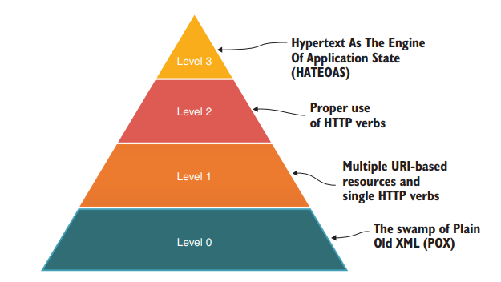

- level0：使用 http 作为传输协议。但是level0 并没有规定如何使用http协议，这会有许多设计上的问题，例如

  - 不同的接口访问同一个资源

    ~~~url
     http://example.com/createUser?name=foo
     http://example.com/getOrder?id=bar
    ~~~

  - 对资源的处理方式与 http 的动作语义产生冲突

    ~~~
     GET http://example.com/createUser?name=foo  404
     GET http://example.com/getOrder?id=bar      200
    ~~~

  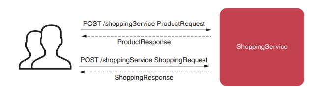

- level1：以资源为中心。在设计接口时，首先考虑的要对外暴露什么资源

  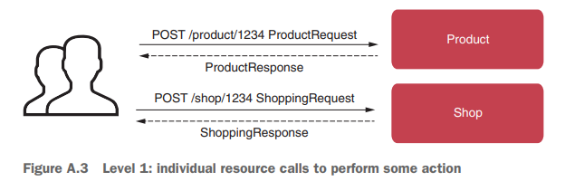

- At level 2, map the behavior of the service to standard HTTP verbs

  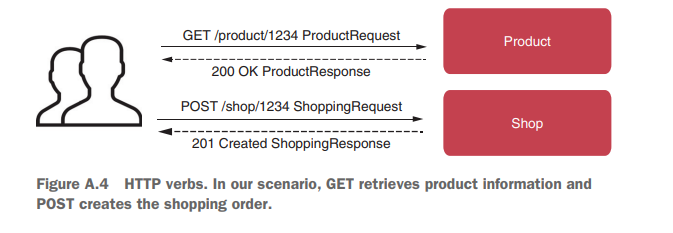

- The final level, level 3, introduces Hypertext as the Engine of Application State **(HATEOAS)**. By implementing HATEOAS, we can make our API respond with additional information about possible next steps

  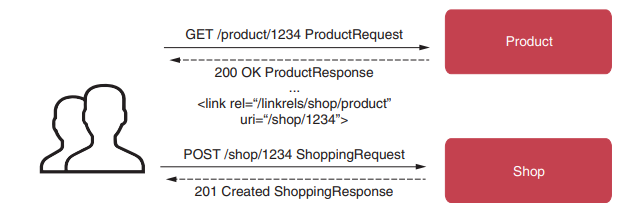


## HATEOAS

**HATEOAS** stands for **Hypermedia as the Engine of Application State**.  The HATEOAS principle states that an API should provide a guide to the client by returning information about possible next steps with each service response.

~~~json

"_links": {
    "self" : {
    	"href" : "http://localhost:8080/v1/organization/optimaGrowth/license/0235431845"
    },
    "createLicense" : {
    	"href" : "http://localhost:8080/v1/organization/optimaGrowth/license"
    },
    "updateLicense" : {
    	"href" : "http://localhost:8080/v1/organization/optimaGrowth/license"
    },
    "deleteLicense" : {
    	"href" : "http://localhost:8080/v1/organization/optimaGrowth/license/0235431845"
    }
}
~~~


Spring HATEOAS is a small project that allows us to create APIs that follow the HATEOAS principle of displaying the related links for a given resource. 依赖如下：

~~~xml
<dependency>
     <groupId>org.springframework.boot</groupId>
     <artifactId>spring-boot-starter-hateoas</artifactId>
</dependency>
~~~


在`Model`对象上继承`RepresentationModel`对象

~~~java
public class License  extends RepresentationModel<License> {
    private int id;
    private String licenseId;
    private String description;
    private String organizationId;
    private String productName;
    private String licenseType;
}

~~~


然后使用即可

~~~java
@GetMapping(value="/{licenseId}")
    public ResponseEntity<License> getLicense(
        @PathVariable("organizationId") String organizationId,
        @PathVariable("licenseId") String licenseId) {
        License license = licenseService
            .getLicense(licenseId,organizationId);

        // 关键方法
        license.add(
            linkTo(methodOn(LicenseController.class)
                .getLicense(organizationId, license.getLicenseId()))
                .withSelfRel(),
            linkTo(methodOn(LicenseController.class)
                .createLicense(organizationId, license, null))
                .withRel("createLicense"),
            linkTo(methodOn(LicenseController.class)
                .updateLicense(organizationId, license))
                .withRel("updateLicense"),
            linkTo(methodOn(LicenseController.class)
                .deleteLicense(organizationId, license.getLicenseId()))
                .withRel("deleteLicense")
        );

        return ResponseEntity.ok(license);
    }
~~~

The method add() is a method of the RepresentationModel. The linkTo method inspects the License controller class and obtains the root mapping, and the methodOn method obtains the method mapping by doing a dummy invocation of the target method. Both methods are static methods of org.springframework.hateoas.server .mvc.WebMvcLinkBuilder. WebMvcLinkBuilder is a utility class for creating links on the controller classes. 

## 架构师的职责

在构建微服务应用时，有三个重要角色

- 架构师
- 软件开发人员
- 运维人员

同样重要的是，对于你的设计，不能持有教条主义的态度。你可能会遇到物理上的限制。例如，你可能需要构建一个聚合微服务，将数据合并在一起，因为两个单独的服务会产生过多的通信。**采取务实的方式并交付成果**，而不是浪费资源让设计变得更完美。


架构师主要负责以下三个关键任务

- **Decomposing the business problem** into chunks that represent discrete domains of activity，指导原则如下

  - **Describe the business problem and notice the nouns you use to describe it**. Using the same nouns over and over in describing the problem is usually a good indication of a core business domain and an opportunity for a microservice.
  - **Pay attention to the verbs**. 这些动词（操作）突出了每个服务应完成的任务，它们代表了问题领域各部分之间的交互
  - **Look for data cohesion**（数据内聚性）. . Microservices must completely own their data.

- **Establishing service granularity**，

  指导原则如下：

  - 从宏观的微服务开始，然后重构为更小的服务。
  - 首先要关注微服务之间是如何交互的，This helps to establish the coarse-grained interfaces of your problem domain. It is easier to refactor from being too coarse-grained than from being too fine-grained.
  - Service responsibilities change over time as our understanding of the problem domain grows

  这种指导原则用一句话概括就是， **A microservices architecture should be developed with an evolutionary thought process**, 

  

  If a microservice is too coarse-grained, you’ll likely see the following:

  - **A service with too many responsibilities**
  - **A service that manages data across a large number of tables**. We like to use the guideline that a microservice should own no more than three to five tables（不包括那些处理一对多关系的表）
  - **A service with too many test cases**

  If a microservice is too fine-grained, you’ll likely see the following:

  - **The microservices in one part of the problem domain breed like rabbits**（像兔子一样繁殖）If everything becomes a microservice, composing business logic out of the services becomes complex and difficult
  - **Your microservices are heavily interdependent on one another**
  - **Your microservices become a collection of simple CRUD (Create, Replace, Update, Delete) services**

- **Defining the service interfaces**，指导原则如下：

  - **Embrace the REST philosophy**，
  - **Use URIs to communicate intent**
  - **Use JSON for your requests and responses**, JSON is an extremely lightweight dataserialization protocol
  - **Use HTTP status codes to communicate results**

  All the basic guidelines point to one thing: making your service interfaces easy to understand and consumable（易于理解和使用）


## 何时不应该使用微服务

- **Complexity when building distributed systems**
- **Virtual server or container sprawl**. . Even with the lower cost of running these services in the cloud, the operational complexity of managing and monitoring these services can be tremendous.
- **Application type**
- **Data transactions and consistency**.  If your application needs to do complex data aggregation or transformation across multiple data sources, the distributed nature of microservices will make this work difficult. Your microservices will invariably take on too much responsibility and can also become vulnerable to performance problems.


## 运维人员的职责

**Writing the code is often the easy part. Keeping it running is the hard part**

We’ll start our microservice development effort with four principles

- **A microservice should be self-contained**. It should also be independently deployable with multiple instances of the service being started up and torn down with a single software artifact.
- **A microservice should be configurable. ** When a service instance starts up, it should read the data it needs to configure itself from a central location or have its configuration information passed on as environment variables. No human intervention should be required to configure the service.
- **A microservice instance needs to be transparent to the client.**  The client should never know the exact location of a service. Instead, a microservice client should talk to a service discovery agent
- **A microservice should communicate its health.**   Microservice instances will fail, and discovery agents need to route around bad service instances. 


The four principles can be mapped to the following operational lifecycles：

- **Service assembly**：The process of consistently building, packaging, and deploying is the service assembly

  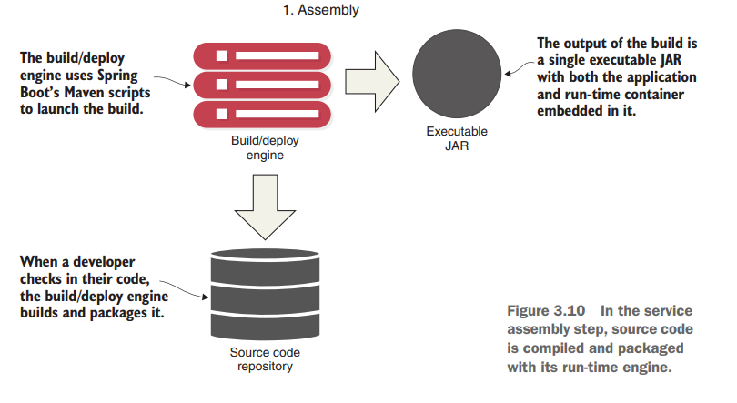

- **Service bootstrapping**：Service bootstrapping occurs when the microservice first starts and needs to load its application configuration information.

  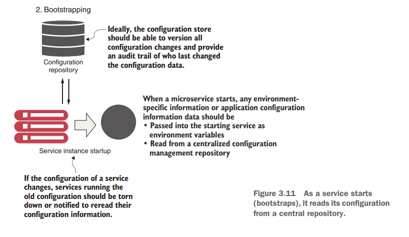

- **Service registration/discovery**

  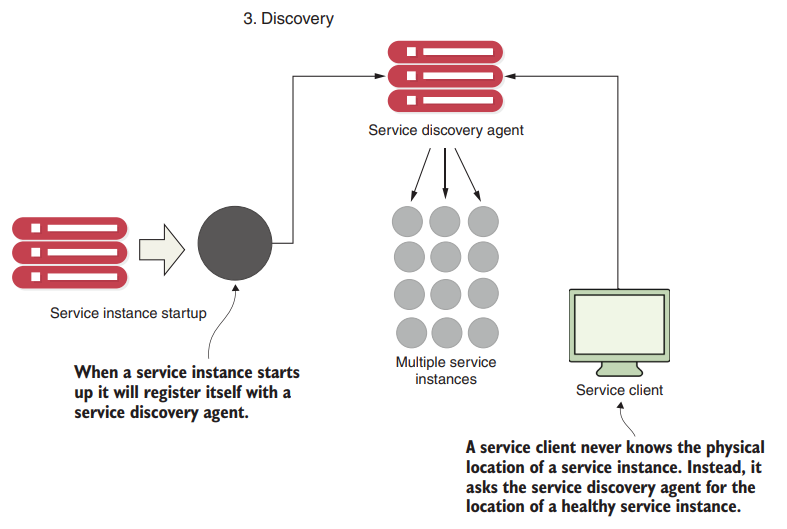

- **Service monitoring**

  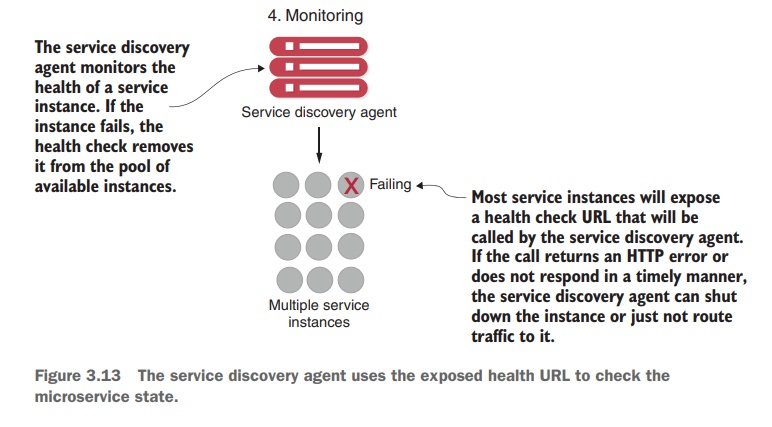


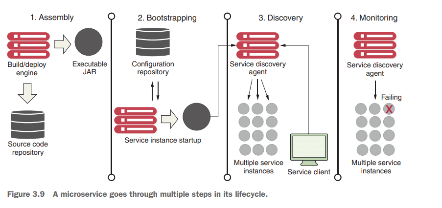