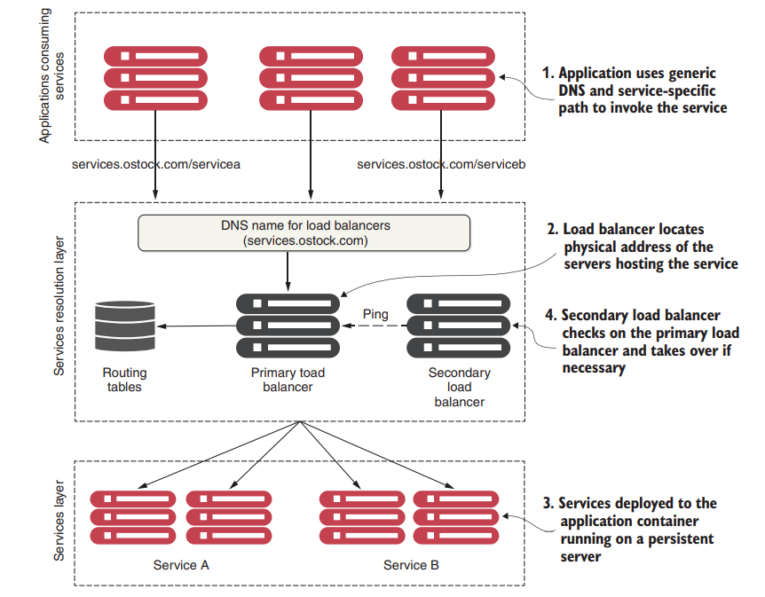
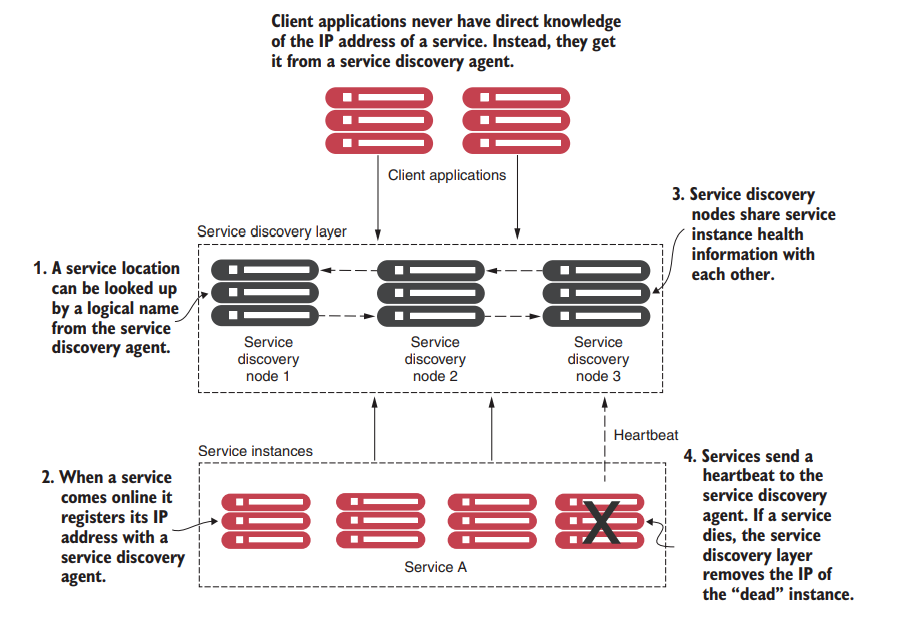
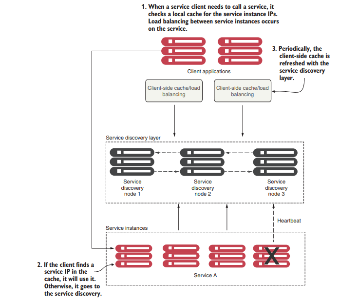
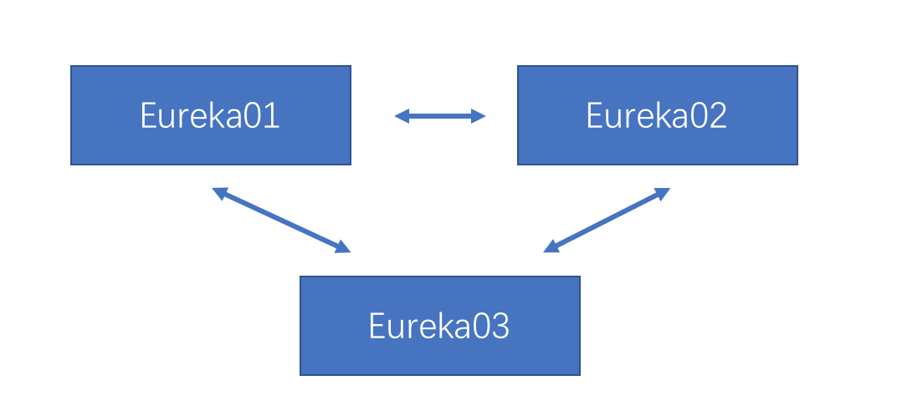
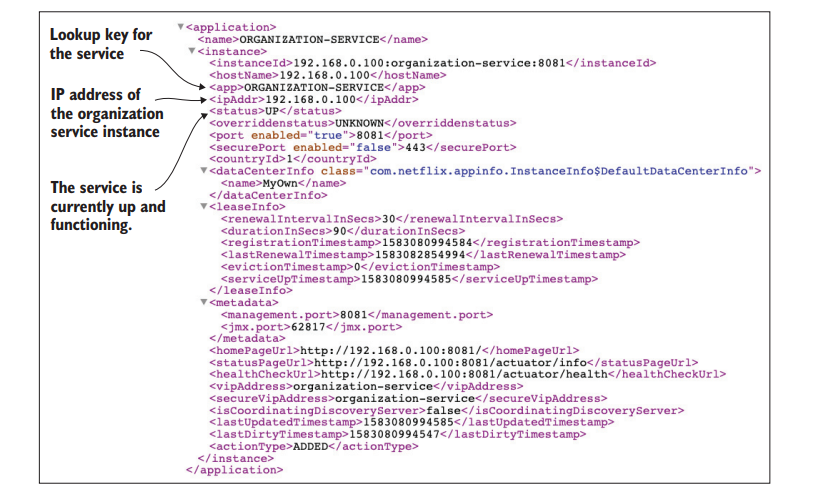
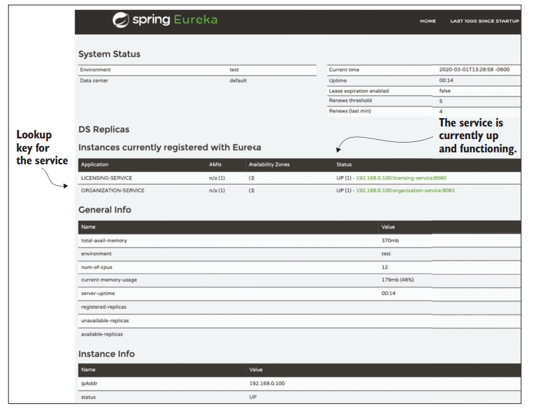

# 服务发现

[TOC]

## 概述

服务发现对于微服务来说至关重要，因为从服务消费者中抽离出来了服务的具体物理位置，这样做至少有两个好处：

- **Horizontal scaling or scale out**
- **Resiliency**

 Service discovery can be something as simple as maintaining a property file with the addresses of all the remote services used by an application, or something as formalized as a **Universal Description, Discovery, and Integration (UDDI)** repository

在传统单体应用中，通过DNS和网络负载均衡器的组合，来解耦服务的具体地址：

但是这种模型并不适用于云原生时代，原因如下：

- While the load balancer can be made highly available, it’s **a single point of failure** for your entire infrastructure

- **Most traditional load balancers are statically managed**. They aren’t designed for fast registration and deregistration of services. Traditional load balancers use a centralized database to store the routes for rules, and the only way to add new routes is often through the vendor’s proprietary API.

  This translation layer often adds another layer of complexity to your service infrastructure because the mapping rules for the service have to be defined and deployed by hand.

A load balancer works well in a corporate environment（商业环境） where the size and scale of most applications can be handled through a centralized network infrastructure。但是，这种集中式网络基础设施并不能满足云原生时代的需求，因为它不能有效地伸缩，而且成本效益也不高。

- Service registration—How a service registers with the service discovery agent
- Client lookup of service address—How a service client looks up service information
- Information sharing—How nodes share service information
- Health monitoring—How services communicate their health back to the service discovery agent

客户端如何去发现服务呢？最直观的方法是，每当客户端需要调用一个服务时，都会向服务发现引擎发出请求，服务发现引擎负责查找并返回情况最好（例如，负载最轻，位置最近等）的服务实例的位置。然后，客户端根据所返回的信息再去调用服务。这种机制所带来的问题是，如果服务发现引擎出现了故障，那么客户端就无法正常工作。

我们使用客户端负载均衡器来解决这个问题，它采用了去中心化的方式来发现服务。这里去中心化的意思是，在本地保留并管理一份服务实例的列表（缓存机制），通过负载均衡算法（例如，Round-Robin）自主决定向哪个服务实例发送请求。这样，即使服务发现引擎出现了问题，也不会影响到客户端对服务实例的调用。

客户端负载均衡器就会与注册服务建立持续的通信，保证缓存的最终一致性。

If during the course of calling a service, the service call fails, the local service discovery cache is invalidated and the service discovery client will attempt to refresh its entries from the service discovery agent

## Netflix Eureka

### 服务端

maven依赖如下：

~~~xml
<dependency>
    <groupId>org.springframework.cloud</groupId>
    <artifactId>spring-cloud-starter-netflix-eureka-server
    </artifactId>
    
    <!--we disable Ribbon as our load balancer-->
    <exclusions>
        <exclusion>
            <groupId>org.springframework.cloud</groupId>
            <artifactId>spring-cloud-starter-ribbon</artifactId>
        </exclusion>
        <exclusion>
            <groupId>com.netflix.ribbon</groupId>
            <artifactId>ribbon-eureka</artifactId>
        </exclusion>
    </exclusions>
</dependency>

<dependency>
    <groupId>org.springframework.cloud</groupId>
    <artifactId>spring-cloud-starter-loadbalancer</artifactId>
</dependency>
~~~

bootstrap.yml配置文件如下：

~~~yml
spring:
	application:
		name: eureka-server
	cloud:
		config:
			uri: http://localhost:8071
	# we disable Ribbon as our load balancer
	loadbalancer:
		ribbon:
			enabled: false
~~~

在配置中心里的`bootstrap.yml`文件

~~~yml
# server和euraka配置仅仅在暴露接口时起作用
server:
	port: 8070
eureka:
	instance:
		hostname: localhost
		
		
client:
	registerWithEureka: false
	fetchRegistry: false
	serviceUrl:
		defaultZone: http://${eureka.instance.hostname}:${server.port}/eureka/
		
server:
	waitTimeInMsWhenSyncEmpty: 5
~~~

- `eureka.client.registerWithEureka`— 该属性决定了是否将当前的应用注册到Eureka Server上。如果我们设置此属性为`true`，那么在应用启动时，它将会尝试向Eureka Server进行注册。

  在EurekaServer中，必须将此配置设置为false。

- `eureka.client.fetchRegistry`—如果我们设置此属性为true，那么在应用启动时，它将尝试从Eureka Server获取服务注册表，并将其缓存在本地。

- `eureka.client.serviceUrl.defaultZone`—当一个Eureka Client启动的时候，它会使用此URL连接到Eureka服务器，并将自己注册进去。

  在Eureka Server中，该选项用于搭建集群。

- `eureka.server.waitTimeInMsWhenSyncEmpty`设定了Eureka服务在开始接收请求之前需要等待的时间。

  默认情况下，它会等待5分钟。在这个等待窗口中，所有的微服务要完成注册。

  每个微服务在注册到Eureka后，大概有30秒的延迟才会被Eureka认为该微服务已经准备好了，然后再向客户端暴露这个微服务。这是因为Eureka要接收到微服务连续三次的心跳信号，每次信号间隔10秒。

~~~java
@SpringBootApplication
@EnableEurekaServer
public class EurekaServerApplication {
     public static void main(String[] args) {
     	SpringApplication.run(EurekaServerApplication.class, args);
     }
}
~~~

集群的搭建很简单的，下面给出一个例子：

~~~yml
serviceUrl:
      defaultZone: http://eureka01:20000/eureka/,http://eureka02:20001/eureka/,http://eureka03:20002/eureka/
~~~

### 微服务端

Maven依赖如下：

~~~xml
<dependency>
     <groupId>org.springframework.cloud</groupId>
     <artifactId>
     	spring-cloud-starter-netflix-eureka-client
     </artifactId>
</dependency>
~~~

本地配置如下：

~~~yml
spring:
	application:
		name: organization-service
		profiles:
			active: dev
cloud:
	config:
		uri: http://localhost:8071
~~~

Every service registered with Eureka will have two components associated with it: 

- **the application ID** ：The application ID represents a group service instance. In a Spring Boot microservice, the application ID is always the value set by the spring.application.name property
- **the instance ID** ：The instance ID will be a randomly autogenerated number to represent a single service instance.

 Next, we need to tell Spring Boot to register this service with Eureka

~~~properties
# Registers the IP address of the service rather than the server name
eureka.instance.preferIpAddress=true
# Setting this attribute to true caches the registry locally instead of calling the Eureka service with each lookup. Every 30 seconds, the client software recontacts the Eureka service for any changes to the registry. 
eureka.client.registerWithEureka=true
eureka.client.fetchRegistry=true

# 在集群中，只需向一个节点注册即可，之后会在集群内广播的
eureka.client.serviceUrl.defaultZone=http://localhost:8070/eureka/

# "eureka.instance.lease-renewal-interval-in-seconds=10"这个配置参数的意思是，服务实例应该每10秒向Eureka服务器发送一次租约续约。这是Eureka客户端向Eureka服务器发出的心跳频率，用于表明客户端仍然存在。
eureka.instance.lease-renewal-interval-in-seconds=10
~~~

By default, Eureka registers the services that contact it by hostname. This works well in a server-based environment, where a service is assigned a DNS-backed hostname. However, in a container-based deployment (for example, Docker), containers are started with randomly generated hostnames and no DNS entries for the containers.

### 客户端

通过将GET请求打到`http://<eureka service>:8070/eureka/apps/<APPID>`上，来获取指定ID的微服务实例。例子`http://localhost:8070/eureka/apps/organization-service`

默认返回xml格式，可以携带`Accept:application/json`请求头，来返回JSON格式

通过` http://localhost:8070`（示例）可以返回Eureka的状态面板

客户端负载均衡器有三个库，抽象层次从低到高

- Spring Discovery Client
- Spring Discovery Client–enabled REST template
- Netflix Feign client

首先介绍`Spring Discovery Client`

~~~java
@SpringBootApplication
@RefreshScope
@EnableDiscoveryClient
public class LicenseServiceApplication {
     public static void main(String[] args) {
     	SpringApplication.run(LicenseServiceApplication.class, args);
     }
}
~~~

~~~java
@Component
public class OrganizationDiscoveryClient {
    
    // Injects the Discovery Client into the class
    @Autowired
    private DiscoveryClient discoveryClient;
    
    public Organization getOrganization(String organizationId) {
        RestTemplate restTemplate = new RestTemplate();
        
        // Gets a list of allthe instances of the organization services
        List<ServiceInstance> instances = 
        discoveryClient.getInstances("organization-service");
        
        if (instances.size() == 0) 
            return null;
        
        
        String serviceUri = String.format(
            "%s/v1/organization/%s", 
            // Retrieves the service endpoint
            instances.get(0).getUri().toString(), 
            organizationId
        );
        
        ResponseEntity<Organization> restExchange = restTemplate.exchange(
        	serviceUri, 
            HttpMethod.GET,
        	null, 
            Organization.class, 
            organizationId
        );
        
        return restExchange.getBody();
    }
}
~~~

