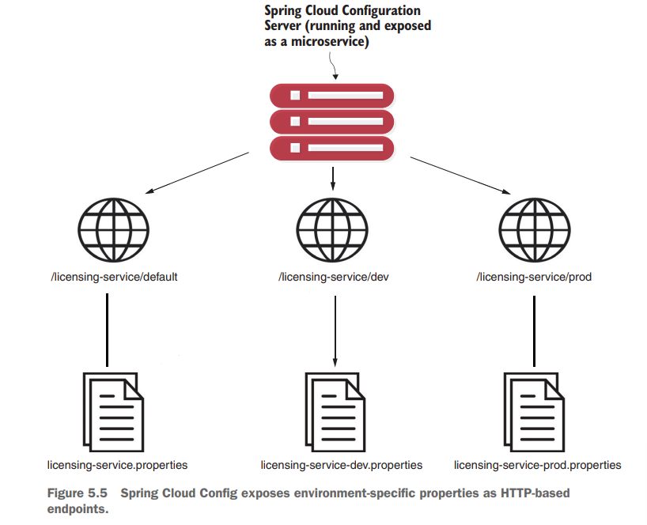
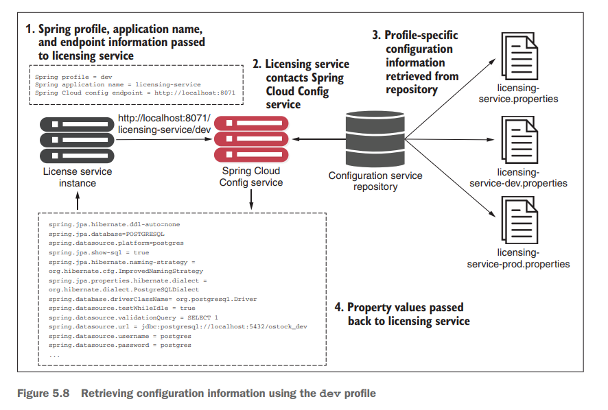
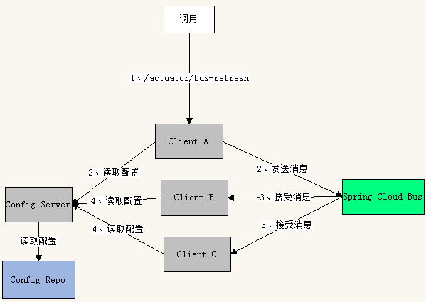

# 配置

[TOC]

## 概述

 Completely separating the configuration information from the application code allows developers and operations to make changes to their configurations without going through a recompile process. But it also introduces complexity

 Many developers turn to property files (YAML, JSON, or XML) to store their configuration information.  但是这些配置信息都是在启动加载的，那么在修改配置后，必须重启服务，来加载这些新的配置。

principles for application configuration management：

- **Segregate**：In fact, application configuration shouldn’t be deployed with the service instance. Instead, configuration information should either be passed as environment variables to the starting service or read from a centralized repository when the service starts. 
- **Abstract**：We also need to abstract access to configuration data behind a service interface. Instead of writing code that directly reads the service repository, whether file-based or a JDBC database, we should use a REST-based JSON service to retrieve the application’s configuration data. 
- **Centralize**：Because a cloud-based application might literally have hundreds of services, it’s critical to minimize the number of different repositories used to hold configuration data.
- **Harden**：当你选择把配置信息从应用程序服务中移出并集中管理时，你需要确保你所使用的解决方案具有高可用性和冗余性，以确保能够稳定、可靠地提供配置信息。

记住的关键一点是，当你将配置信息与你实际的代码分离时，你就创建了一个**需要被管理和版本控制**的外部依赖。


配置加载正是在运维的`Bootstrapping`周期


具体`Bootstrapping`过程，如下图所示：


1. When a microservice instance comes up, it calls a service endpoint to read its configuration information. The connection information for the configuration management (connection credentials, service endpoint, and so on)   passes into the microservice as it starts.
2. The actual configuration resides in a repository.  you can choose different ways to hold your configuration data. This can include files under source control, relational databases, or key-value data stores.
3.  Changes to configuration management are typically handled **through the build and deployment pipeline**, where modifications can be tagged with version information and deployed through the different environments
4. When the configuration management changes, the services that use that application configuration data must be notified of the alteration and refresh their copy of the application data.


you can choose from a large number of battle-tested open source projects to implement a configuration management solution

- etcd
- Eureka
- Consul
- Zookeeper
- Spring Cloud Configuration Server

## Spring Cloud Config

我们使用Spring Cloud Config来实现配置中心。

### 服务端

添加以下依赖：

~~~xml
<dependencies>
    <dependency>
        <groupId>org.springframework.cloud</groupId>
        <artifactId>spring-cloud-config-server</artifactId>
    </dependency>
</dependencies>

<dependencyManagement>
    <dependencies>
        <dependency>
            <groupId>org.springframework.cloud</groupId>
            <artifactId>spring-cloud-dependencies</artifactId>
            <version>${spring-cloud.version}</version>
            <type>pom</type>
            <scope>import</scope>
        </dependency>
    </dependencies>
</dependencyManagement>
~~~


Spring Cloud Config 使用`bootstrap.yml`文件中的一个配置，指向保存应用程序配置数据的存储库。


~~~yml
spring:
  application:
    name: config-server

server:
  port: 8071
~~~


这里我们使用本地文件系统，来保存配置数据。using a filesystem as the backend repository for the Spring Cloud Configuration Server can be impractical for a cloud-based application. That’s because the development team has to set up and manage a shared filesystem that’s mounted on all instances of the Config Server

~~~yml
spring:
  application:
    name: config-server
  profiles:
  	# Sets the Spring profile associated with the backend repository (filesystem)
    active: native

  cloud:
    config:
      server:
        native:
       	  # Sets the search location where the configuration files are stored
          # The classpath attribute causes Spring Cloud Config Server to look in the src/main/resources/config folder.
          search-locations: classpath:/config

server:
  port: 8071
~~~

The naming convention for the application configuration files are `${appname}-${env}.properties`.  **the environment names translate directly into the URLs that will be accessed to browse the configuration information**

Spring Cloud Config 有它的一套访问规则，我们通过这套规则在浏览器上直接访问就可以。

```yml
/{application}/{profile}[/{label}]
/{application}-{profile}.yml
/{label}/{application}-{profile}.yml
/{application}-{profile}.properties
/{label}/{application}-{profile}.properties
```

- {application} 就是应用名称
- {profile} 就是配置文件的版本
- {label} 表示 git 分支，默认是 master 分支




或者，我们使用Git系统，来保存配置数据。

~~~shell
spring:
	application:
		name: config-server
	profiles:
		active:
			- native, git
	cloud:
		config:
			server:
				native:
					search-locations: classpath:/config
	git:
		# The spring.cloud.config.server.git.uri property provides the URL of the repository you’re connecting to
		uri: https://github.com/ihuaylupo/config.git
		# the spring.cloud.config.server.git.searchPaths property tells the Config Server the relative path on the Git repositorythat will be searched
		searchPaths: licensingservice
         username: github #登录账号
         password: github # 登录密码
         default-label: master #配置文件分支
server:
	port: 8071
~~~

### 客户端

下面我们看看客户端如何去获取配置



首先引入依赖

~~~xml
<dependency>
     <groupId>org.springframework.cloud</groupId>
     <artifactId>
     	spring-cloud-starter-config
     </artifactId>
</dependency>
~~~

the bootstrap.yml file 中的内容如下：

~~~yml
spring:
    application:
    	# The spring.application.name is the name of your application and must map directly to the name of the config directory within your Spring Cloud Configuration Server
    	name: licensing-service
    profiles:
		# Specifies the default profile the service should run. The profile maps to an environment.
    	active: dev
    cloud:
    	# Specifies the location of the Spring Cloud Config Server
    	config:
    		uri: http://localhost:8071
~~~


Java 启动参数可以覆写上述默认配置

~~~shell
$ java -Dspring.cloud.config.uri=http://localhost:8071 \
 -Dspring.profiles.active=dev \
 -jar target/licensing-service-0.0.1-SNAPSHOT.jar
~~~

甚至，你可以在环境变量中提供这些配置：

~~~yml
#  Dev docker-compose.yml 
licensingservice:
	image: ostock/licensing-service:0.0.1-SNAPSHOT
	ports:
		- "8080:8080"
	environment:
		# Passes the SPRING_PROFILES_ACTIVE environment variable to the Spring Boot service command line and tells Spring Boot what profile should be run
		SPRING_PROFILES_ACTIVE: "dev"
		SPRING_CLOUD_CONFIG_URI: http://configserver:8071
~~~

配置的加载顺序为`bootstrap.yml->application.yml->spring.application.name-profile.yml`（配置服务采用native方式时，此文件默认位于configServer的resources/config目录下）。对于位于不同配置文件中的相同配置，后加载的覆盖先加载的。

Usually, the information you store in the `application.yml` file is configuration data that you might want to have available to a service even if the Spring Cloud Config service is unavailable


这样在项目启动后，Spring Boot框架就自动为我们从Config Server中拉取配置并加载到本地中。从Spring Cloud Config Server中读取配置内容的方式，和从本地配置文件中读取是一模一样的，即可以通过 @Value 或 @ConfigurationProperties 来获取。

### 自动刷新

通过`@RefreshScope`注解 + `actuator`，来解决配置动态获取的问题。

~~~java
import org.springframework.cloud.context.config.annotation.RefreshScope;

@SpringBootApplication
@RefreshScope
public class LicenseServiceApplication {
     public static void main(String[] args) {
     	SpringApplication.run(LicenseServiceApplication.class, args);
     }
}
~~~

接下来，我们主动发送 POST 请求到 `http://localhost:8080/actuator/refresh` 这个接口，此时就会自动刷新配置了。但是这只会刷新一个客户端，如果要刷新所有客户端，那么就要使用`Spring Cloud Bus` ，然后发送POST请求到`actuator/bus-refresh` 即可.



Spring Bean容器是支持自动刷新机制的。

## 安全

之前都是使用明文方式来存储配置的。实际上，我们可以使用SpringCloudConfig提供的对称加密（共享密钥）或者非对称加密（公玥/密钥）来保护敏感的配置项。

### 对称加密

在服务端的`bootstrap.yml`中添加如下配置

~~~yml
cloud:
#...

encrypt:
	key: secretkey
~~~

或者通过环境变量 `ENCRYPT_KEY`来提供。


Spring Cloud Config detects that the ENCRYPT_KEY environment variable or the bootstrap file property is set, and automatically adds two new endpoints, /encrypt and /decrypt to the Spring Cloud Config service.


注意，这两个端点都是POST请求。

Spring Cloud Config服务器端要求所有已加密的属性前面，都要加上{cipher}

~~~xml
spring.datasource.username = postgres
spring.datasource.password = {cipher} 559ac661a1c93d52b9e093d3833a238a142de7772961d94751883b17c41746a6
~~~
