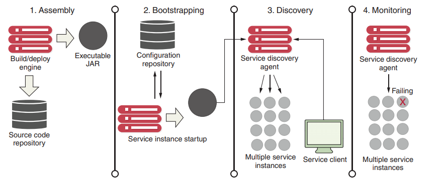
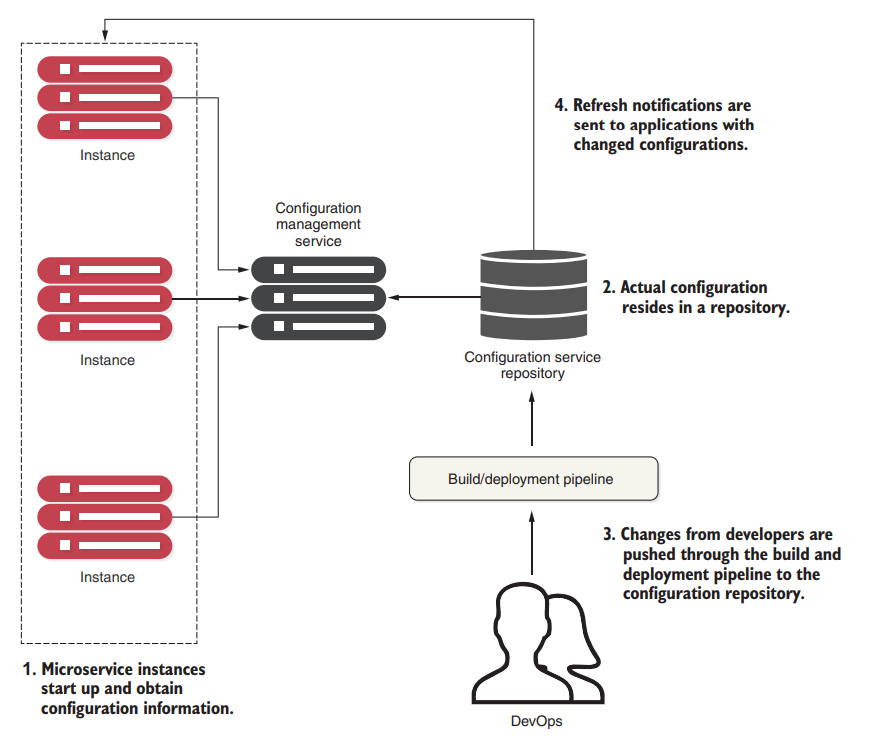

# 配置

 Completely separating the configuration information from the application code allows developers and operations to make changes to their configurations without going through a recompile process. But it also introduces complexity

 Many developers turn to property files (YAML, JSON, or XML) to store their configuration information.  但是在构建过程中，这些配置文件打包进了可执行文件中，若想重新修改配置，那么必须重新构建。

principles for application configuration management：

- **Segregate**：In fact, application configuration shouldn’t be deployed with the service instance. Instead, configuration information should either be passed as environment variables to the starting service or read from a centralized repository when the service starts. 
- **Abstract**：We also need to abstract access to configuration data behind a service interface. Instead of writing code that directly reads the service repository, whether file-based or a JDBC database, we should use a REST-based JSON service to retrieve the application’s configuration data. 
- **Centralize**：Because a cloud-based application might literally have hundreds of services, it’s critical to minimize the number of different repositories used to hold configuration data.
- **Harden**：当你选择把配置信息从应用程序服务中移出并集中管理时，你需要确保你所使用的解决方案具有高可用性和冗余性，以确保能够稳定、可靠地提供配置信息。

记住的关键一点是，当你将配置信息与你实际的代码分离时，你就创建了一个**需要被管理和版本控制**的外部依赖。

配置加载正是在运维的`Bootstrapping`周期

具体`Bootstrapping`过程，如下图所示：

1. When a microservice instance comes up, it calls a service endpoint to read its configuration information. The connection information for the configuration management (connection credentials, service endpoint, and so on)   passes into the microservice as it starts.
2. The actual configuration resides in a repository.  you can choose different ways to hold your configuration data. This can include files under source control, relational databases, or key-value data stores.
3.  Changes to configuration management are typically handled **through the build and deployment pipeline**, where modifications can be tagged with version information and deployed through the different environments
4. When the configuration management changes, the services that use that application configuration data must be notified of the alteration and refresh their copy of the application data.

you can choose from a large number of battle-tested open source projects to implement a configuration management solution

- etcd
- Eureka
- Consul
- Zookeeper
- Spring Cloud Configuration Server

我们使用Configuration Server来实现配置中心。The Spring Cloud Configuration Server is a REST-based application, so we can embed it in an existing Spring Boot application

添加以下依赖：

~~~xml
<dependency>
    <groupId>org.springframework.cloud</groupId>
    <artifactId>spring-cloud-config-server</artifactId>
</dependency>
~~~

