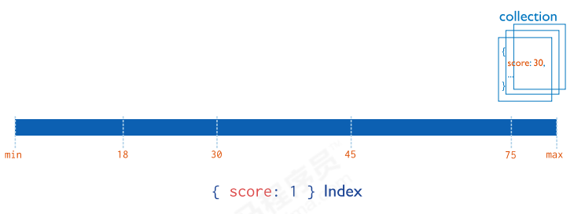
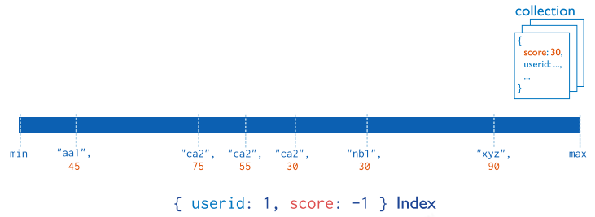

# 入门

[TOC]

## 基本概念

数据的三高需求：

- `High Performance`: 对数据库的高并发读写的要求
- `High Storage`: 对海量数据的高效率存储和访问的需求
- `High Scalability` && `High Available`: 对数据的高扩展性和高可用性的需求

MongoDB 等非关系数据库的一个关键特性就是可扩展性强。MongoDB 对于事务支持不太好。

|  SQL   |  MongoDB   |
| :----: | :--------: |
| Record |  Document  |
| Table  | Collection |
| column |   filed    |

MongoDB支持许多数据类型：

- **String** − UTF-8字符串
- **Integer** −
- **Boolean** 
- **Double**
- **Arrays** −此类型用于将数组或列表或多个值存储到一个键中。
- **Timestamp**
- **Object** 
- **Null** 
- **Symbol**
- **Date** 
- **Object ID** −表示存储文档的ID。12字节长度，类似于UUID
- **Binary data** −存储二进制数据。
- **Code** −将JavaScript代码存储到文档中。
- **Regular expression** −存储正则表达式。

## 部署

下载网址 https://www.mongodb.com/try/download/community

客户端 Compass 的下载地址：https://www.mongodb.com/try/download/compass

Windows下的配置

1. 在 ${mongoDB} 下创建数据文件夹 \data\db

2. 启动mongoDB

   ~~~bash
   mongod --dbpath=..\data\db
   ~~~

   在启动时指定一个配置文件：

   ~~~bash
   mongod -f ${config}
   ~~~

   

Linux下的配置：

1. 下载

   ~~~bash
   https://fastdl.mongodb.org/linux/mongodb-linux-x86_64-ubuntu2204-7.0.7.tgz
   
   tar -xvf mongodb-linux-x86_64-ubuntu2204-7.0.7.tgz
   
   mv mongodb-linux-x86_64-ubuntu2204-7.0.7 mongodb
   ~~~

2. 创建目录：

   ~~~bash
   mkdir ${mongodb}/data/db
   mkdir ${mongodb}/log
   ~~~

3. 编写配置文件

   ~~~yaml
   systemLog:
       destination: file
       path: "/home/myokuuu/mongodb/log/mongod.log"
       logAppend: true
   storage:
       dbPath: "/home/myokuuu/mongodb/data/db"
       journal: 
           enabled: true
   processManagement:
   	# 后台运行
       fork: true
   net:
       bindIp: localhost, 172.23.54.105
       port: 27017
   ~~~

4. 启动 MongoDB 服务

   ~~~bash
   mongod -f ${config}
   ~~~

   

## 基本命令

### 数据库操作

查看所有数据库 `show dbs`，MongoDB 自带一些数据库：

1. **admin**
2. **local**：该数据库下的集合并不会参与集群之间的复制。
3. **config**

选择数据库 `use ${database}`，如果数据库不存在，则自动创建。

删除当前选择的数据库：`db.dropDatabase()`

显式当前数据库中的集合：`show collections`

删除当前数据库中指定的集合：`db.${collection}.drop()`

集合的显式创建：`db.createCollection(name)`

在 MongoDB 中，与其他编程语言相同，我们通常使用 try-catch 语句处理可能出现的错误和异常。

~~~javascript
try {
   db("test").collection("users").insertOne({ name: "Alice" });
} catch (e) {
    console.error(e);
} finally {
    
}
~~~

### CURD

文档基本 CRUD：https://docs.mongodb.com/manual/crud/

#### 插入

在MongoDB中，文档是动态的。这意味着在插入新的文档时，可以自由地添加新的字段。

单个文档的插入：使用 insert() 或者 save()

~~~javascript
db.${collection}.insert(
	<document>
	{
		writeConcern: <document>
		ordered: <boolean>
	}
)
~~~

- document，要插入到集合中的文档或文档数组。（(json格式）
- writeConcern
- ordered

使用示例：

~~~javascript
db.comment.insert(
	{
		"articleid": "10000",
		"content": "今天天气真好",
		"userid": "1001",
		"nickname": "Rose"
	}
)
~~~

- comment 集合如果不存在，则会隐式创建
- mongo 中的数字，默认情况下是 double 类型，如果要存整型，必须使用函数 NumberInt
- 插入的数据没有指定 _id 字段，那么 mongoDB 会自动创建该字段。该字段相当于主键，不允许重复

批量插入：

~~~javascript
db.comment.insertMany([
    {"_id":"1" ...},
    {"_id":"2" ...},
    {"_id":"3" ...},
]);
~~~

#### 查询

查询当前数据库中所指定的集合：

~~~javascript
db.${collection}.find()
~~~

查询集合中的文档

~~~javascript
db.${collection}.find( {
	// 查询条件
})
~~~

使用示例：

~~~javascript
db.comment.find({
	// 在 comment 集合中，查询所有 article 字段为 1001 的文档
	"articleid" : "1001"
})
~~~

**投影查询**：

~~~javascript
db.${collection}.find(
	{查询条件},
	{project}
)
~~~

- 其中 project 指定了你要投影的字段。例如`{_id: 0, name: 1, email: 1}` 是投影对象，`1` 表示该字段应包含在结果中，`0` 表示该字段不应包含在结果中。

使用示例：

~~~javascript
db.comment.find({userid:"1003"},{userid:1,nickname:1,_id:0})

# 结果
{ "userid" : "1003", "nickname" : "凯撒" }
{ "userid" : "1003", "nickname" : "凯撒" }
~~~

**统计查询**

~~~JavaScript
db.${collection}.count(query, options)
~~~

使用示例：

~~~JavaScript
// 统计comment集合的所有的记录数
db.comment.count()

// 统计userid为1003的记录条数
db.comment.count({userid:"1003"})
~~~

**分页查询**：

~~~JavaScript
db.${collection}.find().limit(NUMBER).skip(NUMBER)
~~~

**排序查询**：

~~~JavaScript
db.${collection}.find().sort(排序方式)
~~~

使用示例：

~~~JavaScript
db.comment.find().sort({userid:-1,likenum:1})
~~~

执行顺序是先 sort(), 然后是 skip()，最后是 limit()

**正则查询**：MongoDB的模糊查询是通过正则表达式的方式实现的

~~~JavaScript
db.${collection}.find({field:/正则表达式/})
~~~

使用示例：

~~~JavaScript
db.comment.find({content:/开水/})
~~~

**比较查询**：

~~~JavaScript
db.集合名称.find({ "field" : { $gt: value }}) // 大于: field > value
db.集合名称.find({ "field" : { $lt: value }}) // 小于: field < value
db.集合名称.find({ "field" : { $gte: value }}) // 大于等于: field >= value
db.集合名称.find({ "field" : { $lte: value }}) // 小于等于: field <= value
db.集合名称.find({ "field" : { $ne: value }}) // 不等于: field != value
~~~

使用示例：

~~~JavaScript
db.comment.find({likenum:{$gt:NumberInt(700)}})
~~~

**包含查询**，使用`$in`/`$nin` 操作符

~~~JavaScript
// 查询评论的集合中userid字段包含1003或1004的文档
db.comment.find({userid:{$in:["1003","1004"]}})

// 不包含
db.comment.find({userid:{$nin:["1003","1004"]}})
~~~

 **条件连接查询**：使用 `$and` 操作符

~~~JavaScript
$and:[ { },{ },{ } ]
$or:[ { },{ },{ } ]
~~~

使用示例：

~~~JavaScript
db.comment.find({
    $and:[
        {likenum:{$gte:NumberInt(700)}},
        {likenum:{$lt:NumberInt(2000)}}
    ]
})
~~~

#### 更新

文档的更新

~~~javascript
db.collection.update(query, update, options)

db.collection.update(
    <query>,
    <update>,
    {
        upsert: <boolean>,
        multi: <boolean>,
        writeConcern: <document>,
        collation: <document>,
        arrayFilters: [ <filterdocument1>, ... ],
        hint: <document|string> // Available starting in MongoDB 4.2
    }
)
~~~

覆盖修改：

~~~JavaScript
// 修改_id为1的记录，点赞量为1001
db.comment.update({_id:"1"},{likenum:NumberInt(1001)})
~~~

执行后，这条文档除了 likenum 字段，其它字段都不见了。为了解决这个问题，我们需要使用修改器$set来实现局部修改：

~~~JavaScript
b.comment.update({_id:"2"},{$set:{likenum:NumberInt(889)}})
~~~

批量的修改：

~~~JavaScript
//默认只修改第一条数据
db.comment.update({userid:"1003"},{$set:{nickname:"凯撒2"}})
//修改所有符合条件的数据
db.comment.update({userid:"1003"},{$set:{nickname:"凯撒大帝"}},{multi:true})
~~~

我们可以使用 $inc 运算符来实现，在某字段原有值的基础上，进行增加或减少：

~~~JavaScript
db.comment.update({_id:"3"},{$inc:{likenum:NumberInt(1)}})
~~~

#### 删除

删除文档：

~~~JavaScript
db.集合名称.remove(条件)
~~~

使用示例：

~~~JavaScript
// 删除 _id=1 的记录
db.comment.remove({_id:"1"})

// 将数据全部删除
db.comment.remove({})
~~~

## 索引

如果没有索引，MongoDB 必须执行全集合扫描。这种扫描的查询效率是非常低的。通过索引机制，MongoDB首先查询小的索引集合，然后根据索引结果再去针对性地查询文档集合。

MongoDB 支持在文档的单个字段上创建升序/降序索引

MongoDB 还支持多个字段的索引，即复合索引（Compound Index）。

此外，MongoDB 还支持其他类型的索引：

- **地理空间索引（Geospatial Index）**
- **文本索引（Text Indexes）**
- **哈希索引（Hashed Indexes）**

   

**返回一个集合中的所有索引**：

~~~JavaScript
db.${collection}.getIndexes()

// 返回的结果
[
    {
        "v" : 2,
        "key" : {
            // 在 _id 字段上建立升序索引
            // -1 表示降序索引
        	"_id" : 1
        },
        // 索引的名称为 _id_
        "name" : "_id_",
        
        "ns" : "articledb.comment"
    }
]
~~~

**创建索引**：

~~~JavaScript
db.${collection}.createIndex(keys, options)
~~~

- keys
- options
  - name：索引名称
  - unique：建立的索引是否唯一
  - ...

使用示例：

~~~JavaScript
db.comment.createIndex({userid:1,nickname:-1})
~~~

**删除索引**：

~~~JavaScript
db.${collection}.dropIndex(index)
~~~

- index 有两种指定方式
  - 索引名称
  - 字段

使用示例：

~~~JavaScript
// 删除 comment 集合中 userid 字段上的升序索引：
db.comment.dropIndex({userid:1})
~~~

**删除所有索引**：

~~~JavaScript
db.${collection}.dropIndexes()
~~~

注意： `_id` 字段的索引（`_id_`）是无法删除的

**执行计划（Explain Plan）**一般用来分析查询性能。

~~~JavaScript
db.${collection}find(query,options).explain(options)
~~~

**涵盖的查询**：当查询条件和查询投影仅包含索引字段时，MongoDB 会直接从索引返回结果。

