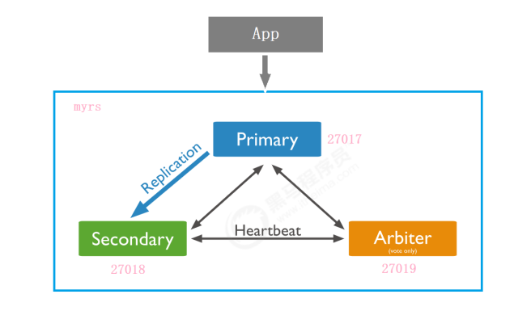

# 集群与安全

[TOC]

## 副本

副本集中的节点有两种类型：

- 主节点（Primary）
- 次节点（Secondaries）

节点分为三个角色：

- 主要成员（Primary）：接收所有写操作
- 副本成员（Replicate）：通过主从复制，维护相同的数据集
- 仲裁者（Arbiter）：不保留任何数据的副本，只具有投票选举作用。

下面我们来搭建一主一从一仲裁的结构

创建主节点 / 副本节点 / 仲裁节点

1. 建立数据和日志目录

   ~~~bash
   mkdir -p /mongodb/replica_sets/myrs_27017/log
   mkdir -p /mongodb/replica_sets/myrs_27017/data/db
   ~~~

2. 配置文件：

   ~~~yaml
   systemLog:
   	destination: file
       # 日志目录
       path: "/mongodb/replica_sets/myrs_27017/log/mongod.log"
       logAppend: true
   storage:	
       # 数据目录
       dbPath: "/mongodb/replica_sets/myrs_27017/data/db"
   processManagement:
   	# 后台运行
   	fork: true
       # PID文件
   	pidFilePath: "/mongodb/replica_sets/myrs_27017/log/mongod.pid"  
   net:
       bindIp: localhost,192.168.0.2
       port: 27017
   replication:
       #副本集的名称，主节点、副本节点、仲裁节点需要一致。
       replSetName: myrs
   ~~~

3. 启动各个节点

初始化节点集：

1. 通过客户端连接主节点

   ~~~bash
   mongo --host=180.76.159.126 --port=27017
   ~~~

2. 通过 `rs.initiate(configuration)` 来初始化副本集

   ~~~bash
   > rs.initiate()
   {
       "info2" : "no configuration specified. Using a default configuration forthe set",
       "me" : "180.76.159.126:27017",
       "ok" : 1,
       "operationTime" : Timestamp(1565760476, 1),
       "$clusterTime" : {
           "clusterTime" : Timestamp(1565760476, 1),
           "signature" : {
           	"hash" : BinData(0,"AAAAAAAAAAAAAAAAAAAAAAAAAAA="),
           	"keyId" : NumberLong(0)
           }
       }
   }
   myrs:SECONDARY>		# 这里输入一个回车
   myrs:PRIMARY>
   ~~~

   通过 `rs.conf(configuration)` 返回当前副本集的配置，通过`rs.status()`查询副本集的状态。

3. 添加副本节点：

   ~~~bash
   rs.add(host, arbiterOnly)
   ~~~

   - host：指定要添加到副本集的新成员
   - arbiterOnly，类型为 Boolean， 如果为true，则添加的主机是仲裁者（不推荐）。

   ~~~bash
   rs.add("180.76.159.126:27018")
   ~~~

4. 添加仲裁节点

   ~~~bash
   rs.addArb(host)
   ~~~

## 分片集群

## 安全认证

