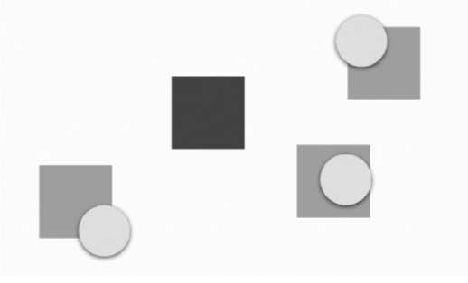

# 功能型组件

[TOC]

## 媒体查询

MediaQuery是一个帮助开发者获取设备信息的继承式组件（InheritedWidget）。例如是否为横屏状态、是否开启了夜间模式、是否在系统偏好里设置了较大的字号等。

|             查询             |        属性        |
| :--------------------------: | :----------------: |
|       屏幕的宽度和高度       |        size        |
|        是横屏还是竖屏        |    orientation     |
|       是否开启夜间模式       | platformBrightness |
| 设备的交互方式（触屏、手柄） |   navigationMode   |
|    是否调整了默认字体大小    |  textScaleFactor   |

## Builder

Builder与StatefulBuilder是为了解决获取局部context的问题。此外StatefulBuilder还可以实现局部刷新（控制刷新范围）。

下面我们通过一个例子来学习Builder组件：

~~~dart
void main() => runApp(CustomWidget());

class CustomWidget extends StatelessWidget {
    @Override
    Widget build(BuildContext context) {
        return MaterialApp(
          home: Scaffold(
            body: GestureDetector(
              onTap: () {
                Scaffold.of(context).showSnackBar(SnackBar(
                  content: Text(''),
                ));
              },
              child : child,
            )
          )
       );    
    }
}
~~~

运行后直接抛出了异常。这是因为context是CustomWidget的，而不是GestureDetector的。所以Scaffold.of无法通过context获取到Scaffold组件。为了解决这个问题，我们引入Builder组件，通过它可以获取局部context：

~~~diff
class CustomWidget extends StatelessWidget {
  @override
  Widget build(BuildContext context) {
    return MaterialApp(
        home: Scaffold(
+            body: Builder(
+                builder : (context) {
                  return GestureDetector(
                    onTap: () {
                      Scaffold.of(context).showSnackBar(SnackBar(
                        content: Text(''),
                      ));
                    },
                    child : null,
                  );
                }
            )
        )
    );
  }
}
~~~

StatefulBuilder的作用与Builder类似，但是它还可以局部刷新UI。在不考虑复用性的前提下，可以代替StatefulWidget：

~~~dart
body: Center(
    child: StatefulBuilder(
        builder: (BuildContext context, StateSetter setState) {
            return Text("clickTimes$clickTimes").gesture(onTap: () {
              setState(() {
                clickTimes++;
              });
            });
        },
    ),
),
~~~


## 悬浮

### Overlay

在Flutter框架中，悬浮功能一般由Overlay组件提供。而Overlay组件通常不需要开发者手动创建，因为一般Flutter程序常见的组件树根MaterialApp或WidgetsApp等都会创建一个导航器（Navigator），而导航器又会在内部创建Overlay组件。Overlay的主要作用就是通过内部的`Stack<OverlayEntry>`来管理和叠放各个组件图层。

OverlayEntry组件将父组件的最大约束（通常是屏幕宽度），以紧约束形式传递给builder所构建出的组件。

~~~dart
OverlayEntry({
    required this.builder,
    bool opaque = false,
    bool maintainState = false,
})
~~~

- `opaque`：设置该悬浮内容是否能完全遮挡住整个屏幕。如果可以完全遮挡，则Flutter只需渲染该层及它上面层的组件，而不需要渲染并销毁它下面层的组件。

  另外，程序运行时可随时修改OverlayEntry的opaque属性（例如，`_entry.opaque = false`），而且此改动可立即生效，无须调用markNeedsBuild（）方法。

  

- `maintainState`：在OverlayEntry被完全遮挡时仍然保留状态，并不会被销毁。这么做就等于放弃了Flutter对这层的优化


当需要在程序运行的过程中插入一个悬浮内容时，可调用Overlay组件的insert方法：

~~~dart
final entry = OverlayEntry(
	builder : (context) => Container(...)
)
Overlay.of(context)?.insert(entry);
~~~

如当需要撤除该悬浮内容时，就可调用OverlayEntry实例的remove方法

~~~dart
entry.remove()
~~~

若在程序运行时builder函数中使用的外部变量发生变化，就可调用OverlayEntry的markNeedsBuild（）方法使其在下一帧重绘。


实际上，Draggable组件就是在用户开始拖放操作时在Overlay中插入了一个OverlayEntry，内容为Positioned组件和Draggable的feedback属性所指定的“反馈”组件。在用户拖动的过程中，Draggable通过连续调用markNeedsBuild（）方法不断更新这个OverlayEntry中的Positioned组件的top和left属性，以实现feedback组件自动跟随光标移动的效果。当拖放操作结束时，Draggable会将该OverlayEntry撤除。

若在OverlayEntry中的Text组件样式很奇怪。这是因为当OverlayEntry被插入Overlay后，其组件树的上级缺少一个DefaultTextStyle组件。我们可以使用textTheme来解决这个问题。

~~~dart
Text("OvertlayEntryText", style : Theme.of(context).textTheme.bodyText2
~~~

### CompositedTransform Target/Follower

CompositedTransformFollower组件追踪CompositedTransformTarget的位置。

使用时，必须设置CompositedTransformTarget组件的link属性，其类型为LayerLink。当追随者和目标使用同一个LayerLink时，追随者会被位移至目标处。这里需要注意的是，“目标”必须在“追随者”之前绘制，否则会导致运行时错误。


~~~dart
const CompositedTransformFollower({
    super.key,
    required this.link,
    this.showWhenUnlinked = true,
    this.offset = Offset.zero,
    this.targetAnchor = Alignment.topLeft,
    this.followerAnchor = Alignment.topLeft,
    super.child,
});
~~~

- `offset`：用于为追随者组件增加额外的位移
- `showWhenUnlinked`：决定是否应继续显示该追随者。默认值为true，即追随者仍然可见，但不会再有位移。若修改为false，则当目标不可见时，追随者也会随之被暂时隐藏，直到目标再次出现


## 弹窗

### Dialog

`AlertDialog`、`SimpleDialog`以及`Dialog`是Material组件库提供的三种对话框，旨在帮助开发者快速构建出符合Material设计规范的对话框，但读者完全可以自定义对话框样式。


~~~dart
const AlertDialog({
  Key? key,
  this.title, 					//对话框标题组件
  this.titlePadding, 			// 标题填充
  this.titleTextStyle, 			//标题文本样式
  this.content, 				// 对话框内容组件
  this.contentPadding = const EdgeInsets.fromLTRB(24.0, 20.0, 24.0, 24.0), //内容的填充
  this.contentTextStyle,		// 内容文本样式
  this.actions, 				// 对话框操作按钮组
  this.backgroundColor, 		// 对话框背景色
  this.elevation,				// 对话框的阴影
  this.semanticLabel, 			//对话框语义化标签(用于读屏软件)
  this.shape,					// 对话框外形
})
~~~


实际上`AlertDialog`和`SimpleDialog`都使用了`Dialog`类。由于`AlertDialog`和`SimpleDialog`中使用了`IntrinsicWidth`来尝试通过子组件的实际尺寸来调整自身尺寸，这就导致他们的子组件不能是延迟加载模型的组件（如`ListView`、`GridView` 、 `CustomScrollView`等）。如下面的代码运行后会报错：

~~~dart
AlertDialog(
  content: ListView(
    children: ...//省略
  ),
);
~~~

如果我们就是需要嵌套一个`ListView`应该怎么做？这时，我们可以直接使用`Dialog`类，如：

~~~dart
Dialog(
  child: ListView(
    children: ...//省略
  ),
);
~~~


我们通过`Navigator.of(context).pop(…)`方法来关闭对话框的。`showDialog()`是Material组件库提供的一个用于以Material风格弹出对话框的方法，签名如下：

~~~dart
Future<T?> showDialog<T>({
  required BuildContext context,
  required WidgetBuilder builder, // 对话框UI的builder
  bool barrierDismissible = true, //点击对话框barrier(遮罩)时是否关闭它
})
~~~

该方法返回一个`Future`，它正是用于接收对话框的返回值：如果我们是通过点击对话框遮罩关闭的，则`Future`的值为`null`，否则为`Navigator.of(context).pop(result)`中的`result`参数

~~~dart
await showDialog<bool>(
	context : context,
    builder : (context) {
		return AlertDialog(...);
    }
)
~~~


`showModalBottomSheet`方法可以弹出一个Material风格的底部菜单列表模态对话框。

### 外部样式

实际上，`showDialog`方法正是`showGeneralDialog`的一个封装，它定制了Material风格对话框的遮罩颜色和动画。


外部样式包含对话框遮罩样式、打开动画等，本节主要介绍如何自定义这些外部样式。

~~~dart
Future<T?> showGeneralDialog<T>({
  required BuildContext context,
  required RoutePageBuilder pageBuilder, 					//构建对话框内部UI
  bool barrierDismissible = false, 							//点击遮罩是否关闭对话框
  Color barrierColor = const Color(0x80000000), 			// 遮罩颜色
  Duration transitionDuration = const Duration(milliseconds: 200), // 对话框打开/关闭的动画时长
  RouteTransitionsBuilder? transitionBuilder, 				// 对话框打开/关闭的动画
  ...
})
~~~

-  pageBuilder：类型为`Widget Function(BuildContext context, Animation<double> animation, Animation<double> secondaryAnimation)`。这里的animation参数没作用
- transitionBuilder：类型为`Widget Function(BuildContext context, Animation<double> animation, Animation<double> secondaryAnimation, Widget child)`


~~~dart
showGeneralDialog(
  context: context,
  pageBuilder: (BuildContext buildContext, 
                Animation<double> animation,
      			Animation<double> secondaryAnimation) {
    return Container();
  },
  barrierDismissible: barrierDismissible,
  barrierLabel: MaterialLocalizations.of(context).modalBarrierDismissLabel,
  barrierColor: Colors.black87,
  transitionDuration: const Duration(milliseconds: 150),
  transitionBuilder: (BuildContext context, Animation<double> animation,
      Animation<double> secondaryAnimation, Widget child) {
    // 使用缩放动画
    return ScaleTransition(
      scale: CurvedAnimation(
        parent: animation,
        curve: Curves.easeOut,
      ),
      child: child,
    );
  },
);
~~~


## Theme & Color

### Theme

通过定义 `Theme`，我们可以更好地复用颜色和字体样式，从而让整个 app 的设计看起来更一致。 `MaterialApp` 已经事先为你预设了一个全局的 `Theme` Widget。

通过Theme组件以及ThemeData来定义一套全新的主题样式：

~~~dart
ThemeData({
  Brightness? brightness, 			//深色还是浅色
  MaterialColor? primarySwatch, 	//主题颜色样本
  Color? primaryColor, 				//主色
  Color? cardColor, 				//卡片颜色
  Color? dividerColor, 				//分割线颜色
  ButtonThemeData buttonTheme, 		//按钮主题
  Color dialogBackgroundColor,		//对话框背景颜色
  String fontFamily,				//文字字体
  TextTheme textTheme,				//字体主题，包括标题、body等文字样式
  IconThemeData iconTheme, 			//Icon的默认样式
  TargetPlatform platform, 			//指定平台，应用特定平台控件风格
  ColorScheme? colorScheme,			
  ...
})
~~~

注意：**ThemeData中的颜色属性正逐渐Deprecated**，推荐使用ColorScheme来设置颜色。


下面给出一个例子：

~~~dart
Theme(
  data: ThemeData(
    splashColor: Colors.yellow,
  ),
  child: ...
);
~~~

相比从头开始定义一套样式，从父级 Theme 扩展并覆写可能更常规一些，使用 `copyWith()`方法即可。

~~~dart
Theme(
  data: Theme.of(context).copyWith(splashColor: Colors.yellow),
  child: ...
);
~~~

`Theme.of(context)` 会查询 widget 树，并返回其中最近的 `Theme`，然后直接使用即可


### Color

> https://rydmike.com/flexcolorscheme/themesplayground-v7-1/#/ 配色网站

> https://m2.material.io/design/color/the-color-system.html#color-usage-and-palettes Materail Color

`MaterialColor`是实现Material Design中的颜色的类，它包含一种颜色的10个级别的渐变色。`MaterialColor`通过"[]"运算符的索引值来代表颜色的深度，有效的索引有：50，100，200，…，900。`MaterialColor`的默认值为索引等于500的颜色

~~~dart
Colors.blue.shade50
Colors.blue[50]
~~~


可以通过ColorScheme来快速创建应用程序的颜色主题。

~~~dart
final ColorScheme myColorScheme = ColorScheme(
  primary: Colors.blue,
  secondary: Colors.yellow,
  background: Colors.white,
  surface: Colors.grey[100],
  error: Colors.red[800],
  onPrimary: Colors.white,
  onSecondary: Colors.black,
  onBackground: Colors.black,
  onSurface: Colors.black,
);
~~~


它还包括 [从单一种⼦颜⾊⽣成整个配⾊⽅案 2](https://github.com/flutter/flutter/pull/93463) 的能力。你可以使用任意颜色来创建新的 `ColorScheme` 类型：

```dart
final lightScheme = ColorScheme.fromSeed(seedColor: Colors.green);
final darkScheme = ColorScheme.fromSeed(seedColor: Colors.green, brightness: Brightness.dark);
```

`ThemeData` 的构造函数还有一个新的 `colorSchemeSeed` 参数，可以直接从颜色⽣成主题的配⾊⽅案：

~~~dart
final lightTheme = ThemeData(colorSchemeSeed: Colors.orange, ...); 
final darkTheme = ThemeData(colorSchemeSeed: Colors.orange, brightness: Brightness.dark, ...); 
~~~


## 手势

### GestureDetector

一般情况下，它自身的尺寸会自动匹配于child参数中的子组件。若子组件为空，GestureDetector就会占满父级组件的全部可用空间。

#### 点击、双击、长按

我们仅需这些事件的回调函数：

- **单击**：onTap。

- **长按**：onLongPressStart、 onLongPress、onLongPressMoveUpdate（如果在保持长按的情况下移动鼠标）、onLongPressEnd、onLongPressUp。

- **双击**：onDoubleTap

- **平移**：onPanDown、onPanStart、onPanUpdate、onPanEnd。

  


还有一些其他不重要事件的回调函数：onTapDown、onTapCancel、onDoubleTapCancel、onTapUp、onDoubleTapDown、onPanCancel。

onTapDown和onTapUp这2个事件的回传函数分别会提供TapDownDetails（按下细节）和TapUpDetails（松开细节）参数。这些参数包括以下属性：

- kind（种类）：PointerDeviceKind枚举类，包括touch（触摸屏）、mouse（鼠标）、stylus（手写笔）、invertedStylus（反向手写笔）和unknown（未知）
- localPosition（局部位置）：触摸点的坐标与GestureDetector组件的左上角的相对位置
- globalPosition（全局位置）：触摸点的坐标相对于整个程序的左上角的位置


> 只能用很复杂的状态机来描述这些事件的触发逻辑。

下面给出一个例子：

~~~dart
GestureDetector(
    child: CircleAvatar(child: Text("A")),
    
    //手指按下时会触发此回调
    onPanDown: (DragDownDetails e) {
        //打印手指按下的位置(相对于屏幕)
        print("用户手指按下：${e.globalPosition}");
    },
    
    //手指滑动时会触发此回调
    onPanUpdate: (DragUpdateDetails e) {
        //用户手指滑动时，更新偏移，重新构建
        //delta指一次Update事件的滑动的偏移量。
        setState(() {
            _left += e.delta.dx;
            _top += e.delta.dy;
        });
    },
    
    onPanEnd: (DragEndDetails e){
        //打印滑动结束时在x、y轴上的速度
        print(e.velocity);
    },
)
~~~


#### 拖动

**拖动（drag）**事件其实就是平移事件的扩展，它明确地定义了以下2类手势：

- Horizontal（水平方向）：onHorizontalDragDown、onHorizontalDragStart、onHorizontalDragCancel、onHorizontalDragUpdate、onHorizontalDragEnd
- Vertical（垂直方向）：onVerticalDragDown、onVerticalDragStart、onVerticalDragCancel、onVerticalDragUpdate、onVerticalDragEnd

这些事件与平移事件类似，不再赘述。


需要注意的是：

- 如果只监听某一方向的拖拉，那么无论用户的手势是否具有正确方向性，都会触发该方向相应的拖拉事件。
- 已经监听了普通的平移（pan）事件，又继续监听这里的水平拖拉或垂直拖拉事件之一时，若用户的平移手势有被拖拉监听方向的倾向，则触发拖拉，否则就会触发平移事件。
- 试图同时监听普通平移、水平拖拉和垂直拖拉这3类事件会导致运行时错误


#### 缩放

**捏拉缩放（pinch to zoom）**会触发onScaleStart（缩放开始）、onScaleUpdate（缩放更新）及onScaleEnd（缩放终止）这3种事件。这里onScaleUpdate事件的ScaleUpdateDetails参数包含scale（缩放倍数）和rotation（旋转角度）属性


当触碰检测区域在屏幕上发生重叠时，例如将多个GestureDetector叠放于Stack容器的不同层，可以使用behavior属性设置重叠区域的触碰行为：

- translucent（半透明）：将用户的触碰手势传递给子组件，自己并监听。GestureDetetor没有子组件时的默认值。
- opaque（不透明）：不可传递给子附件，自己监听。
- deferToChild（随子组件）：直接传递给子组件，但自己不监听。GestureDetector有子组件时的默认值

### Listener

Listener是一个较为底层的组件，用于监听最原始的触碰事件。之前介绍的GestureDetector组件监听的所谓“手势”实际上就是由这些底层事件连起来组成的有意义的行为。

~~~dart
Listener({
  Key key,
  this.onPointerDown, 	//手指按下回调
  this.onPointerMove, 	//手指移动回调
  this.onPointerUp,		//手指抬起回调
  this.onPointerCancel, //触摸事件取消回调
  this.behavior = HitTestBehavior.deferToChild, 
  Widget child
})
~~~

这些回调函数的参数 `PointerDownEvent`、 `PointerMoveEvent`、 `PointerUpEvent` 都是`PointerEvent`的子类。`PointerEvent`类中包括当前指针的一些信息。`PointerEvent`一些常用属性如下：

- `position`：它是指针相对于当对于全局坐标的偏移。
- `localPosition`: 它是指针相对于当对于本身布局坐标的偏移。
- `delta`：两次指针移动事件（`PointerMoveEvent`）的距离。
- `pressure`：按压力度，如果手机屏幕支持压力传感器(如iPhone的3D Touch)，此属性会更有意义，如果手机不支持，则始终为1。
- `orientation`：指针移动方向，是一个角度值。


### MouseRegion

鼠标区域组件可用于监听与鼠标相关的事件，用法与Listener相似

~~~dart
const MouseRegion({
    super.key,
    this.onEnter,						//鼠标进入该区域
    this.onExit,						//鼠标退出该区域
    this.onHover,						//鼠标在该区域移动
    this.cursor = MouseCursor.defer,	//鼠标的图标
    this.opaque = true,
    this.hitTestBehavior,
    super.child,
});
~~~


当需要选择性禁用某些页面元素时，可以使用IgnorePointer组件忽略指针。与IgnorePointer类似，AbsorbPointer也可被用于禁用某些元素，但是它会吞掉事件

## 拖放

### Draggable

Draggable组件可为任意组件增添拖动支持，再配合DragTarget（拖放目标）组件，轻松实现拖放功能。

~~~dart
  const Draggable({
    super.key,
    required this.child,
    required this.feedback,
    this.data,
    this.axis,
    this.childWhenDragging,
    this.dragAnchorStrategy = childDragAnchorStrategy,
    this.affinity,
    this.maxSimultaneousDrags,
    this.onDragStarted,
    this.onDragUpdate,
    this.onDraggableCanceled,
    this.onDragEnd,
    this.onDragCompleted,
  })
~~~

- `feedback`：当子组件被拖动时，需渲染**在指尖或光标下**的“反馈”组件。

- `childWhenDragging`：在正在被拖动的过程中，代替子组件留在原地的组件。

- `maxSimultaneousDrags`：限制某组件可被同时拖动的次数。例如在多点触控情况下，用户可先用食指拖动一个Draggable组件，并在保持食指不松开的情况下，再使用其他手指拖动同一个组件

  

- `dragAnchorStrategy`： A strategy that is used by this draggable to get the anchor offset when it is dragged。

  - childDragAnchorStrategy，则在拖动开始的瞬间，feedback会立即将其左上角与用户手指或鼠标光标的位置对齐。可使用Transform组件将中心与光标对齐

- `axis`：限制拖动的方向

- `affinity`：设置affinity：Axis.horizontal则可表示该Draggable更倾向于被横向拖动，因此纵向拖动行为的竞争力会被降低，具体表现为用户纵向滑动的手势此时可被理解为ListView滚动翻页，而横向滑动的手势才会被理解为针对Draggable组件的拖动。默认值为null，即2个方向（水平和垂直方向）都参与竞争

- 回调函数：onDragStarted与onDragEnd会在每次用户拖动开始（按下）与结束（松开）时触发。当结束时，若用户成功地将Draggable拖到某个DragTarget（目标位置）组件中，则会触发onDragCompleted事件，反之触发onDraggableCanceled事件。


LongPressDraggable（长按拖放）组件，顾名思义，是普通的Draggable组件的“长按”版本。使用该组件可使被拖动的组件只有在用户长按后才进入拖动状态。

### DragTarget

DragTarget是一个可用于接收Draggable的组件，它的执行逻辑如下

1. 当Draggable被拖动进入DragTarget范围内的瞬间。首先检测Draggable的data类型与DragTarget类型是否匹配。若匹配，则调用onWiillAccept()，否则什么也不做

2. 在onWillAccept()接受Draggable的data属性。并根据业务逻辑返回true或者false

3. 如果用户的确将Draggable放入到这个DragTarget，那么将会调用onAccept()函数。否则什么也不做

4. 在整个过程中，只要发生触发不同的事件就会调用builder()来构建组件。后两者为列表类型，这是因为用户有可能在支持多点触控的设备上使用多根手指同时拖动多个Draggable组件。

   ~~~dart
   builder : (BuildContext context, List<T> candidateData, List<T> rejectedData) {
       
   }
   ~~~


DragTarget还有3种不太常用事件：onAcceptWithDetails、onMove、onLeave

## 导航

`Navigator`是一个路由管理的组件。它在内部维护一个栈以及使用Overlay组件，来管理各个页面组件。它提供了打开和退出路由页方法：

~~~dart
Future push(BuildContext context, Route route)
bool pop(BuildContext context, [ result ])
~~~

`Navigator.push(BuildContext context, Route route)`等价于`Navigator.of(context).push(Route route)`

如果想要给旧的路由页面返回一个值，那么在调用pop()方法时设置result参数即可。如果想要给新的路由页面传递一个值。那么必须将这个页面封装成一个Widget，并且在其构造函数中声明这个要传入的值。

~~~dart
Navigator.pop(result);	//向旧的页面返回result

val result =  await Navigator.push(
	MaterialRoutePage(builder: (context) => NewPage(value));
)
~~~


`MaterialPageRoute`继承自`PageRoute`类，而`PageRoute`继承自`Route`。

`PageRoute`类是一个抽象类，表示占有整个屏幕空间的一个模态路由页面，它还定义了路由构建及切换时过渡动画的相关接口及属性。

而MaterialPageRoute定义了Material风格的过渡动画、遮罩等

```dart
  MaterialPageRoute({
    WidgetBuilder builder,
    RouteSettings settings,
    bool maintainState = true,
    bool fullscreenDialog = false,
  })
```

- `maintainState`：默认情况下，当入栈一个新路由时，原来的路由仍然会被保存在内存中，如果想在路由没用的时候释放其所占用的所有资源，可以设置`maintainState`为 `false`。
- `builder` 是一个WidgetBuilder类型的回调函数，它的作用是构建路由页面的具体内容，返回值是一个widget。


### 命名路由

要想使用命名路由，我们必须先提供并注册一个路由表（routing table），它的定义如下：

~~~dart
Map<String, WidgetBuilder> routes;
~~~

在MaterialApp的routes属性中，注册这个路由表：

~~~dart
MaterialApp(
  initialRoute:"/",	//决定应用的初始路由页是哪一个命名路由。home属性不能与initalRoute:"/"同时存在。在其他情况下，home属性的优先级比initialRoute低
    
  //注册路由表
  routes:{
   "new_page":(context) => NewRoute(),
    ... // 省略其他路由注册信息
  } ,
);
~~~

要通过路由名称来打开新路由，可以使用`Navigator` 的`pushNamed`方法：

~~~dart
Future pushNamed(BuildContext context, String routeName,{Object arguments})
~~~


`MaterialApp`有一个`onGenerateRoute`属性。如果指定的路由名在路由表中并未注册，才会调用`onGenerateRoute`来生成路由。`onGenerateRoute`回调签名如下：

~~~dart
Route<dynamic> Function(RouteSettings settings)
~~~

RouteSettings类型共有name和argument这2个属性，分别对应路由名称和附加参数


MaterialApp还有一个onUnknownRoute参数，用于设置当程序出现不存在的路径时的处理方式。当onGenerateRoute为null，或者onGenerateRoute返回null时，会调用这个函数。


### 路由动画

通过`PageRouteBuilder`来自定义路由切换动画。

```dart
Navigator.push(
  context,
  PageRouteBuilder(
    transitionDuration: Duration(milliseconds: 500), //动画时间为500毫秒
    pageBuilder: (BuildContext context, Animation animation,
        Animation secondaryAnimation) {
      return FadeTransition(
        //使用渐隐渐入过渡,
        opacity: animation,
        child: PageB(), //路由B
      );
    },
  ),
);
```

我们可以看到`pageBuilder` 有一个`animation`参数，这是Flutter路由管理器提供的。在路由切换时的每个动画帧中都回调pageBuilder。


而`PageRouteBuilder`其实只是`PageRoute`的一个包装，我们可以直接继承`PageRoute`类来实现自定义路由。

~~~dart
class FadeRoute extends PageRoute {
  FadeRoute({
    required this.builder,
    super.transitionDuration = const Duration(milliseconds: 300),
    super.opaque = true,
    super.barrierDismissible = false,
    super.barrierColor,
    super.barrierLabel,
    super.maintainState = true,
  });

  final WidgetBuilder builder;
	
    
  //Override this method to build the primary content of this route.
  //这里的animation没有用
  @override
  Widget buildPage(BuildContext context, Animation<double> animation,
      Animation<double> secondaryAnimation) => builder(context);

  //Override this method to wrap the child with one or more transition widgets that define how the route arrives on and leaves the screen.
  @override
  Widget buildTransitions(BuildContext context, Animation<double> animation,
      Animation<double> secondaryAnimation, Widget child) {
     return FadeTransition( 
       opacity: animation,
       child: builder(context),
     );
  }
}


Navigator.push(context, FadeRoute(builder: (context) {
  return PageB();
}));
~~~


实际使用时应优先考虑使用PageRouteBuilder，这样无需定义一个新的路由类，使用起来会比较方便。如果想让进场动画与退场动画不一样，那么考虑继承PageRoute，并覆写buildTransitions。


### WillPopScope

Flutter中可以通过`WillPopScope`来实现导航返回拦截

```dart
const WillPopScope({
  ...
  required WillPopCallback onWillPop,
  required Widget child
})
```

- onWillPop：当用户按下Android物理返回按钮，或者导航返回（Navigator.pop）时会调用该函数。该回调需要返回一个`Future`对象，如果返回的`Future`最终值为`false`时，则当前路由不出栈(不会返回)；最终值为`true`时，当前路由出栈退出。

## 异步

Dart语言选择使用Future类型并配合async、await关键字实现异步支持。Future有三种状态：uncompleted（未完成）、completed with data、completed with error

~~~dart
Future<String> mockGetName = Future.delayed(
    Duration(seconds:2),
    () => "Alice"
)
~~~


### FutureBuilder

FutureBuilder是一个可以自动追踪Future的状态并在其状态改变时自动重绘的组件。

~~~dart
FutureBuilder({
  this.future,
  this.initialData,
  required this.builder,
})
~~~

- `future`：`FutureBuilder`依赖的`Future`，通常是一个异步耗时任务。

- `initialData`：在Future尚未完成之前，initialData属性可提供一个数据的“初始值”供FutureBuilder组件暂时使用。可以通过builder回调函数中的snapshot.data来访问。

  在有初始值的情况下，Future完成前的AsyncSnapshot的hasData会返回值true，此时AsyncSnapshot中的ConnectionState也依然会（正确地）显示waiting等候状态，而不是done完成状态。

  Future以异常完成，那么AsyncSnapshot的data属性也会将先前的initialData清空为null，只有error属性保存错误信息。


- `builder`：Widget构建器；该构建器会在`Future`执行的不同阶段被多次调用

  ~~~dart
  Function (BuildContext context, AsyncSnapshot snapshot) 
  ~~~

  `snapshot`会包含当前异步任务的状态信息及结果信息

  - ConnectionState属性描述了Future的状态
    - none：none状态表示没有追踪Future，在future属性为null时出现
    - waiting：等待中。
    - active：在Stream中出现，在Future中不使用该属性
    - done：已经完成，可以获取数据或者异常
  - data属性：Future的数据。
  - error属性：Future的异常
  - hasData布尔属性
  - hasError布尔属性

### StreamBuilder

它是一个可以自动跟踪Stream（数据流或事件流）的状态，并在Stream有变化时自动重绘的组件。Stream不同于Future，可能会在生命周期内释放出任意数量的数据值（正常）或错误信息（异常）

Stream默认有一个监听者，并且缓存数据。StreamController.broadcast构造函数创建一个广播数据流，它允许多个监听者，但是并不缓存数据。


```dart
StreamBuilder({
  this.initialData,
  Stream<T> stream,
  required this.builder,
}) 
```

- builder：与FutureBuilder中的builder属性类似。但是ConnectionState属性的含义有些不同
  - active则表示Stream当前活跃，可随时释放若干个数据或异常
  - done，表示Stream已经关闭，不再释放任何数据或异常。


