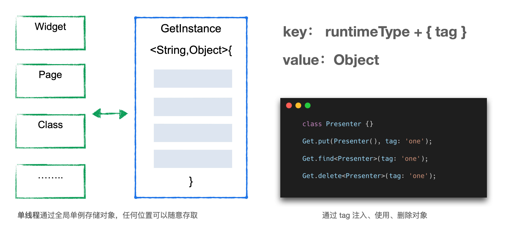

# GetX

[TOC]

GetX框架包括多个模块：**状态管理**、**依赖注入**、**路由管理**、**国际化**。它旨在为Flutter提供顶级的开发体验，是一个额外的轻量级但强大的解决方案。

GetX有三个基本原则：

1. 性能：注重内存和资源的最小消耗
2. 生产力：语法非常简捷
3. 结构：将界面、逻辑、依赖和路由完全解耦

## 状态管理

### 原理

 Flutter基于「声明式」来构建UI的 ，它让开发者摆脱组件的繁琐控制，聚焦于状态处理。

这样UI构建的复杂度转移到了从状态到布局的映射上，在Flutter中也就是Widget的构建。直接「声明式」开发的时候，而没有使用状态管理，那么遇到的问题总结有三个:

- 逻辑和页面 UI 耦合
- 难以跨组件 (跨页面) 访问数据
- 无法轻松的控制刷新范围

为了解决UI耦合的问题，几乎所有的状态管理框架使用了MVP的思路。将View层中的逻辑代码抽离到Presenter层中，而数据部分抽离到Model层中。

具体做法上，Flutter 和原生MVP 框架还是有所不同的：

在经典MVP模式中，一般 View和Presenter相互调用对方的接口来完成通信。

从 Presenter → View 关系上 View 在 Flutter 中对应 Widget，但在 Flutter 中 Widget 只是用户声明 UI 的配置，直接控制 Widget实例并不是好的做法。因此框架一般从View → Presenter 的关系上下手

这一点不同状态管理框架的解决思路不一样，从实现上他们可以分为两大类：

- 通过 **Flutter 树机制** 解决，例如 Provider；
- 通过 **依赖注入**，例如 Get。

 **通过 Flutter 树机制处理 V → P 的获取**

~~~dart
abstract class Element implements BuildContext { 
	/// 当前 Element 的父节点
	Element? _parent; 
}

abstract class BuildContext {
	/// 查找父节点中的T类型的State
	T findAncestorState0fType<T extends State>( );

	/// 遍历子元素的element对象
	void visitChildElements(ElementVisitor visitor);

	/// 查找父节点中的T类型的 InheritedWidget 例如 MediaQuery 等
	T dependOnInheritedWidget0fExactType<T extends InheritedWidget>({ 
		Object aspect });
	……
} 
~~~

所谓的 **Widget 树其实只是我们描述组件嵌套关系的一种说法，是一种虚拟的结构**。但 Element 和 RenderObject 在运行时实际存在，可以看到 Element 组件中包含了 `_parent` 属性，存放其父节点。而它实现了 `BuildContext` 接口，包含了诸多对于树结构操作的方法，例如 `findAncestorStateOfType`，向上查找父节点； `visitChildElements` 遍历子节点。

 `context.findAncestorStateOfType`一层一层地向上查找到需要的 Element 对象。provider 也是借助了这样的机制，完成了 View -> Presenter 的获取。通过 `Provider.of` 获取顶层 Provider 组件中的 Present 对象。显然，所有 Provider 以下的 Widget 节点，都可以通过自身的 context 访问到 Provider 中的 Presenter，很好地解决了跨组件的通信问题。

**通过依赖注入的方式解决 V → P**

Dart 是一种单线程的模型，所以不存在多线程下对于对象访问的竞态问题。基于此 Get 借助一个全局单例的 Map 存储对象。通过依赖注入的方式，实现了对 Presenter 层的获取。这样在任意的类中都可以获取到 Presenter。

### 响应式

- GetBuilder内部实际上是对StatefulWidget的封装，所以占用资源极小
- 响应式变量，因为使用的是StreamBuilder，会消耗一定资源

~~~dart
var name = "桥本有菜".obs;							//创建响应式变量

class CustomWidget extends StatelessWidget {
  @override
  Widget build(BuildContext context) {
    return Scaffold(
      //在Obx中的响应式变量都可以监听到，不需要显式监听，样板代码很少
      body: Obx(() => Text(name.value)),			//通过value属性获取值

    );
  }
}
~~~

事实上，.obs是一种语法糖，在上个例子中它将String类型转换为RxString类型

~~~dart
// 建议使用初始值，但不是强制性的
final name = RxString('');
final isLogged = RxBool(false);
final count = RxInt(0);
final balance = RxDouble(0.0);
final items = RxList<String>([]);
final myMap = RxMap<String, int>({});
~~~

更一般的形式是使用Rx泛型类

~~~dart
final name = Rx<String>('');
final isLogged = Rx<Bool>(false);
final count = Rx<Int>(0);
final balance = Rx<Double>(0.0);
final items = Rx<List<String>>([]);
final myMap = Rx<Map<String, int>>({});
final user = Rx<User>();			//自定义类型
~~~

### GetBuilder

下面我们来看一个例子：

~~~dart
class SimplePage extends StatelessWidget {
  @override
  Widget build(BuildContext context) {
    //在GetBuilder的范围内监听通知，并刷新
    return GetBuilder<SimpleController> (
     id : "id",								
     builder : (controller) {
        return Scaffold(
          appBar: AppBar(title : Text("Simple")),
          body : Center(
            //当Controller的update()被调用后，就会重新构造GetBuilder。
            child : Text(controller.counter.toString()),
          ),
          floatingActionButton: FloatingActionButton(
            onPressed: () {
              //更新UI
              controller.increment();
            },
            child : Icon(Icons.add),
          ),
        );
      }
    );
  }
}

class SimpleController extends GetxController {
  int _counter = 0;
  int get counter => _counter;

  void increment() {
    _counter++;
    //通知要更新UI
    update();
  }
}
~~~

出于性能考虑，我们要最小化要刷新的部分，因此代码改动如下：

~~~dart
class SimplePage extends StatelessWidget {
  @override
  Widget build(BuildContext context) {
    return Scaffold(
      appBar : AppBar(title : Text("Simple")),
      body : Center(
        child : GetBuilder<SimpleController>(
          init: SimpleController(),
          builder: (controller) {
            return Text(controller.counter.toString());
          },
        )
      ),
      floatingActionButton: FloatingActionButton(
        onPressed: () {
          //找到类型为SimpleController的控制器，并更新UI
          Get.find<SimpleController>().increment();
        },
        child : Icon(Icons.add),
      ),
    );
  }
}
~~~

- **tag：** Controller 依赖注入的 tag，根据 tag 获取 Controller 实例
- **id：** 刷新标识，结合 Controller 的 update 使用，可以刷新指定 GetBuilder 控件内的 Widget
- **init：** 初始化 Controller 值。以下两种情况会使用init值
  - `global` 为 false  
  -  `global` 为 true 时且 Controller 未注册依赖

通过find、put方法可以获取或创建一个状态控制器。

~~~dart
S find<S>({String? tag}) => GetInstance().find<S>(tag: tag);
~~~

~~~dart
 S put<S>(S dependency,
          {String? tag,
          bool permanent = false,
          InstanceBuilderCallback<S>? builder}) =>
      GetInstance().put<S>(dependency, tag: tag, permanent: permanent);
~~~

put方法会返回一个控制器。

~~~dart
class SimplePage extends StatefulWidget {
  @override
  State<SimplePage> createState() => _SimplePageState();
}

class _SimplePageState extends State<SimplePage> {
  @override
  Widget build(BuildContext context) {
    SimpleController controller = Get.put(SimpleController());	
      
    return Scaffold(
      appBar : AppBar(title : Text("Simple")),
      body : Center(
        child : Column(
          children: [
            Text(controller.counter.toString()),			//直接通过controller读取数据即可。但是没有GetBuilder控件，故无法监听相应的事件。即数据不是实时的，需要手动调用setState。
            ElevatedButton.icon(onPressed: () {setState(() {
            });}, icon: Icon(Icons.refresh), label: Text("refresh"))
          ],
        )
      ),
      floatingActionButton: FloatingActionButton(
        onPressed:  () async {
          Get.find<SimpleController>().increment();
        },
        child : Icon(Icons.add),
      ),
    );
  }
}
~~~

`GetxController`也有生命周期的：

~~~dart
class SimpleController extends GetxController {
  @override
  void onInit() {
    super.onInit();
  }
 
  @override
  void onReady() {
    super.onReady();
  }
 
  @override
  void onClose() {
    super.onClose();
  }
}
~~~

控制器中可以分别管理多个状态

~~~dart
class SimpleController extends GetxController {
    
  int _counter = 0;
  int get counter => _counter;
 
  String _name = "Lili";
  String get firstName => _name;
  
    void increment() {
    _counter++;
    _name = WordPair.random().asPascalCase;
    update(['counter']);		//向id为counter的GetBuilder控件发送更新通知，注意不是tag
  }
 
  void changeName() {
    _counter++;
    _name = WordPair.random().asPascalCase;
    update(['firstName']);		//向id为firstName为counter的GetBuilder控件发送更新通知，注意不是tag
  }
}

GetBuilder<SimpleAdvancedController>(
	id: 'counter',
	builder: (ctl) => Text(ctl.counter.toString()),
),

GetBuilder<SimpleAdvancedController>(
	id: 'name',
	builder: (ctl) => Text(ctl.firstName),
)
~~~

