[TOC]

## 虚拟化

虚拟化技术是一种将计算机物理资源进行抽象、转换为虚拟的计算机资源提供给程序使用的技术。这里所指的计算机资源包括：

- CPU 提供的**运算控制资源**
- 硬盘提供的**数据存储资源**
- 网卡提供的**网络传输资源**


程序对计算机资源的调用主要依赖于操作系统所给出的接口，通过System Call，向硬件发送指令。

虚拟化技术的两个关键作用：

- 适配不同平台的硬件，而加以抽象成统一的接口，来实现程序跨平台

- 对计算机资源进行管理，**提高计算机资源的使用率**，而非**减少程序资源的占用率**。

  例如，我们这里有一台运行 Nginx 的机器，由于 Nginx 运行对系统资源的消耗并不高，这就让系统几乎 95% 以上的资源处于闲置状态。这时候我们通过虚拟化技术，把其他的一些程序放到这台机器上来运行，它们就能够充分利用闲置的资源。

  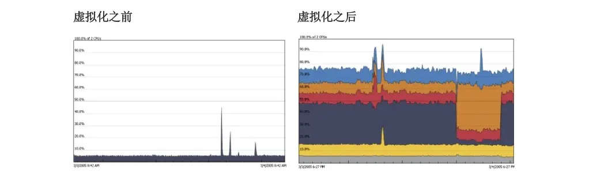

  虽然我们能够在操作系统里同时运行多个程序，但前提得是这些程序本身不存在冲突（环境冲突、依赖库冲突）。虚拟化技术可以避免这一点。


虚拟化技术的分类

- **硬件虚拟化**：物理硬件本身就提供虚拟化的支持
- **软件虚拟化**：通过软件的方式来实现虚拟化中关键的指令转换部分


所谓**虚拟机 ( Virtual Machine )**，通常来说就是，通过一个**虚拟机监视器 ( Virtual Machine Monitor )** 的设施来隔离操作系统与硬件（VMware），或者应用程序和操作系统（JVM虚拟机）

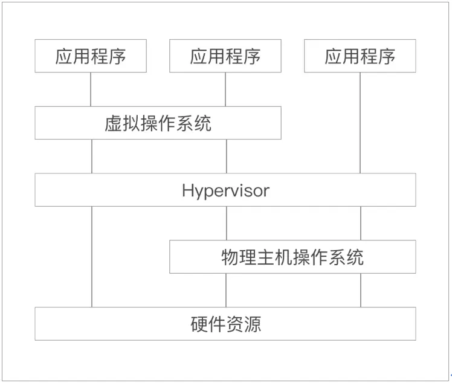

虚拟机是一种软件虚拟化技术，那么所有的指令都必须经过虚拟机监视器的处理，这也就意味着，虚拟机的性能是低下的。为了解决这个问题，真实的虚拟机程序常常不完全遵循 Hypervisor 的设计结构，而是引入一些其他技术来解决效率问题：

- 在 VMware Workstation、Xen 中我们能够看到硬件辅助虚拟化的使用，通过让指令直达支持虚拟化的硬件。
- 在JRE、HPHP 中，除了基于 Hypervisor 实现的解释执行机制外，还有即时编译 ( Just In Time ) 运行机制，让程序代码在运行前编译成符合当前硬件平台的机器码。

## 容器

**容器**应该属于操作系统虚拟化的范畴，即由操作系统提供虚拟化的支持。它并没有做指令转换的工作，这也就是为什么容器能够造就近乎完美的运行效率。相反它要求应用程序自身必须适配真实的操作系统，即必须遵循硬件平台的指令规则以及OS的System Call接口，也就是说它也没有解决程序跨平台兼容的问题，因此很多人并不认同容器技术属于虚拟化技术的范畴。

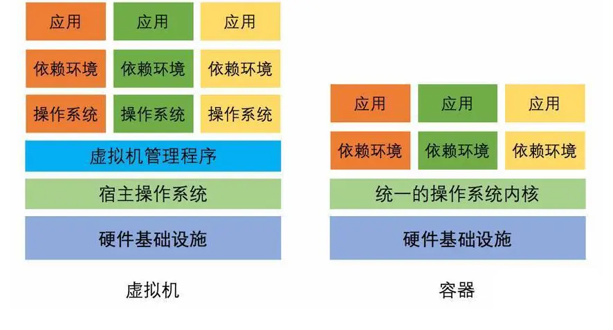

## Docker

Docker 项目是一个由 Go 语言实现的容器引擎。Docker 推崇一种轻量级容器的结构，即一个应用一个容器。

它的实现主要归结于三大技术：

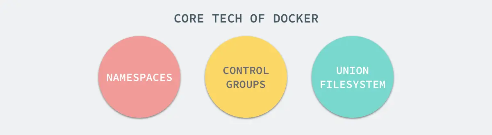

- **命名空间 ( Namespaces )** ：就是能够将操作系统资源进行切割划分，形成各自独立的空间。就实现而言，Linux Namespaces 可以分为很多具体的子系统，如 

  - User Namespace
  - Net Namespace
  - PID Namespace
  - Mount Namespace 
  - ...

  以  PID Namespace 为例，命名空间内的进程号是独立的

  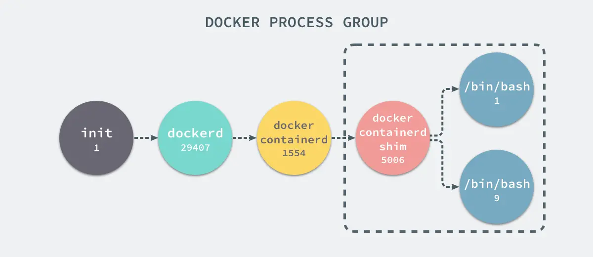

- **控制组 ( Control Groups )** ：控制硬件资源的。与以隔离进程、网络、文件系统等虚拟资源为目的 Namespace 不同，CGroups 主要做的是

  - 硬件资源的隔离
  - 资源分配：我们可以指定任意一个隔离环境对任意资源的占用值或占用率

  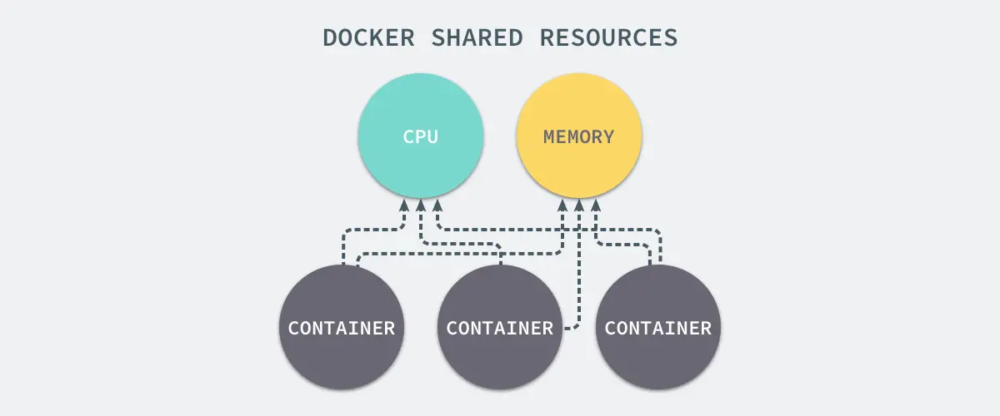

- **联合文件系统 ( Union File System )** ：一种能够同时挂载不同文件或文件夹到同一目录，形成一种联合文件结构的文件系统。在 Docker 中，提供了一种对 UnionFS 的改进实现，也就是 **AUFS ( Advanced Union File System )。**

  

  

在 Docker 体系里，有四个对象 ( Object ) ：

- **镜像 ( Image )**：只读的文件包，其中包含了虚拟环境运行最原始文件系统的内容。它以 AUFS 作为底层文件系统实现，通过这种方式，Docker 实现了一种增量式的镜像结构。一个镜像时候多个镜像层构成的，而镜像层可以被多个镜像共享，这样可以使得镜像分发更快速，以及减少镜像的存储空间。

  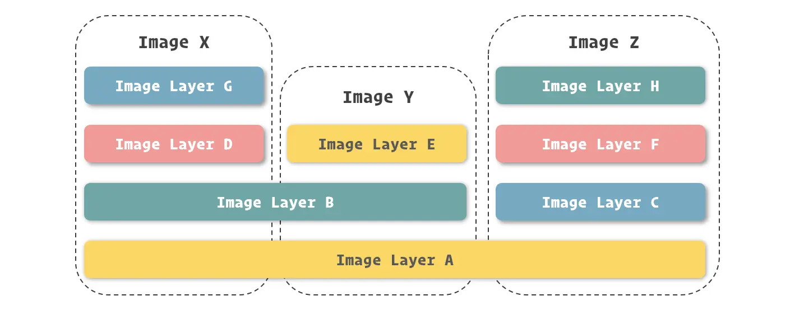

  一个镜像是不可变的，当要修改一个镜像时（修改文件权限、删除文件、写入文件、创建文件），会通过写时复制（Copy-on-Write ）技术创建一个可修改的镜像层，然后在该镜像层上修改。这也就意味着，修改镜像操作是镜像私有的，对于其他镜像是不可见的。

  当删除文件时，仅仅在新的镜像层上打上删除标记，并不真正删除只读镜像层的文件。

  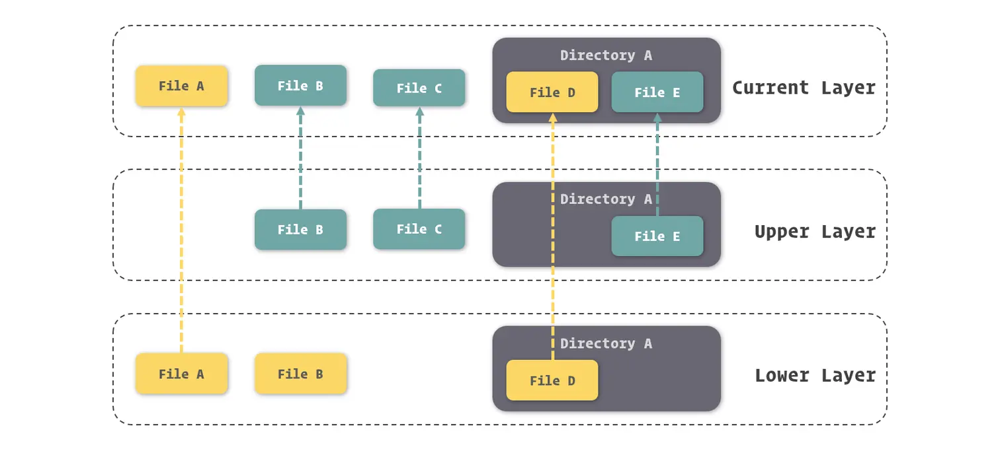

  每个镜像层都会根据其中的内容，生成一个64位的Hash值。

- **容器 ( Container )**：在容器技术中，容器就是用来隔离虚拟环境的基础设施，而在 Docker 里，它也被引申为隔离出来的虚拟环境。Docker 的容器应该有三项内容组成：

  - 一个 Docker 镜像
  - 一个程序运行环境
  - 一个指令集合

- **网络 ( Network )**：我们不但能够十分轻松的对每个容器的网络进行配置，还能在容器间建立虚拟网络，将数个容器包裹其中，同时与其他网络环境隔离。

  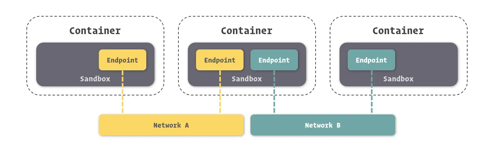

- **数据卷 ( Volume )**：在 Docker 中进行数据共享或持久化的文件或目录。对于运行在容器中的程序所生产的重要文件数据，我们可以使用数据卷来保存它们，由于数据卷是独立于容器存在的，所以其能保证数据不会随着容器的删除而丢失。


由于Docker 秒级的容器启停特性以及数据卷等特性，我们可以**随用随删容器**。


Docker Engine 是由多个独立软件所组成的软件包，其中最核心的是：

- `docker daemon`：提供容器管理、应用编排、镜像分发等功能，它向外暴露了一套 RESTful API，以服务的形式来运行这些功能。同时实现了镜像、容器、数据卷和网络模块。
- `docker CLI`：提供了一套简便的命令，无需手动构造HTTP请求


docker daemon 和 docker CLI 所组成的，正是一个标准 C/S ( Client-Server ) 结构的应用程序

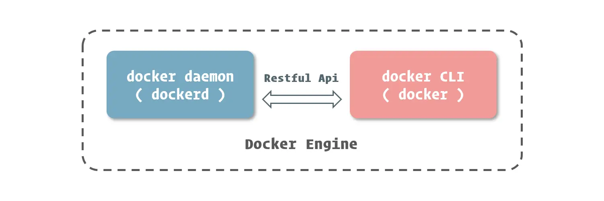

## 安装Docker

Ubuntu下的安装

~~~shell
sudo apt-get install apt-transport-https ca-certificates curl software-properties-common
$
curl -fsSL https://download.docker.com/linux/ubuntu/gpg | sudo apt-key add -

sudo add-apt-repository 
"deb[arch=amd64]https://download.docker.com/linux/ubuntu$(lsb_release -cs) stable"

sudo apt-get update

sudo apt-get install docker-ce

sudo systemctl enable docker
sudo systemctl start docker
~~~


为了支持 Windows 或 MacOS环境上的Docker，官方提供了`Docker Desktop`。它的实现原理是，在Windows 系统上搭建一个虚拟 Linux 系统，并在其之上安装和运行 Docker Daemon。

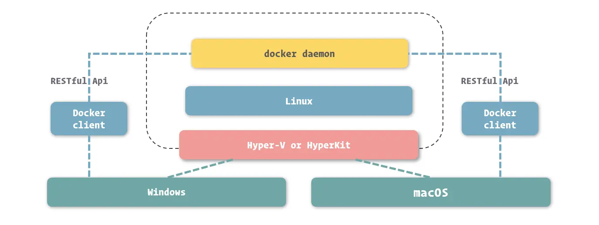

Docker 容器中能够通过数据卷的方式，来挂载宿主操作系统中的文件或目录。

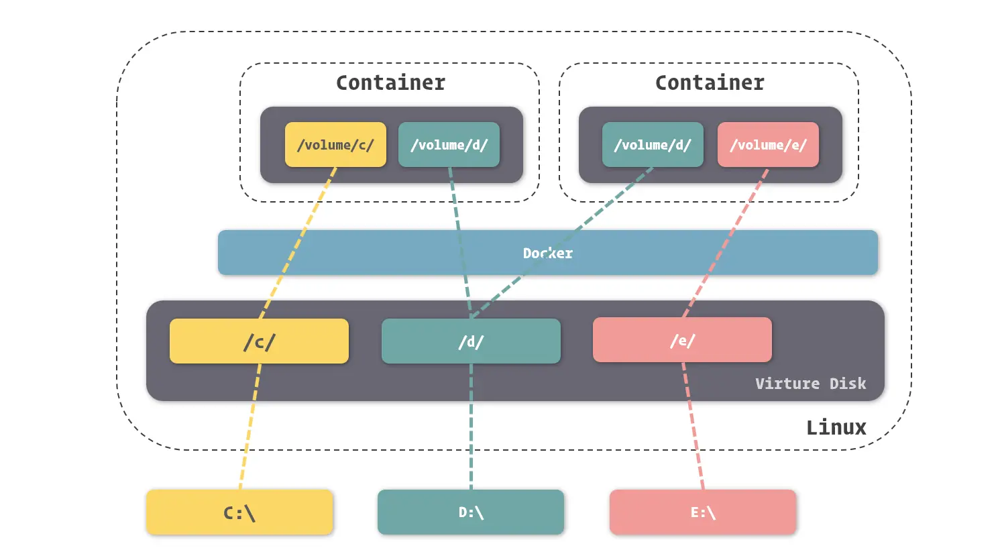


## 使用容器

### 生命周期

容器的生命周期

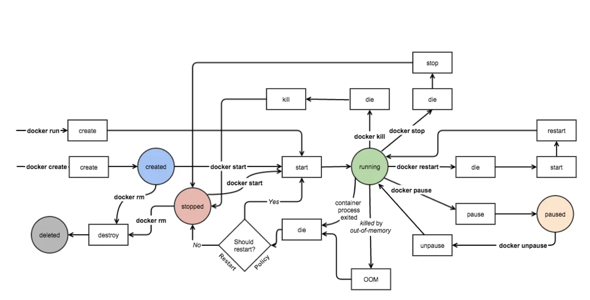

- **Created**：容器已经被创建，容器所需的相关资源已经准备就绪，但容器中的程序还未处于运行状态。
- **Running**：容器正在运行，也就是容器中的应用正在运行。
- **Paused**：容器已暂停，表示容器中的所有程序都处于暂停状态。发送`SIGSTOP`信号至容器内的所有进程，进程都被操作系统挂起，不会获得CPU时间以执行操作。
- **Stopped**：容器处于停止状态，占用的资源和沙盒环境都依然存在，只是容器中的应用程序均已停止。
- **Deleted**：容器已删除，相关占用的资源及存储在 Docker 中的管理信息也都已释放和移除。


当容器启动时，会将程序作为容器的主进程 ( 也就是 PID 为 1 的进程 )。当我们控制容器停止时，Docker 会向主进程发送结束信号，通知程序退出。而当容器中的主进程主动关闭时 ( 正常结束或出错停止 )，也会让容器随之停止。

### 运行并管理容器

当我们选择好镜像以后，就可以通过 `docker create` 这个命令来创建容器了。如果本地没有该镜像，那么Docker 会从中心仓库中拉取。

~~~shell
$ sudo docker create nginx:1.12
34f277e22be252b51d204acbb32ce21181df86520de0c337a835de6932ca06c3
~~~

命令执行成功后，会打印 Docker 为容器所分配的 ID。我们可以通过 `--name` 这个选项来配置容器名。

~~~shell
$ sudo docker create --name nginx nginx:1.12
~~~


`docker start` 命令来启动容器：

~~~shell
$ sudo docker start nginx
~~~


`docker run` 这个命令将 `docker create` 和 `docker start` 这两步操作合成为一步

~~~java
$ sudo docker run --name nginx -d nginx:1.12
89f2b769498a50f5c35a314ab82300ce9945cbb69da9cda4b022646125db8ca7
~~~

我们可以通过 `-d` 或 `--detach` 这个选项告诉 `Docker` 在启动后，将程序与控制台分离，使其进入“后台”运行。


`docker ps` 命令罗列出 Docker 中的容器。

~~~shell
$ sudo docker ps
~~~

默认情况下，`docker ps` 列出的容器是处于运行中的容器，如果要列出所有状态（除了已删除的）的容器，需要增加 `-a` 或 `--all` 选项。


要将正在运行的容器停止，我们可以使用 `docker stop` 命令。

~~~shell
$ sudo docker stop nginx
~~~


当我们需要完全删除容器时，可以通过 `docker rm` 命令将容器进行删除。

```shell
$ sudo docker rm nginx
```

正在运行中的容器默认情况下是不能被删除的，我们可以通过增加 `-f` 或 `--force` 选项来让 `docker rm` 强制停止并删除容器。


通过`docker exec`命令，我们可以让容器运行我们所给出的命令。

~~~shell
$ sudo docker exec nginx more /etc/hostname
::::::::::::::
/etc/hostname
::::::::::::::
83821ea220ed
~~~

通过`docker exec` 命令来启动 sh 或 bash，我们可以进入到容器中：

~~~shell
$ sudo docker exec -it nginx bash
root@83821ea220ed:/#
~~~

- `-i` ( `--interactive` ) 表示保持我们的输入流，这样 bash 才能识别到我们的命令
-  `-t` ( `--tty` ) 表示启用一个伪终端，这样我们可以观察到 bash 的执行结果

进入容器后，那些`/bin` `/lib`等系统文件夹都是容器私有的，并不是挂载操作系统上的。


`docker attach` 命令，用于将我们的输入输出流衔接到了容器的主程序，这样我们的输入输出操作也就直接针对了这个程序，而我们发送的 Linux 信号也会转移到这个程序上。例如我们可以通过 Ctrl + C 来向程序发送停止信号，让程序停止 ( 从而容器也会随之停止 )。

~~~shell
sudo docker attach nginx
~~~


### 配置网络

Docker 能让应用从宿主机操作系统的网络环境中独立出来，形成容器自有的网络设备、IP 协议栈、端口套接字、IP 路由表、防火墙等等与网络相关的模块。


 Docker **容器网络模型 ( Container Network Model ）**由以下三部分组成：


- **沙盒 ( Sandbox )**：提供了容器的虚拟网络栈
- **网络 ( Network )**：Docker 内部的虚拟子网，网络内的参与者相互可见并能够进行通讯
- **端点 ( Endpoint )**


容器网络模型为容器引擎提供了一套标准的网络对接范式，而在 Docker 中，实现这套范式的是 Docker 所封装的 libnetwork 模块。目前 Docker 官方为我们提供了五种 Docker 网络驱动，分别是：**Bridge Driver**、**Host Driver**、**Overlay Driver**、**MacLan Driver**、**None Driver**。

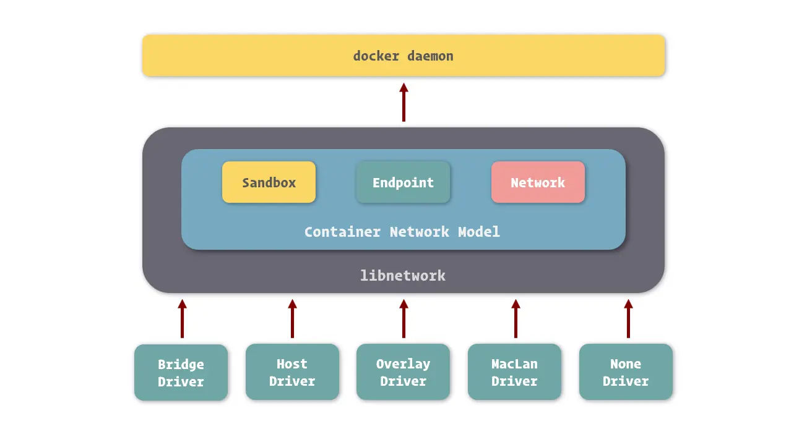

- Bridge 网络是 Docker 容器的默认网络驱动，它通过网桥来实现网络通讯 ( 网桥网络的实现可以基于硬件，也可以基于软件 )
- Overlay 网络是借助 Docker 集群模块 Docker Swarm 来搭建的跨 Docker Daemon 网络


要让一个容器连接到另外一个容器，我们可以在容器通过 `docker create` 或 `docker run` 创建时通过 `--link` 选项进行配置。

~~~shell
$ sudo docker run -d --name mysql -e MYSQL_RANDOM_ROOT_PASSWORD=yes mysql
$ sudo docker run -d --name webapp --link mysql webapp:latest
~~~

这样就打通两个容器间的网络，实现它们之间的网络互通。只有容器自身允许的端口，才能被其他容器所访问。端口的暴露可以通过 Docker 镜像进行定义，也可以在容器创建时通过 `--expose` 选项来进行定义：

```shell
$ sudo docker run -d --name mysql -e MYSQL_RANDOM_ROOT_PASSWORD=yes --expose 13306 --expose 23306 mysql:5.7
```

webapp通过将容器名作为域名，来访问其他容器提供的服务。这是因为Docker在其内部网络中提供了DNS解析功能。

~~~java
String url = "jdbc:mysql://mysql:3306/webapp"; // 这里通过mysql:3306来访问mysql容器
~~~

在 Docker 里还支持在连接时使用别名，来使我们摆脱容器名的限制。

~~~shell
$ sudo docker run -d --name webapp --link mysql:database webapp:latest
~~~

这样通过`"jdbc:mysql://database:3306/webapp"`便可以访问数据库了

当我们启动 Docker 服务时，它会为我们创建一个默认的 bridge 网络。在没有明确为容器指定网络时，容器都会连接到这个网络中。我们可以通过 `docker inspect` 命令，在 Network 部分看到与容器网络相关的信息。

~~~shell
$ sudo docker inspect mysql
[
    {
## ......
        "NetworkSettings": {
## ......
            "Networks": {
                "bridge": {
                    "IPAMConfig": null,
                    "Links": null,
                    "Aliases": null,
                    "NetworkID": "bc14eb1da66b67c7d155d6c78cb5389d4ffa6c719c8be3280628b7b54617441b",
                    "EndpointID": "1e201db6858341d326be4510971b2f81f0f85ebd09b9b168e1df61bab18a6f22",
                    "Gateway": "172.17.0.1",
                    "IPAddress": "172.17.0.2",
                    "IPPrefixLen": 16,
                    "IPv6Gateway": "",
                    "GlobalIPv6Address": "",
                    "GlobalIPv6PrefixLen": 0,
                    "MacAddress": "02:42:ac:11:00:02",
                    "DriverOpts": null
                }
            }
## ......
        }
## ......
    }
]

~~~

在 Docker 里，我们也能够创建虚拟子网

~~~shell
$ sudo docker network create -d bridge individual
~~~

通过 `-d` 选项我们可以为新的网络指定驱动的类型。

通过 `docker network ls` 或是 `docker network list` 可以查看 Docker 中已经存在的网络。

~~~shell
$ sudo docker network ls
NETWORK ID          NAME                DRIVER              SCOPE
bc14eb1da66b        bridge              bridge              local
35c3ef1cc27d        individual          bridge              local
~~~

之后在我们创建容器时，可以通过 `--network` 来指定容器所加入的网络

~~~shell
$ sudo docker run -d --name mysql -e MYSQL_RANDOM_ROOT_PASSWORD=yes --network individual mysql:5.7
~~~

**两个处于不同网络的容器，是不能相互连接引用的。**


通过 Docker 端口映射功能，我们可以把容器的端口映射到宿主操作系统的端口上，当我们从外部访问宿主操作系统的端口时，数据请求就会自动发送给与之关联的容器端口上。

~~~shell
$ sudo docker run -d --name nginx -p 80:80 -p 443:443 nginx:1.12
~~~

使用端口映射选项的格式是 `-p <ip>:<host-port>:<container-port>`，其中 ip 是宿主操作系统的监听 ip，可以用来控制监听的网卡，默认为 0.0.0.0，也就是监听所有网卡。

在 Windows 和 macOS 中使用映射，需要额外进行一次端口映射。

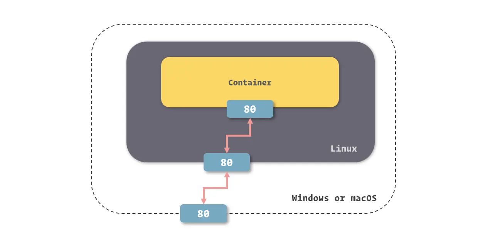

### 管理和存储数据

我们如何解决从容器外部获取内部文件，以及内部数据的持久化存储？我们可以将宿主操作系统中的文件系统里的文件或目录挂载到容器中，便能够让容器内外都共享这个文件。Docker 提供了三种适用于不同场景的文件系统挂载方式：**Bind Mount**、**Volume** 和 **Tmpfs Mount**。

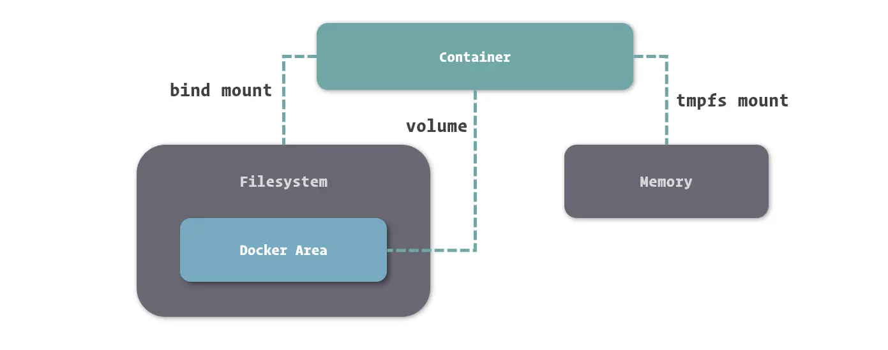

- **Bind Mount** 能够直接将宿主操作系统中的目录和文件挂载到容器内的文件系统中，形成形成挂载映射关系，在容器内外对文件的读写，都是相互可见的。
- **Volume**：我们只需要指定容器内的目录，不需要关心具体挂载到了宿主操作系统中的哪里。数据卷的本质其实依然是宿主操作系统上的一个目录，只不过这个目录存放在 Docker 内部，由 Docker 进行管理。
- **Tmpfs Mount** ：支持挂载系统内存中的一部分到容器的文件系统里。对于读写速度要求较高，数据变化量大，但不需要持久保存的数据，可以使用Tmpfs Mount挂载


我们可以在创建容器时，通过`-v` 或 `--volume` 来挂载宿主操作系统目录，`-v <host-path>:<container-path>`，其中`host-path`必须使用绝对路径，避免和Vloume挂载产生命令冲突。

~~~shell
$ sudo docker run -d --name nginx -v /webapp/html:/usr/share/nginx/html nginx:1.12
~~~

在挂载选项 `-v` 后再接上 `:ro` 就可以只读挂载了。

~~~shell
$ sudo docker run -d --name nginx -v /webapp/html:/usr/share/nginx/html:ro nginx:1.12
~~~


挂载临时文件目录（内存）要通过 `--tmpfs` 这个选项来完成：

~~~shell
$ sudo docker run -d --name webapp --tmpfs /webapp/cache webapp:latest
~~~


使用 `-v` 或 `--volume` 选项来定义数据卷的挂载（`-v <container-path>`）。

~~~shell
$ sudo docker run -d --name webapp -v /webapp/storage webapp:latest
~~~

可以通过 `docker inspect` 看到容器中数据卷挂载的信息：

~~~shell
$ sudo docker inspect webapp
[
    {
## ......
        "Mounts": [
            {
                "Type": "volume",
                "Name": "2bbd2719b81fbe030e6f446243386d763ef25879ec82bb60c9be7ef7f3a25336",
                "Source": "/var/lib/docker/volumes/2bbd2719b81fbe030e6f446243386d763ef25879ec82bb60c9be7ef7f3a25336/_data",
                "Destination": "/webapp/storage",
                "Driver": "local",
                "Mode": "",
                "RW": true,
                "Propagation": ""
            }
        ],
## ......
    }
]
~~~

- Source 是 Docker 为我们分配的、用于挂载的宿主机目录


我们也可以通过 `-v <name>:<container-path>` 这种形式来命名数据卷。

~~~shell
$ sudo docker run -d --name webapp -v appdata:/webapp/storage webapp:latest
~~~


我们使用 `-v` 选项挂载数据卷时，如果数据卷不存在，Docker 会为我们自动创建和分配宿主操作系统的目录，而如果同名数据卷已经存在，则会直接引用。下面是共用数据卷的示例：

~~~shell
$ sudo docker run -d --name webapp -v html:/webapp/html webapp:latest
$ sudo docker run -d --name nginx -v html:/usr/share/nginx/html:ro nginx:1.12
~~~


通过 `docker volume create` 我们可以不依赖于容器创建，而独立创建数据卷。

~~~shell
$ sudo docker volume create appdata
~~~

通过 `docker volume ls` 可以列出当前已创建的数据卷。

~~~shell
$ sudo docker volume ls
~~~

通过 `docker volume rm` 来删除指定的数据卷：

~~~shell
$ sudo docker volume rm appdata
~~~

在删除数据卷之前，我们必须保证数据卷没有被任何容器所使用，否则 Docker 拒绝删除操作

在 `docker rm` 命令中，我们可以通过增加 `-v` 选项来删除容器关联的数据卷。如果不添加`-v`选项，那么删除容器的同时，并不会删除与之关联的数据卷

~~~shell
$ sudo docker rm -v webapp
~~~

通过`docker volume prune` 命令，可以删除那些没有被容器引用的数据卷。

~~~shell
$ sudo docker volume prune -f
Deleted Volumes:
af6459286b5ce42bb5f205d0d323ac11ce8b8d9df4c65909ddc2feea7c3d1d53
0783665df434533f6b53afe3d9decfa791929570913c7aff10f302c17ed1a389
65b822e27d0be93d149304afb1515f8111344da9ea18adc3b3a34bddd2b243c7
## ......
~~~


数据卷容器就是不需要运行的容器，我们可以在其中定义一个或多个数据卷并持有它们的引用。

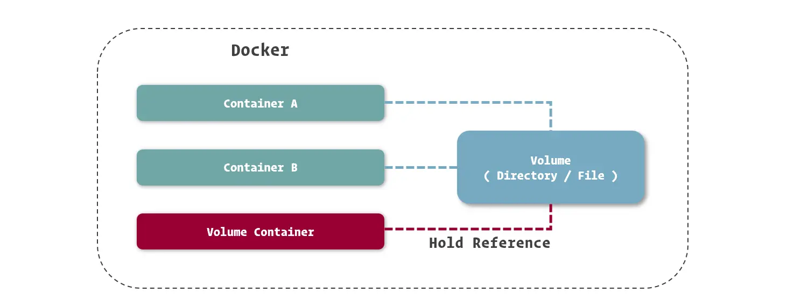

由于不需要容器本身运行，因而我们找个简单的系统镜像都可以完成创建。

```shell
$ sudo docker create --name appdata -v /webapp/storage ubuntu
```

我们可以在创建容器时，添加`--volumes-from` 选项来指定数据卷容器：

~~~shell
sudo docker run -d --name webapp --volumes-from appdata webapp:latest
~~~

引用数据卷容器时，不需要再定义数据卷挂载到容器中的位置，Docker 会以数据卷容器中的挂载定义，将数据卷挂载到引用的容器中。

利用数据卷容器，我们还能够更方便的对数据卷中的数据进行迁移。

备份数据卷

~~~shell
$ sudo docker run --rm --volumes-from appdata -v /backup:/backup ubuntu tar cvf /backup/backup.tar /webapp/storage
~~~

-  `--rm` 选项，让容器在停止后自动删除，相当于创建一个临时容器
- 如果我们在镜像定义之后接上命令，可以直接替换掉主程序启动命令，而去执行这一条命令。这里我们要执行的命令为`tar cvf /backup/backup.tar /webapp/storage`。这里我们将数据卷容器中的`/webapp/storage`打包到宿主操作系统中的`/backup`文件夹下

恢复数据卷

~~~shell
$ docker run --rm --volumes-from appdata -v /backup:/backup ubuntu tar xvf /backup/backup.tar -C /webapp/storage --strip
~~~


此外，可以通过 `--mount` 这个选项来配置复杂的挂载

~~~shell
$ sudo docker run -d --name webapp webapp:latest --mount 'type=volume,src=appdata,dst=/webapp/storage,volume-driver=local,volume-opt=type=nfs,volume-opt=device=<nfs-server>:<nfs-path>' webapp:latest

~~~

通常，`-v` 基本上足够满足我们的需求。

## 操作镜像

### 管理镜像

Docker Hub （[hub.docker.com/](https://link.juejin.cn/?target=https%3A%2F%2Fhub.docker.com%2F)）是 Docker 官方建立的中央镜像仓库。

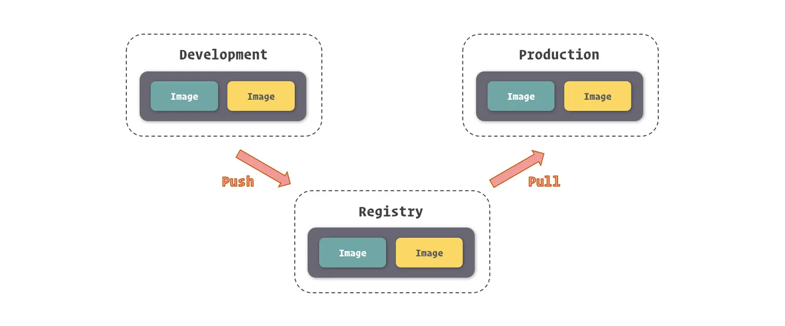

我们可以使用 `docker pull` 命令来拉取镜像：

~~~shell
$ sudo docker pull ubuntu
Using default tag: latest
latest: Pulling from library/ubuntu
124c757242f8: Downloading [===============================================>   ]  30.19MB/31.76MB
9d866f8bde2a: Download complete 
fa3f2f277e67: Download complete 
398d32b153e8: Download complete 
afde35469481: Download complete 
~~~

每一行代表的就是一个镜像层，如果在本地已经存在相同的镜像层 ( 共享于其他的镜像 )，那么Docker直接从本地获取。

如果你想从其他仓库拉取镜像，你需要在镜像名前指定仓库地址：

~~~shell
$ docker pull myregistry.com/myimage:1.0
~~~


`docker push`命令用于将镜像推送到仓库中：

~~~shell
## 推送到 Docker Hub上
$ docker push myusername/myimage:1.0

## 推送到指定仓库
$ docker push myregistry.com/myusername/myimage:1.0
~~~


`docker search` 这个命令搜索 Docker Hub 中的镜像：

~~~shell
$ sudo docker search ubuntu
~~~


通过`docker images`，来查看镜像：

~~~shell
$ docker images
REPOSITORY          TAG                 IMAGE ID            CREATED             SIZE
php                 7-fpm               f214b5c48a25        9 days ago          368MB
redis               3.2                 2fef532eadb3        11 days ago         76MB
redis               4.0                 e1a73233e3be        11 days ago         83.4MB
cogset/cron         latest              c01d5ac6fc8a        15 months ago       125MB
~~~

镜像层的 ID 既可以识别每个镜像层，也可以用来直接识别镜像 ( 因为根据最上层镜像能够找出所有依赖的下层镜像，所以最上层进行的镜像层 ID 就能表示镜像的 ID )。镜像的命名我们可以分成三个部分：**username**、**repository** 和 **tag**

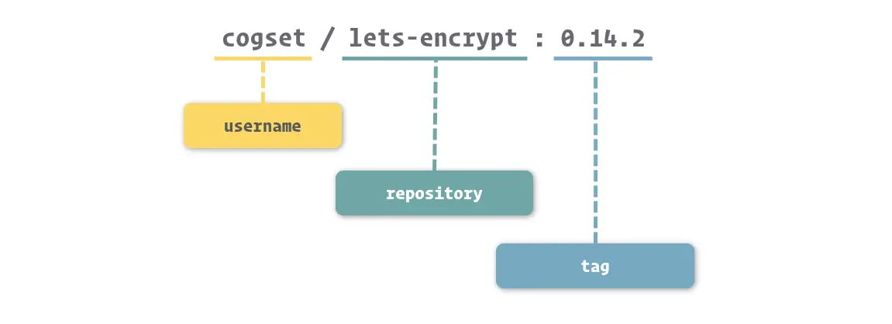

仓库名通常命名为软件名。而tag通常是软件的版本号。当我们在操作中没有具体给出镜像的 tag 时，Docker 会采用 **latest** 作为缺省 tag。


删除镜像的命令是 `docker rmi`，参数是镜像的名称或 ID。

~~~shell
$ sudo docker rmi ubuntu:latest
Untagged: ubuntu:latest
Untagged: ubuntu@sha256:de774a3145f7ca4f0bd144c7d4ffb2931e06634f11529653b23eba85aef8e378
Deleted: sha256:cd6d8154f1e16e38493c3c2798977c5e142be5e5d41403ca89883840c6d51762
Deleted: sha256:2416e906f135eea2d08b4a8a8ae539328482eacb6cf39100f7c8f99e98a78d84
Deleted: sha256:7f8291c73f3ecc4dc9317076ad01a567dd44510e789242368cd061c709e0e36d
Deleted: sha256:4b3d88bd6e729deea28b2390d1ddfdbfa3db603160a1129f06f85f26e7bcf4a2
Deleted: sha256:f51700a4e396a235cee37249ffc260cdbeb33268225eb8f7345970f5ae309312
Deleted: sha256:a30b835850bfd4c7e9495edf7085cedfad918219227c7157ff71e8afe2661f63
~~~

删除镜像的过程其实是删除镜像内的镜像层。当镜像层的引用数为0时，才真正删除，否则仅仅减少引用数。

### 保护和共享镜像

将正在运行的容器保存为镜像的命令是 `docker commit`

~~~shell
$ sudo docker commit webapp -m "Configured" webapp
sha256:0bc42f7ff218029c6c4199ab5c75ab83aeaaed3b5c731f715a3e807dda61d19e
~~~


我们通过`docker tag` 命令，来为镜像命名：

~~~shell
$ sudo docker tag 0bc42f7ff218 webapp:1.0

## 重命名
$ sudo docker tag webapp:1.0 webapp:latest
~~~

当我们对未命名的镜像进行命名后，Docker 就不会在镜像列表里继续显示这个镜像，取而代之的是我们新的命名。而如果我们对以后镜像使用 `docker tag`，旧的镜像依然会存在于镜像列表中。

~~~shell
$ sudo docker images
REPOSITORY            TAG                 IMAGE ID            CREATED             SIZE
webapp                1.0                 0bc42f7ff218        29 minutes ago      372MB
webapp                latest              0bc42f7ff218        29 minutes ago      372MB
## ......
~~~

从中可见，这两个镜像都引用着相同的顶级镜像层。


`docker save` 命令可以迁移镜像：

~~~shell
## 以输出流的形式迁移镜像
$ sudo docker save webapp:1.0 > webapp-1.0.tar

## 以文件的形式迁移镜像
$ sudo docker save -o ./webapp-1.0.tar webapp:1.0

## 支持批量迁移
$ sudo docker save -o ./images.tar webapp:1.0 nginx:1.12 mysql:5.7
~~~

`docker load` 命令可以导入镜像：

~~~shell
## 以输入流的形式迁移镜像
$ sudo docker load < webapp-1.0.tar

## 以文件的形式导入镜像
$ sudo docker load -i webapp-1.0.tar
~~~


使用 `docker export` 命令我们可以直接导出容器，我们可以把它简单的理解为 `docker commit` 与 `docker save` 的结合体。

~~~shell
$ sudo docker export -o ./webapp.tar webapp
~~~

使用 `docker import` 并非直接将容器导入，还是将镜像导入：

~~~shell
$ sudo docker import ./webapp.tar webapp:1.0
~~~

### Dockerfile

Dockerfile 是 Docker 中用于定义镜像自动化构建流程的配置文件。而且Dockerfile 的体积远小于镜像包，更容易进行快速迁移和部署。

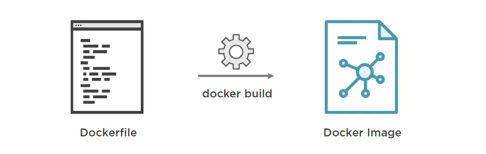

Dockerfile 的指令简单分为五大类：

- **基础指令**，例如`FROM`，它指定了基础镜像；`MAINTAINER`用于用来声明镜像的作者
- **控制指令**：`ARG`用来定义构建时的变量，这些变量在`Dockerfile`中可以被其他指令使用。`WORKDIR`改变了工作目录，后续指令如果涉及到相对路径，都是相对这个工作目录。
- **引入指令**：用于将外部文件直接引入到镜像内部
- **执行指令**：这类指令主要为`RUN`，`CMD`和`ENTRYPOINT`，用于设定在构建镜像或容器启动时需要执行的脚本或命令。
- **配置指令**：用于配置容器的属性。例如，`EXPOSE`用来声明容器运行时监听的端口，`ENV`用于设置环境变量，`VOLUME`用于创建挂载点以便容器之间或容器与宿主机之间共享文件。


常见的`Dockerfile`指令：

- `FROM`：

  ~~~dockerfile
  FROM <image> [AS <name>]
  FROM <image>[:<tag>] [AS <name>]
  FROM <image>[@<digest>] [AS <name>]
  ~~~

  这里digest是一个镜像的sha256，它可以代替tag

- `RUN`：在构建时，Docker会执行由`RUN`指定的命令，并将它们对文件系统的修改记录下来，形成镜像的变化。

  ~~~dockerfile
  RUN <command>
  RUN ["executable", "param1", "param2"]
  ~~~

  一个Dockerfile中可以包含多个RUN，按定义顺序执行

  ~~~dockerfile
  RUN apt-get update; \
      apt-get install -y --no-install-recommends $fetchDeps; \
      rm -rf /var/lib/apt/lists/*;
  ~~~

  ~~~dockerfile
  RUN apt-get update
  RUN apt-get install -y --no-install-recommends $fetchDeps
  RUN rm -rf /var/lib/apt/lists/*
  ~~~

  绝大多数镜像会将命令合并到一条指令中，因为这种做法减少了镜像层的数量.

- `ENTRYPOINT & CMD`：指定容器启动时执行的第一条命令

  ~~~dockerfile
  ENTRYPOINT ["executable", "param1", "param2"]
  ENTRYPOINT command param1 param2
  
  CMD ["executable","param1","param2"]
  CMD ["param1","param2"]
  CMD command param1 param2
  ~~~

  当 ENTRYPOINT 与 CMD 同时给出时，CMD 中的内容会作为 ENTRYPOINT 定义命令的参数，最终执行容器启动的还是 ENTRYPOINT 中给出的命令。

- `EXPOSE`：为镜像指定要暴露的端口

  ~~~dockerfile
  EXPOSE <port> [<port>/<protocol>...]
  ~~~
  
- `COPY & ADD` 指令，能够帮助我们直接从宿主机的文件系统里，拷贝内容到镜像里的文件系统中。

  ~~~dockerfile
  COPY [--chown=<user>:<group>] <src>... <dest>
  ADD [--chown=<user>:<group>] <src>... <dest>
  
  COPY [--chown=<user>:<group>] ["<src>",... "<dest>"]
  ADD [--chown=<user>:<group>] ["<src>",... "<dest>"]
  ~~~
  
  ADD & COPY 能够支持使用网络端的 URL 地址作为 src 源，但ADD 在源文件被识别为压缩包时，自动进行解压，而 COPY 没有这两个能力。
  
  `<目标路径>` 可以是容器内的绝对路径，也可以是相对于工作目录的相对路径。在使用该指令的时候还可以加上 `--chown=<user>:<group>` 选项来改变文件的所属用户及所属组。
  
  ```dockerfile
  COPY --chown=55:mygroup files* /mydir/
  COPY --chown=bin files* /mydir/
  COPY --chown=1 files* /mydir/
  COPY --chown=10:11 files* /mydir/
  ```
  
- `ENV`，用于设定环境变量

  ~~~dockerfile
  ENV TOMCAT_MAJOR 8
  ENV TOMCAT_VERSION 8.0.53
  
  RUN wget -O tomcat.tar.gz "$TOMCAT_VERSION.tar.gz"
  ~~~

  在创建容器时使用 `-e` 或是 `--env` 选项，可以对环境变量的值进行覆盖，或定义新的环境变量。

  ~~~shell
  $ sudo docker run -e MYSQL_ROOT_PASSWORD=my-secret-pw -d mysql:5.7
  ~~~

- `VOLUME`

- `ARG`：

  ~~~dockerfile
  ARG TOMCAT_MAJOR
  # 提供一个默认值
  ARG TOMCAT_VERSION=8
  ~~~

  我们可以在构建时通过 `docker build` 的 `--build-arg` 选项来设置参数变量。

  ```shell
  shell
  复制代码$ sudo docker build --build-arg TOMCAT_MAJOR=8 --build-arg TOMCAT_VERSION=8.0.53 -t tomcat:8.0 ./tomcat
  ```

  

  ARG 指令有生效范围，如果在 `FROM` 指令之前指定，那么只能用于 `FROM` 指令中。

  ~~~dockerfile
  ARG DOCKER_USERNAME=library
  FROM ${DOCKER_USERNAME}/alpine
  RUN set -x ; echo ${DOCKER_USERNAME}
  ~~~

  使用上述 Dockerfile 会发现无法输出 `${DOCKER_USERNAME}` 变量的值，要想正常输出，你必须在 `FROM` 之后再次指定 `ARG`

  ~~~dockerfile
  # 只在 FROM 中生效
  ARG DOCKER_USERNAME=library
  FROM ${DOCKER_USERNAME}/alpine
  # 要想在 FROM 之后使用，必须再次指定
  ARG DOCKER_USERNAME=library
  RUN set -x ; echo ${DOCKER_USERNAME}
  ~~~

- `WORKDIR` 指令可以来指定工作目录（或者称为当前目录）

  ```
  RUN cd /app
  RUN echo "hello" > world.txt
  ```

  如果将这个 `Dockerfile` 进行构建镜像运行后，会发现找不到 `/app/world.txt` 文件。因为在 Shell 中，连续两行是同一个进程执行环境，因此前一个命令修改的内存状态，会直接影响后一个命令；而在 `Dockerfile` 中，这两行 `RUN` 命令的执行环境根本不同，是两个完全不同的容器。这就是对 `Dockerfile` 构建分层存储的概念不了解所导致的错误。我们可以通过`WORKDIR` 指令来解决这个问题：

  ~~~dockerfile
  # 如果你的 WORKDIR 指令使用的相对路径，那么所切换的路径与之前的 WORKDIR 有关：
  WORKDIR /a
  WORKDIR b
  WORKDIR c
  
  RUN pwd 	#/a/b/c
  ~~~

  


构建镜像的命令为 `docker build`

~~~shell
$ sudo docker build ./webapp
~~~

这里我们指定了一个目录，Docker会从该目录中寻找Dockerfile文件，而且也是COPY与ADD中源操作数的工作目录（当前目录）。我们可以通过 `-f` 选项单独给出 Dockerfile 文件的路径。

~~~shell
$ sudo docker build -t webapp:latest -f ./webapp/a.Dockerfile ./webapp
~~~

  `-t` 选项，用它来指定新生成镜像的名称。

~~~shell
$ sudo docker build -t webapp:latest ./webapp
~~~

## 组合应用


## 实践

### JavaWeb

