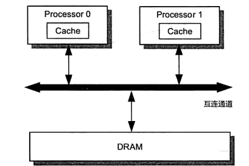
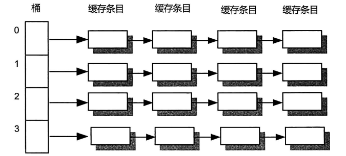
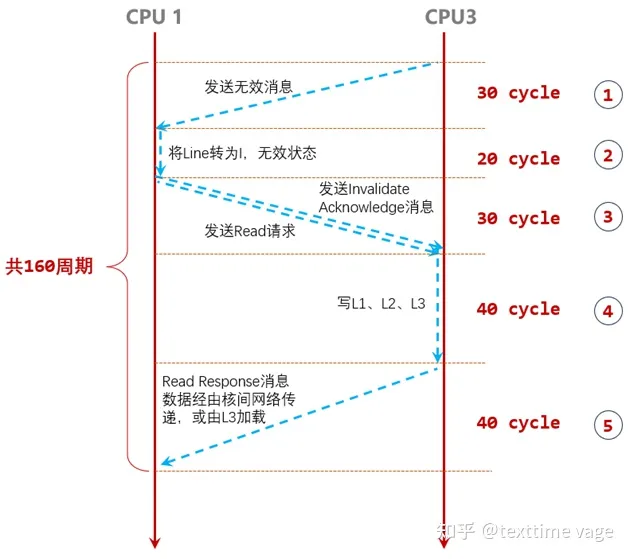
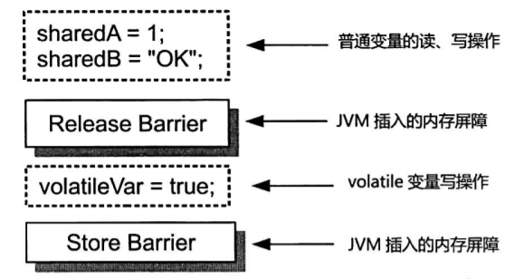
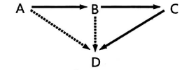
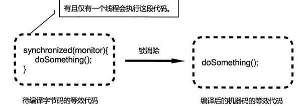
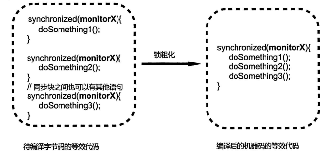
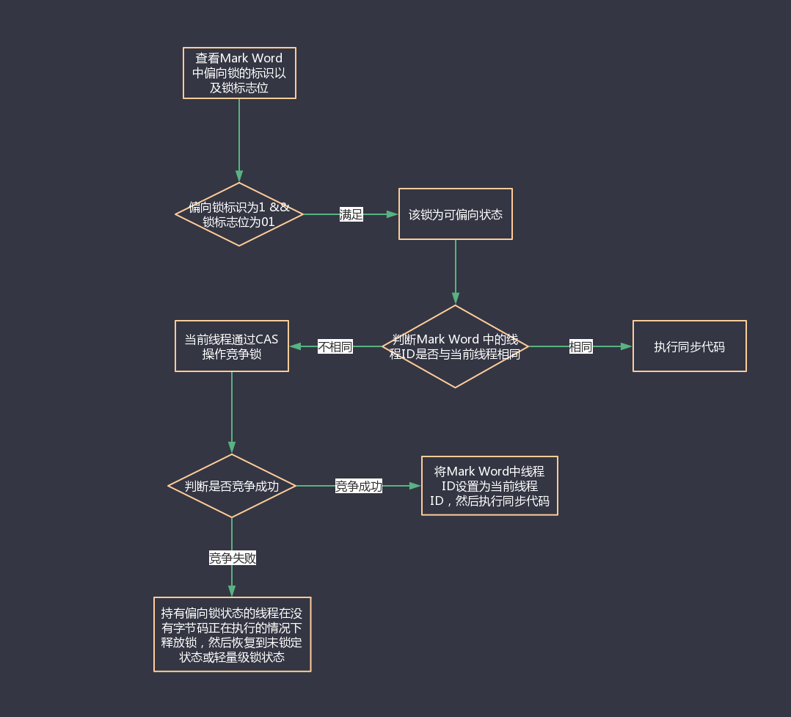
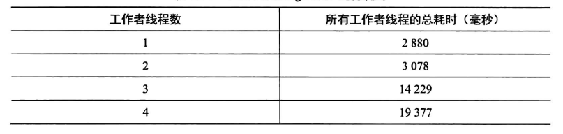

# 多线程编程的硬件基础与 Java 内存模型

[TOC]

## 高速缓存

高速缓存填补了处理器与内存之间的鸿沟。

现代计算机系统高速缓存结构：

从内部结构来看，高速缓存相当于一个拉链散列表(Chained Hash Table)

缓存条目可被进一步划分为Tag、Data Block 以及 Flag 这三个部分

- Data Block，也被称为缓存行(Cache Line)，是高速缓存与主内存之间的数据交换最小单元
- Tag 表述与缓存数据对应的内存地址信息（最高有效位）
- Flag 表示缓存行的状态信息（可读、可写、是否有效）

处理器在执行内存访问操作时，会将内存地址解码为tag、index、offset这三部分数据。

- index：桶编号
- tag：缓存条目的索引
- offset：缓存行内的偏移量

## 缓存一致性协议——MESI

MESI协议是强一致性，它的感知层次是收到请求，而不是发送请求。

`MESI（Modified-Exclusive-Shared-Invalid）`协议是一种缓存一致性协议，它将缓存条目的状态划分为`Modified`、`Exclusive`、`Shared` 和 `Invalid`这4种，并在此基础上定义了一组消息（Message）用于协调各个处理器的读、 写内存操作。

- **Invalid（无效的，I）**：不包括有效的数据
- **Shared（共享的，S）**：
- **Exclusive（独占的，E）**：只有本核上的缓存行是有效的，其他核上的缓存行是过期的
- **Modified（修改过的，M）**：只有本核上的缓存行是有效的，并且该缓存行被修改过。

MESI协议中的消息分为「请求消息」和「响应消息」。处理器会往总线（Bus）中发送请求/响应消息，同时每个处理器还嗅探（Snoop，也称拦截）总线中的消息。

具体消息类型如下：

|          名称          | 类型 |                             描述                             |
| :--------------------: | :--: | :----------------------------------------------------------: |
|          Read          | 请求 | 通知其他处理器、主内存，当前处理器准备读取某个数据。该消息包含待读取数据的内存地址。 |
|     Read Response      | 响应 | 该消息包含被请求读取的数据。该消息可能是主内存提供的，也可能其他核上的高速缓存提供的 |
|       Invalidate       | 请求 | 通知其他处理器将其高速缓存中指定内存地址对应的缓存条目状态置为I，即通知这些处理器删除指定内存地址的副本数据 |
| Invalidate Acknowledge | 响应 | 接收到 Invalidate 消息的处理器必须回复该消息，以表示删除了 其高速缓存上的相应副本数据 |
|    Read Invalidate     | 请求 | 该消息是由 Read 消息和 Invalidate 消息组合而成的复合消息。接收到该消息的处理器必须回 复Read Response 消息和 Invalidate Acknowledge 消息 |
|       Writeback        | 请求 |       该消息包含需要写入主内存的数据及其对应的内存地址       |

下面我们通过一些场景来学习协议是如何工作的。

场景一：Processor0 要读取内存地址为A的数据

1. 如果 Processor0 所找到的缓存条目的状态为M、E、S，那么直接读取缓存行；

2. 否则（状态为I），那么需要往总线发送Read消息。

   假设 Processor1 中对应的缓存条目的状态不为I，那么Processor1嗅探到Processor0的请求消息后，会构造相应的 Read Response 消息并发送。同时，相应的缓存条目的状态会被更新为 S。特别地，如果Processor1 中对应的缓存条目的状态为M，那么在发送消息前，将数据写入主内存

场景二：Processor 要向内存地址A写入数据

1. 若如果 Processor0 所找到的缓存条目的状态为E、M，则说明该处理器已经拥有数据的所有权，此时该处理器可以直接将数据写入相应的缓存行，并将其状态更新为M
2. 否则
   1. 若状态为S，
      1. 发送 Invalidate 消息以获得数据的所有权。
      2. 其他处理器接收到 Invalidate 消息后，会将相应的缓存条目状态更新为I （相当于删除相应的副本数据），并回复 Invalidate Acknowledge 消息。
      3. Processor0在接收到所有来自其他核的Invalidate Acknowledge消息后，将缓存条目的状态更新为 E。
      4. 接着， Processor 0 便将数据写人相应的缓存行，并将其状态更新为 M。
   2. 若状态为I，
      1. 发送 Read Invalidate 消息，以获取数据本身以及其所有权。
      2. Processor 0 在接收到 Read Response 消息，以及所有来自其他核的Invalidate Acknowledge消息后，会将相应缓存条目的状态更新为E
      3. 接着， Processor 0 便将数据写人相应的缓存行，并将其状态更新为 M。

## 硬件缓冲区

从理论上讲，MESI已经解决了缓存一致性问题。但是为了减少写操作的等待时间（接收所有其他核的 Invalidate Acknowledge/Read Response 消息），硬件设计者引入了写缓冲器和无效化队列。

### 写缓冲器

写缓冲器对于每个核来说是私有的。引入写缓冲器后，如果缓存条目的状态为I、S，那么就先将更新数据先写入缓冲器中，然后再发送消息。此时，任务写操作已经完成了，无需等待Invalidate Acknowledge/Read Response消息，而是继续执行其他指令。再接收其他所有Invalidate Acknowledge响应消息后，才将写缓冲器的数据写入到缓存行中。

当核中读取某个数据时，会优先查询写缓冲器，确保结果是最新的。若查询失败，才会考虑缓冲行中的数据。这种技术称为**存储转发（Store Forwarding）**。

### 无效化队列

引入**无效化队列（Invalidate Queue）**之后，处理器在接收到 Invalidate 消息之后，并不删除消息中指定地址对应的副本数据。而是将消息存入无效化队列之后，就回复 Invalidate Acknowledge 消息，从而减少了写操作执行处理器所需的等待时间。

### 内存重排序和可见性问题

但是写缓冲器和无效化队列又引入了新的问题——内存重排序和可见性问题。

写缓冲器可能导致 StoreLoad重排序（Stores Reordered After Loads），考虑下面一个情景：
| Processor0    | Processor1   |
| ------------- | ------------ |
| X = 1   // S1 | Y = 1 // S3  |
| r1 = Y  // L2 |              |
|               | r2 = X  //L4 |

其中，X、Y为共享变量，初值为0；而r1、r2为局部变量。

写缓冲器还可能导致StoreStore重排序，考虑下面一个情景：
| Processor0          | Processor1              |
| ------------------- | ----------------------- |
| data = 1   //S1     |                         |
| ready = true  // S2 |                         |
|                     | while (!ready) continue |
|                     | print(data)             |

假设 Processor0执行S1、S2时，该处理器的高速缓存中包含变量 ready 的副本，但不包含变量 data的副本，那么 S1的执行结果会先被存入写缓冲器，而 S2的执行结果会直接存入到高速缓存。

无效化队列可能导致 LoadLoad重排序(Loads Reordered After Loads)。

假设 Processor0 的高速缓存中存有变量 data 和 ready 的副本，Processor1 仅存有变量data 的副本，而未存有变量 ready 的副本。考虑下面这个执行序列：

1. Processor0 执行S1，发送Invalidate消息，并将S1的结果写入到写缓冲器中
2. Processor1 收到Invalidate消息，将该消息存入到无效化队列中，并回复Invalidate Acknowledge消息
3. Processor0 收到Invalidate Acknowledge消息，将S1的结果写入到高速缓存中。
4. 然后执行S2，由于有ready的副本，所以直接写入到缓存行中
5. Processor1执行L3，由于没有ready变量的副本，因此发送Read消息
6. Processor0收到消息后，回复Read Response消息
7. Processor1执行L4，此时由于Invalidate消息在无效化队列中，因此，Processor1读取到的data仍是初始值。

从 Processor0 的角度来看，L4被重排序到了L3之前。

处理器在一些特定条件下(比如写缓冲器满、I/O指令被执行) 会将写缓冲器「排空」（drain）或者「冲刷」（flush）。此外，还可以通过内存存储屏障指令（Store Barrier）来冲刷写缓冲器。

无效化队列使得高速缓存中的副本延迟删除，从而导致处理器所读取到的数据是旧的。内存屏障中的加载屏障（Load Barrier）正是用来解决这个问题的，它冲刷无效化队列。

实际上，存储转发技术也会导致可见性问题。假设，Processor0在t1时刻更新某个变量，随后又在t2时刻读取了该变量。在t1时刻到t2时刻的这段时间内，其他处理器更新结果已经到达该处理器的高速缓存中，但是 Processor 0 在t1时刻所做的更新，仍然停留在该处理器的写缓冲器之中，那么存储转发技术会使 Processor 0 直接从其写缓冲器读取该共享变量的值，但这是一个旧值。

## 内存屏障

LoadLoad屏障、LoadStore屏障、StoreStore 屏障和 StoreLoad 屏障统称为XY屏障。这类指令的作用是禁止该指令左侧的任何X操作，与该指令右侧的任何Y操作进行重排序。

四种基本内存屏障：

- **LoadLoad屏障：**清空无效化队列
- **StoreStore屏障：**StoreStore 屏障会将写缓冲器中的现有条目做一个标记，当处理器进行写操作时，如果发现写缓冲器中存在被标记的条目，即使对应的缓存行状态为E/M，也要将其写入到写缓冲器中。
- **LoadStore屏障：**
- **StoreLoad屏障：**它的开销是四种屏障中最大的（冲刷写缓冲器，清空无效化队列）。在大多数处理器的实现中，这个屏障是个万能屏障，兼具其它三种内存屏障的功能。

内存屏障可以划分为以下几种：

- 加载屏障(Load Barrier)：`StoreLoad`屏障可充当加载屏障
- 存储屏障 (Store Barrier）：`StoreLoad`屏障可充当存储屏障
- 获取屏障(Acquire Barrier)：相当于`LoadLoad屏障`与`LoadStore屏障`的组合
- 释放屏障(Release Barrie）：相当于`LoadStore屏障`与`StoreStore屏障`的组合

由于 x86 处理器仅支持 StoreLoad 重排序，因此在 x86 处理器下 Java 虚拟机会将 LoadLoad 屏障、LoadStore 屏障以及 StoreStore 屏障映射为空指令，或者StoreLoad指令。

`volatile` 也是通过内存屏障来保证有序性与可见性

 读操作：

写操作：

Java 虚拟机会在 monitorenter 指令后以及临界区开始前，插入一个获取屏障。Java 虚拟机会在临界区结束后以及monitorexit指令前，插入一个释放屏障。

由于Java虚拟机的内存屏障比较耗性能，因此Java虚拟机会做出一些优化，例如对于两个连续的 volatile写操作，Java虚拟机可能仅在最后一个 volatile写操作之后插入StoreLoad 屏障。

~~~java
sharedRef = new HTTPRangeRequest("http://xyz.com/download/big.tar",0,1048576);
~~~

~~~c++
objRef = allocate(HTTPRangeRequest.class);		//子操作①:分配对象所需的存储空间
objRef.url = "http://xyz.com/download/big.tar";	//子操作②:初始化普通字段
objRange = allocate(Range.class);
objRange.lowerBound = 0;						//子操作③:初始化objRange
objRange.upperBound = 1048576;					//子操作④:初始化 objRange
objRef.range = objRange;						//子操作⑤:初始化 final字段 range
sharedRef = objRef;								//子操作⑥:将对象引用写入共享变量 sharedRef
~~~

对于final字段的初始化，它会在操作6前添加StoreStore屏障。确保该对象可见时，final字段已经初始化完成。但是x86等处理器并不支持StoreStore重排序，所以Java虚拟机仅仅在源代码层面保证操作5在操作6之前。

## 内存模型

注意，缓存一致性协议保证的是最终一致性！

Java 内存模型定义了一些动作，包括变量的读/写、锁的申请与释放以及线程的启动和加入等。假设动作 A 和动作 B 之间存在 happens-before 关系称之为 `A happens-before B`，那么Java内存模型保证A的操作结果对B可见，即A的操作结果会在B被执行前提交（比如写入高速缓存或者主内存）。

实际上，happens-before是可见性的另一种表述。

happens-before 关系具有传递性，即如果 A happens-before B，并且B happens-before C，那么有 A happens-before C。由传递性引申出来「可见性保障的积累」，假设A -> B -> C -> D ，那么就有A -> D以及B->D

Java内存模型定义了一些关于happens-before关系的规则，规定了两个动作在什么情况下具有 happens-before 关系

- **程序顺序规则（Program Order Rule）**：即单线程上的貌似串行语义（As-if-serial Semantics）

- **内部锁规则（Monitor Lock Rule）**：对于同一个锁的释放和申请是happen-before的关系

- **volatile 变量规则（Volatile Variable Rule）**。对同一个volatile变量的写操作 happen-before 读操作

-  **线程启动规则（Thread Start Rule）**。用一个线程的 start() 方法 happens-before 该线程执行后的任何一个动作

- **线程终止规则（Thread Termination Rule）**。一个线程中的任何一个动作都 happens-before 该线程的 join() 方法。

Java 内存模型只会从“什么”（What）而不会从“如何”（How）的角度，来描述Java语言对可见性、有序性的保障。这些 happens-before 规则最终是由Java 虚拟机、编译器以及处理器一同协作来落实的

  

## 内部锁

自Java 6/Java7开始，Java虚拟机对内部锁的实现进行了一些优化。这些优化主要包括锁消除（Lock Elision）、锁粗化（Lock Coarsening）、偏向锁（Biased Locking）以及适应性锁（Adaptive Locking）。

### 锁消除

在编译同步块时，JIT编译器使用逃逸分析（Escape Analysis）技术来判断该同步块所使用的锁对象是否被多个线程共享。若仅仅被一个线程持有，那么JIT就不会生成moniorenter指令，以及内存屏障。

锁消除技术使我们仅仅在业务层面上考虑锁的设计，而无需担心性能开销。

### 锁粗化

对于相邻的几个同步块，如果这些同步块使用的是同一个锁实例，那么JIT编译器会将这些同步块合并为一个大同步块。

### 偏向锁

这种优化基于这样的观测结果——大多数锁并没有被争用（Contented），并且这些锁在其整个生命周期内至多只会被一个线程持有。

在开启偏向锁机制的情况下，某个线程获得锁，当该线程下次再想要获得锁时，不需要重新申请获得锁（即忽略synchronized关键词），直接就可以执行同步代码，比较适合竞争较少的情况。

### 重量级锁

重量级锁为`synchronized`，通过对象内部的一个叫做监视器锁（monitor）来实现的。但是监视器锁本质又是依赖于底层的操作系统的`Mutex Lock`来实现的。而操作系统实现线程之间的切换这就需要从用户态转换到核心态，这个成本非常高，

### 轻量级锁

使用轻量级锁时，不需要申请互斥量，仅仅将`Mark Word`中的部分字节CAS更新指向线程栈中的Lock Record即可。如果更新成功，则轻量级锁获取成功，记录锁状态为轻量级锁；否则，说明已经有线程获得了轻量级锁，目前发生了锁竞争（不适合继续使用轻量级锁），接下来膨胀为重量级锁。

### 适应性锁

在等待获取锁时，自适应地将线程挂起的行为更改到忙等待（Busy Wait）的行为

## 伪共享

由于一个缓存行中可以存储多个变量的副本，因此，在一个线程里更新变量可能会导致另外一个线程中缓存失效（状态为I）。这就是「伪共享（False Sharing）」问题。

伪共享会有严重的性能问题，下面是「在循环中进行简单地字段读取和更新」的例子

这是因为L1上的缓存未命中的数量急剧增加，从而导致更多的内存访问延迟。

解决伪共享问题的一个直观思路就是填充（Padding），填充方式分为两种

- 手动填充：自行添加一些无用字段，但可能会被JVM优化掉
- 自动填充：使用@sun.misc.Contended注解，由JVM自动填充

