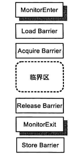

# 同步

[TOC]

Java平台提供的线程同步机制包括锁、volatile 关键字、final 关键字、 static 关键字以及一些相关的 API

我们可以通过这些机制设计出一个协议，来保证操作的原子性.

## 锁

持有锁的区域称为**临界区(Critical Section)**。临界区将多个线程的执行串行化，牺牲性能从而保证了原子性。

在 Java 平台中，锁的获得与释放隐含着刷新处理器缓存这个动作。因此锁能够保障临界区内外之间的可见性。由可见性和原子性，锁保证了临界区内外之间的有序性。

锁的类型有

- 按资源的所有权划分

  - 排他性(Exclusive)、互斥锁(Mutex)

  - 读写锁

- 按实现划分的

  - 内部锁(Intrinsic Lock)，Java 平台中的任何一个对象都有一个唯一与之关联的锁。
  - 显式锁(Explicit Lock)：实现 java.concurrent.locks.Lock 接口

- 按调度策略划分

  - 公平锁：显式锁
  - 非公平锁：内部锁、显式锁

**可重入性**描述这样一个问题，当线程持有锁A时，再次申请获取锁A是否能成功

~~~java
void foo() {
    acquireLock(lock);
    bar();
    releaseLock(lock);
}
void bar() {
    acquireLock(lock);
    // ...
    releaseLock(lock);
}
~~~

此外，我们还有考虑锁的**粒度（Granularity）**

### 内部锁：synchronized 关键字

~~~java
public synchronized short nextSequence() {
    
}
// 等价
public short nextSequence() {
    synchronized (XXXX.class) {
        
    }
}

~~~

锁句柄是一个对象的引用。

~~~java
public short nextSequence() {
    synchronized (this) {		// 锁句柄

    }
}
~~~

内部锁的使用并不会导致锁泄漏，Java 编译器(javac)对临界区中可能抛出的异常进行了特殊处理，使得临界区的代码即使抛出异常时会释放内部锁。

Java 虚拟机会为每个内部锁分配一个入口集(Entry Set)，用于记录等待获取该锁的线程。

> 内部锁的申请与释放所对应的Java 虚拟机字节码分别是 monitorenter 和 monitorexit

### 显式锁：Lock 接口

显式锁(Explicit Lock)是`java.util.concurrent.lcoks.Lock` 接口的实例，`java.util.concurrent.Icoks.ReentrantLock` 是 Lock 接口的默认实现类。

方法摘要：

- **void lock()**
- **void lockInterruptibly()**：如果当前线程在等待获取锁的过程中被中断，那么 `lockInterruptibly()` 方法会捕获到这个中断并抛出一个 `InterruptedException`。在Java多线程中，"中断"通常由其他线程对目标线程调用 `interrupt()` 方法产生
- **Condition newCondition()**：与条件变量有关
- **boolean tryLock()**：如果申请锁失败，那么直接返回false，而不会等待获取
- **boolean tryLock(long time, TimeUnit unit)**
- **void unlock()**

注意：显式锁不像内部锁那样，可以由编译器解决规避锁泄漏问题。

`ReentrantLock` 既支持非公平锁，也支持公平锁：

~~~java
ReentrantLock(boolean fair)
~~~

~~~java
// 检测相应锁是否被某个线程持有
public boolean isLocked() {
    return sync.isLocked();
}

// 等待线程的数量
public final int getQueueLength() {
    return sync.getQueueLength();
}
~~~

### 读写锁

**读写锁(Read/Write Lock)**优化了排他锁中「多读少写」的场景

- 读锁可以同时被多个线程持有的，一个线程持有一个读锁的时候，其他任何线程都无法获得写锁
- 写锁是排他的(Exclusive)，一个线程持有写锁的时候其他线程无法获得写锁以及读锁

`java.util.concurrent.locks.ReadWriteLock` 接口是对读写锁的抽象，其默认实现类是 `java.util.concurrent.locks.ReentrantReadWriteLo`。

方法摘要：

- `Lock readLock()`
- `Lock writeLock()`

使用示例：

~~~java
public class ReadWriteLockUsage{
    private final ReadWriteLock rwLock = new ReentrantReadWriteLock();
    private final Lock readLock = rwLock.readLock();
    private final Lock writeLock = rwLock.writeLock();
    
    public void reader() {
        readLock.lock();
        try {
            
        } finally {
            readLock.unlock();
        }
    }
}
~~~

`ReentrantReadWriteLock` 支持锁的**降级( Downgrade)**，即一个线程持有写锁的情况下，可以继续获得读锁。

但`ReentrantReadWriteLock` 并不支持锁的升级，为了预防潜在的死锁情况，例如两个线程同时要锁升级，它们都相互等待对方释放读锁，这就造成死锁的情况。

~~~java
public void foo() {
    writeLock.lock();
    readLock.lock();		// 此时同时持有写锁和读锁
    readLock().unlock()
    writeLock().unlock();	// 要记得释放写锁
}
~~~

## 内存屏障

内存屏障是被插人到两个指令之间的，其作用是禁止编译器、处理器重排序从而保障有序性。它还有一个副作用，即刷新处理器缓存，从而保证可见性

>x86平台的内存屏障指令：sfence指令、mfence指令
>
>ARM处理器的内存屏障指令：DMB指令

内存屏障可以划分为以下几种：

- 加载屏障(Load Barrier)：`StoreLoad`屏障可充当加载屏障
- 存储屏障 (Store Barrier）：`StoreLoad`屏障可充当存储屏障
- 获取屏障(Acquire Barrier)：相当于`LoadLoad屏障`与`LoadStore屏障`的组合
- 释放屏障(Release Barrie）：相当于`LoadStore屏障`与`StoreStore屏障`的组合

四种基本内存屏障：

- **LoadLoad屏障：**清空无效化队列
- **StoreStore屏障：**StoreStore 屏障会将写缓冲器中的现有条目做一个标记，当处理器进行写操作时，如果发现写缓冲器中存在被标记的条目，即使对应的缓存行状态为E/M，也要将其写入到写缓冲器中。
- **LoadStore屏障：**
- **StoreLoad屏障：**它的开销是四种屏障中最大的（冲刷写缓冲器，清空无效化队列）。在大多数处理器的实现中，这个屏障是个万能屏障，兼具其它三种内存屏障的功能。

内存屏障在内部锁的使用

具体来说，无论是编译器还是处理器，均还需要遵守以下重排序规则。

- 规则1——临界区内的操作不允许被重排序到临界区之外
- 规则 2——临界区内的操作之间允许被重排序
- 规则3——临界区外(临界区前或者临界区后)的操作之间可以被重排序

规则一是锁保障原子性和可见性的基础，而规则2、3是避免对性能造成“伤害”。同时为了确保Java支持嵌套锁以及避免死锁，我们需要引入以下规则：

- 规则4——锁申请(MonitorEnter)与锁释放(MonitorExit)操作不能被重排序。
- 规则5——两个锁申请操作不能被重排序。
- 规则6——两个锁释放操作不能被重排序。

最后，我们还要引入一条规则：

- 规则 7——临界区外(临界区前、临界区后)的操作可以被重排到临界区之内。

## volatile

`volatile` 也是通过内存屏障来保证有序性与可见性

 读操作：

写操作：

实际上 `volatile` 在只有一个更改源的情况下，也可以保证原子性。在写操作中不得涉及任何的共享变量，例如：

~~~java
volatile int count1
count1 = count2 + 1;
~~~

如果变量 count2也是一个共享变量，那么该赋值操作实际上是一个 read-modify-write 操作，需要锁的保护。

## 案例：单例模式

单线程版单例模式实现

~~~java
public class Singleton {
    private static Singleton instance = null;
    private Singleton() {
        
    }
    public static Singleton getInstance() {
        // 一个check-then-act 操作
        if (null == instance) {
            instance = new Singleton();
        }
        return instance;
    }
}
~~~

多线程的实现：

~~~java
public static Singleton getInstance() {
    synchronized (Singleton.class) {
        // 一个check-then-act 操作
        if (null == instance) {
            instance = new Singleton();
        }
        return instance;
    }
}
~~~

每次要获取实例，都要申请锁，有一定的性能开销。

基于双重检查锁定的实现（错误的）：

~~~java
public static Singleton getInstance() {
    if (null == instance) {
        synchronized (Singleton.class) {
            // 一个check-then-act 操作
            if (null == instance) {
                instance = new Singleton();
            }
            return instance;
        }
    }
    return instance
}
~~~

仅考虑可见性以及原子性的话，这个实现看似正确。但是当考虑重排序的因素时，就有问题了。

我们之前提及过，new操作可以分为以下三个子操作：

~~~c++
objRef = allocate(IncorrectDCLSingletion.class);
invokeConstructor(objRef);			// 2
instance = objRef;					// 3
~~~

由于重排序，赋值（3）可以在初始化（2）之前。若在执行初始化操作期间，另一个线程检查到实例不为null后，就直接返回这个未初始化完成的实例。

我们可以通过volatile关键字修正这个错误，它阻止（3）重排序到（2）之间

此外，还有基于静态内部类的单例模式实现：

~~~java
public class StaticHolderSingleton {
    private StaticHolderSingleton() {}
    
    private static class InstanceHolder {
        //保存外部类的唯一实例
        final static StaticHolderSingleton INSTANCE = 
            new StaticHolderSingleton();
    }
    
    public static StaticHoldersingleton getInstance(){
        return InstanceHolder.INSTANCE;
    }

}
~~~

JVM保证静态变量的初始化操作是原子的。

## CAS

原子变量类(Atomics)是基于CAS实现的工具类。能够保证read-modify-write 操作的原子性和可见性。

在执行CAS指令时，CPU会履行 Coherence协以确保CAS操作的可见性

Java为我们提供的CAS类：

- 基础数据型：AtomicInteger、AtomicLong、AtomicBoolean
- 数组型：AtomicIntegerArray、AtomicLongArray、AtomicReferenceArray
- 字段更新器：AtomiclntegerFieldUpdater、AtomicLongFieldUpdater、AtomicReferenceFieldUpdater
- 引用型：AtomicReference、AtomicStampedReference、AtomicMarkableReference

`AtomicLong` 类的常用方法

- `public final long get()`
- `public final long getAndIncrement()`
- `publie final long getAndDecrement()`
- `public final long incrementAndGet()`
- `public final void set(long newValue)`

`AtomicBoolean`类主要提供了以下方法：

- `get()`：获取当前值。
- `set(boolean newValue)`：设置新的值。
- `getAndSet(boolean newValue)`：获取当前值，并设置新的值。
- `compareAndSet(boolean expect, boolean update)`：如果当前值`==`预期值，则以原子方式将该值设置为输入值（update）。

 CAS 实现原子型背后的一个假设是共享变量的当前值与当前线程所提供的旧值相同，我们就认为这个变量没有被其他线程修改过。

对于共享变量V，当前线程看到它的值为A那一刻，其他线程已经将其值更新为B，接着在当前线程执行CAS的时候，该变量的值又被其他线程更新为 A。这就是**ABA问题**，该问题是否可以接受与算法有关。想要规避 ABA 问题也不难，为共享变量的更新引入一个修订号(也称时间戳)即可。AtomicStampedReference 类就是基于这种思想的。

## Final

此外，对于final字段，Java 语言规范还会保障其他线程看到该final字段时，这个字段必然是初始化完毕的

~~~java
class HTTPRangeRequest {
    private final Range range
    private String url;
}
~~~

JVM，HTTPRangeRequest对象的初始化代码如下；

~~~c++
objRef = allocate(HTTPRangeRequest.class);
objRef.url="http://xyz.com/download/big.tar";

objRange = allocate(Range.class);
objRange.lowerBound = 0;
objRange.upperBound = 1048576;
objRef.range = objRange;

instance = objRef;
~~~

