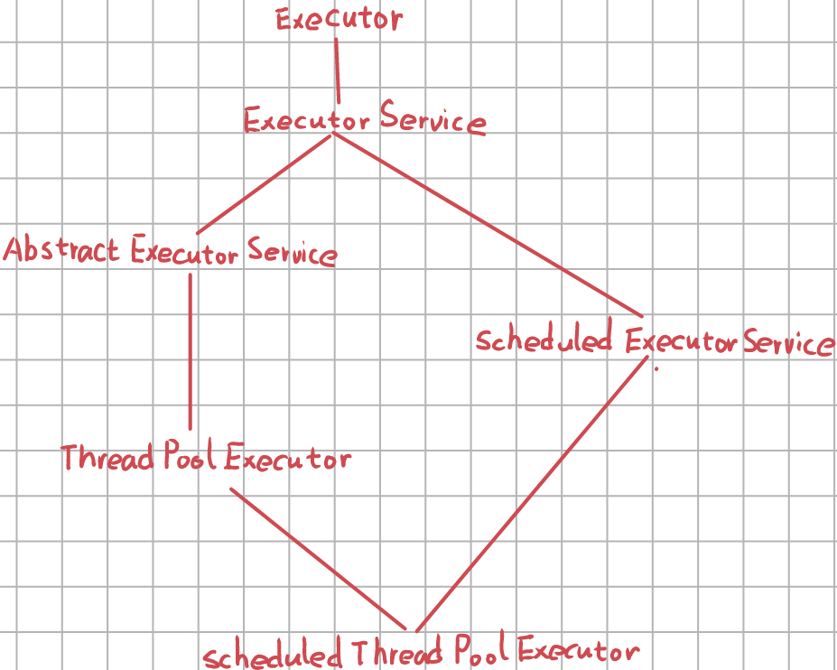
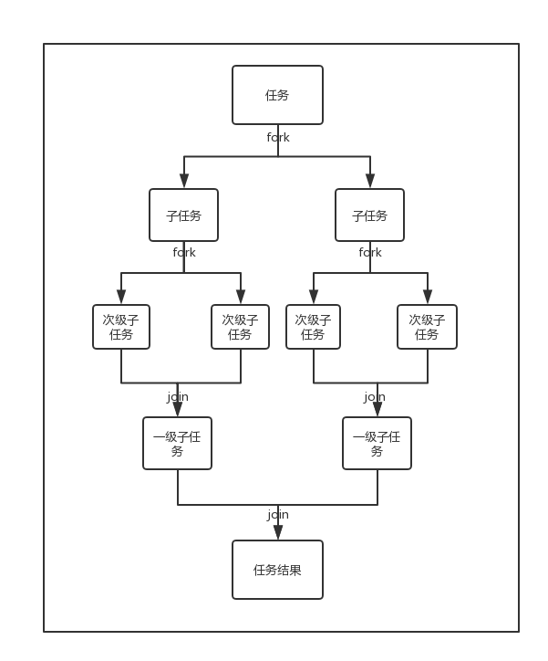

# 异步

[TOC]

**并发**同时执行多个任务，解决的是**阻塞**问题。

**并行**同时**在多处**执行多个任务，解决的是**计算密集型**问题。

从上述定义可以看出术语易混淆的原因：两者都是“同时执行多个任务”，而并行则额外包括了多处理器、分布式处理的概念。这两者解决的是不同类型的问题：对于I/O密集型问题，并行可能起不到什么明显的作用，因为性能瓶颈不在于执行速度，而在于阻塞；而对于计算密集型问题，如果想用并发在单处理器上解决，则多半会徒劳无功。

很多编程语言（包括Java）使用了相同的机制——**线程**——来同时实现并发和并行。

## Executor

Executor接口的作用就是解耦任务的执行和执行逻辑的实现。Executor接口使得任务的提交方只需要知道它调用 `Executor.execute()` 方法便可以使指定的任务执行，而无须关心任务具体的执行细节：比如，任务是采用一个专门的线程执行的，还是采用线程池执行的；

~~~Java
public interface Executor {
    void execute(Runnable command);
}
~~~

Executor 接口比较简单：

- 无法将任务的处理结果返回给客户端代码
- 当我们无需一个Executor时，没有相应的方法来释放掉相应的线程资源

ExecutorService 接口继承自 Executor接口，来解决了上述问题。

~~~java
public interface ExecutorService extends Executor {
    void shutdown();
    List<Runnable> shutdownNow();

    <T> Future<T> submit(Callable<T> task);
    <T> Future<T> submit(Runnable task, T result);
    Future<?> submit(Runnable task);
    
    //...
}
~~~

`ThreadPoolExecutor` 是 `ExecutorService` 的默认实现类。

`Executors`工具类

- `Executors.newCachedThreadPool()`

  ~~~java
  new ThreadPoolExecutor(
      0, 
      Integer.MAX_VALUE, 
      60L, 
      TimeUnit.SECONDS,
      new SynchronousQueue<Runnable>());
  ~~~

  适用于执行大量耗时较短且提交频率较高的任务

- `Executors.newFixedThreadPool(int nThreads)`

  ~~~java
  new ThreadPoolExecutor(
      nThreads, 
      nThreads,
      0L, 
      TimeUnit.MILLISECONDS,
      new LinkedBlockingQueue<Runnable>());
  ~~~

- `Executors.newSingleThreadExecutor`()。相当于 `Executors. newFixedThreadPool(1)`

  

## CompletionService

CompletionService抽象了异步任务的批量提交

~~~java
public interface CompletionService<V> {
    Future<V> submit(Callable<V> task);
    Future<V> submit(Runnable task, V result);

    Future<V> take() throws InterruptedException;		// 阻塞
    Future<V> poll();									// 非阻塞
    Future<V> poll(long timeout, TimeUnit unit) throws InterruptedException;
}
~~~

Java标准库提供的CompletionService实现类为ExecutorCompletionService，它相当于Executor实例与BlockingQueue实例的结合。Executor实例负责接收并执行异步任务，而 BlockingQueue 实例用于存储已执行完毕的异步任务所对应的Future实例。

## Future 

Future接口在Java5中被引入，设计初衷是表示将来某个时刻会产生的结果。它建模了一种异步运算。

`Future.get()` 是个阻塞方法。另外，若任务执行过程中抛出一个任意的异常 `originalException`，那么 `Future.get()`方法本身会抛出 `ExecutionException` 异常。调用这个异常（ExecutionException）的 `getCause()`方法便可返回 `originalException`。

Future 接口还支持任务的取消

~~~java
boolean cancel(boolean mayInterruptIfRunning)
~~~

- 返回值为 `boolean` 类型，如果任务成功被取消，则返回 `true`；如果任务无法被取消，已经完成，已经被取消，或一些其他情况，则返回 `false`。
- 当 `mayInterruptIfRunning` 参数设置为 `true` 的时候，会向任务发送中断信号。

该方法仅仅是将Future Task标记为cancel状态而已。

一个任务被成功取消之后，调用Future.get() 会抛出 CancellationException 异常（运行时异常）

`Future.isDone()`方法可以检测任务是否执行完毕（包括异常、取消）。

FutureTask 的一个构造器可以将 Callable 实例转换为 Runnable 实例，该构造器的声明如下

~~~java
public FutureTask(Callable<V> callable)
~~~

FutureTask 还支持以回调的方式来处理任务的执行结果。当 FutureTask 实例所代表的任务执行结束后，`FutureTask.done()`会被执行。

FutureTask 设计为一次性执行的任务。FutureTask.run()在执行任务前，会先判断任务的运行状态，如果该任务已经被执行过，那么 FutureTask.run() 会直接返回(并不会抛出异常)。

## 计划任务

`ExecutorService` 接口的子类 `ScheduledExecutorService` 接口定义了一组方法用于执行 计划任务。`ScheduledExecutorService` 接 口的 默 认 实 现 类 是 `java.util.concurrent.ScheduledThreadPoolExecutor`类

它还提供了两个静态工厂方法，用于创建 ScheduledExecutorService 实例：

~~~Java
public static ScheduledExecutorService newScheduledThreadPool (
    int corePoolSize)
    
public static ScheduledExecutorService newScheduledThreadPool(
    int corePoolSize,ThreadFactory threadFactory)
~~~

`ScheduledExecutorService` 接口的方法，按功能可分为以下两种：

- 延迟执行提交的任务

  ~~~Java
  <V> ScheduledFuture<V> schedule(Callable<V> callable,long delay, TimeUnit unit)
      
  ScheduledFuture<?> schedule(Runnable command,long delay,TimeUnit unit)
  ~~~

- 周期性地执行提交的任务

  ~~~Java
  ScheduledFuture<?> scheduleAtFixedRate(
      Runnable command, 
      long initialDelay,
      long period, 
      TimeUnit unit)
      
      
  ScheduledFuture<?> scheduleWithFixedDelay(
      Runnable command,
      long initialDelay,
      long detay,
      TimeUnit unit)
  ~~~

首先要明确两个概念：

- 执行周期（Interval）：相邻两次的任务开始执行时间
- 耗时（Execution Time）：一个任务从开始到结束所花费的时间

scheduleAtFixedRate的执行周期为，$Interval =max(Execution Time, period)$ 

scheduleWithFixedDelay的执行周期为，$Interval = Execution Time + delay$ 

提交给 `ScheduledExecutorService` 执行的计划任务，在其执行过程中如果抛出未捕获的异常，那么该任务后续就不会再被执行，而且即使设置了`UncaughtExceptionHandler`也不会被调用。

## CompletableFuture

|                             | Future | CompletableFuture | RxJava | Reactor |
| :-------------------------- | :----- | :---------------- | :----- | ------- |
| Composable（可组合）        | ❌      | ✔️                 | ✔️      | ✔️       |
| Asynchronous（异步）        | ✔️      | ✔️                 | ✔️      | ✔️       |
| Operator fusion（操作融合） | ❌      | ❌                 | ✔️      | ✔️       |
| Lazy（延迟执行）            | ❌      | ❌                 | ✔️      | ✔️       |
| Backpressure（回压）        | ❌      | ❌                 | ✔️      | ✔️       |

> RxJava与Reactor显然更加强大，但同时也带来了更大的学习成本。

我们注意`CompletableFuture`的命名规则：

- `xxx()`：表示该方法将继续在已有的线程中执行。
- `xxxAsync()`：表示将尽可能地申请新地线程来执行。

这些方法都会返回一个新的future对象，这些future对象依赖关系可以用依赖图来描述。有些方法在功能上是类似的，比如whenComplete与thenApply，但是它们有着不同的语义，用在不同的场合中。

在一个依赖链上任务，无论是通过thenApply还是thenAsyncApply提交的，会严格按照提交顺序依次执行任务。

~~~java
CompletableFuture<Integer> future = CompletableFuture.completedFuture(1);

Random random = new Random();
CompletableFuture<Integer> last = future;

for (int i = 0; i < 100; i++) {
    final int k = i;
    CompletableFuture<Integer> tmp =  last.thenApplyAsync((result) -> {
        String name = Thread.currentThread().getName();
        try {
            Thread.sleep(random.nextInt(1));
        } catch (Exception e) {}
        System.out.println(name + " "+ String.valueOf(k));
        return k;
    });
    last = tmp;
}

last = future;
for (int i = 0; i < 100; i++) {
    final int k = i;
    CompletableFuture<Integer> tmp =  last.thenApply((result) -> {
        String name = Thread.currentThread().getName();
        try {
            Thread.sleep(random.nextInt(10));
        } catch (Exception e) {}
        System.out.println("sync " + name + " "+ String.valueOf(k));
        //观测发现，虽然在async方法中申请了多个线程，但是在这个方法中只使用main方法。
        return k;
    });
    last = tmp;
}

future.join();
System.out.println("get");
}
~~~

此外一定要注意：在同一个future对象上调用多次thenAsyncApply，与以回调链的形式调用的区别。

~~~dart
CompletableFuture<Integer> future = CompletableFuture.completedFuture(1);
Function<? super T,? extends U> fn = (result) -> 1;

CompletableFuture<Integer> future1 = future.thenApply(fn);
CompletableFuture<Integer> future2 = future.thenApply(fn);
CompletableFuture<Integer> future3 = future.thenApply(fn);

CompletableFuture<Integer> future4 = future.thenApply(fn).thenApply(fn).thenApply(fn);
~~~

注意future1、future2、future3、future4并不按提交顺序来执行。毕竟它们都不在一个依赖链上。

### 实例化CompletableFuture

~~~java
//supplyAsync用于有返回值的任务
public static <U> CompletableFuture<U> supplyAsync(Supplier<U> supplier);
public static <U> CompletableFuture<U> supplyAsync(Supplier<U> supplier, Executor executor);

//runAsync则用于没有返回值的任务
public static CompletableFuture<Void> runAsync(Runnable runnable);
public static CompletableFuture<Void> runAsync(Runnable runnable, Executor executor);
~~~

Executor参数可以手动指定线程池。如果不指定Executor参数，那么CompletableFuture使用公共线程池ForkJoinPool，而且线程池里面的线程都是守护线程。

直接创建一个状态处于已完成的CompletableFuture对象：

~~~java
CompletableFuture<Integer> future = CompletableFuture.completedFuture(1);
~~~

### 获取结果

~~~java
public T get() throws InterruptedException, ExecutionException			//同步阻塞获取结果
    
public T get(long timeout, TimeUnit unit) throws InterruptedException, ExecutionException, TimeoutException 									//同步阻塞获取结果，并设置一个等待时间。如果超过等待时间仍未获取结果，那么直接抛出TimeoutException

public T getNow(T valueIfAbsent)				//如果调用时结果并未计算完成，那么直接返回valueIfAbsent。它会抛出Throws:CancellationException或CompletionException
    
public T join()					//同步阻塞获取结果。与get唯一不同的是，它会抛出unchecked异常，即Throws:CancellationException或CompletionException。而get()返回一个checked异常
~~~

### whenComplete

当任务完成（正常退出或者异常抛出）时，会调用此函数。

~~~java
public CompletableFuture<T> whenComplete(
    BiConsumer<? super T, ? super Throwable> action)
    
public CompletableFuture<T> whenCompleteAsync(
    BiConsumer<? super T, ? super Throwable> action)		//使用
    
public CompletableFuture<T> whenCompleteAsync(
    BiConsumer<? super T, ? super Throwable> action, 
    Executor executor)
~~~

### handle

~~~java
public <U> CompletableFuture<U> handle(
        BiFunction<? super T, Throwable, ? extends U> fn)
    
public <U> CompletableFuture<U> handleAsync(
        BiFunction<? super T, Throwable, ? extends U> fn)
    
public <U> CompletableFuture<U> handleAsync(
        BiFunction<? super T, Throwable, ? extends U> fn, Executor executor)
~~~

handle与whenComplete的唯一区别在于：handle会消耗异常，而whenComplete不会

~~~java
CompletableFuture<Integer> future = CompletableFuture.supplyAsync(() -> {throw new ArrayIndexOutOfBoundsException();});

CompletableFuture<Integer> future1 = future.whenComplete((res, err) -> {});

CompletableFuture<Integer> future2 = future.handle((res, err) -> {return 1;});

future1.get();			//这个会抛出异常
future2.get();			//这个不会抛出异常
~~~

### apply、accept

thenApply描述了一元依赖关系，可以将多个任务组织成一个依赖链。

而thenAccept与thenApply类似，但它返回一个`CompletableFuture<Void>`。故一般表示一个终端操作。

~~~java
public <U> CompletableFuture<U>     thenApply(Function<? super T,? extends U> fn)
public <U> CompletableFuture<U>     thenApplyAsync(Function<? super T,? extends U> fn)
public <U> CompletableFuture<U>     thenApplyAsync(Function<? super T,? extends U> fn, Executor executor)
~~~

### exceptionally

~~~java
public CompletableFuture<T> exceptionally(Function<Throwable, ? extends T> fn)
~~~

依赖链上的某个任务抛出了异常，那么之后的所有任务都不会执行。此时调用get等方法就会抛出unchecked异常：

~~~java
CompletableFuture<Integer> future = CompletableFuture.completedFuture(1);
CompletableFuture<Integer> future1 = future.thenApply((result) -> {
   throw new ArrayIndexOutOfBoundsException();
}).thenApply((result) -> {
    System.out.println("这一句不应该打印出来");
    return 0;
}).thenApply((result) -> {
    System.out.println("这一句也不应该打印出来");
    return 0;
});

System.out.println(future1.get());
~~~

为此，可以调用exceptionally来处理异常。

~~~java
CompletableFuture<Integer> future1 = future.thenApply((result) -> {
   throw new ArrayIndexOutOfBoundsException();
}).exceptionally(throwable -> {
    System.out.println("异常处理");
    return 0;
}).thenApply((result) -> {
    System.out.println("这一句应该打印出来");
    return 0;
});
~~~

一般exceptionally在依赖链的最后调用。

### thenCompose

与thenApply类似，但是它描述的是二元依赖关系

~~~java
public <U,V> CompletableFuture<V> thenCombine(
        CompletionStage<? extends U> other,
        BiFunction<? super T,? super U,? extends V> fn)
~~~

使用例子：

~~~java
CompletableFuture<Integer> thenComposeOne = CompletableFuture.supplyAsync(() -> 192);

CompletableFuture<Integer> thenComposeTwo = CompletableFuture.supplyAsync(() -> 196);

CompletableFuture<Integer> thenComposeCount = thenComposeOne
        .thenCombine(thenComposeTwo, (s, y) -> s + y);

System.out.println(thenComposeCount.get());
~~~

### allOf、anyOf

allOf与thenApply类似，但是它描述的是多元依赖关系，逻辑关系是「与」

~~~java
public static CompletableFuture<Void> allOf(CompletableFuture<?>... cfs)
~~~

~~~java
//URI集合
List<String> webPageLinks = Arrays.asList();		

//创建多个并行任务。
List<CompletableFuture> pageContentFutures = webPageLinks
    .stream()
    .map(uri -> downLoadWebPage(uri))
    .collect(Collectors.toList());

//等待所有网站下载完成
CompletableFuture<Void> allFutures = CompletableFuture.allOf(
	pageContentFutures.toArray()
)
~~~

anyOf与allOf类似，它也描述一个多元依赖关系，但是逻辑关系是「或」

~~~java
public static CompletableFuture<Void> allOf(CompletableFuture<?>... cfs)
~~~

只要有一个任务执行完成，那么future的状态为complete，其他正在执行任务的之后结果就会被忽略掉，并且不再继续提交任务。

测试程序：

~~~java
CompletableFuture<Integer> future1 = CompletableFuture.supplyAsync(() -> {
    try {
        Thread.sleep(100);
    } catch (InterruptedException e) {}
    System.out.println("future1");
    return 100;
});
CompletableFuture<Integer> future2 = CompletableFuture.supplyAsync(() -> {
    try {
        Thread.sleep(200);
    } catch (InterruptedException e) {}
    System.out.println("future2");
    return 200;
});
CompletableFuture<Integer> future3 = CompletableFuture.supplyAsync(() -> {
    try {
        Thread.sleep(300);
    } catch (InterruptedException e) {}
    System.out.println("future3");
    return 300;
});

CompletableFuture<Object> future = CompletableFuture.anyOf(future1, future1, future3);
System.out.println(future1.get());
Thread.sleep(1000);

~~~

## 并行流

并行流就是一个把内容分成多个数据块，并用不同的线程分别处理每个数据块的流。

~~~java
Stream.generate().parallel();
~~~

每个并行流内部所使用的线程池是**同一个**`ForkJoinPool`，它默认的线程数量就是你的处理器数量，即`Runtime.getRuntime().availableProcessors();`。你可以通过系统属性`java.util.concurrent.ForkJoinPool.common. parallelism`来改变线程池大小

~~~java
System.setProperty("java.util.concurrent.ForkJoinPool.common.parallelism", "12");
~~~

注意：整个JVM中只允许设置一次ForkJoinPool.common. parallelism。此外，由于多个parallelStream之间默认使用的是同一个线程池，所以IO操作尽量不要放进parallelStream中，否则会阻塞其他parallelStream。

ForkJoinPool使用了Fork/Join框架。Fork/Join框架是一个实现了ExecutorService接口的多线程处理器，它专为那些可以通过递归分解成更细小的任务而设计**（分而治之）**。Fork/Join的运行流程大致如下所示：

此外Fork/Join框架在执行任务时使用了**工作窃取算法**

值得注意的是，当一个线程窃取另一个线程的时候，为了减少两个任务线程之间的竞争，该框架使用**双端队列**来存储任务。每个任务线程都有自己的双端队列，当任务线程想要窃取其他线程中的任务时，就会从被窃取线程的队列尾部偷取。

### 陷阱

ParallelStream一定比Stream快吗？为了回答这个问题，下面我们来看几个例子。

~~~java
LongStream.rangeClosed(0, SZ).sum()
LongStream.rangeClosed(0, SZ).parallel().sum()
LongStream.iterate(0, i -> i + 1).limit(SZ+1).sum()
    
/**
Sum Stream: 48ms
Sum Stream Parallel: 24ms
Sum Iterated: 105ms
*/
~~~

在第一个例子中，ParallelStream是符合我们的预期的，的确比Stream快。

~~~java
long[] la = new long[SZ+1];
Arrays.parallelSetAll(la, i -> i);

Arrays.stream(la).sum();
Arrays.stream(la).parallel().sum();
basicSum(la);
Arrays.parallelPrefix(la, Long::sum);

long basicSum(long[] ia) {
    long sum = 0;
    int size = ia.length;
    for(int i = 0; i < size; i++)
        sum += ia[i];
    return sum;
}

/**
Array Stream Sum: 13ms
Parallel: 22ms
Basic Sum: 9ms
parallelPrefix: 76ms
*/
~~~

但是在第二个例子中，我们将LongStream.range替换成Arrays.stream()后发现此时ParallelStream竟然比Stream的慢！这是因为ParallelStream了使用的Fork-Join框架，它的基本思想就是分而治之。由于对Arrays.stream()不合理地划分，从而导致ParallelStream性能较差

~~~java
Long[] aL = new Long[SZ + 1];
Arrays.parallelSetAll(aL, i -> (long) i);

Arrays.stream(aL).reduce(0L, Long::sum);
basicSum(aL);
Arrays.parallelPrefix(aL, Long::sum);
Arrays.stream(aL).parallel().reduce(0L,Long::sum);

/**
Long Array Stream Reduce: 75ms
Long Basic Sum: 12ms
Long parallelPrefix: 213ms
Long Parallel: 63ms
*/
~~~

紧接着我们将long[]替换称Long[]后发现，ParallelStream仍然比Stream慢，甚至比第二个例子中的ParallelStream更慢。处理器的缓存机制是导致耗时增加的主要原因之一。

下面我们来看在ParallelStream中的limit()行为。

~~~java
IntGenerator implements Supplier<Integer> {
    //...
}

List<Integer> x = Stream.generate(new IntGenerator())
    .limit(10)
    .parallel()                     
    .collect(Collectors.toList());
System.out.println(x);

/**
[0, 3, 6, 8, 11, 14, 17, 20, 23, 26]
*/
~~~

可以发现结果并不是我们预期的那样`[0, 1, 2, ...]`。如果进一步挖掘，我们发现IntGenerator的get方法竟然调用了1000多次！这还是Fork-Join框架惹的祸。

此外使用ParallelStream时，还要注意线程安全问题！

~~~java
List<Integer> array = new ArrayList<>();
IntStream.range(0, 100).parallel().forEach((item) -> array.add(item));
~~~

由于ArrayList不是线程安全的，因此上述代码会导致竞态问题。解决方案使用collect终结方法，或者使用线程安全集合。

~~~java
stream().parallel().collect(Collectors.toList());
~~~

### Spliterator

`spliterator`是java1.8引入的一种并行遍历的机制，`Iterator`提供也提供了对集合数据进行遍历的能力，但一个是顺序遍历，一个是并行遍历。

## 协程

Java的线程模型在微服务时代就显得力不从心了，因为每个请求都足够简单，而且数量还多，以至于线程的系统开销变得不可接受了（内核态的陷入、调度算法、上下文切换）。

协程本质上就是协同式调度（不是必需的）的用户级线程。现在业界有两种实现方案：

- 有栈协程，负责栈的保存和恢复工作
- 无栈协程，是一种有限状态机，状态保存在闭包里。自然要比有栈协程恢复调用栈要轻量得多，但功能也相对有限。
