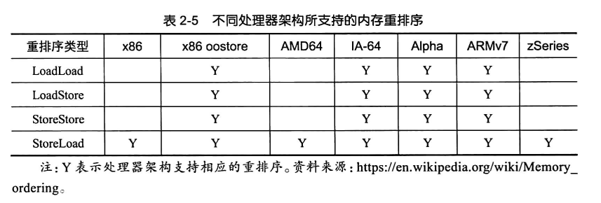
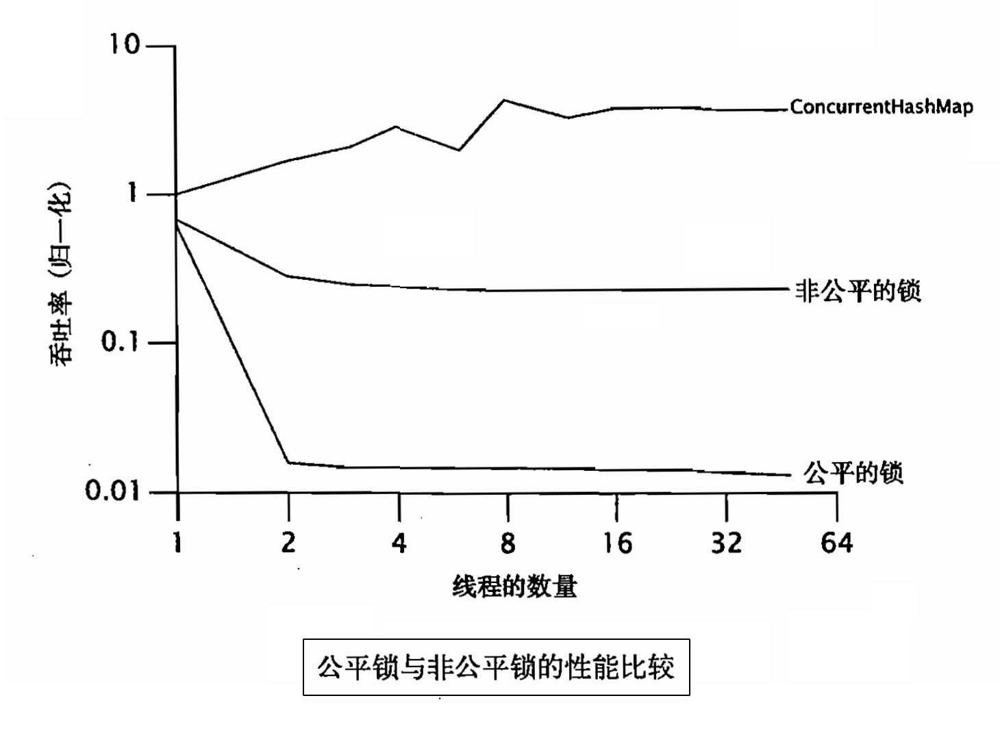
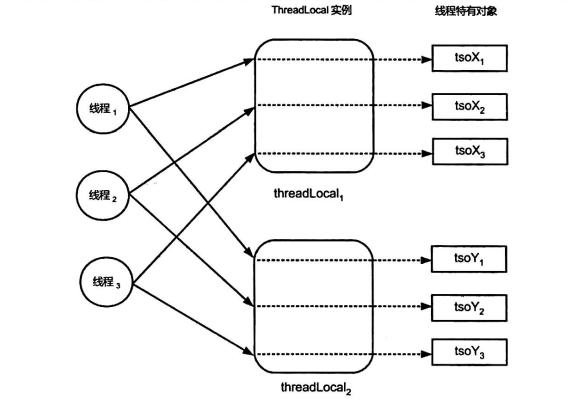

# Java线程

[TOC]

多线程编程具有以下优势：

- 充分利用多核(Multicore)处理器资源，可以提高系统的吞吐率(Throughput)以及性能

  

同时也带来了以下问题：

- 线程安全(Thread Safe)问题
- 线程活性(Thread Liveness)问题
  - 死锁(Deadlock)
  - 锁死(Lockout)，例如唤醒信号丢失
  - 活锁(Livelock)
  - 饥饿(Starvation)
- 上下文切换(Context Switch)的性能损耗

## 线程

- **进程**是向操作系统申请资源(如内存空间和文件句柄)的基本单位。
- **线程( Thread)** 是进程中一条控制流，同时也是是操作系统能够进行调度的最小单位。同一个进程中的所有线程共享该进程中的资源。

### 线程的创建

- 基于继承

  ~~~java
  
  class WelcomeThread extends Thread {
  	@Override
      public void run() {
          System.out.println("Hello World");
      }
  }
  
  //创建线程
  Thread welcomeThread = new WelcomeThread();
  
  //启动线程
  welcomeThread.start();
  ~~~

- 基于组合

  ~~~java
  //创建线程
  Thread welcomeThread = new Thread(new Runnable() {
      @Override
      public void run() {
          System.out.println("Hello World");
      }
  })
      
  //启动线程
  welcomeThread.start();
  ~~~

  

小知识点：

- 线程的 `start` 方法也只能被调用一次，多次调用同一个 `Thread` 实例的 `start`方法，会导致其抛出 `lllegalThreadStateException` 异常。

- JVM在合适时机会调用`run`方法，而在应用代码中直接调用线程的 `run` 方法，只会在当前线程中执行。

- 输出当前线程的名字：

  ~~~java
  Thread.currentThread().getName()
  ~~~

- `Runnable`接口可以被看作对任务进行的抽象：

  ~~~java
  @FunctionalInterface
  public interface Runnable {
      public abstract void run();
  }
  ~~~

  `Thread`类是`Runnable`接口的一个实现类：

  ~~~java
  public class Thread implements Runnable {
      private Runnable target;
      
      public Thread(Runnable target) {
          this(null, target, "Thread-" + nextThreadNum(), 0);
      }
      
      @Override
      public void run() {
          if (target != null) {
              target.run();
          }
      }
  }
  ~~~

  

### 线程的属性

|       属性        |                             用途                             | 是否只读 |
| :---------------: | :----------------------------------------------------------: | :------: |
|     编号 (ID)     |                      用于标识不同的线程                      |    ✔️     |
|    名称 (Name)    |                   有助于代码调试和问题定位                   |    ❌     |
| 线程类别 (Daemon) | 值为 true 表示相应的线程为守护线程，否则表示相应的线程为用户线程。该属性的默认值与父线程的相同 |    ❌     |
| 优先级 (Priority) | 给线程调度器的**提示**信息，用于表示哪个线程能够优先得以运行。Java定义了1~10的10 个优先级。默认值一般为5，或者与其父线程的优先级值相等 |    ❌     |

小知识点：

- `Daemon`属性必须在线程启动前设置，即`setDaemon` 方法必须在 `start` 方法之前调用，否则 `setDaemon` 方法会抛出 `lllegalThreadStateException` 异常

- 用户线程会阻止 Java 虚拟机的正常停止，而守护线程却不会

### Thread常用方法

- `static Thread currentThread()`：返回当前线程对象
- `void run()`：
- `void start()` ：
- `void join()`：等待被调用线程执行完毕
- `static void yield()`：使当前线程主动放弃其对处理器的占用
- `static void sleep(long millis)`：休眠

不过，Java平台中并没有提供获取父线程，或者获取所有子线程的API。并且，父线程和子线程之间的生命周期也没有必然的联系。例如父线程运行结束后，子线程可以继续运行，子线程运行结束也不妨碍其父线程继续运行。

在Java中，没有直接方式来kill掉一个线程，但是可以通过中断 + 标记来间接杀死一个线程，这类似于POSIX中的`pthread_cancel`函数。

### 线程的状态

可以通过 `Thread.getState()` 调用来获取Java 线程的状态

- **NEW**：已创建而未启动

- **RUNNABLE**：它包括两个子状态

  - READY：等待线程调度器(Scheduler)进行调度
  - RUNNING：正在运行

  执行 `Thread.yield()`的线程，其状态可能会由 RUNNING 转换为READY。

- **BLOCKED**：线程发起一个阻塞式I/O操作后，或者申请一个独占资源时，线程会处于该状态

- **WAITING**：等待执行该线程所期望的特定操作，例如`object.notify()`。

- **TIMED_WAITING**：当其他线程没有在指定时间内，执行该线程所期望的特定操作时，该线程的状态自动转换为RUNNABLE。

- **TERMINATED**：执行结束

  - `Thread.run()`正常返回
  - 抛出异常而提前终止

## 竞态

计算正确性依赖于特定的并行指令流，这种现象称为**竞态(Race Condition)**。但是，我们不能对并行指令流做出任何假设。

术语规范：

- **状态变量(State Variable )**：即类的实例变量、静态变量。

- **共享变量(Shared Variable)**：即可以被多个线程共同访问的变量。

在编程层面上，竞态有两种表现形式：

- **read-modify-write**，例如：

  ~~~java
  load(sequence,rl);	// 1
  increment(rl);		// 2
  store(sequence,rl);	// 3
  ~~~

  1. 一个线程在执行完load指令后，准备执行increment指令时，其他线程已经更新sequence。
  2. 此时，该线程所读取的sequence就是一个旧值。
  3. 之后执行store指令会将旧值写入，从而发生更改丢失的现象。

- **check-then-act**

  ~~~java
  1f(sequence >= 999)(		// 1
  	sequence = 0;			// 2
  }else {
  	sequence++;
  )
  ~~~

  一个线程在执行完子操作①到开始(或者正在)执行子操作②的这段时间内，其他线程可能已经更新了共享变量的值，使得if语句中的条件变为不成立，那么此时该线程仍然会执行子操作②

## 线程安全性

线程安全性是指调用者在不加任何保护措施的情况下，调用该方法总能保证结果的正确性。线程安全问题有三种表现形式：原子性、可见性和有序性。

在体系结构的层面上

- 原子性是通过CAS指令来解决的
- 可见性与有序性都是通过内存屏障来解决的

### 原子性

原子性是指，该操作对于其他线程来说是不可分割的，也就是说要么已经完成了，要么还未开始，不会存在正在执行中的这种中间状态。

Java中有两种方式来实现原子性：

- 锁(Lock)
- CAS(Compare-and-Swap)指令

Java 语言规范规定，对基础类型和引用的写操作都是原子的，对于任何变量的读操作也都是原子操作

> 在32位处理器上， long/double 型变量的写操作不具备原子性，可以通过 volatile 关键字

我们会在同步一节，详细讨论如何去构建原子性。

### 可见性

一个线程对某个共享变量进行更新之后，后续访问该变量的线程可能无法立刻读取到这个更新的结果，这就是可见性问题。

下面我们来看一个因编译器优化而导致的可见性问题：

~~~java
public class VisibilityDemo {
    public static void main(String[] args) throws InterruptedException {
        TimeConsumingTask timeConsumingTask = new TimeConsumingTask();

        Thread thread = new Thread(new TimeConsumingTask());
        thread.start();
        
        //指定的时间内任务没有执行结束的话，就将其取消
        Thread.sleep(10000);
        timeConsumingTask.cancel();
    }
}

class TimeConsumingTask implements Runnable (
	private boolean toCancel = false;
	@override
	public void run(){
		while (!toCancel) {
			if (doExecute()) {
				break;
			}
		}
     }

	public void cancel(){
		toCancel = true;
	}
}
~~~

因为，代码没有给JIT编译器足够多的提示（toCancel被多个线程共享），从而让JIT优化上述代码，不幸的是这将导致死循环。

~~~java
if (!toCannel) {
    while (true) {
        if (doExecute()) {
            break;
        }
    }
}

~~~

此外，可见性问题还与计算机的存储系统有关：

- 如果两个线程分别运行在不同的处理器上，而这两个线程所共享的变量却被分配到寄存器上进行存储，那么可见性问题就会产生。
- 即便某个共享变量是被分配到主内存中进行存储的，由于处理器的高速缓存(Cache)子系统，也不能保证该变量的可见性。

总结起来就是存储系统的数据一致性问题。

我们可以使用volatile关键字来保证可见性，它有两个作用：

- 提示JIT编译器，被修饰的变量可能被多个线程共享，以阻止JIT编译器做出错误的优化。例如保证分配到主存上
- 读取volatile变量时，处理器会执行刷新缓存的操作

Java语言规范保证：

- 在父线程启动子线程之前的共享变量更新操作，对于子线程来说，是可见的。
- 线程终止之前的共享变量更新操作，对于调用该线程的 join 方法的线程而言，是可见的。

此外，还有由于写缓冲器/无效化队列导致的可见性问题。该问题也可以视为有序性问题的一种。

### 有序性

重排序是对内存访问操作所做的一种优化，它可以在不影响单线程程序正确性的情况下，提升程序的性能。但是，它可能对多线程程序的正确性产生影响。

它的表现形式有两种：
- 程序顺序与源代码顺序不一致——编译器
- 执行顺序与程序顺序不一致——编译器、处理器

> - **源代码顺序(Source Code)**
> - **程序顺序(Program Order)**：字节码
> - **执行顺序(Execution Order)**：在处理器上的实际执行顺序

重排序有四种类型：

- LoadLoad 重排序 (Loads reordered after loads )
- StoreStore 重排序 (Stores reordered after stores)
- LoadStore 重排序 (Loads reordered after stores)
- StoreLoad 重排序 (Stores reordered after loads)

下面我们说明一个指令重排序的例子：

~~~java
helper = new Helper(externalData);
~~~

该语句可以分解为为以下几个子操作

~~~c++
//子操作①:分配Helper实例所需的内存空间
objRef = allocate(Helper,class);

//子操作②:调用Helper类的构造器
inovkeConstructor(objRef);

//子操作③
helper = objRef; 
~~~

JIT可能将③重排到②之前，这就导致其他线程检查到hepler不为null时，该实例可能并没有完成初始化。

关于指令重排还有几点说明：

- 处理器出于吞吐量的考虑，会乱序执行指令，而指令的结果会存入**重排序缓冲器(ROB,Reorder Buffer)**，然后按照程序顺序提交给主存。也就是说，即使指令是乱序执行的，但是结果是顺序提交的。
- 处理器还使用了动态预测技术，这也会对有序性产生影响。
- 处理器的乱序技术保证，存在**数据依赖关系**的语句不会被重排序。存在**控制依赖关系**的语句是可以允许被重排序的（动态预测技术）

## 上下文切换

上下文切换分为

- **自发性上下文切换 (Voluntary Context Switch)**，下列任意一个方法都会引起自发性上下文切换：

  - Thread.sleep(long millis)
  - Object.wait()
  - Thread.yieldO
  - Thread.join()
  - LockSupport.park()

  另外，线程发起了I/O操作或者，等待获取锁，会导致自发性上下文切换

- **非自发性上下文切换(Involuntary Context Switch)**

  - 用完分配给线程的时间片

它的开销有：

- 操作系统保存和恢复上下文
- 线程调度器的调度策略
- 处理器高速缓存的重新加载

## 资源争用与调度

只能够被一个线程占用的资源被称为**排他性(Exclusive)资源**。常见的排他性资源包括处理器、 数据库连接、文件等。

当一个线程未放弃资源所有权时，其他线程试图访问该资源源的现象就被称为**资源争用(Resource Contention)**。并发系统的理想情况是高并发、低争用

如果资源的先申请者总是能够比后申请者先获得该资源的独占权，那么该资源调度策略就被称为是**公平的(Fair)**，否则是**非公平的 (Non-fair）**。

一般来说，非公平调度策略的吞吐率比公平调度的高，这与非公平调度算法所要实现的目标有关。

## 合理设置线程数

**Amdahl's**定律：

设处理器的数量为$N$，程序中必须串行（即无法并发化）的部分耗时占程序全部耗时的比率为$P$，那么将这样一个程序改为多线程程序，并假设可并行部分被$N$个处理器平分，那么最大提速$S$与$N$、$P$之间的关系如下：
$$
S_{max} = \frac{1}{P +\frac{1-P}{N}}
$$

线程数设置得过少，可能无法充分利用处理器资源；而线程数设置得过大吗，又可能导致过多的上下文切换，反而降低了系统的性能。

有一个经验准则是，对于CPU密集型线程，线程数设置为$N_{cpu}+1$；对于IO密集型线程，线程数设置为$N_{cpu} * 2$。

但是这个经验准则无法满意的回答下述这个问题：

假设一个请求的计算操作需要5ms，而数据库操作需要100ms，对于一台8核CPU的服务器该如何设置线程数？

为此，我们再介绍一个公式：
$$
N_{threads} = N_{cpu} * U_{cpu} * (1 + \frac{WT}{ST})
$$

- $U_{cpu}$是CPU最大使用率，准确点来说是，操作系统限制该程序所能使用的CPU资源
- WT是IO等待时长
- ST是实际使用CPU的时长

使用该公式，我们就可以回答上述问题了，答案是 $8 * 21 = 168$个线程数

## ThreadLocal

方法摘要：

- `public T get()`
- `public void set(T value)`
- `protected T initialValue()`，线程特有对象的初始值，默认是返回null。
- `public void remove()`

在Java平台中，每个线程内部会维护一个类似 HashMap 的对象，我们称之为 `ThreadLocalMap`。每个ThreadLocalMap 内部会包含若干 Entry，其中Key是一个 ThreadLocal实例，Value 是一个线程特有对象

~~~java
public T get() {
    Thread t = Thread.currentThread();
    ThreadLocalMap threadLocals = getMap(t);
    
    if (threadLocals != null) {
        ThreadLocalMap.Entry e = threadLocals.getEntry(this);
        if (e != null) {
            @SuppressWarnings("unchecked")
            T result = (T)e.value;
            return result;
        }
    }
    
    // 这个ThreadLocalMap未建立，或者ThreadLocal第一次使用
    return setInitialValue();
}

private T setInitialValue() {
    T value = initialValue();
    Thread t = Thread.currentThread();
    ThreadLocalMap map = getMap(t);
    if (map != null)
        // 注册这个ThreadLocal
        map.set(this, value);
    else
        // 创建ThreadLocalMap
        createMap(t, value);
    return value;
}

public void set(T value) {
    Thread t = Thread.currentThread();
    ThreadLocalMap map = getMap(t);
    
    if (map != null)
        // 注册这个ThreadLocal，或者覆写之前的旧值
        map.set(this, value);
    else
        // 创建ThreadLocalMap
        createMap(t, value);
}
~~~

ThreadLocal在某些情况下会发生内存泄漏

> 内存泄漏(Memory Leak)指由于对象永远无法被垃圾回收

ThreadLocalMap对键的引用是一个弱引用，而对于值的引用是一个强引用。

## 活性故障

死锁的产生，需要同时满足以下四个条件：

- 资源互斥（Mutual Exclusion）资源是独占的
- 资源不可抢夺（No Preemption）
- 占用并等待资源（Hold and Wait），涉及的线程当前至少持有一个资源(资源A) 并申请其他资源(资源B),而这些资源(资源B)恰好被其他线程持有。在这个资源等待的过程中，线程并不释放其已经持有的资源。
- 循环等待资源（Circular Wait）

由于锁具有排他性，并且锁只由其持有线程主动释放，因此由锁导致的死锁只能够从「占用并等待资源」和「循环等待资源」这两个方面入手。

- 锁排序法（Lock Ordering），锁申请的顺序具有偏序关系。
- 通过`ReentrantLock.tryLock(long,TimeUnit)`申请锁。

死锁的恢复：

1. 通过`Lock.lockInterruptibly()`来获取锁
2. 定义一个工作者线程 `DeadlockDetector`，专门用于死锁检测与恢复。
   1. 通过`java.lang.management.ThreadMXBean.findDeadlockedThreads()` 方法来进行死锁检测
   2. 对死锁的线程发送中断

活锁（Livelock）是指线程一直处于运行状态，但是其任务却一直无法进展的一种活性故障。死锁是语言层面上的，而活锁是业务层面上的。
