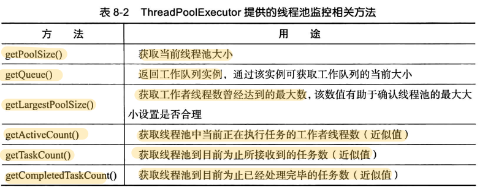

# 线程管理

[TOC]

## 线程组

官方已经废除线程组了，不再做介绍了

## 可靠性问题

~~~java
@FunctionalInterface
public interface UncaughtExceptionHandler {
    /**
     * Method invoked when the given thread terminates due to the
     * given uncaught exception.
     * Any exception thrown by this method will be ignored by the
     * Java Virtual Machine.
     * @param t the thread
     * @param e the exception
     */
    void uncaughtException(Thread t, Throwable e);
}
~~~

使用示例：

~~~java
Thread thread = new Thread(...);
thread.setUncaughtExceptionHandler(new UncaughtExceptionHandler() {
    @Override
    public void uncaughtException(Thread t, Throwable e) {
        // 记录异常
    }
});
~~~

如果一个线程没有关联的 UncaughtExceptionHandler 实例，那么该线程会调用所属线程组的 uncaughtException 方法

~~~java
// ThreadGroup
public void uncaughtException(Thread t, Throwable e) {
    if (parent != null) {
        parent.uncaughtException(t, e);
    } else {
        Thread.UncaughtExceptionHandler ueh =
            Thread.getDefaultUncaughtExceptionHandler();
        if (ueh != null) {
            ueh.uncaughtException(t, e);
        } else if (!(e instanceof ThreadDeath)) {
            System.err.print("Exception in thread \""
                             + t.getName() + "\" ");
            e.printStackTrace(System.err);
        }
    }
}
~~~

最后会调用默认的`Thread.UncaughtExceptionHandler`。

`Thread.setDefaultUncaughtExceptionHandler`方法可用来指定默认的 `UncaughtExceptionHandler`。

## 线程工厂

~~~java
public interface ThreadFactory {
    Thread newThread(Runnable r);
}
~~~

## 线程池

对象池的目的就是复用对象资源，避免频繁地创建和销毁对象所带来的性能开销。

~~~java
public class ThreadPoolExecutor extends AbstractExecutorService {}
~~~

通过`submit`方法来提交任务

~~~java
// AbstractExecutorService
public <T> Future<T> submit(Callable<T> task) {}
public <T> Future<T> submit(Callalbe<T> task) {}
~~~

注：`Executors.callable(Runnable task,T result)`能够将 `Runnable` 接口转换为 `Callable` 接口。

`ThreadPoolExecutor`的构造器

~~~Java
public ThreadPoolExecutor(int corePoolSize,
    int maximumPoolSize,
    long keepAliveTime,
    TimeUnit unit,
    BlockingQueue<Runnable> workQueue,
    ThreadFactory threadFactory,
    RejectedExecutionHandler handler)
~~~

- `keepAliveTime` 和 `unit` 合在一起，用于指定线程池中空闲（Idle）线程的最大存活时间
- `threadFactory`，创建工作者线程的线程工厂。如果我们没有设置该属性，那么会使用默认的线程池——`Executors.defaultThreadFactory()`
- `workQueue`，一个缓冲队列。当提交任务时，会调用其非阻塞方法`offer(E e)`。如果队列已满，那么会执行拒绝策略

三个关键属性

- 当前线程池大小
- 核心线程池大小：corePoolSize
- 最大线程池大小：maximumPoolSize

若$当前大小 \leq 核心大小$，那么创建的线程即使超过空闲时间，也不会被销毁。换句话说，对于超过线程池核心大小部分的工作者线程，若其空闲时间达到 keepAliveTime 所指定的时间后，就会被清理掉。

`ThreadPoolExecutor.prestartAllCoreThreads()`使得我们可以使线程池在未接收到任何任务的情况下，预先创建并启动所有核心线程

当线程池饱和(Saturated)时，即$当前大小 == 最大大小$，或者workQueue已满，此时会拒绝（Reject）提交的任务。为了提高线程池的可靠性， Java标准库引入了一个 `RejectedExecutionHandler`接口用于封装拒绝任务的处理策略：

~~~Java
public interface RejectedExecutionHandler {
    void rejectedExecution(Runnable r, ThreadPoolExecutor executor);
}
~~~

我们可以通过线程池的构造器参数 `handler` 或者线程池的 `setRejectedExecutionHandler(RejectedExecutionHandler handler)`方法来为线程池关联一个 `RejectedExecutionHandler`。

ThreadPoolExecutor 自身提供了几个现成的 RejectedExecutionHandler 接口实现类

| 实现类                                   | 处理策略                                                 |
| ---------------------------------------- | -------------------------------------------------------- |
| `ThreadPoolExecutor.AbortPolicy`（默认） | 直接抛出异常                                             |
| `ThreadPoolExecutor.DiscardPolicy`       | 丢弃当前被拒绝的任务                                     |
| `ThreadPoolExecutor.DiscardOldestPolicy` | 将工作队列中最老的任务丢弃，然后重新尝试接纳被拒绝的任务 |
| `ThreadPoolExecutor.CallerRunsPolicy`    | 在客户端线程中执行被拒绝的任务                           |

ThreadPoolExecutor.shutdown()/shutdownNow()方法可用来关闭线程：

- shutdown()，已提交的任务（包括等待的）会继续执行，而新提交的任务会直接被拒绝掉
- shutdownNow()，执行的任务会被停止（interrupt方法），提交而等待执行的任务不会被执行。返回值是已提交未但被执行的任务列表。

另外，ThreadPoolExecutor提供了两个钩子方法: `beforeExecute(Thread t, Runnable r)`，`afterExecute(Thread t, Runnable r)`

对于通过 ThreadPoolExecutor.submit 方法所提交的任务，其执行过程中所抛出的未捕获异常，并不会调用与工作者线程关联的 UncaughtExceptionHandler。但是，通过execute方法提交的可以。

