# 内存管理模块

> Java与C++之间有一堵由内存动态分配和垃圾收集技术所围成的高墙，墙外面的人想进去，墙里面的人却想出来。

[TOC]

## Java内存区域

在Java中，每个对象的所有权由虚拟机掌控。根据《Java虚拟机规范》，Java虚拟机所管理的内存包括：

- 方法区
- 虚拟机栈
- 本地方法栈
- 程序计数器
- 堆

### 程序计数器

程序计数器是程序控制流的计数器，字节码解释器就是通过改变这个计数器的值，来获取下一条需要执行的字节码指令。每条线程都需要有一个独立的程序计数器。如果线程正在执行的是一个Java方法，这个计数器记录的是正在执行的虚拟机字节码指令的地址；如果正在执行的是本地方法，这个计数器值则应为空（Undefined）

### 虚拟机栈

**Java虚拟机栈（Java Virtual Machine Stack）**也是线程私有的，它的生命周期与线程相同。每个方法被执行的时候，Java虚拟机都会同步创建一个**栈帧（Stack Frame）**，用于存储局部变量表等信息。

其中，局部变量表存放了

- Java虚拟机基本数据类型（boolean、byte、char、short、int、float、long、double）
- 对象引用（reference类型，相当于C/C++中的指针）
- returnAddress类型（保存了一条字节码指令的地址）

这些数据类型在局部变量表中的存储空间以**局部变量槽（Slot）**来表示，局部变量表所需的槽的个数在编译期间就计算完成，而变量槽的大小取决于虚拟机的具体实现。

在《Java虚拟机规范》中，对这个内存区域规定了两类异常状况：如果线程请求的栈深度大于虚拟机所允许的深度，将抛出`StackOverflowError`异常；如果Java虚拟机栈容量可以动态扩展，当栈扩展时无法申请到足够的内存会抛出`OutOfMemoryError`异常。实际上HotSpot虚拟机的栈容量是不可以动态扩展的。

### 本地方法栈

本地方法栈则是为虚拟机所使用到的本地方法服务的。它也是也是线程私有的

### 堆

Java堆是被所有线程共享的一块内存区域。在《Java虚拟机规范》中对Java堆的描述是：“所有的对象实例以及数组都应当在堆上分配。但由于对值类型的支持、栈上分配、标量代替等新兴技术的诞生，这种描述也不是这么绝对了。

> Java堆是垃圾收集器管理的内存区域，因此一些资料中它也被称作**GC堆（Garbage Collected Heap）**。对于“Java虚拟机的堆内存分为新生代、老年代、永久代、Eden、Survivor……”这样的说法，笔者认为是不准确的。因为主流的虚拟机采用分代理论来设计垃圾收集管理器，故堆才有这种划分。但是对于不采用分代设计的垃圾收集器，上面的提法就有很多需要商榷的地方了。

根据《Java虚拟机规范》的规定，Java堆可以处于物理上不连续的内存空间中，但在逻辑上它应该被视为连续的。Java堆既可以被实现成固定大小的，也可以是可扩展的，不过当前主流的Java虚拟机都是按照可扩展来实现的（通过参数`-Xmx`和`-Xms`设定）。如果在Java堆中没有内存来完成实例的分配，并且堆也无法再扩展时，Java虚拟机将会抛出OutOfMemoryError异常。

### 方法区

方法区（Method Area）与Java堆一样，是各个线程共享的内存区域，它用于存储已被虚拟机加载的类型信息、常量、静态变量、即时编译器编译后的代码缓存等数据。

> 《Java虚拟机规范》中把方法区描述为堆的一个逻辑部分。事实上将永久代（Permanent）于方法区混为一谈是错误的，因为仅仅是当时（JDK8之前）的HotSpot虚拟机设计团队选择把收集器的分代设计扩展至方法区，或者说使用永久代来实现方法区而已，这样使得HotSpot的垃圾收集器能够像管理Java堆一样管理这部分内存，省去专门为方法区编写内存管理代码的工作。但是对于其他虚拟机实现，譬如BEA JRockit、IBM J9等来说，是不存在永久代的概念的。原则上如何实现方法区属于虚拟机实现细节，不受《Java虚拟机规范》管束。但是这种用永久代来实现方法区的设计，导致了Java应用更容易遇到内存溢出的问题（永久代有-XX：MaxPermSize的上限，即使不设置也有默认大小）。在JDK8之后，HotShot在本地内存中实现的**元空间（Metaspace）**，来实现方法区。

相对而言，垃圾收集行为在这个区域的确是比较少出现的，回收效果比较难令人满意，但是又是有必要的。这区域的内存回收目标主要是针对常量池的回收和对类型的卸载。

**运行时常量池（Runtime Constant Pool）**是方法区的一部分，用于存放编译期生成的各种字面量与符号引用，以及在运行时产生的常量（例如，String的intern()方法）。当常量池无法再申请到内存时会抛出OutOfMemoryError异常。

自JDK 7起，原本存放在方法区常量池中的字符串常量被移至Java堆之中，而常量池中只存储字字符串的引用。下面看一个关于字符串常量的例子：

~~~java
String str1 = new StringBuffer("计算机").append("软件").toString();
System.out.println("str1 : " + (str1.intern() == str1));	
String str2 = new StringBuffer("ja").append("va").toString();
System.out.println("str2 : " + (str2.intern() == str2));
/**
str1 : true
str2 : false
*/
~~~

`intern()` 方法会从字符串池中查找等于此 `String` 对象的字符串。如果存在，则返回字符串池中的字符串，否则将此 `String` 对象添加到字符串池中，并返回此 `String` 对象的引用。“计算机”是第一次加载的所以返回true，而“java”是在加载sun.misc.Version这个类的时候记录在常量池的，所以才会返回false。

### 直接内存

直接内存（Direct Memory）并不是虚拟机运行时数据区的一部分，也不是《Java虚拟机规范》中定义的内存区域

在JDK 1.4中新加入了NIO（New Input/Output）类，引入了一种基于通道（Channel）与缓冲区（Buffer）的I/O方式，它可以使用Native函数库直接分配堆外内存，然后通过一个存储在Java堆里面的DirectByteBuffer对象作为这块内存的引用，来进行操作。这样能在一些场景中显著提高性能，因为避免了在Java堆和Native堆中来回复制数据。

## HotSpot虚拟机对象揭秘

### 对象的创建

在语言层面上，通过new关键字就可以创建出一个对象。而在虚拟机中，对象的创建又是一个怎么样的过程呢？本节暂不考虑数组和Class对象等对象的创建。

在解释器执行到new指令时，会检查指令操作数是否能在常量池中定位到一个符号引用，并且检查这个符号引用代表的类是否已被加载、解析和初始化过。如果没有，那必须先执行相应的类加载过程。在类加载检查通过后，接下来虚拟机将为新生对象在堆中分配内存，有两种分配方式：

- **“指针碰撞”（Bump The Pointer）**，类似操作系统中的sbrk()函数
- **“空闲列表”（Free List）**

选择哪种分配方式由Java堆是否规整来决定，而Java堆是否规整又由所采用的垃圾收集器是否具有空间压缩整理（Compact）的能力决定。

此外还需要考虑线程安全的问题。拿指针碰撞来说，有两种可选的解决方案：

- 指针由一个锁保护着
- 每个线程在Java堆中预先分配一小块内存，称为**本地线程分配缓冲（Thread Local Allocation Buffer，TLAB）**。只有本地缓冲区用完了，才尝试获取锁并修改指针。虚拟机可以通过`-XX：+/-UseTLAB`参数来设定是否使用TLAB，

内存分配完成之后，虚拟机必须将分配到的内存空间（但不包括对象头）都初始化为零值。这步操作保证了对象的实例字段在Java代码中可以不赋初始值就直接使用，使程序能访问到这些字段的数据类型所对应的零值。然后Java虚拟机还要设置对象的对象头，它保存了一些元信息，例如GC分代年龄、所属的类等。最后再执行对象的构造函数，即Class文件中的`<init>`()方法

### 对象的内存布局

对象在堆内存中的存储布局可以划分为三个部分：**对象头（Header）**、**实例数据（Instance Data）**和**对齐填充（Padding）**。

#### 对象头

HotSpot虚拟机对象的对象头部分包括两类信息：

- **Mark Word**：用于存储对象自身的运行时元数据，如哈希码（HashCode）、GC分代年龄、锁状态标志、线程持有的锁、偏向线程ID、偏向时间戳等。在64位HotShot虚拟机中，用64个bit存储这些信息。实际上Mark Word被设计成一个有着动态定义的数据结构。它会根据对象的状态（锁标志位），复用自己的存储空间来存储不同信息：

  

  

- **类型指针**：即对象指向它的类型元数据的指针。Java虚拟机通过这个指针来确定该对象是哪个类的实例。

#### 实例数据

实例数据就是Java对象中的字段部分。如果有继承关系存在，子类还会包含从父类继承过来的字段。

jvm会采用**字段重排序**技术，对字段进行重新排序，以达到内存对齐的目的。具体规则遵循如下：

- 按照longs/doubles、ints、shorts/chars、bytes/booleans、oops（Ordinary Object Pointers，OOPs）顺序（这是默认策略，可以通过虚拟机分配策略参数（`-XX：FieldsAllocationStyle`参数）。），以及字段在Java源码中定义顺序来进行排序。
- 如果一个字段的长度是L个字节，那么这个字段的偏移量（`OFFSET`）需要对齐至`nL`（n为整数）
- 在满足这个前提条件的情况下，在父类中定义的变量会出现在子类之前。

~~~java
public class A {
    int i1,i2;
    long l1,l2;
    char c1,c2;
}
public class B extends A{
    boolean b1;
    double d1,d2;
}
~~~

#### 对齐填充

对齐填充就是满足对象的起始地址必须是8字节整数倍的要求而设计的。

### 对象的定位

Java程序会通过栈上的reference类型数据来操作堆上的具体对象。《Java虚拟机规范》并没有定义如何通过这个引用来访问对象。主流的访问方式有两种：**句柄**、**直接指针**。

如果使用句柄访问的话，Java堆中将可能会划分出一块内存来作为句柄池，reference中存储的就是对象的句柄地址，而句柄中包含了对象实例数据与类型数据各自具体的地址信息，结构如图：

如果使用直接指针访问的话，reference中存储的直接就是对象地址。

句柄访问的优势就是在对象被移动只会改变句柄中的实例数据指针，而reference本身不需要被修改。使用直接指针来访问最大的好处就是速度更快，它节省了一次指针定位的时间开销。HotSpot主要使用直接指针的方式来进行对象访问。

## 垃圾收集（Garbage Collection）

### 概述

> 在1960年诞生于麻省理工学院的Lisp是第一门开始使用内存动态分配和垃圾收集技术的语言

为什么我们要了解垃圾回收呢？当需要排查各种内存溢出、内存泄漏问题时，当垃圾收集成为系统达到更高并发量的瓶颈时，我们就必须对这些“自动化”的技术实施必要的监控和调节。

垃圾收集器只回收对象的内存资源。而一般由try-finally来负责回收其他类型的资源（文件句柄、网络资源、本地内存等），

栈帧随着函数执行而创建，随着函数的返回而销毁。而且为每一个栈帧分配多少内存，基本上在编译期时就能计算出来。这部分的内存分配和回收具备确定性，因此无需考虑这一部分垃圾回收。而堆与方法区具有明显的不确定性，我们讨论的重点也在此上面。

下面我们要回答以下三个问题：

- 哪些内存要回收
- 什么时候回收
- 如何回收

### 引用计数法

在对象中添加一个引用计数器，每当有一个地方引用它时，计数器值就加一；当引用失效时，计数器值就减一。但是HotSpot没有采用引用计数算法来管理内存。因为它有很多例外情况要考虑（例如，对象之间相互循环引用），要配合大量额外处理才能确保其正确工作。

### 可达性分析

这个算法的基本思路就是将称为“GC Roots”的根对象作为起始节点集，从这些Roots节点开始，根据引用关系向下搜索，搜索过程所走过的路径称为“引用链”（Reference Chain），如果某个对象到GC Roots间没有任何引用链相连，则此对象是不可达的，意味着它可被回收。

如果对象是可达的，那么它被某个对象持有，这是一个充分条件，不是必要条件。

在Java技术体系里面，固定可作为GC Roots对象包括但不限于：

- 栈中的reference类型数据
- 静态字段
- 常量池中的引用
- 持有同步锁的对象
- JNI handles

除了这些固定的GC Roots集合以外，根据用户所选用的垃圾收集器以及当前回收的内存区域不同，还可以有其他对象“临时性”地加入，共同构成完整GC Roots集合。

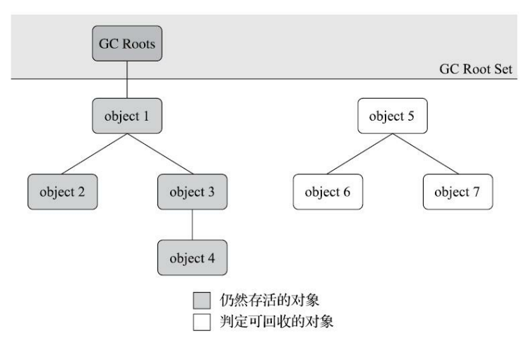

### 引用

在Java中，引用分为以下四种：

- **强引用（Strongly Re-ference）**：无论任何情况下，只要强引用关系还存在，垃圾收集器就永远不会回收掉被引用的对象。
- **软引用（Soft Reference）**：描述一些还有用，但非必须的对象。在系统将要发生内存溢出异常前，会把这些对象考虑仅回收范围内
- **弱引用（Weak Reference）**：被弱引用关联的对象只能生存到下一次垃圾收集发生为止
- **虚引用（Phantom Reference）**：一个对象是否有虚引用的存在，完全不会对其生存时间构成影响。为一个对象设置虚引用关联的唯一目的只是为了能在这个对象被收集器回收时收到一个系统通知。

### finalize

如果类没有覆写finalize()或者虚拟机之前没有调用过一次finalize，那么直接回收。否则将对象将会被放置在一个名为F-Queue的队列之中。而有一个有虚拟机创建的、调度优先级的Finalizer线程负责去执行它们的finalize()方法。

注意：程序员手动调用finalize()方法并不会视为虚拟机调用的

它并不是C++里的析构函数。因为

- JVM会延迟执行终结方法，执行时间点是非常不稳定的。
- 还不保证一定会执行finalizer方法。例如当程序终止时，有可能一些对象的finalizer方法还没有执行。
- 如果未捕获的异常在finalizer方法中抛出来，这个异常可以被忽略（警告都不会打印出来），且finalizer方法会终止。

如果在finalize中重新将一个引用指向被回收对象，那么该对象就不会被回收

~~~java
public class FinalizeEscapeGC {
    public static FinalizeEscapeGC SAVE_HOOK = null;
    public void isAlive() {
        System.out.println("yes, i am still alive :)");
    }
    
    @Override
    protected void finalize() throws Throwable {
        System.out.println("finalize method executed!");
        super.finalize();
		//故意让finalize执行时间长一点。
        for (int i = 0; i < Integer.MAX_VALUE; i++) 
            for (int j = 0; j < 100; j++) 
            	;
        
        FinalizeEscapeGC.SAVE_HOOK = this;
        System.out.println("finalize method finished!");
    }

    public static void main(String[] args) throws Throwable{
        SAVE_HOOK = new FinalizeEscapeGC();
        SAVE_HOOK = null;
        System.gc();				//进行第一次标记
        Thread.sleep(500);
        if (SAVE_HOOK != null) {
            SAVE_HOOK.isAlive();
        } else {
            System.out.println("no, i am dead :(");
        }

        SAVE_HOOK = null;
        System.out.println("开始第二次回收");
        System.gc();                //这里GC会被finalize方法阻塞。
        Thread.sleep(500);
        if (SAVE_HOOK != null) {
            SAVE_HOOK.isAlive();
        } else {
            System.out.println("no, i am dead :( 2");
        }
    }
}

/**
finalize method executed!
no, i am dead :( 1
开始第二次回收
finalize method finished!
yes, i am still alive :)
*/
~~~

### 回收方法区

《Java虚拟机规范》中提到过可以不要求虚拟机在方法区中实现垃圾收集。因为相对于堆，方法区垃圾收集的“性价比”通常也是比较低的。在大量使用反射、动态代理、CGLib等字节码框架，动态生成JSP以及OSGi这类频繁自定义类加载器的场景中，通常都需要Java虚拟机具备类型回收的能力，以保证不会对方法区造成过大的内存压力。

方法区的垃圾收集主要回收两部分内容：废弃的常量和不再使用的类类型。

HotSpot虚拟机对常量池的回收策略是很简明的，只要常量池中的常量没有被任何地方引用，就可以被回收。

而对类类型的回收策略是比较苛刻的：

- 该类所有的实例都已经被回收，也就是Java堆中不存在该类及其任何派生子类的实例

- 加载该类的类加载器已经被回收

- 该类对应的java.lang.Class对象没有在任何地方被引用，无法在任何地方通过反射访问该类的方法。

满足上述三个条件的无用类**允许**被回收，是否回收还不一定。关于是否要对类型进行回收，HotSpot虚拟机提供了-Xnoclassgc参数进行控制，还可以使用-verbose：class以及-XX：+TraceClass-Loading、-XX：+TraceClassUnLoading查看类加载和卸载信息

## 垃圾回收算法

### 概述

从如何判定对象消亡的角度出发，垃圾收集算法可以划分为**“引用计数式垃圾收集”（ReferenceCounting GC）**和**“追踪式垃圾收集”（Tracing GC）**两大类。这里我们只研究Tracing GC。

当前商业虚拟机的垃圾收集器，大多数都遵循了**分代收集（Generational Collection）**的理论，它建立在两个分代假说之上（经验准则）：

- **弱分代假说（Weak Generational Hypothesis）**：绝大多数对象都是朝生夕灭的。
- **强分代假说（Strong Generational Hypothesis）**：熬过越多次垃圾收集过程的对象就越难以消亡。

根据分代收集理论，收集器应该将Java堆划分出不同的区域，然后将回收对象根据其年龄（对象经过垃圾收集过程的次数）分配到不同的区域之中存储。而每一个区域采用不同的、与对象特征相匹配的垃圾收集算法。

设计者一般至少会把Java堆划分为**新生代（Young Generation）**和**老年代（Old Generation）**两个区域，显然对象之间会存在跨代引用。

从上述两条假说中我们可以推出**跨代引用假说（Intergenerational Reference Hypothesis）**：

- 跨代引用相对于同代引用来说仅占极少数。

因为如果某个新生代对象存在跨代引用，由于老年代对象难以消亡，所以该引用会使得新生代对象在收集时同样得以存活。进而在年龄增长之后晋升到老年代中，这时跨代引用也随即被消除了。

- **部分收集（Partial GC）**：不是完整收集整个Java堆
  - **新生代收集（Minor GC/Young GC）**：新生代的垃圾收集
  - **老年代收集（Major GC/Old GC）**：老年代的垃圾收集
  - **混合收集（Mixed GC）**：整个新生代以及部分老年代的垃圾收集
- **整堆收集（Full GC）**：收集整个Java堆和方法区

### 标记清除算法

该算法分为“标记”和“清除”两个阶段：

- 标记：标记存活对象（可达性分析或引用计数）
- 清除：回收未标记对象

它的主要缺点：

- 对象数量越多，标记过程越慢。回收对象越多，清理过程越慢。
- 内存空间的碎片化

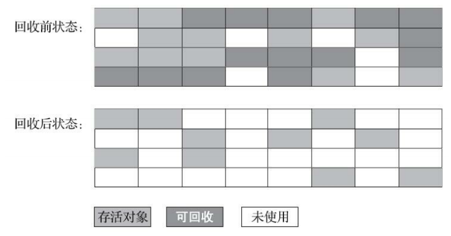

### 标记复制算法

为了解决标记-清除算法**面对大量可回收对象时执行效率低**的问题，1969年Fenichel提出了一种称为“半区复制”（Semispace Copying）的垃圾收集算法。其基本思想：将内存按容量划分为大小相等的两块，每次只使用其中的一块。当这一块的内存用完了，就将还存活着的对象复制到另外一块上面，然后再把这一块已使用过的内存空间一次清理掉。但是该算法面对少量可回收对象的场景（大部分对象存活）时，执行效率低下，因此标记复制算法一般用在新生代的回收中。此外可用内存缩减到一半，空间利用率低。

IBM公司曾有一项专门研究对新生代“朝生夕灭”的特点做了更量化的诠释——新生代中的对象有98%熬不过第一轮收集。因此并不需要按照1∶1的比例来划分新生代的内存空间。在1989年，Andrew Appel针对具备“朝生夕灭”特点的对象，提出了一种更优化的半区复制分代策略，现在称为**Appel式回收**。HotSpot虚拟机的Serial、ParNew等新生代收集器均采用了这种策略来设计新生代的内存布局。Appel式回收的具体做法是把新生代分为一块较大的Eden空间和两块较小的Survivor空间，每次分配内存只使用Eden和其中一块Survivor。发生垃圾搜集时，将Eden和Survivor中仍然存活的对象一次性复制到另外一块Survivor空间上，然后直接清理掉Eden和已用过的那块Survivor空间。HotSpot虚拟机默认Eden和Survivor的大小比例是8∶1，也就是说每次新生代中可用内存空间为整个新生代容量的90%。

每次GC流程:

1. Eden区和其中一个Survivor区 (From) 进行回收
2. 将还存活的对象复制到另一个Survivor区 (To)
3. 交换From和To的角色（这也是两块Survivor区的意义，实现高效回收）

当然，没有任何人可以保证每次回收都只有不多于10%的对象存活。对此，Appel式回收还有一个“逃生门”的安全设计，当Survivor空间不足以容纳一次Minor GC之后存活的对象时，就需要依赖其他内存区域（实际上大多就是老年代）进行**分配担保（Handle Promotion）**。

### 标记整理算法

标记-复制算法在对象存活率较高时就要进行较多的复制操作，效率将会降低。针对老年代对象的存亡特征，1974年Edward Lueders提出了另外一种有针对性的**“标记-整理”（Mark-Compact）**算法。它的基本原理是:

1. 标记阶段:扫描堆内存,标记正在使用的对象。
2. 整理阶段:把所有存活的对象向一端移动,然后直接清理掉端边界以外的内存。

注意：对象在内存中的复制操作必须要暂停用户线程的执行（Stop the World），延迟高；而标记清除算法不涉及复制操作，因此无需暂停用户线程，延迟低。但是标记清除算法需要复杂的内存分配器来缓解内存碎片的问题，而内存的访问是用户程序最频繁的操作，清除算法在这一环节增加了负担，这势必会影响程序的吞吐量。

HotSpot虚拟机里面关注吞吐量的ParallelScavenge收集器是基于标记-整理算法的，而关注延迟的CMS收集器则是基于标记-清除算法的。其实还可以将整理与清除两种算法结合起来：让虚拟机平时多数时间都采用标记-清除算法，暂时容忍内存碎片的存在，直到内存空间的碎片化程度已经大到影响对象分配时，再采用标记-整理算法收集一次，以获得规整的内存空间。

## HotSpot实现

### 根节点枚举

迄今为止，所有收集器在根节点枚举这一步骤时都是必须暂停用户线程的。也就是说，根节点枚举始终还是必须在一个能保障一致性的快照中才得以进行。

由于目前主流Java虚拟机使用的都是**准确式垃圾收集**（精确确定哪些内存地址保存有效引用，而不是基本类型）。在HotSpot中，使用为OopMap数据结构来保存这类信息。

在0x026eb7a9的call指令处，有OopMap记录。它指明了EBX寄存器和栈中偏移量为16的内存区域中各有一个普通对象指针（Ordinary Object Pointer，OOP）的引用，，有效范围为从call指令开始，直到 0x026eb730 +142 = 0x026eb7be，即hlt指令为止。

~~~java
[Verified Entry Point]
0x026eb730: mov %eax,-0x8000(%esp)
…………
;; ImplicitNullCheckStub slow case
0x026eb7a9: call 0x026e83e0 ; OopMap{ebx=Oop [16]=Oop off=142}
							; *caload
							; - java.lang.String::hashCode@48 (line 1489)
							; {runtime_call}
0x026eb7ae: push $0x83c5c18 ; {external_word}
0x026eb7b3: call 0x026eb7b8
0x026eb7b8: pusha
0x026eb7b9: call 0x0822bec0 ; {runtime_call}
0x026eb7be: hlt
~~~

### 安全点

出于空间成本的考虑，HotSpot没有为每条指令都生成OopMap，只是在“特定的位置”记录了这些信息，这些位置被称为**安全点（Safepoint）**。安全点位置的选取基本上是以「是否具有让程序长时间执行的特征」为标准进行选定的，「长时间执行」的最明显特征就是指令序列的复用，例如方法调用、循环跳转、异常跳转 等都属于指令序列复用。

JVM要求必须到达安全点后，才可以垃圾收集。那如何在垃圾收集发生时，让所有线程都跑到最近的安全点？这里有两种方案：

- **抢先式中断 （Preemptive Suspension）**：在垃圾收集发生时，系统首先把所有用户线程全部中断，如果发现有用户线程中断的地方不在安全点上，就恢复这条线程执行，直到跑到安全点上。

- **主动式中断（Voluntary Suspension）**：当垃圾收集需要中断线程的时候，JVM简单地设置一个标志位。线程在安全点处检查标志位，如果为真，那么主动中断挂起。此外，还在创建对象和其他需要在Java堆上分配内存的地方检查标志位，为了避免没有足够内存来分配新对象。

  查询操作的实现：内存保护陷阱

  ~~~java
  test %eax,0x160100 ; {poll}   // 虚拟机把0x160100的内存页设置为不可读，执行该指令时，调用中断处理程序
  ~~~

### 安全区域

对于那些刚从 BLOCK 状态恢复的线程来说，安全点的机制就失效了。为此，我们引入安全区域机制。安全区域是指能够确保在某一段代码片段之中，引用关系不会发生变化。因此，在这个区域中任意地方进行垃圾收集都是安全的。我们也可以把安全区域看作被扩展拉伸了的安全点。

当线程进入安全区域时，首先会标识自己进入了安全区域，这样垃圾收集时不再考虑这些线程。

当线程要离开安全区域时，它要检查虚拟机是否已经完成了根节点枚举。如果完成了，就继续执行；否则它就必须一直等待，直到收到可以离开安全区域的信号为止。

### 记忆集和卡表

那么根据跨代引用假说，在进行Minor Collections时，如果遍历到Old时，引用链大概率是GC Roots -> Old ->Old->Old->Old。因此出于性能考虑，引入一个剪枝操作，即指向Old的话就不继续遍历了。在文档[https://www.ibm.com/developerworks/library/j-jtp11253/](https://www.ibm.com/developerworks/library/j-jtp11253/)明确提及过

>A generational tracing collector starts from the root set, but does not traverse references that lead to objects in the older generation

但是为了保证可达性分析正确性，我们引入了**记忆集（Remembered Set）**的数据结构，它把老年代划分成若干小块，标识出**老年代的哪一块内存会存在跨代引用（老年代持有新生代）**。此后当发生Minor GC时，只有包含了跨代引用的小块内存里的对象才会被加入到GCRoots进行扫描。

在进行Major GC时，应当也像Minor GC那样，维护一个记忆集。但是在实践中，几乎都是通过使用Full GC来回收老年代，因此也没必要再维护一个记忆集。

Remembered Set的实现粒度如下：

- 字长精度（细粒度）：每个记录精确到一个机器字长
- 对象精度（细粒度）：每个记录精确到一个对象，该对象里有字段含有跨代指针
- 卡精度（粗粒度）：每个记录精确到一块内存区域，该区域内有对象含有跨代指针

对于卡精度，是用一种称为「卡表」（Card Table）的方式去实现记忆集

~~~java
CARD_TABLE [this address >> 9] = 0;
~~~

如果卡页中的某个的字段存在着跨代指针，那就将卡页所对应的数组元素设置为`1`。

### 写屏障

在HotSpot虚拟机里是通过写屏障（Write Barrier）技术维护卡表状态的，写屏障可以看作在虚拟机层面对“引用类型字段赋值”这个动作的AOP切 面[2]，在引用对象赋值时会产生一个环形（Around）通知，供程序执行额外的动作。

写后屏障更新卡表：

~~~c++
void oop_field_store(oop* field, oop new_value) {
	// 引用字段赋值操作
	*field = new_value;
	// 写后屏障，在这里完成卡表状态更新
	post_write_barrier(field, new_value);
}

~~~

这给赋值操作带来了一点额外的开销，但是这个开销与Minor GC时扫描整个老年代的代价相比，还是低得多的。

卡表在高并发场景下还面临着“伪共享”（False Sharing）问题，即每个核恰好修改同一个缓存行时，就会彼此影响（写回、无效化或者同步）而导致性能降低。为了避免伪共享问题，是先检查卡表标记

~~~java
if (CARD_TABLE [this address >> 9] != 0)
	CARD_TABLE [this address >> 9] = 0;
~~~

参数`-XX：+UseCondCardMark`，用来决定是否开启卡表更新的条件判断。

### 并发的可达性分析

显然，可达性分析所需的时间与Java堆容量成正比例关系，因此，有必要并发地进行分析

我们先来介绍入三色标记（Tri-color Marking）作为工具来辅助推导

- 白色：表示对象尚未被垃圾收集器访问过。若在分析结束的阶段，仍然是白色的对象，即代表不可达。
- 黑色：表示对象已经被垃圾收集器访问过，且这个对象的所有引用都已经扫描过
- 灰色：表示对象已经被垃圾收集器访问过，但这个对象上至少存在一个引用还没有被扫描过。

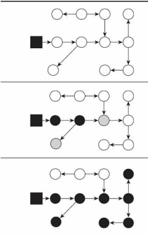

Wilson于1994年在理论上证明了，当且仅当以下两个条件同时满足时，会产生“对象消失”的问题，即原本应该是黑色的对象被误标为白色：

- 插入了一条从黑色对象到白色对象的新引用
- 删除了全部从灰色对象到该白色对象的直接或间接引用

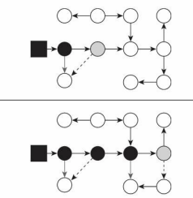

要解决并发扫描时的对象消失问题，只需破坏这两个条件的任意一个即可。由此分别产生了两种解决方案：

- **增量更新（Incremental Update）**：当黑色对象插入新的指向白色对象的引用关系时，就将这个新 插入的引用记录下来，等并发扫描结束之后，再将这些记录过的引用关系中的黑色对象为根，重新扫描一次。
- **原始快照（Snapshot At The Beginning， SATB）**：当灰色对象要删除指向白色对象的引用关系时，就将这个要删除的引用记录下来，在并发扫描结束之后，再将这些记录过的引用关系中的灰色对象为根，重新扫描一次。

## 垃圾收集器

### Serial

对于内存资源受限的环境，它是所有收集器里额外内存消耗（Memory Footprint）[1]最小的；

### ParNew

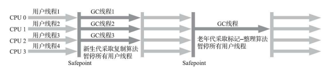

### Parallel Scavenge

Parallel Scavenge收集器提供了两个参数用于精确控制吞吐量：

- `-XX：MaxGCPauseMillis`参数控制最大垃圾收集停顿时间。收集器将尽力保证内存回收花费的时间不超过用户设定值，但是这是以牺牲吞吐量和新生代空间为代价换取的： 系统把新生代调得小一些，收集300MB新生代肯定比收集500MB快，但这也直接导致垃圾收集发生得更频繁。停顿时间的确在下降，但吞吐量也降下来了。
- `-XX：GCTimeRatio`参数直接设置吞吐量大小，默认值为99，即允许最大1%（即1/(1+99)）的垃圾收集时间

Parallel Scavenge收集器还有一个参数`-XX：+UseAdaptiveSizePolicy`，虚拟机会根据当前系统的运行情况收集性能监控信息，动态调整这些参数（MaxGCPauseMillis、GCTimeRatio）以提供最合适的停顿时间或者最大的吞吐量。这种调节方式称为垃圾收集的**自适应的调节策略（GC Ergonomics）**

### Serial Old

Serial Old是Serial收集器的老年代版本

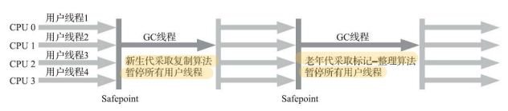

### Parallel Old

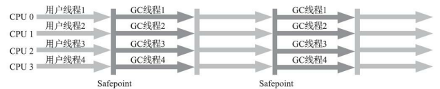

### CMS

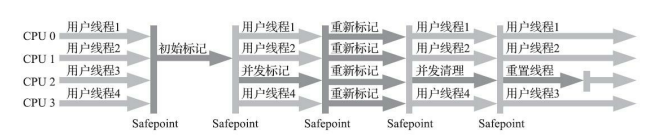

### Garbage First

G1将堆划分为多个大小相等的独立区域（Region），每一个Region都可以根据需要，扮演新生代的Eden空间、Survivor空间、老年代空间以及Humongous区域。其中的Humongous区域专门用来存储大对象。G1认为只要大小超过了Region容量一半的对象即可判定为大对象。每个Region的大小可以通过参数`-XX：G1HeapRegionSize`设定，取值范围为1MB～32MB，且应为2的N次幂。而对于那些超过了整个Region容量的超级大对象， 将会被存放在N个连续的Humongous Region之中。

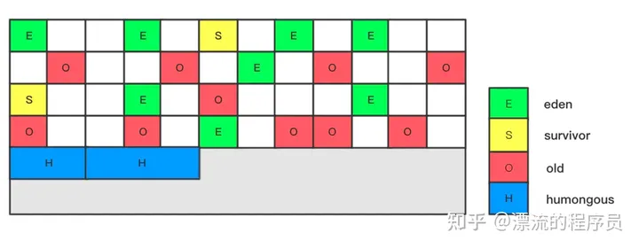

它将Region作为单次回收的最小单元。G1收集器去跟踪各个Region中的垃圾堆积的“价值”大小，价值即回收所获得的空间大小以及回收所需时间的经验值。然后在用户设定的所允许的收集停顿时间内（使用参数`-XX：MaxGCPauseMillis`指定，默认值是200毫秒），优先处理回收价值收益最大的那些Region

它的每个Region都维护有自己的记忆集，它本质上是一个哈希表，Key是别的Region的起始地址，Value是一个集合，里面存储的元素是卡页索引号。若Region A中的对象X引用了Region B中的对象Y，那么Region B会在自己的记忆集中，以Region A的起始地址作为Key，以X所在的卡页索引作为Value中的一个元素。

G1收集器的工作过程大致可划分为以下四个步骤：

- **初始标记（Initial Marking）**：仅仅只是标记一下GC Roots能直接关联到的对象，并且修改TAMS 指针的值，需要暂停用户线程。G1为每一个Region引入了两个名为**TAMS（Top at Mark Start）**的指针，并发回收时新分配的对象地址都必须要在这两个指针位置以上。
- **并发标记（Concurrent Marking）**：：从GC Root开始对堆中对象进行可达性分析，递归扫描整个堆里的对象图，找出要回收的对象
- **最终标记（Final Marking）**：对用户线程做另一个短暂的暂停，完成SATB最后一步。
- **筛选回收（Live Data Counting and Evacuation）**：负责更新Region的统计数据，即计算各个Region的回收价值和成本，然后开始回收。这里的操作涉及存活对象的移动，是必须暂停用户线程。

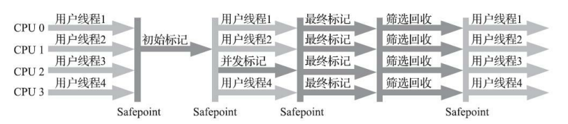

G1收集器要比其他的传统垃圾收集器有着更高的内存占用负担。根据经验，G1至少要耗费大约相当于Java堆容量10%至20%的额 外内存来维持收集器工作。

### Z Garbage Collector

ZGC的Region具有动态性

- **小型Region（Small Region）**“：容量固定为2MB，用于放置小于256KB的小对象。
- **中型Region（Medium Region）**：容量固定为32MB，用于放置大于等于256KB但小于4MB的对 象。
- **大型Region（Large Region）**：容量不固定，可以动态变化，但必须为2MB的整数倍，用于放置 4MB或以上的大对象。每个大型Region中只会存放一个大对象

ZGC收集器使用**染色指针技术（Colored Pointer）**，它直接将少量额外的信息存储在指针上的技术。

在AMD64架构中只支持到52位（4PB）的地址总线和48位（256TB）的虚拟地址空间。此外，操作系统还会施加约束，例如64位的Linux则分别支持47位（128TB）的进程虚拟地址空间和46位（64TB）的物理地址空间。染色指针技术（Colored Pointer）使用可用地址的最高四位来存储信息

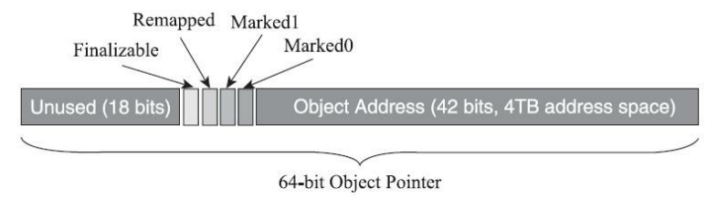

- 三色标记状态

- 是否进入了重分配集（即被移动过）

- Finalizeable

  

但是，这里有一个问题，CPU会将地址作为一个整体来看待，这也就是说这染色的四位会被认为是地址。这个问题在Solaris/SPARC平台上比较容易解决，因为SPARC硬件层面本身就支持虚拟地址掩码，设置之后其机器指令直接就可以忽略掉染色指针中的标志位。在Linux/x86-64平台上，使用了多重映射（Multi-Mapping）来解决这个问题（x86不支持虚拟地址掩码）

ZGC的工作过程大致可划分为以下四个大的阶段：

- 并发标记（Concurrent Mark）：会更新染色指针中的Marked 0、Marked 1标志位。
- 并发预备重分配（Concurrent Prepare for Relocate）：这个阶段统计得出本次收集过程要清理哪些Region，将这些Region组成重分配集（Relocation Set）。
- 并发重分配（Concurrent Relocate）：把重分配集中的存活对象复制到新的Region上，并为重分配集中的每个Region维护一个转发表（Forward Table），记录从旧对象到新对象的转向关系。得益于染色指针的支持，ZGC收集器能仅从引用上就明确得知一个对象是否处于重分配集之中。如果用户线程此时并发访问了位于重分配集中的对象，这次访问将会被预置的内存屏障所截获，然后立即根据Region上的转发表记录将访问转发到新复制的对象上，并同时修正更新该引用的值，使其直接指向新对象，ZGC将这种行为称为指针的“自愈”（SelfHealing）能力。这样做的好处是只有第一次访问旧对象会陷入转发，也就是只慢一次，对比 Shenandoah的Brooks转发指针，那是每次对象访问都必须付出的固定开销。
- 并发重映射（Concurrent Remap）：重映射所做的就是修正整个堆中指向重分配集中旧对象的所有引用。ZGC很巧妙地把并发重映射 阶段要做的工作，合并到了下一次垃圾收集循环中的并发标记阶段里去完成，反正它们都是要遍历所 有对象的，这样合并就节省了一次遍历对象图的开销。一旦所有指针都被修正之后，原来记录新旧对象关系的转发表就可以释放掉了。

ZGC每次回收都会扫描所有的Region，用范围更大的扫描成本换取省去G1中记忆集的维护成本，它甚至连分代都没有。ZGC的这种选择也限制了它所能承受的对象分配速率不会太高。

ZGC准备要对一个很大的堆做一次完整的并发收集，假设其全过程要持续十分钟以上。在这段时间里 面，由于应用的对象分配速率很高，将创造大量的新对象，这些新对象很难进入当次收集的标记范围，通常就只能全部当作存活对象来看待——尽管其中绝大部分对象都是朝生夕灭的，这就产生了大量的浮动垃圾。

## HotSpot

HotSpot所有功能的日志都收归到了“-Xlog”参数上

~~~shell
-Xlog[:[selector][:[output][:[decorators][:output-options]]]]
~~~

命令行中最关键的参数是选择器（Selector），它由标签（Tag）和日志级别（Level）共同组成。 标签可理解为虚拟机中某个功能模块的名字。标签包括：

~~~shell
add，age，alloc，annotation，aot，arguments，attach，barrier，biasedlocking，blocks，bot，breakpoint ... 
~~~

日志级别从低到高，共有Trace，Debug，Info，Warning，Error，Off六种级别。

还可以使用修饰器（Decorator）来要求每行日志输出都附加上额外的内容，支持附加在日志行上的信息包括：

- time：当前日期和时间。
- uptime：虚拟机启动到现在经过的时间，以秒为单位。
- pid：进程ID
- level：日志级别
- tags：日志输出的标签
- ...

如果不指定，默认值是uptime、level、tags这三个

垃圾收集器参数总结

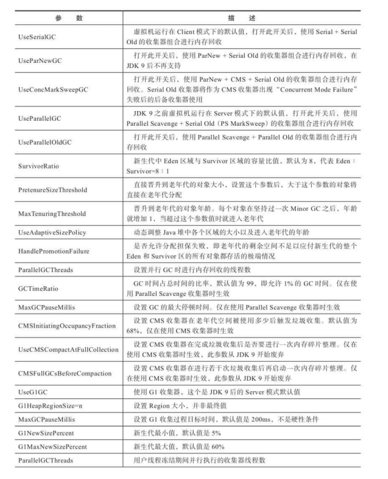

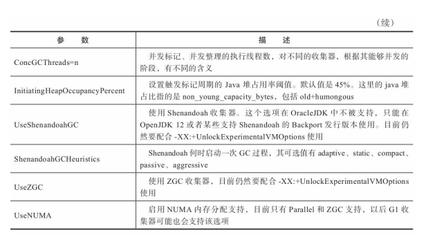

## 案例分析

- **大内存硬件上的程序部署策略**

  HotSpot虚拟机是以服务端模式运行，默认使用的是吞吐量优先收集器，回收12GB的Java堆，一次Full GC的停顿时间就高达14秒。由于程序设计的原因，访问文档时会把文档从磁盘提取到内存中，导致内存中出现很多由文档序列化产生的大对象，这些大对象大多在分配时就直接进入了老年代，没有在 Minor GC中被清理掉。

  解决方案是换用ZGC虚拟机，或者同时使用若干个Java虚拟机 + 负载均衡，建立逻辑集群来利用硬件资源

- **集群间同步导致的内存溢出**

- **堆外内存导致的溢出错误**

- **外部命令导致系统缓慢**

- **不恰当数据结构导致内存占用过大**

- **由Windows虚拟内存导致的长时间停顿**

- **由安全点导致长时间停顿**

  添加-XX： +SafepointTimeout和-XX：SafepointTimeoutDelay=2000两个参数，查找在规定时间内未到达安全点的线程

  
  
  
  
  
