# Netty

[TOC]

## 初步

Maven依赖：

~~~xml
<dependency>
    <groupId>io.netty</groupId>
    <artifactId>netty-all</artifactId>
    <version>4.1.107.Final</version>
</dependency>
~~~

一个例子：

~~~java
public class NettyDiscardServer {
    private final int serverPort;
    ServerBootstrap b = new ServerBootstrap();

    public NettyDiscardServer(int port) {
        this.serverPort = port;
    }
    public void runServer() {
        //创建反应器轮询组
        EventLoopGroup boosLoopGroup = new NioEventLoopGroup(1);
        EventLoopGroup workerLoopGroup = new NioEventLoopGroup();

        try {
            //1. 设置反应器轮询组
            b.group(boosLoopGroup, workerLoopGroup);
            //2. 设置nio类型的通道
            b.channel(NioServerSocketChannel.class);
            //3. 设置监听端口
            b.localAddress(serverPort);
            //4. 设置通道的参数
            b.option(ChannelOption.SO_KEEPALIVE, true);
            //5. 装配子通道流水线
            b.childHandler(new ChannelInitializer<SocketChannel>() {
                protected void initChannel(SocketChannel ch) {
                    ch.pipeline().addLast(new NettyDiscardHandler());
                }
            });
            //6. 开始绑定服务器
            ChannelFuture channelFuture = b.bind().sync();
            //7. 等待通道关闭的异步任务结束
            ChannelFuture closeFuture = channelFuture.channel().closeFuture();
            
            closeFuture.sync();
        } catch (Exception e) {
            e.printStackTrace();
        } finally {
            // 释放掉所有资源，包括创建的线程
            workerLoopGroup.shutdownGracefully();
            boosLoopGroup.shutdownGracefully();
        }
    }

    public static void main(String[] args) {
        int port = NettyDemoConfig.SOCKET_SERVER_PORT;
        new NettyDiscardServer(port).runServer();
    }
}
~~~

NioEventLoopGroup就是Reactor，负责IO事件的查询和分发

Handler就是负责业务逻辑的处理

~~~java
class NettyDiscardHandler extends ChannelInboundHandlerAdapter {
    @Override
    public void channelRead(ChannelHandlerContext ctx, Object msg) throws Exception {
        ByteBuf in = (ByteBuf) msg;
        try {
            while (in.isReadable()) {
                in.readByte();
            }
        } finally {
            ReferenceCountUtil.release(msg);
        }
    }
}
~~~

## Netty中的Reactor模式

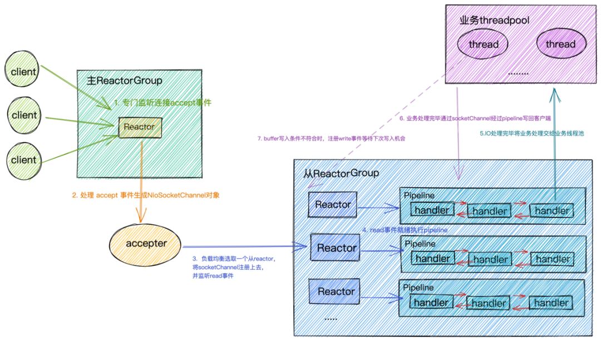

1. IO事件源于Channel，所以必须向Selector注册Channel
2. Reactor基于Selector不断地轮询，并进行事件分发
3. Handler完成业务逻辑

Handler如果阻塞的话，会严重影响Reactor模式的性能（协程也是如此）。解决方案。

- 新开一个线程，使用异步对象（不要同步获取结果）。即使提交异步任务的函数退出了，只要异步任务仍在运行，那么异常对象不会被垃圾回收。
- 在我们向 pipeline 添加 ChannelHandler 的时候可以通过`ChannelPipeline#addLast(EventExecutorGroup, ChannelHandler......)` 方法指定执行该 ChannelHandler 的 executor。

Netty实现了自己的线程池`EventLoopGroup`

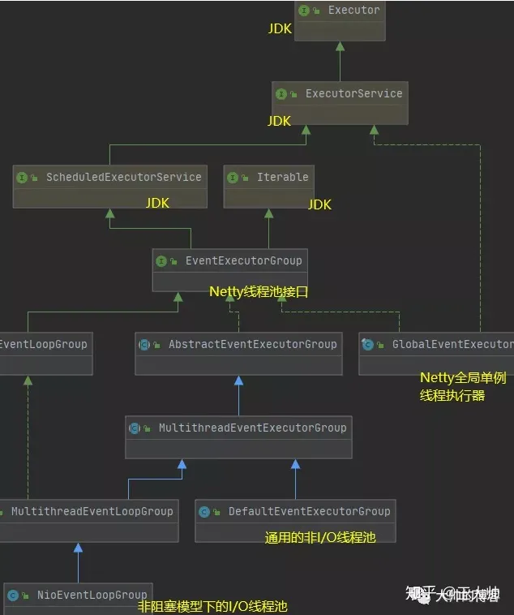

- NioEventLoopGroup线程池持有的是 NioEventLoop 线程
- DefaultEventExecutorGroup线程池持有的是 DefaultEventExecutor 线程

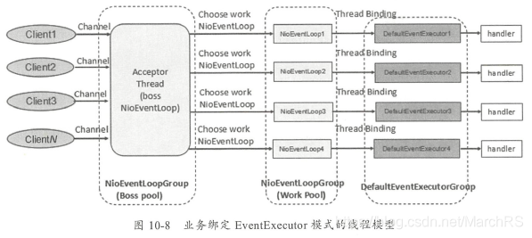

为ChannelHandler指定了EventExecutorGroup之后，创建ChannelHandlerContext上下文时，会从EventExecutorGroup中选择一个EventExecutor绑定到该ChannelHandler实例上。降低了锁竞争

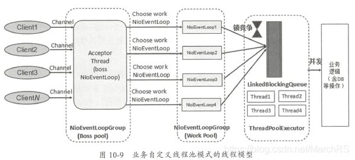

而JDK自带的线程池，内部使用了一个阻塞队列，因此当Client较多时，就会形成激烈的锁竞争。

Netty自己实现了一套Channel组件，支持多种通信协议，常见通道类型如下：

- NioSocketChannel：TCP Socket传输通道。 
- NioServerSocketChannel：TCP Socket服务端监听通道。 
- NioDatagramChannel：UDP传输通道。 
- NioSctpChannel：Sctp传输通道。 
- NioSctpServerChannel：Sctp服务端监听通道。 
- OioSocketChannel：TCP Socket传输通道。 
- OioServerSocketChannel：TCP Socket服务端监听通道。 
- OioDatagramChannel：UDP传输通道。 
- OioSctpChannel：Sctp传输通道。 
- OioSctpServerChannel：Sctp服务端监听通道。

Nio异步非阻塞，Oio同步阻塞式

NioSocketChannel 内部依赖 Java NIO 的 SelectableChannel 成员。对NioSocketChannel通道上的所有IO操作，最终都会落地到的SelectableChannel底层通道上

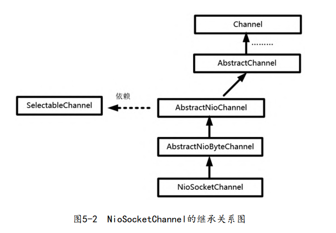

Netty中的反应器组件有多个实现类，它们与特定通道类型一一对应。例如，NioSocketChannel类型的通道所对应的反应器是NioEventLoop。

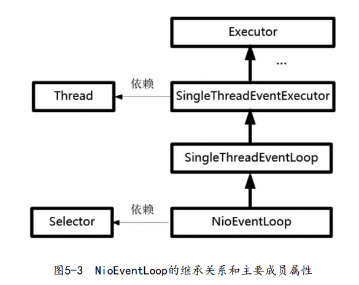

EventLoop反应器实例和NettyChannel通道实例是一对多的关系

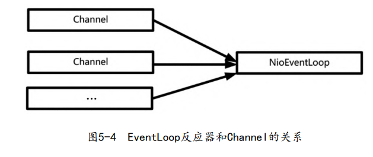

EventLoop反应器内部有一个线程负责Java NIO选择器的事件的轮询，然后进行对应的事件分发。事件分发（Dispatch） 的结果就是Handler处理器。Handler分为两大类

- ChannelInboundHandler入站处理器，默认实现类为ChannelInboundHandlerAdapter
- ChannelOutboundHandler出站处理器，默认实现类为ChannelOutBoundHandlerAdapter

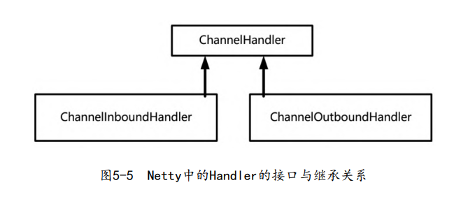

入站指的是输入（从Channel传递到Handler），出站指的是输出（从Handler传递到Channel的）

ChannelPipeline用于处理Channel和Handler之间的绑定关系，Channel类中定义了一个ChannelPipeline类型的成员pipeline，它本质上是一个双向链表。

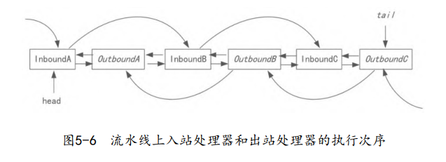

这里需要说明几点：

- 流水线是双向的
- 入站的IO操作只能从InboundHandler流过
- 可以在中间的Handler上停止流动

## Bootstrap

Bootstrap类是Netty提供的一个的工厂类，简化组装Channel、EventLoop等组件的过程

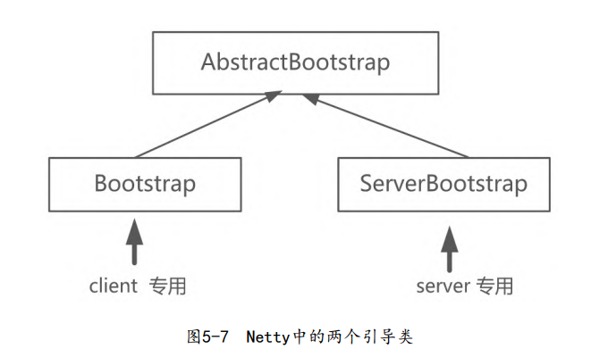

操作系统底层的socket文件描述符分为两类：

- 连接监听类型
- 数据传输类型

其中负责连接监听的通道（例如，NioServerSocketChannel）称为父通道，而负责数据传输的通道称为子通道。

在Netty中，一个EventLoop相当于一个子反应器 （SubReactor），包括一个轮询线程以及Selector。多个EventLoop线程放在一起构成EventLoopGroup（事件轮询组）

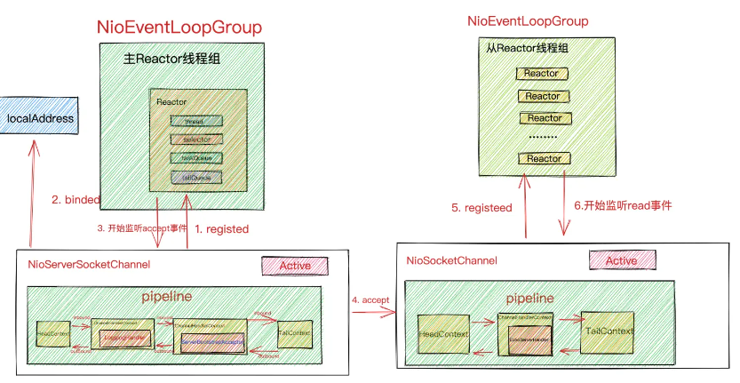

EventLoopGroup构造函数可以指定内部线程数，每一个线程对应一个EventLoop，默认是$2 * CPU$

ServerBootstrap的流程

1. 创建一个ServerBootstrap

   ~~~java
   ServerBootstrap b = new ServerBootstrap();
   ~~~

2. 创建反应器轮询组

   ~~~java
   public ServerBootstrap group(EventLoopGroup parentGroup, EventLoopGroup childGroup)
   ~~~

   ~~~java
   //boss轮询组
   EventLoopGroup bossLoopGroup = new NioEventLoopGroup(1);
   //worker轮询组
   EventLoopGroup workerLoopGroup = new NioEventLoopGroup();
   
   //step1：为引导类实例设置反应器轮询组
   b.group(bossLoopGroup, workerLoopGroup);
   ~~~

3. 设置通道的IO类型，要与反应器类型对应

   ~~~java
   b.channel(NioServerSocketChannel.class);
   ~~~

   注意，每当父通道成功接收到一个连接后，就会创建子通道

4. 设置监听端口

   ~~~java
   b.localAddress(new InetSocketAddress(port));
   ~~~

5. 设置传输通道的配置选项

   ~~~java
   // 开启TCP底层心跳机制
   b.option(ChannelOption.SO_KEEPALIVE, true);
   
   
   b.option(ChannelOption.ALLOCATOR, pooledByteBufAllocator.DEFAULT);
   ~~~

   option()为父通道进行配置，而childOption为子通道进行配置

6. 装配子通道的Pipeline

   ~~~java
   b.childHandler(new ChannelInitializer<SocketChannel>() {
       protected void initChannel(SocketChannel ch) {
       	//向子通道流水线添加一个Handler业务处理器
       	ch.pipeline().addLast(new NettyDiscardHandler());
       }
   });
   ~~~
   
   父通道的处理器的业务逻辑是相对固定的（接收新连接后，创建子通道），若要定制一些逻辑，那么可以调用`handler(ChannelHandler handler)`方法。
   
7. 绑定服务器的监听端口

   ~~~java
   ChannelFuture channelFuture = b.bind().sync();
   ~~~

8. 关闭并释放资源

   ~~~java
   ChannelFuture closeFuture = channelFuture.channel().closeFuture();
   closeFuture.sync();
   workerLoopGroup.shutdownGracefully();
   bossLoopGroup.shutdownGracefully();
   ~~~

   

ChannelOption提供的选项：

- SO_RCVBUF和SO_SNDBUF：设置接收缓冲区以及发送缓冲区的大小

- TCP_NODELAY：是否关闭Nagle算法。Nagle算法将小的碎片数据连接成更大的报文（或数据包）来最小化所发送报文的数量。它适合高实时性的场景。

- SO_KEEPALIVE：默认值为false，TCP会主动探测空闲连接的 有效性。需要注意的是：默认的心跳间隔是7200秒

- SO_REUSEADDR：默认值为false，true表示地址复用。有四种情况需要设置为true

  - 当有一个地址和端口相同的连接socket1处于TIME_WAIT状态时，而又希望启动一个新的连接socket2要占用该地址和端口
  - ...

- SO_LINGER：控制socket.close()方法的行为。

  - -1（默认值）：socket.close()方法在调用后立即返回，但操作系统底层会将发送缓冲区的数据全部发送到对端
  - 0：socket.close()方法在调用后会立即返回，但是操作系统会放弃发送 缓冲区数据，直接向对端发送RST包
  - 正数：socket.close()同步阻塞，若超时，则立即返回并发送RST包

- SO_BACKLOG：设置存放握手连接的队列的长度。

  具体来说，服务端对完成第二次握手的连接放在一个队列（暂时称A队列），如果进一步完成第三次握手，再把连接从A队列移动到新队列（暂时称B队列），接下来应用程序会通过调用accept()方法取出握手成功的连接，而系统则会将该连接从B队列移除。A和B队列的长度 之和是SO_BACKLOG指定的值，当A和B队列的长度之和大于SO_BACKLOG 值时，新连接将会被TCP内核拒绝。

- SO_BROADCAST：设置为广播模式

## Channel

抽象类AbstractChannel的构造函数如下：

~~~java
protected AbstractChannel(Channel parent) {
    this.parent; // 父通道
    id;
    unsafe; 	// 底层的NIO 通道，完成实际的IO操作
    pipeline; 	// 一条通道流水线
}
~~~

AbstractChannel中几个重要的方法：

- `ChannelFuture connect(SocketAddress address)`
- `ChannelFuture bind(SocketAddress address)`
- `ChannelFuture close()`
- `Channel read()`
- `ChannelFuture write(Object o)`
- `Channel flush()`

Netty提供了EmbeddedChannel类，用于单元测试，它的方法有：

- writeInbound
- readInbound
- writeOutbound
- readOutbound
- finish

~~~java
ChannelInitializer i = new ChannelInitializer<EmbeddedChannel>() {
	protected void initChannel(EmbeddedChannel ch) {
        ch.pipeline().addLast(new Handler());
    }  
};

EmbeddedChannel channel = new EmbeddedChannel(i);
channel.writeInbound(buffer);
~~~

其他方法：

- remoteAddress()，获取IP

  ~~~java
  ctx.channel().remoteAddress()
  ~~~

Channel通道类有类似于Map容器的功能

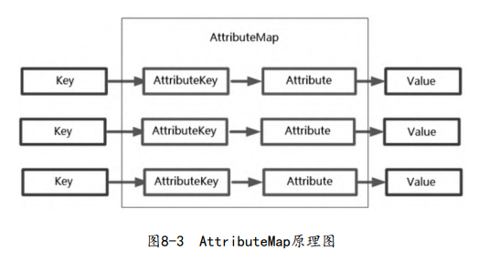

AttributeKey是Key的包装类，Attribute类似

~~~java
// 设定值
AttributeKey<ServerSession> SESSION_KEY = AttributeKey.valueOf("SESSION_KEY");

channel.attr(SESSION_KEY).set(session)
    
// 获取值
ServerSession session = ctx.channel().attr(SESSION_KEY).get();
~~~

## Handler

整个IO操作分为：获取数据、解码、处理、编码、发送数据。其中，Netty负责获取与发送数据，用户需要自定义其他部分。

ChannelInboundHandler的主要操作（子类需要覆写这些方法）

- channelRegistered()：当通道完成注册后（绑定到一个EventLoop上），就会调用该方法
- channelActive()：当通道激活完成后，就会调用该方法
- channelRead()：当通道缓冲区可读时
- channelReadComplete()：当通道缓冲区读完时
- channelInactive()：当连接被断开或者不可用时
- exceptionCaught()：当通道处理过程发生异常时
- handlerAdded()：当业务处理器被加入到流水线后（`ch.pipeline().addLast(handler)`），此方法将被回调、
- channelUnregistered()
- handlerRemoved()

ChannelOutboundHandler的主要操作：

- bind()：完成底层Java IO通道的IP地址绑定
- connect()：完成底层Java IO通道的服务端的连接操作
- write()：从Netty Channel向Java IO Channel的写入
- flush()：冲刷底层缓存区，立即写出到对端。
- read()：从Java IO Channel读取到Netty Channel
- disConnect()：断开底层Java IO通道的socket连接
- close()：关闭底层的通道

通过ChannelInitializer，向Channel注册处理器。

~~~java
b.childHandler(new ChannelInitializer<SocketChannel>() {
   protected void initChannel(SocketChannel ch) {
       ch.pipeline().addLast(new NettyDiscardHandler());
   } 
});
~~~

`@ChannelHandler.Sharable`注解一个Handler实例可以被多个通道安全地共享（这个Handler必须是无状态的），即多个通道的流水线可以加入同一个 Handler 实例。这种共享操作，Netty默认是不允许的，违反则抛出异常。

~~~java
@ChannelHandler.Sharable
public class NettyEchoServerHandler extends ChannelInboundHandlerAdapter {
    
}
~~~

`isSharable()`可以检查Handler是否可共享。

~~~java
ChannelInboundHandlerAdapter handler = new NettyDiscardHandler();
    
b.childHandler(new ChannelInitializer<SocketChannel>() {
    protected void initChannel(SocketChannel ch) {
    	if (handler.isSharable()) {}
    		ch.pipeline().addLast(handler);
    	}	
    }
});
~~~

## Pipeline

ChannelPipeline是基于责任链设计模式（Chain of Responsibility）来设计的，内部是一个双向链表结构

在Netty的设计中Handler是无状态的，而Pipeline是有状态的，保存了Channel的关系。具体来说，ChannelHandlerContext 作为Pipeline双向链表的节点，封装了 ChannelHandler 和 ChannelPipeline 之间的关联关系。处理器可通过上下文去获取 ChannelPipeline 实例或者 Channel 实例。

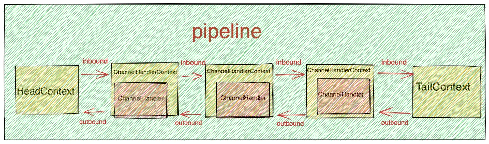

`ChannelHandlerContext`接口的默认实现类为`AbstractChannelHandlerContext`，其核心成员如下：

~~~java
abstract class AbstractChannelHandlerContext implements ChannelHandlerContext {
    //双向链表的指针：指向后继
    volatile AbstractChannelHandlerContext next;
    
    //双向链表的指针：指向前驱
    volatile AbstractChannelHandlerContext prev;
    
    private final boolean inbound; //标志：是否为入站节点
    private final boolean outbound; //标志：是否为出站节点

    private final AbstractChannel channel; //上下文节点所关联的通道
    private final DefaultChannelPipeline pipeline; //所属流水线
    private final String name; //上下文节点名称，可以在加入流水线时指定
    
    //节点的执行线程，如果没有特别设置，则为通道的IO线程
    final EventExecutor executor;
}
~~~

ChannelHandler 在 Netty 中的作用只是负责处理 IO 逻辑。它并不会感知到它在 pipeline 中的位置，更不会感知和它相邻的两个 ChannelHandler。这样设计就使得 ChannelHandlerContext 和 ChannelHandler 的职责单一，各司其职，具有高度的可扩展性。

此外，还有`HeadContext`头节点和`TailContext`尾节点

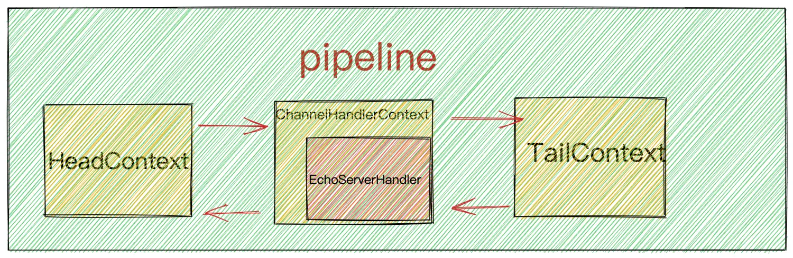

实际上，`TailContext`是一个入站处理器

~~~java
public class DefaultChannelPipeline implements ChannelPipeline
{
    final class TailContext extends AbstractChannelHandlerContext implements ChannelInboundHandler {

    }
}
~~~

`HeadContext`既是入站处理器，也是出站处理器。

~~~java
public class DefaultChannelPipeline implements ChannelPipeline
{
    final class HeadContext extends AbstractChannelHandlerContext implements ChannelOutboundHandler, ChannelInboundHandler {

    }
    private final Unsafe unsafe;
}
~~~

### 热插拔Handler

在流水线上热插拔Handler，实际上就是在双向链表上添加/删除节点：

~~~java
public interface ChannelPipeline extends ChannelInboundInvoker, ChannelOutboundInvoker, Iterable<Map.Entry<String, ChannelHandler>> {
    ChannelPipeline addFirst(String var1, ChannelHandler var2);
    ChannelPipeline addFirst(EventExecutorGroup var1, String var2, ChannelHandler var3);
}
~~~

使用示例：

~~~java
class SimpleInHandlerA extends ChannelInboundHandlerAdapter {
    public void channelRead(ChannelHandlerContext ctx, Object msg){
    	super.channelRead(ctx, msg);
   	 	//从流水线删除当前业务处理器
    	ctx.pipeline().remove(this);
    }
}
~~~

这里也就可以解释ChannelInitializer没有被重复调用的原因

~~~java
public abstract class ChannelInitializer<C extends Channel> extends ChannelInboundHandlerAdapter {
    private boolean initChannel(ChannelHandlerContext ctx) throws Exception {
        // 伪代码
        this.initChannel(ctx.channel());
        // 为什么要将自己删除呢？ 一条通道流水线只需要做一次装配工作
        this.remove(ctx);
 
    }
}
~~~

### Close

在Handler类的方法中，直接return和ChannelHandlerContext#close()有什么区别：

- return后 Netty 仍然保持 Channel 的开启状态，继续接收数据。
- close方法直接关闭通道，不再接收数据。

### Write & Read

在Channel、ChannelPipeline、ChannelHandlerContext三个类中，都存在同样的出站和入站处理方法。

- **Channel**
  - 出站方法：`write(Object msg)`, `writeAndFlush(Object msg)`, `disconnect()`, `close()`
  - 入站方法：这些方法并不存在于`Channel`接口中。
- **ChannelPipeline**
  - 出站方法：`write(Object msg)`, `writeAndFlush(Object msg)`，`close()`, `disconnect()`
  - 入站方法：`fireChannelRegistered()`, `fireChannelActive()`, `fireChannelRead(Object msg)`, `fireChannelInactive()`, `fireExceptionCaught(Throwable cause)`
- **ChannelHandlerContext**
  - 出站方法：`write(Object msg)`, `writeAndFlush(Object msg)`, `disconnect()`, `close()`
  - 入站方法：`fireChannelRegistered()`, `fireChannelActive()`, `fireChannelRead(Object msg)`, `fireChannelInactive()`, `fireExceptionCaught(Throwable cause)`

Channel或ChannelPipeline的出站和入站处理方法，会在整条流水线中传播，而 ChannelHandlerContext出站和入站处理方法，只会从当前的节点开始往同类型的下一站处理器传播。

Pipeline 如何通过 ChannelHandlerContext 来执行出入站的传播

~~~java
final class DefaultChannelPipeline implements ChannelPipeline {
    final AbstractChannelHandlerContext head; 
    final AbstractChannelHandlerContext tail; 
    
    //写操作的传播
    @Override
    public ChannelFuture write(Object msg) {
    	return tail.write(msg); //从后往前传递
    }
    
    //读操作的传播
    @Override
    public ChannelPipeline fireChannelRead(Object msg) {
    	head.fireChannelRead(msg); //从头往后传递
    	return this;
    }
}
~~~

出站msg数据在到达HeadContext处理器后，通过unsafe传输实例将二进制数据写入底层传输通道，完成整个传输处理过程。

~~~java
abstract class AbstractChannelHandlerContext implements ChannelHandlerContext {
    @Override
 	public ChannelHandlerContext fireChannelRead(final Object msg) {
        if (msg == null) {
 			throw new NullPointerException("msg");
 		}
        //在双向链表中向后查找，找到下一个入站节点（同类的后继）
 		final AbstractChannelHandlerContext next = findContextInbound();
        
		EventExecutor executor = next.executor(); //获取后继的处理线程
        if (executor.inEventLoop()) {
			// 如果当前线程为后继的处理线程
            next.invokeChannelRead(msg);
        } else {
            // 如果当前处理线程不是后继的处理线程，则提交到后继处理线程去排队
            executor.execute(new OneTimeTask() {
                @Override public void run() {
                    
                }
            });
        }
		return this;
    }
    
    private AbstractChannelHandlerContext findContextInbound() {
        AbstractChannelHandlerContext ctx = this;
        do {
        	ctx = ctx.next; //向后查找，一直到末尾或者找到入站类型节点为止
        } while (!ctx.inbound);
        return ctx;
    }
}
~~~

通过在`channelRead`中**不调用**基类的`channelRead()`方法（即`ctx.fireChannelRead(msg);`）来截断流水线

~~~java
class SimpleInHandlerB2 extends ChannelInboundHandlerAdapter {
    @Override
    public void channelRead(ChannelHandlerContext ctx, Object msg){
        //不调用基类的channelRead，终止流水线的执行
        //super.channelRead(ctx, msg);
    }
}
~~~

基类的`channelRead`实际上就是调用`ctx.fireChannelRead(msg);`

~~~java
public void channelRead(ChannelHandlerContext ctx, Object msg) throws Exception {
    ctx.fireChannelRead(msg);
}
~~~

 **出站处理流程只要开始执行，就不能被截断**。

 **Netty 的写操作是一个异步操作**。写操作在pipeline传播的相关源码如下：

~~~java
//获取下一个要被执行的channelHandler指定的executor
EventExecutor executor = next.executor();

if (executor.inEventLoop()) {
    //如果是，那么我们直接在当前线程中执行 write 方法。
    if (flush) {
        next.invokeWriteAndFlush(m, promise);
    } else {
        next.invokeWrite(m, promise);
    }
} else {
    //如果不是，则封装程异步任务 提交给指定的executor执行
    final WriteTask task = WriteTask.newInstance(next, m, promise, flush);
    if (!safeExecute(executor, task, promise, m, !flush)) {
        task.cancel();
    }
}
~~~

在我们向 pipeline 添加 ChannelHandler 的时候可以通过`ChannelPipeline#addLast(EventExecutorGroup, ChannelHandler......)` 方法指定执行该 ChannelHandler 的 executor。如果不特殊指定，那么执行该 ChannelHandler 的 executor 默认为该 Channel 绑定的 Reactor 线程。

outbound 事件在 pipeline 中的传播最终会传播到 HeadContext 中，而而 HeadContext 指定的 executor 正是对应 channel 绑定的 reactor 线程。这样就保证了写操作的线程安全性。

### Exception

我们在 Handler 的 exceptionCaught方法中，来自定义处理异常的逻辑。

~~~java
// 不传播异常
@Override
public void exceptionCaught(ChannelHandlerContext ctx, Throwable cause) throws Exception {
    System.out.println(cause.getMessage());
}

// 传播异常
@Override
public void exceptionCaught(ChannelHandlerContext ctx, Throwable cause) throws Exception {
    // 从当前节点继续传播异常
    ctx.fireChannelRead(cause);
    
    // 从头节点开始传播异常
    ctx.pipeline().fireExceptionCaught(cause);
}
~~~

从ChannelInboundHandlerAdapter的exceptionCaught方法可知，如果用户没有重写`exceptionCaught`方法，则会传播到下一个Handler。

~~~java
public void exceptionCaught(ChannelHandlerContext ctx, Throwable cause) throws Exception {
    ctx.fireExceptionCaught(cause);
}
~~~

在异常事件播的过程中是不区分`inbound`还是`outbound`的，相关代码如下：

~~~java
public ChannelHandlerContext fireExceptionCaught(final Throwable cause) {
    //传播异常事件的时候, 直接拿了当前节点的下一个节点
    invokeExceptionCaught(next, cause);
    return this;
}
~~~

AbstractChannelHandlerContext#invokeChannelRead

~~~java
private void invokeChannelRead(Object msg) {
    if (invokeHandler()) {
        try {
            ((ChannelInboundHandler) handler()).channelRead(this, msg);
        } catch (Throwable t) {
            //发生异常的时候在这里捕获异常
            notifyHandlerException(t);
        }
    } else {
        fireChannelRead(msg);
    }
}

private void notifyHandlerException(Throwable cause) {
    //代码省略
    invokeExceptionCaught(cause);
}

private void invokeExceptionCaught(final Throwable cause) {
    if (invokeHandler()) {
        try {
            //当前handler调用exceptionCaught()方法
            handler().exceptionCaught(this, cause);
        } catch (Throwable error) {
            //代码省略
        }
    } else {
        fireExceptionCaught(cause);
    }
}
~~~

而 outbound 类异步事件发生异常时，**则不会触发exceptionCaught事件传播**。一般只是通知相关 ChannelFuture。但如果是 flush 事件在传播过程中发生异常，则会触发当前发生异常的 ChannelHandler 中的exceptionCaught 事件回调。

## ByteBuf

Netty提供了ByteBuf缓冲区组件来替代Java NIO的ByteBuffer缓冲区组件，以便更加快捷和高效地操纵内存缓冲区。

ByteBuf内部是一个字节数组，可以分为四个部分

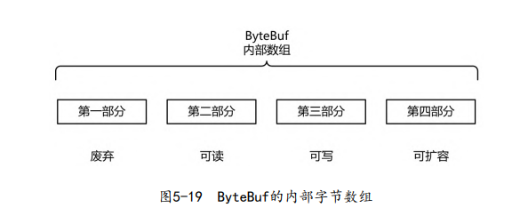

有三个关键属性定义在`AbstractByteBuf`抽象类中

- readerIndex（读指针）：指示读取的起始位置。
- writerIndex（写指针）：指示写入的起始位置。
- maxCapacity（最大容量）

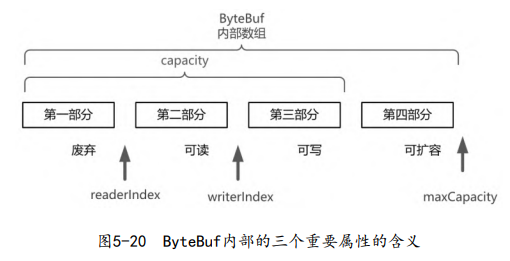

满足的约束：
$$
readerIndex \leq writerIndex \leq capacity
$$

它的方法有：

- capacity()
- maxCapacity()

有关写操作的

- isWritable()
- writableBytes()：capacity - writerIndex
- maxWritableBytes()：maxCapacity - writerIndex
- writeBytes(byte[] src)
- writeTYPE(TYPE value)，TYPE表示基础数据类型
- setTYPE(TYPE value)，并不改变writerIndex
- markWriterIndex()，把当前的写指针writerIndex属性的值保存在markedWriterIndex 属性中
- resetWriterIndex()，写指针设置为markWriterIndex

有关读操作的

- isReadable()
- readableBytes()
- readBytes(byte[] dst)
- readTYPE()
- getTYPE()，并不改变readerIndex
- markReaderIndex()
- resetReaderIndex()

Netty通过`ByteBufAllocator`分配器来创建缓冲区，并提供了两种实现：`PoolByteBufAllocator`和 `UnpooledByteBufAllocator`。

在Netty中，`ByteBufAllocator.DEFAULT`为默认分配器。该分配器可以通过`io.netty.allocator.type`系统参数进行配置，取值为："unpooled"，"pooled"。

下面来创建一个ByteBuf

~~~java
//初始容量为9、最大容量为100的缓冲区
buffer = ByteBufAllocator.DEFAULT.buffer(9, 100);

//初始容量为256、最大容量为Integer.MAX_VALUE的缓冲区
buffer = ByteBufAllocator.DEFAULT.buffer();

//方法3：非池化分配器，分配在Java堆
buffer = UnpooledByteBufAllocator.DEFAULT.heapBuffer();

//方法4：池化分配器，分配在直接内存缓冲区中
buffer = PooledByteBufAllocator.DEFAULT.directBuffer();

//方法4：池化分配器，分配在Java堆上
buffer = PooledByteBufAllocator.DEFAULT.heapBuffer()
~~~

注意，Heap可以直接获取内部数组，而无需调用`getByte`。而直接内存却不可以访问其内部数组。

~~~java
// Direct ByteBuf的hasArray()会返回false
if (heapBuf.hasArray()) {
    byte[] array = heapBuf.array();
    int offset = heapBuf.arrayOffset() + heapBuf.readerIndex();
    int length = heapBuf.readableBytes();
}
~~~

缓冲区的类型有：

- Heap
- Direct：Direct Memory的使用避免了Java堆和Native堆之间来回复制数据，但是由于本地调用，创建和销毁Direct Buffer的代价比较高昂。
- Composite

Netty的通过引用计数方式来管理ByteBuf的生命周期的，因为ByteBuf使用了池化复用技术。

ByteBuf实例的`retain()`方法将引用计数`+1`，而`release()`方法将引用计数 `-1`。如果引用计数为`0`，那么就不可以访问该`ByteBuf`（包括调用`retain()`方法），否则抛出`IllegalReferenceCountException`异常。

当ByteBuf的引用计数为0时，Netty会分情况堆ByteBuf进行回收

- 如果属于池化的ByteBuf内存，直接放回ByteBuf池中（堆或者直接内存）
- 否则
  - 如果在堆上分配的，那么JVM回收
  - 如果在直接内存的，那么调用本地方法（`unsafe.freeMemory`）来释放内存

Netty还提供了一组用于增加和减少引用计数的通用静态方法

- ReferenceCountUtil.retain(Object)
- ReferenceCountUtil.release(Object)

在处理器中，推荐调用`Context.alloc().buffer()`来创建缓冲区

~~~java
class AllocDemoHandler extends ChannelInboundHandlerAdapter {
    @Override
 	public void channelRead(ChannelHandlerContext ctx, Object msg) throws Exception {
        ByteBuf buf = ctx.alloc().buffer();
    }
}
~~~

`AbstractChannelHandlerContext`中`alloc()`的定义如下：

~~~java
public ByteBufAllocator alloc() {
 	return channel().config().getAllocator();
}
~~~

该分配器可以通过`Bootstrap`引导类来设置，也可以通过`channel.config().setAllocator()`来设置

为Netty的Reactor线程通过`AbstractNioByteChannel.NioByteUnsafe.read()`从Java NIO Channel中读数据，其源代码如下：

~~~java
public void read() {
    // 伪代码
    
    //channel的config信息
    final ChannelConfig config = config();
    
    //获取通道的缓冲区分配器
    final ByteBufAllocator allocator = config.getAllocator();
    
    final ChannelPipeline pipeline = pipeline();
    
    // 求缓冲区合适大小的组件
	final RecvByteBufAllocator.Handle allocHandle = unsafe().recvBufAllocHandle();
    
    ByteBuf byteBuf = null;
    
    try {
        do {
            byteBuf = allocHandle.allocate(allocator);
            pipeline.fireChannelRead(byteBuf);
        } while(...)
    }
    
}
~~~

这个ByteBuf会在TailContext自动释放，相关源码如下：

~~~java
public class DefaultChannelPipeline implements ChannelPipeline {
    final class TailContext extends AbstractChannelHandlerContext implements ChannelInboundHandler {
        @Override
 		public void channelRead(ChannelHandlerContext ctx, Object msg) {
 			onUnhandledInboundMessage(ctx, msg);
 		}
        
        protected void onUnhandledInboundMessage(Object msg) {
            try {
                
            } finally {
                ReferenceCountUtil.release(msg);
            }
        }
    }
}
~~~

我们可以调用基类的`super.channelRead`将ByteBuf传递下去（传播继续）：

~~~java
public class DemoHandler extends ChannelInboundHandlerAdapter {
    @Override
    public void channelRead(ChannelHandlerContext ctx, Object
    msg){
    	ByteBuf byteBuf = (ByteBuf) msg;
        
        //调用父类的入站方法，默认的动作是将msg向下一站传递，一直到末端
        super.channelRead(ctx,msg);
        
        //如果不调用super.channelRead，那么就手动释放ByteBuf
        //byteBuf.release();
    }
}
~~~

`SimpleChannelInboundHandler`可以在截断传播时，自动释放ByteBuf，它的源码如下：

~~~java
public abstract class SimpleChannelInboundHandler<I> extends ChannelInboundHandlerAdapter {
    @Override
 	public void channelRead(ChannelHandlerContext ctx, Object msg) {
        boolean release = true;
        try {
            if (acceptInboundMessage(msg)) {
            	I imsg = (I) msg;
                channelRead0(ctx, imsg);
            } else {
                release = false;
                ctx.fireChannelRead(msg);
            }
        } finally {
           	if (autoRelease && release) {
                ReferenceCountUtil.release(msg);
            }
        }
    }
}
~~~

此时，子类应该覆写`channelRead0`方法，而不是`channelRead`方法。

出站缓冲区在`HeadContext`中自动释放，相关源码如下：

~~~java
public abstract class AbstractNioByteChannel extends AbstractNioChannel {
    @Override
    protected void doWrite(ChannelOutboundBuffer in) {
        int writeSpinCount = -1;
        boolean setOpWrite = false;
        
        //死循环：发送缓冲区的数据，直到缓冲区发送完毕
		for (;;) {
            Object msg = in.current();
            if (msg instanceof ByteBuf) {
                ByteBuf buf = (ByteBuf) msg;
                int readableBytes = buf.readableBytes();
                if (readableBytes == 0) {
                    // remove()里边包含释放msg
                    in.remove();
                    continue;
                }
                int localFlushedAmount = doWriteBytes(buf);
            } else if (msg instanceof FileRegion) {
                
            } else {
                throw new Error();
            }
        }
    }
    
    @Override
	protected int doWriteBytes(ByteBuf buf) {
        final int expectedWrittenBytes = buf.readableBytes();
        // 复制数据到Java NIO通道
        return buf.readBytes(javaChannel(), expectedWrittenBytes);
    }
}
~~~

ByteBuf的`slice()`方法可以获取到一个ByteBuf的切片：

- `public ByteBuf slice()`，等价于`slice(readerIndex, readableBytes())`
- `public ByteBuf slice(int index, int length)`

该方法所返回的切片：

- readerIndex（读指针）值为0
- writerIndex（写指针）值为源ByteBuf的readableBytes()
- maxCapacity（最大容量）值为源ByteBuf的readableBytes()

注意，slice()是浅层复制，并不会改变源`ByteBuf`的引用计数

`duplicate()`也是一个浅层复制， 它返回的是整个源ByteBuf的浅复制

- Duplicate()的读写指针、最大容量值，与源ByteBuf的读写指 针相同。
- duplicate()不会改变源ByteBuf的引用计数。

## 零拷贝

零拷贝是指，减少数据从⼀个内存区域复制到另⼀个内存区域的次数。

Netty的零拷贝（Zero-Copy）主要体现在五个方面：

- CompositeByteBuf
- slice、 duplicate
- FileRegion
- byte[]与ByteBuf的转换
- Direct Memory

在 Linux 中零拷贝技术主要有 3 个实现思路：

- 用户态直接 I/O

  | 传统                                                         | 零拷贝                                                       |
  | ------------------------------------------------------------ | ------------------------------------------------------------ |
  | 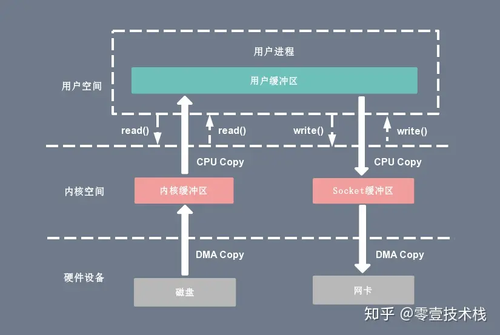 | 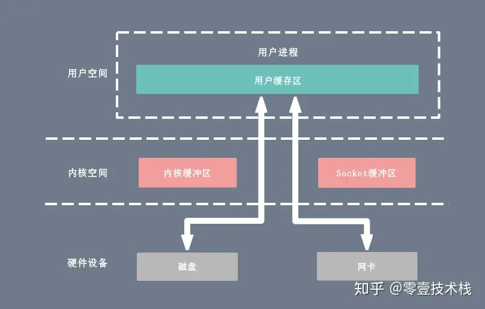 |

- 减少数据拷贝次数

  - 使用 mmap + write 代替原来的 read + write 方式

    ~~~c
    tmp_buf = mmap(file_fd, len);
    write(socket_fd, tmp_buf, len);
    ~~~

    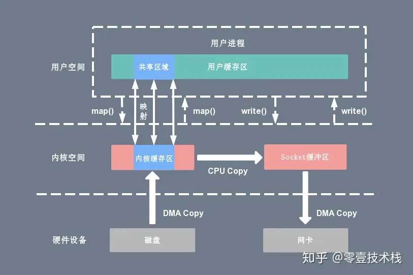

  - sendfile

    ~~~c
    sendfile(socket_fd, file_fd, len);
    ~~~

    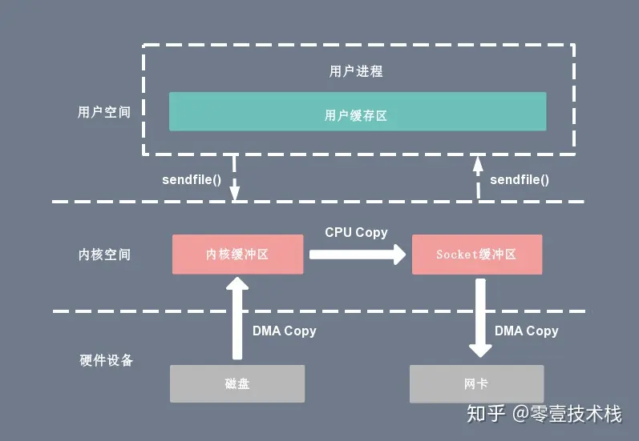

- 写时复制技术

  

NIO的零拷贝体现在：

- **内存映射文件(MappedByteBuffer)**
- **直接缓冲区(DirectByteBuffer)**
- **文件通道(FileChannel)的transferTo或transferFrom方法**

`CompositeByteBuf`可以把需要合并的多个`ByteBuf`组合起来，对外提供统一的`readIndex`和`writerIndex`。`CompositeByteBuf`里面有一个`Component`数组，聚合的 `ByteBuf`都放在`Component`数组里面，最小容量为16。

不使用**CompositeByteBuf**，将header和body合并为一个ByteBuf的代码大致如下：

~~~java
ByteBuf headerBuf = …
ByteBuf bodyBuf = …
    
long length=headerBuf.readableBytes() + bodyBuf.readableBytes()；
ByteBuf allBuf = Unpooled.buffer(length);
allBuf.writeBytes(headerBuf );		//拷贝header数据
allBuf.writeBytes(body);			//拷贝body数据
~~~

使用**CompositeByteBuf**

~~~java
ByteBuf headerBuf = …
ByteBuf bodyBuf = …
    
CompositeByteBuf compositeByteBuf = Unpooled.compositeBuffer();

compositeByteBuf.addComponents(headerBuf, bodyBuf);
~~~

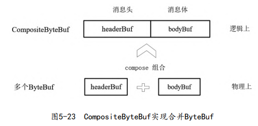

如果CompositeByteBuf内部只存在一个ByteBuf，则调用其 hasArray()方法，返回的是这个唯一实例hasArray()方法的值；如果有多个ByteBuf，则返回false。

调用`CompositeByteBuf#nioBuffer()`方法可以将 `CompositeByteBuf` 实例合并成一个新的`NIO ByteBuffer`缓冲区（使用ByteBuffer的put方法，将多个BuyteBuffer实例合在一起）

~~~java
CompositeByteBuf cbuf = Unpooled.compositeBuffer(3);
ByteBuffer nioBuffer = cbuf.nioBuffer(0, 6);
byte[] bytes = nioBuffer.array();
~~~

Unpooled提供了一系列的wrap包装方法，可以帮助大家方便、快速地包装出CompositeByteBuf实例或者ByteBuf实例，而不用进行内存拷贝。

~~~java
public static ByteBuf wrappedBuffer(ByteBuffer buffer)
public static ByteBuf wrappedBuffer(ByteBuf buffer)
public static ByteBuf wrappedBuffer(ByteBuf... buffers)
public static ByteBuf wrappedBuffer(ByteBuffer... buffers)
~~~

~~~java
public static ByteBuf wrappedBuffer(byte[] array)
public static ByteBuf wrappedBuffer(byte[] array, int offset, int length)
public static ByteBuf wrappedBuffer(byte[]... arrays)
~~~

传统方法：

~~~java
byte[] bytes = ...
ByteBuf byteBuf = Unpooled.buffer();
byteBuf.writeBytes(bytes);
~~~

零拷贝技术：

~~~java
byte[] bytes = ...
ByteBuf byteBuf = Unpooled.wrappedBuffer(bytes);
~~~

## Decoder

Netty中的解码器都是Inbound入站处理器类型。ByteToMessageDecoder是一个非常重要的解码器基类，用于完成从ByteBuf到Java POJO对象的解码功能。它根据入站包（ByteBuf），解码出一个`List<Object>`，然后将其中元素逐个送往下一站。

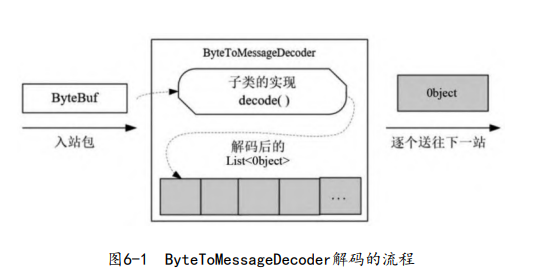

自定义一个解码器

~~~java
public class Byte2IntegerDecoder extends ByteToMessageDecoder {
    @Override
    protected void decode(
        ChannelHandlerContext channelHandlerContext,
        ByteBuf byteBuf,
        List<Object> list) throws Exception {
        while (byteBuf.readableBytes() >= 4) {
            int i = byteBuf.readInt();
            list.add(i);
        }
    }
}
~~~

这里将ByteBuf处理为了Object对象，因此该ByteBuf并不会发送到TailContext中，来完成释放引用计数。然而，基类ByteToMessageDecoder会完成ByteBuf释放工作，它会调用ReferenceCountUtil.release(in)方法将之前的ByteBuf缓冲区的引用计数减1。

可以在子类的decode()方法中调用一次ReferenceCountUtil.retain(in)来增加一次引用计数。

注册该解码器

~~~java
ChannelInitializer i= new ChannelInitializer<EmbeddedChannel>(){
    protected void initChannel(EmbeddedChannel ch) {
        ch.pipeline().addLast(new Byte2IntegerDecoder());
        ch.pipeline().addLast(new IntegerProcessHandler());
    }
};
~~~

ReplayingDecoder类是ByteToMessageDecoder的子类，它在读取ByteBuf缓冲区的数据之前，需要检查缓冲区是否有足够的字节。如果不够，那么停止解码。这省去了之前的长度判断代码。

~~~java
public class Byte2IntegerReplayDecoder extends ReplayingDecoder {
    @Override
    protected void decode(ChannelHandlerContext channelHandlerContext, ByteBuf byteBuf, List<Object> list) throws Exception {
        int i = byteBuf.readInt();
    }
}
~~~

实现原理如下：内部定义一个新的二进制缓冲区类（类名为ReplayingDecoderBuffer），又对ByteBuf缓冲区进行装饰。该装饰器的特点是，在缓冲区真正读数据之前先进行长度的判断：如果长度足够，就读取数据；否则，抛出`ReplayError`异常，导致decode结束（如果不在decode中捕获该异常），而且会截断该byteBuf的传播。ReplayingDecoder捕获到异常后会留着数据，等待下一次IO事件到来时再读取。

当一个ByteBuf发送包到达接收端后，可能已经被分成很多ByteBuf接收包。可以通过Head-Content协议格式来解决，在Head中说明包的长度，在Content中存放内容。

此外，还需要ReplayingDecoder类的state属性，它保存当前解码器所处的阶段。相关源码如下：

~~~java
public abstract class ReplayingDecoder<S> extends ByteToMessageDecoder {
    private S state;
    
    protected ReplayingDecoder(S initialState) {
        this.replayable = new ReplayingDecoderByteBuf();
        this.checkpoint = -1;
        this.state = initialState;
    }
    
    protected ReplayingDecoder() {
        this((Object)null);
    }
}
~~~

以字符串解码为例：

~~~java
public class StringReplayDecoder extends ReplayingDecoder<StringReplayDecoder.PHASE> {
    enum PHASE {
        PHASE_1,
        PHASE_2,
    }

    private int length;
    private byte[] inBytes;

    public StringReplayDecoder() {
        // 初始化状态
        super(PHASE.PHASE_1);
    }

    @Override
    protected void decode(ChannelHandlerContext channelHandlerContext, ByteBuf byteBuf, List<Object> list) throws Exception {
        switch (state()) {
            case PHASE_1 :
                // 第一阶段，获取长度
                // 这里仅仅解码出长度，而并没有调用list.add，将内容发送到下一个处理器中
                length = byteBuf.readInt();
                inBytes = new byte[length];
                checkpoint(PHASE.PHASE_2);
                break;
                
            case PHASE_2:
                byteBuf.readBytes(inBytes, 0, length);
                // 将解码出的内容发送到下一个处理器中
                list.add(new String(inBytes, "UTF-8"));
                checkpoint(PHASE.PHASE_1);
                break;
            default:
                break;
        }
    }
}
~~~

checkpoint()方法有两个作用：

~~~java
protected void checkpoint(S state) {
    this.checkpoint();		// 设置“读指针检查点”
    this.state(state);		// 设置state属性的值
}
~~~

当读数据时，一旦缓冲区可读的数据不够，ReplayingDecoderBuffer在抛出ReplayError异常之前，就会把 readerIndex 还原到读指针检查点。

可见ReplayingDecoder是有状态的，所以它应该是Channel私有的。

然而并不推荐使用ReplayingDecode来处理复杂的解析逻辑，因为

- ReplayingDecoderBuffer装饰器类并不支持所有的ByteBuf操作，对于调用不支持的ByteBuf操作，装饰器类一律抛出ReplayError异常
- 在网络条件比较糟糕时，一个数据包的解析逻辑会被反复执行多次

建议继承ByteToMessageDecoder，再以上面字符串解码为例

~~~java
public class StringIntegerHeaderDecoder extends ByteToMessageDecoder {
    @Override
    protected void decode(
        ChannelHandlerContext channelHandlerContext,
        ByteBuf byteBuf,
        List<Object> list) throws Exception {
	
        // 处理消息头
        if (byteBuf.readableBytes() < 4) {
            return;
        }

        byteBuf.markReaderIndex();
        int length = byteBuf.readInt();
        if (byteBuf.readableBytes() < length) {
            byteBuf.resetReaderIndex();
            return;
        }
        byte[] inBytes = new byte[length];
        byteBuf.readBytes(inBytes, 0, length);
        list.add(new String(inBytes, "UTF-8"));
    }
}
~~~

实际上，ByteToMessageDecoder也是有状态的，它在内部维护一个cumulation，用来保存没有解析完的二进制内容。

MessageToMessageDecoder解码器将POJO对象解码成另外一种POJO对象。它的泛型参数I指定了入站POJO的类型。一个例子：

~~~java
public class Integer2StringDecoder extends MessageToMessageDecoder<Integer> {
    @Override
    protected void decode(ChannelHandlerContext channelHandlerContext, Integer integer, List<Object> list) throws Exception {
        list.add(String.valueOf(integer));
    }
}
~~~

常用的内置Deocer：

- 固定长度数据包解码器——`FixedLengthFrameDecoder`

- 自定义长度数据包解码器—— `LengthFieldBasedFrameDecoder`

- 行分割数据包解码器——`LineBasedFrameDecoder`

  LineBasedFrameDecoder支持配置一个最大长度值，表示解码出来 的ByteBuf能包含的最大字节数。如果连续读取到最大长度后仍然没有 发现换行符，就会抛出异常。

- 自定义分隔符数据包解码器—— `DelimiterBasedFrameDecoder`

  ~~~java
  public DelimiterBasedFrameDecoder(
   	int maxFrameLength, //解码的数据包的最大长度
   	Boolean stripDelimiter, //解码后的数据包是否去掉分隔符
   	ByteBuf delimiter) //分隔符
  ~~~

  

下面重点介绍`LengthFieldBasedFrameDecoder`

~~~java
 public LengthFieldBasedFrameDecoder(
     int maxFrameLength, 	
     int lengthFieldOffset, 
     int lengthFieldLength, 
     int lengthAdjustment, 
     int initialBytesToStrip
 ) {
     // ...
 }
~~~

- `maxFrameLength`：发送的数据包的最大长度
- `lengthFieldOffset`：长度字段偏移量
- `lengthFieldLength`：长度字段所占的字节数。
- `lengthAdjustment`：长度的调整值。$内容字段偏移量-lengthFieldOffset-lengthFieldLength$
- `initialBytesToStrip`：丢弃的字节数（一般是内容字段的偏移量）

## Encoder

编码器是一个Outbound出站处理器，它将Java POJO对象编码成二进制ByteBuf，或者另一个POJO对象。

MessageToByteEncoder基类是一个很重要的Encoder类，它的泛型参数说明了要编码对象的类型。子类必须实现它的encode()抽象方法。下面自定义一个Encoder：

~~~java
public class Integer2ByteEncoder extends MessageToByteEncoder<Integer> {
    @Override
    protected void encode(
        ChannelHandlerContext channelHandlerContext, 
        Integer integer, 
        ByteBuf byteBuf) throws Exception {
        byteBuf.writeInt(integer);
    }
}

~~~

MessageToMessageEncoder编码器，一个示例：

~~~java
public class String2IntegerEncoder extends MessageToMessageEncoder<String> {
    @Override
    protected void encode(
        ChannelHandlerContext channelHandlerContext, 
        String s, 
        List<Object> list) throws Exception {
        // 基类会对这个list输出容器中的所有元素进行迭代，将列表的元素逐个发送给下一站。
    }
}

~~~

## Codec（编解码器）

Codec（编解码器）是解码器和编码器的结合，它的基类为`ByteToMessageCodec<I>`

~~~java
public class Byte2IntegerCodec extends ByteToMessageCodec<Integer> {
    @Override
    protected void encode(
        ChannelHandlerContext channelHandlerContext,
        Integer integer,
        ByteBuf byteBuf) throws Exception {

    }

    @Override
    protected void decode(
        ChannelHandlerContext channelHandlerContext,
        ByteBuf byteBuf,
        List<Object> list) throws Exception {
        
    }
}
~~~

Codec是通过继承来完成加密器和编码器的结合的，还可以通过组合来完成。

~~~java
public class IntegerDuplexHandler extends CombinedChannelDuplexHandler<Byte2IntegerDecoder, Integer2ByteEncoder> {
    public IntegerDuplexHandler() {
        super(new Byte2IntegerDecoder(), new Integer2ByteEncoder());
    }
}
~~~

