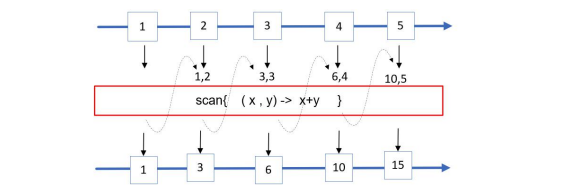
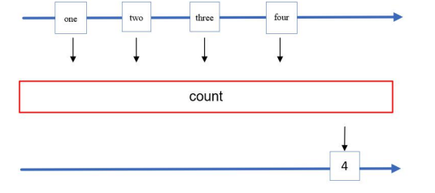
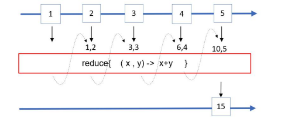
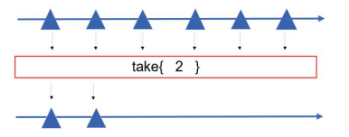
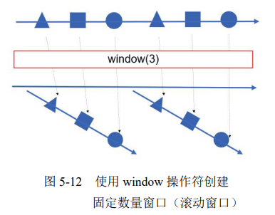
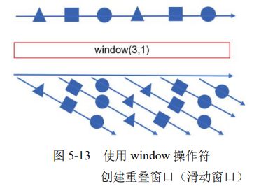

# RxJava

Maven依赖

~~~xml
<dependency>
    <groupId>io.reactivex.rxjava2</groupId>
    <artifactId>rxjava</artifactId>
    <version>2.2.0</version>
</dependency>
~~~

## 订阅发布

观察者模式：观察者向主题注册，当主题发生变化时，就会主动通知观察者。

`Observable`和`Subscriber`通过`subscribe()`方法实现订阅关系

`Observable`和`Subscriber`之间通过`emitter.onNext(…)`弹射的方式实现主题的消息发布，除了`onNext()`，还有两个特殊地通知方法：

- `onCompleted()`：表示消息序列弹射完结。
- `onError()`：表示主题的消息序列异常终止。如果Observable在事件处理过程中出异常时，弹射器的onError()方法会被触发，同时消息序列自动终止，不允许再有消息弹射出来。

注意，在一个消息序列中，弹射器的`onCompleted()`正常结束和`onError()`异常终止只能调用一个，而且它们必须是消息序列中的最后一个被发送的消息。

**注意：Observable会缓存未被消费的消息**。

~~~JAVA
@Slf4j
public class RxJavaObserverDemo {
    @Test
    public void rxJavaBaseUse() {
        Observable observable = Observable.create(
            new Action1<Emitter<String>>() {
                @Override
                public void call(Emitter<String> emitter) {
                    emitter.onNext("apple");
                    emitter.onNext("banana");
                }
            },
            Emitter.BackpressureMode.NONE
        );
        
        Subscriber<String> subscriber = new Subscriber<String>() {
            @Override
            public void onCompleted() {
                log.info("onCompleted");
            }
            @Override
            public void onError(Throwable throwable) {
                log.info("onError");
            }
            @Override
            public void onNext(String s) {
                log.info("onNext: {}", s);
            }
        };
        // 订阅完成时，就开始发送消息。而不是在创建时就发送消息
        observable.subscribe(subscriber);
    }
}
~~~

RxJava为了支持函数式编程，定义几个函数式接口。这些接口表示一个不完整的Subscriber

~~~java
public interface Action0 extends Action {
	void call();
}
~~~

~~~java
public interface Action1<T> extends Action {
	void call(T t);
}
~~~

使用示例：

~~~java
@Test
public void rxJavaActionDemo() {
    Observable observable = Observable.create(
        new Action1<Emitter<String>>() {
            @Override
            public void call(Emitter<String> emitter) {
                emitter.onNext("apple");
                emitter.onNext("banana");
            }
        },
        Emitter.BackpressureMode.NONE
    );

    Action1<String> onNextAction = new Action1<String>() {
        @Override
        public void call(String s) {
            log.info(s);
        }
    };

    Action1<Throwable> onErrorAction = new Action1<Throwable>() {
        @Override
        public void call(Throwable throwable) {
            log.info("onError,Error Info is:" + throwable.getMessage());
        }
    };

    Action0 onCompletedAction = new Action0() {
        @Override
        public void call() {
            log.info("onCompleted");
        }
    };

    log.info("第1次订阅：");
    observable.subscribe(onNextAction);

    log.info("第2次订阅：");
    observable.subscribe(onNextAction, onErrorAction);

    log.info("第3次订阅：");
    observable.subscribe(onNextAction, onErrorAction, onCompletedAction);
    
    // 这相当于
    observable.subscribe(
		s -> log.info(s),
		e -> log.info("Error Info is:" + e.getMessage()),
		() -> log.info("onCompleted弹射结束"));
}
~~~

其中，subscribe()的定义为：

~~~java
public final Subscription subscribe(
    final Action1<? super T> onNext,
    final Action1<Throwable> onError, 
    final Action0 onCompleted) {
    // ...
    // ActionSubscriber类是Subscriber接口的一个实现类
    return subscribe(new ActionSubscriber<T>(onNext, onError, onCompleted));
}
~~~

## 操作符

为了方便数据流的操作，RxJava引入了Operators操作符，它大致分为5类：

- 创建型操作符
- 过滤型操作符
- 转换型操作符
- 聚合型操作符

Observable的just操作符用于创建一个Observable主题，并且会将实参数据弹射出来。示例：

~~~java
Observable.just("hello world")
    .subscribe(s -> log.info("jst string -> " + s));
Observable.just(1, 2, 3, 4)
    .subscribe(i -> log.info("just int-> " + i));

/**
jst string -> hello world
just int-> 1
just int-> 2
just int-> 3
just int-> 4
*/
~~~

from操作符以数组、Iterable迭代器等对象作为输入，创建一个Observable主题对象，然后将实参（如数组、Iterable迭代器等）中的数据元素逐一弹射出去。

range操作符以一组整数范围作为输入，创建一个Observable主题对象并弹射该整数范围内的所有整数（左闭右闭）。

interval操作符创建一个Observable主题对象（消息流），该流会按照固定时间间隔发射整数序列（从0开始）。

~~~java
Observable
	.interval(100, TimeUnit.MILLISECONDS)
	.subscribe(aLong -> log.info(aLong.toString()));
/**
0
1
2
...
*/
~~~

just、from、range以及其他创建操作符都是在创建主题时弹射数据，而不是在被订阅的时候。而defer创建操作符所创建的主题，在创建主题时并不弹射数据，它会一直等待直到有观察者订阅它才弹射数据。

~~~java
AtomicInteger foo = new AtomicInteger(100);
Observable observable = Observable.just(foo.get());
Observable deferredObservable = Observable.defer(() -> Observable.just(foo.get()));

foo.set(200);

// 这个会输出100，因为在创建时，就会弹出消息，此时foo为100，一直被缓存者，直到有订阅者来消费。
observable.subscribe(integer -> log.info("just emit {}",
    String.valueOf(integer)));

// 这个会输出200，因为在订阅时，才会弹出消息，此时foo为200
observable.subscribe(integer -> log.info("just emit {}",
    String.valueOf(integer)));
~~~

filter操作符用于判断Observable弹射的每一个消息是否满足条件。如果满足条件，则继续向下游的观察者传递；如果不满足条件则过滤掉。

~~~java
Observable.range(1, 20)
    .filter((Integer integer) -> integer % 5 == 0)
    .subscribe(i -> log.info("filter int -> " + i));
/**
filter int -> 5
filter int -> 10
filter int -> 15
filter int -> 20
*/
~~~

distinct操作符用于在消息流中过滤掉重复的元素

map操作符接收一个转换函数，对Observable弹射的消息流的每一个元素都应用该转换函数：

~~~java
Observable.range(1, 4)
	.map(i -> i * i)
	.subscribe(i -> log.info(i.toString()));
/**
1
4
9
16
*/
~~~

flatMap对 Observable 发射的数据都应用(apply)一个函数，这个函数返回一个 Observable，然后合并这些 Observables，并且发送（emit）合并的结果

scan操作符对一个Observable流序列的每一项数据应用一个累积函数，然后将这个函数的累积结果弹射出去。除了第一项之外，scan操作符会将上一个数据项的累积结果，作为下一个数据项在应用累积函数时的输入

count操作符用来对原Observable流的数据项进行计数，最后将总数给弹射出去

reduce操作符与scan类似，但是它只弹出最后的结果

take操作符挑选原流上的n个元素

## 调度器

`Scheduler`类是用来对RxJava流操作进行调度，从`Schedulers`可以获取现有调度器实现:

- Schedulers.io()：获取内部的ioScheduler调度器实例，主要用于IO密集型的流操作。采用了池化技术，线程数无上限。
- Schedulers.newThread()：每执行一个RxJava流操作就创建一个新的线程。
- Schedulers.computation()：线程池固定大小为CPU的核数
- Schedulers.trampoline()：在调用线程中执行任务。保证其上提交的任务按照提交的顺序执行
- Schedulers.single()：在内部的单例线程中执行任务。保证其上提交的任务按照提交的顺序执行

RxJava提供了两个方法来改变流操作的调度器：

- subscribeOn()：主要改变的是弹射的线程。
- observeOn()：主要改变的是订阅的线程。

~~~java
observable
	//使用具有线程缓存机制的可复用线程
	.subscribeOn(Schedulers.io())
	//每执行一个任务就创建一个新的线程
	.observeOn(Schedulers.newThread())
	.subscribe(s -> {
		log.info("consumer ->" + s);
	});
~~~

## 背压

如果上游弹射数据的速度快于下游接收处理数据的速度，这样对于那些没来得及处理的数据，就会积压在缓存池中。如果缓存池中的数据一直得不到处理，越积越多，最后就会造成内存溢出。这便是背压问题。

可以在创建Observable对象时，设置背压模式：

- BackpressureMode.NONE：不使用背压
- BackpressureMode.ERROR：不使用背压，会抛出MissingBackpressureException异常。
- BackpressureMode.BUFFER
- BackpressureMode.DROP：Observable主题使用固定大小为1的缓冲区。如果下游订阅者无法处理，则流的第一个元素会缓存下来，后续的会被丢弃。
- BackpressureMode.LATEST：与BackpressureMode.DROP，但保留的是最近一次弹出的

