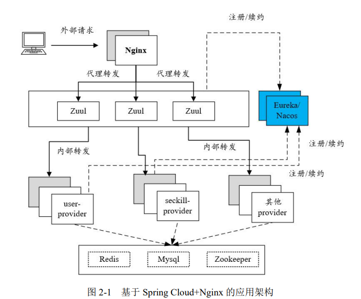
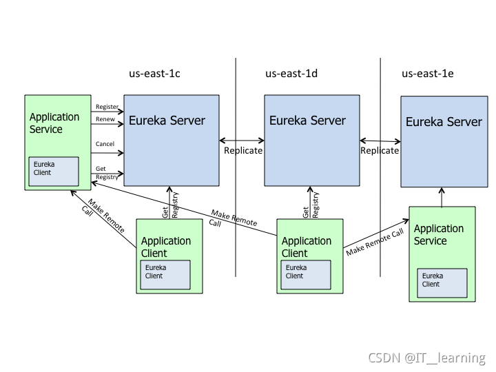
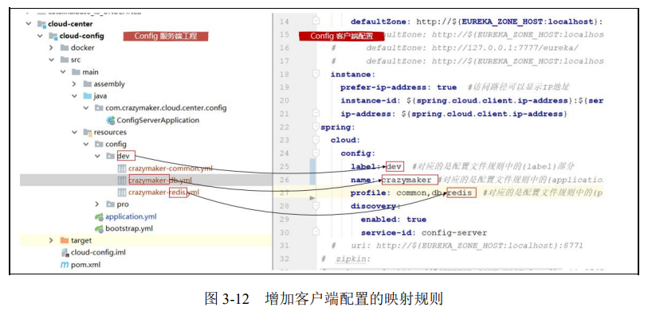
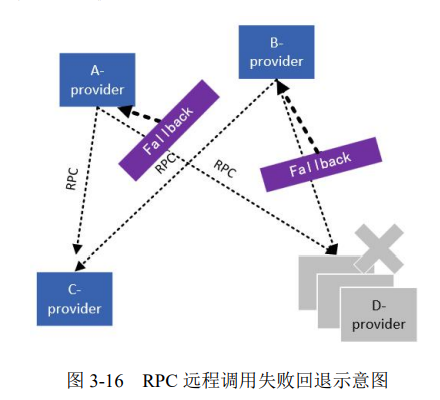
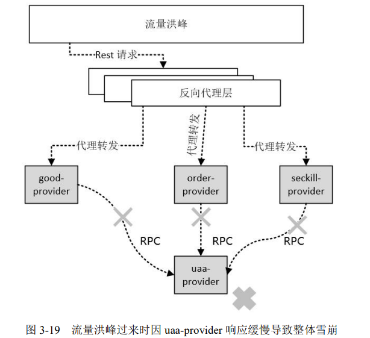
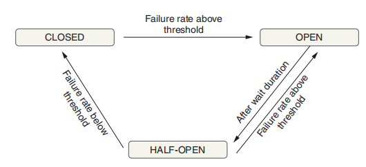
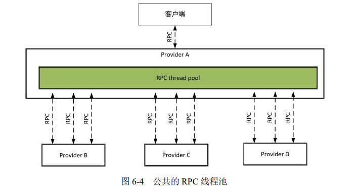
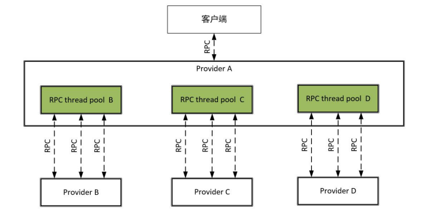

# Spring Cloud

[TOC]

Spring Cloud 微服务开发所涉及的中间件

- ZooKeeper
- Redis
- Eureka，Netflix开发的服务注册和服务发现框架
- Spring Cloud Config
- Zuul，Netflix开发的网关框架
- Nginx
- ...

## Eureka 服务注册与发现

从宏观角度，微服务架构下的系统角色可以简单分为**服务注册中心（Registration Center）**、**微服务提供者（Service Provider）**。其中，Provider的子组件有「注册中心客户端组件」以及「远程客户端组件」。

**服务注册**是指，微服务提供者将自己的服务信息（如服务名、IP地址等）告知服务注册中心。

**服务发现**是指，注册中心客户端组件从注册中心查询所有的微服务提供者信息，当其他的服务下线后，服务注册中心能够告知注册中心客户端组件。

注册中心的主要功能如下：

1. 服务注册表维护
2. 服务健康检查

微服务提供者的主要功能如下：

1. 服务注册
2. 心跳续约
3. 健康状况查询（其他Provider查询自己）

微服务提供者的服务注册和心跳续约，一般都会通过「注册中心客户端组件」来完成。另外，注册中心客户端组件还提供以下功能：

1. 服务发现：从注册中心查询可用Provider实例清单。
2. 实例缓存：将从注册中心查询到的Provider实例清单缓存到本地

如何创建一个注册中心？

1. Maven依赖：

   ~~~xml
   <dependency>
       <groupId>org.springframework.cloud</groupId>
       <artifactId>spring-cloud-starter-netflix-eureka-server</artifactId>
   </dependency>
   ~~~

2. 在启动类中添加注解@EnableEurekaServer，声明这个应用是一个Eureka Server

   ~~~java
   @EnableEurekaServer
   @SpringBootApplication
   public class EurekaServerApplication {
       public static void main(String[] args) {
       	SpringApplication.run(EurekaServerApplication.class, args);
       }
   }
   ~~~

3. 配置文件的编写

   ~~~yaml
   server:
   	port: 7777
   spring:
   	application:
   		name: eureka-server
   eureka:
   	client:
   		register-with-eureka: false
   		fetch-registry: false
   		service-url:
   			#服务注册中心的配置内容，指定服务注册中心的位置
   			defaultZone: ${SCAFFOLD_EUREKA_ZONE_HOSTS:http://localhost:7777/eureka/}
       instance:
           hostname: ${EUREKA_ZONE_HOST:localhost}
       server:
           enable-self-preservation: true # 开启自我保护
           eviction-interval-timer-in-ms: 60000 # 扫描失效服务的间隔时间（单位为毫秒，默认是60×1000毫秒，即60秒）
   ~~~

   作为服务注册中心角色的配置

   - `eureka.server.enable-self-preservation`：Eureka Server会定时统计15分钟之内心跳成功的Provider实例的比例，如果低于85%将会触发保护机制，处于保护状态的Eureka Server不剔除失效的微服务提供者。enable-self-preservation的默认值为true，表示开启自我保护机制。自我保护模式是一种应对网络异常的安全保护措施。它的架构哲学是宁可同时保留所有微服务（健康的微服务和不健康的微服务都会保留），也不盲目注销任何健康的微服务。这可以让Eureka集群更加健壮、稳定。
   - `eureka.server.eviction-interval-timer-in-ms`：配置Eureka Server清理无效节点的时间间隔，默认为60000毫秒（即60秒）。但是，如果EurekaServer处于保护状态，此配置就无效。

   作为微服务提供者的配置项

   （一个服务可以对应多个实例）
   
   - `eureka.instance.hostname`：设置当前实例的主机名称。（要正确的解析出IP地址）
   - `eureka.instance.appname`：设置当前实例的名称。默认值为spring.application.name配置项，而且 spring.application.name 的优先级比它高
   - `eureka.instance.instance-id`：此项用于设置当前实例的ID。默认格式如下，`${spring.cloud.client.hostname}:${spring.application.name}:${server.port}}`。
   - `eureka.instance.ip-address`：设置当前实例的IP地址。
   - `eureka.instance.prefer-ip-address`：在该项为true的情况下，如果同时设置了eureka.instance.ip-address选项，就使用ip-address选项所配置的IP，否则自动获取网卡的IP地址。如果配置为true，就使用IP地址来定位该Provider实例，否则使用主机名来定位该Provider实例。
   - `eureka.instance.lease-renewal-interval-in-seconds`：定义Provider实例到注册中心续约（心跳）的时间间隔，单位为秒，默认值为30秒。（微服务提供者设置）
   - `eureka.instance.lease-expiration-duration-in-seconds`：定义Provider实例失效的时间，单位为秒，默认值为90秒。（微服务提供者设置）
   - `eureka.instance.status-page-url-path`
   - `eureka.instance.status-page-url`
   - `eureka.instance.health-check-url-path`
   - `eureka.instance.health-check-url`
   - `eureka.instance.metadata-map.zone`：微服务提供者所属的Zone

   作为 Eureka Client 注册中心客户端角色的配置

   - `eureka.client.register-with-eureka`：表示是否将自己注册到其他的Eureka Server，默认为true。注册中心设置为false即可

   - `eureka.client.region`：客户端实例所在的 Region

   - `eureka.client.fetch-registry`：是否从Eureka Server获取注册信息，默认为true。如果为false，那么 Eureka 客户端将不会从 Eureka 服务器拉取服务注册信息。注册中心设置为false即可。

   - `eureka.client.registery-fetch-interval-seconds`：从Eureka Server获取注册信息的间隔时间，单位为秒，默认值为30秒。

   - `eureka.client.eureka-server-connect-timeout-seconds`：Eureka Client组件连接Eureka Server的超时时间，单位为秒，默认值为5秒。

   - `eureka.client.eureka-server-read-timeout-seconds`：Eureka Client组件读取Eureka Server信息的超时时间，单位为秒，默认值为8秒。

   - `eureka.client.eureka-connection-idle-timeout-seconds`：关闭Eureka Client组件到Eureka Server空闲连接的时间，单位为秒，默认值为30秒。

   - `eureka.client.filter-only-up-instances`：从Eureka Server获取Provider实例清单时是否进行过滤，只保留UP状态的实例，默认值为true。

   - `eureka.client.serviceUrl.*`：类型为HashMap，key为Zone，Value为在机房中的每个注册中心的地址。
   
     ~~~yaml
     client:
     	region: 'Beijing' #指定Region区域为北京
     	availabilityZones:
     		Beijing: 'zone-2,zone-1' #指定北京的机房为zone-2,zone-1
     	serviceUrl:
     		zone-1: http://localhost:7777/eureka/ # zone-1机房的Eureka Server
     		zone-2: http://localhost:7778/eureka/ # zone-2机房的Eureka Server
     ~~~

     如果`prefer-same-zone-eureka`为false，则从serviceUrl依次开始注册，直到第一个注册成功；否则从availability-zones开始依次注册，直到第一个注册成功。

     Region可以理解为服务器所在的地域，Zone可以理解成服务器所处的机房。负载均衡组件Spring Cloud Ribbon的默认策略是优先访问同客户端处于同一个Zone中的服务端实例，只有当同一个Zone中没有可用服务端实例时，才会访问其他Zone中的实例。

     如果Eureka Server加入了安全验证，则注册中心的URL格式为：

     `http://<username>:<password>@localhost:8761/eureka ` 。

     其中`<username>`为安全校验的用户名，`<password>`为该用户的密码

   - `eureka.client.service-url.defaultZone`

   - `eureka.client.healthcheck.enabled`，此项在Client注册一个EurekaHealthCheckHandler健康检查处理器实例，该处理器会将磁盘空间状态（DiskSpaceHealthIndicator）、Hystrix健康状态（HystrixHealthIndicator）等多个维度的健康指标通过心跳发送到Eureka Server。如果没有注册EurekaHealthCheckHandler，Provider实例的运行状况由默认的HealthCheckHandler实例确定，只要应用程序正在运行，默认的HealthCheckHandler始终发送UP状态到Eureka Server。
   
   

如何创建一个Provider

1. Maven依赖

   ~~~xml
   <dependencies>
       <!--Spring Boot Web服务组件 -->
       <dependency>
       	<groupId>org.springframework.boot</groupId>
       	<artifactId>spring-boot-starter-web</artifactId>
       </dependency>
   	<!-- Eureka Client组件 -->
       <dependency>
       	<groupId>org.springframework.cloud</groupId>
       	<artifactId>spring-cloud-starter-netflix-eureka-client</artifactId>
       </dependency>
   </dependencies>
   ~~~

2. 在Spring Boot应用的启动类上，添加@EnableDiscoveryClient注解

   ~~~java
   @SpringBootApplication
   @EnableEurekaClient
   public class UAACloudApplication {
       public static void main(String[] args) {
       	SpringApplication.run(UAACloudApplication.class, args);
       }
   }
   ~~~

3. 配置文件

   ~~~yaml
   spring:
   	application:
   		name: uaa-provider
   		
   eureka:
   	instance:
   		instance-id: ${spring.cloud.client.ip-address}:${server.port}
   		ip-address: ${spring.cloud.client.ip-address}
   		prefer-ip-address: true #访问路径优先使用IP地址
   		status-page-url-path: /${server.servlet.context-path}${management.endpoints.web.base-path}/info
   		health-check-url-path:	/${server.servlet.context-path}${management.endpoints.web.base-path}/health
   	client:
   		egister-with-eureka: true #注册到eureka服务器
   		fetch-registry: true #是否去注册中心获取其他服务
   		serviceUrl:
   			defaultZone: http://${EUREKA_ZONE_HOST:localhost}:7777/eureka/
   ~~~

   

节点之间通过配置项 serviceUrl 来相互注册，从而形成一个集群。集群的形成具有传递性，但是推荐还是在 serviceUrl 写全每一个注册中心的地址。

Eureka Server提供了多个与 Provider Instance 相关的Spring上下文应用事件（ApplicationEvent）：

- EurekaInstanceRenewedEvent：服务续约事件
- EurekaInstanceRegisteredEvent：服务注册事件
- EurekaInstanceCanceledEvent：服务下线事件
- EurekaRegistryAvailableEvent：Eureka注册中心启动事件
- EurekaServerStartedEvent：Eureka Server启动事件

使用示例：

~~~java
@Component
@Slf4j
public class EurekaStateChangeListner {
    // 服务下线事件
    @EventListener
    public void listen(EurekaInstanceCanceledEvent event){
    	log.info("{} \t {} 服务下线", event.getServerId(),event.getAppName());
    }
    
    // 服务上线事件
    @EventListener
    public void listen(EurekaInstanceRegisteredEvent event){
    	InstanceInfo inst = event.getInstanceInfo();
    	log.info("{}:{} \t {} 服务上线",inst.getIPAddr(),inst.getPort(),inst.getAppName());
    }
    
    // 服务续约(服务心跳)事件
    @EventListener
    public void listen(EurekaInstanceRenewedEvent event){
    	log.info("{} \t {} 服务续约",event.getServerId(),event.getAppName());
    }
    
    @EventListener
    public void listen(EurekaServerStartedEvent event){
    	log.info("Eureka Server启动");
    }
}
~~~

Eureka Server仅记录Provider部分健康信息。在EurekaClient组件所查询到的Provider提供者注册清单中，包含每个Provider的健康状况的检查地址。通过该健康状况的地址可以查询Provider提供者的健康状况。

在Eureka Server响应的Provider详细信息中，有3个与Provider实例的健康状态有关的信息：

- status
- healthCheckUrl：默认为Spring Boot Actuator中health端点
- statusPageUrl：默认为Spring Boot Actuator中info端点

可以通过`status-page-url-path`和`health-check-url-path`来修改URL

## 配置中心

Spring Cloud Config配置中心涉及两个部分：

- config-server：服务端配置
- config-client：客户端配置

首先构建config-server：

1. Maven依赖

   ~~~xml
   <dependency>
       <groupId>org.springframework.cloud</groupId>
       <artifactId>spring-cloud-config-server</artifactId>
   </dependency>
   ~~~

2. 在启动类上添加@EnableConfigServer注解

   ~~~java
   @EnableConfigServer
   @SpringBootApplication
   public class Application {
   	public static void main(String[] args) {
   		new SpringApplicationBuilder(Application.class).web(true).run(args);
   	}
   }
   ~~~

3. 配置文件`bootstrap.yaml`

   ~~~yaml
   server:
   	port: 7788 #配置中心端口
   spring:
   	application:
   		name: config-server #服务名称
   profiles:
   	active: native #设置读取本地配置文件
   cloud:
   	config:
   		server:
       		native:
   				searchLocations: classpath:config/ #申明本地配置文件的存放位置
   ~~~

   在配置路径下，以`{label}/{application}-{profile}.properties`指定配置文件

Config配置中心启动之后，可以使用以下的地址格式直接访问加载好的配置属性：`http://${CONFIG-HOST}: ${CONFIG-PORT}/{application}/{profile}[/{label}] `

构建config-client

1. Maven依赖

   ~~~xml
   <dependencies>
   ...
       <dependency>
       	<groupId>org.springframework.cloud</groupId>
           <artifactId>spring-cloud-starter-config</artifactId>
       </dependency>
       <dependency>
       	<groupId>org.springframework.cloud</groupId>
       	<artifactId>spring-cloud-starter-eureka</artifactId>
       </dependency>
   </dependencies>
   ~~~

2. 在`bootstrap.properties`中，按照以下配置来设置

   ~~~yaml
   spring.cloud.config.label: dev #对应服务器端规则中的{label}部分
   spring.application.name: crazymaker #对应服务器端规则中的{application}部分
   spring.cloud.config.profile: redis #对应服务器端规则中的{profile}部分
   spring.cloud.config.uri: http://${CONFIG-HOST}:7788/ #配置中心config-server的uri地址
   ~~~

   

如果是与Eureka的客户端配合使用，那么建议开启配置服务的自动发现机制。配置中心的两种发现机制（`spring.cloud.config.uri`和`Eureka`）不能同时存在，二者选其一即可。

~~~yaml
server:
  port: 9999
spring:
  application:
    name: config-server #服务名称
  cloud:
    config:
      server:
        git:
          uri: http://admin@127.0.0.1:10001/r/SpringCloud/config_server.git
          username: admin
          password: admin
 
#接入到eureka 注册中心上
eureka:
  client:
    register-with-eureka: true
    fetch-registry: true
    service-url:
      defaultZone: http://eureka1.com:9000/eureka/
  instance:
    prefer-ip-address: true #使用ip进行注册
    instance-id: ${spring.cloud.client.ip-address}:${server.port} #向注册中心注册服务ID
~~~

然后修改客户端的配置文件：
~~~yaml
spring:
  cloud:
    config:
      name: application #对应git上文件名的前部分
      profile: prd #git 上配置文件名的后部分
      label: master #git分支
      #uri: http://127.0.0.1:9999
      
      # 通过注册中心获取配置中心配置
      discovery:
        enabled: true # 开启服务发现
        service-id: config-server #配置中心的服务名称
eureka:
  client:
    fetch-registry: true
    register-with-eureka: true
    service-url:
      defaultZone: http://eureka1.com:9000/eureka/
  instance:
    prefer-ip-address: true
    instance-id: ${spring.cloud.client.ip-address}:${server.port}
~~~

## RPC

在Spring Cloud生态中，微服务提供者Provider之间的远程调用是通过Feign+Ribbon+Hystrix组合完成的：Feign用于完成RPC远程调用的代理封装；Ribbon用于在客户端完成各远程目标服务实例之间的负载均衡；Hystrix用于完成自动熔断降级等多个维度的RPC保护。

通过RestTemplate模板组件，可以很方便地访问REST服务

~~~java
public class UaaCallController {
    @Resource
	private RestTemplateBuilder restTemplateBuilder;
    
    public RestOut<JSONObject> remoteCallV1() {
        String url = "http://crazydemo.com:7702/uaa-provider/api/user/detail/v1?userId=1";
        RestTemplate restTemplate = restTemplateBuilder.build();
        ResponseEntity<String> responseEntity = restTemplate.getForEntity(url, String.class);
        // ...
    }
}
~~~

Feign是在RestTemplate基础上封装的

1. 添加Maven依赖

   ~~~xml
   <dependency>
   	<groupId>org.springframework.cloud</groupId>
   	<artifactId>spring-cloud-starter-openfeign</artifactId>
   </dependency>
   ~~~

2. 添加@EnableFeignClient

   ~~~java
   @EnableFeignClients
   public class UserCloudApplication {
   	public static void main(String[] args) {
   		SpringApplication.run(UserCloudApplication.class, args);
   	}
   }
   ~~~

3. 编写声明式接口

   ~~~~java
   @FeignClient(value = "seckill-provider", path = "/api/demo/")
   public interface DemoClient { 
       @GetMapping("/hello/v1")
       @Headers({"Content-Type: application/json;charset=UTF-8", "Authorization: {token}"})
   	Result<JSONObject> hello();
       
       @RequestMapping(value = "/echo/{word}/v1", method = RequestMethod.GET)
       @Headers({"Content-Type: application/json;charset=UTF-8", "Authorization: {token}"})
   	Result<JSONObject> echo(@PathVariable(value = "word") String word);
   }
   ~~~~

   `value` 参数通常用于指定要请求的微服务的名称。而在 Eureka 中，微服务的名称通常通过 `spring.application.name` 这个配置项来设定。

   使用`path`指定接口的URL前缀

4. 调用声明式接口

   ~~~java
   public class DemoController {
   //注入 @FeignClient注解所配置的客户端实例
   	@Resource
   	DemoClient demoClient;
       
       public Result<JSONObject> hello() {
   		Result<JSONObject> result = demoClient.hello();
   		JSONObject data = new JSONObject();
   		data.put("remote", result);
   		return Result.success(data).setMsg("操作成功");
   	}
   }
   ~~~

   

## Ribbon

一般的负载均衡的方案分为以下两种：

1. 服务端负载均衡
2. 客户端负载均衡：客户端自己维护一份从注册中心获取的Provider列表清单，根据自己配置的Provider负载均衡选择算法，在客户端进行请求的分发。Ribbon就是一个客户端的负载均衡开源组件。

Maven依赖：

~~~xml
<dependency>
	<groupId>org.springframework.cloud</groupId>
	<artifactId>spring-cloud-starter-netflix-ribbon</artifactId>
</dependency>
~~~

这样在调用RPC时（Feign），自动进行负载均衡

Ribbon负载均衡策略有：

1. 随机策略（RandomRule）
2. 线性轮询策略（RoundRobinRule）
3. 响应时间权重策略（WeightedResponseTimeRule）
4. 最少连接策略（BestAvailableRule）
5. 重试策略（RetryRule）
6. 可用过滤策略（AvailabilityFilteringRule）
7. 区域过滤策略（ZoneAvoidanceRule）

对所有微服务的配置

~~~yaml
ribbon:
	ConnectTimeout: 30000 #连接超时时间，单位为毫秒
	ReadTimeout: 30000 #读取超时时间，单位为毫秒
	
	MaxAutoRetries: 1 # 同一个实例的最大重试次数，不包括首次调用，默认为1次
	MaxAutoRetriesNextServer: 1 # 重试其他实例的最大重试次数，不包括首次调用，默认为0次
	OkToRetryOnAllOperations: true # 如果 OkToRetryOnAllOperations 设置为 false，那么只有在安全的情况或者是幂等的情况下（比如GET请求）才会进行重试。在其它的可能导致服务器状态改变的操作中（如POST，PUT，DELETE等），则不会尝试重试。
	ServerListRefreshInterval: 2000 #从注册中心刷新Provider的时间间隔，默认为2000毫秒，即2秒
	retryableStatusCodes: 400,401,403,404,500,502,504 # 对特定的HTTP响应码进行重试
	NFLoadBalancerRuleClassName: com.netflix.loadbalancer.RetryRule #负载均衡配置为重试策略
~~~

可以对某个微服务Provider进行配置：

~~~yaml
uaa-provider: # 服务名为uaa-provider
	ribbon:
		MaxAutoRetries: 1
~~~

还可以通过代码的方式来配置Ribbon

~~~java
@Configuration
public class FeignConfiguration implements RequestInterceptor {
    @Override
    public void apply(RequestTemplate template) {
    	// 从用户请求的上下文属性获取用户令牌
    	ServletRequestAttributes attributes = (ServletRequestAttributes) RequestContextHolder.getRequestAttributes();

    	if (null == attributes) 
    		return;
    	
        HttpServletRequest request = attributes.getRequest();
        String token = request.getHeader(SessionConstants.AUTHORIZATION_HEAD);
        
        if (null != token) {
            token = StringUtils.removeStart(token, "Bearer ");
            template.header("token ", new String[]{token});
        }
    }
    
    @Bean
	public IRule ribbonRule() {
		// 配置为线性轮询策略
		return new RoundRobinRule();
	}

}
~~~

注册：

~~~java
@EnableFeignClients(defaultConfiguration = FeignConfiguration.class)
public class DemoCloudApplication {
    
}
~~~

~~~java
@FeignClient(value = "uaa-provider",
	configuration = FeignConfiguration.class,
	fallback = UserClientFailBack.class,
	path = "/uaa-provider/api/user")
public interface UserClient {
    
}
~~~

## Hystrix

Maven依赖：

~~~xml
<dependency>
	<groupId>org.springframework.cloud</groupId>
	<artifactId>spring-cloud-starter-netflix-hystrix</artifactId>
</dependency>
~~~

~~~yaml
feign:
	hystrix:
		enabled: true #开启Hystrix对Feign的支持
~~~

~~~java
@EnableHystrix
public class DemoCloudApplication {
    
}
~~~

设置RPC调用的回退逻辑的两种方式：

- Fallback回退处理类

  ~~~java
  @Component
  public class UserClientFallback implements UserClient{
  	@Override
  	public RestOut<UserDTO> detail(Long id) {
  		return RestOut.error("failBack：user detail rest服务调用失败" );
  	}
  }
  ~~~

  ~~~java
  @FeignClient(value = "uaa-provider",
  	configuration = FeignConfiguration.class,
  	fallback = UserClientFallback.class, // 配置回退处理类
  	path = "/uaa-provider/api/user")
  public interface UserClient {
  	@RequestMapping(value = "/detail/v1", method = RequestMethod.GET)
  	RestOut<UserDTO> detail(@RequestParam(value = "userId") Long userId);
  }
  ~~~

  

- FallbackFactory回退处理工厂类，比起Fallback类，它可以获取异常原因

  ~~~java
  @Component
  public class UserClientFallbackFactory implements FallbackFactory<UserClient> {
      @Override
  	public UserClient create(final Throwable cause) { 
          log.error("RPC异常了，回退!", cause);
          
          // 返回FeignClient注解的匿名类
  		return new UserClient() {
  			@Override
  			public RestOut<UserDTO> detail(Long userId) {
  				return RestOut.error("FallbackFactory fallback：user detail rest服务调用失败" );
  			}
  		};
  	}
  }
  ~~~

  ~~~java
  @FeignClient(
      value = "uaa-provider",
  	fallbackFactory = UserClientFallbackFactory.class) //配置回退处理工厂类
  
  public interface UserClient {
  	RestOut<UserDTO> detail(@RequestParam(value = "userId") Long userId);
  }
  ~~~

由于Provider与Provider之间的依赖，故障会沿请求调用链向上传递，会对整个系统造成瘫痪，这就是故障的“雪崩”效应。

通过熔断器模型，我们可以缓解雪崩问题。其工作原理是，统计最近RPC调用发生错误的次数，然后决定是继续调用RPC，还是快速地失败回退。熔断器的3种状态如下：

- 关闭（closed）：熔断器关闭状态，这也是熔断器的初始状态，此状态下RPC调用正常放行。
- 开启（open）：失败比例到一定的阈值之后，熔断器进入开启状态。此状态下RPC将会执行失败回退逻辑。
- 半开启（half-open）：在打开一定时间之后（睡眠窗口结束），熔断器进入半开启状态，小流量尝试进行RPC调用放行。如果尝试成功则熔断器变为关闭状态，RPC调用正常；如果尝试失败则熔断器变为开启状态，RPC调用快速失败。

相关配置文件：

~~~yaml
hystrix:
	...
	command:
		default:
			...
				circuitBreaker: #熔断器相关配置
					enabled: true #是否使用熔断器，默认为true
					requestVolumeThreshold: 20 
					sleepWindowInMilliseconds: 5000 # 打开后允许一次尝试的睡眠时间，默认配置为5秒
					errorThresholdPercentage: 50 # 窗口时间内熔断器开启的错误比例,默认配置为50
				metrics:
					rollingStats:
						timeInMilliseconds: 10000 #滑动窗口时间
						numBuckets: 10 #滑动窗口的时间桶数
~~~

- `hystrix.command.default.circuitBreaker.enabled`
- `hystrix.command.default.circuitBreaker.requestVolumeThreshold`：触发熔断的最少失败次数。如果设置为20，那么当一个滑动窗口时间内（比如10秒）收到19个请求，即使19个请求都失败，熔断器也不会打开变成open状态。
- `hystrix.command.default.circuitBreaker.errorThresholdPercentage`：
- `hystrix.command.default.circuitBreaker.sleepWindowInMilliseconds`：熔断器打开之后过多长时间才允许一次请求尝试执行，默认值为5000毫秒，表示当熔断器打开后，5000毫秒内会拒绝所有请求，5000毫秒后熔断器才会进行入half-open状态。
- `hystrix.command.default.circuitBreaker.forceOpen`
- `hystrix.command.default.metrics.rollingStats.timeInMilliseconds`：若滑动窗口时间内的错误率超过阈值，则熔断器进入开启状态。滑动窗口将被进一步细分为时间桶（bucket），滑动窗口的统计值等于窗口内所有时间桶的统计信息的累加，每个时间桶的统计信息包含请求的成功（success）、失败（failure）、超时（timeout）、被拒（rejection）的次数。
- `hystrix.command.default.metrics.rollingStats.numBuckets`：

以上有关Hystrix熔断器的配置选项使用的是hystrix.command.default前缀，这些默认配置项将对项目中所有Feign RPC接口生效。如果想对特定的Feign RPC做配置，那么配置项前缀的格式如下：`hystrix.command.类名#方法名（参数类型列表）`

假设所有的RPC调用都从同一个线程池中获取线程。那么某个性能较低的微服务的RPC调用，必定占用线程资源，而其他RPC往往需要等待线程资源的释放。

为了最大限度地减少Provider之间的相互影响，应当为不同的微服务设置不同的线程池。这便是舱壁模式——保护有限的系统资源不被耗尽。

一般来说，RPC线程与Web容器的IO线程也是需要隔离的。

Hystrix提供了两种RPC隔离方式：线程池隔离和信号量隔离

