# Web

[TOC]

## Web架构

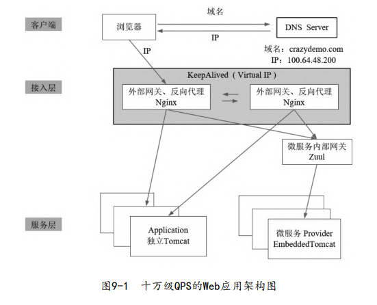

- 服务层
  - 通过Tomcat集群部署的向外提供服务
  - 使用微服务，并通过内部网关向外提供统一的访问服务。
- 接入层：使用Nginx来做反向代理。此外接入层主要完成鉴权、限流、反向代理和负载均衡等功能

可以使用DNS服务器的负载均衡机制，对接入层做横向扩展，但是它有两个缺点：

- 通常无法动态调整主机地址权重
- DNS服务器通常会缓存查询响应。在某台主机宕机的情况下，即使第一时间移除服务器IP也无济于事。

推荐引入LVS（Linux Virtual Server），对Nginx进行横向扩展（接入层的负载均衡）。同时，使用KeepAlived来实现LVS的健康监控以及热备切换。

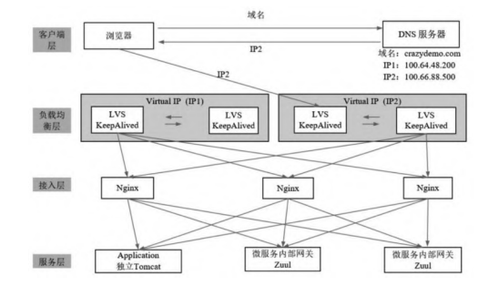

LVS和Nginx都具备负载均衡的能力，它们的区别是Nginx主要用于第四层（传输层）、第七层（应用层）的负载均衡。而LVS主要用于第二层（数据链路层）、第四层的负载均衡。注：这里是OSI网络层次模型

LVS的转发分为NAT模式和DR模式

- DR（Direct Route）模式：它属于第二层的负载均衡。DR模式下需要LVS和RS集群 绑定在同一个IP上。一个请求过来时，LVS只需要将网络帧的MAC地址修改为某一台RS的MAC即可。当RS返回响应时，只要直接向源IP 返回即可，不再经过LVS转发。这样避免负载均衡服务器的带宽成为系统瓶颈。

  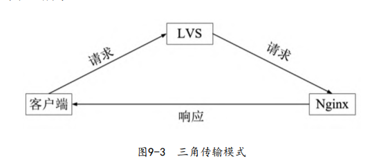

- NAT（Network Address Translation）模式，是一种网络地址转换技术。当包到达LVS时，LVS需要做目标地址转换（DNAT）：将目标IP改为RS的IP。RS处理完返回响应时，这时LVS需要做源地址转换（SNAT），将包的源地址改为LVS的IP

微服务 Provider（服务节点）通过RPC来相互通信

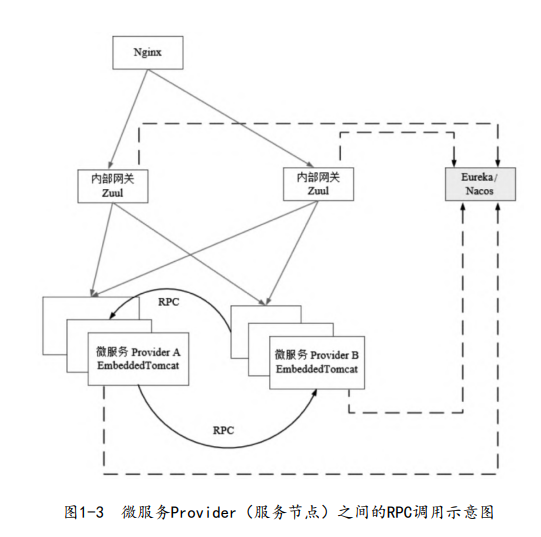

## HTTP

### 基础

HTTP（Hyper Text Transfer Protocol，超文本传输协议）是无状态的应用层协议。

请求报文的格式

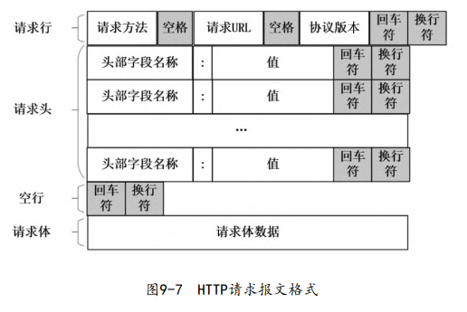

请求方法有：GET、POST、PUT、DELETE、PATCH、HEAD、OPTIONS、TRACE

常见的请求头字段：

- Accept：客户端可接受的MIME类型

- Accept-Charset：客户端可接受的字符集

- Accept-Encoding：客户端能够支持的压缩方式

- Accept-Language：客户端所希望的语言种类

- Authorization：用于设置用户身份信息，用于认证

- Content-Length：表示请求消息正文的长度

-  Host：指定请求资源的主机和端口号

- If-Modified-Since：the server sends back the requested resource, with a [`200`](https://developer.mozilla.org/en-US/docs/Web/HTTP/Status/200) status, only if it has been last modified after the given date. If the resource has not been modified since, the response is a [`304`](https://developer.mozilla.org/en-US/docs/Web/HTTP/Status/304) without any body;

- Referer：表示用户从该URL代表的页面，来访问当前请求的页面。主要用于防盗链

- Cookie

- Pragma：值为“no-cache”，表示服务器必须返回一个刷新后的文档。如果是代理服务器，那么它要刷新缓存的资源。

- Connection：决定请求完成后是断开连接，还是继续保持连接

- Range：用于请求URL资源的部分内容，单位是byte（字节）。如果服务端支持分批下载，那么服务器会返 回状态码206（Partial Content）以及该部分内容。如果服务器不支 持分批下载，那么服务器会返回整个资源的大小以及状态码200。

  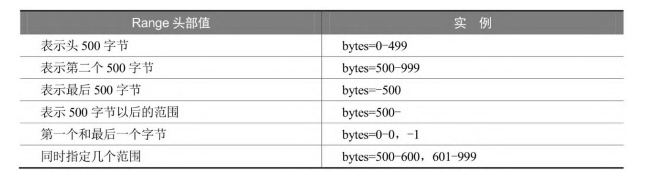

响应报文的格式

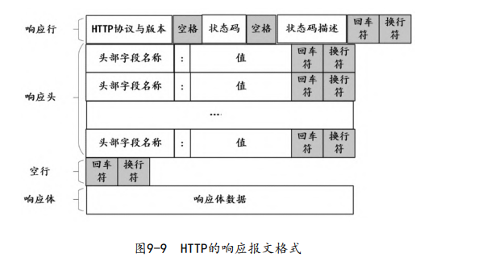

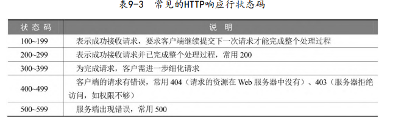

- 401表示服务端不知道客户端是谁。例如，Token失效甚至伪造
- 403表示服务端已经知道了客户端是谁，但是客户端没有访问该数据资源的权限。

常见的响应头字段：

- Allow：服务器支持哪些请求方法
- Content-Encoding：文档的编码（Encode）类型，如gzip压缩 格式。
- Content-Length：表示内容长度
- Content-Type：表示文档属于什么MIME类型
- Expires：资源的缓存时间
- Last-Modified：文档的最后改动时间
- Location：配合302状态码使用，用于重定向接收者到一个新 URI地址
- Refresh：告诉客户端隔多久刷新一次，以秒计。
-  Server：表明服务器的类型
- Set-Cookie：设置Cookie
- WWW-Authenticate：与授权相关

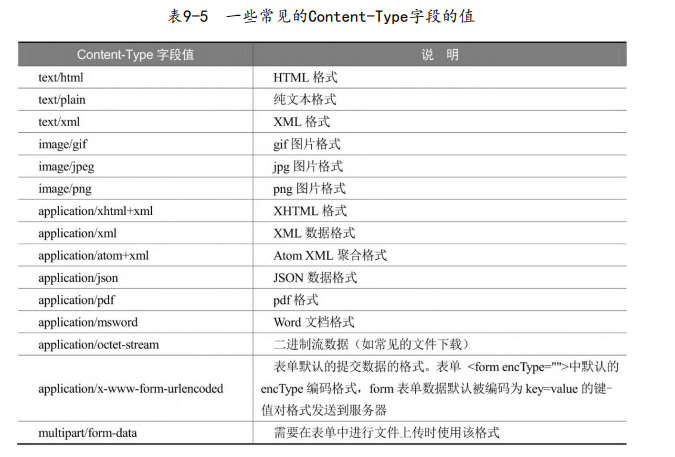

MIME类型还可以添加参数：

~~~http
Content-Type: text/html; charset=utf-8
~~~

GET和POST的区别

- 请求数据的位置不同
- 传输数据的大小不同
- 传输数据的安全性不同

总而言之，GET将数据放在URL中，而POST将数据放在请求体中。

### HTTP的演进

HTTP 1.1版本主要引入了持久连接（Persistent Connection）、管道机制（Pipelining）、 分块传输编码（Chunked Transfer Encoding，CTE）、字节范围 （Range）请求等。

HTTP1.1默认开启持久连接，当请求报文中携带`Connection: close`时，就明确要求服务器关闭TCP连接。

流水线机制是，可以允许多个请求同时发送。在HTTP1.0中，只有接收到前一个请求的响应后，才能继续发送请求。

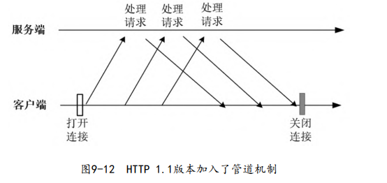

HTTP1.1新增了许多请求方法、字段以及响应码。其中，新增的Host字段，可以实现多个虚拟 Server 可以共享同一组IP地址和端口号。

HTTP 1.1版本支持分块（Chunked）传输编码。使用Content-Length字段的前提条件是，服务器必须知道数据的整个长度，这对于动态操作来说，必须计算出所有结果后，再开始发送，而不能边计算边发送。Transfer-Encoding字段（Chunked机制）可以解决这个问题，它表示数据将由数量未定的数据块组成。

~~~http
HTTP/1.1 200 OK
Content-Type: text/plain
Transfer-Encoding: chunked
25
This is the data in the first chunk

1C
and this is the second one

3
con

0
~~~

注意到，每个分块包含十六进制的长度值和数据。

HTTP的2.0版本是一个二进制协议，它将数据分割成多个数据帧（Frame）来进行传输，以实现低延迟和高吞吐量。HTTP/2协议的主要特点有

- 首部压缩：渐进式更新首部，无需每次发送首部
- 多路复用：在一个TCP连接上完成对多个资源的请求
- 并行双向传输
- 服务端推送。

### Netty

- `HttpRequestDecoder`：将ByteBuf解码成HttpRequest和HttpContent
- `HttpResponseEncoder`：将HttpResponse和HttpContent编码成ByteBuf字节流
- `HttpObjectAggregator`：可以把HttpMessage和任意个HttpContent聚合成一个 FullHttpRequest 
- `QueryStringDecoder`：将URI分割成Path路径和 Key-Value 参数

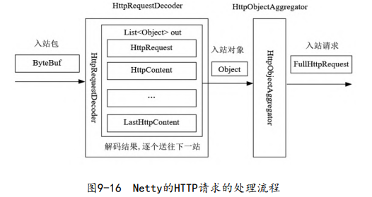

解码完成之后，如果没有更多的请求体内容， HttpRequestDecoder会传递一个LastHttpContent到HttpObjectAggregator中，表示HTTP请求数据已经解析完成。

~~~java
ChannelPipeline pipeline = ch.pipeline();

//请求的解码器（入站）
pipeline.addLast(new HttpRequestDecoder());

//请求聚合器
pipeline.addLast(new HttpObjectAggregator(65535));

//响应的编码器（出站）
pipeline.addLast(new HttpResponseEncoder());

//自定义的业务Handler
pipeline.addLast(new HttpEchoHandler());

public class HttpEchoHandler extends SimpleChannelInboundHandler<FullHttpRequest> {
     @Override
    public void channelRead0(ChannelHandlerContext ctx, FullHttpRequest request) throws Exception
    {
        // 1.获取URI
        String uri = request.uri();
        // ...
    }
}
~~~

### 高并发HTTP

以下场景需要使用到HTTP连接复用技术

1. 反向代理Nginx与Java Web应用服务之间的通信

   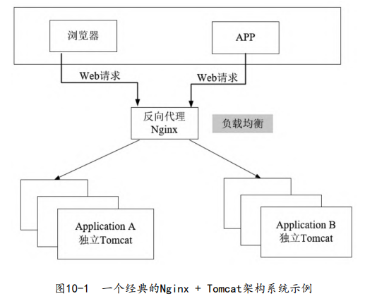

2. 微服务网关与微服务之间的通信

   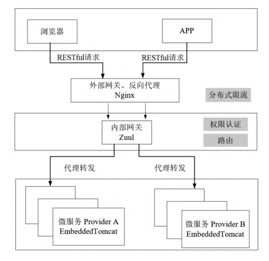

3. 微服务之间的RPC

   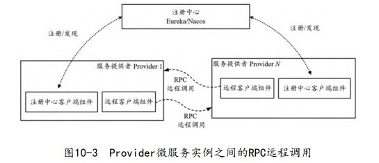

4. Java通过HTTP客户端访问REST接口服务

### TCP

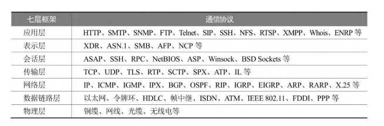

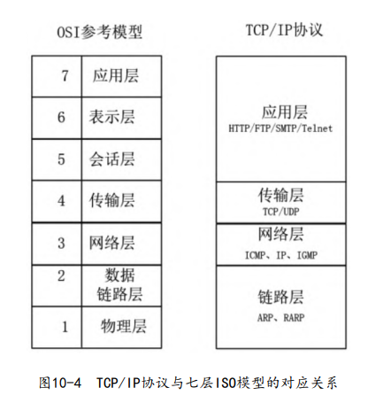

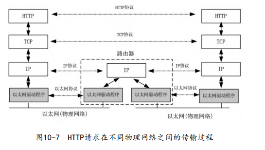

TCP提供了一种面向连接的、可靠的字节流服务，其数据帧格式大致如图

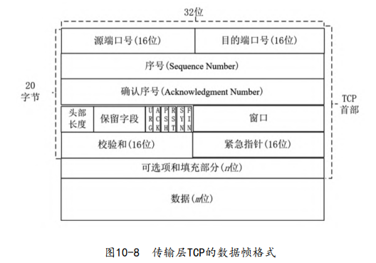

- 序号的语义与SYN控制标志（Control Bits）有关

  - 当SYN = 1时，当前为连接建立阶段，序号为初始序号 ISN（Initial Sequence Number）。ISN是由算法随机生成的序号。
  - 当SYN = 0时，第一个报文的序号为 ISN + 1，后面的报文序号为前一个报文的SN值 + TCP报文的净荷字节数（不包含TCP头）

- 头部长度：单位为4byte

- 控制标志

  

- 窗口

- 校验和

- 紧急指针

- 可选项和填充部分，最常见的选项为MSS

TCP连接建立时，双方需要经过三次握手，具体过程如下：

1. Client进入SYN_SENT状态，发送一个SYN帧（SYN = 1）来主动打开传输通道。除此之外，SYN帧还会带一个MSS（最大报文段长度）可选项
2. Server在收到SYN帧之后，会进入SYN_RCVD状态，返回SYN+ACK帧（ACK = 1，AN = SN + 1）给Client。同时也会返回服务器的MSS
3. Client在收到Server的第二次握手SYN+ACK确 认帧之后，首先将自己的状态从SYN_SENT变成ESTABLISHED。然后，Client发ACK帧（ACK = 1）给Server。此时Client可能会将ACK帧和第一帧要发送的数据，合并到一起发送给Server。
4. Server在收到Client的ACK帧之后会从SYN_RCVD状态进入 ESTABLISHED状态

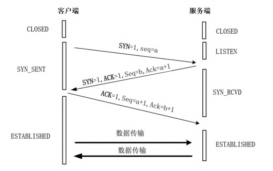

连接断开的过程需要经历四次握手：

1. 主动方（可以是客户端，也可以是服务 端），向对方发送一个FIN结束请求报文（FIN = 1）。发送完成后，主动方进入FIN_WAIT_1状态，表示没有数据再要发送给对方了。

2. 在收到了主动方发送的FIN 断开请求报文后，被动方会发送一个ACK响应报文。之后，被动方就进入了CLOSE-WAIT（关闭等待）状态，但是仍可以继续向主动方发送数据。

3. 主动方在收到了ACK报文后，由FIN_WAIT_1转换成FIN_WAIT_2 状态。被动方在发送完数据后，会向主动方发送一个FIN+ACK结束响应报文，然后被动方进入LAST_ACK状态。

4. 主动方收到FIN+ACK断开响应报文后，向被动方发送一个ACK确认报文，然后自己就进入TIME_WAIT状态，等待超时并且在等待时无其他数据到达，那么最终关闭连接（2MSL）。

   MSL（Maximum Segment Lifetime）指的是一个TCP报文片段在网络中的最大存活时间。在RFC1122协议中，推荐MSL为2分钟。

5. 被动方在收到主动断开方的最后ACK报文以后，最终关闭连接。

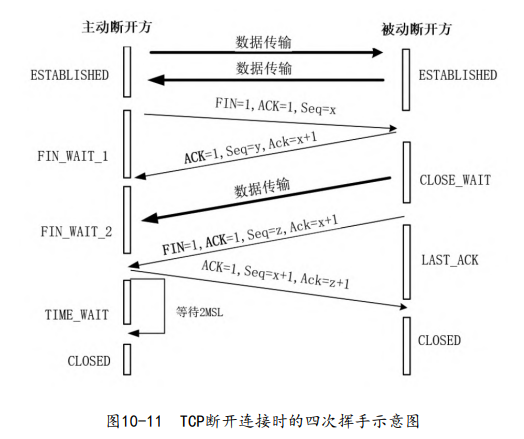

如果把三次握手改成两次握手，可能发生死锁。两次握手的示例：

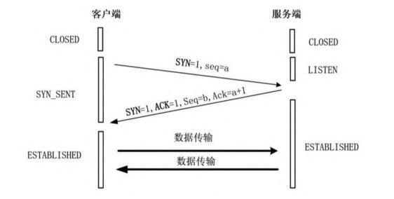

假设服务端发送的ACK丢失了，按照两次握手的协定，此时，服务端会认为连接已经建立，就开始发送数据，而客户端还在等待ACK帧，这样客户端会忽略服务端发送过来的数据，而服务端接收不到数据的ACK响应，那么会一直重发数据。

为什么TIME-WAIT状态必须等待2MSL？

1. 假设主动方发送的ACK报文丢失了，那么处于LAST-ACK状态的被动方就不能进入CLOSED状态。如果主动方在2MSL时间内收到了重传的FIN+ACK报文，那么就会重传一次ACK报文。然后再等待2MSL，这样就能确保被动方能收到 ACK报文，从而能确保被动方顺利进入CLOSED状态。
2. 防止旧连接中已失效的数据报文出现在新连接中

TCP还维护一个Keep-Alive计时器，计时器的超时时间一般设置为2小时，若2小时还没有收到Client的任何数据帧，Server就会发送一个探测报文段，以后每隔75秒发送一次。若一连发送10个探测报文仍然没有反应，Server就认为Client出了故障，接着关闭连接。

通过`netstat`命令，可以列出系统中所有TCP/IP的连接情况，

### 长连接

之前已经介绍过HTTP协议中的长连接，不再阐述。

对于独立部署的Tomcat服务器，长连接配置是通过修改Tomcat配置文件中Connector（连接器）配置项来完成的

~~~xml
<Connector port="8080" redirectPort="8443"
    protocol="org.apache.coyote.http11.Http11NioProtocol"
    connectionTimeout="20000"
    URIEncoding="UTF-8"

    keepAliveTimeout="15000"
    maxKeepAliveRequests="-1"
    maxConnections="3000"
    maxThreads="1000"
    maxIdleTime="300000"
    minSpareThreads="200"
    acceptCount="100"
    enableLookups="false" />
~~~

- keepAliveTimeout保活时长
- maxKeepAliveRequests：此选项表示长连接最大支持的请求数。对于超过该请求数的连接，发送数据完后，直接返回一个带Connection: close响应头的消息给客户端。-1表示没有限制
- maxConnections：Tomcat在任意时刻能接收和处理的最大连接数。注意，Linux中进程最大打开文件句柄数默认为1024。

对于在SpringBoot中嵌入部署的Tomcat服务器，长连接配置通过容器来定制

~~~java
@Configuration
@ConditionalOnClass({Connector.class})
public class TomcatConfig {
    @Autowired
    private HttpConnectionProperties httpConnectionProperties;
    
    @Bean
    public TomcatServletWebServerFactory createEmbeddedServletContainerFactory() {
        TomcatServletWebServerFactory tomcatFactory = new TomcatServletWebServerFactory();
        
        //增加连接器的定制配置
        tomcatFactory.addConnectorCustomizers(connector -> {
        	Http11NioProtocol protocol = (Http11NioProtocol) connector.getProtocolHandler();

            //定制keepAliveTimeout，确定下次请求过来之前Socket连接保持多久
            //设置600秒内没有请求则服务端自动断开Socket连接
            protocol.setKeepAliveTimeout(600000);

            //当客户端发送的请求超过10000个时强制关闭Socket连接
            protocol.setMaxKeepAliveRequests(1000);
            //设置最大连接数
            protocol.setMaxConnections(3000);

            //省略其他配置
        });
        
        return tomcatFactory;
    }
}

~~~

在Nginx与上游服务器上需要保持长连接，避免频繁地创建与释放。对于连接池中，单个TCP连接的保持配置，可以通过在upstream区块中使用keepalive指令完成

~~~nginx
upstream memcached_backend {
    server 127.0.0.1:11211;
    server 10.0.0.2:11211;
    keepalive 32; -- 可以理解为连接池可以缓存32个连接
}
~~~

反向代理对于下游来说是透明的，下游可能发送Connection:close头部，被Nginx转发到上游的服务器，而服务器认为iNginx要关闭TCP连接。因此要过滤掉HTTP请求头Connection:close

~~~nginx
server {
	listen 8080 default_server;
	server_name "";
	-- 处理下游客户端请求转发的location配置区块
	location / {
		proxy_pass http://memcached_backend;

	-- 转发之前，进行请求头重置，重置HTTP协议的版本为1.1
		proxy_http_version 1.1;

	-- 转发之前，进行请求头重置，重置请求Connection:close头部值
		proxy_set_header Connection "";
	}
}
~~~

## WebSocket

WebSocket是一种全双工通信的应用层协议，其通信在TCP连接上进行。在WebSocket双向通信技术之前，浏览器与服务器之间的双向通信大致有两种解决方案：

- Ajax短轮询，浏览器周期性地向服务器发起HTTP请求

  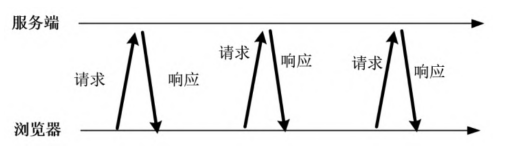

- Long Poll长轮询，与Ajax短轮询类似，但是如果服务器中没有数据，那么会一直阻塞，不会返回响应。

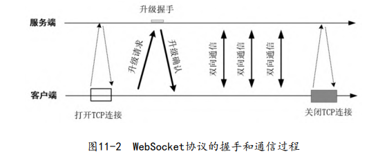

WebSocket协议中大致包含了5种类型的数据帧

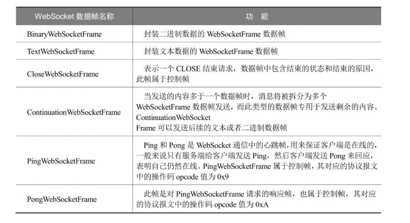

创建WebSocket连接的握手请求是HTTP1.1（或者更高）的GET请求，并且包含以下请求头：

- Sec-WebSocket-Key：客户端随机生成的值，由Base64编码。服务端会对此进行加密，并返回给客户端。
- Upgrade
- Connection
- Sec-WebSocket-Version
- Sec-WebSocket-Protocol：子协议名称，由用户自定义

如果响应报文的状态码为101，表示服务端同意客户端协议升级请求，比较重要的响应头有：

- Upgrade
- Sec-WebSocket-Accept
- Sec-WebSocket-Protocol

WebSocket报文格式

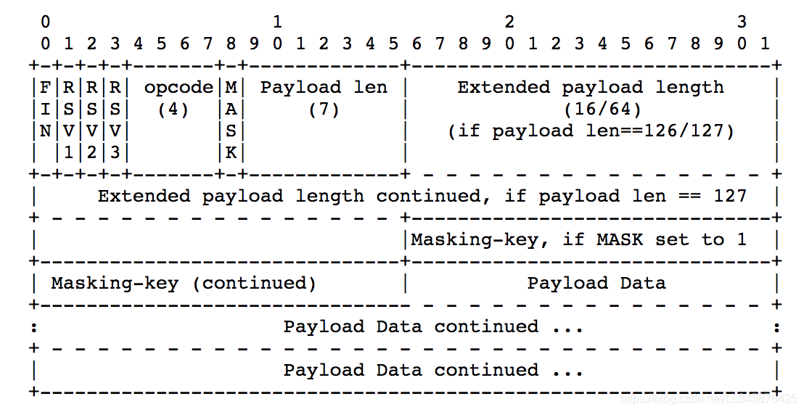

- FIN：表示该帧是否为消息的最后一个数据帧。

- Opcode：决定如何解析后续的数据载荷

  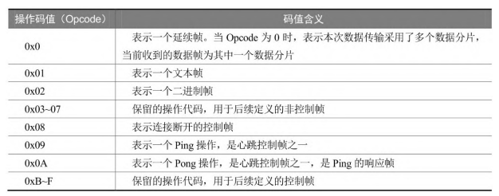

- Mask：表示是否要对数据载荷进行掩码操作。

- Masking-Key：掩码键，如果Mask值为1，就需要用这个掩码 键来对数据进行反掩码，以获取到真实的通信数据。客户端必须为每一个数据帧选择新的不同掩码值，并要求这个掩码值是随机的。

- Payload Length

- Payload

### Netty

与WebSocket相关的、Netty服务端的Handler：

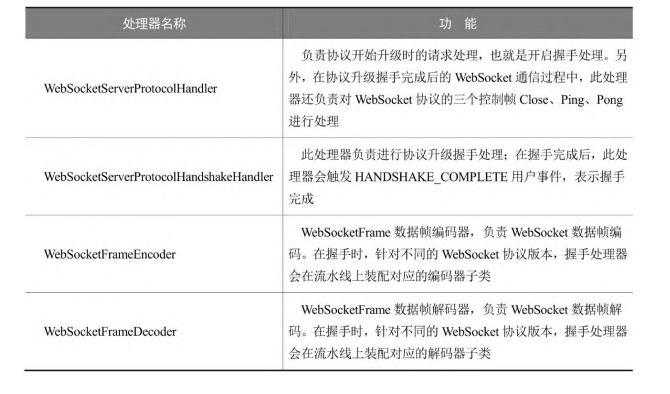

使用示例：

~~~java
ChannelPipeline pipeline = ch.pipeline();
 //HTTP请求解码器，在升级时会自动被替换
pipeline.addLast(new HttpRequestDecoder());

 //HTTP响应编码器，在升级时会自动被替换
 pipeline.addLast(new HttpResponseEncoder());

 //HttpObjectAggregator 将HTTP消息的多个部分合成一条完整的HTTP消息
 pipeline.addLast(new HttpObjectAggregator(65535));

 //WebSocket协议处理器，配置WebSocket的监听URI、协议包长度限制
 pipeline.addLast(new WebSocketServerProtocolHandler("/ws",
	"echo",
 	true,
	10 * 1024));

 //增加网页的处理逻辑，这个处理器在升级时需要手动移除。
 pipeline.addLast(new WebPageHandler());
~~~

`WebSocketServerProtocolHandler`协议处理器，配置WebSocket所监听的URI、协议包长度限制等等。

~~~java
// 监听的URL为“/ws”、子协议为“echo”
WebSocketServerProtocolHandler("/ws",
	"echo",
 	true,
    10 * 1024);
~~~

握手处理器 `WebSocketServerProtocolHandshakeHandler` 会被加入到通道处理流水线上，负责进行协议的升级握手。握手完成之后，握手处理器会将HTTP相关的处理器替换为WebSocket相关的，例如解码器`HttpRequestDecoder`替换为`WebSocketFrameDecoder`。在协议升级的时候，Netty会根据握手请求的Sec-WebSocket-Version头部，来决定使用哪一个版本的WebSocket协议。

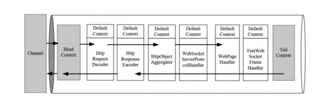

由于Netty的WebSocketServerProtocolHandler协议处理器已经帮 助处理诸如升级握手、Close、Ping、Pong控制帧等基础性工作，只有Text和Binary两种消息数据帧会被发送到后面的业务处理器中。

~~~java
public class TextWebSocketFrameHandler extends SimpleChannelInboundHandler<WebSocketFrame> {
    @Override
 	protected void channelRead0(
        ChannelHandlerContext ctx, 
        WebSocketFrame frame) throws Exception {
        if (frame instanceof TextWebSocketFrame) {
            //取得WebSocket的通信内容
 			String request = ((TextWebSocketFrame)frame).text();
            //构造TextWebSocketFrame文本帧，用于回复
 			TextWebSocketFrame echoFrame = newTextWebSocketFrame(echo);
 			//发送回显字符串
 			ctx.channel().writeAndFlush(echoFrame);
        } else {
            throw new UnsupportedOperationException(message);
        }
    }
    
    @Override
    public void userEventTriggered(
        ChannelHandlerContext ctx, 
        Object evt) throws Exception {
        if  (evt instanceof WebSocketServerProtocolHandler.HandshakeComplete) {
            // 移除与HTTP相关的业务处理器
            ctx.pipeline().remove(WebPageHandler.class);
        } else {
            super.userEventTriggered(ctx, evt);
        }
    }
}
~~~

## SSL/TLS

SSL 对 TCP 进行了安全增强，而 TLS 只是 SSL 的升级版。

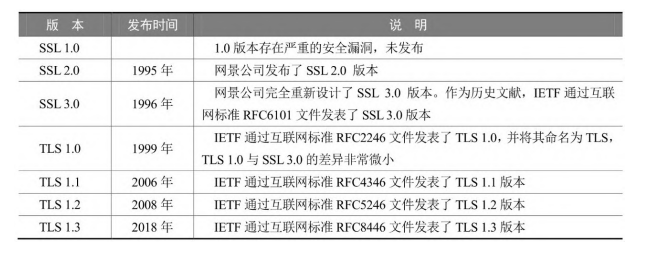

从理论上说，SSL/TSL 协议属于传输层，而在实现上属于应用层。

SSL/TLS协议包括：

- 握手协议（Handshake Protocol）：协商在通信过程中使用的加密套件（加密算法、密钥交换算法和MAC算法等）、身份验证等等
- 密码变化协议（SSL Change Cipher Spec Protocol）
- 警告协议（Alert Protocol）
- 应用数据协议
- 记录协议（Record Protocol）：主要负责对上层的数据（握手协议、 密码变化协议、警告协议和应用数据协议）进行分块 计算、添加MAC值、加密等处理，并把处理后的记录块传输给对端。

### 加密算法

哈希算法（Hash）将信息生成一个固定大小的字符串摘要。常用的哈希算法有MD5、SHA1、SHA-512等。哈希算法是单向的

对称加密（Symmetric Cryptography）是客户端使用密钥对信息加密，并把密钥和信息发送给服务端，服务端使用密钥进行解密。常见的对称加密算法有DES、AES等

非对称加密算法（Asymmetric Cryptography）需要两个密钥：一个称为公开密钥（公钥）；另一个称为私有密钥（私钥）。通过公玥加密的数据只有私玥可以解开，而通过私玥加密的数据只有公玥可以解开。典型的非对称加密算法有RSA、DSA等。

数字签名（Digital Signature）是确定消息发送方身份的一种方案，它的流程如下：

- 通过哈希函数为待发数据生成消息摘要
- 利用A的私钥加密该摘要，得到数字签名（可省略）
- A将数据和数字签名一起发送给B，再利用B的公玥加密
- B利用B的私玥解密，再利用A的公玥解密数字签名

### SSL/TLS握手

1. 客户端发一个Client Hello报文给服务端，报文主要字段有：

   - Handshake Type

   - Version

   - Random，由客户端生成的随机数Random_C

   - Session ID：在第一次连接时，Session ID字段是空的，表示客户端并不希望恢复某个已存在的会话，而是重新开始一个会话。

   - Cipher Suite：此字段用于发送客户端支持的密钥套件（Cipher Suite）列表，

   - Compression：表示客户端支持的压缩方法

   - Extensions

2. 服务端对客户端的Client Hello请求进行响应，一般包含4个回复帧

   - Server Hello帧
     - Handshake Type
     - Version
     - Random，由服务器生成的随机数Random_S
     - Session ID
     - Cipher Suite
   - Certificate帧，用于返回服务端的证书，一般包含服务端的公钥。大部分场景中服务端不需要验证客户端的身份，如果有需求，服务端就会发一个Certificate Request帧给客户端，要求客户端提供身份证书。
   - Server Key Exchange帧，携带额外数据
     - Handshake Type
     - EC Diffie-Hellman Server Params：表明服务端是通过Diffie-Hellman算法来生成最终密钥的
       - Pubkey，它是Diffie-Hellman算法中的一个参数
       - Signature
   - Server Hello Done帧

   客户端收到服务端证书后，进行验证，如果证书不是可信机构颁发的，或者域名不一致，或者证书已经过期，那么客户端会进行警告

3. 客户端会发送Client Key Exchange、Change Cipher Spec、Encrypted Handshake三个数据帧。

   - Client Key Exchange帧

     - Handshake Type
     - Pubkey：客户端会生成第三个随机数，并且从证书中取出公钥，利用公钥以及双方实现商定的加密算法进行加密，生成Pre-master key。这里Pubkey就是Pre-master key

   - Change Cipher Spec帧

   - Encrypted Handshake Message帧

4. 在收到客户端的第三个随机数Pre-master key之后，服务端生成本次会话所用的密钥，然后向客户端最后发送下面的数据帧：

   1. Change Cipher Spec帧：此帧为服务端的编码改变通知报文。
   2. Encrypted Handshake Message帧：此帧为服务端的握手结束通知报文。

注意，客户端和服务器均使用 client random，server random 和 premaster secret，并通过协商过的算法生成相同的密钥 **KEY**。

TLS1.2需要2RTT，而TLS1.3仅需1RTT

SSL/TSL握手阶段可能被劫持（伪造内容）。

数字证书可以解决劫持问题，它的颁发过程如下：

1. 用户首先产生自己的密钥对，并将公钥及身份信息提供给CA机构（认证中心）
2. CA在核实用户信息后，将发给用户一个数字证书，它包括三个部分：
   1. 证书内容，包括公钥及身份信息
   2. 哈希算法
   3. 加密密文，CA机构通过哈希算法对证书内容生成内容摘要后，然后使用CA自己的密钥对该摘要进行加密，这相当于生成数字签名。

客户端验证数字证书的流程

1. 获取服务端的数字证书
2. 通过CA机构提供的公钥对服务端的证书的数字签名（加密密文）进行解密，获取内容摘要，同时将证书内容使用相同的哈希算法获取摘要， 对比两个摘要。

在校验证书时，浏览器会用到CA机构的公钥。实际上，浏览器和操作系统都会维护一个权威、可行的第三方CA机构列表（包括它们的公钥）。客户端接收到的证书中也会写有颁发机构，客户端根据这个颁发机构找到其公钥，然后完成证书的校验。

~~~java
~~~

