# Web架构

[TOC]

计算机网络 DNS、CDN

与高并发相关的指标有：

- **响应时间（Response Time，RT）**

  - Average（平均值）
  - Median（中位数）：50%的用户响应时间小于这个值。
  - 99%Line（99%百分位）：99%的用户响应时间小于这个值。
  - Max（最大值）：用户响应时间最大值。

- **吞吐量（Throughput）**

  - QPS（每秒查询数）
  - TPS（每秒事务数）
  - 日PV（Page View）值
  - 日UV（Unique Visitor）值

  如果一次请求会调用后端的多个接口，或者访问后端的多个资源，那么QPS≠TPS，此时子请求被计入到QPS中，使得QPS > TPS。

  UV访问数指独立访客访问数，其中独立访客可以理解为终端。假设用cookie去标识终端，那么更换了IP但不清除Cookies，再访问相同网站，该网站的统计中的UV数是不变的。一个UV可以产生多个PV，所以PV个数≥UV个数。

  吞吐量与响应时间之间大致成反比关系。

- **错误率**

提升系统并发能力的两个手段：

- **纵向扩展（Scale Up，垂直扩展）**：提升单进程的处理能力，体现为
  - 提升服务器的硬件性能
  - 提升软件的性能，例如缓存机制、无锁模式、零拷贝、池化技术等
- **横向扩展（Scale Out，水平扩展）**：从一个进程提供服务扩展到由多个服务进程提供服务，体现为
  - 增加服务器数量
  - 设计好分层架构，实现读写访问链路解耦和冷热链路解耦。

## 接入层的横向扩展

接入层的核心职责：接收用户请求，通过多种策略

- 提升系统的读写吞吐量（缓存策略）
- 防止系统雪崩（限流策略）
- 提升系统的访问安全性（黑名单）

接入层横向扩展：

- **硬负载均衡**：在服务器节点之间安装的专门的硬件设备，代表厂商F5

  

  硬负载均衡的优点是功能强大、性能强大、支持安全防护；缺点是价格昂贵、扩展能力差

- **软负载均衡**，经典解决方案 Nginx + LVS，Nginx工作在网络的应用层，主要做反向代理；LVS工作在网络层，主要做负载均衡。

  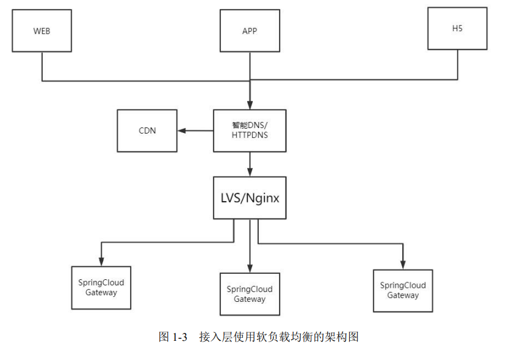

  硬负载均衡性能远远高于软负载均衡性能。具体来说，Nginx的性能是万级，而F5设备的性能是百万级，而且软负载的安全功能（DDoS、防火墙）不如硬负载的。但它的优点在于简单、便宜、灵活

- **DNS 负载均衡**

  前面所介绍的LVS是对同一个地理区域，甚至是同一个机房的负载均衡，属于**SLB（Server Load Balancing）**类型。还有一种更大地理范围的负载均衡技术，是在不同地理区域的物理集群之间进行负载均衡，属于**GSLB（Global Server Load Balance，全局负载均衡）**。SLB一般局限于一定的区域范围内，其目标是在特定的区域范围内寻找一台最适合的节点提供服务。GSLB主要的目的是在整个网络范围内将用户的请求定向到最近的节点（或者区域）。在实际的应用中，GSLB技术一般和DNS一起使用。

  DNS的负载均衡技术分为两类：

  - **A记录解析负载均衡**：一个域名可以绑定多条A记录（IP记录）。在进行域名解析的时候，ISP的DNS服务器可以在多个A记录之间轮询，从而进行负载均衡。此外有些DNS还支持基于地理位置的域名解析

    ~~~dns
    www.crazymaker.com IN A 10.1.1.1
    www.crazymaker.com IN A 10.1.1.2
    www.crazymaker.com IN A 10.1.1.3
    ~~~

    

    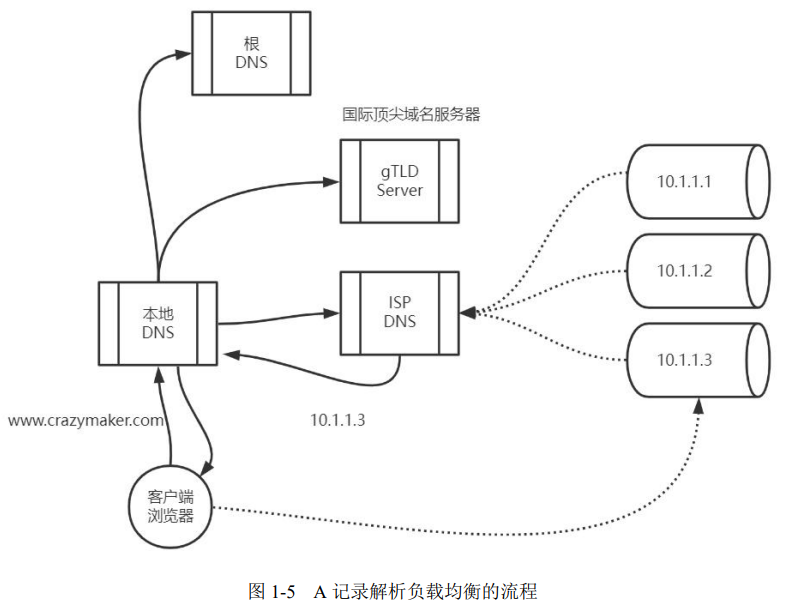

    这种技术有两个问题：

    - 由于DNS有缓存机制，因此某台服务器下线之后，即使运维人员去ISP的DNS服务器修改了A记录，但生效也需要较长的时间，在这段时间，DNS仍然会将域名解析到已下线的服务器上，最终导致用户访问失败。
    - DNS负载均衡采用的是简单的轮询算法，不能定制逻辑更加复杂的均衡算法

  - **智能DNS负载均衡**：在DNS服务器配置目标域名时，通过CNAME别名将目标域名设置为具有智能DNS。智能DNS具有更加智能的负载均衡能力，它考虑的因素有下：

    - 服务器的“健康状况”
    - 地理区域距离
    - IP地址权重
    - ...

    ~~~dns
    www.crazymaker.com NS ns1.crazymaker.com
    ~~~

    

    

**静态资源的缓存策略**包括了

- **接入层网关缓存**：接入层网关缓存可以分为两种：

  - 将静态资源的URL请求结果暂存到Nginx本地缓存，后面访问直接从本地缓存返回。
  - 将静态资源的URL请求结果暂存到单独的缓存服务（如Varnish或者Squid），后面访问直接从缓存服务返回。

  另外，还可以通过配置expires、cache-control、if-modified-since来对浏览器端的缓存行为进行控制，使得浏览器端在一段时间内，对静态资源不会重复请求。

- **CDN（Content Delivery Network）缓存**

  CDN的静态资源可以在访问的时候加载（**懒加载**），也可以**预加载**，就是通过CDN的特定接口，将内容主动推送到CDN。

注意，使用静态资源的缓存策略有一个重要前提，就是静态资源和动态资源分离。

此外，还可以通过Redis或者Memcached对动态资源进行缓存。

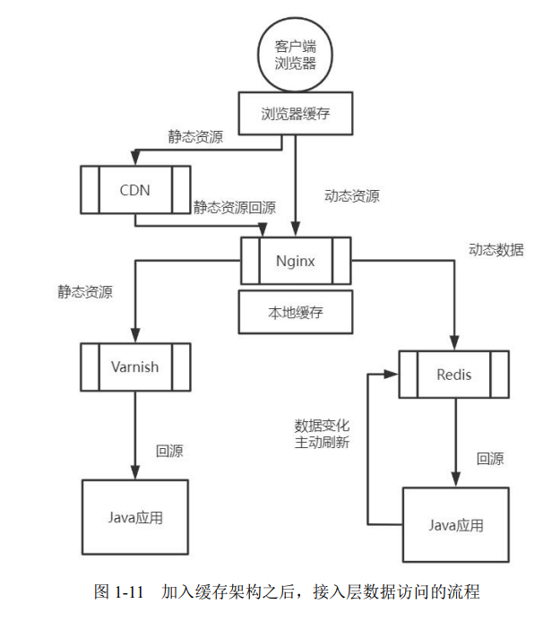

## 服务层的横向扩展

服务层的横向扩展架构可以分为：

- **微服务网关的横向扩展**：增加服务节点数量，新增Zuul/Spring Cloud Gateway服务的部署。在接入层Nginx配置中配置新的Zuul/SpringCloud Gateway的IP和端口

  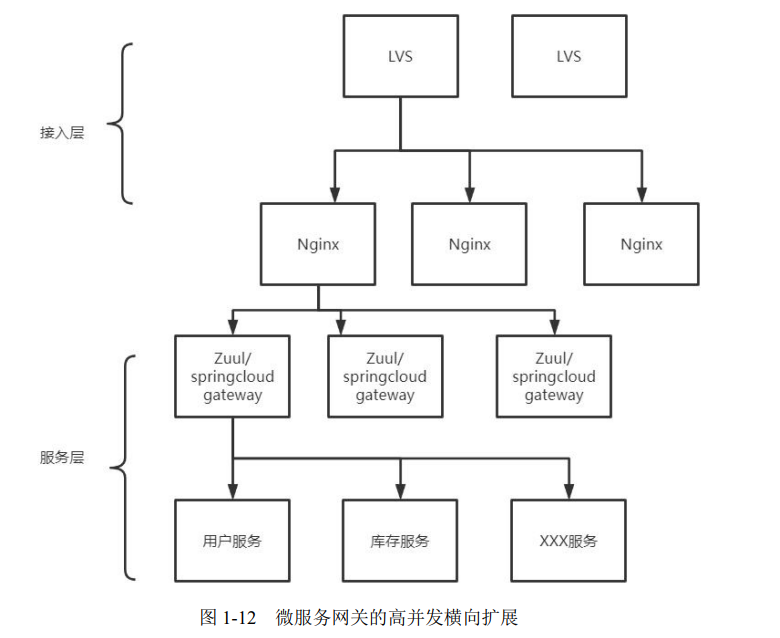

- **微服务Provider（提供者）的横向扩展**：当微服务Provider有所变化时，微服务网关能够对Provider做到**动态发现**、**动态负载均衡**，而接入层网关却做不到这点。微服务网关的这种能力，需要基于于注册中心（如Eureka、Zookeeper、Nacos等）去实现。注册中心具备微服务Provider的管理能力、健康检查能力，能够完成微服务Provider的自动注册与发现，并且将这些信息作为集群的重要元数据信息。微服务网关会从注册中心（如Eureka、Zookeeper、Nacos等）去定期更新元数据信息，并且缓存在本地，然后基于这些元数据信息实现微服务Provider的动态发现、动态的负载均衡。

  此外，RPC框架（Dubbo）也可以做到对Provider进行动态发现、动态的负载均衡。

  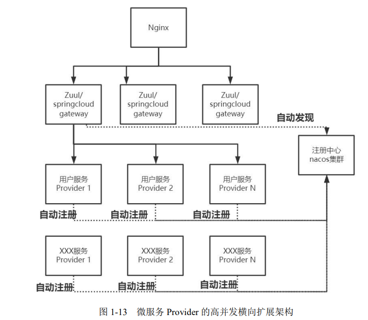

- **微服务Provider的自动伸缩**：传统的微服务Provider扩容是由运维人员手动管理的，但这应对不了突发流量。常见的微服务Provider自动伸缩策略有以下两种：

  - 通过Kubernetes HPA组件，它通过调整Pod副本数量使得CPU使用率（或者其他的配置指标）尽量向期望值靠近

  - 通过微服务Provider自动伸缩伺服组件，它一般分为两个部分

    - AutoScaler伺服进程
    - AutoScaler监控中心

    AutoScaler监控中心收集各种指标，然后通过RPC将伸缩命令发送到相应的AutoScaler伺服进程，伺服进程完成扩容和缩容操作。

    

## 缓存层

这里我们讨论动态数据的缓存。

有三种经典的缓存模式：

- **旁路缓存（Cache-Aside Pattern）模式**：读取缓存、更新缓存的操作都在应用程序中完成

  - 读操作流程
    1. 应用程序优先从缓存中查找数据
    2. 如果数据存在（缓存命中），则从缓存中查询出来，返回查询到的数据。
    3. 如果数据不存在（缓存未命中），则从数据库中查询数据，返回查询到的数据，并写入到缓存中。
  - 写操作流程
    1. 先写入数据库
    2. 然后直接删除 cache 

- **读/写穿透（Read/Write Through）模式**：它实际只是在缓存旁路模式（Cache-Aside）之上进行了抽象出来了一层——Cache Provider。

  - 读流程：
    1. 从 cache 中读取数据，读取到就直接返回 。
    2. 读取不到的话，先从 db 加载，写入到 cache 后返回响应。（加锁）
  - 写流程
    1. **同步更新 cache 和 db**。（加锁）

  它是强一致性方案，但性能较差

- **异步回写（Write Behind）模式**：异步回写模式和读/写穿透模式很相似，但它在写入时，只更新缓存，不同步更新数据库，而改为异步批量的方式来写入数据库。而读/写穿透模式是同步更新缓存和数据库。它是弱一致性方案，且有丢数据的风险（持久化失败）

写入缓存的时机有两种：

1. 懒汉模式，使用时加载缓存。具体来说，当需要使用数据时，从数据库中把它查询出来，然后写入缓存（缓存未命中的情况）
2. 饿汉模式，提前预加载缓存。具体来说，在项目启动时，预加载数据到缓存

双写策略有：

- 先更新数据库，再更新缓存。

  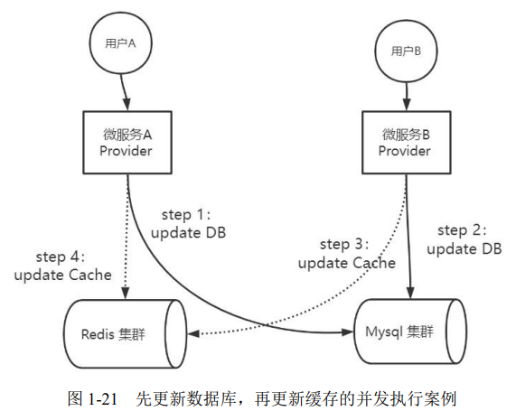

  这样，在数据库中的数据是Provider B的，在缓存中的数据是Provider A的。 这也就解释了为什么是删除缓存，而不是更新缓存

- 先删除缓存，再更新数据库

  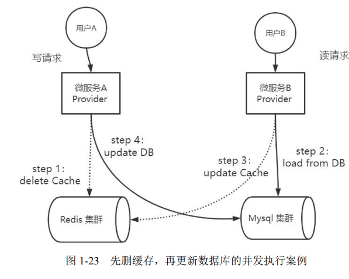

  在上述情景中，缓存中是旧的数据，而数据库中是新的数据。

- 先更新数据库，再删除缓存。它基本上可以解决数据不一致问题，但是在少数情况下，仍会有问题。

  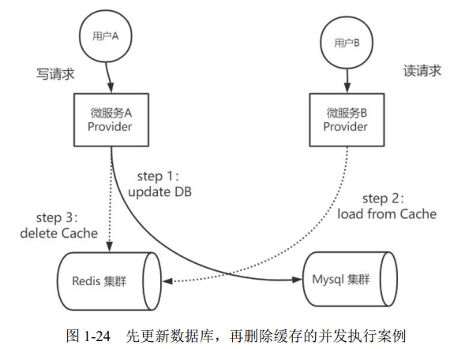

  它保证的是最终一致性

- 延迟双删，它是对「先删除缓存，再更新数据库」策略的改进，它先删缓存，后写数据库，最后延迟一定时间再删缓存。

  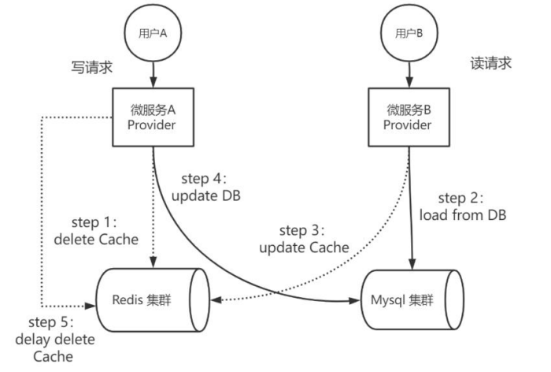

  保证了最终一致性。但是它给缓存带来了额外的写压力

- 先更新数据库，再基于队列删除缓存。与「先更新数据库，再删除缓存」类似，但是它会把删缓存操作加入队列，异步消费该队列。该队列可以细分为：

  - 基于内存队列删除缓存

    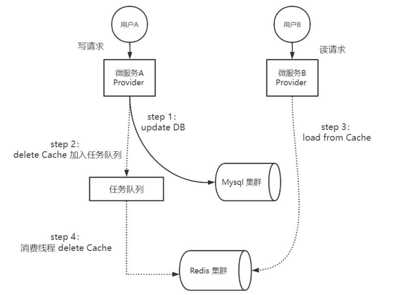

  - 基于消息队列删除缓存，解决内存队列的低可用问题

    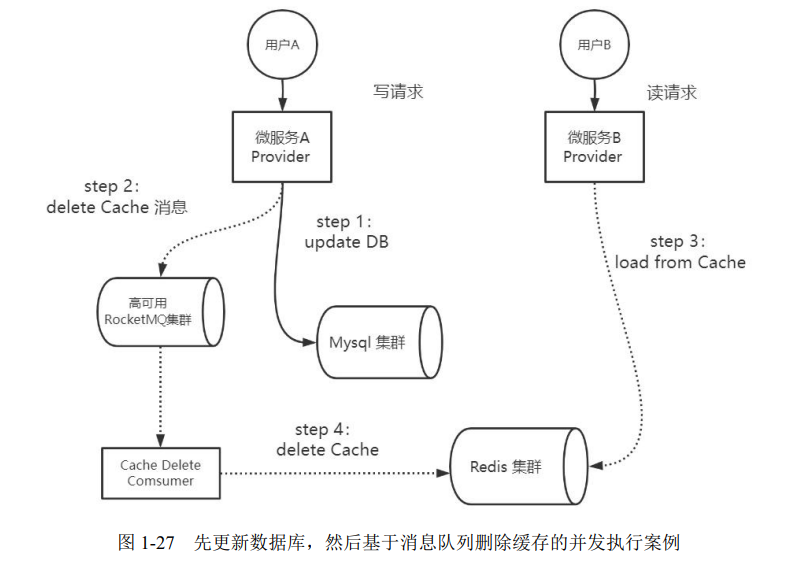

  - 基于binlog+消息队列删除缓存，将写操作和删除操作进行解耦

    使用Alibaba的Canal中间件，采集MySQL的binlog日志，然后根据日志将删除操作发送到RocketMQ队列

    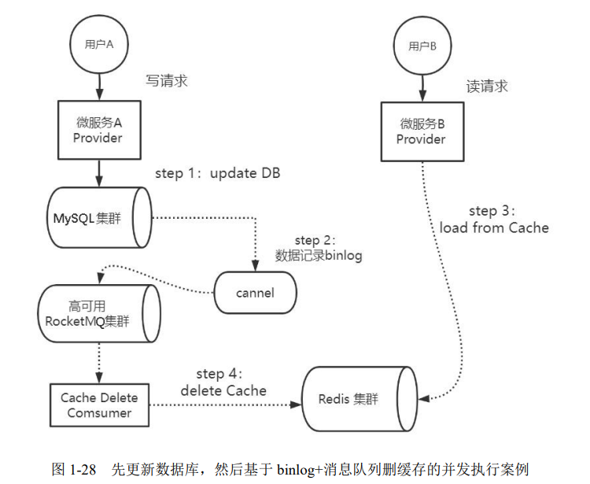

  

CAP理论描述的是一个分布式系统在一致性（Consistency）、可用性（Availability）、分区容错性（Partition tolerance）这三个特性中，最多满足其中的两个特性。这里一致性指的是强一致性，而不是最终一致性。

加入缓存是为了获得高性能、高吞吐，即满足了AP特性。如果要设计CP系统，就不适合用缓存。如果要为CP系统强行引入缓存，那么就需要引入分布式锁。这是个低性能方案，与缓存的设计目标相违背。

## 数据层的横向扩展

随着数据量的增长，数据库很容易产生性能瓶颈：IO瓶颈（磁盘IO、网络带宽）、CPU瓶颈（慢SQL、单表数据量太大）。此时，我们就要分表，分表有两个策略：

1. 水平拆分：拆分数据
2. 垂直拆分：拆分结构，尽量将热点字段放在一起

拆分后，某些查询可能涉及到多个分区，性能较差。我们可以使用 ES（ElasticSearch）+HBase 异构查询架构来解决此问题。这套方案将将索引与数据存储解耦：

1. 先根据搜索条件去ES查询符合条件的Rowkey值
2. 然后用Rowkey值去HBase查询

## 高并发、高可用架构

请求处理模型有：

- 直筒型：用户请求1:1地洞穿到数据库层
- 漏斗型：用户的请求从客户端到数据库层逐层递减。它对请求进行分层过滤，从而过滤掉一些无效的请求。例如
  - 在接入层，拦截静态资源的读取
  - 在Nginx上可以进行流控，也可以进行黑名单过滤
  - 服务层的授权校验
  - 缓存层的命中，又滤掉一些请求

在同步调用的架构模式中，假设接入层的吞吐量在10万级TPS，服务层的吞吐量在1万级TPS，就会出现严重的速率不匹配，从而导致接入层大量的请求被阻塞和积压，严重拖慢了性能。可以采用异步架构来解决此问题。

整个系统的高可用（避免单点故障）是通过冗余+自动故障转移来实现的。