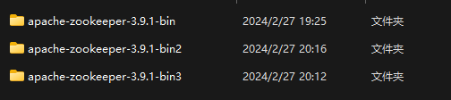
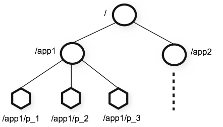
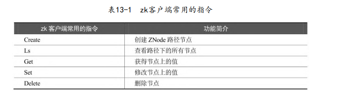
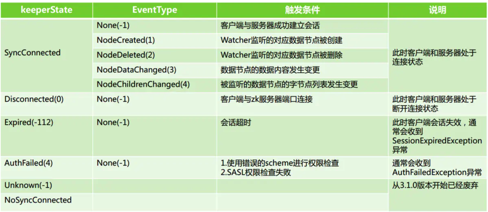

# ZooKeeper

[TOC]

ZooKeeper是一个针对大型分布式系统的可靠协调系统，提供的功能包括配置维护、名字服务、分布式同步等。

## 搭建集群

下载Zookeeper https://www.apache.org/dyn/closer.lua/zookeeper/zookeeper-3.9.1/apache-zookeeper-3.9.1-bin.tar.gz

ZooKeeper集群节点数必须是奇数，否则可能会出现「可用节点数量 = 总节点数量/2」，不满足选主的要求「可用节点数量 > 总节点数量/2」，这是为了避免脑裂问题，即由于网络断了，一个集群被分成了两个集群

这里我们创建3个zookeeper节点的伪集群：

1. 将安装包解压到指定目录

   ~~~shell
   $ tar -zxvf apache-zookeeper-3.5.7-bin.tar.gz
   ~~~

   注意，解压包名中要带有bin，而`apache-zookeeper-3.5.7.tar.gz`一般是源代码文件

2. 为节点创建日志目录`${zookeeper}/log/`。

3. 然后创建一个数据目录`${zookeeper}/data/`。

4. 在数据目录下，创建一个名为myid文件（无扩展名），里面的内容为ID。ZooKeeper对ID有两点要求：

   1. id只能是一个数字
   2. id的范围是1~255，表示集群最多的节点个数为255个。

5. 为节点创建一个配置文件，可以在`${zookeeper}/conf/zoo_sample.cfg`配置文件的基础上进行修改，注意重命名为`zoo.cfg`

   ~~~config
   tickTime=2000
   initLimit=10
   syncLimit=5
   
   dataDir=C:\zookeeper\apache-zookeeper-3.9.1-bin\data\zoo-3
   dataLogDir=C:\zookeeper\apache-zookeeper-3.9.1-bin\log\zoo-3
   
   clientPort=2183
   
   server.1=127.0.0.1:2888:3888
   server.2=127.0.0.1:2889:3889
   server.3=127.0.0.1:2890:3890
   ~~~

   - 这里server.A=B:C:D

     - A 是一个数字，代表服务器的编号，就是myid文件里面的值。集群中每台服务器的编号都必须唯一
     - B代表服务器的IP地址
     - C表示服务器与集群中的 leader 服务器交换信息的端口
     - D表示选举时，服务器相互通信的端口

   - `tickTime`：单元时间。
   - `initLimit`：节点的初始化时间
   - `syncLimit`：心跳最大延迟周期。

6. 运行`${zookeeper}/bin/zkServer.sh`

每个节点都要执行一遍上述流程，而且在复制的zookeeper文件夹中

## 分布式存储

ZooKeeper的存储模型是一棵以"/"为根节点的树，存储模型中的每一个节点叫作ZNode（ZooKeeper Node）节点。这些ZNode节点可以保存二进制负载数据（Payload），而文件系统的目录只能存放路径信息，而不能存放负载数据。

ZooKeeper为了保证高吞吐和低延迟，整个目录结构全部都放在内存中。因此要求每个节点所存放的Payload负载数据的大小不超过1MB

ZooKeeper节点有四种类型：

- 持久化节点（PERSISTENT）
- 持久化顺序节点（PERSISTENT_SEQUENTIAL）
- 临时节点（EPHEMERAL），生命周期和客户端会话绑定。临时节点**无法创建子节点**；
- 临时顺序节点（EPHEMERAL_SEQUENTIAL）

这里顺序是指，ZK会自动在该类型的节点的名字后，追加一个不断增加的序列号，该序列号对于此节点的父节点来说是唯一的。

~~~shell
$  get /
cZxid = 0x0
ctime = Thu Jan 01 08:00:00 CST 1970
mZxid = 0x0
mtime = Thu Jan 01 08:00:00 CST 1970
pZxid = 0x400000193
cversion = 1
dataVersion = 0
aclVersion = 0
...
~~~

ZooKeeper节点状态的每一次改变，都对应着一个递增的事务 ID（Transaction id），该ID称为Zxid，它是全局有序的。zookeeper的每个节点维护着三个Zxid值：

- cZxid：ZNode节点创建时的事务ID
- mZxid：ZNode节点修改时的事务ID，与子节点无关。
- pZxid：ZNode节点的子节点的最后一次创建或者修改， 与孙子节点无关。

Zxid是一个64为的数字，它高32位是epoch，用来标识leader关系是否改变，每次一个leader被选出来，它都会有一个 新的epoch。低32位是个递增计数。

对节点的每次操作都会使节点相应的版本号增加。每个节点包括三个版本号：

- dataversion：数据版本号。
- cversion：子节点版本号。
- aclversion：节点的ACL权限修改版本号。

## ZooKeeper API

与ZooKeeper相关的Java API有：

- ZooKeeper官方API
- ZkClient
- Curator

这里介绍如何使用Curator框架

> ZooKeeper的作者Patrixck Hunt对Curator给予了高度评价，他的评语是：“Guava is to Java that Curator to ZooKeeper”。

Curator包含了以下几个包：

- curator-framework：对ZooKeeper底层API的一些封装。
- curator-client：提供一些客户端的操作，例如重试策略 等。
- curator-recipes：封装了一些高级特性，如Cache事件监听、选举、分布式锁、分布式计数器、分布式Barrier等。

Maven依赖如下：

~~~xml
<dependency>
    <groupId>org.apache.curator</groupId>
    <artifactId>curator-client</artifactId>
    <version>4.0.0</version>
    <exclusions>
        <exclusion>
            <groupId>org.apache.ZooKeeper</groupId>
            <artifactId>ZooKeeper</artifactId>
        </exclusion>
    </exclusions>
</dependency>

<dependency>
	<groupId>org.apache.curator</groupId>
    <artifactId>curator-framework</artifactId>
    <version>4.0.0</version>
    <exclusions>
        <exclusion>
        	<groupId>org.apache.ZooKeeper</groupId>
        	<artifactId>ZooKeeper</artifactId>
        </exclusion>
    </exclusions>
</dependency>

<dependency>
    <groupId>org.apache.curator</groupId>
    <artifactId>curator-recipes</artifactId>
    <version>4.0.0</version>
    <exclusions>
        <exclusion>
        	<groupId>org.apache.ZooKeeper</groupId>
        	<artifactId>ZooKeeper</artifactId>
        </exclusion>
    </exclusions>
</dependency>
~~~

一定要注意Curator与ZooKeeper的版本要匹配。

创建Curator客户端

~~~java
public class ClientFactory {
    /**方式一
     * @param connection ZK的连接地址
     * @return CuratorFramework 实例
     */
    public static CuratorFramework createSimple(String connection) {
        //第一个参数：等待时间的基础单位，单位为毫秒
        //第二个参数：最大重试次数
        //重试策略:第一次重试等待1秒，第二次重试等待2秒，第三次重试等待4秒
        ExponentialBackoffRetry retryPolicy = new ExponentialBackoffRetry(1000, 3);
        return CuratorFrameworkFactory.newClient(connection, retryPolicy);
    }

    /**方式二
     * @param connection ZK的连接地址
     * @param retryPolicy 重试策略
     * @param connectionTimeoutMs 连接超时时间
     * @param sessionTimeoutMs 会话超时时间
     * @return CuratorFramework 实例
     */
    public static CuratorFramework createWithOptions(
        String connection,
        RetryPolicy retryPolicy,
        int connectionTimeoutMs,
        int sessionTimeoutMs
    ) {
        return CuratorFrameworkFactory.builder()
            .connectString(connection)
            .retryPolicy(retryPolicy)
            .connectionTimeoutMs(connectionTimeoutMs)
            .sessionTimeoutMs(sessionTimeoutMs)
            //其他的创建选项
            .build();
    }
}
~~~

创建节点：

~~~java
final String ZK_ADDRESS = "127.0.0.1";
public void createNode() {
    CuratorFramework client = ClientFactory.createSimple(ZK_ADDRESS);
    try {
        client.start();
        String data = "hello";
        byte[] payload = data.getBytes("UTF-8");
        String zkPath = "/test/CRUD/node-1";
        client.create()
            .creatingParentsIfNeeded()
            .withMode(CreateMode.PERSISTENT)	// 创建持久类型的节点
            .forPath(zkPath, payload);
    } catch (Exception e) {
        e.printStackTrace();
    } finally {
        CloseableUtils.closeQuietly(client);
    }
}
~~~

读取节点：

~~~java
public void readNode() {
    CuratorFramework client = ClientFactory.createSimple(ZK_ADDRESS);
    try {
        client.start();
        String zkPath = "test/CRUD/node-1";
        Stat stat = client.checkExists().forPath(zkPath);
        if (stat != null) {
            byte[] payload = client.getData().forPath(zkPath);
            String data = new String(payload, "UTF-8");
            
            String parentPath = "/test";
            List<String> children = client.getChildren().forPath(parentPath);
        }
    } catch (Exception e) {
        e.printStackTrace();
    } finally {
        CloseableUtils.closeQuietly(client);
    }
}
~~~

更新节点（同步）：

~~~java
public void updateNode() {
    //创建客户端
    CuratorFramework client = ClientFactory.createSimple(ZK_ADDRESS);
    
    try {
        //启动客户端实例，连接服务器
        client.start();
        String data = "hello world";
        byte[] payload = data.getBytes("UTF-8");
        String zkPath = "/test/CRUD/node-1";
        client.setData().forPath(zkPath, payload);
    } catch (Exception e) {
   	 	e.printStackTrace();
    } finally {
    	CloseableUtils.closeQuietly(client);
    }
}

~~~

更新节点（异步）：

~~~java
public void updateNodeAsync() {
	//创建客户端
	CuratorFramework client = ClientFactory.createSimple(ZK_ADDRESS);
	try {
		//异步更新完成，回调此实例
		AsyncCallback.StringCallback callback = new AsyncCallback.StringCallback() {
			@Override
			public void processResult(int i, String s, Object o, String s1) {
                System.out.println(
                "i = " + i + " | " +
                "s = " + s + " | " +
                "o = " + o + " | " +
                "s1 = " + s1
                );
			}
		};
        
        //启动客户端实例，连接服务器
        client.start();
        String data = "hello ,every body! ";
        byte[] payload = data.getBytes("UTF-8");
        String zkPath = "/test/CRUD/remoteNode-1";
        client.setData().inBackground(callback).forPath(zkPath, payload);
	} catch (Exception e) {
		e.printStackTrace();
	} finally {
		CloseableUtils.closeQuietly(client);
	}
}
~~~

删除节点（同步）：

~~~java
@Test
public void deleteNode() {
	//创建客户端
	CuratorFramework client =ClientFactory.createSimple(ZK_ADDRESS);
	try {
        //启动客户端实例，连接服务器
        client.start();
        
        //删除节点
        String zkPath = "/test/CRUD/remoteNode-1";
        client.delete().forPath(zkPath);
    } catch (Exception e) {
    	e.printStackTrace();
    } finally {
    	CloseableUtils.closeQuietly(client);
    }
}

~~~

同样可以通过`.inBackground(callback)`来异步删除

## 命名服务

维护全局的服务接口。大致的思路为：

- 服务提供者（Provider）在启动的时候，向指定ZooKeeper节点中写入接口的地址，这相当于服务公开。

   - 服务消费者（Consumer）启动的时候，订阅节点以获取接口地址。

## ID生成器

  分布式的ID生成器方案大致如下：

1. Java的UUID。
2. 利用Redis的原子操作INCR和INCRBY，生成全局唯一的ID。
3. Twitter的Snowflake算法。
4. ZooKeeper生成ID

~~~java
public class IDMaker {
    /**
     * 创建临时顺序节点
     * @param pathPefix 节点路径
     * @return 创建后的完整路径名称
     */
    private String createSeqNode(String pathPrefix) {
        try {
			String destPath = client.create()
                 .creatingParentsIfNeeded()
                 .withMode(CreateMode.EPHEMERAL_SEQUENTIAL)
                 .forPath(pathPefix);
         	return destPath;
        } catch (Exception e) {
            e.printStackTrace();
        }
        return null;
    }
    
    public String makeId(String nodeName) {
        String str = createSeqNode(nodeName);
        if (str == null) {
            return null;
        }
        
        int index = str.lastIndexOf(nodeName);
        if (index >= 0) {
            index += nodeName.length();
            return index <= str.length() ? str.substring(index) : "";
        }
        return str;
    }
}
~~~

## SnowFlake ID算法

雪花算法是由Twitter开源的分布式ID生成算法

SnowFlake算法所生成的ID是一个64位的长整数类型数字，被划分成四部分：

- 第一位：占用1位，始终是0，
- 时间戳：占用41位，精确到毫秒，总共可以容纳约69年的时间。
- 机器编码：占用10位，最多可以容纳1024个节点。
- 序列号：占用12位，最多可以累加到4095

SnowFlake算法在同一毫秒内最多可以生成的ID数量为$1024×4096=4194304$

雪花算法生成的ID是趋势递增，不依赖数据库等第三方系统。但是雪花算法强**依赖机器时钟**，如果某台机器的系统时钟回拨，就 有可能造成ID冲突或者ID乱序。

## Watcher

在ZooKeeper中，接口类Watcher用于表示一个标准的事件处理器，包含`KeeperState`和`EventType`两个枚举类，分别代表了通知状态和事件类型，同时定义了事件的回调方法：`process(WatchedEvent event)`。

~~~java
public interface Watcher {
    void process(WatchedEvent var1);

    public static enum WatcherType {
        //...
    }

    public interface Event {
        public static enum EventType {
            // ...
        }

        public static enum KeeperState {
            // ...
        }
    }
}
~~~

ZooKeeper使用`WatchedEvent`对象来封装服务端事件，并传递给Watcher。WatchedEvent包含了每一个事件的三个基本属性：通知状态（keeperState），事件类型（EventType）和节点路径（path）。

服务端在生成`WatchedEvent`事件之后，会调用`getWrapper()`方法将自己包装成一个可序列化的`WatcherEvent`事件，以便通过网络传输到客户端。客户端在接收到服务端的这个事件对象后，首先会将`WatcherEvent`还原成一个`WatchedEvent`事件，并传递给`process()`方法处理

使用示例：

~~~java
// 定义一个监听器
Watcher w = new Watcher() {
    @Override
    public void process(WatchedEvent watchedEvent) {
    	log.info("监听器watchedEvent：" + watchedEvent);
    }
};

//为GetDataBuilder实例设置监听器
byte[] content = client.getData().usingWatcher(w).forPath(workerPath);
~~~

**zk中的watch是一次性的，触发后立即销毁。**为了多次反复监听事件，Curator引入了Cache机制，Cache的类型有：

- `NodeCache`：ZNode节点的监听
- `PathCache`：子节点的监听，不能递归监听。
- `TreeCache`：`NodeCache`、`PathCache`的结合

无论是`PathChildrenCache`还是`TreeCache`，所谓的监听都是对 Curator 本地缓存视图和ZooKeeper服务器的数据节点进行对比。

创建`NodeCache`

~~~java
NodeCache nodeCache = new NodeCache(client, workerPath, false);

NodeCacheListener listener = new NodeCacheListener() {
    @Override
    public void nodeChanged() {
        ChildData data = nodeCache.getCurrentData();
        log.info("ZNode节点状态改变, path={}", 
                 data.getPath());
        
        log.info("ZNode节点状态改变, data={}", 
                 new String(data.getData(),"Utf-8"));
        
        log.info("ZNode节点状态改变, stat={}", 
                 data.getStat());
    }
};

nodeCache.getListenable().addListener(listener);

nodeCache.start();
~~~

相关函数说明：

- ~~~java
  NodeCache(CuratorFramework client, String path, boolean
  dataIsCompressed)
  ~~~

  - `client`：Curator客户端

  - `path`：所要监听的节点的路径

  - `dataIsCompressed`：是否对数据进行压缩

- ~~~java
  void start()				//Start the cache.
  void start(boolean buildInitial)
  ~~~

  - `buildInitial`：是否立即进行缓存该节点的数据。

创建`PathChildrenCache`

~~~java
PathChildrenCache cache = new PathChildrenCache(client, workerPath, true);

PathChildrenCacheListener listener = new PathChildrenCacheListener() {
    @Override
    public void childEvent(
        CuratorFramework client,
    	PathChildrenCacheEvent event) {
        try {
        	ChildData data = event.getData();
        	switch (event.getType()) {
        		case CHILD_ADDED:
                    data.getPath();
                    data.getData();
                    break;
        		case CHILD_UPDATED:
        		case CHILD_REMOVED:
        	}
        } catch (UnsupportedEncodingException e) {
        	e.printStackTrace();
        }
    }
};

cache.getListenable().addListener(listener);

cache.start(PathChildrenCache.StartMode.BUILD_INITIAL_CACHE);
~~~

- 这里的start方法，需要传入启动的模式
  - BUILD_INITIAL_CACHE：同步初始化cache，以及创建cache后，就从服务器拉取对应的数据。
  - POST_INITIALIZED_EVENT：异步初始化cache，初始化完成触发PathChildrenCacheEvent.Type#INITIALIZED事件
  - NORMAL：异步初始化cache，完成后不会发出通知。

创建`TreeCache`

~~~java
TreeCache treeCache  = new TreeCache(client, workerPath);
TreeCacheListener l = new TreeCacheListener() {
    @Override
    public void childEvent(CuratorFramework client,
                           TreeCacheEvent event) {
        try {
            ChildData data = event.getData();
            switch (event.getType()) {
                case NODE_ADDED:
                    data.getPath();
                    data.getData();
                    break;
                case NODE_UPDATED:
                case NODE_REMOVED:
                default:
            }
        } catch (UnsupportedEncodingException e) {
            e.printStackTrace();
        }
    }
};
treeCache.getListenable().addListener(l);
treeCache.start();
~~~

## 分布式锁

通过ZooKeeper实现的分布式锁是公平锁、可重入锁。

~~~java
CuratorFramework client = ZKclient.instance.getClient();

//创建互斥锁
final InterProcessMutex zkMutex = new InterProcessMutex(client, "/mutex");
~~~

~~~java
// 获取互斥锁
public void acquire() throws Exception;

// 在给定的时间内获取互斥锁
public boolean acquire(long time, TimeUnit unit) throws Exception;

// 释放锁处理
public void release() throws Exception;

// 如果当前线程获取了互斥锁，则返回true
boolean isAcquiredInThisProcess();
~~~

ZooKeeper实现的分布式锁性能不太高，因为每次在创建锁和释放锁的过程中都要动态创建、销毁临时节点，而且需要等待集群同步。但是它的可靠性是最好的。

原理：

- 获取锁：创建一个临时顺序节点，如果当前编号是最小的，就获取该锁。否则监听前面节点的删除事件，当删除事件触发时，就获取该锁。
- 释放锁：删除临时节点。

