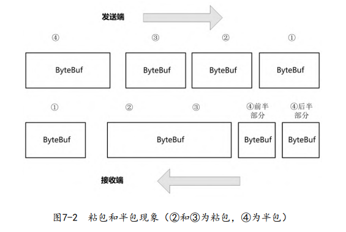

# 序列化

[TOC]

将内存中以二进制存储的对象，序列化为字符流，便于存储和网络传输。

序列化框架有：

- JSON / XML：可读性较强，但性能稍差
- Java内置的序列化机制：无法跨语言
- 二进制的序列化，例如Apache Avro、 Apache Thrift、Protobuf

序列化的指标：

- 压缩率
- （反）序列化效率

## 粘包/拆包

- 粘包：发送端的多个包被结合成了一个包
- 半包：发送端的一个包被拆分成了多个包

粘包问题是由于`TCP` 使用的 `Nagle` 算法，它减少网络中小数据分组的数量。半包是因为数据大于协议的 `MTU（Maximum Transmission Unit）`，必须拆包。总而言之，`TCP` 是流式协议，消息无边界。而`UDP`无粘包、半包问题。

只能在应用协议层面上来解决。

## JSON

几种JSON框架：Jackson、Gson、FastJson

~~~java
GsonBuilder builder = new GsonBuilder();
builder.create().toJson(obj);

JsonObject.parseObject(json, object.class);
~~~

## Protobuf

Protobuf具有以下特点：

- 跨语言平台：支持Java、C++、Python、JavaScript等多种语言
- 高效
- 扩展性

Protobuf使用proto文件来定义消息的格式。示例：

~~~protobuf
syntax = "proto3";
//为消息指定包，避免消息名冲突
package com.crazymakercircle.netty.protocol;

// 指定生成的Java类所要存放的包路径
option java_package = "com.crazymakercircle.netty.protocol";
// 指定生成的Java类的类名
option java_outer_classname = "MsgProtos";

message Msg {
 uint32 id = 1; //消息ID
 string content = 2; //消息内容
}
~~~

消息字段的限定修饰符：

- repeated：表示该字段可以包含0~N个元素值，相当于 Java中的List
- singular（默认）：表示该字段可以包含0~1个元素值。
- reserved：指定保留字段名称（Field Name）和分配标识号（Assigning Tags），用于将来的扩展。

 在消息定义中，每个字段都有唯一的一个数字标识符——分配标识号，它用于在消息的二进制格式中识别各个字段的。分配标识号的取值范围为1 ~  $2^{32}$。其中，编号 $[1, 15]$之内的分配标识号，在编码的时候只会占用一个字节，$[16, 2047]$之内的标识号要占用两个字节。另外，$[1900, 2000]$之内的标识号为Protobuf内部保留值，不建议使用。

proto文件支持嵌套消息：

~~~protobuf
message Outer { //Level 0
    message MiddleA{ //Level 1
        message Inner { //Level 2
            int64 ival = 1;
            bool booly = 2;
        }
    }
    message MiddleB{ //Level 1
    	message Inner { //Level 2
    		int32 ival = 1;
    		bool booly = 2;
    	}
    }
}

// 访问内部消息 Outer.MiddleA.Inner ref = 1;
~~~

枚举：

~~~protobuf
enum VoipProtocol {
    H323 = 1;
    SIP = 2;
    MGCP = 3;
    H248 = 4;
}
~~~

默认值：

~~~protobuf
optional int32 result_per_page = 3 [default = 10];
~~~

如果没有为optional的元素指定默认值，就会使用与特定类型相关的默认值：对string来说，默认值是空字符串。

Protobuf为每个message结构体生成POJO类以及Builder类。有两种方式来生成它们（都需要可执行文件，下载地址https://github.com/protocolbuffers/protobuf/releases）：

- 控制台命令
- Maven插件

~~~xml
<groupId>org.xolstice.maven.plugins</groupId>
<artifactId>protobuf-maven-plugin</artifactId>
<version>0.5.0</version>
<extensions>true</extensions>
<configuration>
    <!--proto文件路径-->
    <protoSourceRoot>${project.basedir}/protobuf</protoSourceRoot>

    <!--生成的POJO类和Builder类的目标路径-->
    <outputDirectory>${project.build.sourceDirectory}</outputDirectory>

    <!--设置在生成Java文件之前,是否清空outputDirectory的文件-->
    <clearOutputDirectory>false</clearOutputDirectory>

    <!--临时目录-->
    <temporaryProtoFileDirectory>
        ${project.build.directory}/protoctemp
    </temporaryProtoFileDirectory>

    <!--protoc可执行文件路径-->
    <protocExecutable>
        ${project.basedir}/protobuf/protoc3.6.1.exe
    </protocExecutable>
</configuration>

<executions>
    <execution>
        <goals>
            <goal>compile</goal>
            <goal>test-compile</goal>
        </goals>
    </execution>
</executions>
~~~

这些内容在`<build><plugins><plugin>`标签下

Maven依赖

~~~xml
<dependency>
    <groupId>com.google.protobuf</groupId>
    <artifactId>protobuf-java</artifactId>
    <version>${protobuf.version}</version>
</dependency>
~~~

在项目中根目录执行`mvn protobuf:compile`后，`MsgProtos.java`文件出现在了对应的包中

MsgProtos使用示例：

~~~java
public static MsgProtos.Msg buildMsg() {
    MsgProtos.Msg.Builder builder = MsgProtos.Msg.newBuilder();
    builder.setId(100);
    builder.setContent("Java");
    return builder.build();
}
~~~

将Protobuf对象序列化：

~~~java
//序列化到二进制字节数组
MsgProtos.Msg message = buildMsg();
byte[] data = message.toByteArray();
~~~

~~~java
//序列化到流
ByteArrayOutputStream outputStream = new
ByteArrayOutputStream();
message.writeTo(outputStream);
~~~

~~~java
message.writeDelimitedTo(outputStream);
~~~

反序列化：

~~~java
MsgProtos.Msg inMsg = MsgProtos.Msg.parseFrom(data);
~~~

~~~java
MsgProtos.Msg inMsg = MsgProtos.Msg.parseFrom(inputStream);
~~~

~~~java
MsgProtos.Msg.parseDelimitedFrom(inputStream);
~~~

writeDelimitedTo会先写入一个 varint32 类型的对象，表示消息长度。而writeTo就直接写入消息。因此，通过writeTo在同一个 `OutputStream` 中连续写入多个消息，将无法确定哪个字节属于哪个消息。

注：varint32会根据值的大小自动进行收缩。

### Netty

Netty默认支持Protobuf的编码与解码

ProtobufEncoder编码器的相关源码

~~~java
public class ProtobufEncoder extends MessageToMessageEncoder<MessageLiteOrBuilder> {
    public ProtobufEncoder() {
    }

    protected void encode(ChannelHandlerContext ctx, MessageLiteOrBuilder msg, List<Object> out) throws Exception {
        if (msg instanceof MessageLite) {
            out.add(Unpooled.wrappedBuffer(((MessageLite)msg).toByteArray()));
        } else {
            if (msg instanceof MessageLite.Builder) {
                out.add(Unpooled.wrappedBuffer(((MessageLite.Builder)msg).build().toByteArray()));
            }

        }
    }
}
~~~

ProtobufDecoder解码器示例：

~~~java
new ProtobufDecoder(MsgProtos.Msg.getDefaultInstance())
~~~

上面这组编码器和解码器存在粘包/半包的问题。我们可以使用`ProtobufVarint32LengthFieldPrepender`以及 `ProtobufVarint32FrameDecoder`来解决这个问题。它们就是简单的Head-Content (Length + Protobuf Data)数据传输协议 。对复杂Head-Content协议的解析，则需要自定义Protobuf解/编码器了。

## 格式的设计

原则一：定义一个枚举类型，表示消息的类型

~~~protobuf
enum HeadType {
    LOGIN_REQUEST = 0; 		//登录请求
    LOGIN_RESPONSE = 1; 	//登录响应
    LOGOUT_REQUEST = 2; 	//登出请求
    LOGOUT_RESPONSE = 3; 	//登出响应
    KEEPALIVE_REQUEST = 4; 	//心跳请求
    KEEPALIVE_RESPONSE = 5; //心跳响应
    MESSAGE_REQUEST = 6; 	//聊天消息请求
    MESSAGE_RESPONSE = 7; 	//聊天消息响应
    MESSAGE_NOTIFICATION = 8; //服务器通知
}
~~~

原则二：一个Protobuf消息结构对应一个消息类型

对应于登录请求（LOGIN_REQUEST）类型的消息，其消息结构如下

~~~protobuf
/*登录请求信息*/
message LoginRequest {
    string uid = 1; 		//用户唯一ID
    string deviceId = 2;	//设备ID
    string token = 3; 		//用户token
    uint32 platform = 4; 	//客户端平台 Windows、Android
    string appVersion = 5; 	//APP版本号
}
~~~

原则三：对于响应消息，添加成功标记和应答序号

对应于聊天响应（MESSAGE_RESPONSE）类型的消息，其消息结构可以设计如下：

~~~protobuf
message MessageResponse {
    bool result = 1; //true表示发送成功，false表示发送失
    败
    uint32 code = 2; //错误码
    string info = 3; //错误描述
    uint32 expose = 4; //错误描述是否提示给用户: 1 提示; 0 不提示
    bool lastBlock = 5; 	//是否为最后的应答
    fixed32 blockIndex = 6; //应答的序号
}	

~~~

原则四：编解码从顶层消息开始

~~~protobuf
message Message {
    HeadType       type = 1; 		//通用字段: 消息类型
    uint64         sequence = 2;  	//通用字段：消息序列号
    string         session_id = 3;  //通用字段：会话id
    
    LoginRequest   loginRequest = 4;   
    LoginResponse  loginResponse = 5;   
    MessageRequest  messageRequest = 6;    
    MessageResponse  messageResponse = 7;      
    MessageNotification  notification = 8;        
    MessageHeartBeat     heartBeat = 9;  
}
~~~

