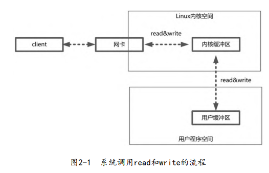
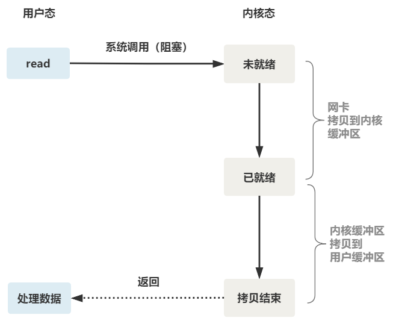
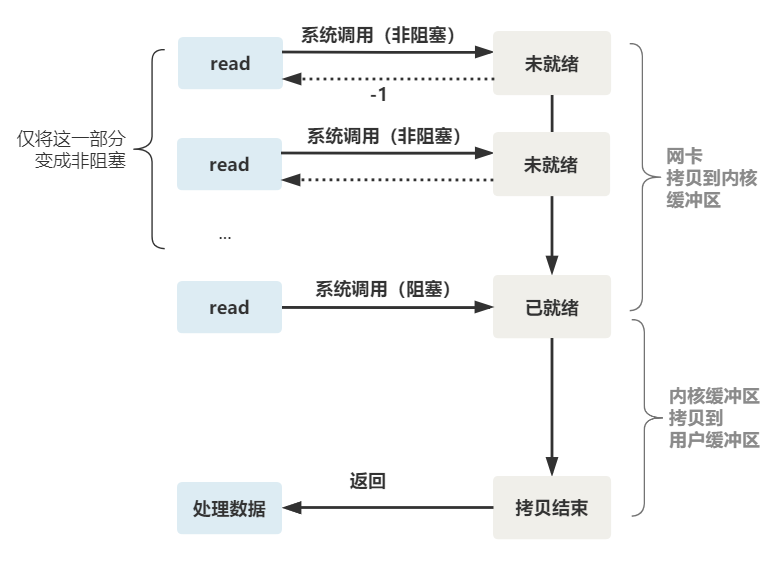
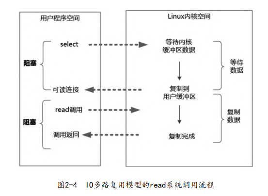
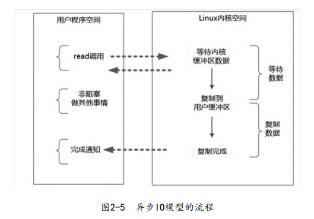
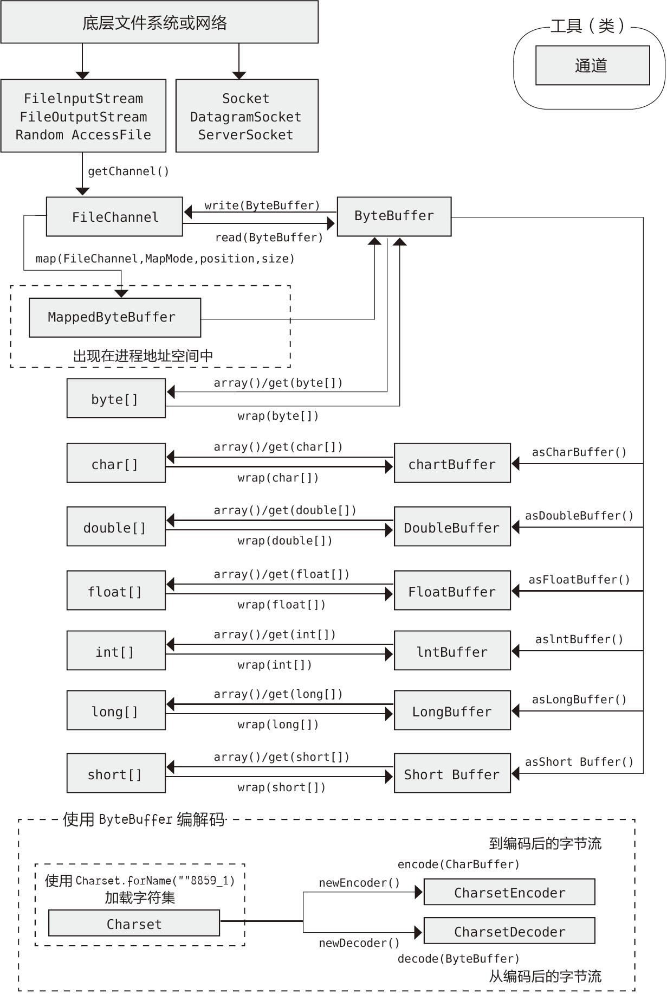
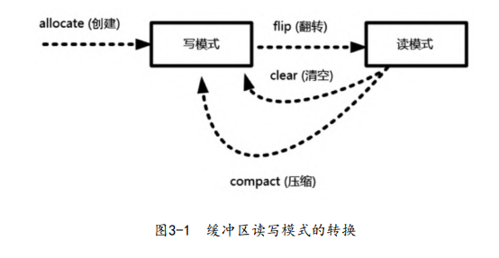
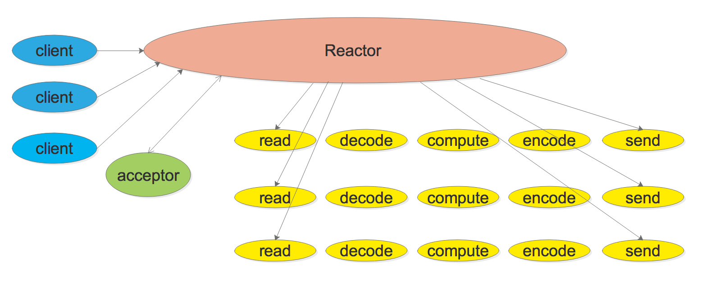
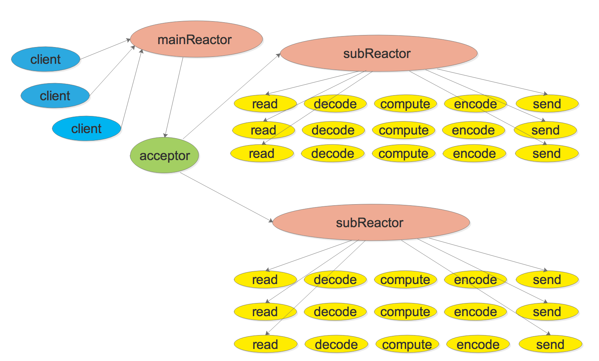
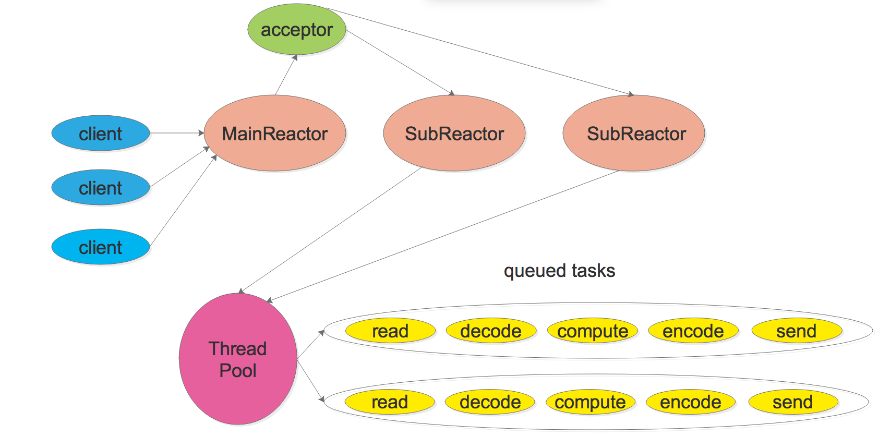

# 高并发初步

[TOC]

## 初步

`Redis` 是 `Remote Dictionary Server`（远程字典服务器）的缩写，该框架是缓存方案的事实标准。

`ZooKeeper`是分布式协调工具。它保证在读取数据时，不会产生起“脏读”，“幻读”，“不可重复读”问题。

## IO原理

操作系统将虚拟内存划分为两部分：一部分是内核空间（KernelSpace），另一部分是用户空间（User-Space）。程序通过系统调用syscall，来访问操作系统所提供的服务。并且操作系统禁止应用程序直接访问操作系统的资源（内存、设备）。

read、write系统调用并不直接读写物理设备，而是直接访问对应的缓冲区。以`read()`调用为例，它把数据从内核缓冲区复制到应用程序的进程缓冲区。而内核缓冲区与物理设备之间的数据传输由内核来完成。

为了弥补CPU与设备之间的性能鸿沟，以及解决频繁的中断而造成的上下文切换、缓存冲刷的性能问题，操作系统引入了内核缓冲区。操作系统会监控着内核缓冲区，当满足条件时，会集中处理IO写请求操作。

中断的处理分为上下两个部分：

- **上半部**(top half)：运行中断处理程序，需要运行快，处理重要的事务。
- **下半部**(bottom half)：允许稍后完成的工作会推迟到下半部中。下半部可以被中断

四种IO模型

- 同步阻塞IO

  

- 同步非阻塞（NIO）

  

- IO多路复用，它可以避免同步非阻塞IO模型中轮询等待问题，核心思路是由内核来负责轮询等待的工作。我们以select系统调用为例

  ~~~c
  int select(
      int fd_max, 
      fd_set *readfds, 
      fd_set *writefds, 
      fd_set *exceptfds, 
      struct timeval *timeout);
  ~~~

  - `readfds`：文件描述符集合，检查该组文件描述符的可读性。
  - `writefds`：文件描述符集合，检查该组文件描述符的可写性。
  - `exceptfds`：文件描述符集合，检查该组文件描述符的异常条件。
  - `timeout`
    - 值为NULL，则将select()函数置为阻塞状态，当监视的文件描述符集合中的某一个描述符发生变化才会返回结果并向下执行。
    - 值等于0，则将select()函数置为非阻塞状态，执行select()后立即返回，无论文件描述符是否发生变化。
    - 值大于0，则将select()函数的超时时间设为这个值，在超时时间内阻塞，超时后返回结果。

  

  ~~~c
  #include <sys/time.h>
  #include <stdio.h>
  #include <fcntl.h>
  
  int main()
  {
      int fd_key, ret;
      char value;
      fd_set readfd;
      fd_key = open("/dev/tty", O_RDONLY);
      
      struct timeval timeout;
      timeout.tv_sec = 1;
      timeout.tv_usec = 0;
  
      while(1){
          FD_ZERO(&readfd);                       /* 清空文件描述符集合 */
          FD_SET(fd_key, &readfd);                /* 添加文件描述符到集合 */
  
          ret = select(fd_key + 1, &readfd, NULL, NULL, &timeout);
          /* 测试fd_key是否在描述符集合中 */
          if(FD_ISSET(fd_key, &readfd)){          
              read(fd_key, &value, 1);  
  			if('\n' == value){
  				continue;
  			}
  			printf("ret = %d, fd_key = %d, value = %c\n", ret, fd_key, value);
          }
      }
  }
  ~~~

  

  

  可以看出几个细节：

  1. select 在内核层仍然是以遍历的方式来检查文件描述符的就绪状态
  2. select 仅仅返回可读文件描述符的个数，具体哪个可读还是要用户自己遍历
  3. select 调用需要传入 fd 数组，需要拷贝一份到内核，高并发场景下这样的拷贝所消耗的资源是不可接受的。

  也就是说，操作系统提供了IO多路复用，使得原来的 while 循环里多次系统调用，变成了一次系统调用 + 内核层遍历这些文件描述符。

  

  

  epoll系统调用针对上述提及的三个细节做了改进

  - 内核中保存一份文件描述符集合，无需用户每次都重新传入，只需告诉内核修改的部分即可。
  - 内核不再通过轮询的方式找到就绪的文件描述符，而是通过异步 IO 事件唤醒。
  - 内核仅会将有 IO 事件的文件描述符返回给用户，用户也无需遍历整个文件描述符集合。

  

  

- 异步非阻塞IO（Asynchronous IO）

  异步IO模型的基本流程是：用户线程通过系统调用向内核注册某 个IO操作。内核在整个IO操作（包括数据准备、数据复制）完成后通知用户程序，用户执行后续的业务操作。

  

- **阻塞**是指用户程序等待内核IO操作彻底完成后，才返回到用户空间；
- **非阻塞**是指用户程序无需等待内核IO操作的完成，便可返回用户态继续执行，与此同时，内核会返回给用户一个IO状态值，用于指示IO操作是否完成。
- **同步**是指用户空间是主动发起IO请求的一方，
- **异步**是指内核是主动发起IO请求的一方。

`ulimit -n 1000` 表示设置进程的文件描述符数量的上限为1000，默认值为1024。不过这个命令仅对当前会话有效。可以在`/etc/rc.local`中添加`ulimit -SHn 1000000`即可永久修改该配置。其中，选项`-S`表示软性极限值，`-H`表示硬性极限值。

## NIO

Java NIO类库包含以下三个核心组件：

- Channel（通道） ：类似于InputStream和OutputStream的结合体

- Buffer（缓冲区） ：所谓的通道读取，实际上是将数据从通道读取到缓冲区中。而通道写入，是将数据从缓冲区写入到通道中。

- Selector（选择器）：

  1. 把通道注册到选择器中
  2. 通过选择器所提供的事件查询（select）方法，来查询这些已注册的通道是否有就绪的IO事件（例如可读、可写、网络连接完成等）

  通常来说，一个线程拥有一个Selector，而Selector可以监控多个Channel

面向流：传输单位为字符或者字节；面向缓冲区：传输单位为缓冲区。此外，旧IO的传输是单向的，而NIO的传输是双向的。

NIO是基于IO多路复用模型的

### Buffer

Buffer是非线程安全的

缓冲区有两个核心方法：

- `put()`：存入数据到缓冲区中
- `get()`：获取缓冲区中的数据。如果无数据可以获取，那么就会抛出`BufferUnderflowException`异常

这两个方法都会改变`position`

缓冲区中的四个核心属性（索引）：

- `capacity`：缓冲区的最大容量。声明后不能更改。
- `limit`：缓冲区中可以读写的最大范围。
- `position`：下一个要读写的位置
- `mark`：标记一个位置。

这四个属性所满足的约束：
$$
0 <= mark <= position <= limit <= capacity
$$

下表列出了用于访问索引的方法：

| 方法                | 作用                                                         |
| :------------------ | :----------------------------------------------------------- |
| `capacity()`        | 返回缓冲区的`capacity`                                       |
| `clear()`           | 清空缓冲区，将`position`设置为0，将`limit`设置为`capacity`。可以调用该方法来覆盖已有的缓冲区 |
| `flip()`            | 将`limit`设置为`position`，`position`设置为0，清除`mark`。该方法用于让缓冲区在数据写入完成后，进入准备读取的就绪状态 |
| `limit()`           | 返回`limit`的值                                              |
| `limit(int lim)`    | 设置`limit`的值                                              |
| `mark()`            | 将`mark`设置为`position`                                     |
| `position()`        | 返回`position`的值                                           |
| `position(int pos)` | 设置`position`的值                                           |
| `remaining()`       | 返回`limit` - `position`后的值（即“剩余多少元素”）           |
| `hasRemaining()`    | 如果在`position`和`limit`之间存在任何元素（即“还有剩余元素”），则返回`true` |
| ` reset()`          | 将`position`恢复到 `mark` 的位置。                           |
| `rewind()`          | `position`重置为0，清除`mark`。                              |
| `compact()`         | 将 position 与 limit 之间的数据复制到buffer的开始位置，`position = limit - position`， `limit = capaciy` |

如何创建Buffer

- 数组的`wrap()`方法

  ~~~java
  IntBuffer intBuffer = IntBuffer.wrap(new int[]{1, 2});
  ByteBuffer byteBuffer = ByteBuffer.wrap("Some text".getBytes());
  ~~~

- 通过Channel来获取

  ~~~java
  //创建RandomAccessFile随机访问对象
  RandomAccessFile rFile = new RandomAccessFile("filename.txt", "rw");
  
  //获取文件流的通道（可读可写）
  FileChannel channel = rFile.getChannel();
  
  ByteBuffer buf = ByteBuffer.allocate(CAPACITY);
  int length = -1;
  while ((length = channel.read(buf)) != -1) {
      // 省略buf中的数据处理
  }
  ~~~

- ByteBuffer.allocate()静态方法

  ~~~java
  public static ByteBuffer allocate(int capacity)  
  public static ByteBuffer allocateDirect(int capacity)  
  ~~~

  `allocate()`返回的是`HeapByteBuffer`对象，而`allocateDirect()`返回的是`DirectByteBuffer`对象，这个对象是在JVM堆外分配的。

  

  如果你是使用`HeapByteBuffer`与Channel打交道，那么每一次IO调用都会执行下列步骤（以写操作为例）：

  - 创建一个临时的DirectBuffer对象
  - 将HeapByteBuffer内的内容复制到DirectBuffer中
  - 用这个临时的DirectBuffer对象作为IO操作的参数
  - 对这个DirectBuffer对象进行垃圾收集。

  由于缓存，这个临时的`DirectBuffer`可以重复使用。此外，还有一些优化策略使得`HeapByteBuffer`性能开销不至于很大。

  虽然`DirectByteBuffer`可以优化IO性能，但是它的创建与销毁的性能损耗比`HeapByteBuffer`的多。

  

  至于使用allocate()还是allocateDirect()，我的建议是**first make it work, then make it fast.**

### Channel

`java.nio.channels.Channel` 包下Channel类型：

- `FileChannel`：用于读写文件
- `SocketChannel`：用于读写套接字TCP连接
- `ServerSocketChannel`：用于监听TCP连接
- `DatagramChannel`：用于读写UDP连接

从操作系统的角度来说，一个NIO Channel表示一个文件描述符。

如何获取`Channel`

- `FileInputStream`、`FileOutputStream`、`RandomAccessFile`以及`Socket`等，它们都提供了`getChannel() `来方法获取通道。

  ~~~java
  try(
      FileChannel fileChannel = new FileOutputStream(name).getChannel();
      FileChannel fileChannel = new FileInputStream(name).getChannel();
      FileChannel fileChannel2 = new RandomAccessFile(name , "rw").getChannel();
  ) {
      
  } catch (IOException e) {
      throw new RuntimeException(e);
  }
  ~~~

  

#### FileChannel

从FileChannel中读取：

~~~java
//创建RandomAccessFile随机访问对象
RandomAccessFile rFile = new RandomAccessFile("filename.txt", "rw");

//获取文件流的通道（可读可写）
FileChannel channel = rFile.getChannel();

ByteBuffer buf = ByteBuffer.allocate(CAPACITY);
int length = -1;
while ((length = channel.read(buf)) != -1) {
    // 省略buf中的数据处理
}

//关闭通道
channel.close();
~~~

此时`Channel`处于读模式，而`ByteBuffer`处于写模式。

向FileChannel中写入：

~~~java
int outlength = 0;
//调用write()方法，将buf的数据写入通道
while ((outlength = outchannel.write(buf)) != 0) {
 	
}

//关闭通道
channel.close();
~~~

强制刷新到磁盘

~~~java
channel.force(true);
~~~

#### Transfer

有时候我们需要将一个Channel作为另一个Channel的输入，那么我们会写出以下代码：

~~~java
FileChannel in = new FileInputStream("...").getChannel();
FileChannel out = new FileOutpuStream("..."),getChannel();
~~~

~~~java
ByteBuffer buffer = ByteBuffer.allocate(BSIZE);
while(in.read(buffer) != -1) {
    buffer.flip(); // 准备写
    out.write(buffer);
    buffer.clear();  // 准备读
}
~~~

可以用`transferTo`或`transferFrom`来完成这一任务

~~~Java
public abstract long transferTo (long position, long count, WritableByteChannel target);

public abstract long transferFrom (ReadableByteChannel src, long position, long count);
~~~

~~~java
in.transferTo(0, in.size(), out);
out.transferFrom(in, 0, in.size());
~~~

#### SocketChannel

`SocketChannel`以及`ServerSocketChannel`都支持非阻塞模式：`socketChannel.configureBlocking(false)`

客户端代码

~~~java
SocketChannel socketChannel = SocketChannel.open();
socketChannel.configureBlocking(false);
socketChannel.connect(new InetSocketAddress("127.0.0.1", 80));

// 在非阻塞情况下，socketChannel.connect()方法直接返回
// 因此需要不断地自旋，检查当前是否连接到了主机
// 一般是在finishConnect后，再调用configureBlocking
while (!socketChannel.finishConnect()) {

}

ByteBufferbuf buffer = ByteBuffer.allocate(1024);
socketChannel.write(buffer);

// socketChannel.shutdownOutput() 方法来关闭输出流（可选）。这实际上会发送一个 TCP FIN 到对端，告知它不再有更多的数据需要发送。但是仍然可以接收到服务端的消息
socketChannel.shutdownOutput();

// 关闭套接字连接
IOUtil.closeQuietly(socketChannel);
~~~

服务端代码：

~~~java
//创建 ServerSocketChannel
ServerSocketChannel serverSocketChannel = ServerSocketChannel.open();
serverSocketChannel.configureBlocking(false);

// 绑定监听端口，例如8080端口
serverSocketChannel.socket().bind(new InetSocketAddress(8080));

while(true){
    // 监听新进来的连接
    SocketChannel socketChannel = serverSocketChannel.accept();

    // 异步模型下，accept 方法会立刻返回，如果还没有新进来的连接，则返回null
    if(socketChannel != null) {
        ByteBuffer buf = ByteBuffer.allocate(48);
        int bytesRead = socketChannel.read(buf);
        // 处理数据
        socketChannel.close();   // 一定要记得关闭
    }
}
~~~

#### DatagramChannel

~~~
DatagramChannel channel = DatagramChannel.open();
channel.socket().bind(new InetSocketAddress(18080));
~~~

从DatagramChannel读取数据

~~~java
ByteBuffer buf = ByteBuffer.allocate(1024);
SocketAddress clientAddr = datagramChannel.receive(buf);
~~~

向DatagramChannel写入数据

~~~java
// 由于UDP并不是面向连接的，因此要指定接收方的IP地址
channel.send(buffer, new InetSocketAddress("127.0.0.1",18899));
~~~

### Selector

选择器的使用：

1. 调用静态工厂方法open()来获取Selector实例 

   ~~~java
   Selector selector = Selector.open()
   ~~~

2. 将通道注册到选择器中。**一个选择器持有多个通道。**

   通过`SelectionKey Channel#register(Selector sel，int ops)`方法，便可以向一个`Selector`注册`Channel`，其中`ops`表示IO事件类型，包括：

   1. 可读：`SelectionKey.OP_READ`
   2. 可写：`SelectionKey.OP_WRITE`
   3. 连接：`SelectionKey.OP_CONNECT`
   4. 接收：`SelectionKey.OP_ACCEPT`

   通过`|`运算符，可以监控多个IO事件，例如：

   ~~~java
   int key = SelectionKey.OP_READ | SelectionKey.OP_WRITE;
   ~~~

   这里的**IO事件指的是Channel具备执行某个IO操作的条件**，例如：

   - 如果 SocketChannel 完成了三次握手过程，就会发生OP_CONNECT事件
   - 如果 ServerSocketChannel 在监听到一个新连接到来时，就会发生OP_ACCEPT事件
   - 一个 SocketChannel 通道有数据可读，就会发生OP_READ事件
   - 一个 SocketChannel 通道等待数据写入，就会发生OP_WRITE事件
   
   `SelectionKey`实际上表示一个`SelectableChannel`在一个`Selector`中的注册情况。
   
   
   
   只有继承抽象类`SelectableChannel`的Channel，才可以向Selector注册。而FileChannel就不支持Selector。
   
3. `SelectionKey#interestOps(int ops)`方法设置Channel感兴趣的IO事件

4. 通过 Selector 的 `select()` 方法，获取是否有已就绪的IO事件。然后调用`selectedKeys()`获取就绪IO事件所对应的SelectionKey，即Channel已经准备好进行某些IO操作

   ~~~java
   while (selector.select() > 0) {
   	Set selectedKeys = selectorselectedKeys();
       Iterator keyIterator = selectedKeys.iterator();
       while (keyIterator.hasNext()) {
           SelectionKey key = keyIterator.next();
           if (key.isAcceptable()) {
               //IO事件：ServerSocketChannel服务器监听通道有新连接
           }
           
           if (key.isConnectable()) {
            	//IO事件：传输通道连接成功
           } 
           
           if (key.isReadable()) {
            	//IO事件：传输通道可读
           } 
           
           if (key.isWritable()) {
            	//IO事件：传输通道可写
           }
           //处理完成后，移除选择键
           keyIterator.remove();
       }
   }
   ~~~
   
   `select()`方法有多个重载
   
   - select()：阻塞调用，直到至少有一个通道发生了注册的IO 事件。
   - select(long timeout)
   - selectNow()

SelectionKey还有两个重要方法：

- `void attach(Object o)`：将对象附加到Key上。
- `Object attachment()`：从Key中获取附加对象。

一个SelectionKey代表着一个Channel。

## Reactor

Reactor模式由以下两个部分组成

- Reactor负责响应IO事件，并且分发到 Handlers处理器。
- Handler非阻塞地执行业务处理逻辑。

Reactor模式通过应用IO多路复用技术，可以使用少量固定的线程（通常与 CPU 核数相等）来处理所有的客户端连接。而Connection Per Thread模式为每个请求分配一个线程，开销过大。

Reactor有几种基本的模式：

- 基本的Reactor模式（单线程Reactor）

  

  ~~~c
  while (!done)
  {
      int retval = poll(fds, nfds, timeout_ms); 
      if (retval < 0) {
        // 处理错误哦，回调用户的error handler
      } else if (retval > 0) {
        // 处理IO事件，回调用户的IO event handler
      }
  }
  ~~~

  redis就是采用的这种线程模型

- Multiple Reactors

  

  有一个main Reactor负责accept连接, 然后把该连接挂在某个 sub Reactor 中

- Multiple Reactors + 线程池(Thread Pool)

  
  
  subReactor持有多个Channel，每次向线程池提交一个Channel任务。

下面给出一个例子

~~~java
public class MultiThreadEchoServerReactor {
    ServerSocketChannel serverSocket;

    Selector[] selectors = new Selector[2];

    SubReactor[] subReactors = null;

    MultiThreadEchoServerReactor() throws IOException {
        selectors[0] = Selector.open();
        selectors[1] = Selector.open();

        serverSocket = ServerSocketChannel.open();
        InetSocketAddress address = new InetSocketAddress("127.0.0.1", 18899);
        serverSocket.socket().bind(address);
        serverSocket.configureBlocking(false);

        SelectionKey sk = serverSocket.register(selectors[0], OP_ACCEPT);
        //绑定Handler，来处理连接到来事件
        sk.attach(new AcceptorHandler());
        
        // 第一个反应器，负责监听新到的连接
        SubReactor subReactor1 = new SubReactor(selectors[0]);

        //第二个反应器，负责传输事件的分发
        SubReactor subReactor2 = new SubReactor(selectors[1]);
        
        
        subReactors = new SubReactor[]{subReactor1, subReactor2};
    }

    private void startService() {
        new Thread(subReactors[0]).start();
        new Thread(subReactors[1]).start();
    }

    // 一个Reactor对应一个线程
    class SubReactor implements Runnable {
        final Selector selector;
        public SubReactor(Selector selector) {
            this.selector = selector;
        }

        public void run() {
            try {
                while (!Thread.interrupted()) {
                    selector.select();
                    Set<SelectionKey> keySet = selector.selectedKeys();
                    Iterator<SelectionKey> it = keySet.iterator();
                    while (it.hasNext()) {
                        SelectionKey sk = it.next();
                        dispatch(sk);
                    }
                    keySet.clear();
                }
            } catch (IOException e) {
                e.printStackTrace();
            }
        }

        // 执行处理器
        void dispatch(SelectionKey sk) {
            Runnable handler = (Runnable) sk.attachment();
            if (handler != null) {
                handler.run();
            }
        }
    }

    // 处理器，负责处理新到来的连接
    class AcceptorHandler implements Runnable {
        public void run() {
            try {
                SocketChannel channel = serverSocket.accept();
                if (channel != null)
                    // 为这个请求，注册一个处理器
                    new MultiThreadEchoHandler(selectors[1], channel);
            } catch (IOException e) {
                e.printStackTrace();
            }
        }
    }

    public static void main(String[] args) throws IOException {
        MultiThreadEchoServerReactor server = new MultiThreadEchoServerReactor();
        server.startService();
    }
}

// 处理器，负责数据传输
class MultiThreadEchoHandler implements Runnable {
    final SocketChannel channel;
    final SelectionKey sk;
    final ByteBuffer byteBuffer = ByteBuffer.allocate(1024);
    static final int RECEIVING = 0, SENDING = 1;
    int state = RECEIVING;

    static ExecutorService pool = Executors.newFixedThreadPool(4);
    MultiThreadEchoHandler(Selector selector, SocketChannel c) throws IOException {
        channel = c;
        c.configureBlocking(false);
        sk = channel.register(selector, 0);
        sk.attach(this);
        sk.interestOps(SelectionKey.OP_READ);
        selector.wakeup();
    }

    public void run() {
        pool.submit(() -> asyncRun());
    }

    public synchronized void asyncRun() {
        try {
            if (state == SENDING) {
                channel.write(byteBuffer);
                //byteBuffer切换成写模式，写完后准备开始从通道读
                byteBuffer.clear();
                //写完后，注册read就绪事件
                sk.interestOps(SelectionKey.OP_READ);
                //进入接收的状态
                state = RECEIVING;
            } else {

            }
        } catch (IOException e) {
            e.printStackTrace();
        }
    }
}
~~~

