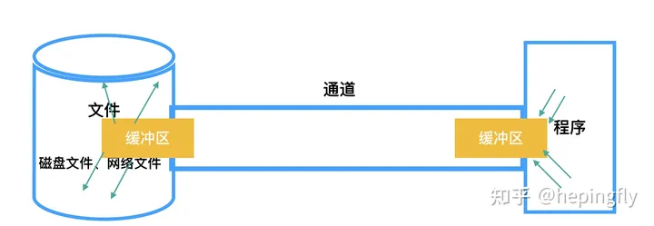
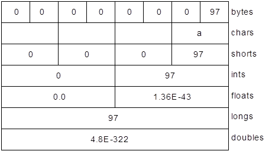

# File & IO

[TOC]

## Path

`Path`对象代表的是一个文件的或目录的路径。


构建Path对象

~~~java
Paths.get("C:\\path\\to");		 //绝对路径
Paths.get("src");				 //相对路径，相对项目工程的根目录

Path.of("C:", "path", "to");	 //推荐使用，屏蔽各个平台文件分割符的差异
Path.of("PathInfo.java");		 //构建了一个相对路径
Path.of(new URI(...));			 //根据URI构建路径
~~~


> 在Windows中，文件分割符为反斜杠`\`，而在Linux中，文件分割符为`/`。
>
> Windows文件路径示例`C:\Users\AtsukoRuo\Desktop`。
>
> 注意相对路径是相对工程根目录的，而不是代码文件所在的目录


一些转换到其他对象的方法：

~~~java
Path p = Path.of("PathInfo.java");
Path ap = p.toAbsolutePath();			//转换为绝对路径

try {	
    ap = p.toRealPath();			    //转换为绝对路径
} catch(IOException e) {
    System.out.println(e);
}

URI u = p.toUri();						//转换为URI
File f = ap.toFile();					//转换为File类型
~~~

注意：toAbsolutePath不会访问文件系统来解析路径，而是仅仅做字符串的转换，下面给出一个例子来说明

~~~java
Path p = Path.of("src", "..", "doc");
System.out.println(p.toAbsolutePath());	//C:\Users\AtsukoRuo\Desktop\spring-demo\FileDemo\src\..\doc
System.out.println(p.toAbsolutePath().normalize());	//C:\Users\AtsukoRuo\Desktop\spring-demo\FileDemo\doc
System.out.println(p.toRealPath());		//C:\Users\AtsukoRuo\Desktop\spring-demo\FileDemo\doc
~~~

可以使用`normalize`方法来消除冗余路径，例如`..`、`.`，但是这个方法仍然不访问文件系统


选择Path的片段

~~~java
Path p = Path.of("PartsOfPaths.java").toAbsolutePath();

for(int i = 0; i < p.getNameCount(); i++)
    System.out.println(p.getName(i));

System.out.println("ends with '.java': " + p.endsWith(".java"));

System.out.println(p);
for(Path pp : p) {
    System.out.print(pp + ": ");
    System.out.print(p.startsWith(pp) + " : ");
    System.out.println(p.endsWith(pp));
}

System.out.println("Starts with " + p.getRoot() + " " + p.startsWith(p.getRoot()));
~~~

注意无论是getNameCount循环，还是for-each循环，都不包括根目录！

而且endsWith不能用来判断文件后缀，因为`endsWith()`比较的是整个路径组件，而不是名字中的一个子串。


`Files`工具类中包含了一整套用于检查`Path`的各种信息的方法：

~~~java
public class PathAnalysis {
  static void say(String id, Object result) {
    System.out.print(id + ": ");
    System.out.println(result);
  }
  public static void
  main(String[] args) throws IOException {
    System.out.println(System.getProperty("os.name"));
    Path p =
      Path.of("PathAnalysis.java").toAbsolutePath();
    say("Exists", Files.exists(p));
    say("Directory", Files.isDirectory(p));
    say("Executable", Files.isExecutable(p));
    say("Readable", Files.isReadable(p));
    say("RegularFile", Files.isRegularFile(p));
    say("Writable", Files.isWritable(p));
    say("notExists", Files.notExists(p));
    say("Hidden", Files.isHidden(p));
    say("size", Files.size(p));
    say("FileStore", Files.getFileStore(p));
    say("LastModified: ", Files.getLastModifiedTime(p));
    say("Owner", Files.getOwner(p));
    say("ContentType", Files.probeContentType(p));
    say("SymbolicLink", Files.isSymbolicLink(p));
    if(Files.isSymbolicLink(p))
      say("SymbolicLink", Files.readSymbolicLink(p));
    if(FileSystems.getDefault()
       .supportedFileAttributeViews().contains("posix"))
      say("PosixFilePermissions",
        Files.getPosixFilePermissions(p));
  }
}
/* 输出：
Windows 10
Exists: true
Directory: false
Executable: true
Readable: true
RegularFile: true
Writable: true
notExists: false
Hidden: false
size: 1617
FileStore: (C:)
LastModified: : 2021-11-08T00:34:52.693768Z
Owner: GROOT\Bruce (User)
ContentType: text/plain
SymbolicLink: false
*/
~~~


~~~java
Path p1 = paths.get("a/b");
Path p2 = Paths.get("b/c");

path relative = p1.relativize(p2);	//..\..\b\c
//p1到p2的相对路径。注意p1与p2要么都是相对路径，要么都是绝对路径，否则系统会报错

Path p3 = Paths.get("C:\\src");
Path p4 = Paths.get("b");
System.out.println(p3.resolve(p4));			//C:\src\c
//合并路径，p4最好是相对路径
~~~

### 监听Path


## 目录 & 文件

**这些静态方法都是Files类的**

### 创建与删除


删除目录或者文件

~~~java
public static void delete(Path path) throws IOException
~~~


创建文件

~~~java
public static Path createFile(Path path, FileAttribute<?>... attrs)
        throws IOException
~~~


创建目录

~~~java
public static Path createDirectories(Path dir, FileAttribute<?>... attrs)
        throws IOException
~~~


创建临时文件

~~~java
public static Path createTempFile(Path dir,
                                      String prefix,
                                      String suffix,
                                      FileAttribute<?>... attrs)
        throws IOException
~~~


递归地删除目录

~~~c
public class RmDir {
    public static void rmdir(Path dir) throws IOException {
        Files.walkFileTree(dir, new SimpleFileVisitor<>() {
            @Override
            public FileVisitResult visitFile(Path file, BasicFileAttributes attrs) throws IOException {
                Files.delete(file);
                return FileVisitResult.CONTINUE;
            }

            @Override
            public FileVisitResult postVisitDirectory(Path dir) throws IOException {
                Files.delete(dir);
                return FileVisitResult.CONTINUE;
            }
        });
    }
}
~~~

- `preVisitDirectory()`：先在当前目录上运行，然后进入这个目录下的文件和目录。
- `visitFile()`：在这个目录下的每个文件上运行。
- `visitFileFailed()`：当文件无法访问时调用。
- `postVisitDirectory()`：先进入当前目录下的文件和目录（包括所有的子目录），最后在当前目录上运行。


获取Path流

~~~java
public static Stream<Path> walk(Path start, FileVisitOption... options) throws IOException			//获得包含整个目录树内容的流
    
public static DirectoryStream<Path> newDirectoryStream(Path dir) throws IOException			//获得当前目录内容的流（不考虑子目录中的内容）
~~~


### 文件系统


### 查找文件

方案一：在`Path`上调用`toString()`，然后使用`String`的各种操作来查看结果

方案二：在`FileSystem`对象上调用`getPathMatcher()`来获得一个`PathMatcher`，并传入我们感兴趣的模式。模式有两个选项：`glob`和`regex`。然后用在目录树流中

~~~java
 PathMatcher matcher = FileSystems.getDefault()
      .getPathMatcher("glob:**/*.{tmp,txt}");

Files.walk(test)
  .filter(matcher::matches)
  .forEach(System.out::println);
~~~

### 读写文件

`Files.readAllLines()`可以一次性读入整个文件（适用于小文件），

生成一个`List<String>`，每个元素代表这文件中的一行。

如果文件是大文件，可以使用`Files.lines()`将一个文件变为一个由行组成的`Stream<String>`。


~~~c
public static Path write(Path path, byte[] bytes, OpenOption... options);
public static Path write(Path path, Iterable<? extends CharSequence> lines,
                             Charset cs, OpenOption... options)
public static Path write(Path path,
                         Iterable<? extends CharSequence> lines,
                         OpenOption... options)
    
Path path = ...
byte[] bytes = ...
Files.write(path, bytes, StandardOpenOption.APPEND);
~~~

- 参数`cs`指定编码集

- 参数options

  ~~~java
  public enum StandardOpenOption implements OpenOption {
      /**
       * Open for read access.
       */
      READ,
  
      /**
       * Open for write access.
       */
      WRITE,
  
      /**
       * If the file is opened for {@link #WRITE} access then bytes will be written
       * to the end of the file rather than the beginning.
       *
       * <p> If the file is opened for write access by other programs, then it
       * is file system specific if writing to the end of the file is atomic.
       */
      APPEND,
  
      /**
       * If the file already exists and it is opened for {@link #WRITE}
       * access, then its length is truncated to 0. This option is ignored
       * if the file is opened only for {@link #READ} access.
       */
      TRUNCATE_EXISTING,
  
      /**
       * Create a new file if it does not exist.
       * This option is ignored if the {@link #CREATE_NEW} option is also set.
       * The check for the existence of the file and the creation of the file
       * if it does not exist is atomic with respect to other file system
       * operations.
       */
      CREATE,
  
      /**
       * Create a new file, failing if the file already exists.
       * The check for the existence of the file and the creation of the file
       * if it does not exist is atomic with respect to other file system
       * operations.
       */
      CREATE_NEW,
  
      /**
       * Delete on close. When this option is present then the implementation
       * makes a <em>best effort</em> attempt to delete the file when closed
       * by the appropriate {@code close} method. If the {@code close} method is
       * not invoked then a <em>best effort</em> attempt is made to delete the
       * file when the Java virtual machine terminates (either normally, as
       * defined by the Java Language Specification, or where possible, abnormally).
       * This option is primarily intended for use with <em>work files</em> that
       * are used solely by a single instance of the Java virtual machine. This
       * option is not recommended for use when opening files that are open
       * concurrently by other entities. Many of the details as to when and how
       * the file is deleted are implementation specific and therefore not
       * specified. In particular, an implementation may be unable to guarantee
       * that it deletes the expected file when replaced by an attacker while the
       * file is open. Consequently, security sensitive applications should take
       * care when using this option.
       *
       * <p> For security reasons, this option may imply the {@link
       * LinkOption#NOFOLLOW_LINKS} option. In other words, if the option is present
       * when opening an existing file that is a symbolic link then it may fail
       * (by throwing {@link java.io.IOException}).
       */
      DELETE_ON_CLOSE,
  
      /**
       * Sparse file. When used with the {@link #CREATE_NEW} option then this
       * option provides a <em>hint</em> that the new file will be sparse. The
       * option is ignored when the file system does not support the creation of
       * sparse files.
       */
      SPARSE,
  
      /**
       * Requires that every update to the file's content or metadata be written
       * synchronously to the underlying storage device.
       *
       * @see <a href="package-summary.html#integrity">Synchronized I/O file integrity</a>
       */
      SYNC,
  
      /**
       * Requires that every update to the file's content be written
       * synchronously to the underlying storage device.
       *
       * @see <a href="package-summary.html#integrity">Synchronized I/O file integrity</a>
       */
      DSYNC;
  }
  ~~~


## I/O流

### 概述

编程语言的I/O库常常会使用**流**的抽象，将任意数据源或数据接收端表达为一个具有生成或接收数据片段能力的对象。

I/O流隐藏了实际的I/O设备中下列细节：

1. 字节流用于处理原始的二进制数据。
2. 字符流用于处理字符数据。它会自动处理和本地字符集间的相互转换。
3. 缓冲区流提升了性能。它通过减少调用本地API的次数，优化了输入和输出。


I/O流要考虑以下两点：

- I/O的来源和去处：内存、文件、控制台、网络连接，等等
- 方式：顺序读取、随机访问、缓冲、字符、按行读取、按字读取


在Java中，一般会将多个I/O类分层放在一起来提供所需的功能（这便是**装饰器**设计模式），即生成一个流需要创建多个对象。在编写程序时，装饰器可以带来更大的灵活性（让你可以轻松地对属性进行混合和匹配），但也会增加代码的复杂性。


### InputStream & OutputStream

在Java 1.0中，库的设计者们选择让所有和输入相关的类都继承自`InputStream`，而所有和输出相关的类都继承自`OutputStream`

另外，`FilterInputStream`也是一种`InputStream`类型，它为“装饰器”类（用于为输入流增加属性或有用的接口）提供了基类

`InputStream`用于表示那些**从不同源生成输入**（读操作）的类。不同的**输入源**有不同的子类：

| 类                         | 功能                                                         | 构造器参数                                                   | 使用方法                                                     |
| :------------------------- | :----------------------------------------------------------- | :----------------------------------------------------------- | :----------------------------------------------------------- |
| `ByteArray-` `InputStream` | 使内存中的缓冲区可以充当`InputStream`                        | 用于提取出字节的缓冲区                                       | 作为一种数据源：通过将其连接到`FilterInputStream`对象来提供有用的接口 |
| `FileInputStream`          | 用于从一个文件中读取信息                                     | 一个用于表示文件名或`File`对象，还有`FileDescriptor`对象的字符串 | 作为一种数据源：通过将其连接到`FilterInputStream`对象来提供有用的接口 |
| `PipedInputStream`         | 用于生成写入到对应的`PipedOutputStream`中的数据。它实现了“管道传输”的概念 | `PipedOutputStream`                                          | 作为一种多线程形式的数据源：通过将其连接到`FilterInputStream`对象来提供有用的接口 |
| `FilterInputStream`        | 作为装饰器接口的抽象类，装饰器用来为其他`InputStream`类提供有用的功能。 |                                                              |                                                              |


`OutputStream`用于表示那些**向不同源生成输出**（写操作）的类。不同的**输出源**有不同的子类：

| 类                          | 功能                                                         | 构造器参数                                                   | 使用方法                                                     |
| :-------------------------- | :----------------------------------------------------------- | :----------------------------------------------------------- | :----------------------------------------------------------- |
| `ByteArray-` `OutputStream` | 在内存创建一块缓冲区，所有发送到流中的数据都被放在该缓冲区   | 缓冲区初始大小，为可选参数                                   | 用于指定数据的目的地：通过将其连接到`FilterOutputStream`对象来提供有用的接口 |
| `FileOutputStream`          | 用于向文件发送信息                                           | 用于表示文件名或`File`对象，还有`FileDescriptor`对象的字符串 | 用于指定数据的目的地：通过将其连接到`FilterOutputStream`对象来提供有用的接口 |
| `PipedOutputStream`         | 向其中写入的任何信息都将自动作为对应的`PipedInputStream`的输入。实现了“管道传输”的概念 | `PipedInputStream`                                           | 用于为多线程指定数据的目的地：通过将其连接到`FilterOutputStream`对象来提供有用的接口 |
| `FilterOutputStream`        | 作为装饰器接口的抽象类，装饰器用来为其他`OutputStream`类提供有用的功能。参见表7-4 | 参见表7-4                                                    | 参见表7-4                                                    |

`FilterOutputStream`为“装饰器”类（用于为输出流增加属性或有用的接口）提供了基类


### FilterInputStream & FilterOutputStream 装饰器类

| 类                          | 功能                                                         | 构造器参数                                    | 使用方法                                                     |
| :-------------------------- | :----------------------------------------------------------- | :-------------------------------------------- | :----------------------------------------------------------- |
| `DataInputStream`           | 与`DataOutputStream`配合使用                                 | `InputStream`                                 | 包含用于读取基本类型的全部接口                               |
| `Buffered-` `InputStream`   | 用于防止在每次需要更多数据时都进行物理上的读取（磁盘，对于内存上的缓冲是无用）。相当于声明“使用缓冲区” | `InputStream`以及可选参数：（指定）缓冲区大小 | 这本质上并未提供接口，只是为进程增加缓冲操作而已，需要与接口对象搭配使用 |
| `LineNumber-` `InputStream` | 自动追踪并维护行号,每读取一行,行号会自动加1。可以调用`getLineNumber()`和`setLineNumber(int)`手动设置行号 | `InputStream`                                 | 只是增加了行号而已，因此可能需要与接口对象搭配使用           |
| `Pushback-` `InputStream`   | 包含一个单字节回退缓冲区，用于将最后读取的字符推回输入流     | `InputStream`                                 | 通常用于编译器的扫描器，一般不会用到                         |


| 类                         | 功能                                                         | 构造器参数                                                   | 使用方法                                                     |
| :------------------------- | :----------------------------------------------------------- | :----------------------------------------------------------- | :----------------------------------------------------------- |
| `DataOutputStream`         | 与`DataInputStream`搭配使用，这样就能以可移植的方式向流中写入基本类型（`int`、`char`、`long`，等等）了 | `OutputStream`                                               | 包含用于写入基本类型数据的全部接口                           |
| `PrintStream`              | 用于生成格式化的输出。`DataOutputStream`是直接以数据的二进制来输出的，而`PrintStream`是以字符解释的形式来输出的 | `OutputStream`以及可选参数：`boolean`，表示是否在每次换行时都清空缓冲区 | 应该作为`OutputStream`对象的“最终”包装。可能会经常用到       |
| `Buffered-` `OutputStream` | 声明“使用缓冲”。可以调用`flush()`来清空缓冲区                | `OutputStream`以及可选参数：（指定）缓冲区大小               | 这本质上并未提供接口，只是为进程增加缓冲操作而已，需要与接口对象搭配使用 |


下面是一个简单的示例：

~~~java
class BufferedInputFile {
    public static String read(String filename) {
        try (BufferedReader in = new BufferedReader(new FileReader(filename))) {
            return in.lines().collect(Collectors.joining("\n"));
        } catch (IOException e) {
            throw new RuntimeException(e);
        }
    }
    public static void main(String[] args){
        System.out.println(read("src\\BufferedInputFile.java"));
    }
}

public class FormattedMemoryInput {
  public static void main(String[] args) {
    try(
      DataInputStream in = new DataInputStream(
          new ByteArrayInputStream(BufferedInputFile
                                   .read("FormattedMemoryInput.java")
                                   .getBytes()))
    ) {
      while(true)
        System.out.write((char)in.readByte());
    } catch(EOFException e) {
      System.out.println("\nEnd of stream");
    } catch(IOException e) {
      throw new RuntimeException(e);
    }
  }
}

public class TestEOF {
  public static void main(String[] args) {
    try(
      DataInputStream in = new DataInputStream(
        new BufferedInputStream(
          new FileInputStream("TestEOF.java")))
    ) {
      while(in.available() != 0)
        System.out.write(in.readByte());
    } catch(IOException e) {
      throw new RuntimeException(e);
    }
  }
}
~~~


注意，`available()`的工作方式会随着所读取媒介类型的不同而有所不同——该方法的字面意思是“**在没有阻塞的情况下**所能读取的字节数量”。对于文件来说，这意味着整个文件，但是对于不同类型的流来说，则可能并不是这样。


还有DataOutputStream的`writeUTF()`和`readUTF()`使用的是一种适用于Java的特殊UTF-8变体（JDK文档中有关于这些方法的描述），因此如果你用非Java程序来读取用`writeUTF()`写入的字符串，就必须编写特殊的代码来妥当地读取该字符串。

### Reader & Writer

Java 1.1对基础流式I/O库进行了重大的修改。`InputStream`和`OutputStream`类仍然以**面向字节**（8位字节流）的I/O的形式提供了有价值的功能。而`Reader`和`Writer`类则提供了兼容Unicode（国际化）并且基于字符的I/O能力（**面向字符**）。


| 来源和去处：Java 1.0中的类           | Java 1.1中对应的类   |
| :----------------------------------- | :------------------- |
| `InputStream                         | `InputStreamReader`  |
| `OutputStream`                       | `OutputStreamWriter` |
| `FileInputStream`                    | `FileReader`         |
| `FileOutputStream`                   | `FileWriter`         |
| `StringBufferInputStream` （已弃用） | `StringReader`       |
| （没有对应的类）                     | `StringWriter`       |
| `ByteArrayInputStream`               | `CharArrayReader`    |
| `ByteArrayOutputStream`              | `CharArrayWriter`    |
| `PipedInputStream`                   | `PipedReader`        |
| `PipedOutputStream`                  | `PipedWriter`        |


改变流的行为

| 过滤器：Java 1.0中的类             | Java 1.1中对应的类                                           |
| :--------------------------------- | :----------------------------------------------------------- |
| `FilterInputStream`                | `FilterReader`                                               |
| `FilterOutputStream`               | `FilterWriter`                                               |
| `BufferedInputStream`              | `BufferedReader`                                             |
| `BufferedOutputStream`             | `BufferedWriter`                                             |
| `DataInputStream`                  | `DataInputStream` 不推荐使用，毕竟Reader & Writer是面向字符流的，不应该与底层二进制数据打交道。 |
| `DataOutputStream`                 | 无                                                           |
| `PrintStream`                      | `PrintWriter`                                                |
| `LineNumberInputStream` （已弃用） | `LineNumberReader`                                           |
| `StreamTokenizer`                  | `StreamTokenizer` （使用以`Reader`作为参数的构造器）         |
| `PushbackInputStream`              | `PushbackReader`                                             |


### RandomAccessFile

`RandomAccessFile`适合用来处理由大小已知的记录组成的文件，由此可以通过`seek()`在各条记录上来回移动，然后读取或者修改记录


~~~java
String file = "";
try(
      RandomAccessFile rf =
        new RandomAccessFile(file, "r")
) {
      System.out.println("Value " + i + ": " + rf.readDouble());
} catch(IOException e) {
      throw new RuntimeException(e);
}
~~~


### 标准IO

**标准I/O**（standard I/O）指的是UNIX中“程序所使用的单一信息流”这个概念。程序的所有输入都可以来自**标准输入**，所有输出都可以发送到**标准输出**，所有错误都可以发送到**标准错误**。标准I/O的价值在于可以很容易地使多个程序串联起来，一个程序的标准输出可以成为另一个程序的标准输入。

遵循标准I/O模型，Java实现了`System.in`、`System.out`，以及`System.err`。其中`System.out`已经被预先包装为`PrintStream`对象。`System.err`也同样是一个`PrintStream`，但是`System.in`是未经包装的原生`InputStream`。这意味着虽然可以随时使用`System.out`和`System.err`，但是`System.in`则必须在读取前先进行包装。


从标准输入中读取

~~~java
BufferedReader br = new BufferReader(new InputStreamRead(System.in));
~~~

向标准输出中写入

~~~java
PrintWriter out = new PrintWriter(System.out, true);
~~~

第二个参数设为`true`来开启自动清空的功能。否则可能就看不到输出。


Java的`System`类可以通过简单的静态方法调用对标准输入、标准输出以及标准错误的I/O标准流进行重定向：

- `setIn(InputStream)`
- `setOut(PrintStream)`
- `setErr(PrintStream)`

~~~java
PrintStream console = System.out;
try (
    BufferedInputStream in = new BufferedInputStream(
            new FileInputStream("Redirecting.java"));
    PrintStream out = new PrintStream(
            new BufferedOutputStream(
                    new FileOutputStream("src\\Redirecting.txt")
            ))) {
    System.setIn(in);
    System.setOut(out);
    System.setErr(out);

    new BufferedReader(new InputStreamReader(System.in))
            .lines()
            .forEach(System.out::println);
} catch (IOException e) {
    throw new RuntimeException(e);
} finally {
     System.setOut(console);
}
~~~


## 进程控制

Java库提供了一些类，可以执行其他程序，并控制这些程序的输入和输出。

下面通过一个例子来初步学习如何使用这些类：

~~~java
//表示进程出现了错误
class OSExecuteException extends RuntimeException {		
    public OSExecuteException(String why) {
        super(why);
    }
}


public class OSExecute {
    public static void command(String command) {
        boolean err = false;
        try {
            Process process = new ProcessBuilder(command.split(" ")).start();
            try (
               BufferedReader results = new BufferedReader(new InputStreamReader(process.getInputStream()));
               BufferedReader errors = new BufferedReader(new InputStreamReader(process.getErrorStream()));
            ) {
                results.lines().forEach(System.out::println);
                err = errors.lines().peek(System.err::println).count() > 0;
            }
        } catch (IOException e) {
            throw new RuntimeException(e);
        }
        if (err) throw new OSExecuteException("Errors executing " + command);
    }
}
~~~


## NIO

Java NIO（New IO）是从 Java 1.4 版本开始引入的一个新的 IO API。NIO 系统的核心在于：**通道（Channel）和缓冲区（Buffer）**。其中，通道表示程序与IO设备（例如：文件、套接字）之间的连接。总之**Channel 负责传输，Buffer 负责存储**。

> 实际上，“旧”的I/O包已经用`nio`重新实现过了，以利用其带来的速度优势。只有在遇到性能问题，才使用nio




面向流：传输单位为字符或者字节；面向缓冲区：传输单位为缓冲区。此外，旧IO的传输是单向的，而NIO的传输时双向的。


### Buffer

缓冲区有两个核心方法：

- `put()`:存入数据到缓冲区中
- `get()`:获取缓冲区中的数据


缓冲区中的四个核心属性（索引）：

- `capacity`：缓冲区的最大容量。声明后不能更改。
- `limit`：缓冲区中可以读写的最大范围。
- `position`：下一个要读写的位置
- `mark`：标记一个位置。

$$
0 <= mark <= position <= limit <= capacity
$$


下表列出了用于访问索引的方法：

| 方法                | 作用                                                         |
| :------------------ | :----------------------------------------------------------- |
| `capacity()`        | 返回缓冲区的`capacity`                                       |
| `clear()`           | 清空缓冲区，将`position`设置为0，将`limit`设置为`capacity`。可以调用该方法来覆盖已有的缓冲区 |
| `flip()`            | 将`limit`设置为`position`，`position`设置为0。该方法用于让缓冲区在数据写入完成后，进入准备读取的就绪状态 |
| `limit()`           | 返回`limit`的值                                              |
| `limit(int lim)`    | 设置`limit`的值                                              |
| `mark()`            | 将`mark`设置为`position`                                     |
| `position()`        | 返回`position`的值                                           |
| `position(int pos)` | 设置`position`的值                                           |
| `remaining()`       | 返回`limit` - `position`后的值（即“剩余多少元素”）           |
| `hasRemaining()`    | 如果在`position`和`limit`之间存在任何元素（即“还有剩余元素”），则返回`true` |
| ` reset()`          | 将`position`恢复到 `mark` 的位置。                           |


如何创建Buffer

- 数组的`wrap()`方法

  ~~~java
  IntBuffer intBuffer = IntBuffer.wrap(new int[]{1, 2});
  ByteBuffer byteBuffer = ByteBuffer.wrap("Some text".getBytes());

- ByteBuffer.allocate()静态方法

  ~~~java
  public static ByteBuffer allocate(int capacity)  
  public static ByteBuffer allocateDirect(int capacity)  
  ~~~

  `allocate()`返回的是`HeapByteBuffer`对象，而`allocateDirect()`返回的是`DirectByteBuffer`对象，这个对象是在JVM堆外分配的。

  

  如果你是使用`HeapByteBuffer`与Channel打交道，那么每一次IO调用都会执行下列步骤（以写操作为例）：

  - 创建一个临时的DirectBuffer对象
  - 将HeapByteBuffer内的内容复制到DirectBuffer中
  - 用这个临时的DirectBuffer对象作为IO操作的参数
  - 对这个DirectBuffer对象进行垃圾收集。

  由于缓存，这个临时的`DirectBuffer`可以重复使用。此外，还有一些优化策略使得`HeapByteBuffer`性能开销不至于很大。

  虽然`DirectByteBuffer`可以优化IO性能，但是它的创建与销毁的性能损耗比`HeapByteBuffer`的多。

  

  至于使用allocate()还是allocateDirect()，我的建议是**first make it work, then make it fast.**


### Channel

`java.nio.channels.Channel` 包下Channel类型：

- `FileChannel`
- `SocketChannel`
- `ServerSocketChannel`
- `DatagramChannel`


#### 如何获取Channel

- `getChannel()`：像本地IO，`FileInputStream`、`FileOutputStream`、`RandomAccessFile`以及网络IO，`Socket`等，它们都提供了`getChannel() `来方法获取通道。

  ~~~java
  try(
      FileChannel fileChannel = new FileOutputStream(name).getChannel();
      FileChannel fileChannel = new FileInputStream(name).getChannel();
      FileChannel fileChannel2 = new RandomAccessFile(name , "rw").getChannel();
  ) {
      
  } catch (IOException e) {
      throw new RuntimeException(e);
  }
  ~~~

  

#### transferTo

有时候我们需要将一个Channel作为另一个Channel的输入，那么我们会写出以下代码：

~~~java
FileChannel in = new FileInputStream("...").getChannel();
FileChannel out = new FileOutpuStream("..."),getChannel();
~~~

~~~java
ByteBuffer buffer = ByteBuffer.allocate(BSIZE);
while(in.read(buffer) != -1) {
    buffer.flip(); // 准备写
    out.write(buffer);
    buffer.clear();  // 准备读
}
~~~

可以用`transferTo`或`transferFrom`来完成这一任务

~~~java
in.transferTo(0, in.size(), out);
out.transferFrom(in, 0, in.size());
~~~


#### 乱码

此外还有注意ByteBuffer与编码集的问题。下面通过一个例子来说明这个问题：

~~~java
public class BufferToText {
    private static final int BSIZE = 1024;
    public static void main(String[] args) {
        //系统默认的编码	  GBK
        //文件编码			UTF-8
        //String类型编码	UTF-16
        
        //情况一：直接向Channel写入ByteBuffer
        try(
            FileChannel fc = new FileOutputStream("data2.txt").getChannel()
        ) {
            fc.write(ByteBuffer.wrap("Some text".getBytes()));
            //getBytes使用UTF-8编码
        } catch(IOException e) {
            throw new RuntimeException(e);
        }

        ByteBuffer buff = ByteBuffer.allocate(BSIZE);
        try(
            FileChannel fc = new FileInputStream("data2.txt").getChannel()
        ) {
            fc.read(buff);
        } catch(IOException e) {
            throw new RuntimeException(e);
        }
        buff.flip();
        //asCharBuffer使用UTF-16编码，因此会出现乱码
        System.out.println(buff.asCharBuffer());

		
        // 用当前系统的默认字符集解码：
        buff.rewind();
        String encoding =
                System.getProperty("file.encoding");
        System.out.println("Decoded using " +
                encoding + ": "
                + Charset.forName(encoding).decode(buff));

        
        //情景二：使用UTF-16BE编码
        try(FileChannel fc = new FileOutputStream("data2.txt").getChannel()
        ) {
            fc.write(ByteBuffer.wrap(
                    "Some text".getBytes("UTF-16BE")));
        } catch(IOException e) {
            throw new RuntimeException(e);
        }


        buff.clear();
        try(FileChannel fc = new FileInputStream("data2.txt").getChannel()
        ) {
            fc.read(buff);
        } catch(IOException e) {
            throw new RuntimeException(e);
        }
        buff.flip();
        System.out.println(buff.asCharBuffer());


        //情景三：用CharBuffer进行写操作：
        buff = ByteBuffer.allocate(24);
        //这里使用了UTF-16BE编码
        buff.asCharBuffer().put("Some text");
        try(FileChannel fc = new FileOutputStream("data2.txt").getChannel()
        ) {
            fc.write(buff);
        } catch(IOException e) {
            throw new RuntimeException(e);
        }

        // 读取并显示出来：
        buff.clear();
        try(FileChannel fc = new FileInputStream("data2.txt").getChannel()
        ) {
            fc.read(buff);
        } catch(IOException e) {
            throw new RuntimeException(e);
        }
        buff.flip();
        System.out.println(buff.asCharBuffer());
    }
}
/**
卯浥⁴數
Decoded using UTF-8: Some text
Some text
Some text   
*/
~~~

总结：出现乱码的原因是String类型编码为UTF-16，而getBytes()编码为UTF-8。所以才会出现乱码

#### 视图

通过视图缓冲区，可以很方便地写入基本数据类型。事实上，视图缓冲区的底层仍然是ByteBuffer，当通过视图缓冲区读取时，它会按照相应语义来解释二进制数据的，并将相应操作映射成对ByteBuffer中数据的修改。

对于一个二进制数据0x0000000000000061（十进制97），按照不同语义解释如下：




此外还需要注意字节序的问题。不同的机器可以使用不同的字节排序方式保存数据。“大端”（big endian，即高位优先）方式将最高位的字节放在最低的内存地址（即内存起始地址），而“小端”（little endian，即低位优先）方式将最高位的字节放在最高的内存地址（即内存末尾地址）。可以通过向`ByteBuffer`的`order()`方法传入参数`ByteOrder.BIG_ENDIAN`或`ByteOrder.LITTLE_ENDIAN`来改变`ByteBuffer`中的字节序。下面看一个例子：

~~~java
public class Endians {
  public static void main(String[] args) {
    ByteBuffer bb = ByteBuffer.wrap(new byte[12]);
    bb.asCharBuffer().put("abcdef");
    System.out.println(Arrays.toString(bb.array()));
    bb.rewind();
    bb.order(ByteOrder.BIG_ENDIAN);
    bb.asCharBuffer().put("abcdef");
    System.out.println(Arrays.toString(bb.array()));
    bb.rewind();
    bb.order(ByteOrder.LITTLE_ENDIAN);
    bb.asCharBuffer().put("abcdef");
    System.out.println(Arrays.toString(bb.array()));
  }
}
/* 输出：
[0, 97, 0, 98, 0, 99, 0, 100, 0, 101, 0, 102]
[0, 97, 0, 98, 0, 99, 0, 100, 0, 101, 0, 102]
[97, 0, 98, 0, 99, 0, 100, 0, 101, 0, 102, 0]
*/
~~~


#### 总结


注意到：`ByteBuffer`（原生字节的缓冲区）是唯一直接和`FileChannel`打交道的对象。

## 内存映射文件

**内存映射文件（Memory-mapped file）**让你可以创建和修改那些因为太大而无法一次加载到内存中的文件。原理：页表 + 虚拟内存机制

~~~java
RandomAccessFile tdat = new RandomAccessFile("test.dat", "rw");		//打开一个文件
FileChannel fileChannel = tdat.getChannel();						//获取通道
MappedByteBuffer mappedByteBuffer = fileChannel.map(mode, position, size);
~~~

- mode 为文件映射模式，分为三种：
  - `MapMode.READ_ONLY`（只读），任何试图修改缓冲区的操作将导致抛出 ReadOnlyBufferException 异常。
  - `MapMode.READ_WRITE`（读/写），任何对缓冲区的更改都会在某个时刻写入文件中。注意数据一致性问题
  - `MapMode.PRIVATE`（私有）， 对缓冲区的更改不会被写入到该文件，任何修改对这个缓冲区来说都是私有的。
- `position` ：文件映射时的起始位置。
- `size` ：要映射的区域的大小。

虽然“旧”流式I/O的性能在用`nio`重新实现后得到了改进，但是映射文件访问往往可以更大程度地提升速度。

## 文件加锁

文件作为共享资源，需要一些同步机制。Java就提供了锁机制来同步文件的访问。

> 由于Java的文件加锁是直接映射到了本地操作系统上的，因此文件锁对其他的操作系统进程也是可见的。


通过在`FileChannel`上调用`tryLock()`或`lock()`，便可以获得整个文件上的`FileLock`（文件锁）

JVM退出、获得锁的Channel关闭、以显式地在`FileLock`对象上调用`release()`，都会释放锁。

~~~java
FileOutputStream fos = new FileOutputStream("file.txt");
FileLock fl = fos.getChannel().lock();
fl.release();
~~~


也可以用以下方法对文件的一部分上锁：

```java
tryLock(long position, long size, boolean shared)
```

或者

```java
lock(long position, long size, boolean shared)
```

- shared参数表明使用共享锁。排他锁或共享锁必须由底层操作系统提供支持。如果操作系统不支持共享锁，却请求共享锁，那么就会使用排他锁来代替。可以通过`FileLock.isShared()`查询锁的类型（是共享锁还是排他锁）。

此外，无参数的加锁方法会根据文件大小的变化自动调整，但是固定大小的锁不会随着文件大小的变化而变化。
