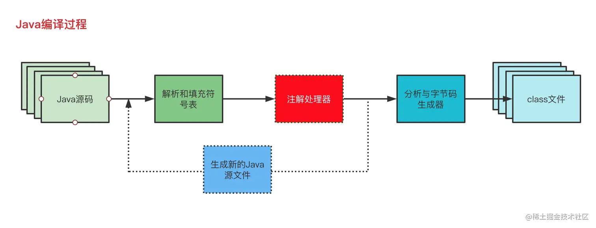

# 注解

[TOC]

## 概述

Java注解提供了Java源代码无法表达、却是完整表述程序所需的信息（例如各种中间件的参数配置）。也就是说，可以将一些元数据保存在Java源代码中。

然而除了通过注解将元数据保存在Java源代码中，还可以通过XML配置文件保存这些元数据，并通过Java代码读取这些XML配置文件获取相应的数据。这两种方法各有优劣，再次不过多讨论。

注解是真正的语言组件，因此是结构化的，并可接受编译时类型检查。将所有信息都保存在真正的代码而不是注释中，会使代码更整洁，且更便于维护。通过直接使用或扩展注解API和工具，或者使用外部的字节码处理库（如本章后面所述），可以对源代码以及字节码执行强大的检查和操作。

XML一个缺陷就是：每定义一个Java类，程序员都必须经过一个乏味的配置信息的过程，比如配置类名、包名等——这些都是类中本来就有的信息。无论你什么时候使用外部描述符文件，最终都会得到关于一个类的两个独立的信息源，这常常导致代码的信息同步问题，维护成本极大。

Java提供了5个内建（build-in）注解：

- @Override
- @Deprecated
- @SuppressWarnings
- @SafeVarargs
- @FunctionalInterface：

## 注解定义

通过以下元注解以及类似接口的特殊语法可以定义注解：

- @Target（必选）：表明所修饰的对象
  - ElementType.METHOD 修饰方法
  - ElementType.PARAMETER 修饰参数
  - ElementType.ANNOTATION_TYPE 修饰注解
  - ElementType.TYPE 修饰类、接口或者枚举类型
  - ElementType.LOCAL_VARIABLE 修饰局部变量
- @Retention（必选）：保留策略
  - RetentionPolicy.SOURCE 源码级注解。注解信息只会保留在 java 源码中，源码在编译后注解信息被丢弃，不会保留在 class 文件
  - RetentionPolicy.CLASS 编译时注解。注解信息会保留在 java 源码以及 class 文件中。当运行 java 程序时，JVM 会丢弃该注解信息，不会保留在 JVM 中
  - RetentionPolicy.RUNTIME 运行时注解，当运行 java 程序时，JVM 也会保留该注解信息，可以通过反射获取该注解信息。
- @Documented（可选）
- @Inherited（可选）
- @Repearable（可选）

```java
@Target(ElementType.METHOD)
@Retention(RetentionPolicy.RUNTIME)
public @interface Test {

}
```


## 编写注解处理器

**注解对象的类型是Annotation类！**

如果没有注解处理器，那么注解就与注释没有太大差别。Java在反射API中提供了扩展，以帮助创建注解处理器。而且还提供了一个javac编译器钩子，用来在编译时来处理注解。


Class、Method、Field等这些类都实现了`AnnotatedElement`接口。在该接口中有`getAnnotation`方法，它接受一个注解的Class对象，返回注解对象。通过该注解对象我们可以获取到用户设置的值。


```java
@Target(ElementType.HETHOD)
public @interface UseCase {
    int id();
    String description() default "nothing";
}


class Apple {
    @UseCase(id = 17, description = "eat apple")
    public void eat() {}
    
    public static void main(String[] args) {
        Class object = Apple.class;
        Method method = object.getDeclaredMethods()[0]
        UseCase useCase = method.getAnnotation(UseCase.class);
        int id = useCase.id();
        String description = useCase.description();
	}
}
```


此外还有getDeclaredAnnotations()，获取到类所使用的所有注解

```java
class object = Apple.class;
for (Annotation annotation: object.getFields().getDeclaredAnnotations()) {
	if (annotation instanceof SQLString) {
        SQLString = (SQLString)annotation;
    }
}
```


## 使用javac处理注解

APT（Annotation Processing Tool）它是Java编译期注解处理器，它可以让开发人员在编译期对注解进行处理，通过APT可以获取到注解和被注解对象的相关信息，并根据这些信息在编译期按我们的需求生成java代码模板或者配置文件（比如SPI文件或者spring.fatories）等。APT获取注解及生成代码都是在代码编译时候完成的





## 注解元素

还可以在注解中定义**元素**。用户在使用注解时可以设置这些元素，注解处理器可以读取到用户所设置的值：如果一个注解未定义任何一个元素，那么称该注解为**标记注解**

```java
public @interface UseCase {
    int id();
    String description() default "no description";			//该元素有默认值
}

public class PasswordUtils {
    @UseCase(id = 47, description = "")
    public boolean validatePassword(String pwd) {}
    
    @UseCase(id = 48)
    public String encryptPassword(String pwd) {}
}
```


注解元素所允许的所有元素类型：

- 所有基本类型
- String
- Class
- enum
- Annotation
- 以上类型的数组


编译器对注解元素的其他要求：

- 注解中的所有注解元素必须都要有确定的值，这意味着元素要么有默认值，要么由使用该注解的类（或注解）来设置注解元素。
- 设置值会覆盖掉默认值
- 在使用默认值时，不能设置为null。


下面举一个嵌套注解的例子：

```java
@interface Constraints {
    boolean primaryKey() default false;
    boolean unique() default false;
    boolean allowNull();
}

@interface SQLString {
    int value() default 0;
    String name() default "";
    Constraints constraints() default @Constraints(unique = true, allowNull = true);
    //这里必须设置allowNull
}

class Member {
    @SQLString(value = 10, constraints = @Constraints(primaryKey = true, allowNull = true))
    String reference;
}
```


下面举一个数组的例子：

```java
@interface ArrayInterface {
    int[] values() default {1, 2, 3, 4}
}

class Member {
    @ArrayInterface(value = {2, 3, 5})
    String name;
}
```