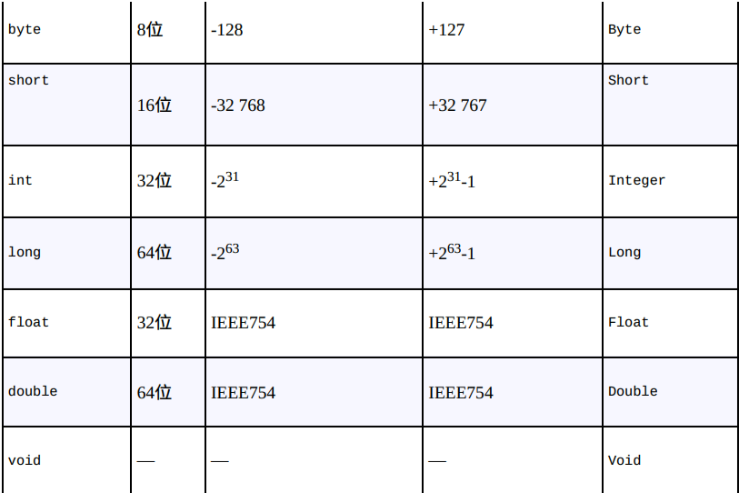
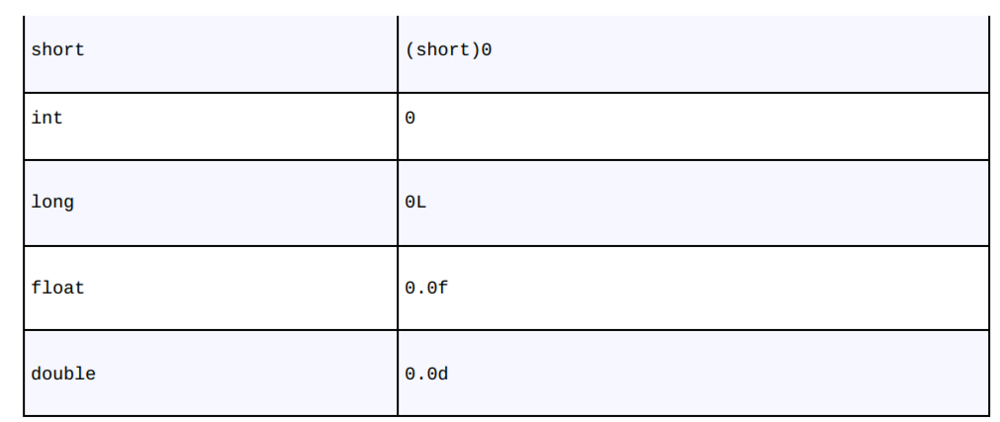

# Java 类型系统

[TOC]

## 类型

### 基本类型

对于**基本类型（primitive type）**，Java会直接在栈上创建。

**自动变量（automatic variable）**或**局部变量（local variable）**指的是在栈上创建的基本类型以及引用类型。

- 所有数值类型都是有符号的

- 并未对boolean类型的空间大小做出规定，而且其对象只能赋值为true或false

- Char使用UTF-16编码来存储Unicode码点(code point)。

### 初始化

**必须在使用自动变量之前进行显式初始化工作**，否则编译器会抛出一个编译期错误。而对于数组中的元素以及类中的字段，编译器会执行默认初始化：

- 对于基本类型

	

	

- 对于对象，它的默认初始化值为`null`

所以当你操作引用之前，需要确保将其指向了某个对象。如果你试图操作一个值为`null`的引用，系统会返回一个运行时报错

在定义对象之后，使用对象之前的初始化称为**延迟初始化（lazy initialization）**。在对象创建成本高昂且不需要每次定义时都创建的情况下，它可以减少开销

### 数据存储方式

Java中数据存储方式：

- **寄存器（register）**：数据直接保存在中央处理器（CPU）中，因此这是访问速度最快的数据存储方式。然而寄存器的数量是有限的，所以只能按需分配。同时你不能直接控制寄存器的分配，甚至你在程序中都找不到寄存器存在过的证据（ C 和 C++ 是例外，它们允许你向编译器申请分配寄存器）。

- **栈（stack）**：数据存储在**随机存取存储器（random-access memory, RAM）**里，处理器可以通过栈指针（stack pointer）直接操作该数据。具体来说，栈指针向下移动将申请一块新的内存，向上移动则会释放这块内存。只不过 Java 系统在创建应用程序时就必须明确栈上所有对象的生命周期。这种限制约束了程序的灵活性。引用以及基本类型会保存在栈上。

- **堆（heap）**：用于存放所有 Java 对象。与栈不同的是，编译器并不关心位于堆上的对象需要存在多久。因此，堆的使用是非常灵活的。然而这种灵活性是有代价的：分配和清理堆存储要比栈存储花费更多的时间。但你并不需要太过关注此类问题。

- **常量存储（constant storage）**：常量通常会直接保存在程序代码中，因为它们的值不会改变，所以这样做是安全的。常量存储的一个例子就是**字符串常量池**

- **非RAM存储（non-RAM storage）**：这些数据的生命周期独立于应用程序的。其中最典型的例子：

	- **序列化对象（serialized object）**：转换为字节流并可以发送至其他机器的对象。例如：网络
	- **持久化对象（persistent object）**：保存在磁盘上的对象，而这些对象即便在程序结束运行之后也依然能够保持其状态。例如：数据库

### 包装类

Java 还为基本类型提供了对应的**“包装类”（wrapper class）**，通过包装类可以将位于栈上的基本类型转换为位于堆上的对象。

而**自动装箱**（auto boxing）机制能够将基本类型对象自动转换为包装类对象，例如

~~~java
Character ch = '\u0000';
Character ch = new Character('c');
~~~

**自动拆箱**：

~~~java
char c = ch;
~~~

至于使用包装类的原因，后续章节会进行更为细致的讲解。

Java 提供了两个支持高精度计算的类，分别是`BigInteger`和`BigDecimal`。`BigInteger`可以支持任意精度的整数。`BigDecimal`可用于任意精度的定点数（fixed-point number）。但是以速度换取精度。

### 作用域

**作用域**会决定其范围内定义的变量名的可见性和生命周期，下面是一个Java 作用域的例子：

~~~java
{
    int x = 12;
    {
        String s = "scope";
   		x = 12;
    }
    //s此时不可见
}
~~~

虽然引用s会在作用域结束后消失，但是它指向的String对象还会继续占用内存。在适当时候，Java垃圾回收器会清理这个String对象。

类似 C 和 C++ 的**对于局部变量的作用域屏蔽规则**在 Java 中是**不被允许**的，也就是说在函数内的任何两个局部变量之间都不可以重名，因为 Java 的设计者认为这种编程方式会引发歧义。

注意字段名与局部变量名可以重名，此时必须通过this关键字来引用字段名。

### 字面量

~~~java
int i1 = 0x2f; // Hexadecimal (lowercase)
int i2 = 0X2F; // Hexadecimal (uppercase)
int i3 = 0177; // Octal (leading zero)

char c = 0xffff; // max char hex value
byte b = 0x7f; // max byte hex value 0111111;
short s = 0x7fff; // max short hex value

long n1 = 200L; // long suffix
long n2 = 200l; // long suffix (can be confusing)
long n3 = 200;

byte blb = (byte)0b00110101;
short bls = (short)0B0010111110101111;
int bli = 0b00101111101011111010111110101111;
long bll = 0b00101111101011111010111110101111;

//float f1 = 1.0;
float f2 = 1F; // float suffix
float f3 = 1f; // float suffix
double d1 = 1d; // double suffix
double d2 = 1D; // double suffix
~~~

如果你试图将一个变量初始化为超出其自身表示范围的值（无论这个值的数值表示形式如何），编译器会报告一条错误信息。但是对于char、byte、short来说，超出其最大范围的字面值会被提升为int类型，然后编译器提示你进行窄化转换。

~~~java
int i1 = 0x7ffffffff; 	//错误 超出int范围
//char ch = 0x7fffffff		必须进行窄化转换
char ch = (char)0x7fffffff;
// char ch = 0x7ffffffff; 超出int范围
~~~

Java 7中有一个十分有用的新增功能：可以在数字字面量里使用下划线，这样更易于阅读

~~~java
int bin = 0b0010_1111_1010_1111_1010_1111_1010_1111;
~~~

- 只能使用单个下划线，不能连续使用多个；
- 数字的开头或结尾不能有下划线
- 前缀、后缀周围不能有下划线

指数：

~~~java
float f = 3.14e10f;
double d = 3.14e-10;
double d2 = 3.14E-10;
~~~

编译器一般会将指数作为double类型处理

### 类型转换

类型转换的英文单词（cast）原意有“浇铸模具”的意思。

转换分为两种类型：

- **窄化转型（narrowing conversion）**：将能容纳更多信息的数据类型转换成**无法**容纳那么多信息的数据类型。此时，编译器会要求我们进行强制类型转换，意在提醒我们：“这可能是一个危险的操作，如果的确要这么做，你必须**显式地**进行类型转换。例如：

  ~~~java
  double d = 3.14;
  int i = (int)d;
  
  final int i1 = 10;
  char ch = i1;			//无需窄化转换，因为在编译期就确定不会丢失信息。
  
  int i2 = 10;
  final int i3 = i2;
  char ch = i3;			//报错，因为在编译期无法获知i3的值，所以不知道信息是否会丢失。
  ~~~

- **宽化转型（widening conversion）**，则**隐式地**进行类型转换，因为新类型可以容纳比原来的类型更多的信息，而不会造成任何信息的丢失。

	~~~java
	double d = 1;
	~~~

	

**除boolean类型外，任何基本类型可以转换为其他基本类型。**

**而且在同一个继承体系下的各个类可以进行类型转换**。

当无法进行类型转换时，编译器会抛出编译时错误。即便类型转换成功，但是因窄化转换而访问不存在的方法或字段时，编译器会抛出运行时错误。

在执行窄化转型时，你必须注意截尾与舍入问题。当一个浮点值转换为整型，会直接截去小数部分。若想四舍五入，那么使用`java.lang.Math`中的`round()`方法

### 自动类型推断

JDK 11提供了一个用来简化**局部变量定义**的特性。我们可以通过var关键字启用它：

~~~java
var i = 1;
~~~

- 不能在字段上使用类型推断，即使看起来我们已经有了足够的信息来推断。
- 如果你不提供任何初始化数据，或者提供了null，编译器就没有可以推断类型的信息。由于Java并不提供默认参数，所以不能在方法参数上使用类型推断。
- 不能在方法的返回类型上使用类型推断，即使编译器似乎有足够的信息来确定方法的返回类型。

## 操作符

**所有的操作符都只能操作基本类型**。例外的是`=`、`==`和`!=`。另外，String类也支持`+`和`+=`。

**对于`char`、`byte`、`short`基本类型，当执行算术操作、按位、移位操作时，这些基本类型会提升到`int`类型，结果也是`int`类型**。

通常表达式中的各个操作数会提升到“最大”的类型，如果不能执行宽化转型则抛出编译期错误。

### 优先级 & 结合

| 优先级 |            运算符            |
| :----: | :--------------------------: |
|   1    |        `()` `.` `[]`         |
|   2    |  `+` `-` `++` `--`  `!` `~`  |
|   3    |         `*` `/` `%`          |
|   4    |           `+` `-`            |
|   5    |       `<<` `>>` `>>>`        |
|   6    | `<` `<=` `>` `>=` instanceof |
|   7    |          `==` `!=`           |
|   8    |             `&`              |
|   9    |             `^`              |
|   10   |             `|`              |
|   11   |             `&&`             |
|   12   |             `||`             |
|   13   |             `?:`             |
|   14   |         `=` `+=` ...         |
|   15   |        lambda 表达式         |

除了优先级为2、13、14的运算符外，其他运算符是从左到右结合的。

### 赋值

赋值操作符的左操作数必须是左值！可粗略认为是一个非常量即可。

赋值操作是在栈上进行的，那么对基本数据类型而言，这相当于深复制。而对于对象而言，这相当于浅复制，即赋值后，两个引用指向同一个对象。

赋值处可使用逗号操作符定义多个类型相同的对象：

~~~java
int i = 1, j = i, k = 10; 	//结合 从左往右
~~~

此外，只能在传统for语句中的`initialization`、`step`部分使用逗号操作符

### 算术操作符

包括`+`（一元）、 `-`（一元）、`+`（二元）、`-`（二元）、`*`、 `/`、 `%`等

执行乘法运算时，结果可能会溢出，例如：

~~~java
int big = Integer.MAX_VALUE;	//2147483647
System.out.println(big * 4);    // -4
~~~

这里编译器不会有错误提示或警告信息，运行时也不会出现异常。

### 关系操作符

`<` `>` `>=` `<=`只能作用在除boolean类型之外的所有基本类型。因为对boolean类型比较大小毫无意义。而`==` `!=`可以作用在任何对象或基本类型上，此时比较的是它们在栈上的值！下面给出一个经典的例子：

~~~java
public class Equivalence {
  static void show(String desc, Integer n1, Integer n2) {
    System.out.println(desc + ":");
    System.out.printf(
      "%d==%d %b %b%n", n1, n2, n1 == n2, n1.equals(n2));
  }
  @SuppressWarnings("deprecation")
  public static void test(int value) {
    Integer i1 = value;                             // [1]
    Integer i2 = value;
    show("Automatic", i1, i2);
    // Old way, deprecated since Java 9:
    Integer r1 = new Integer(value);                // [2]
    Integer r2 = new Integer(value);
    show("new Integer()", r1, r2);
    // Preferred since Java 9:
    Integer v1 = Integer.valueOf(value);            // [3]
    Integer v2 = Integer.valueOf(value);
    show("Integer.valueOf()", v1, v2);
    // Primitives can't use equals():
    int x = value;                                  // [4]
    int y = value;
    // x.equals(y); // Doesn't compile
    System.out.println("Primitive int:");
    System.out.printf("%d==%d %b%n", x, y, x == y);
  }
  public static void main(String[] args) {
    test(127);
    test(128);
  }
}

/* Output:
Automatic:
127==127 true true
new Integer():
127==127 false true
Integer.valueOf():
127==127 true true
Primitive int:
127==127 true
Automatic:
128==128 false true
new Integer():
128==128 false true
Integer.valueOf():
128==128 false true
Primitive int:
128==128 true
*/
~~~

- [1]自动装箱。这其实是通过对Integer.valueOf()的自动调用来完成的。
- [2]使用标准的对象创建语法new。这是以前创建“包装/装箱”Integer对象的首选方法。
- [3]在Java 9及更新版本中已经弃用new Integer()，因为它的效率远远低于Integer.valueOf()。

> 出于效率原因，Integer会通过享元模式来缓存范围在-128~127内的对象，因此多次调用Integer.valueOf(127)生成的其实是同一个对象。而在此范围之外的值则不会这样，比如每次调用Integer.valueOf(128)返回的都是不同的对象。
>
> 注意equals()默认是`==`行为，即比较栈中的值。一般需要覆写equals方法，以正确比较对象之间的内容。

Java中的浮点数遵循IEEE754标准。对有些浮点数的比较可能反直觉，究其原因是使用有限信息表示无穷位数的实数，这难免会信息丢失。下面给出一个例子：

~~~java
public class DoubleEquivalence {
  static void show(String desc, Double n1, Double n2) {
    System.out.println(desc + ":");
    System.out.printf(
      "%e==%e %b %b%n", n1, n2, n1 == n2, n1.equals(n2));
  }
  @SuppressWarnings("deprecation")
  public static void test(double x1, double x2) {
    // x1.equals(x2) // Won't compile
    System.out.printf("%e==%e %b%n", x1, x2, x1 == x2);
    Double d1 = x1;
    Double d2 = x2;
    show("Automatic", d1, d2);
    Double r1 = new Double(x1);
    Double r2 = new Double(x2);
    show("new Double()", r1, r2);
    Double v1 = Double.valueOf(x1);
    Double v2 = Double.valueOf(x2);
    show("Double.valueOf()", v1, v2);
  }
  public static void main(String[] args) {
    test(0, Double.MIN_VALUE);
    System.out.println("------------------------");
    test(0.3, 0.1 + 0.2);								
    System.out.println("------------------------");
    test(Double.MAX_VALUE,
      Double.MAX_VALUE - Double.MIN_VALUE * 1_000_000);		//机器不能存储足够的信息来表示一个大数值的微小变化。
  }
}
/* Output:
0.000000e+00==4.900000e-324 false
Automatic:
0.000000e+00==4.900000e-324 false false
new Double():
0.000000e+00==4.900000e-324 false false
Double.valueOf():
0.000000e+00==4.900000e-324 false false
------------------------
3.000000e-01==3.000000e-01 false
Automatic:
3.000000e-01==3.000000e-01 false false
new Double():
3.000000e-01==3.000000e-01 false false
Double.valueOf():
3.000000e-01==3.000000e-01 false false
------------------------
1.797693e+308==1.797693e+308 true
Automatic:
1.797693e+308==1.797693e+308 false true
new Double():
1.797693e+308==1.797693e+308 false true
Double.valueOf():
1.797693e+308==1.797693e+308 false true
*/

~~~

使用浮点数时，用一个非常大的数值减去一个相对较小的数值，非常大的数值并不会发生显著变化。这叫作舍入误差，这种误差之所以发生，是因为

​	

### 逻辑操作符

`&&`、`||`、`!`，它们只作用在boolean类型上！

~~~java
int i, j;
//在Java中，逻辑操作符只能作用在boolean类型上
// i && j
// i || j
// !i	
~~~

逻辑操作符具有**短路求值**特性。一旦表达式当前部分的计算结果能够明确无误地确定整个表达式的值，表达式余下部分就不会被执行了。事实上，之所以存在短路，就是因为如果逻辑表达式有一部分不必计算，那我们就能获得潜在的性能提升。

~~~java
public class ShortCircuit {
  static boolean test1(int val) {
    System.out.println("test1(" + val + ")");
    System.out.println("result: " + (val < 1));
    return val < 1;
  }
  static boolean test2(int val) {
    System.out.println("test2(" + val + ")");
    System.out.println("result: " + (val < 2));
    return val < 2;
  }
  static boolean test3(int val) {
    System.out.println("test3(" + val + ")");
    System.out.println("result: " + (val < 3));
    return val < 3;
  }
  public static void main(String[] args) {
    boolean b = test1(0) && test2(2) && test3(2);
    System.out.println("expression is " + b);
  }
}
/* Output:
test1(0)
result: true
test2(2)
result: false
expression is false
*/
~~~

### 按位操作符

按位操作符源于C语言面向底层的设计，它经常需要直接操纵硬件，并直接设置硬件寄存器内的二进制位。Java最初的设计是要嵌入电视机机顶盒的，所以这种面向底层的设计是合情合理的。

按位操作符作用于整型基本数据类型以及boolean类型上。但是`~`不支持boolean操作数！（大概避免与逻辑操作符`!`混淆）。

对于布尔值，按位操作符和逻辑操作符具有相同的效果，但它们不会“短路”！

### 移位操作符

它们只能作用在整型基本数据类型上！

- 左移位操作符：低位补0

- 右移位操作符：符号扩展

- 无符号右移位操作符：高位补0

对于int类型，右移只会考虑低五位（相当于取模32）这样可防止我们移位超过int型值所具有的位数。对于long类型，右移只会考虑低6位（相当于取模64）这样移位操作就不会超出long类型的最大位数。

如果对byte或short值进行移位运算，得到的可能不是正确的结果。它们会先被提升为int类型，进行右移操作，然后在被赋回给原来的变量时被截断。下面是一个示例：

~~~java
byte b = -1;
System.out.println(Integer.toBinaryString(b));
b = (byte)(b >>> 10);
System.out.println(Integer.toBinaryString(b));
System.out.println(Integer.toBinaryString(b>>>10));
/* Output:
11111111111111111111111111111111
11111111111111111111111111111111
1111111111111111111111
/
~~~

​	

### 三元操作符

`boolean-exp ? value0 : value1`

`boolean-exp`表达式为`true`时，返回`value0`，反之返回`value1`。

### 逗号表达式

Java不支持逗号表达式，除了For语句以及变量初始化语句！

### 其他

在C和C++中，sizeof()操作符会告诉你给数据项分配的字节数。这些语言使用sizeof()的最大原因是可移植性。而Java不需要sizeof()操作符来处理可移植性，因为所有的数据类型在任意机器中的大小都是相同的。我们不必考虑这种程度的可移植性——它已经被设计在语言里了。

