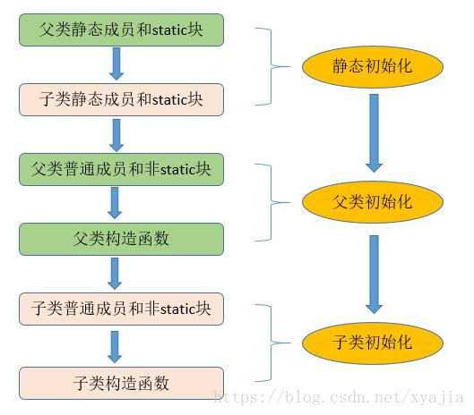

# Java 面向对象

在Java中**一切皆为对象**

[TOC]

## 基本语法

除基本类型外，Java中的对象都是通过**引用（reference）**来操作，例如

~~~java
Person person = new Person("AtsukoRuo", 18);
~~~

这里的`person`标识符实际上就是一个引用，它指向位于堆中的实际对象。

通过`class`关键字来定义一个**类**：

~~~java
class ClassName { }
~~~

通过`new`关键字创建该类的对象

~~~java
ClassName a = new ClassName();
~~~

当定义一个类时，你可以为其定义两种元素：**字段**（有时叫作“数据成员”）和**方法**（有时叫作“成员函数”）。

访问一个对象的字段或方法

~~~java
a.b = 10;		
a.c();
d();			//直接访问本类中的方法（隐式使用this参数）
this.e;			//通过this参数访问本类中的字段
~~~

此外，Java 消除了所谓的**“前向引用”（forward referencing）**问题。假如某个类存在于当前被调用的源代码文件中。你只要使用这个类就可以了，哪怕这个类稍后才会在文件中定义。

### static

然而在两种情况下，这种只有通过对象调用方法的做法会显得不合时宜。

- 第一种情况是，有时候我们需要一小块共享空间来保存某个特定的字段，而并不关心创建多少个对象，甚至有没有创建对象。
- 第二种情况是，你需要使用一个类的某个方法，而该方法和具体的对象无关；换句话说，你希望即便没有生成任何该类的对象，依然可以调用其方法。生命周期持续到程序结束。

static关键字（源自 C++）为以上两个问题提供了解决方案。有些面向对象编程语言也会使用**“类数据”（class data）**和**“类方法”（class method）**来表示该数据或方法只服务于类，而非特定的对象。

> 注： 对象字段一般不包括Static属性

访问一个对象的static字段或static方法：

~~~java
A a = new A();
A.staticMethod();			//通过类名访问（推荐）
a.staticMethod();			//通过对象名访问（十分不推荐）
~~~

**static字段是基于类创建的，而非static字段是基于对象创建的**。因此**不可在static方法中直接访问本类的非static字段、非static方法，以及使用this参数**，但是在非static方法中**可以**直接访问static字段以及调用static方法。

**static具有全局方法的语义！**，因此有些人认为静态方法不符合面向对象的思想。关于它是否是“正确的OOP”就留给理论家们来争辩吧。

### this

~~~java
Banana a = new Banana(), b = new Banana();
a.peel(1);
b.peel(1);
~~~

编译器怎么知道`peel`方法是被`a`调用还是被`b`调用。每个对象方法（除static方法）都有一个隐藏参数this，位于所有显示参数之前，代表着被操作对象的引用。编译后的内部表现形式为：
~~~java
Banana.peel(a, 1);
Banana.peel(b, 1);
~~~

你不能这样编写代码，并试图通过编译，但它可以让你了解一些内部实际发生的事情。

如果你想在一个方法里获得对当前对象的引用，那么就使用this关键字：

~~~java
Banana getBanana() {
	return this;
}
~~~

如果从类的一个方法中调用该类的另一个方法或字段，那就没必要使用this，直接调用即可。

~~~java
class Car {
	int velocity;
    void speedDown(int velocity) { this.velocity -= velocity; }		//注意：局部变量名屏蔽了字段名，此时必须通过this引用该字段
    void stop() { 
        speedDown(velocity);
    }
}
~~~

> 有些人会痴迷于把this放在每个方法调用和字段引用的前面，认为可以使代码“更清晰、更明确”。不要这样做。我们使用高级语言是有原因的，它们可以帮助我们处理这些细节。如果在不必要的时候使用了this，就会让所有阅读代码的人感到困惑和烦恼。

### final

Java的final关键字在不同的上下文环境里含义可能会略有不同，但一般来说，它表示“这是无法更改的”。阻止更改可能出于两个原因：设计或效率。

#### 数据final

常量可以分为：

- **编译时常量**：对编译时常量来说，编译器可以将常量值“折叠”到计算中。这节省了一些运行时开销。**在Java里，这些常量必须是基本类型，在定义常量时必须初始化**。
- **运行时常量**：运行时常量允许延迟初始化。对于基本类型，它的值不变；一旦引用被初始化为一个对象，它就永远不能被更改为指向另一个对象了。但是，对象本身是可以修改的。Java没有提供使对象恒定不变的方法。**总而言之，final确保栈上的值保持不变**

~~~java
int i = 10;
final int k = 10;		//编译时常量
final int j = i;		//运行时常量
~~~

**空白final**是没有初始值的final字段。编译器会确保在使用前初始化这个空白final字段。因为空白fianl不执行默认初始化，所以**必须在构造器执行完之前完成初始化工作**。

#### 方法final

将一个类定义为final，就阻止了该方法的继承

使用final方法的原因有两个：

- 设计上：防止继承类通过重写来改变该方法的含义

- 效率上：但在大多数情况下，它不会对程序的整体性能产生什么影响，**因此最好仅将final用作设计决策，而不是尝试用它提高性能**。长期以来，Java都不鼓励使用final来进行优化。

	- 在Java的早期实现中，如果创建了一个final方法 ，编译器可以将任何对该方法的调用转换为内联调用，即通过复制方法体中实际代码的副本来代替方法调用。而正常的方法调用方式则是将参数压入栈，跳到方法代码处并执行，然后跳回并清除栈上的参数，最后处理返回值。这节省了方法调用的开销，但会让代码开始膨胀。
- 它告诉编译器自己不需要动态绑定。这让编译器可以为final方法的调用生成更为高效的代码。

注：**类中的任何private方法都是隐式的final。**

#### 类final

将整个类定义为final时（通过在其定义前加上final关键字），就阻止了该类的所有继承。它的所有方法都是隐式final的。因此无法重写它们。

## 构造器 & 初始化

> “不安全”的编程是导致编程成本高昂的罪魁祸首之一。初始化（initialization）和清理（cleanup）正是导致“不安全”编程的其中两个因素。

使用构造器保证对象的初始化。构造器是一种特殊的方法，它**没有返回类型**，与返回类型为空（void）有着明显的不同。而且**构造器是static方法**！

创建一个构造器：

~~~java
class ClassName {
    ClassName(/*args*/) {}
}
~~~

当创建对象时：

~~~java
new ClassName();
~~~

会自动调用这个类的构造器。

### 默认构造器

不带参数的构造器称为**默认构造器（default consttructor）**或者称为**无参构造器（no-arg constructor）**。当你未显式创建任何构造器时，编译器会为你创建一个隐式的无参构造器。

### 构造器中调用构造器

this + 参数列表

~~~java
class Phone {
    String model;
	Phone(String model) { this.model = model; }
    Phone() { this("Android"); }
    Phone() { this("Android"); this("iOS"); }	// 不能同时调用两个构造器
    Phone() { model = ""; this("iOS"); }	    // this()必须是第一条语句
    void f() { this("Android"); }			   // 不能在非构造器中使用
}
~~~

### 初始化 & 初始化中的前向引用问题

默认初始化：

~~~java
public class InitialValues {
    boolean t;
    char c;
    InitialValues reference;
}
~~~

赋值初始化：

~~~java
public class InitialValues {
    //int i = j;		  禁止前向引用
    int j = 10;
    boolean t = false;
    char c = 'c';
    InitialValues reference = new InitialValues();
}
~~~

方法初始化：

~~~java
public class MethodInit {
    //int j = g(i);			禁止前向引用
    int i = f();
    int k = g(i);
    
    int f() { return 0; }
    int g(int j) { return j * 2; }
   	 
    static int i = h();
    //static int i = f();			不能调用非static方法
    static int h () { return 0; }
}
~~~

注意这里有个陷阱：

~~~java
public class MethodInit {
    int i = f();			// i = 0;
    int j = 10;
    int f() { return j; }
}
~~~

这是因为在调用`f()`时，`j`的值为`0`，还未执行到`int j = 10`这条初始化语句。

静态初始化：

~~~java
public class Spoon {
    static int i = 0;
    int j = 10;
    static {
        i = 47, j = 48; k = 49;		//规避掉了前向引用，十分不推荐这么做。
        System.out.println("Satic {}");
    }
    static int j;
    static int k = 0;				//重新赋值
    public static void main(String[] args) {
        System.out.println(j);
        System.out.println(k);
    }
}

/*
Satic {}
48
0
*/
~~~

注意：**静态字段只会被初始化一次**

实例初始化（instance initialization）：

~~~java
class Mug {
    Mug mug1, mug2;
    {
        mug1 = new Mug();
        mug2 = new Mug();
    }
}
~~~

### 初始化顺序

1. 当类的静态成员首次被访问到（构造器是静态的）时，按照声明顺序初始化的static字段、以及执行静态初始化。

   ~~~java
   public s
   ~~~

   

2. 然后按照声明顺序初始化非static成员、以及执行实例初始化。

3. 在构造对象时，为对象分配的存储空间会被初始化为二进制零。这相当于对字段执行默认初始化。

4. 最后执行构造器

如果在继承体系中，会从基类到子类递归地重复（1）或者 （2）~（4）。

## 清理对象

Java有**垃圾收集器（Garbage Collector）**来回收不再使用的对象内存！**注意它只回收对象的内存资源**。如果一个对象分配了一块“特殊”的内存，例如在本地方法（C++）中通过malloc分配内存、持有文件句柄、持有socket，那么GC对释放对象的这块“特殊”内存无能为力，这得由程序员手动释放这块特殊内存！

> 注：在java16中已经完全废用finalize方法。推荐显式调用对象的释放资源的方法，惯用命名有close()、dispose()、clean()等

为此Java在Object类中提供了finalize()的方法，任何类都可以重载此方法。当GC释放对象时，它会调用该对象的finalize()方法。何时调用取决于JVM所采用的策略。

但是finalize()方法绝不等同于C++中的析构函数。因为C++在销毁对象时必须调用这个函数。而在Java中，对象并不总是被回收。你也许会发现即使程序的某个对象不再使用，但它的存储空间一直没有被释放，直到在程序退出时这些存储空间才会全部归还给操作系统。这个策略是恰当的，因为垃圾收集本身也有开销，如果没有做过垃圾收集，那就不用承担这部分开销了。所以finalize()的调用是不可预测的，而且很危险但没必要的。**推荐显式调用对象的释放资源的方法，惯用命名有close()、dispose()、clean()等**，即清理工作由程序员负责！

~~~java
class TerminationCondition {
    @SuppressWarnings("deprecation")
    @Override
    public void finalize() {
        System.out.println("finalize()");
    }
    
    public static void main(String[] args) {
		new TerminationCondition();		//创建后立即丢掉该对象的引用
         System.gc();		//执行垃圾收集
         sleep(1000);		//伪方法，休眠1s，给垃圾收集器足够的时间确保执行finalize方法
    }
    
}
/*
	finalize()
*/
~~~

### 清理顺序

先按初始化相反的顺序清理本类的成员（以防对象依赖于其他对象），再清理基类（清理时可能会调用基类的方法，此时要求基类组件处于存活状态）。下面给出一个例子：

~~~java
class Shape {
    void dispose() {}
}
class Line extends Shape {
    void clean() {super.dispose();}
}
class Triangle extends Shape {
    void clean() {super.dispose();}	//一定记得执行基类清理工作
}
class CADSystem extends Shape {
	Triangle t = new Triangle();
    Line l = new Line();
    void close() {
        l.clean();
        t.clean();
        super.dispose();
    }
}
~~~

如果其中某个成员对象被其他对象所共享，则问题会变得更加复杂，此时就不能简单地调用`dispose()`。在这里，可能需要使用**引用计数**来跟踪访问共享对象的对象数量。下面是相关的示例：

~~~java
class Shared {
    private static long refCount = 0;
    public void addRef() { refCount += 1; }
    
    public void dispose() {
        if (reCount == 0) {
            /*清理工作*/
        } else refCount -= 1;
    }
}

class Composing {
    private Shared shared;
    Composing(Shared shared) { this.shared = shared; shared.addRef(); }
    protected void dispose() { shared.dispose(); }
}

class ReferenceCounting {
    public static void main(String[] args) {
		Shared shared = new Shared();
         Composing[] composing = { 
             new Composing(shared);
             new Composing(shared);
             new Composing(shared);
         } 
        for (Composing c : composing) {
            c.dispose();
        }
    }
}
~~~

## 复用——继承与组合

在新类中创建现有类的对象。这称为**组合（composition）**。你复用的是代码的功能，而不是其形式。

它直接复制了现有类的形式，然后向其中添加代码，而没有修改现有类。这种技术叫作**继承（inheritance）**。它的大部分工作是由编译器完成的。

继承一般表示 `is-a`的关系，而组合表示`has-a`的关系。而且组合允许其状态发生改变，继承允许行为发生改变。

### 继承

其实当创建一个类时，总是在继承。除非明确指定了要继承某个类，否则将隐式继承Java的标准根类Object。

通过extends关键字来实现继承：

~~~java
class Sub extends Super {}
~~~

### 继承与初始化基类

当创建子类对象时，它里面包含了一个基类的**子对象（subobject）**。正确初始化基类的子对象至关重要，我们只有一种方法可以保证这一点：在子类构造器中调用基类构造器来执行初始化，它具有执行基类初始化所需的全部信息和权限。

编译器会为你隐式调用基类的无参构造器。如果基类没有无参构造器，或者如果你必须要调用具有参数的基类构造器，那么就要使用super关键字和相应的参数列表，来显式调用基类构造器：

~~~java
class A {
    A();
}
class B extends A {
    B(int i) { }		//隐式调用A()
}
class C extends B {
    C() { super(1); }
    //C() {}      			//基类没有无参构造器，必须显式调用基类的构造器
}
~~~

此外，调用基类的构造器必须是子类构造器的第一个操作！这与`this`构造器冲突，因此必须二选一！

### 委托

**委托（delegation）**。它介于继承和组合之间。虽然Java里没有提供直接支持，但是你可以在新类中创建现有类的对象（组合），同时又在新类里公开了成员对象的部分方法，以及适当添加一些操作（类似继承）。下面给出一个例子：

~~~java
public class SpaceShipControls {
    void up(int velocity) {};
    void down(int velocity) {};
    void left(int velocity) {};
    void right(int velocity) {};
}

public class SpaceShipDelegation {
    SpaceShipControls controls = new SpaceShipControls();
    public void up(int velocity) {
        controls.up(velocity);
    }
    public void up(int velocity) {
         log.info("up:" + velocity);		//扩展操作
        controls.up(velocity);
    }
    //暴露部分方法
}
~~~

### 继承中的名字隐藏

对于private、字段、static方法都会名字隐藏，此时要调用基类的版本（允许的话）要使用super关键字。

对于非private的final方法，它不会名字隐藏，而且明确要求子类不允许继承该方法：

~~~java
class C1{
    final void f() {};
    private void g() {};
}
class C2 extends C1 {
    //void f() {};		不允许覆写
    void g() {};
}
~~~

## 隐藏 & 封装

### 访问权限修饰符

|             | 任何人 | 同一个包 | 子类 | 本类 |
| :---------: | :----: | :------: | :--: | :--: |
|  `public`   |   ✔️    |    ✔️     |  ✔️   |  ✔️   |
| `protected` |        |    ✔️     |  ✔️   |  ✔️   |
|  `default`  |        |          |  ✔️   |  ✔️   |
|  `private`  |        |          |      |  ✔️   |

注意：

- `default`访问权限并无对应的关键字

- 类本身的访问权限只能是`public`或`default`。实际上内部类可以是`private`或`protected`的，这会在内部类一节中介绍。

- **在继承期间不允许降低方法的可访问性**

- **`private`是隐式`final`的**

再此强调，private仅仅是语言层面上的隐藏，而不是二进制层面上的！这意味着private并不能够抵抗反编译。private仅仅是将底层实现与接口分离，当有能力改变底层实现时，你不仅有了改进设计的自由，还有了犯错误的自由。同时对客户程序员而言也是一种服务，因为这样的话他们就可以轻松地了解到什么对他们重要，什么又是他们可以忽略的。这简化了他们对类的理解。

### private构造器

如果无参构造器是唯一定义的构造器，并且它是private的，那么这就阻止了该类的继承！

private构造器可以实现单例模式或者限制对象的创建个数。

~~~java
class Soup1 {
    private Soup1() {}
    static int i = 0;
    public Soup1 getSoup() {
        return i > 10 ? null : new Soup1();
    }
}

class Soup2 {
    private Soup2() {}
    private static Soup2 soup2 = new Soup2();
    public Soup2 getSoup2() { return soup2; }
}
~~~

### 类的包访问权限与公共方法

当定义一个具有包访问权限的类时，你可以给它一个`public`或`protected`方法。这样做的原因是这个类不可被其他包访问，但是可能被其他包中的类间接继承，此时这些`public`、`protected`方法可以被子类覆写！

~~~java
package hiding.access;
class PublicMethod {
	public void method() {} ;
}

public A extends PublicMethod { }

//hiding
package hiding;
import hiding.access.A;
public B extends A {
    @Override public void method() {};
}
~~~

### 封装

访问控制常常被称为实现隐藏。将数据和方法包装在类中，并与实现隐藏相结合，称为**封装（encapsulation）**。

## 多态

封装将实现与接口解耦。而多态（也称动态绑定、后期绑定或运行时绑定）实现类型之间的解耦，即让一段代码同等地适用于所有这些不同的类型，同时在行为上又有所不同。这改善了代码的组织结构和可读性，并且还能创建**可扩展**的程序。多态是“将变化的事物与不变的事物分离”的一项重要技术。因此大部分面向对象的设计模式依赖于多态机制！

### 转型

向上转型总是安全的，因为你是从更具体的类型转为更通用的类型。在向上转型期间，子类接口“缩小”至基类的接口。

因为向上转型会丢失特定类型的信息，所以我们自然就可以通过向下转型（downcast）来重新获取类型信息。而向下转型不总是安全的，因为它可能转型为错误的类型，而向该对象发送它无法接受的信息，从而在运行时抛出`ClassCastException`

如果A要向下转型为B，那么B的继承链中必须要有A，否则抛出异常`java.lang.ClassCastException`。虽然接口C的父类是Object，但是如果Object对象的实际类型若未实现接口C，那么也会抛出异常

### 绑定（覆写）

将一个方法调用和一个方法体关联起来的动作称为**绑定**。在程序运行之前执行绑定（如果存在编译器和链接器的话，由它们来实现），称为前期绑定。

**Java中的所有方法绑定都是后期绑定**，除非方法是static或final的（private方法隐式为final）。例子：

~~~java
class A {
    void f() { g(); }	//g()不一定是A中的f()方法，还可能是B中的
    void g() {}
}
class B extends A {
    @Override void g() {}
}
~~~

**在JAVA中，一定要注意在本类中调用的方法可能动态绑定到了子类的方法上 **，对于private、static、final方法则无需担心这一点。

请注意只有普通方法是多态的。而final方法、静态方法以及字段会在编译时解析的。一个副作用就是可以名字隐藏，想要访问基类的字段或静态方法必须使用super关键字。例子：

~~~java
class Super {
    public int field = 0;
}
class Sub extends Super {
    public int field = 1;
    public int getField() { return field; }			    //0
    public int getSuperField() { return super.field; }	//1
}
~~~

我们一般不会为基类字段与子类字段指定相同的名称，因为这会造成混淆。

### 协变返回类型

**协变返回类型（covariant return type）**，这表示子类中重写方法的返回值可以是基类方法返回值的子类型。这对于基本类型并不成立。

 在基类构造器中，整个子类对象还只是部分构造，只能知道基类对象是已完全初始化的。由于动态绑定，基类构造器可能调用子类的方法，此时可能有访问尚未初始化的子类字段，这会带来难以发现的错误！下面给出一个例子：

~~~java
class Glyph {
    void draw() { System.out.println("Glyph.draw()"); }
    Glyph() {
        System.out.println("Glyph() before draw()");
        draw();
        System.out.println("Glyph() after draw()");
    }
}

class RoundGlyph extends Glyph {
    private int radius = 1;
    RoundGlyph(int r) {
        radius = r;
        System.out.println(
            "RoundGlyph.RoundGlyph(), radius = " + radius);
    }
    @Override void draw() {
        System.out.println(
            "RoundGlyph.draw(), radius = " + radius);
    }
}

public class PolyConstructors {
    public static void main(String[] args) {
        new RoundGlyph(5);
    }
}
/* Output:
Glyph() before draw()
RoundGlyph.draw(), radius = 0		//期望是radius = 1
Glyph() after draw()
RoundGlyph.RoundGlyph(), radius = 5
*/
~~~

因此，编写构造器时有一个很好的准则：“用尽可能少的操作使对象进入正常状态，如果可以避免的话，请不要调用此类中的任何其他方法。”只有基类中的final、static方法可以在构造器中安全调用（这也适用于private方法，它们默认就是final的）。这些方法不能被重写，因此不会产生这种令人惊讶的问题。

## 密封类

密封类限制了能派生出哪些类。这让我们可以对固定的一组类型进行建模。（枚举限制了该类的对象，对固定一组对象进行建模）

通过sealed与permits关键字使用密封类：

~~~java
import D1; 
import D2;
sealed class Base permits D1, D2 {}
~~~

注意：

1. D1、D2必须继承Base，否则编译器报错：一条无效permits子句。
2. 如果**只有**同一文件下某些类继承该类，那么可以省略permits语句。
3. **The sealed class and its permitted subclasses must belong to the same module, and, if declared in an unnamed module, the same package.**

sealed类的子类只能通过下面的某个修饰符来定义：

- `final`：不允许有进一步的子类。
- `sealed`：允许有一组密封子类。
- `non-sealed`：一个新关键字，允许未知的子类来继承它。放开限制

这样使得sealed的子类保持了对层次结构的严格控制：

还可以密封接口和抽象类：

~~~Java
sealed interface Ifc permits Imp1, imp2 {}
~~~

## 抽象类

通过`abstract`关键字创建抽象类：

~~~java
abstract class AbstractClass {}
~~~

**抽象类包含任意多个（包括0个）抽象方法，且抽象方法只能声明在抽象类中**。抽象方法（abstract method）是一个不完整方法，它只有声明没有方法体，这类似于C++中的纯虚函数（pure virtual function）。

因为抽象方法是一个不完整的方法，因此**你无法安全地创建一个抽象类的实例化对象**，但是可以接受向上转型对象：

~~~java
abstract class A {}
class B extends A {}
A a = new A();		//错误
A a = new B();		//正确
~~~

**子类必须覆写基类中所有抽象方法，否则它本身必须是一个抽象类。**

抽象类几乎对访问权限没有任何限制。但禁止使用`private abstract`，这样做也是有道理的：任何子类都不可能给`private`的方法提供一个定义。

**虽然抽象方法只提供了声明，但是它还实现了对基类方法的覆写**：

~~~java
class T {
	void f() {}
    final void g() {}
}
abstract class R extends T {
	@Override abstract void f();
    // void g(); 不允许覆写
}
~~~

由于多态性，抽象方法可以在普通方法中调用：

~~~java
class A {
    abstract void f();
    void g () { f(); }
}
~~~

## 接口

**接口提供了一种更加结构化的方式来分离接口与实现。**接口实现了类型的完全解耦！而多态只实现了在继承层次上的类型解耦。

通过`interface`来定义接口：

~~~java
interface I {
    void f();
}
~~~

接口中的所有方法都是隐式的`public`（除非显式声明为private）。在实现接口时，记得接口方法的访问权限必须是public，因为Java不允许在继承时降低访问权限。

**而且接口中的方法（除static、default方法）都是隐式抽象方法。**

要创建一个符合特定接口（或一组接口）的类，请使用`implements`关键字：

~~~java
class A implements B{
    @Override void f() {};
}
~~~

类必须覆写接口中所有方法（除static、default方法）。

### 默认方法与静态方法

通过关键字`default`创建一个默认方法

~~~java
interface I {
    default void f() {}
}
class A implements I {
    void g() { f(); }
    void h() { I.super.f(); }		//在多继承中解决默认方法签名冲突问题。
}
~~~

实现了该接口的类可以在不定义方法的情况下直接使用方法体，也可以覆写该方法。添加默认方法的一个令人信服的原因是，它允许向现有接口中添加方法，而不会破坏已经在使用该接口的所有代码。默认方法有时也称为**防御方法（defender method）**或**虚拟扩展方法（virtual extension method）**。

通过关键字`static`创建一个静态方法：

~~~java
interface I {
    static void f() {};
}
~~~

静态含义就是只跟接口有关的逻辑操作，与接口实例化对象无关。

### private

在JDK 9中，接口里的default和static方法都可以是private的。

~~~java
interface I {
	private static void f();
    private void f();			//默认是default的
    private default void f();	//错误
}
~~~

### 通过继承扩展接口

通过`extends`关键字，可继承多个接口：

~~~java
interface I1 extends I2, I3 {
    
}
~~~

### 多重继承

Java严格来说是一种单继承语言：只能继承一个类（或抽象类）。你可以实现任意数量的接口。自从有了**接口的默认方法**，我们可以**继承来自多个基类型的行为**。因为接口仍然不允许包含字段（接口里只有静态字段，并不适用于我们这里讨论的场景），所以字段仍然只能来自单个基类或抽象类。也就是说，**你不能拥有状态的多重继承**。

**一个类只允许继承一个基类，但可以实现任意多个接口**

### 命名冲突

在不同接口中使用相同的方法名称通常会导致代码可读性较差。应该努力避免这种情况。下面给出命名冲突的例子

~~~java
// interfaces/InterfaceCollision.java
// (c)2021 MindView LLC: see Copyright.txt
// We make no guarantees that this code is fit for any purpose.
// Visit http://OnJava8.com for more book information.

package interfaces;
interface I1 { void f(); }
interface I2 { int f(int i); }
interface I3 { int f(); }
class C { public int f() { return 1; } }

class C2 implements I1, I2 {
    @Override
    public void f() {}
    @Override
    public int f(int i) { return 1; } // Overloaded
}

class C3 extends C implements I2 {
    @Override
    public int f(int i) { return 1; } // Overloaded
}

class C4 extends C implements I3 {
    // Identical, no problem:

    public static void main(String[] args) {
        System.out.println("");
    }
}

// Methods differ only by return type:
//- class C5 extends C implements I1 {}
//- interface I4 extends I1, I3 {}

~~~

当实现多个接口时，多个默认方法的签名可能会冲突，此时编译器会报错：

~~~java
interface I1 {
	default void f() {}
}
interface I2 {
    default int f() { return 0; }
}
class A implements I1, I2 {
    //错误 I1中的f与I2中的签名相同
}
~~~

解决此类冲突的方法是覆写该方法：

~~~java
class A implements I1, I2 {
    @Override public int f() { return I2.super.f(); }
}
~~~

调用特定接口中的默认方法：`接口名.super.方法名`。

注意：**super关键字只能作用于直接父类**，而不能作用于祖先！给出一个例子：

~~~java
interface I1 {
    default void f() {}
}
interface I2 extends I1 { }
class A implements I1, I2 {
    public void g() { 
    	//I1.super.f() 错误
        I2.super.f()
    }
}
~~~

接口中的方法（除static、default方法）都是隐式抽象方法，所以它还可以覆写父接口的方法：

~~~java
interface I1{
    void f();
    default void g() {};
}
interface I2 extends I1 {
    @Override void f();
    @Override void g();
}
~~~

子类从基类继承过来的方法，可以覆写接口中的方法：

~~~java
class A {
	void f() {}
}
interface I {
    void f();
}
class B extends A implements I{
    //OK
}
~~~

多个接口中的抽象方法签名相同，只需覆写其中一个即可：

~~~java
interface I1 {
    void g();
}
interface I2{
    void g();
}
abstract class B {
    abstract void g();
}

class A extends B implements I1, I2{
    @Override public void g() { }
}
~~~

### 字段

接口中的所有字段默认是`public static final`的。

由于接口中没有构造器，所以不允许空白`final`。

字段支持方法初始化，但不支持静态初始化：

~~~java
interface I1 {
    int i = f();
    static int f() { return 1; }
}
~~~

### 嵌套接口

Java为了语法一致性允许接口中嵌套接口，这里用例子呈现几个有趣的特性：

~~~java
// interfaces/nesting/NestingInterfaces.java
// (c)2021 MindView LLC: see Copyright.txt
// We make no guarantees that this code is fit for any purpose.
// Visit http://OnJava8.com for more book information.
package interfaces.nesting;

class A {
    //内部接口，具有default权限
    interface B {
        void f();
    }
    
    //内部类
    public class BImp implements B {
        @Override public void f() {}
    }
    
    private class BImp2 implements B {
        @Override public void f() {}
    }
    
    //内部接口 具有public权限
    public interface C {
        void f();
    }
    
    class CImp implements C {
        @Override public void f() {}
    }
    private class CImp2 implements C {
        @Override public void f() {}
    }
    
    //内部接口，具有private权限
    private interface D {
        void f();
    }
    private class DImp implements D {
        @Override public void f() {}
    }
    public class DImp2 implements D {
        @Override public void f() {}
    }
    
    //通过public方法操纵D接口，任何人都无法访问到此接口
    public D getD() { return new DImp2(); }
    private D dRef;
    public void receiveD(D d) {
        dRef = d;
        dRef.f();
    }
}

interface E {
    interface G {
        void f();
    }
    
    // Redundant "public":
    public interface H {
        void f();
    }
    void g();
    
    // Cannot be private within an interface:
    //- private interface I {}
}

public class NestingInterfaces {
    public class BImp implements A.B {
        @Override public void f() {}
    }
    class CImp implements A.C {
        @Override public void f() {}
    }
    
    // Cannot implement a private interface except
    // within that interface's defining class:
    //- class DImp implements A.D {
    //-  public void f() {}
    //- }
    
    class EImp implements E {
        @Override public void g() {}
        //不必嵌套实现子接口
    }
    class EGImp implements E.G {
        @Override public void f() {}
    }
    
    class EImp2 implements E {
        @Override public void g() {}
        class EG implements E.G {
            @Override public void f() {}
        }
    }
    
    public static void main(String[] args) {
        A a = new A();
        // Can't access A.D:
        //- A.D ad = a.getD();
        // Doesn't return anything but A.D:
        //- A.DImp2 di2 = a.getD();
        // Cannot access a member of the interface:
        //- a.getD().f();
        // Only another A can do anything with getD():
        A a2 = new A();
        a2.receiveD(a.getD());
    }
}
~~~

## 内部类

使用内部类一般出于以下原因：

- 隐藏实现：内部类为类的设计者提供了一种方式，可以完全阻止任何与类型相关的编码依赖（通过接口与向上转型实现），并且可以完全隐藏实现细节。此外，从客户程序员的角度来看，因为无法访问接口之外的任何方法，所以接口的扩展对他们而言并没有什么用处。

  ~~~java
  public interface Contents {
      int value();
  }
  public interface Destination {
      String readLabel();
  }
  public class Parcel {
      //内部类实现接口，权限为private，外部访问不到
      private class PContents implements Contents {
          private int i = 11;
          @Override
          public int value() {
              return i;
          }
      }
  	
      //内部类实现接口，权限为protected，外部访问不到
      protected final class PDestination implements Destination {
          private String label;
          private PDestination(String whereTo) {
              label = whereTo;
          }
          @Override
          public String readLabel() {
              return label;
          }
      }
  	
      //通过方法返回接口的引用，而且内部类通过向上转型到接口类型。这样隐藏内部实现。更加安全
      public Destination destination(String s) {
          return new PDestination(s);
      }
      public Contents contents() {
          return new PContents();
      }
  
      public static void main(String[] args) {
          Parcel3 parcel3 = new Parcel3();
          Contents contents = parcel3.contents();
          //Destination destination = parcel3.new PDestination("1"); 只有在本类中可用
          Destination destination1 = parcel3.destination("2");
      }
  ~~~

  

- **实现多继承**：

  通常情况下，内部类可以继承自某个类或实现某个接口。内部类提供了进入其外部类的某种窗口，这样内部类中的代码可以操作外部类对象。

  每个内部类都可以独立地继承自一个实现。因此，外部类是否已经继承了某个实现，对内部类并没有限制。

  如果没有内部类提供的这种事实上能继承多个具体类或抽象类的能力，有些设计或编程问题会非常棘手。所以从某种角度上讲，内部类完善了多重继承问题的解决方案。接口解决了一部分问题，但内部类实际上支持了“多重继承”（包括状态上的）。例子：

  ~~~java
  class D {}
  abstract class E {}
  class Z extends D {
      class F extends E {}
      E makeE() { return new F(); }		
  }
  ~~~

  

- **简化代码编写（用Lambda表达式更好）**

### 成员内部类

创建一个内部类，只需在类中再定义即可。此时内部类的访问权限是任意的，而不仅仅是`public`或`default`。

~~~java
package innerclasses.nesting;

public class A {
    private class B {
        protected class C {
            class D {
          	}
        }
    }
}
~~~

在外部类通过`OuterClassName.InnerClassName1.InnerClassName2...`来访问内部类。在本类中`OuterClassName`可以省略。例如：

~~~java
A.B 	b = new B();
B 		b = new B();
A.B.C 	c = b.new C();
B.C 	c = b.new C();
C 		c = b.new C();		//错误的
~~~

如何实例化出一个内部类对象？

- 直接调用构造函数。有限制，下面会说明。
- 通过语法`对象.new 构造器()`

当创建一个内部类时，这个内部类的对象中**必须**有一个隐含引用，指向用于创建该对象的外围对象。这样就可以访问到外围对象的所有方法与字段，即使它们是private的。编译器会为你处理所有这些细节，如果编译器无法访问这个引用（例如在静态方法中），它就会报错。下面给出一个例子：

~~~java
public class A {
    public class B {
        public class C {}
    }
    
    B f() { return new B(); }			//正确的，通过隐含this指针可以获取外围对象
    
    static B g() { return new B(); }	//错误的，没有办法获取到this指针
    
    B.C g() { return new B.C(); }		//错误的，此时没有类型为B的外部对象
    
    public static void main(String[] args) {
        A  a   = new A();
        B  b0  = new B();			//错误的，在静态方法里没有this，无法获取到外围对象
        B  b   = a.new B();
        B  b1  = a.f();				//通过构造器返回一个引用，很常用
    }
}
~~~

此外，**当局部内部类指向一个本地变量时，即使本地变量被修改后，内部类仍保持对之前本地变量的引用**（这也是大部分编程语言所提供的闭包语义）

共享数据问题：Java中内部类机制并不复制外围对象的当前状态，而是与其他对象一直共享。因为它们的this指针都指向同一个对象

~~~java
public class Parcel12 {
    int j = 12;
    class A {
        void f() {
            System.out.println(j++);
        }
    }
    public static void main(String[] args) {
        Parcel12 p = new Parcel12();
        A a = p.new A();
        A a1 = p.new A();
        a.f();
        a1.f();						   //与其他内部类共享
        System.out.println(p.j++);		//与外围对象共享
        a1.f();
    }
}
/*
12
13
14
15
*/
~~~

**内部类与外部类都有对方所有字段或方法的访问权限，即使是private的**。

~~~java
public class A {
    private class B {
        private class C {
            private void f() { g(); }			//访问外围对象的private方法
        }
    }
    
    private void g() { System.out.println("A::Private"); }

    public static void main(String[] args) {
        A a  = new A();
        B b = a.new B();
        B.C c = b.new C();		//private类也是可以使用的
        c.f();					//访问内部类的private方法
    }
}
/*
A::Private
*/
~~~

通过`.this`关键字**解决命名冲突**以及**引用外部对象的方法与字段**：

~~~java
class A {
    void f() {System.out.println("A::f()"); }
    private class B {
        private class C {
            private void f() { A.this.f(); }		//通过this访问外部类的方法或字段
        }
    }

    public static void main(String[] args) {
        A a  = new A();
        B b = a.new B();
        B.C c = b.new C();
        c.f();					
    }
}

~~~

### 局部内部类

内部类与局部内部类区别：

- **作用域的限制**：局部内部类超出作用域外就不可访问。

- **局部内部类可以在静态方法中创建**，因为局部内部类是定义在方法中的，它的作用域仅限于方法内部，不依赖于外部类的实例。因此，在静态方法中可以直接创建局部内部类的对象，而不需要创建外部类的实例。**但此时只能访问外部类的静态方法以及静态字段**。

  ~~~java
  class A {
      class D {}
      
  	static int i = 0;
      int j = 11;
      static void f() {
          class B {
              void f() {
                  i = 100;
                  j = 22;	//Error
              }
          }
          B b = new B();
      }
  }
  ~~~

  

局部内部类可以在任意作用域内创建：

~~~java
public class Parcel6 {
    boolean aBoolean;
    private void internalTracking(final boolean b) {
        if(b) {
            //一个局部内部类
            class TrackingSlip {
                private String id;
                TrackingSlip(String s) {
                    id = s;
                }
                String getSlip() {
                    boolean bb =  b;
                    Parcel6.this.aBoolean = true;
                    aBoolean = true;
                    return id;
                }
            }
            TrackingSlip ts = new TrackingSlip("slip");
            String s = ts.getSlip();
        }
        // Can't use it here! Out of scope:
        //- TrackingSlip ts = new TrackingSlip("x");
    }
    public void track() { internalTracking(true); }
    public static void main(String[] args) {
        Parcel6 p = new Parcel6();
        p.track();
    }
}
~~~

虽然外部类无法访问局部内部类（超出了作用域范围），但是局部内部类可以通过`.this`语法（非静态方法中）访问到外部类中的：

~~~java
class B {}
public class A {
    int j = 10;
    B g() {
		return new B() {
            @Override public void h() { 
                A.this.j = 10;
            }
        }
    }
    
    static int i = 10;
    static void f() {
        class B {
			void g() {
                i = 10;		//OK
                j = 11;		//Error，在静态方法中不可访问非静态字段
            }
        }
    }
}
~~~

#### final

我们先看一段代码：

~~~java
int sum = 0;
list.forEach(e -> { sum += e.num; }); // ERROR
~~~

这段代码会引发多线程中的竞争条件问题。

为了解决这个问题，Java规定如果局部内部类要捕获局部变量，那么该局部变量必须是final或者 effectively final（非final，但不修改它的值），否则将会报错。

但是可以作为一个对象（数组）的成员来避免这一点。

### 匿名内部类

在通过new创建对象时，可以创建一个匿名类，下面是一个例子：

~~~java
abstract class B {
    public B(int i) { }
    abstract public void h();
}
public class A {
    static void f(B b) {}

    B g() {
        return new B(0) {
            @Override
            public void h() {

            }
        };
    };

    public static void main(String[] args) {
        f(new B(0) {
            @Override
            public void h(){}
        });
    }
}
~~~

匿名内部类的限制比较多，例如

- 因为匿名类没有名字，所以不可能有命名的构造器。实例初始化部分就是匿名内部类的构造器。不过它也有局限性——我们无法重载实例初始化部分，所以只能有一个这样的构造器。
- 与普通的继承相比，匿名内部类有些局限性，因为它们要么是扩展一个类，要么是实现一个接口，但是两者不可兼得。而且就算要实现接口，也只能实现一个。

匿名类相对局部内部类唯一的优势：在仅需使用一次类的地方可简化代码编写。Lambda表达式在这方面会做得更好。

#### 双括号初始化

双括号初始化就是实例初始化 + 匿名类，下面举一个例子：

~~~java
Map<Integer, Integer> map = HashMap<>() {{
    put(1, 2);
    put(3, 5);
}}
~~~

实际上就是：

~~~java
Map<Integer, Integer> map = HashMap<>() {
    //实例初始化
    {
        put(1, 2);
        put(3, 5);
	}
    
    //你甚至可以覆写一些方法
    @override
    public boolean put(E e, V v) {
        
    } 
}//匿名类
~~~

### 嵌套类（静态内部类）

如果**不需要内部类对象和外部类对象之间的连接**，可以将内部类设置为static的。我们通常称之为**嵌套类**。此时只能访问外部类的静态字段或静态方法。而且由于无需隐式引用this指针，静态内部类可以在静态方法中直接创建。

~~~java
class A {
    static int i = 10;
    int j = 10;
    static class B {
        static class C {
            void foo() {
                i = 100;	//OK
                j = 100;	//Error
            }
        }
        
        class D {}
    }
    
    
    
    public static void main(String[] args) {
        B.C c = new B.C();	//OK 
        B.D d = new B.D();	//Error
    }
}
~~~

曾建议在每个类中都写一个main()，用来测试这个类。这样做有个潜在的缺点，测试设施会暴露在交付的产品中。如果这是个问题，可以使用一个**静态嵌套类**来存放测试代码：

~~~java
public class Bed {
    public void f() {
        System.out.println("f()");
    }
    public static class Tester {
        public static void main(String[] args) {
            Bed b = new Bed;
            b.f();
        }
    }
}
~~~

这会生成一个叫`Bed$Tester`的独立的类。可以使用这个类来做测试，但是不必将其包含在交付的产品中。可以在打包之前删除`Bed$Tester.class`。

### 继承内部类

因为内部类的构造器必须附着到一个指向其包围类的对象的引用上，所以当你要继承内部类时，事情就稍微有点复杂了。这是因为在子类中并没有默认的外围对象供其附着。你必须使用一种特殊的语法来明确地指出这种关联：

~~~java
package innerclasses;
class WithInner {
    WithInner() {}
    WithInner(int i) { System.out.println("WithInner");}
    class Inner {
        Inner (int i) {System.out.println("Inner");}		//输出这一句
    }
}

public class InheritInner extends WithInner.Inner {
    InheritInner(WithInner wi) {
        wi.super(31);				//不是调用外围类的构造器，而是调用附着在外围对象上内部类的构造器
       	//这里wi.super()正是指代Inner()
    }

    public static void main(String[] args) {
        WithInner wi = new WithInner();
        InheritInner i = new InheritInner(wi);
    }
}
/**
Inner
*/
~~~

先在某个外围类中创建一个内部类，然后新创建一个类，使其继承该外围类，并在其中重新定义之前的内部类，这会发生什么呢？

~~~java
class Egg {
    private Yolk y;
    protected class Yolk {
        public Yolk() {
            System.out.println("Egg.Yolk()");
        }
    }
    Egg() {
        System.out.println("New Egg()");
        y = new Yolk();
    }
}

public class BigEgg extends Egg {
    public class Yolk {
        public Yolk() {
            System.out.println("BigEgg.Yolk()");
        }
    }
    public static void main(String[] args) {
        new BigEgg();
    }
}
/* Output:
New Egg()
Egg.Yolk()
*/
~~~

当继承外围类时，内部类并没有额外的特殊之处。这两个内部类是完全独立的实体，分别在自己的命名空间中。然而，显式地继承某个内部类也是可以的：

~~~java
class Egg2 {

  protected class Yolk {
    public Yolk() {
      System.out.println("Egg2.Yolk()");
    }
    public void f() {
      System.out.println("Egg2.Yolk.f()");
    }
  }
  private Yolk y = new Yolk();
  Egg2() { System.out.println("New Egg2()"); }
  public void insertYolk(Yolk yy) { y = yy; }
  public void g() { y.f(); }
}

public class BigEgg2 extends Egg2 {
  public class Yolk extends Egg2.Yolk {
    public Yolk() {
      System.out.println("BigEgg2.Yolk()");
    }
    @Override public void f() {
      System.out.println("BigEgg2.Yolk.f()");
    }
  }
  public BigEgg2() { insertYolk(new Yolk()); }
  public static void main(String[] args) {
    Egg2 e2 = new BigEgg2();
    e2.g();
  }
}
/* Output:
Egg2.Yolk()
New Egg2()
Egg2.Yolk()
BigEgg2.Yolk()
BigEgg2.Yolk.f()
*/
~~~
