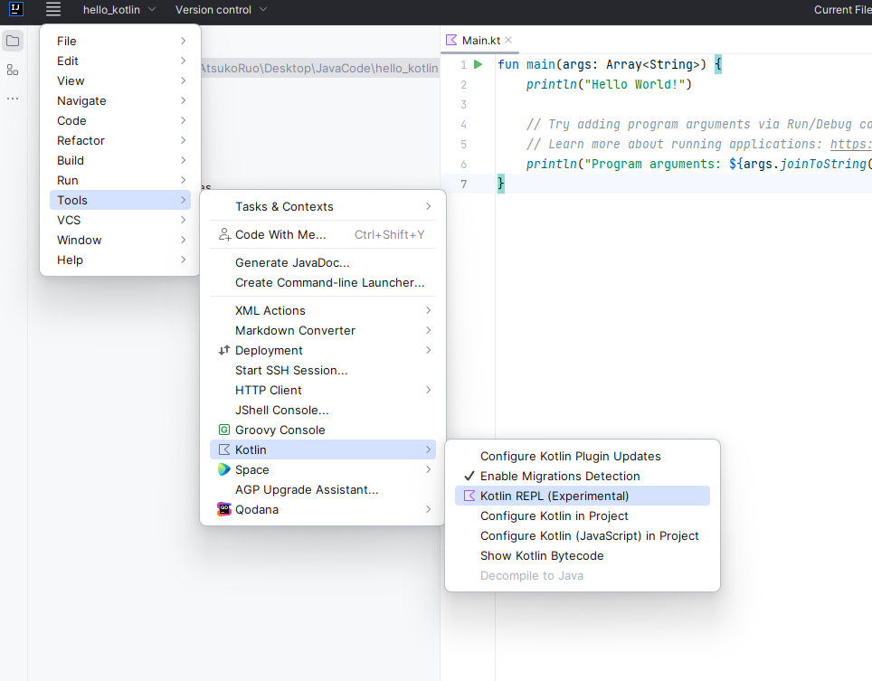
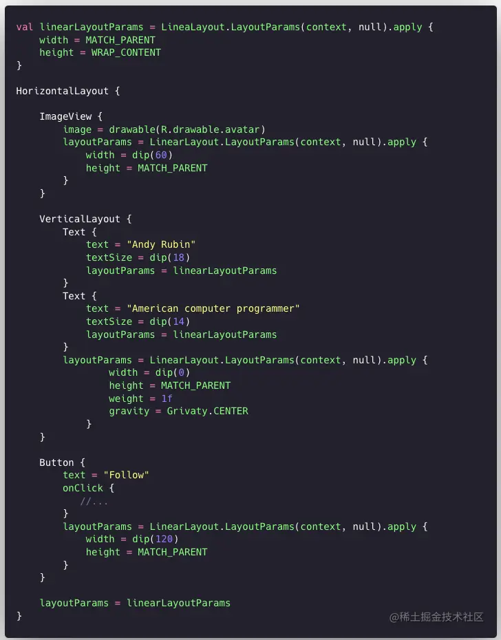

# Kotlin

[TOC]

## 类型系统

**Kotlin REPL** is an interactive shell.  这和Python的命令行差不多




Kotlin keeps numbers as primitives, but it lets you call methods on numbers as if they were objects.

~~~kotlin
2.times(3)
3.5.plus(4)
2.4.div(2)
~~~

this is done by **boxing ** mechanism, namely it creates actual object wrappers around numbers.   Boxing happens automatically


声明变量：

~~~kotlin
var i: Int = 5;				// 显式指定类型
var b = i.toByte();			// 隐式推断类型
~~~

To make long numeric constants more readable, Kotlin allows you to place underscores in the numbers：

~~~kotlin
val oneMillion = 1_000_000
val socialSecurityNumber = 999_99_9999L
val hexBytes = 0xFF_EC_DE_5E
val bytes = 0b11010010_01101001_10010100_10010010
~~~

`val`相当于Java中的 `final`，而`var`就是声明一个可修改的变量。


Assign a `Byte` value to variables of different types.

~~~kotlin
val b2: Byte = 1 // OK, literals are checked statically
println(b2)
⇒ 1

val i1: Int = b2
⇒ error: type mismatch: inferred type is Byte but Int was expected

val i2: String = b2
⇒ error: type mismatch: inferred type is Byte but String was expected

val i3: Double = b2
⇒ error: type mismatch: inferred type is Byte but Double was expected
~~~

~~~kotlin
val i4: Int = b2.toInt() // OK!
println(i4)
⇒ 1

val i5: String = b2.toString()
println(i5)
⇒ 1

val i6: Double = b2.toDouble()
println(i6)
⇒ 1.0
~~~


String类型支持` ' ‘`、`" "`、`$variable`、`${expression}`·、`+` 语法  

Kotlin 中有两类相等性：

- **结构相等**（`==`——用 `equals()` 检测）；
- **引用相等**（`===`——两个引用指向同一对象）。

按照约定，像 `a == b` 这样的表达式会翻译成（运算符重载规则）：

~~~kotlin
a?.equals(b) ?: (b === null)
~~~


### 解构声明

~~~kotlin
val (name, age) = person
~~~

一个解构声明会被编译成以下代码：

~~~kotlin
val name = person.component1()
val age = person.component2()
~~~

其中的 `component1()` 和 `component2()` 函数是在 Kotlin 中广泛使用的**约定原则**：任何表达式都可以出现在解构声明的右侧，只要可以对它调用所需数量的 `component` 函数即可。 当然，可以有 `component3()` 和 `component4()` 等等。


### 类型别名

~~~kotlin
typealias FileTable<K> = MutableMap<K, MutableList<File>>

typealias MyHandler = (Int, String, Any) -> Unit

typealias Predicate<T> = (T) -> Boolean


class A {
    inner class Inner
}
typealias AInner = A.Inner
~~~

类型别名不会引入新类型。 它们等效于相应的底层类型，Kotlin编译器总是把类名别名进行扩展。

### 空类型

By default, variables cannot be `null`. 下面这个语句就是错误的：

~~~kotlin
var rocks: Int = null
~~~

Use the question mark operator, `?`, after the type to indicate that a variable can be null.

~~~kotlin
var marbles: Int? = null
~~~

You can test for `null` with the `?` operator, saving you the pain of writing many `if`/`else` statements.

~~~kotlin
var fishFoodTreats = 6
if (fishFoodTreats != null) {
    num = fishFoodTreats.dec()
} else {
    num = null;
}

var fishFoodTreats = 6
num = fishFoodTreats?.dec()
~~~

You can also chain null tests with the `?:` operator.

~~~kotlin
fishFoodTreats = fishFoodTreats?.dec() ?: 0
~~~

It's shorthand for "if `fishFoodTreats` is not `null`, decrement and use it; otherwise use the value after the `?:`, which is 0".

The not-null assertion operator, `!!` (double-bang), converts any value to a non-null type and throws an exception if the value is `null`.


## 语法糖

Kotlin提供了一个齁甜的语法糖，那就是**「代码块最后的表达式就是结果」，在所有使用代码块并期望得到一个结果的地方都是成立的**。


## Condition

~~~kotlin
if (numberOfFish == 0) {
    println("Empty tank")
} else if (numberOfFish < 40) {
    println("Got fish!")
} else {
    println("That's a lot of fish!")
}
~~~

`if`表达式：

~~~kotlin
// With else
if (a > b) {
    max = a
} else {
    max = b
}

// As expression
max = if (a > b) a else b

// with block 
val max = if (a > b) {
    print("Choose a")
    a
} else {
    print("Choose b")
    b
}
~~~


`when`的普通用法和`switch`一样，但`when`可以接收任意表达式为分支条件

~~~kotlin
 when (any) {
    //分支条件为常量
    "1" -> print("输入的内容为数字1")

    //分支条件为boolean值
    is String -> print("输入的内容是String类型的任意变量")

    //分支条件为集合
    setOf("0", "A") -> print("输入的内容是数字0和字母A的集合")

    //分支条件为枚举类中常量的字段
    Person.Dad.personName -> print("输入的内容是枚举类Person中变量Dad的姓名") 
}
~~~

`when`可以不带任何参数，此时表达式必须是任意的**boolean表达式**

~~~kotlin
fun log(num: Int): Int = when {
    num < 0 -> abs(num)
    num < 10 -> num + 2
    else -> {
        print("当前值大于10，需返回")
        num * 2
    }
}
~~~


## Array & List

Declare a unmodified list using `listOf`,

~~~kotlin
val school = listOf("mackerel", "trout", "halibut")
~~~

Declare a list that can be changed using `mutableListOf`. 

~~~kotlin
val myList = mutableListOf("tuna", "salmon", "shark")
myList.remove("shark")
~~~

过滤是最常用的集合处理任务之一。在Kotlin中，过滤条件由 *谓词* 定义。基本的过滤函数是 `filter()`，它只能检查元素的值。如果想在过滤中使用元素在集合中的位置，应该使用 `filterIndexed()`

~~~kotlin
val numbers = listOf("one", "two", "three", "four")

val filteredIdx = numbers.filterIndexed { index, s -> (index != 0) && (s.length < 5)  }
val filteredNot = numbers.filter { it.length <= 3 }
~~~

 By default, `filter` is eager，and each time you use the filter, a list is created. To make the filter lazy, you can use a `Sequence`（相当于Java中的流，惰性求值）

~~~kotlin
val decorations = listOf ("rock", "pagoda", "plastic plant", "alligator", "flowerpot")
val filtered = decorations.asSequence().filter { it[0] == 'p' }
val newList = filtered.toList()
~~~

~~~kotlin
val map = (0..3).filter {
    println("filter:$it")
    it % 2 == 0
}.map {
    println("map:$it")
    it + 1
}

/**
filter:0
filter:1
filter:2
filter:3
map:0
map:2
[1, 3]
*/
~~~

~~~kotlin
val sequence = (0..3).asSequence().filter {
    println("filter:$it")
    it % 2 == 0
}.map {
    println("map:$it")
    it + 1
}
/**
filter:0
map:0
filter:1
filter:2
map:2
filter:3
[1, 3]
*/
~~~


 there is no mutable version of an `Array`，Declare an array of strings using `arrayOf`

~~~kotlin
val school = arrayOf("shark", "salmon", "minnow")
println(java.util.Arrays.toString(school))
~~~

Combine two arrays with the `+` operator.

~~~kotlin
val numbers = intArrayOf(1,2,3)
val numbers3 = intArrayOf(4,5,6)
val foo2 = numbers3 + numbers
println(foo2[5]) 	// 3
~~~

嵌套数组（本质上还是一维的）：

~~~kotlin
val numbers = intArrayOf(1, 2, 3)
val oceans = listOf("Atlantic", "Pacific")
val oddList = listOf(numbers, oceans, "salmon")
println(oddList)
~~~

## Loop

~~~kotlin
var bubbles = 0
while (bubbles < 50) {
    bubbles++
}
println("$bubbles bubbles in the water\n")

do {
    bubbles--
} while (bubbles > 50)
println("$bubbles bubbles in the water\n")

repeat(2) {
    println("A fish is swimming")
}


for (i in 1..5) print(i) 		// ⇒ 12345

for (i in 5 downTo 1) print(i)	// ⇒ 54321	这个是中缀表达式，等价于5.downTo(1);

for (i in 3..6 step 2) print(i)	// ⇒ 35

for (i in 'd'..'g') print (i)	// ⇒ defg

for (item: Int in ints) {
    // ...
}

for ((index, value) in array.withIndex()) {
    println("the element at $index is $value")
}
~~~


## function

As with other languages, the Kotlin `main()` function specifies the entry point for execution.

~~~kotlin
fun main(args: Array<String>) {
    println("Hello, world!")
}
~~~


Some other languages have ***statements***, which are lines of code that don't have a value. **In Kotlin, almost everything is an *expression*** and has a value—even if that value is `kotlin.Unit`.

~~~kotlin
val unitValue = println("This is an expression")
println(unitValue)
~~~


Kotlin 函数使用 `fun` 关键字声明：

~~~kotlin
fun double(x: Int): Int {
    return 2 * x
}
~~~


函数参数使用 `Pascal` 表示法定义——`name: type`，参数用逗号隔开， 每个参数必须有显式类型：

~~~ktolin
fun powerOf(number: Int, exponent: Int): Int { /*……*/ }
~~~

在声明函数参数的时候，你也可以使用[尾部逗号](https://book.kotlincn.net/text/coding-conventions.html#尾部逗号)：

~~~kotlin
fun powerOf(
    number: Int,
    exponent: Int, // 尾部逗号
) { /*……*/ }
~~~

函数参数可以有默认值

~~~kotlin
fun read(
    b: ByteArray,
    off: Int = 0,
    len: Int = b.size,
) { /*……*/ }
~~~

默认值可以在参数列表中的任何位置

~~~kotlin
fun foo(
    bar: Int = 0,
    baz: Int,
    a : Int,
    d : Int = 10,
    c : Int,
) { /*……*/ }

foo( a = 20, baz = 1, c = 12);
~~~

覆盖方法总是使用与基类型方法相同的默认参数值。 当覆盖一个有默认参数值的方法时，必须从签名中省略默认参数值：

~~~kotlin
open class A {
    open fun foo(i: Int = 10) { /*……*/ }
}

class B : A() {
    override fun foo(i: Int) { /*……*/ }  // 不能有默认值
}

fun main(args: Array<String>) {
    var b : B = B();
    b.foo();
}
~~~


如果最后一个参数是 [lambda 表达式](https://book.kotlincn.net/text/lambdas.html#lambda-表达式语法)，那么它既可以在括号内传入，也可以在[括号外](https://book.kotlincn.net/text/lambdas.html#传递末尾的-lambda-表达式)传入：

~~~kotlin
fun foo(
    bar: Int = 0,
    baz: Int = 1,
    qux: () -> Unit,
) { /*……*/ }

foo(1) { println("hello") }     // 使用默认值 baz = 1
foo(qux = { println("hello") }) // 使用两个默认值 bar = 0 与 baz = 1
foo { println("hello") }        // 使用两个默认值 bar = 0 与 baz = 1
~~~


在调用函数的过程中使用**具名参数**，这样可以随意调整参数的位置了，而且还可以让在中间的默认参数使用默认值（位置参数就做不到这一点）。注意，**位置传参以及具名传参不能混用**。

~~~kotlin
fun foo(
    a : Int,
    b : Int = 2,
    c : Int = 12,
    d : Int,
    e : Int = 23,
    f : Int = 24,
) { /*……*/ }

foo(a = 12, d = 12);				
// OK 具名传参， 而且让中间的默认参数使用了默认值，这是位置传参做不到的

foo(d = 12, a = 12);				
// OK 具名传参，可以随意调整参数的位置

foo(1, c = 2, b = 3, 4)				
// Error: Mixing named and positioned arguments is not allowed

foo(1, b = 2, c = 12, 4)			
// OK 虽然是位置传参的形式，但实际上是具名传参

foo(1, 2, 3, 4, f = 12, e = 12);
// OK 虽然是位置传参的形式，但实际上是具名传参
~~~

**强烈推荐将默认参数集中放在最后。**

>**Note:** A function used as a default value is evaluated at runtime, so do not put an expensive operation like a file read or a large memory allocation in the function. The operation is executed every time your function is called, which may slow down your program.


可以通过**具名参数**和**展开操作符**来传入[可变参数（`vararg`）](https://book.kotlincn.net/text/functions.html#可变数量的参数（varargs）)：

~~~kotlin
fun foo(vararg strings: String) { /*……*/ }

foo(strings = *arrayOf("a", "b", "c"))
~~~


当函数体**由单个表达式构成**时，可以省略花括号并且在 `=` 符号之后指定代码体即可：

~~~kotlin
fun double(x: Int): Int = x * 2

fun fishFood (day : String)  = when (day) {
    "Monday" -> "flakes"
    else -> "nothing"
}
~~~

当返回值类型可由编译器推断时，显式声明返回类型是[可选](https://book.kotlincn.net/text/functions.html#显式返回类型)的：

~~~kotlin
fun double(x: Int) = x * 2
~~~

**具有块代码体的函数**必须始终显式指定返回类型，除非他们在返回 `Unit`类型的值。Kotlin 不推断具有块代码体的函数的返回类型，因为这样的函数在代码体中可能有复杂的控制流。


标有 `infix` 关键字的函数也可以使用中缀表示法（忽略该调用的点与圆括号）调用。 中缀函数必须满足以下要求：

- 它们必须是成员函数或[扩展函数](https://book.kotlincn.net/text/extensions.html)。
- 它们必须只有一个参数。
- 其参数不得[接受可变数量的参数](https://book.kotlincn.net/text/functions.html#可变数量的参数（varargs）)且不能有[默认值](https://book.kotlincn.net/text/functions.html#默认参数)。

~~~kotlin
infix fun Int.shl(x: Int): Int { …… }

// 用中缀表示法调用该函数
1 shl 2

// 等同于这样
1.shl(2)
~~~


 Kotlin supports lambdas. A **lambda** is an expression that makes **a anonymous function**.（在Java中是通过函数式接口来支持Lambda表达式的）

Lambda变量的声明：

~~~kotlin
val action: (Int, Int) -> Unit?
val action: (acc: Int, nextElement : Int) -> Unit? 	// 可以给参数命名
~~~

Lambda字面量的创建：

~~~kotlin
{ 
    // 如果一个 lambda 表达式有参数，前面是参数，后跟“->”
    acc: Int, next: Int -> 
        print("acc = $acc, next = $next, ") 
        val result = next + i
        println("result = $result")
        // 最后一个表达式是返回值：
        result
}

{
    // 可以省略类型
    acc, next -> acc + next;
}
~~~

- lambda 表达式总是括在花括号中
- 函数体跟在一个 `->` 之后，但无需再添加括号

只有一个参数的lambda 表达式很常见，因此我们可以省略Lambda表达式的参数列表，此时该参数会隐式声明为 `it`：

~~~kotlin
ints.filter { it > 0 }
~~~

 [LINQ-风格](https://learn.microsoft.com/en-us/dotnet/csharp/programming-guide/concepts/linq/) 的代码：

~~~kotlin
strings.filter { it.length == 5 }.sortedBy { it }.map { it.uppercase() }
~~~

如果 lambda 表达式的参数未使用，那么可以用下划线取代其名称：

~~~kotlin
map.forEach { (_, value) -> println("$value!") }
~~~

如果想要将一个普通的函数传递给Lambda变量，那么使用`::`操作符：

~~~kotlin
fun updateDirty(dirty: Int, operation: (Int) -> Int): Int = operation(dirty)
fun increaseDirty( start: Int ) = start + 1

updateDirty(15, ::increaseDirty)		// 返回值为16
~~~


### 标准函数

结合使用`?.`操作符和`let`函数来简化判空逻辑的编写

~~~kotlin
study?.readBooks()
study?.doHomework()
~~~

~~~kotlin
if (study != null) {
    study.readBooks()
}
if (study != null) {
    study.doHomework()
}
~~~

~~~kotlin
study?.let { stu ->
    stu.readBooks()
    stu.doHomework()
}
~~~


`with`函数可以在连续调用同一个对象的多个方法时让代码变得更加精简：

~~~kotlin
val builder = StringBuilder()
builder.append("Start eating fruits.\n")
for (fruit in list) {
    builder.append(fruit).append("\n")
}
builder.append("Ate all fruits.")
val result = builder.toString()
println(result)
~~~

~~~kotlin
val result = with(StringBuilder()) {
    append("Start eating fruits.\n")
    for (fruit in list) {
        append(fruit).append("\n")
    }
    append("Ate all fruits.")
    toString()
}
println(result)
~~~

`run`和`with`基本上是一样的，除了语法调用形式

~~~kotlin
with(StringBuilder()) {
    
}

StringBuilder().run {
    
}
~~~

`apply`与`run`基本上也是一样的，但是apply返回的是调用对象本身

### 扩展

扩展函数可以实现「即使在不修改某个类的源码的情况下，仍然可以向该类添加新的函数」的功能。扩展并不能真正的修改他们所扩展的类，即在一个类中插入新成员。

声明一个扩展函数需用一个**接收者类型**（**被扩展类型**）来作为它的前缀：

~~~kotlin
fun MutableList<Int>.swap(index1: Int, index2: Int) {
    val tmp = this[index1] // “this”对应该列表
    this[index1] = this[index2]
    this[index2] = tmp
}
~~~

其中，通过 `this` 关键字获取接收者对象。 

现在，可以对任意 `MutableList<Int>` 对象来调用该函数了：

~~~kotlin
val list = mutableListOf(1, 2, 3)
list.swap(0, 2) // “swap()”内部的“this”会保存“list”的值
~~~


**Extension functions are dispatched statically**. So which extension function is called is already known at compile time based on the receiver type. For example:

~~~kotlin
fun main() {
    open class Shape
    class Rectangle: Shape()

    fun Shape.getName() = "Shape"
    fun Rectangle.getName() = "Rectangle"

    fun printClassName(s: Shape) {
        println(s.getName())
    }

    printClassName(Rectangle())			// Shape
}
~~~

如果一个类定义有一个成员函数与一个扩展函数，但这两个函数的签名是相同的，那么成员函数的优先级最高：

~~~kotlin
fun main() {
    class Example {
        fun printFunctionType() { println("Class method") }
    }

    fun Example.printFunctionType() { println("Extension function") }

    Example().printFunctionType()		// 输出 Class method
}
~~~

注意可以为可空的接收者类型定义扩展  If the receiver is `null`, then `this` is also `null`：

~~~kotlin
fun Any?.toString(): String {
    if (this == null) return "null"
    // 空检测之后，“this”会自动转换为非空类型，所以下面的 toString()
    // 解析为 Any 类的成员函数
    return toString()
}
~~~


与扩展函数类似，Kotlin 支持扩展属性。由于扩展没有实际的将成员插入类中，因此对扩展属性来说[幕后字段](https://book.kotlincn.net/text/properties.html#幕后字段)是无效的，这就是为什么*扩展属性不能有初始化器*。他们的行为只能由显式提供的 getter/setter 定义：

~~~kotlin
val <T> List<T>.lastIndex: Int
    get() = size - 1

House.number
~~~


扩展的作用域仅限于包中，如果使用包之外的一个扩展，那么就必须导入：

~~~kotlin
package org.example.declarations

fun List<String>.getLongestString() { /*……*/}
~~~

~~~kotlin
package org.example.usage

import org.example.declarations.getLongestString

fun main() {
    val list = listOf("red", "green", "blue")
    list.getLongestString()
}
~~~

可以在一个类内部为另一个类声明扩展。在这样的扩展内部，有多个`this`对象。声明扩展的类称为***分发接收者***，而而扩展函数的接收者称为***扩展接收者***。

访问方法/属性时，会自动应用合适的`this`对象。对于分发接收者与扩展接收者的成员名字冲突的情况，扩展接收者优先。可以通过限定的 `this` 语法来指定调用哪个this对象。

~~~kotlin
class Host(val hostname: String) {
    fun printHostname() {
        print(hostname);
    }
}

class Connection(val host: Host, val port: Int) {
    fun printPort() { print(port) }

    fun Host.printConnectionString() {
        this@printConnectionString.printHostname()
        printHostname();
        this@Connection.printHostname()
        print(":")
        printPort()
    }

    fun connect() {
        host.printConnectionString()
    }

    fun printHostname() {
        print("test");
    }
}

fun main() {
    Connection(Host("kotl.in"), 433).connect();
}
~~~


函数的分发对于分发接收者类型是虚拟的，但对于扩展接收者类型是静态的。

~~~kotlin
open class Base { }

class Derived : Base() { }

open class BaseCaller {
    open fun Base.printFunctionInfo() {
        println("Base extension function in BaseCaller")  // (1)
    }

    open fun Derived.printFunctionInfo() {
        println("Derived extension function in BaseCaller")
    }

    fun call(b: Base) {
        b.printFunctionInfo()   // 调用扩展函数
    }
}
class DerivedCaller: BaseCaller() {
    override fun Base.printFunctionInfo() {
        println("Base extension function in DerivedCaller")	// (2
(3    }

    override fun Derived.printFunctionInfo() {
        println("Derived extension function in DerivedCaller")
    }
}

fun main() {
    BaseCaller().call(Base())   // “Base extension function in BaseCaller”
    DerivedCaller().call(Base())  // “Base extension function in DerivedCaller”——分发接收者虚拟解析
    DerivedCaller().call(Derived())  // “Base extension function in DerivedCaller”——扩展接收者静态解析
}
~~~

## 类

Kotlin 中使用关键字 `class` 声明类

~~~kotlin
class Aquarium {
    var width: Int = 20
    var height: Int = 40
    var length: Int = 100
}
~~~

Under the hood, Kotlin automatically creates getters and setters for the propertie

### 构造函数

在 Kotlin 中的一个类有一个**主构造函数**并可能有一个或多个**次构造函数**。主构造函数在类头中声明，它跟在类名与可选的类型参数后。

~~~kotlin
class Person(firstName: String) { /*……*/ }
class Person(val firstName: String, val lastName: String, var age: Int)
class Person(val firstName: String, val lastName: String, var isEmployed: Boolean = true)
~~~

如果构造函数有注解或可见性修饰符，这个 `constructor` 关键字是必需的，并且这些修饰符在它前面：

~~~kotlin
class Customer public @Inject constructor(name: String) { /*……*/ }
~~~

如果主构造方法的参数不携带val、var关键字，那么这些参数只能在init方法中使用。而携带的话，那么就作为类属性出现，因此下面两段代码是等价的：

~~~java
class Student constructor(name : String, age : Int){
	var name : String = name
	var age : Int = age
}

class Student constructor(var name : String, var age : Int){
}
~~~

注意，方法参数不能携带val、var关键字，而构造方法中的可以。


 The class header can't contain any runnable code. If you want to run some code during object creation, use **initializer blocks** inside the class body. Initializer blocks are declared with the `init` keyword followed by curly braces. 在实例初始化期间，初始化块按照它们出现在类体中的顺序执行，并与属性初始化器交织在一起：

~~~kotlin
class InitOrderDemo(name: String) {
    val firstProperty = "First property: $name".also(::println)

    init {
        println("First initializer block that prints $name")
    }

    val secondProperty = "Second property: ${name.length}".also(::println)

    init {
        println("Second initializer block that prints ${name.length}")
    }
}
//sampleEnd

fun main() {
    InitOrderDemo("hello")
}

/**
First property: hello
First initializer block that prints hello
Second property: 5
Second initializer block that prints 5
*/
~~~

类也可以声明前缀有 `constructor`的**次构造函数**：

~~~kotlin
class Pet {
    constructor(owner: Person) {
        owner.pets.add(this) // adds this pet to the list of its owner's pets
    }
}
~~~

次构造函数的参数只能在构造器中使用，不能在类中使用。

**如果类有一个主构造函数，每个次构造函数需要委托给主构造函数，**可以直接委托或者通过别的次构造函数间接委托。委托到同一个类的另一个构造函数用 `this` 关键字即可：

~~~kotlin
class Person(val name: String) {
    val children: MutableList<Person> = mutableListOf()
    constructor(name: String, parent: Person) : this(name) {
        parent.children.add(this)
    }
}
~~~

请注意，初始化块中的代码实际上会成为主构造函数的一部分。对主构造函数的委托发生在访问次构造函数的第一条语句时，因此所有初始化块与属性初始化器中的代码都会在次构造函数体之前执行。

即使该类没有主构造函数，这种委托仍会隐式发生，并且仍会执行初始化块：

~~~kotlin
class Constructors {
    init {
        println("Init block")
    }

    constructor(i: Int) {
        println("Constructor $i")
    }
}
~~~

如果一个非抽象类没有声明任何（主或次）构造函数，它会有一个生成的不带参数的主构造函数。构造函数的可见性是 public。如果你不希望你的类有一个公有构造函数，那么声明一个带有非默认可见性的空的主构造函数：

~~~kotlin
class DontCreateMe private constructor() { /*……*/ }
~~~


创建一个类的实例，只需像普通函数一样调用构造函数：

~~~kotlin
val invoice = Invoice()
val customer = Customer("Joe Smith")
~~~

### 继承

在 Kotlin 中所有类都有一个共同的超类 `Any`，对于没有超类型声明的类它是默认超类。`Any` 有三个方法：`equals()`、 `hashCode()` 与 `toString()`。

默认情况下，Kotlin 类是最终（final）的——它们不能被继承。 要使一个类可继承，请用 `open` 关键字标记它：

~~~kotlin
open class Base // 该类开放继承
~~~


继承语法如下

~~~kotlin
open class Base(p: Int)

class Derived(p: Int) : Base(p)
~~~

同样地，方法默认是`final`的，即使是在`open`类中

~~~kotlin
open class Rectangle() : Shape() {
    // 这个是final的
    fun draw() { /*……*/ }
}
~~~

如果想要重写该方法，那么必须携带open关键字：

~~~kotlin
open class Rectangle() : Shape() {
    // 这个是open的
    open fun draw() { /*……*/ }
}
~~~

子类所要覆写的方法必须要有`override`关键字：

~~~kotlin
open class Shape {
    open fun draw() { /*……*/ }
    fun fill() { /*……*/ }
}

class Circle() : Shape() {
    override fun draw() { /*……*/ }
}
~~~

此时，可以再次使用final关键字，禁用该方法的覆写：

~~~kotlin
class Circle() : Shape() {
    final override fun draw() { /*……*/ }
}
~~~


派生类的主构造函数**必须**调用父类的主/次构造函数，如果如果派生类没有主构造函数，那么每个次构造函数必须使用`super` 关键字初始化其基类型，或委托给另一个做到这点的构造函数。 

**属性与方法的覆盖机制相同**（在Java中属性并不能覆写，而且Kotlin中的属性并不是Java中的属性，它更偏向于一种getter/setter方法）。覆写的属性必须有 `override` 关键字，而且它们必须具有兼容的类型

~~~kotlin
open class Base {
    open val num: Int = 0;
}

class Derived(): Base() {
    override val num: Int
        get() = 10
}


fun main() {
    val base: Base = Derived();
    println(base.num);		//10
}
~~~

你也可以用一个 `var` 属性覆盖一个 `val` 属性，但反之则不行。


派生类中的代码可以使用 `super` 关键字调用其超类的函数与属性访问器的实现：

在一个内部类中访问外部类的超类，可以使用`super@Outer`来实现：

~~~kotlin
open class Rectangle {
    open fun draw() { println("Rectangle::draw") }
}

//sampleStart
class FilledRectangle: Rectangle() {
    override fun draw() {
        println("FiiledRectangle::draw")
    }

    inner class Filler {
        fun draw() {
            println("Filler::draw");
        }

        fun drawAndFill() {
            super@FilledRectangle.draw() // 调用 Rectangle 的 draw() 实现
            draw();
            this@FilledRectangle.draw()
        }
    }
}
~~~

如需表示采用从哪个超类型继承的实现，请使用由尖括号中超类型名限定的 `super` ，如 `super<Base>`：

~~~kotlin
open class Rectangle {
    open fun draw() { /* …… */ }
}

interface Polygon {
    fun draw() { /* …… */ } // 接口成员默认就是“open”的
}

class Square() : Rectangle(), Polygon {
    // 编译器要求覆盖 draw()：
    override fun draw() {
        super<Rectangle>.draw() // 调用 Rectangle.draw()
        super<Polygon>.draw() // 调用 Polygon.draw()
    }
}
~~~

可以同时继承 `Rectangle` 与 `Polygon`， 但是二者都有各自的 `draw()` 实现，所以必须在 `Square` 中覆盖 `draw()`， 并为其提供一个单独的实现以消除歧义。

### 初始化顺序

在构造派生类的新实例的过程中，第一步完成其基类的初始化

### 静态方法

Kotlin弱化了静态方法这个概念，反而推荐使用单例类来实现静态语义。但是如果直接使用单例类的话，那么静态语义的粒度太大，即整个类中的方法都是静态的。如果我们想让类中的某些方法是静态的，该怎么办？我们可以通过`companion object`来解决这个问题

~~~Kotlin
class Util {

    fun doAction1() {
        println("do action1")
    }

    companion object {
        fun doAction2() {
            println("do action2")
        }
    }

}
~~~

这里我们通过`companion`关键字定义了一个伴生类，Kotlin会保证`Util`类始终只会存在一个伴生类对象。可见，伴生类实际上就是一个静态字段而已。


如果您需要真正的静态方法，Kotlin提供了两种实现方式：

- 注解：

  ~~~kotlin
  companion object {
      @JvmStatic
      fun doAction2() {
          println("do action2")
      }
  }
  ~~~

  注意，`@JvmStatic`注解只能加在单例类或`companion object`中的方法

- 顶层方法：**Kotlin编译器会将所有的顶层方法全部编译成静态方法**


### 属性

一般地，属性必须在构造函数或者初始化器中完成初始化。而`lateinit` 修饰符标记的属性可以避免这一点，这样可以很方便地通过依赖注入来初始化

~~~kotlin
public class MyTest {
    lateinit var subject: TestSubject

    @SetUp fun setup() {
        subject = TestSubject()
    }

    @Test fun test() {
        subject.method()  // 直接解引用
    }
}
~~~

在初始化前读取一个 `lateinit` 属性会抛出一个特定异常


声明一个属性的完整语法如下：

~~~kotlin
var <propertyName>[: <PropertyType>] [= <property_initializer>]
    [<getter>]
    [<setter>]
~~~

其初始器（initializer）、getter 和 setter 都是可选的。属性类型如果可以从初始器， 或其 getter 的返回值中推断出来，也可以省略：

~~~kotlin
var initialized = 1 // 类型 Int、默认 getter 和 setter
val area get() = this.width * this.height
~~~

一个只读属性的语法和一个可变的属性的语法有两方面的不同： 

1. 只读属性的用 `val` 而不是 `var` 声明 

2. 只读属性不允许 setter


使用getter、setter的例子：

~~~kotlin
var stringRepresentation: String
    get() = this.toString()
    set(value) {
        setDataFromString(value)
    }

var setterVisibility: String = "abc"
    private set // 此 setter 是私有的并且有默认实现

var setterWithAnnotation: Any? = null
    @Inject set // 用 Inject 注解此 setter
~~~


**在 Kotlin 中，字段只能是属性的一部分，不能被直接声明**，它是由Kotlin编译器自动提供的，可以在`setter`、`getter`中通过`field`标识符来访问这个字段。

~~~kotlin
var counter = 0 // 这个初始器直接为幕后字段赋值
    set(value) {
        if (value >= 0)
            field = value
    }
~~~

> `field` 标识符只能用在属性的访问器内。

访问器的默认实现就直接使用了字段，但是像下面这个属性，kotlin并不会为其生成字段：

~~~kotlin
val isEmpty: Boolean
    get() = this.size == 0
~~~


我们可以用带有默认访问器的私有属性（`backing property`），来代替字段。这样代替的原因是：对于私有属性的访问器的默认实现，JVM会做优化，以避免函数调用开销

~~~kotlin
private var _table: Map<String, Int>? = null
public val table: Map<String, Int>
    get() {
        if (_table == null) {
            _table = HashMap() // 类型参数已推断出
        }
        return _table ?: throw AssertionError("Set to null by another thread")
    }
~~~


如果**只读属性**的值在编译期是已知的，那么可以使用 `const` 修饰符将其标记为*编译期常量*。 这种属性需要满足以下要求：

- 必须位于顶层或者是 [`object` 声明](https://book.kotlincn.net/text/object-declarations.html#对象声明) 或*[伴生对象](https://book.kotlincn.net/text/object-declarations.html#伴生对象)*的一个成员
- 必须以 `String` 或原生类型值初始化
- 不能有自定义 getter


### 接口

使用关键字 `interface` 来定义接口：

~~~kotlin
interface MyInterface {
    fun bar()
    fun foo() {
      // 可选的方法体
    }
}

~~~

一个类或者对象可以实现一个或多个接口：

~~~kotlin
class Child : MyInterface {
    override fun bar() {
        // 方法体
    }
}
~~~

可以在接口中定义属性。在接口中声明的属性要么是抽象的，要么提供访问器的实现。在接口中声明的属性没有幕后字段（backing field），因此，在接口中声明的访问器不能引用它们：

~~~kotlin
interface MyInterface {
    val prop: Int // 抽象的

    val propertyWithImplementation: String
        get() = "foo"			// 不能使用field

    fun foo() {
        print(prop)
    }
}

class Child : MyInterface {
    override val prop: Int = 29
}
~~~

一个接口可以从其他接口派生：

~~~kotlin
interface Named {
    val name: String
}

interface Person : Named {
    val firstName: String
    val lastName: String

    override val name: String get() = "$firstName $lastName"
}
~~~

实现多个接口时，可能会遇到同一方法继承多个实现的问题：

~~~kotlin
interface A {
    fun foo() { print("A") }
    fun bar()
}

interface B {
    fun foo() { print("B") }
    fun bar() { print("bar") }
}

class D : A, B {
    override fun foo() {
        super<A>.foo()
        super<B>.foo()
    }

    override fun bar() {
        super<B>.bar()
    }
}
~~~


只有一个抽象方法的接口称为**函数式接口**或 **单一抽象方法（SAM）接口**。函数式接口可以有多个非抽象成员，但只能有一个抽象成员。

可以用 `fun` 修饰符在 Kotlin 中声明一个函数式接口（Java中的@FunctionalInterface）。

~~~kotlin
fun interface KRunnable {
   fun invoke()
}
~~~

Kotlin can convert any lambda expression whose signature matches the signature of the interface's single method into the code, which dynamically instantiates the interface implementation.

在kotlin中，函数式接口与lambda表达式是两个不同的类型，而在Java中，lambda表达式实际上就是一个函数式接口的实现类而已。

~~~kotlin
fun interface IntPredicate {
    fun accept(i: Int): Boolean
}

val isEven = object : IntPredicate {
    override fun accept(i: Int): Boolean {
        return i % 2 == 0
    }
}

val isOdd : (Int) -> Boolean = { it % 2 == 1; }

isEven.accept(2);
isOdd(3);
~~~


~~~java
interface IntPredicate {
    Boolean accept(Integer i);
}

IntPredicate isEven = new IntPredicate() {
    @Override
    Boolean accept(Integer i) {
        return i % 2 == 0;
    }
}
IntPredicate isOdd = (it) -> { return it % 2 == 1; }

isOdd.accept(2);
isEven(3);
~~~

通过上述两段代码片段的对比，可以发现在Kotlin中Lambda类型是和类类型相区分的，而在Java中却不是的。


例如，有这样一个 Kotlin 函数式接口：

~~~kotlin
fun interface IntPredicate {
   fun accept(i: Int): Boolean
}
~~~

如果不使用 SAM 转换，那么你需要像这样编写代码：

~~~kotlin
// 创建一个类的实例
val isEven = object : IntPredicate {			// 这里的object为一个匿名对象
   override fun accept(i: Int): Boolean {
       return i % 2 == 0
   }
}
~~~

通过利用 Kotlin 的 SAM 转换（就是一个语法糖），可以改为以下等效代码：

~~~kotlin
val isEven = IntPredicate { it % 2 == 0 }		// isEven的类型仍为IntPredicate，而不是(Int)->Boolean Lambda类型
~~~

这个Lambda对象会被视为对于抽象方法的实现。

### 委托

委托是一种设计模式，它的基本理念是：操作对象自己不会去处理某段逻辑，而是会把工作委托给另外一个辅助对象去处理。 Kotlin 提供了原生的语法来支持委托模式的实现。Kotlin将委托分为了两种：

- 类委托：将一个类的具体实现委托给另一个类去完成
- 委托属性：将一个属性（字段）的具体实现委托给另一个类去完成。


`Derived` 的超类型列表中的 `by`-子句表示 `b` 将会在 `Derived` 中内部存储（保存引用，而不是副本）， 并且编译器将生成转发。

~~~kotlin
interface Base {
    fun print()
}

class BaseImpl(val x: Int) : Base {
    override fun print() { print(num) }
    var num: Int = x;
}

class Derived(b: Base) : Base by b

fun main() {
    val b = BaseImpl(10)
    val derived =  Derived(b)
    b.num = 100;
    derived.print();		// 100，这说明保存着委托对象的引用
}
~~~

但请注意，委托对象的成员只能访问自身的实现，而不是被委托对象的实现：

~~~kotlin
interface Base {
    val message: String
    fun print()
}

class BaseImpl(val x: Int) : Base {
    override val message = "BaseImpl: x = $x"
    override fun print() { println(message) }
}

class Derived(b: Base) : Base by b {
    // 在 b 的 `print` 实现中不会访问到这个属性
    override val message = "Message of Derived"
}

fun main() {
    val b = BaseImpl(10)
    val derived = Derived(b)
    derived.print()
    println(derived.message)
}
~~~


委托属性的语法结构：

~~~kotlin
class MyClass {
    var p by Delegate()
}
~~~

当调用`p`属性的时候会自动调用`Delegate`类的`getValue()`方法，当给`p`属性赋值的时候会自动调用`Delegate`类的`setValue()`方法。因此，我们还得必须在`Delegate`类中提供这两种方法：

~~~kotlin
class Delegate {

    var propValue: Any? = null

    operator fun getValue(myClass: MyClass, prop: KProperty<*>): Any? {
        //KProperty<*>是Kotlin中的一个属性操作类，可用于获取各种与属性相关的值
        return propValue
    }

    operator fun setValue(myClass: MyClass, prop: KProperty<*>, value: Any?) {
        propValue = value
    }

}
~~~

如果`p`属性是使用`val`关键字声明的，那么无需提供`setValue()`方法的实现

### 操作符重载

To overload an operator, mark the corresponding function with the `operator` modifier:

~~~kotlin
interface IndexedContainer {
    operator fun get(index: Int)
}
~~~


| 表达式 | 翻译为           |
| ------ | ---------------- |
| `+a`   | `a.unaryPlus()`  |
| `-a`   | `a.unaryMinus()` |
| `!a`   | `a.not()`        |

当编译器处理例如表达式 `+a` 时，它执行以下步骤：

- 确定 `a` 的类型，令其为 `T`。
- 为接收者 `T` 查找一个带有 `operator` 修饰符的无参函数 `unaryPlus（）`，即成员函数或扩展函数。
- 如果函数不存在或不明确，则导致编译错误。
- 如果函数存在且其返回类型为 `R`，那就表达式 `+a` 具有类型 `R`。

> 这些操作以及所有其他操作都针对[基本类型](https://book.kotlincn.net/text/basic-types.html)做了优化，不会为它们引入函数调用的开销。

~~~kotlin
data class Point(val x: Int, val y: Int) {

    operator fun unaryPlus() = this;
}

operator fun Point.unaryMinus() = Point(-x, -y)

val point = Point(10, 20)

fun main() {
    println(+point)
    println(-point)  
   	/**
   	 Point(x=10, y=20)
     Point(x=-10, y=-20)
    */
}
~~~

| 表达式 | 翻译为             |
| ------ | ------------------ |
| `a++`  | `a.inc()` + 见下文 |
| `a--`  | `a.dec()` + 见下文 |

编译器执行以下步骤来解析*后缀*形式的操作符，例如 `a++`：

- 确定 `a` 的类型，令其为 `T`。
- 查找一个适用于类型为 `T` 的接收者的、带有 `operator` 修饰符的无参数函数 `inc()`。
- 检测函数的返回类型是 `T` 的子类型。

计算表达式的步骤是：

- 把 `a` 的初始值存储到临时存储 `a0` 中。
- 把 `a0.inc()` 结果赋值给 `a`。
- 把 `a0` 作为该表达式的结果返回。


对于*前缀*形式 `++a` 和 `--a` 以相同方式解析，其步骤是：

- 把 `a.inc()` 结果赋值给 `a`。
- 把 `a` 的新值作为该表达式结果返回。


| 表达式  | 翻译为            |
| ------- | ----------------- |
| `a + b` | `a.plus(b)`       |
| `a - b` | `a.minus(b)`      |
| `a * b` | `a.times(b)`      |
| `a / b` | `a.div(b)`        |
| `a % b` | `a.rem(b)`        |
| `a..b`  | `a.rangeTo(b)`    |
| `a..<b` | `a.rangeUntil(b)` |


| `a in b`  | `b.contains(a)`  |
| --------- | ---------------- |
| `a !in b` | `!b.contains(a)` |


| 表达式                | 翻译为                   |
| --------------------- | ------------------------ |
| `a[i]`                | `a.get(i)`               |
| `a[i, j]`             | `a.get(i, j)`            |
| `a[i_1, ……, i_n]`     | `a.get(i_1, ……, i_n)`    |
| `a[i] = b`            | `a.set(i, b)`            |
| `a[i, j] = b`         | `a.set(i, j, b)`         |
| `a[i_1, ……, i_n] = b` | `a.set(i_1, ……, i_n, b)` |


| 表达式            | 翻译为                   |
| ----------------- | ------------------------ |
| `a()`             | `a.invoke()`             |
| `a(i)`            | `a.invoke(i)`            |
| `a(i, j)`         | `a.invoke(i, j)`         |
| `a(i_1, ……, i_n)` | `a.invoke(i_1, ……, i_n)` |


| 表达式   | 翻译为             |
| -------- | ------------------ |
| `a += b` | `a.plusAssign(b)`  |
| `a -= b` | `a.minusAssign(b)` |
| `a *= b` | `a.timesAssign(b)` |
| `a /= b` | `a.divAssign(b)`   |
| `a %= b` | `a.remAssign(b)`   |


| 表达式   | 翻译为                            |
| -------- | --------------------------------- |
| `a == b` | `a?.equals(b) ?: (b === null)`    |
| `a != b` | `!(a?.equals(b) ?: (b === null))` |

> `===` 和 `!==`（同一性检测）不可重载

| 表达式   | 翻译为                |
| -------- | --------------------- |
| `a > b`  | `a.compareTo(b) > 0`  |
| `a < b`  | `a.compareTo(b) < 0`  |
| `a >= b` | `a.compareTo(b) >= 0` |
| `a <= b` | `a.compareTo(b) <= 0` |


### 可见性

在 Kotlin 中有这四个可见性修饰符：`private`、 `protected`、 `internal` 和 `public`。 默认可见性是 `public`。

修饰符应用到不同类型的声明作用域上：

- 包：

  - 如果你不使用任何可见性修饰符，默认为 `public`，这意味着你的声明将随处可见。

  - 如果你声明为 `private`，它只会在声明它的文件内可见。

  - 如果你声明为 `internal`，它会在相同[模块](https://book.kotlincn.net/text/visibility-modifiers.html#模块)内随处可见。

    > 一个模块是编译在一起的一套 Kotlin 文件，例如：
    >
    >- 一个 IntelliJ IDEA 模块
    >- 一个 Maven 项目
    >- ...

- 类成员：

  - `private` 意味着只该成员在这个类内部（包含其所有成员）可见；
  - `protected` 意味着该成员具有与 `private` 一样的可见性，但也在子类中可见。
  - `internal` 意味着能见到类声明的*本模块内*的任何客户端都可见其 `internal` 成员。
  - `public` 意味着能见到类声明的任何客户端都可见其 `public` 成员。

- 局部变量、函数和类不能有可见性修饰符。


### 数据类

数据类不能是abstract、open、seal或者内部的。

~~~kotlin
data class User(val name: String, val age: Int)
~~~

编译器自动从主构造函数中声明的所有属性导出以下成员：

- `.equals()`/`.hashCode()` 
- `.toString()` 格式是 `"User(name=John, age=42)"`
- [`.componentN()` 函数](https://book.kotlincn.net/text/destructuring-declarations.html) 按声明顺序对应于所有属性。
- `.copy()` 函数


数据类成员的生成遵循关于成员继承的这些规则：

- 如果在数据类体中有显式实现 `.equals()`、 `.hashCode()` 或者 `.toString()`，或者这些函数在父类中有 `final` 实现，那么不会生成这些函数，而会使用这些现有函数。
- 不允许为 `.componentN()` 以及 `.copy()` 函数提供显式实现。


请注意，，编译器考虑在主构造函数内部定义的属性，来自动生成的函数。 如需在自动生成的函数中排除一个属性，请将其声明在类体中：

~~~kotlin
data class Person(val name: String) {
    var age: Int = 0
}
~~~

### 单例类

~~~kotlin
object Singleton {
    fun singletonTest() {
        println("singletonTest is called.")
    }
}

Singleton.singletonTest()
~~~


### 嵌套类 

类可以嵌套在其他类中（Java中的静态内部类）：

~~~kotlin
class Outer {
    private val bar: Int = 1
    class Nested {
        fun foo() = 2
    }
}

val demo = Outer.Nested().foo() // == 2
~~~

还可以使用带有嵌套的接口。所有类与接口的组合都是可能的：

~~~kotlin
interface OuterInterface {
    class InnerClass
    interface InnerInterface
}

class OuterClass {
    class InnerClass
    interface InnerInterface
}
~~~

标记为 `inner` 的嵌套类能够访问其外部类的成员。内部类会带有一个对外部类的对象的引用：

~~~
class Outer {
    private val bar: Int = 1
    inner class Inner {
        fun foo() = bar
    }
}

val demo = Outer().Inner().foo() // == 1
~~~

### 枚举类

每个枚举常量都是一个枚举类的实例（对象），枚举常量以逗号分隔。

~~~kotlin
enum class Direction {
    NORTH, SOUTH, WEST, EAST
}
~~~

因为每一个枚举都是枚举类的实例，所以可以这样初始化：

~~~kotlin
enum class Color(val rgb: Int) {
    RED(0xFF0000),
    GREEN(0x00FF00),
    BLUE(0x0000FF)
}
~~~


一个枚举类可以实现接口（但不能从类继承），可以为所有枚举常量提供统一的接口成员实现，也可以在相应匿名类中为每个枚举常量提供各自的实现。

~~~kotlin
enum class IntArithmetics : BinaryOperator<Int>, IntBinaryOperator {
    PLUS {
        override fun apply(t: Int, u: Int): Int = t + u
    },
    TIMES {
        override fun apply(t: Int, u: Int): Int = t * u
    };

    override fun applyAsInt(t: Int, u: Int) = apply(t, u)
}
~~~


```kotlin
enum class RGB { RED, GREEN, BLUE }

fun main() {
    for (color in RGB.values()) println(color.toString()) // prints RED, GREEN, BLUE
    println("The first color is: ${RGB.valueOf("RED")}") // prints "The first color is: RED"
}
```

如果指定的名称与类中定义的任何枚举常量均不匹配， `valueOf()` 方法会抛出 `IllegalArgumentException` 异常。

每个枚举常量也都具有这两个属性：[`name`](https://kotlinlang.org/api/latest/jvm/stdlib/kotlin/-enum/name.html) 与 [`ordinal`](https://kotlinlang.org/api/latest/jvm/stdlib/kotlin/-enum/ordinal.html)， 用于在枚举类声明中获取其名称与（自 0 起的）位置：

~~~kotlin
enum class RGB { RED, GREEN, BLUE }

fun main() {
    println(RGB.RED.name) // prints RED
    println(RGB.RED.ordinal) // prints 0
}
~~~


### 密封类

密封类用于表示受限制的类层次结构，枚举类型也与之类似，只不过它们的值集合受到限制。密封类的可见性规则与其他的类相同，但是此文件外的类不能继承密封类，这有效地保护了代码（和Java的密封类还是有所不同的）

To declare a sealed class or interface, put the `sealed` modifier before its name:

~~~kotlin
sealed class BaseSealed
~~~


### 对象表达式与对象声明

有时候需要创建一个对某个类做了轻微改动的对象，而不用重新定义一个子类。 Kotlin 可以用「对象表达式」与「对象声明」处理这种情况。

***Object expressions*** create objects of anonymous classes, that is, classes that aren't explicitly declared with the `class` declaration. Such classes are useful for one-time use. Instances of anonymous classes are also called ***anonymous objects*** because they are defined by an expression, not a name.（Java的匿名内部类）


Object expressions start with the `object` keyword：（Java中无需这个object关键字）

~~~kotlin
fun main() {
    val helloWorld = object {
        val hello = "Hello"
        val world = "World"
        // object expressions extend Any, so `override` is required on `toString()`
        override fun toString() = "$hello $world"
    }
    print(helloWorld)
}
~~~


```kotlin
window.addMouseListener(object : MouseAdapter() {
    override fun mouseClicked(e: MouseEvent) { /*……*/ }
    override fun mouseEntered(e: MouseEvent) { /*……*/ }
})
```


```kotlin
open class A(x: Int) {
    public open val y: Int = x
}

interface B { /*……*/ }

val ab: A = object : A(1), B {
    override val y = 15
}
```


Kotlin 支持单例模式：
~~~kotlin
object DataProviderManager {
    fun registerDataProvider(provider: DataProvider) {
        // ……
    }

    val allDataProviders: Collection<DataProvider>
        get() = // ……
}
~~~

对象声明的初始化过程是线程安全的并且在首次访问时进行。如需引用该对象，直接使用其名称即可：

~~~kotlin
DataProviderManager.registerDataProvider(……)
~~~


类内部的对象声明可以用 `companion` 关键字标记：

~~~kotlin
class MyClass {
    companion object Factory {
        fun create(): MyClass = MyClass()
    }
}
~~~

该伴生对象的成员可通过只使用类名作为限定符来调用：

~~~kotlin
val instance = MyClass.Factory.create();
~~~


## 异常

Kotlin 中所有异常类继承自 `Throwable` 类。 每个异常都有消息、堆栈回溯信息以及可选的原因。

使用 `throw` 表达式来抛出异常：

```kotlin
fun main() {
//sampleStart
    throw Exception("Hi There!")
//sampleEnd
}
```

使用 `try`……`catch` 表达式来捕获异常：

```kotlin
try {
    // 一些代码
} catch (e: SomeException) {
    // 处理程序
} finally {
    // 可选的 finally 块
}
```

Kotlin 没有受检异常。


## 泛型

Kotlin 中的类可以有类型参数，与 Java 类似：

~~~kotlin
class Box<T>(t: T) {
    var value = t
}
~~~

~~~kotlin
val box: Box<Int> = Box<Int>(1)
~~~

但是如果类型参数可以推断出来，例如从构造函数的参数或者从其他途径， 就可以省略类型参数：

~~~kotlin
val box = Box(1) // 1 具有类型 Int，所以编译器推算出它是 Box<Int>
~~~

在Java中，这个类型参数是不可以省略的，否则就是一个原生类型。


在 Kotlin 中，并没有 Java 类型系统中最棘手的通配符类型。相反，Kotlin 有**声明处型变（declaration-site variance）**与**类型投影（type projections）**。

Java为什么要这些神秘的通配符？ 答：***利用有限制通配符来提升 API 的灵活性***。首先，Java 中的泛型是*不型变的*，这意味着 `List<String>` 并*不是* `List<Object>` 的子类型。假设Java中的泛型是型变的，那么就会有运行时的危险：

~~~java	
List<String> strs = new ArrayList<String>();
List<Object> objs = strs; // ！！！如果泛型是型变的，那么这个语句在编译器时就会通过
objs.add(1); // 将一个整数放入一个字符串列表
String s = strs.get(0); // ！！！ ClassCastException：无法将整数转换为字符串
~~~

Java 禁止这样的事情以保证运行时的安全。但是这又会带来诸多不便，因此Java设计者引入了*extends* 限定（*上界*）的通配符类型，使得泛型在这种语境下是***协变的（covariant）***。假设有一个泛型接口 `Source<T>`：

~~~java
interface Source<T> {
    T nextT();
}
~~~

那么，在 `Source <Object>` 类型的变量中存储 `Source <String>` 实例的引用是极为安全的，因为没有写入操作。但是 Java 并不知道这一点，并且仍然禁止这样操作：

~~~java
void demo(Source<String> strs) {
  Source<Object> objects = strs; // ！！！在 Java 中不允许
  // ……
}
~~~

为了修正这一点，我们必须声明对象的类型为 `Source<? extends Object>`。这么做是多此一举的，但是我们必须向编译器说明这一点。在 Kotlin 中，有一种方法向编译器解释这种情况。这称为*声明处型变*： 可以标注 `Source` 的*类型参数* `T` 来确保它仅从 `Source<T>` 成员中*返回*（生产），并从不被消费。 为此请使用 `out` 修饰符：

~~~kotlin
interface Source<out T> {
    fun nextT(): T
}

fun demo(strs: Source<String>) {
    val objects: Source<Any> = strs // 这个没问题，因为 T 是一个 out-参数
    // ……
}
~~~

另外除了 `out`，Kotlin 又补充了一个型变注解：`in`。它使得一个类型参数*逆变*，即只可以消费而不可以生产（相当于Java中的 `? super String`）:

```kotlin
interface Comparable<in T> {
    operator fun compareTo(other: T): Int
}

fun demo(x: Comparable<Number>) {
    x.compareTo(1.0) // 1.0 拥有类型 Double，它是 Number 的子类型
    // 因此，可以将 x 赋给类型为 Comparable <Double> 的变量
    val y: Comparable<Double> = x // OK！
}
```


当`in`、`out`作用于泛型类型变量时，我们称为***类型投影***。

例如：

~~~kotlin
fun copy(from: Array<out Any>, to: Array<Any>) { …… }
~~~

其中，`Array<out Any>`对应于 Java 的 `Array<? extends Object>`

~~~Kotlin
fun fill(dest: Array<in String>, value: String) { …… }
~~~

其中，`Array<in String>` 对应于 Java 的 `Array<? super String>`，


Kotlin 提供了所谓的*星投影*语法（类似Java的原生类型，但是更安全）：

- 对于 `Foo <out T : TUpper>`，其中 `T` 是一个具有上界 `TUpper` 的协变类型参数，`Foo <*>` 等价于 `Foo <out TUpper>`。 意味着当 `T` 未知时，你可以安全地从 `Foo <*>` *读取* `TUpper` 的值。
- 对于 `Foo <in T>`，其中 `T` 是一个逆变类型参数，`Foo <*>` 等价于 `Foo <in Nothing>`。 意味着当 `T` 未知时， 没有什么可以以安全的方式*写入* `Foo <*>`。
- 对于 `Foo <T : TUpper>`，其中 `T` 是一个具有上界 `TUpper` 的不型变类型参数，`Foo<*>` 对于读取值时等价于 `Foo<out TUpper>` 而对于写值时等价于`Foo<in Nothing>`。


### 泛型函数

~~~kotlin
fun <T> singletonList(item: T): List<T> {
    // ……
}

fun <T> T.basicToString(): String { // 扩展函数，这是可以的，因为扩展函数是静态的，也就是说它在编译期就确定下来了
    // ……
}
~~~

### 泛型约束

最常见的约束类型是*上界*，与 Java 的 `extends` 关键字对应：

~~~kotlin
fun <T : Comparable<T>> sort(list: List<T>) {  …… }
~~~

默认的上界（如果没有声明）是 `Any?`。尖括号中只能指定一个上界。 如果同一类型参数需要多个上界，需要一个单独的 *where*-子句：

~~~kotlin
fun <T> copyWhenGreater(list: List<T>, threshold: T): List<String>
    where T : CharSequence,
          T : Comparable<T> {
    return list.filter { it > threshold }.map { it.toString() }
}


class MyClass2<T : List<T>> where
    T : Comparable<T> {
        
}
~~~

所传递的类型必须同时满足 `where` 子句的所有条件。在上述示例中，类型 `T` 必须 *既*实现了 `CharSequence` *也*实现了 `Comparable`。


## DSL

DSL 全称是 **Domain Specific Language**，即领域特定语言。实际上Jetpack Compose中大量使用了DSL

| XML                                                          | DSL                                                          |
| ------------------------------------------------------------ | ------------------------------------------------------------ |
|  |  |


我们通过一个Gradle例子来介绍如何使用DSL：

首先定义一个`Dependency`类

~~~Kotlin
class Dependency {

    val libraries = ArrayList<String>()

    fun implementation(lib: String) {
        libraries.add(lib)
    }

}
~~~

接下来再定义一个`dependencies`高阶函数，代码如下所示：

~~~kotlin
fun dependencies(block: Dependency.() -> Unit): List<String> {
    val dependency = Dependency()
    dependency.block()			
    return dependency.libraries
}
~~~

经过这样的DSL设计之后，我们就可以在项目中使用如下的语法结构了：

~~~Kotlin
dependencies {
    // 此时的Lambda表达式中拥有Dependency类的上下文，可以直接调用Dependency类中的implementation()方法来添加依赖库了。
    implementation("com.squareup.retrofit2:retrofit:2.6.1")
    implementation("com.squareup.retrofit2:converter-gson:2.6.1")
}
~~~


下面再来一个例子——在Kotlin中动态生成表格所对应的HTML代码

首先定义Td类

~~~Kotlin
class Td {
    var content = ""
    fun html() = "\n\t\t<td>$content</td>"
}
~~~

再定义Tr类：

~~~Kotlin
class Tr {
    private val children = ArrayList<Td>()

    fun td(block: Td.() -> String) {
        val td = Td()
        td.content = td.block()
        children.add(td)
    }

    fun html(): String {
        val builder = StringBuilder()
        builder.append("\n\t<tr>")
        for (childTag in children) {
            builder.append(childTag.html())
        }
        builder.append("\n\t</tr>")
        return builder.toString()
    }
}
~~~

再定义Table类

~~~Kotlin
class Table {
    private val children = ArrayList<Tr>()

    fun tr(block: Tr.() -> Unit) {
        val tr = Tr()
        tr.block()
        children.add(tr)
    }

    fun html(): String {
        val builder = StringBuilder()
        builder.append("<table>")
        for (childTag in children) {
            builder.append(childTag.html())
        }
        builder.append("\n</table>")
        return  builder.toString()
    }
}
~~~

~~~kotlin
fun table(block: Table.() -> Unit): String {
    val table = Table()
    table.block()
    return table.html()
}
~~~

那么现在，我们就可以使用如下的语法结构来构建一个表格了：

~~~kotlin
fun main() {
    val html = table {
        // table类的上下文
        tr {
            td { "Apple" }
            td { "Grape" }
            td { "Orange" }
        }
        tr {
            td { "Pear" }
            td { "Banana" }
            td { "Watermelon" }
        }
    }
    println(html)
}
~~~
