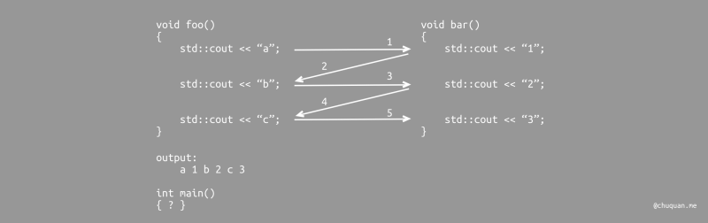
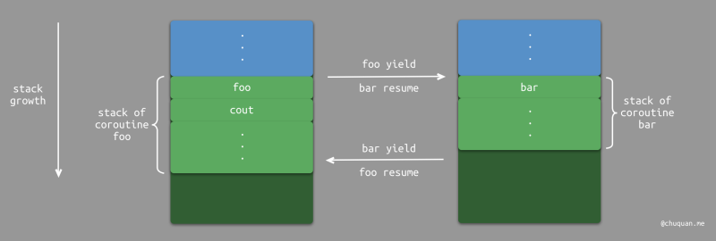

# 协程

[TOC]


## 异步

异步编程有很多模型，包括：线程、回调、Future/Promise、协程

### 线程

线程是最经典的、解决同步阻塞的方法，但它有一系列缺点：

- 线程并非廉价的。线程需要昂贵的上下文切换。
- 线程不是无限的。可被启动的线程数受底层操作系统的限制
- 线程理解起来是困难的

### 回调

回调:

~~~kotlin
fun postItem(item: Item) {
    preparePostAsync { token -> 
        submitPostAsync(token, item) { post -> 
            processPost(post)
        }
    }
}

fun preparePostAsync(callback: (Token) -> Unit) {
    // 发起请求并立即返回
    // 设置稍后调用的回调
}
~~~

原则上这感觉就像一个更优雅的解决方案，但又有几个问题：

- 回调嵌套的难度，臭名远扬的**「回调地狱」**
- 错误处理很复杂
- 编程模型从自上而下的命令式方法转变为具有链式调用的组合模型。传统的编程结构例如循环，异常处理，等等。通常在此模型中不再有效。

### Future/Promise

`Future/Promise`将回调的嵌套模型转换为一个线性回调模型，稍微改善了回调的问题（还是一个组合模型）。

~~~kotlin
fun postItem(item: Item) {
    preparePostAsync() 
        .thenCompose { token -> 
            submitPostAsync(token, item)
        }
        .thenAccept { post -> 
            processPost(post)
        }

}

fun preparePostAsync(): Promise<Token> {
    // 发起请求并当稍后的请求完成时返回一个 promise
    return promise 
}
~~~

### 协程

协程是一种计算可被挂起的想法（函数将被执行、暂停执行以及在某个时间点恢复）。协程的一个好处是，非阻塞协程代码的结构与同步阻塞代码的基本相同，也是就是说，编程模型本身并没有真正改变。

协程并没有解决IO密集问题，协程只是优化了异步回调模型增强了代码的可读性。真正解决io密集问题的是：

- IO多路复用函数
- 响应式编程模式——Reactor


> 参考资料：
>
> - https://www.zhihu.com/question/538436096/answer/2536953016
>
> - https://www.zhihu.com/question/321006574
>
> - http://chuquan.me/2021/05/05/getting-to-know-coroutine/#%E6%8C%82%E8%B5%B7%E6%81%A2%E5%A4%8D
>
> - https://www.jianshu.com/p/b1a0945bff2d
>
> - https://zh.javascript.info/async-await
>
> - https://rengwuxian.com/kotlin-coroutines-2/


协程是什么？在函数的基础上，可以**挂起/恢复**执行流：



异步和协程有些相似，但是异步编程侧重于任务的非阻塞性执行，而协程更侧重于代码的执行流程控制。两者并不冲突，例如Javascript中的await就是一种以协程的形式来实现异步编程的方法


协程的分类：

- 按调用栈分类

  - 有栈（stackful）协程，例如 微信的 libco、阿里的 cooobjc、Golang 中的 goroutine、Lua 中的协程。

    在有栈协程中，每个协程有自己的独立栈。当协程进行上下文切换时，它们的状态（包括调用栈和所需的所有寄存器）都会被保存到内存中的一块特定区域。在切换回这个协程时，再从内存中恢复这个保存的状态。

    

    这种模式的优点是极端灵活，可以在任何函数深度中切换协程。但缺点是每个协程都需要保存一个完整的调用栈，其内存占用可能会非常大。

  - 无栈（stackless）协程，例如 ES6、Dart 中的 await/async、Python 的 Generator、Kotlin 中的协程、C++20 中的 cooroutine 都是无栈协程。

    无栈协程通常是 **基于状态机或闭包** 来实现。以基于状态机为例，它记录上次协程挂起时的位置，以及必要的局部变量以及上下文信息，而无需保存整个栈帧。

    ~~~c
    void bar() {
        static int state = 0;
        switch (state) {
            case 0: goto LABEL0;
            case 1: goto LABEL1;
            case 2: goto LABEL2;
        }
        LABEL0:
        std::cout << "1";
        LABEL1:
        std::count << "2";
        LABEL2:
        std::count << "3";
    }
    ~~~

    所以不管从效率，还是从内存占用来看，无栈当然是更优的方案，但是无栈需要编译器支持，有栈只需要编写同一套上下文切换的代码。
    
    此外，无栈协程还有函数染色的问题。即在调用很深的地方使用一个await，就必须把整个调用栈的函数都变成async，还需要注意它们在其它地方的调用都要改成await，这简直就是重构的噩梦。

- 按调度方式分类：

  - **对称协程**（Symmetric Coroutine）：任何一个协程都是相互独立且平等的，调度权可以在任意协程之间转移。

  - **非对称协程**（Asymmetric Coroutine）：协程出让调度权的目标只能是它的调用者，即协程之间存在调用和被调用关系。例如Lua 的协程中当前协程调用 `yield` 总是会将调度权转移给 `resume` 它的协程。

    事实上，我们只要对非对称协程稍作修改，即可实现对称协程的能力。我们可以在非对称协程的基础上，添加有关协程调度权的分发中心。所有的协程在挂起时都将控制权转移到分发中心，分发中心根据参数来决定将调度权转移给哪个协程，如 Lua 的第三方库 coro


协程之间的切换（挂起和恢复）可以是协作式的（await/async、suspend），也可以是抢占式的（gorountine 1.4）。

协作式协程何时被挂起：

- 主动放弃使用权：yield（例如Python中的Generator）
- 遇到阻塞函数：系统调用属于内核态的范畴，它对协程这种用户态的技术并无感知。此时，如果直接执行阻塞的系统调用，那么协程机制就失效了（无法切换到其他协程上）。go、nodejs等对阻塞的系统调用做了一层封装，在执行真正的系统调用前，将协程切换出去，在执行完成后，再切换回来。
- await/async suspend，如果直接在Dart中调用async函数，那么就会获得一个Future对象，而async函数会异步执行。通过 await 一个Future对象，可以同步获取结果。


## Kotlin协程

C# 将 `async` 以及 `await` 作为语法的一部分。而在 Kotlin 中，协程以依赖库的形式提供的：

~~~xml
implementation("org.jetbrains.kotlinx:kotlinx-coroutines-core:1.1.1")
implementation("org.jetbrains.kotlinx:kotlinx-coroutines-android:1.1.1")
~~~

在 CoroutineScope 上下文中通过 launch、async 等 **协程构造器**（CoroutineBuilder）定义一个协程

~~~kotlin
fun main() {
    GlobalScope.launch(context = Dispatchers.IO) {
        delay(1000)
        log("launch")
    }

    Thread.sleep(2000)
    log("end")
}


fun log(msg: Any?) = println("[${Thread.currentThread().name}] $msg")
~~~

以上代码就涉及到了协程的四个基础概念：

- **suspend function** 挂起函数
- **CoroutineScope** 协程作用域
- **CoroutineContext** 协程上下文
- **CoroutineBuilder** 协程构建器

下面我们一一介绍下这些概念

### Suspend function

一个Suspend函数只能出现在协程或者其它Suspend函数中。

注意，suspend仅仅是一个关键字而已，真正发生挂起和恢复的地方在官方提供的库函数中

### CoroutineScope

如果我们启动了多个协程但是没有一个可以对其进行统一管理的途径的话，就会导致我们的代码臃肿杂乱，甚至发生**内存泄露**或者**任务泄露**。为了确保所有通过`launch` 或 `async` 创建的所有协程都会被追踪，Kotlin 要求 所有协程必须在`CoroutineScope`中创建 ，而`CoroutineScope` 本身并不运行协程。


`CoroutineScope` 大体上可以分为以下几种：

- `GlobalScope`，即全局协程作用域。`GlobalScope` 本身不会阻塞当前线程。

  ~~~kotlin
  fun main() {
      log("start")
      GlobalScope.launch {
          // 在协程内开启一个协程
          launch {
              delay(400)
              log("launch A")
          }
          
          // 在协程内开启一个另一个协程
          launch {
              delay(300)
              log("launch B")
          }
          log("GlobalScope")
      }
      log("end")
      Thread.sleep(500)
  }
  
  /**
  * [main] start
  * [main] end
  * [DefaultDispatcher-worker-1] GlobalScope
  * [DefaultDispatcher-worker-3] launch B
  * [DefaultDispatcher-worker-3] launch A
  */
  ~~~

- `runBlocking`，一个顶层函数，它会阻塞当前线程，直到其内部所有相同作用域的协程执行结束。

  ~~~kotlin
  fun main() {
      log("start")
      runBlocking {
          launch {
              repeat(3) {
                  delay(100)
                  log("launchA - $it")
              }
          }
          launch {
              repeat(3) {
                  delay(100)
                  log("launchB - $it")
              }
          }
          
          // 此外，runBlocking 只会等待相同作用域的协程完成才会退出，而不会等待子作用域启动的协程
          GlobalScope.launch {
              repeat(3) {
                  delay(120)
                  log("GlobalScope - $it")
              }
          }
      }
      log("end")
  }
  
  /**
  [main] start
  [main] launchA - 0
  [main] launchB - 0
  [DefaultDispatcher-worker-1] GlobalScope - 0
  [main] launchA - 1
  [main] launchB - 1
  [DefaultDispatcher-worker-1] GlobalScope - 1
  [main] launchA - 2
  [main] launchB - 2
  [main] end
  */
  ~~~

  ~~~kotlin
  fun main() {
      GlobalScope.launch(Dispatchers.IO) {
          delay(600)
          log("GlobalScope")
      }
      runBlocking {
          delay(500)
          log("runBlocking")
      }
      //主动休眠两百毫秒，使得和 runBlocking 加起来的延迟时间多于六百毫秒
      Thread.sleep(200)
      log("after sleep")
  }
  
  /**
  [main] runBlocking
  [DefaultDispatcher-worker-1] GlobalScope
  [main] after sleep
  */
  ~~~

- `coroutineScope`与`runBlocking`类似，都是等待其内部所有相同作用域的协程结束后才会结束自己。两者的主要区别在于 `runBlocking` 方法会阻塞当前线程，而 `coroutineScope`不会。而且要注意的是`coroutineScope`是一个`suspend`函数。

  ~~~kotlin
  fun main() = runBlocking {
      launch {
          delay(100)
          log("Task from runBlocking")
      }
      
      coroutineScope {
          launch {
              delay(500)
              log("Task from nested launch")
          }
          delay(50)
          log("Task from coroutine scope")
      }
      
      // 由于coroutineScope是一个挂起函数，所以这里的log在coroutineScope之后输出。这里将coroutineScope改为runBlocking后，输出的结果是一样的
      log("Coroutine scope is over")
  }
  
  
  /**
  [main] Task from coroutine scope
  [main] Task from runBlocking
  [main] Task from nested launch
  [main] Coroutine scope is over
  */
  ~~~

- `supervisorScope` 函数用于创建一个使用了 SupervisorJob 的 coroutineScope，该作用域的特点就是抛出的异常不会连锁取消同级协程和父协程。

  ~~~kotlin
  fun main() = runBlocking {
      launch {
          delay(100)
          log("Task from runBlocking")
      }
      supervisorScope {
          launch {
              delay(500)
              log("Task throw Exception")
              throw Exception("failed")
          }
          launch {
              delay(600)
              log("Task from nested launch")
          }
      }
      log("Coroutine scope is over")
  }
  
  /*
  [main] Task from runBlocking
  [main] Task throw Exception
  [main] Task from nested launch
  [main] Coroutine scope is over
  */
  ~~~

  

- 自定义 `CoroutineScope`。可用于实现主动控制协程的生命周期范围。在Android中ktx 库为某些生命周期类提供了自己的 `CoroutineScope`，例如，ViewModel 有 `viewModelScope`，Lifecycle 有 `lifecycleScope`


### CoroutineContext

CoroutineContext 使用以下元素集定义协程的行为：

- `Job`：控制协程的生命周期
- `CoroutineDispatcher`：将任务指派给适当的线程
- `CoroutineName`：协程的名称，可用于调试
- `CoroutineExceptionHandler`：处理未捕获的异常


我们可以通过控制 `Job` 来控制 `CoroutineScope` 的生命周期。注意这里的Job控制得是整个作用域的生命周期，而`launch`方法所返回的Job控制着单个协程的生命周期

~~~kotlin
val job = Job()

val scope = CoroutineScope(job + Dispatchers.IO)

fun main(): Unit = runBlocking {
    log("job is $job")
    val job = scope.launch {
        try {
            delay(3000)
        } catch (e: CancellationException) {
            log("job is cancelled")
            throw e
        }
        log("end")
    }
    delay(1000)
    log("scope job is ${scope.coroutineContext[Job]}")
    scope.coroutineContext[Job]?.cancel()
}

/**
[main] job is JobImpl{Active}@759ebb3d
[main] scope job is JobImpl{Active}@759ebb3d
[DefaultDispatcher-worker-1] job is cancelled
*/
~~~


CoroutineContext 包含一个 CoroutineDispatcher（协程调度器）用于指定执行协程的目标载体，即 **运行于哪个线程**。所有的协程构造器（如 launch 和 async）都接受一个可选参数，即 CoroutineContext ，该参数可用于显式指定要创建的协程和其它上下文元素所要使用的 CoroutineDispatcher

Kotlin 协程库提供了四个 Dispatcher 用于指定在哪一类线程中执行协程：

- Dispatchers.Default。默认调度器，适合用于执行占用大量 CPU 资源的任务。例如：对列表排序和解析 JSON
- Dispatchers.IO。适合用于执行磁盘或网络 I/O 的任务。例如：使用 Room 组件、读写磁盘文件，执行网络请求
- Dispatchers.Unconfined。对执行协程的线程不做限制，可以直接在当前调度器所在线程上执行
- Dispatchers.Main。使用此调度程序可用于在 Android 主线程上运行协程，只能用于与界面交互和执行快速工作

~~~kotlin
fun main() = runBlocking<Unit> {
    launch {
        log("main runBlocking")
    }
    launch(Dispatchers.Default) {
        log("Default")
        launch(Dispatchers.Unconfined) {
            log("Unconfined 1")
        }
    }
    launch(Dispatchers.IO) {
        log("IO")
        launch(Dispatchers.Unconfined) {
            log("Unconfined 2")
        }
    }
    launch(newSingleThreadContext("MyOwnThread")) {
        log("newSingleThreadContext")
        launch(Dispatchers.Unconfined) {
            log("Unconfined 4")
        }
    }
}
~~~

其中，`newSingleThreadContext` 用于为协程专门创建一个新的线程，专用线程是一种成本非常昂贵的资源。

我们可以通过`withContext()`（一个`suspend`函数）来细粒度地来调度线程。你可以将其应用于非常小的函数，例如从数据库中读取数据或执行网络请求。一种不错的做法是使用 `withContext()` 来确保每个函数都是主线程安全的，这意味着，你可以从主线程调用每个函数。这样，调用方就从不需要考虑应该使用哪个线程来执行函数了

~~~kotlin
suspend fun fetchDocs() {                      // Dispatchers.Main
    val result = get("developer.android.com")  // Dispatchers.Main
    show(result)                               // Dispatchers.Main
}

suspend fun get(url: String) =                 // Dispatchers.Main
    withContext(Dispatchers.IO) {              // Dispatchers.IO (main-safety block)
        /* perform network IO here */          // Dispatchers.IO (main-safety block)
    }                                          // Dispatchers.Main
}
~~~


CoroutineName 用于为协程指定一个名字，方便调试和定位问题

```kotlin
fun main() = runBlocking<Unit>(CoroutineName("RunBlocking")) {
    log("start")
    launch(CoroutineName("MainCoroutine")) {
        launch(CoroutineName("Coroutine#A")) {
            delay(400)
            log("launch A")
        }
        launch(CoroutineName("Coroutine#B")) {
            delay(300)
            log("launch B")
        }
    }
}
```

有时我们需要为协程上下文定义多个元素，此时就可以用 `+` 运算符

~~~kotlin
fun main() = runBlocking<Unit> {
    launch(Dispatchers.Default + CoroutineName("test")) {
        log("Hello World")
    }
}
~~~


并不是所有协程都可以响应取消操作，**协程的取消操作是需要协作 (cooperative) 完成的**。它们在调度准备运行时，会检查协程是否被取消了，并在取消时抛出 CancellationException 从而结束整个任务。**官方提供的协程库中的所有挂起函数都是可取消的**。

所以即使以下代码主动取消了协程，协程也只会在完成既定循环后才结束运行，因为协程没有在每次循环前先进行检查，导致任务不受取消操作的影响

~~~kotlin
fun main() = runBlocking {
    val startTime = System.currentTimeMillis()
    val job = launch(Dispatchers.Default) {
        var nextPrintTime = startTime
        var i = 0
        while (i < 5) {
            if (System.currentTimeMillis() >= nextPrintTime) {
                log("job: I'm sleeping ${i++} ...")
                nextPrintTime += 500L
            }
        }
    }
    delay(1300L)
    log("main: I'm tired of waiting!")
    job.cancelAndJoin()
    log("main: Now I can quit.")
}

/**
[DefaultDispatcher-worker-1] job: I'm sleeping 0 ...
[DefaultDispatcher-worker-1] job: I'm sleeping 1 ...
[DefaultDispatcher-worker-1] job: I'm sleeping 2 ...
[main] main: I'm tired of waiting!
[DefaultDispatcher-worker-1] job: I'm sleeping 3 ...
[DefaultDispatcher-worker-1] job: I'm sleeping 4 ...
[main] main: Now I can quit.
*/
~~~

为了实现取消协程的目的，就需要为上述代码加上判断协程是否还处于可运行状态的逻辑，当不可运行时就主动退出协程。

~~~kotlin
fun main() = runBlocking {
    val startTime = System.currentTimeMillis()
    val job = launch(Dispatchers.Default) {
        var nextPrintTime = startTime
        var i = 0
        while (i < 5) {
            if (isActive) {
                if (System.currentTimeMillis() >= nextPrintTime) {
                    log("job: I'm sleeping ${i++} ...")
                    nextPrintTime += 500L
                }
            } else {
                return@launch
            }
        }
    }
    delay(1300L)
    log("main: I'm tired of waiting!")
    job.cancelAndJoin()
    log("main: Now I can quit.")
}
~~~

取消协程这个操作类似于在 Java 中调用`Thread.interrupt()`方法来向线程发起中断请求，这两个操作都不会强制停止协程和线程，外部只是相当于发起一个停止运行的请求，需要依靠协程和线程响应请求后主动停止运行。

Java 和 Kotlin 之所以均没有提供一个可以直接强制停止线程或协程的方法，是因为这个操作可能会带来各种意想不到的情况。例如，在停止线程或协程的时候，它们可能还持有着某些排他性资源（例如：锁，数据库链接），如果强制性地停止，它们持有的锁就会一直无法得到释放，导致其它线程或协程一直无法得到目标资源，最终就可能导致线程死锁。所以`Thread.stop()`方法目前也是处于废弃状态，Java 官方并没有提供一个可靠的停止线程的方法

下面看一个取消官方库协程的例子

~~~kotlin
fun main() = runBlocking {
    val job = launch {
        try {
            repeat(1000) { i ->
                log("job: I'm sleeping $i ...")
                delay(500L)
            }
        } catch (e: Throwable) {
            log(e.message)
        } finally {
            log("job: I'm running finally")
        }
    }
    delay(1300L)
    log("main: I'm tired of waiting!")
    job.cancelAndJoin()
    log("main: Now I can quit.")
}
~~~


父协程总是会等待其所有子协程都完成后才结束自身：

~~~kotlin
fun main() = runBlocking {
    val parentJob = launch {
        repeat(3) { i ->
            launch {
                delay((i + 1) * 200L)
                log("Coroutine $i is done")
            }
        }
        log("request: I'm done and I don't explicitly join my children that are still active")
    }
}

/**
[main] request: I'm done and I don't explicitly join my children that are still active
[main] Coroutine 0 is done
[main] Coroutine 1 is done
[main] Coroutine 2 is done
*/
~~~


一般情况下，协程的取消操作会通过协程的层次结构来进行传播：如果取消父协程或者父协程抛出异常，那么子协程都会被取消；而如果子协程被取消，则不会影响同级协程和父协程，但如果子协程抛出异常则也会导致同级协程和父协程被取消。

~~~kotlin
fun main() = runBlocking {
    val request = launch {
        val job1 = launch {
            repeat(10) {
                delay(300)
                log("job1: $it")
                if (it == 2) {
                    log("job1 canceled")
                    cancel()
                }
            }
        }
        val job2 = launch {
            repeat(10) {
                delay(300)
                log("job2: $it")
            }
        }
    }
    delay(1600)
    log("parent job canceled")
    request.cancel()
    delay(1000)
}
/**
[main] job1: 0
[main] job2: 0
[main] job1: 1
[main] job2: 1
[main] job1: 2
[main] job1 canceled
[main] job2: 2
[main] job2: 3
[main] job2: 4
[main] parent job canceled
*/
~~~


`withTimeout` 函数用于指定协程的运行超时时间，如果超时则会抛出 `TimeoutCancellationException`，从而令协程结束运行。

~~~kotlin
fun main() = runBlocking {
    log("start")
    val result = withTimeout(300) {
        repeat(5) {
            delay(100)
        }
        200
    }
    log(result)
    log("end")
}

/**
[main] start
Exception in thread "main" kotlinx.coroutines.TimeoutCancellationException: Timed out waiting for 300 ms
	at kotlinx.coroutines.TimeoutKt.TimeoutCancellationException(Timeout.kt:186)
	at kotlinx.coroutines.TimeoutCoroutine.run(Timeout.kt:156)
	at 
*/
~~~

如果不希望因为异常导致协程结束，可以改用`withTimeoutOrNull`方法，如果超时就会返回 null。


当一个协程由于异常而运行失败时，它会传播这个异常并传递给它的父协程。接下来，父协程会进行下面几步操作：

- 取消它自己的子级
- 取消它自己
- 将异常传播并传递给它的父级

异常会到达层级的根部，且当前 CoroutineScope 所启动的所有协程都会被取消。launch 将异常视为未捕获异常，类似于 Java 的 `Thread.uncaughtExceptionHandler`，当发现异常时就会马上抛出。async 期望最终通过调用 await 来获取结果 (或者异常)，所以直到调用 `async.await()` 才会得到目标值或者抛出存在的异常。例如，以下的 `fetchDocs()` 方法由于并没有调用 `Deferred.await()`，因此异常并不会被抛给调用方：

~~~kotlin
private val ioScope = CoroutineScope(Dispatchers.IO)

private fun fetchDocs() {
    ioScope.async {
        delay(500)
        log("taskA throw AssertionError")
        throw AssertionError()
    }
}
~~~

如果想主动捕获异常信息，可以使用 `CoroutineExceptionHandler` 作为协程的上下文元素之一，在这里进行自定义日志记录或异常处理，它类似于对线程使用 `Thread.uncaughtExceptionHandler`。

~~~kotlin
fun main() = runBlocking {
    val handler = CoroutineExceptionHandler { _, exception ->
        log("Caught $exception")
    }
    val job = GlobalScope.launch(handler) {
        throw AssertionError()
    }
    val deferred = GlobalScope.async(handler) {
        throw ArithmeticException()
    }
    // 
    joinAll(job, deferred)
}

/**
[DefaultDispatcher-worker-2] Caught java.lang.AssertionError
*/
~~~


### CoroutineBuilder

协程在 CoroutineScope 的上下文中通过 launch、async 等协程构建器来进行声明并启动。launch、async 均被声明为 CoroutineScope 的扩展方法

`launch` 是一个作用于 CoroutineScope 的扩展函数，用于在不阻塞当前线程的情况下启动一个协程，并返回对该协程任务的引用，即 Job 对象

```kotlin
public fun CoroutineScope.launch(
    context: CoroutineContext = EmptyCoroutineContext,
    start: CoroutineStart = CoroutineStart.DEFAULT,
    block: suspend CoroutineScope.() -> Unit
): Job
```

`launch` 函数共包含三个参数：

1. context。用于指定协程的上下文
2. start。用于指定协程的启动方式，默认值为 `CoroutineStart.DEFAULT`，即协程会在声明的同时就立即进入等待调度的状态，即可以立即执行的状态。可以通过将其设置为`CoroutineStart.LAZY`来实现延迟启动，即懒加载
3. block。用于传递协程的执行体，即希望交由协程执行的任务


Job 是协程的句柄，这里列举 Job 几个比较有用的属性和函数：

~~~kotlin
//当 Job 处于活动状态时为 true
//如果 Job 未被取消或没有失败，则均处于 active 状态
public val isActive: Boolean

//当 Job 正常结束或者由于异常结束，均返回 true
public val isCompleted: Boolean

//当 Job 被主动取消或者由于异常结束，均返回 true
public val isCancelled: Boolean

//启动 Job
//如果此调用的确启动了 Job，则返回 true
//如果 Job 调用前就已处于 started 或者是 completed 状态，则返回 false 
public fun start(): Boolean

//用于取消 Job，可同时通过传入 Exception 来标明取消原因
public fun cancel(cause: CancellationException? = null)

//阻塞等待直到此 Job 结束运行
public suspend fun join()

//当 Job 结束运行时（不管由于什么原因）回调此方法，可用于接收可能存在的运行异常
public fun invokeOnCompletion(handler: CompletionHandler): DisposableHandle

~~~

Job 具有以下几种状态值，每种状态对应的属性值各不相同。

| **State**                        | [isActive](https://link.juejin.cn?target=https%3A%2F%2FKotlin.github.io%2FKotlinx.coroutines%2FKotlinx-coroutines-core%2FKotlinx.coroutines%2F-job%2Fis-active.html) | [isCompleted](https://link.juejin.cn?target=https%3A%2F%2FKotlin.github.io%2FKotlinx.coroutines%2FKotlinx-coroutines-core%2FKotlinx.coroutines%2F-job%2Fis-completed.html) | [isCancelled](https://link.juejin.cn?target=https%3A%2F%2FKotlin.github.io%2FKotlinx.coroutines%2FKotlinx-coroutines-core%2FKotlinx.coroutines%2F-job%2Fis-cancelled.html) |
| -------------------------------- | ------------------------------------------------------------ | ------------------------------------------------------------ | ------------------------------------------------------------ |
| *New* (optional initial state)   | false                                                        | false                                                        | false                                                        |
| *Active* (default initial state) | true                                                         | false                                                        | false                                                        |
| *Completing* (transient state)   | true                                                         | false                                                        | false                                                        |
| *Cancelling* (transient state)   | false                                                        | false                                                        | true                                                         |
| *Cancelled* (final state)        | false                                                        | true                                                         | true                                                         |
| *Completed* (final state)        | false                                                        | true                                                         | false                                                        |


`async`和 `launch` 的区别主要就在于：`async` 可以返回协程的执行结果，而 `launch` 不行。我们可以通过`await`同步阻塞获取结果（一个`suspend`），这相当于`Job`的`join`方法。`async` 函数的返回值是一个 Deferred 对象。Deferred 是一个接口类型，继承于 Job 接口，所以 Job 包含的属性和方法 Deferred 都有，其主要是在 Job 的基础上扩展了 `await()`方法


~~~dart
fun main() {
    val time = measureTimeMillis {
        runBlocking {
            val asyncA = async {
                delay(3000)
                1
            }
            val asyncB = async {
                delay(4000)
                2
            }
            log(asyncA.await() + asyncB.await())
        }
    }
    log(time)
}
[main] 3
[main] 4070
~~~

修改上述代码，可以发现两个协程的总耗时就会变为七秒左右

~~~kotlin
fun main() {
    val time = measureTimeMillis {
        runBlocking {
            val asyncA = async(start = CoroutineStart.LAZY) {
                delay(3000)
                1
            }
            val asyncB = async(start = CoroutineStart.LAZY) {
                delay(4000)
                2
            }
            log(asyncA.await() + asyncB.await())
        }
    }
    log(time)
}
~~~

会造成这不同区别是因为 `CoroutineStart.LAZY` 不会主动启动协程，而是直到调用`async.await()`或者`async.satrt()`后才会启动。所以`asyncA.await() + asyncB.await()`会导致两个协程其实是在顺序执行。而默认值 `CoroutineStart.DEFAULT` 参数会使得协程在声明的同时就被启动了（实际上还需要等待被调度执行）

要注意，在suspend函数启动的协程，如果在函数退出时仍未完成，那么就会被销毁。因此我们可以使用awaitAll来阻塞等待结果：

~~~kotlin
suspend fun fetchTwoDocs() = coroutineScope {
    val deferredOne = async { fetchDoc(1) }
    val deferredTwo = async { fetchDoc(2) }
    deferredOne.await()
    deferredTwo.await()
}

suspend fun fetchTwoDocs() = coroutineScope {
    val deferreds = listOf(
        async { fetchDoc(1) },
        async { fetchDoc(2) }
    )
    deferreds.awaitAll()
}
~~~


### Android ktx

Lifecycle ktx 为每个 Lifecycle 对象（Activity、Fragment、Process 等）定义了一个 LifecycleScope，该作用域具有生命周期安全的保障，在此范围内启动的协程会在 Lifecycle 被销毁时同时取消，可以使用 `lifecycle.coroutineScope` 或 `lifecycleOwner.lifecycleScope` 属性来拿到该 CoroutineScope

~~~kotlin
class MyActivity : AppCompatActivity() {

    override fun onCreate(savedInstanceState: Bundle?) {
        super.onCreate(savedInstanceState)
        lifecycleScope.launch {
            //Do Something
        }
        lifecycle.coroutineScope.launch {
            //Do Something
        }
    }
    
}
~~~


ViewModel ktx 库提供了一个 viewModelScope，用于在 ViewModel 中启动协程，该作用域的生命周期和 ViewModel 相等，当 ViewModel 回调了 `onCleared()`方法时会自动取消该作用域

~~~kotlin
class MyViewModel : ViewModel() {
    
    fun fetchDocs() {
        viewModelScope.launch {
            val result = get("https://developer.android.com")
            show(result)
        }
    }

    suspend fun get(url: String) = withContext(Dispatchers.IO) { /* ... */ }

}
~~~


