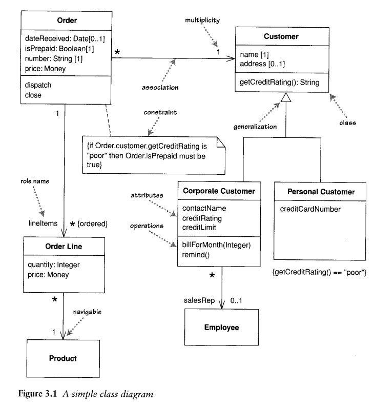
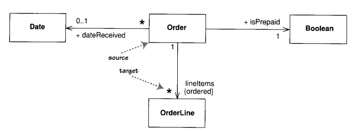

# UML

[TOC]

UML并不是像迂腐的八股文那般，死板地遵循教条，而是根据实际需求来灵活变通，但这一点的重要前提是表述无歧义性且通俗易懂。

## Class Diagram

A **「class diagram」** describes the types of **objects** in the System and the various kinds of **static relationships** that exist among them . Class diagrams also show **the properties and operations of a Class** and the constraints that apply to the way objects are connected . The UML uses the term **「feature」** as a general term that covers properties and operations of a Class.

 The boxes in the diagram are classes, which are divided into three compartments :

- the name of the dass
- its attributes
- its operations

**「Properties」** represent structural features of a Class. there are two way to describe a property

- attribute
- associations

 The full form of an attribute is :

~~~uml
visibility name: type multiplicity = default {property-string}
~~~

An example of this is :

~~~uml
- name : String [1] = " Untitled" {readOnly}
~~~

- This visibility marker indicates whether the attribute is public (+) or private (-)
- The name of the attribute-how the class refers to the attribute
- The type of the attribute indicates a restriction an what kind of object may be placed in the attribute
- multiplicity
- The default value is the value for a newly created object if the attribute isn't specified during creation.
- The {property-string} allows you to indicate additional properties for the attribute

An association is a solid line between two classes, directed from the source class to the target class.

 The name of the property goes at the target end of the association, together with its multiplicity. The target end of the association links to the dass that is the type of the property .

> 建议当property比较简单时，用attribute来描述；比较复杂或者重要时，用association来描述。

The multiplicity of a property is an indication of how many objects may fill the property. More generally, multiplicities are defined with a lower bound and an upper bound, such as `2...4`.  The lower bound may be any positive number or zero ; the upper is any positive number or (for unlimited)

- `1`（`1...1`）
- `2...4`
- `*`（`0...*`）

In attributes, you come across various terms that refer to the multiplicity.

- Optional implies a lower bound of 0 .
- Mandatory implies a lower bound of 1 or possibly more .
- Single-valued implies an upper bound of 1.
- Multivalued implies an upper bound of more than 1 : usually `*` .

By default, the elements in a multivalued multiplicity form a set,  If the orderings in association has meaning, you need to add `{ordered}` to the association end.  If you want to allow duplicates, add `{nonunique}`. (If you want to explicitly show the default, you can use `{unordered}` and `{unique}`). `{bag}` for unordered, nonunique.

> UML1支持离散化multiplicity，例如 `11, 45, 14`。但是由于不常用，在UML2中就被移除了

