# 案例研究

[TOC]

**「软件体系结构」**将系统的总体结构（包括构件及其连接关系），与各个构件的内部细节相分离。

软件体系结构可以用三种图来描述：通信图、部署图、构件图

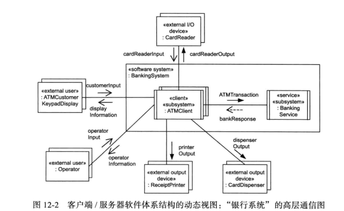

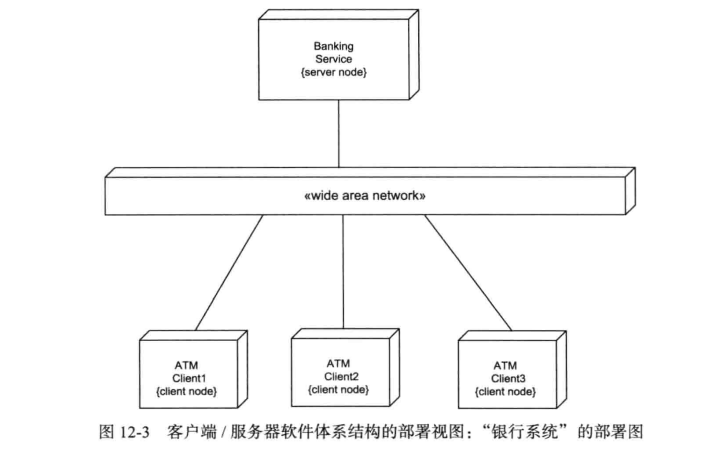

# 面向服务的体系结构案例研究：在线购物系统

## 问题描述

略

## 用例建模

### 浏览目录用例

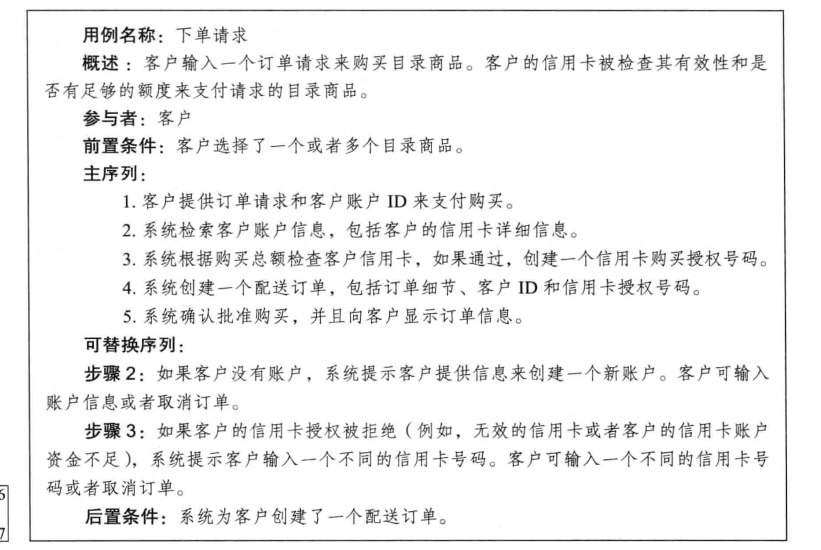

其他的用例以及活动图略

## 静态建模

### 软件系统上下文建模

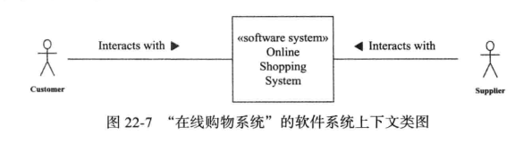

### 问题域的静态实体类建模

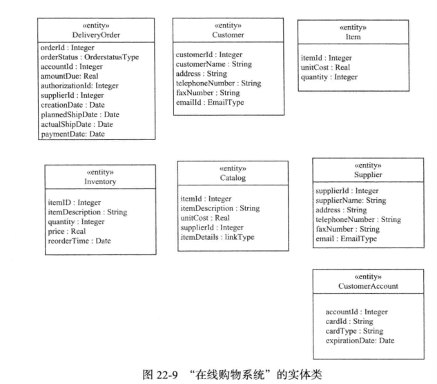

## 对象和类组织

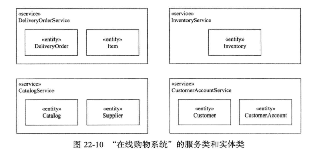

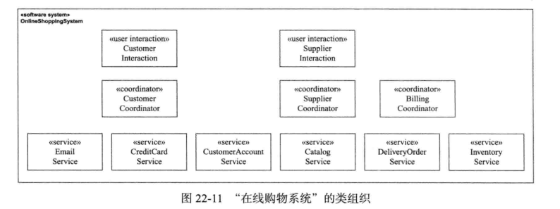

## 动态建模

### 下单请求用例

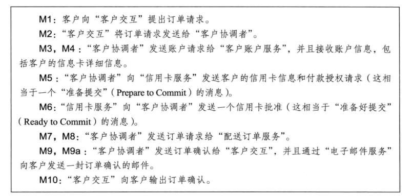

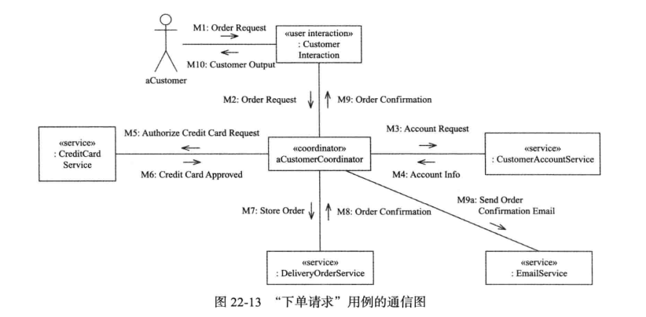

### 确认配送和给客户开账单用例

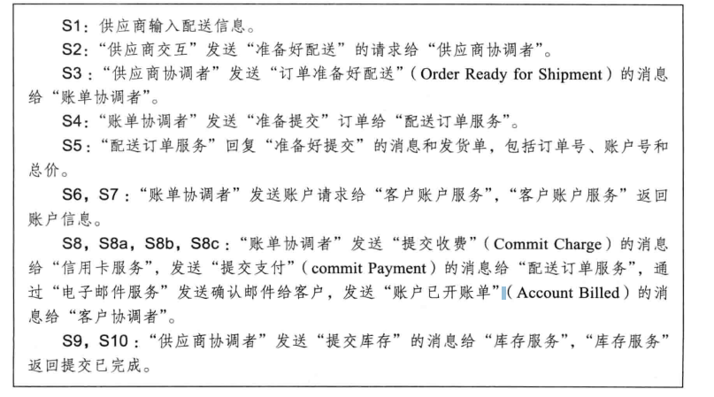

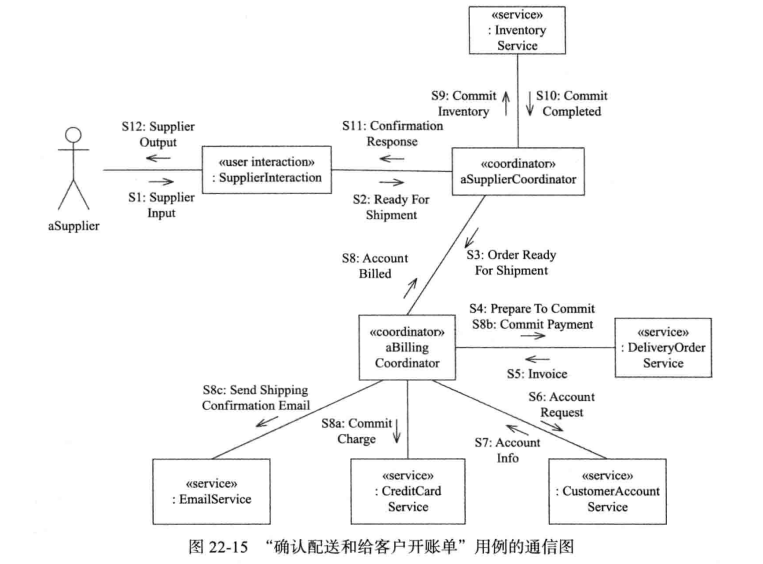

## 体系结构设计

.png)

此外，还可以通过通信图来建模子系统的交互。
