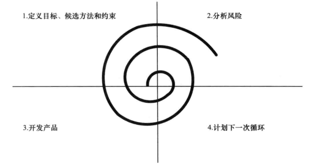
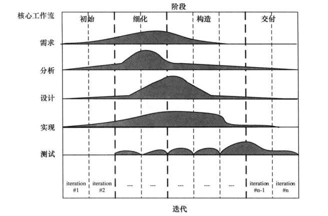

# 概述

[TOC]

建模就是对事物进行抽象，以获取更好的理解。建模是软件应用在编码之前的设计

面向对象概念在软件分析和设计中十分重要

- 信息隐藏可以使得系统模块独立，从而具有更好的可修改性和可维护性
- 继承使得我们能够以一种系统化方式对类进行调整。

面向对象分析和设计方法是基于模型的，并且综合使用了用例建模、静态建模、 状态机建模和对象交互建模。这些建模使用的标准化图形语言——UML。

软件体系结构将系统的总体结构（包括构件及其连接关系），与各个构件的内部细节相分离。

**COMET（orative Object Modeling and Architectural Design Method,协作的对象建模和体系结构设计方法）**是一种迭代的用例驱动和面向对象的软件开发方法，涵盖了软件开发生存周期的需求、分析和设计建模阶段。

软件体系结构可以从不同的角度进行考虑，称为不同的视图。

- **用例视图**。该视图是一种功能性需求视图。每个用例描述了一个或多个参与者与系统之间的交互序列。
- **静态视图**。该视图用类以及类间关系描述体系结构
- **动态交互视图**。该视图通过对象以及对象间的消息通信来描述体系结构
- **动态状态机视图**。一个控制构件的内部控制和定序可以用状态机来描述
- **结构构件视图**。该视图用构件来描述软件体系结构，构件间通过端口互联，支持供给 接口和请求接口的描述。
- **动态并发视图**。该视图将软件体系结构描述为在分布式结点上执行并且通过消息进行 通信的并发构件。
- **部署视图**。该视图描述分布式体系结构中构件如何分配到不同硬件结点上的特定配置

面向对象分析方法将面向对象思想应用到软件生存周期的分析阶段，强调识别问题域中的现实世界对象并将其映射为软件对象。

## 软件生存周期模型和过程

软件生存周期模型是软件开发过程的抽象，它能简便地用于规划软件开发的整体过程。在周期中的每一阶段，都有特定的交付物和里程碑

### 瀑布模型(waterfall model)

存在的问题：直至一个工作系统被开发出来，才能

1. 测试软件需求规约是否合规

2. 发现设计上的错误

这通常花费较大的代价对其进行纠正

抛弃型原型解决第一个痛点，而演化式原型解决第二个痛点。

### 抛弃型原型

通过让用户使用原型，可以得到许多有价值的反馈。以这些反馈为基础，就可以制定一个修订的需求规约。后续的开发过程继续遵循瀑布模型。

### 基于增量开发的演化式原型

原型从几个中间步骤的可运行系统逐步演化为可交付系统。

### 螺旋模型

螺旋模型是一个风险驱动的过程模型

### 统一软件开发过程

USDP/RUP是一种基于UML的软件开发过程。

### 设计验证和确认

**软件确认**的目标是，确保系统符合用户的需求。

**软件验证**的目标是，确保软件系统在每一个阶段中的构造与前一个阶段所定义的规约相符合。

**软件质量保证**是指一系列确保软件产品质量的活动。软件验证和确认是软件质量保证的重要目标。

**软件质量属性**是指软件的质量需求，通常也被称为 **非功能性需求**：

- 可维护性(maintainability) 
- 可修改性(modifiability)
- 可测试性(testability)
- 可追踪性(traceability)
- 可伸缩性(scalability)
-  可复用性(reusability)
- 性能(performance)
- 安全性(security)
- 可用性(availability)

### 软件生存周期的活动

**软件需求规约(SRS)**是一种外部规约，它的目的是描述系统外部行为是 什么，而不描述系统内部是如何进行工作的。

一个软件体系结构通过描述构件及其连接的方式，将系统的整体结构与单个构件的内部实现细节进行分离。

软件测试

- **单元测试**表示在单个构件与其他构件进行组合之前对其进行单独的测试。单元测试的方法遵循**测试覆盖准则**，经常使用的测试覆盖准则包括

  - **语句覆盖(statement coverage)**：需要达到每一个语句应至少被执行一次

  - **分支覆盖(branch coverage)**。需要达到每一个分支的可能结果应至少被测试一次。

- **集成测试**表示将已测试的单个构件逐步地组合为更复杂的构件组，然后对这些构件组进行测试，直到组合成完整的软件系统，同时构件间的接口都已经被测试过。

- **系统测试**是验证集成的硬件和软件系统是否满足特定需求

## 软件建模和设计方法概览

**COMET（Collaborative Object Modeling and Architectural Design Method，协作的对象建模和体系结构设计方法）**是一种围绕用例概念的、高度迭代的软件开发过程。

COMET 方法通过基于用例的方法将需求、分析和设计建模三个阶段结合在一起：

- 需求
- 分析，要开发系统的静态和动态模型。静态模型定义了问题域类之间的结构关系。而动态模型依据需求模型中的用例来实现。
- 设计，分析模型（强调的是问题域）被映射到设计模型（强调的是解域）中

