# 软件建模

[TOC]

UML并不是像迂腐的八股文那般，死板地遵循教条，而是根据实际需求来灵活变通，但这一点的重要前提是表述无歧义性且通俗易懂。

## 需求建模

需求建模包含了

- **需求分析**，功能性需求、非功能性需求
- **需求规约**：需求规约是开发人员和用户达成共识的文档

## 用例建模

### 用例图

**用例建模**是一种描述系统的功能性需求的方法，而系统的数据需求是使用静态建模来确定的。

**用例**定义了参与者和系统之间的交互序列，此时系统被看作黑盒，即处理系统会做什么来响应参与者的输入，而不考虑系统如何做的内部细节。

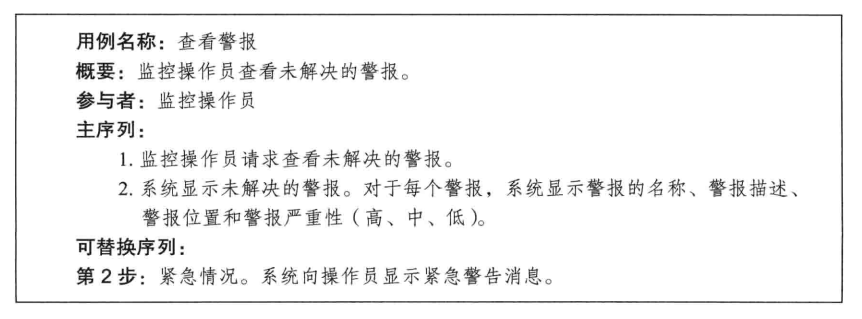

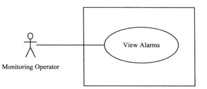


**参与者**是与系统交互的唯一外部实体；换句话说，**参与者是在系统之外的**，不是系统的一部分。参与者可以是人类、其他系统、外部输入输出(I/O)设备以及计时器。

**主要参与者**启动用例，也就是说，他作为用例的输入。其他参与者称为**次要参与者**。

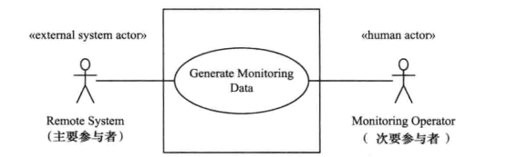


下面这个示例中，包含了3个用例，即三个交互序列。

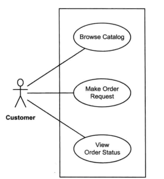

 

**参与者的泛化和特化**


用例中的每个序列称作**场景**。一个用例通常描述了多个场景：一个主序列和多个可替换序列。


**用例描述**文档化用例模型中的每个用例，它包括以下几个部分：

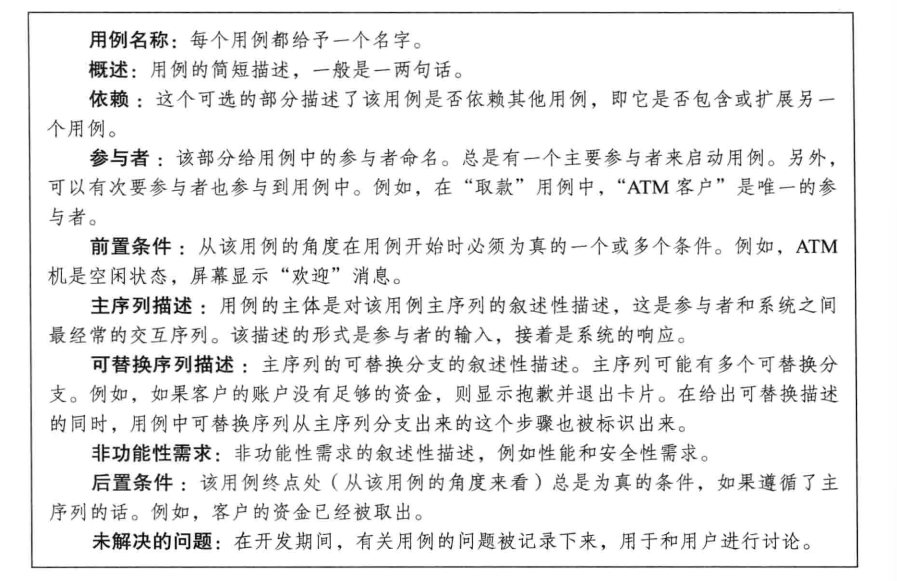


用例之间可以存在**包含(include)**、**扩展(extend)**以及**泛化**关系。

可以从多个原始的用例中抽取出来一个共同交互序列，并形成一个新的用例，称作**包含用例**。包含用例通常是抽象的，即它不能够独立执行。一个抽象用例必须作为一个具体(即可执行)用例的一部 分来执行。 

具体用例有时也被称为**基用例**

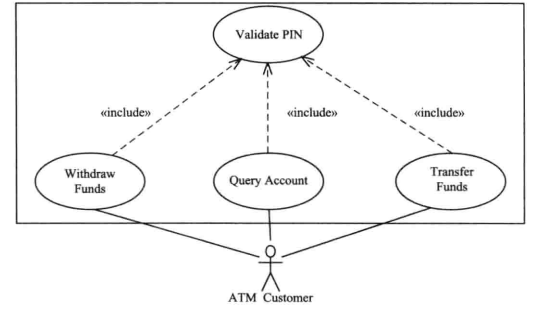

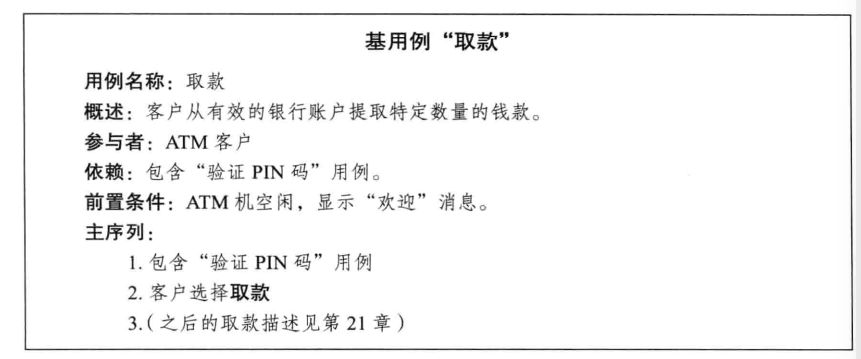

在使用包含关系时，一定不要将独立功能抽离出来，这样会导致用例碎片化，从而过度复杂和难以使用。


**扩展用例**的作用如下：

- 描述基用例只在特性条件下执行的部分
- 对复杂的可替换路径建模

被扩展的用例有时被称为**基用例**。

**扩展点**定义了基用例中能被增加扩展用例的精确位置。具体点来说就是，当基用例执行到扩展点时，如果定义在该扩展点上的扩展用例的条件满足，则执行该扩展用例。在用例完成后，再返回到基用例中继续执行。

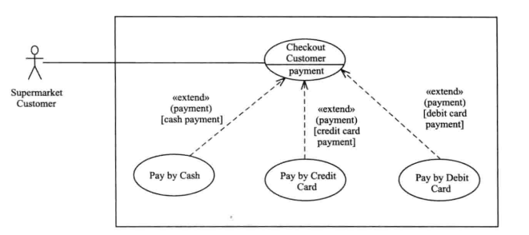

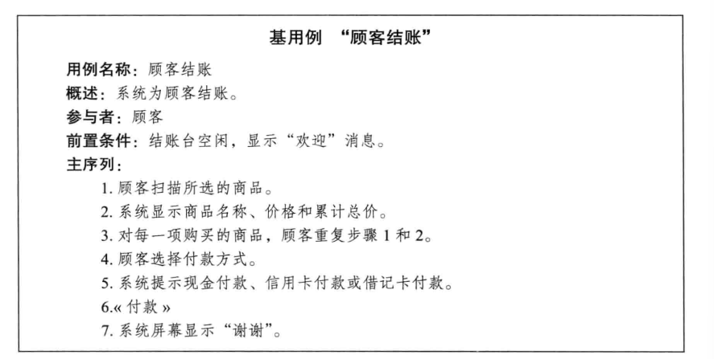

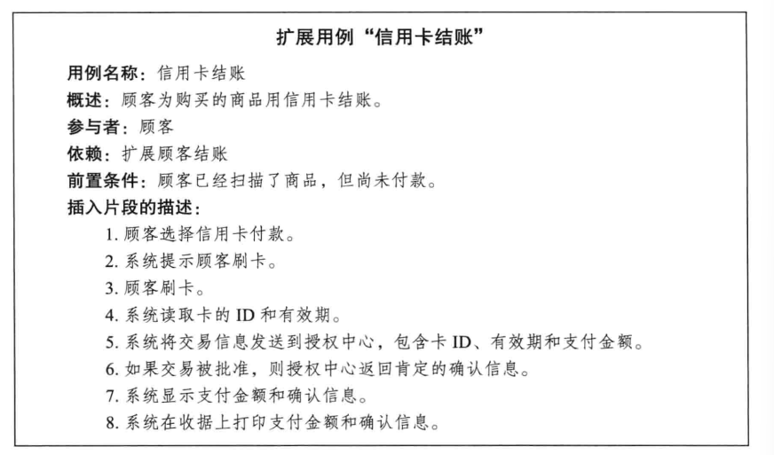


对于大量的用例，我们可以使用**用例包**，来将相关用例分组到一起。

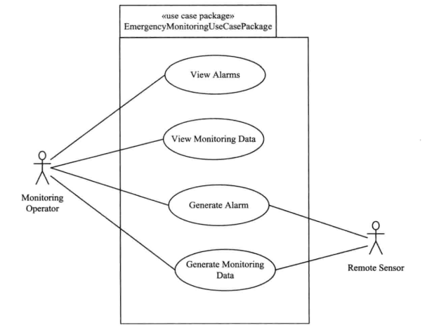


### 活动图


用例模型也可以用**活动图**来描述。

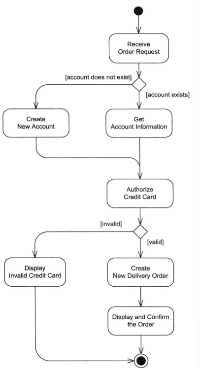


## 静态建模

**类图(Class diagram)**：

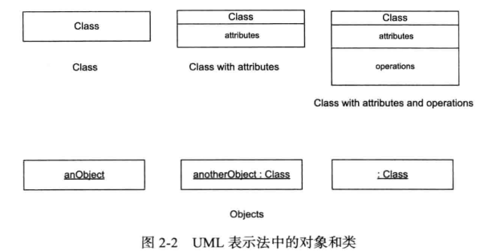


The full form of an attribute is :

```uml
visibility name: type multiplicity = default {property-string}
```

An example of this is :

```uml
- name : String [1] = " Untitled" {readOnly}
```

- This visibility marker indicates whether the attribute is public (+) or private (-)
- The name of the attribute-how the class refers to the attribute
- The type of the attribute indicates a restriction an what kind of object may be placed in the attribute
- multiplicity
- The default value is the value for a newly created object if the attribute isn't specified during creation.
- The {property-string} allows you to indicate additional properties for the attribute

[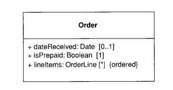]()


**关联**定义了两个或多个类之间的关系，指明了类之间的一种静态的、结构化的关系。关联的**多重性**规定了一个类的多少个实例能与另一个类的单个实例建立关联。More generally, multiplicities are defined with a lower bound and an upper bound, such as `2...4`. 

- `1`（`1...1`）
- `2...4`
- `*`（`0...*`）
- `2, 4, 8`，离散值

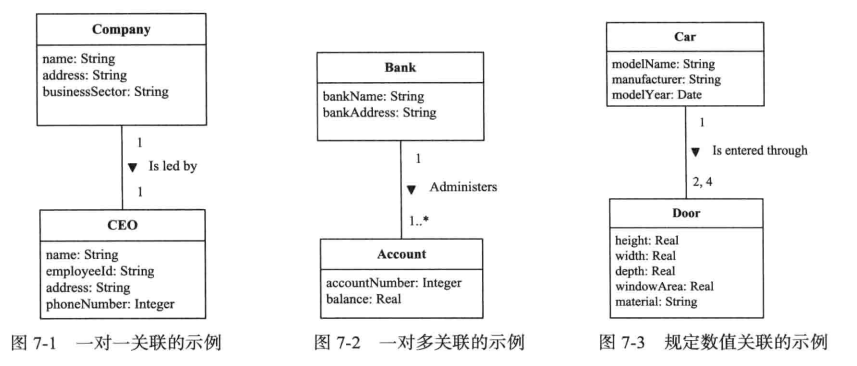


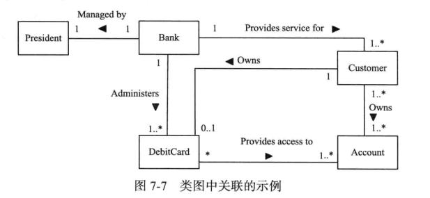


**三元关系**：

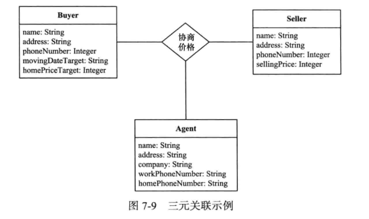

**一元关系**：

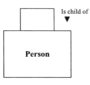


**关联类**是对两个或多个类之间的关联进行建模的类：

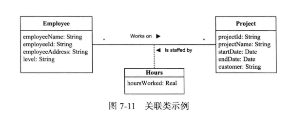


组合和聚合层次描述了类之间整体和部分的关系

- **聚合层次**是整体/部分关系的一种较弱的形式。在一个聚合里，部分能添加到聚合整体中，也能从聚合整体中移除。

  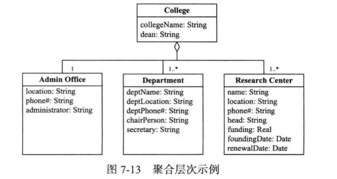

- **组合层次**经常涉及整体和部分之间的物理关系。也就是说生命周期强绑定。

  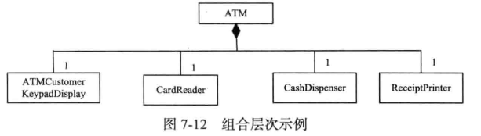


在**泛化/特化层次**中，共同属性被抽象到一个泛化类，称作**超类**。

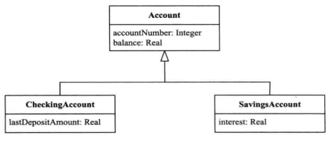


依赖关系：

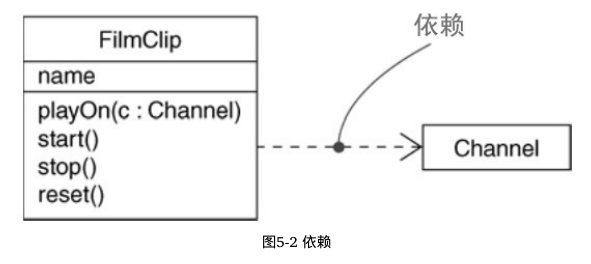

接口的表示

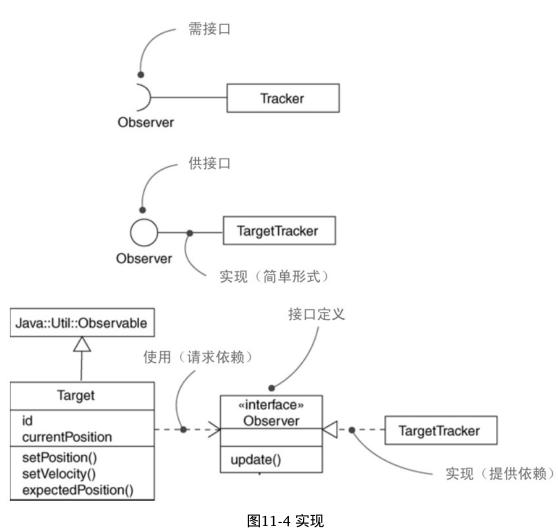


「约束」规定了必须为真的条件：

- 限制属性的取值

  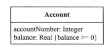

- 限制关联关系

  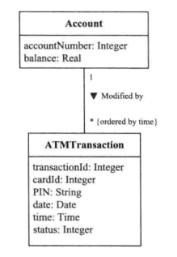


可以使用「构造型」对类进行分类。通过继承来分类要求`is a`的关系，而构造型分类却不要求。

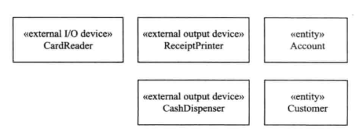

构造型分类之间支持泛化关系

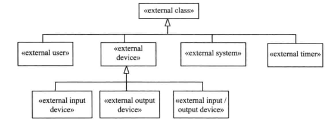


## 对象和类

本小节阐明如何在问题域中识别出一个对象。

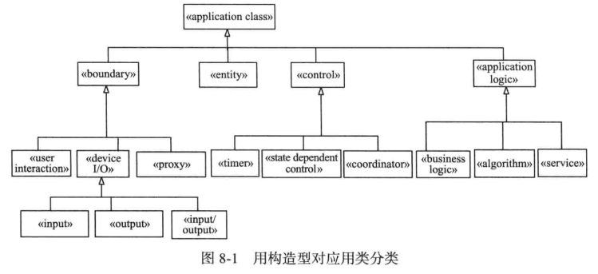


对象可以粗略分为以下几类：

- **实体对象**，数据的载体

- **边界对象**，与外部环境通信。

  - **用户交互**

    

    注：这里使用的UML是通信图。

  - **代理**

    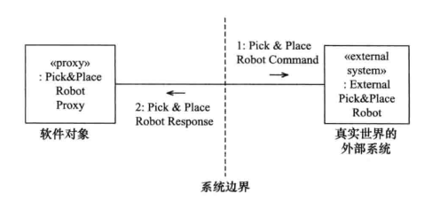

  - **设备IO**

  边界类对象与外部类对象不同，它是在系统内部的

  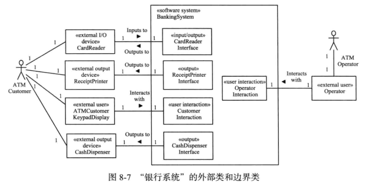

- **控制对象**（控制层）

  - **协调者对象**，它做出总体决策，并决定其他对象何时、以何种顺序执行。

    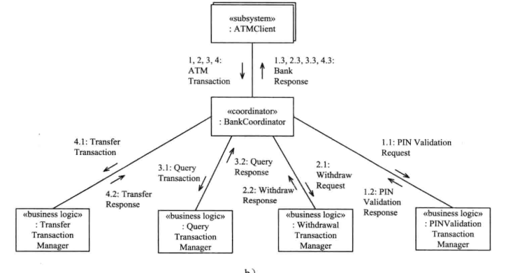

  - **状态相关的控制对象**，一般用有限状态机来描述

  - **计时器对象**是一个由外部计时器激活的控制对象。计时器对象要么自己执行某个动作，要么激活另一个对象来执行期望的动作。

    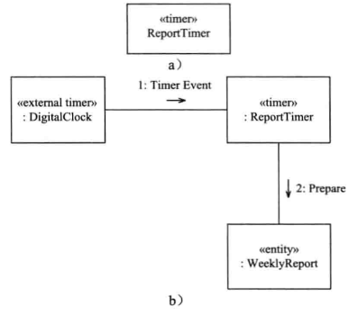

- **应用逻辑对象**

  - **业务逻辑对象**

    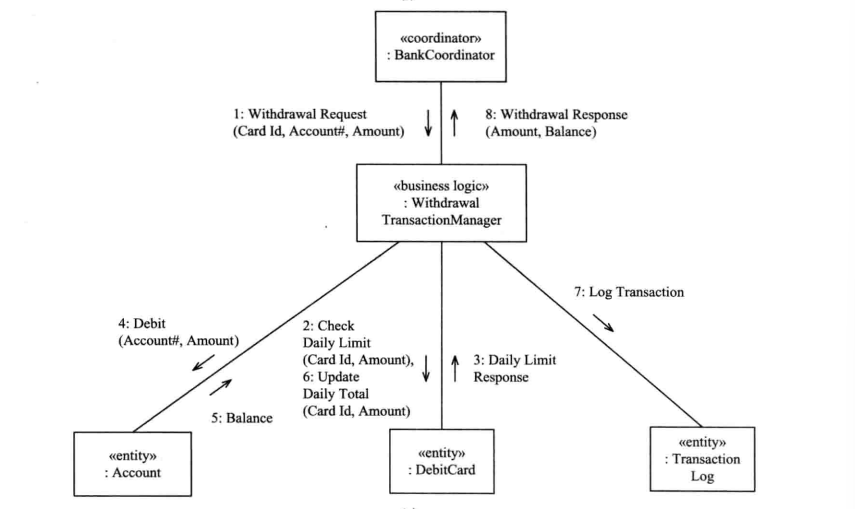

  - **算法对象**

    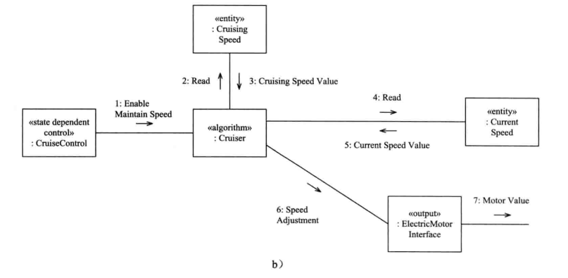

  - **服务对象**

## 交互图

通信图和顺序图是UML的两种主要类型的交互图，它们用来描绘对象间是如何进行交互的。COMET更加偏爱通信图，因为使用通信图更容易整合相关信息，来创建软件系统体系结构。

通常我们要么使用通信图，要么使用顺序图来对系统进行动态描述，而不是两种同时使用。

交互图有两种形式：

- **通用形式**：描述在对象之间的所有交互关系（整个用例），因此会包含循环、分支和条件。
- **实例形式**：描述一个特定的场景（用例的一条特定路径）


通信图或者顺序图上的消息都会被赋予消息序列编号。它遵循以下语法：

~~~uml
[序列表达式]: 消息名称(参数列表)
~~~

- **序列表达式**

  - **消息序列编号**，语法如下：`[第一个可选的字母序号][数字序号][第二个可选的字母序号]`

    - 第一个可选的字母序号：用例ID
    - 数字序号：表示事件的顺序
    - 第二个可选的字母序号：用于描述分支情况。可替换序列可以用`M2A.1 M2A.2`的形式来表示，其中`M2`是主序列中的一个步骤。

  - **循环**
  - *[迭代语句]
    - [条件语句]

- **消息名称**

- **参数列表**


**消息序列描述**是一种支持性的文档。它描述了从源对象到目标对象的消息序列发送，以及当一个目标对象收到一个消息的时候会做些什么。

### 通信图

通信图是一种 UML交互图，它从动态的视角描绘了一组对象是怎样通过对象间消息传递来进行相互交互的。

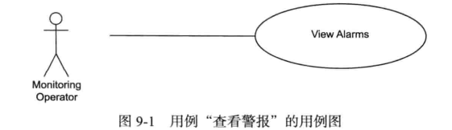

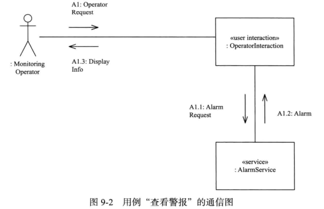

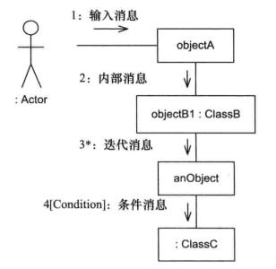

星号(*)表示一个可选的迭代， 即一条消息被发送了多于一次。一个可选的条件(condition) 表示一条消息在满足特定条件的情况下才会被发送。


**主动对象**可用于描绘一个拥有自己线程的对象。**被动对象**依附于其他对象的线程中。

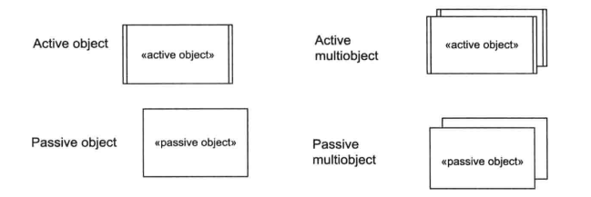

并发通信图中任务之间的消息接口可以是异步的（松耦合），也可以是同步的（紧耦合）。简单消息是指消息类型可能为同步的，也可能为异步的。

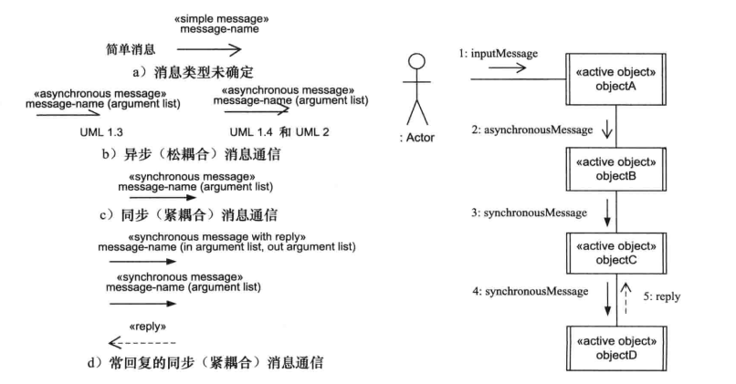

一般可以省略返回消息

### 顺序图

顺序图按时间顺序展示了对象之间的交互。顺序图以下部分构成：

1. 激活条（控制焦点）
2. 角色
3. 生命线(LifeLine)
4. 消息

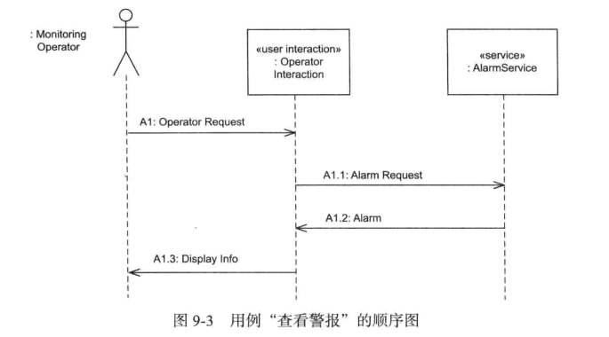

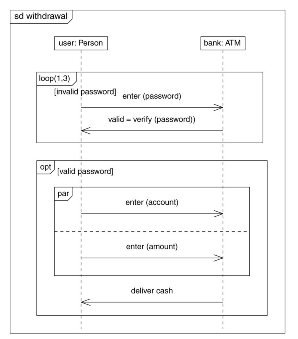

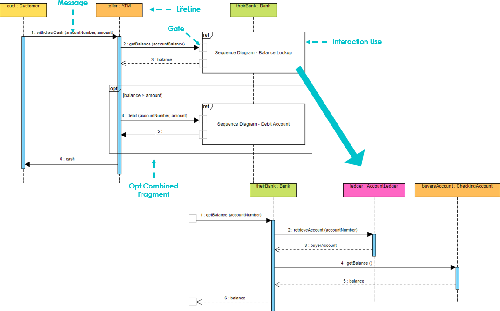

## 有限状态机


**状态机图(State Machine diagram)**：

`Event[Condition]/Action`

- 事件（Event）引起了状态的转换。逗号分割多个事件用于表示或逻辑。如果没有事件，则表示立即进行转移。
- 当事件发生时，只有布尔条件（Condition）为真，才会发生状态转换。
- 动作（Action）。逗号分割多个动作，动作之间不应存在任何依赖关系。

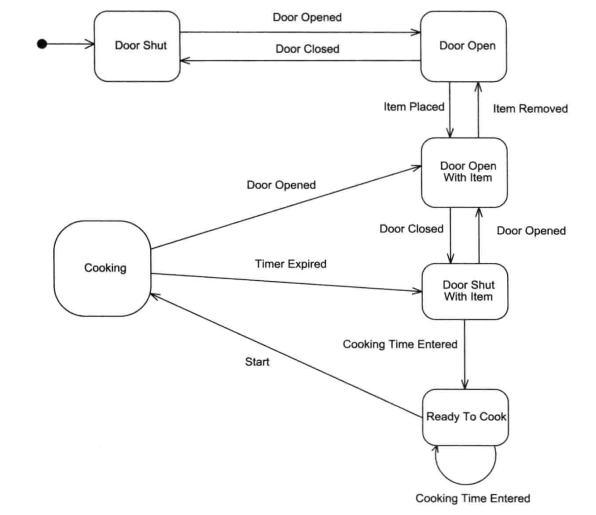


高级状态：

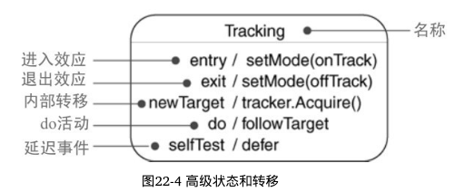

- **进入动作(entry action)**，它在进入状态的时候执行 

- **退出动作(exit action)**，它在退出状态的时候执行

- **内部转移**，在不离开当前状态的情况下，相应事件。它与自身转移有一些细微的不同。自身转移会退出又重新进入该状态，进而触发进入动作和退出动作，而内部转移不会触发

- **do动作**，当处于该状态时，会一直执行该动作，直至退出该状态

  


带有**正交区域（orthogonal region）**的组合状态，表示状态同时处于多个子状态。以下图为例，它描述了一个被分解为**正交区域（orthogonal region）**BC 和 BD的组合状态B。在这种情况下， 状态图在同一个时刻进入了每一个正交区域BC和BD中。每一个正交的子状态被进一步分解为顺序的子状态。因此，当进入组合状态B时，同样进入了状态B1和B3。

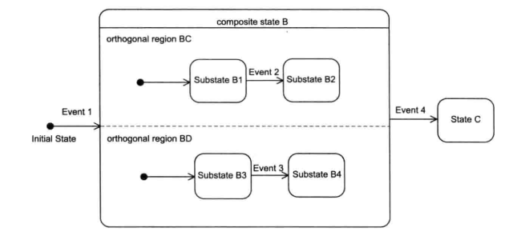


状态机还有另一个特性——**子状态**，它更能帮助简化对复杂行为的建模


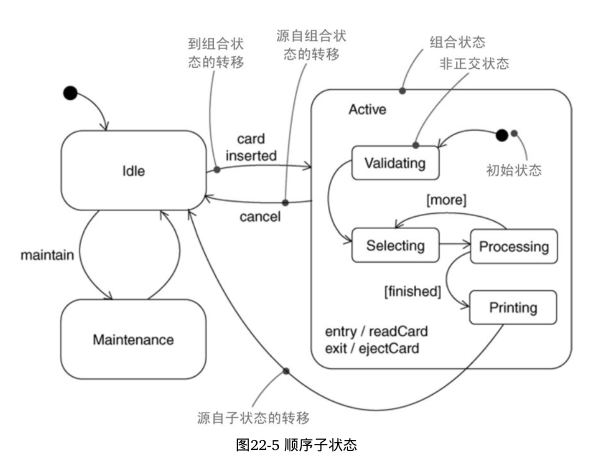

注意，由cancel事件触发的、从Active状态到Idle状态的转移。在Active的
任何子状态中，顾客都可能取消这个事务，并使ATM返回到Idle状态。

此外，对于Printing到Idle的状态转移来说，由于离开了组合状态，因此会触发组合状态的exit动作——ejectCard


**历史状态**允许一个组合状态记住它上一次最后转移的子状态

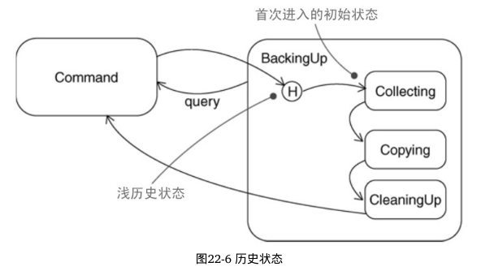

例如，当处于Copying子状态时，如果接收到query事件，则状态转移到Command上。当再次进入BackingUp状态时，会跳过Collecting子状态，直接进入Copying子状态。

浅历史只能记住最外层的嵌套状态，而深历史则可以在任何深度上的嵌套状态。


并发状态允许状态机同时存在多个状态。

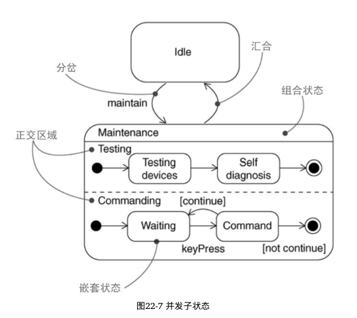

如果一个正交区域A先于另一个B到达它的最终状态，那么这个区
域A将被阻塞，直至另一个区域B也到达了最终状态。


一个外部状态可以直接转移到一个或多个正交状态，这叫做**分岔**。每个正交区域内必须至多有一个目标状态。如果某个正交区域内没有目标状态，那么隐式地选择区域的初始状态作为目标状态

如果在`Self diagnose`状态时发生了错误，就会激活到Repair的隐式的汇合转移：无论是`Self diagnose`状态，还是`Commanding`区域内的任意状态都会被退出。图中还有一个到状态`Offline`的显式的汇合转移。只有当 `Testing`
`devices` 状态和 `Commanding` 区域的最终状态是活动的，而且`disconnect`
事件发生，才会激活这个转移。

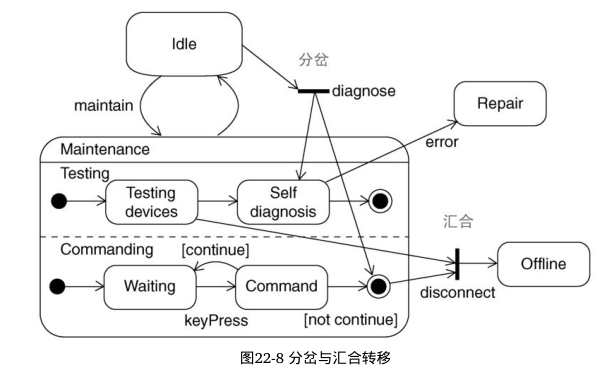


## 包

在UML中，包是一组建模元素的组合。

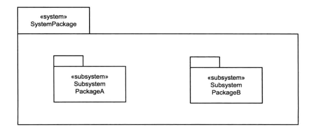

包之间可以存在依赖(dependency)和泛化/特化(generalization/specialization)关系。

## 部署图

**部署图(Deployment diagram)**以物理结点和结点间物理连接的方式(例如网络连接)展示了一个系统的物理配置。

物理连接具有一个表示连接类型的构造型(stereotype)，例如《wide area network》)或《local area network》。

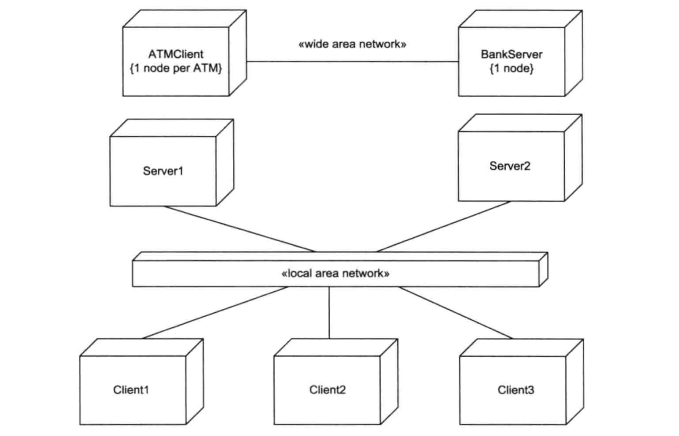

## 构件

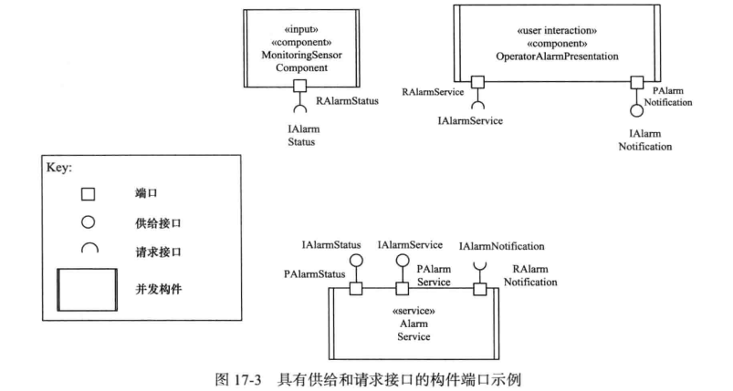

「**供给接口**」定义了构件必须实现的操作。「**请求接口**」定义了其他构件需为本构件提供的操作

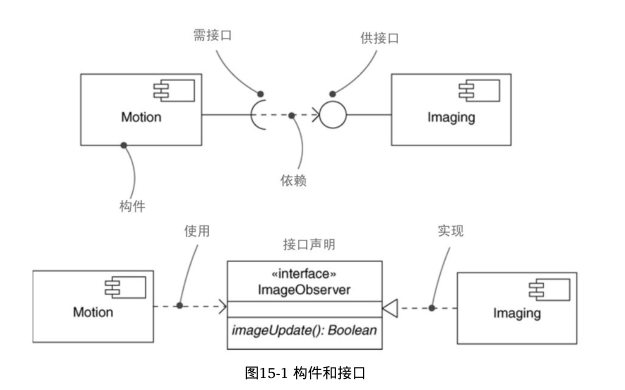

注：这个依赖关系（虚箭头）可以省略不画。


下图表示将“MonitoringSensor”的 RAlarmStatus 请求端口连接到“Alarm”的 PAlarmStatus 供给端口上。

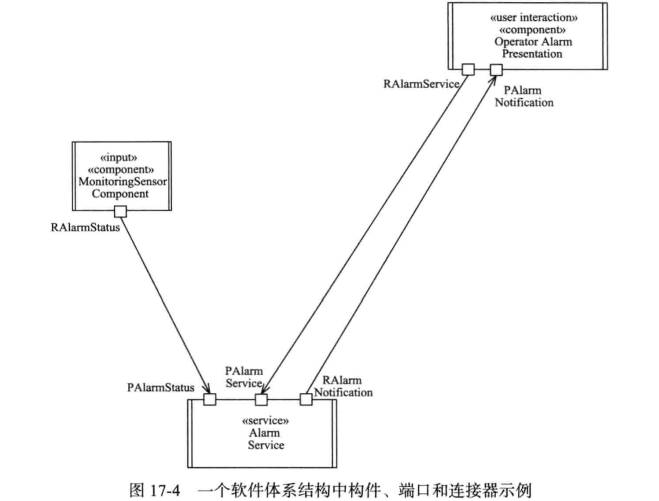


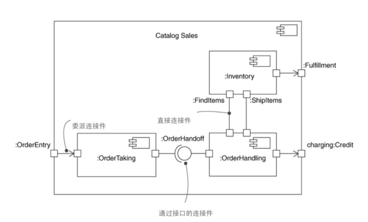

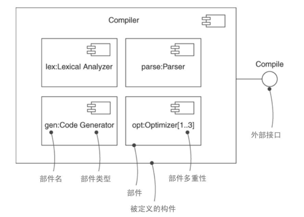

## UML扩展

UML提供了三种语言扩展机制：

- **构造型(stereotype)**定义了一个从已有UML建模元素中派生出来的、且针对建模者问题进行裁 剪的构造块，允许一个建模元素被附加多个构造型。造型是用书名号`《》`表示的。
- **标记值(tagged value)**扩展了一个UML构造块的属性，从而为其增加新的信息。以`{标记=值}`来表示
- **约束(constraint)**指定了一个必须为真的条件，是一个UML元素语义的扩展。例如，`{balance>=0}`


## 无状态动态交互建模

无状态的动态交互建模方法的主要步骤如下：

1. 完成用例建模
2. 确定用例所需的对象（边界对象、控制对象等）
3. 确定消息通信序列：这个序列通常由一 个来自参与者(外部对象)的外部输入开始，紧着跟的是参与软件对象之间的内部消息序列，最终到一个参与者(外部对象)的外部输出。
4. 确定可替换序列：


我们以「下单请求」用例为例，来说明如何进行无状态动态交互建模

用例建模

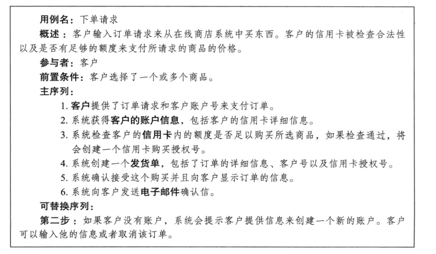

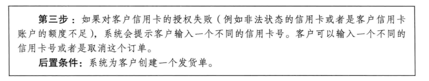

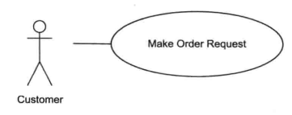


确定用例所需的对象：略


确定消息通信序列

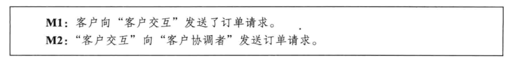

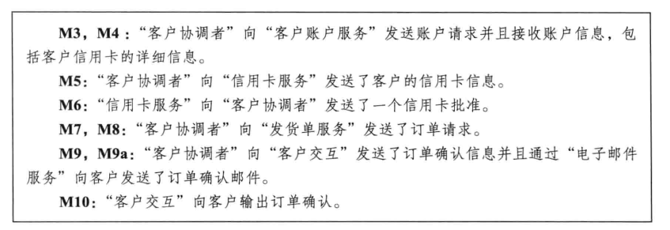

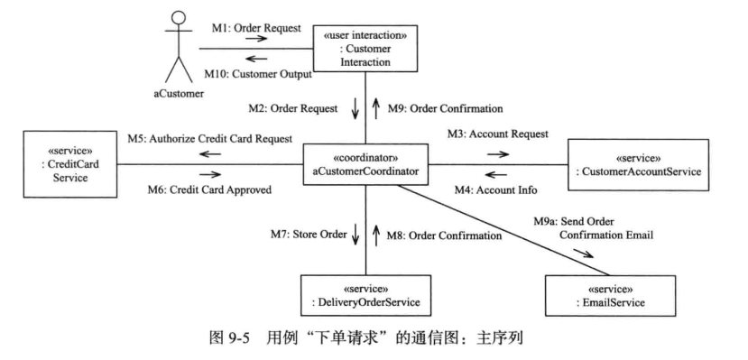


确定可替换序列


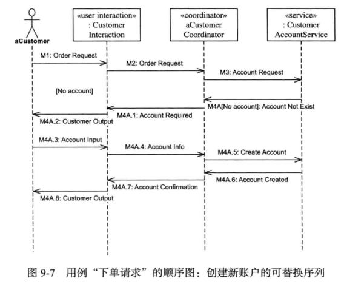


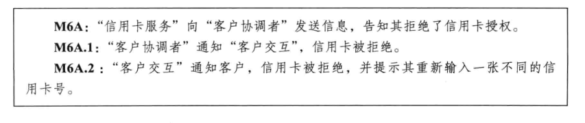

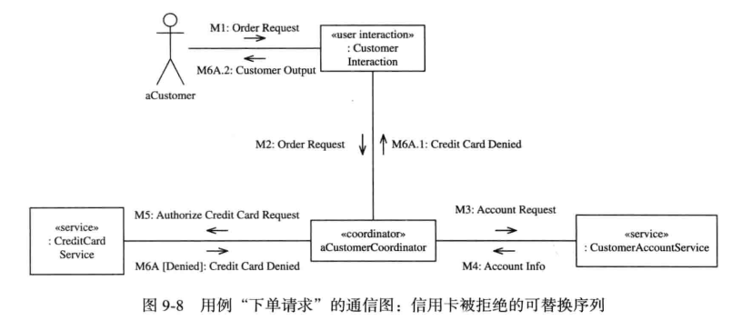


交互图的通用形式

.png)

-1708397927722-10.png)

## 状态动态交互建模

1. 确定边界对象
2. 确定状态相关的控制对象
3. 确定其他的软件对象（业务逻辑对象）
4. 确定主序列场景中的对象交互
5. 确定状态图的执行
6. 考虑可替换序列场景

通常来说，一个交互图中的消息指的是状态图中的一个事件。


我们以「验证PIN码」为例，来说明如何进行建模

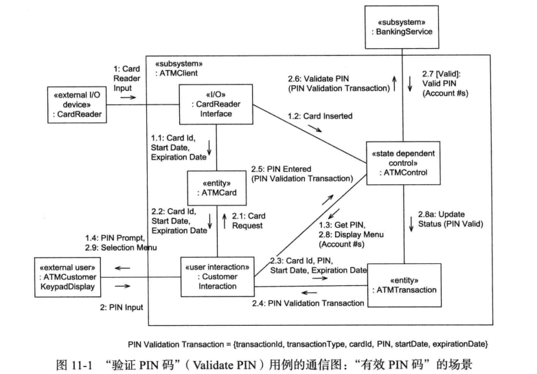

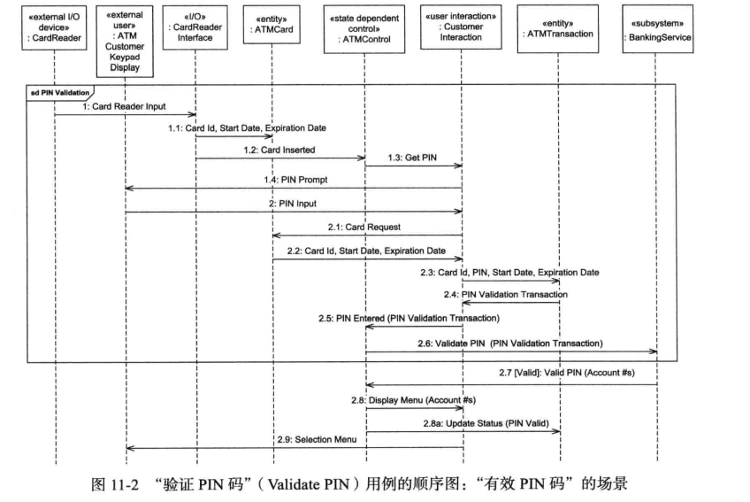

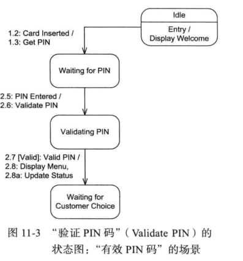

